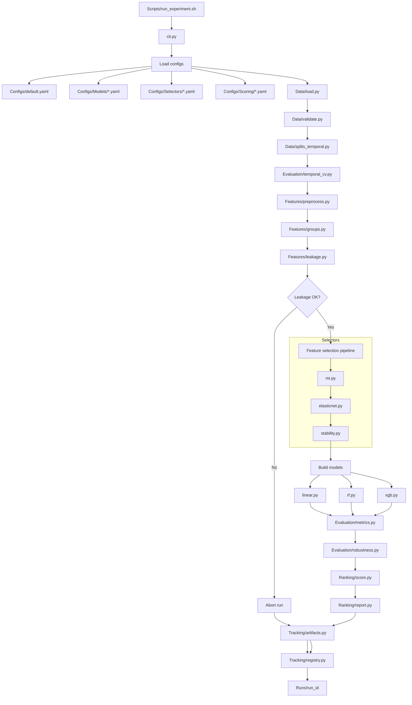

# BIG BRAIN IDEA

**Author:** Jakob Balkovec  
**Date:** Fri Jan 16th

---

This whole module exists because I couldn't simply solve the problem of:

> What features would maximize the performance of this model? What features would provide most signal when combined?

In both theory and practice this is a very hard problem to solve, since we're not only trying to maximize the performance of the model, but also make it robust and stable.

This is where my big brain idea comes in.

## `MERMAID` Diagram:

> Just noticing this is very hard to read...sorry

---

## The Pipeline

### Overview

At its core, this pipeline answers one question:

> **Which features actually help predict soil moisture over time, without cheating or falling apart later?**

It is not a modeling pipeline.
It is not a data ingestion pipeline.
It is a **feature selection and validation pipeline** that treats time seriously :)

Think of the pipeline as a **feature audition**.

Every feature shows up with a "resume full of promises":

- “I correlate with soil moisture”, etc.

The pipeline doesn’t care really...

Each feature must:

1. Be informative
2. "Play nicely with others"
3. Work consistently over time
4. Improve real predictive performance

If it fails any of those, it’s out.

### What Goes In

- Precomputed temporal splits (train / validation / test)
- Our largo feature set (`n=352` as of this moment)
  (raw satellite bands, indices, SAR physics, hydrologic memory, temporal dynamics)
- Fixed scoring rules

> Note: Nothing inside the pipeline changes the splits
> Note: **Time is treated as immutable**

### What Happens Internally

#### Step 1: Remove obviously bad actors

Before any “intelligence” happens, the pipeline removes features that:

- Are constant or near-constant
- Are mostly missing
- Are redundant beyond usefulness

> This is because I forgot to do that when making the splits...

This step is boring but essential

---

#### Step 2: Ask “does this feature know anything at all?”

Each remaining feature is tested independently for information content.

Formally, the pipeline asks:

$$I(X; y) > 0$$

If a feature has no mutual information with soil moisture, it is discarded

> This step favors signal over theory

---

#### Step 3: Ask “does this feature still matter in a crowd?”

Surviving features are evaluated together using regularized linear models.

`ElasticNet` enforces two constraints simultaneously:

- Sparsity (not everything gets to stay)
- Group behavior (correlated features must compete)

Conceptually, the pipeline solves:

$$\min\_{\beta} \|y - X\beta\|^2 - \lambda \left( \alpha \|\beta\|\_1 + (1-\alpha)\\beta\|\_2^2 \right)$$

> Yoinked from: https://hastie.su.domains/glmnet/glmnet_beta.html#install

If a feature only works when isolated, it dies here

---

#### Step 4: Ask “does this work over time, or was it a fluke?”

This is the most important step

A feature must survive **multiple temporal contexts**:

- Different seasons
- Different wetness regimes
- Different historical windows
- Others that I might think of on the way

Features that appear inconsistently are removed, even if they occasionally boost \( R^2 \)

> This step enforces temporal stability, not peak performance

---

#### Step 5: Evaluate the remaining feature set honestly

Only after selection is complete do models enter the picture

Multiple models are used as judges, not optimizers

Performance is measured using:

- Mean \( R^2 \)
- Variance of \( R^2 \)
- Train–validation gap

> A feature set that scores well once but poorly later is penalized

---

#### Step 6: Rank, don’t worship

The pipeline does not declare a single “best” feature...

Instead, it computes a score that balances:

- Predictive strength
- Stability over time
- Generalization
- Feature count

$$\text{Score} = \mu(R^2) - \sigma(R^2) - |\text{train} - \text{val}| - \text{complexity penalty}$$

This prevents fragile, overfit solutions from winning

---

### What Comes Out

- A small, defensible feature set (for example, top `40`)
- Evidence showing why each feature survived
- Performance metrics that reflect time, not luck
- Artifacts that make every decision reproducible

### What This Pipeline Is Not

- It is not a hyperparameter tuning tool
- It is not trying to maximize a single test \( R^2 \)
- It does not encode hydrology knowledge directly

Instead, it enforces a simple rule:

> **If a feature can’t survive time, it doesn’t belong in the model**

### The Philosophy (Why This Matters)

Maximizing \( R^2 \) is easy.

Maximizing **trustworthy** \( R^2 \) is hard!

This pipeline is designed to prefer:

- Features that generalize
- Models that stay boring
- Improvements that persist

In short, it trades short-term excitement for long-term reliability

And that’s exactly what we need. This will hopefully come close to the most optimal solution for our problem.

---

_Jakob Balkovec_
