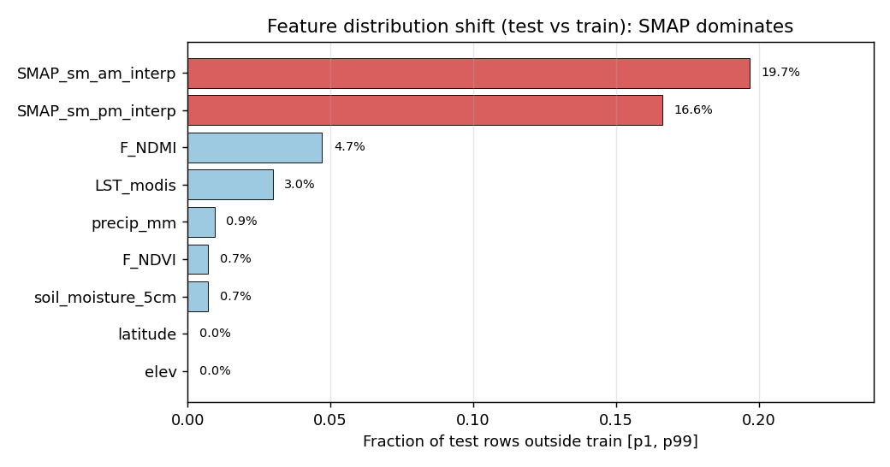
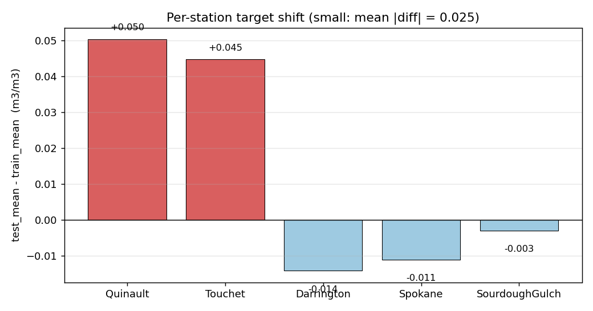
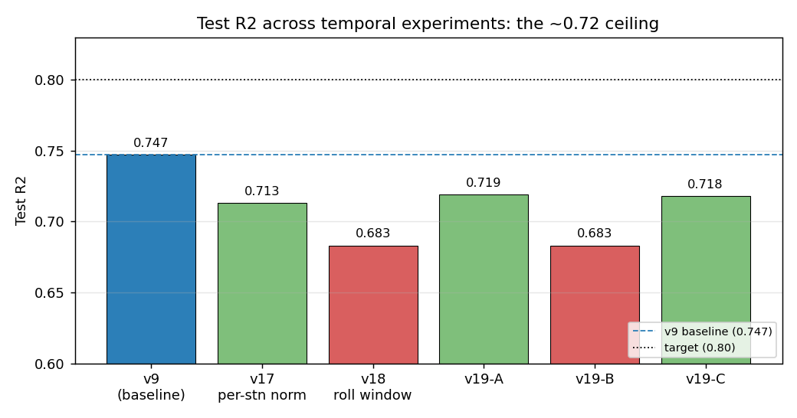

# LSTM Temporal Experiments, Findings & Next Steps

## What I Did This Week
Starting from Daniel's v9 BiLSTM+Attention baseline (test R² = 0.747, val R² = 0.845), I ran
three experiments to understand the val→test gap.

### Experiment 1, Split Audit (`audit_split.py`)
Finding: the gap is temporal, not spatial.

All 5 stations (Darrington, Quinault, SourdoughGulch, Spokane, Touchet) appear in both train
and test (`train ∩ test = 5/5`; Touchet is absent from val). So the train→test degradation is
not caused by unseen stations, it's distributional shift across years within the same stations.

The dominant shift is in SMAP features, fraction of test rows outside the train [p1, p99] range:

| Feature | OOD fraction |
|---|---|
| SMAP_sm_am_interp | 19.7% |
| SMAP_sm_pm_interp | 16.6% |
| F_NDMI | 4.7% |
| All other features | < 3% |

Test years (2023–2025) run systematically higher SMAP soil-moisture readings than train years
(2017–2020). Per-station target shift is small (mean |diff| = 0.025 m³/m³), so the problem is
in the inputs, not the target.

### Experiment 2, Per-Station Target Normalization (`train_v17.py`)
Finding: did not help. Test R² = 0.713 vs. v9's 0.747.

Subtracting each station's train-period target mean (train on residuals, reconstruct at inference)
improved bias substantially (−0.003 vs. −0.010) but hurt variance capture. Because station
means are stable across years (~0.025 shift), de-meaning removed useful signal without reducing the
actual thing the model struggles with (input-side variance).

### Experiment 3, Rolling Window & Temporal CV (`train_v18.py`, `train_v19.py`)
Finding: expanding the training window did not beat baseline on the 2023–2025 holdout.

| Version | Train years | Test years | Test R² |
|---|---|---|---|
| v9 (baseline) | 2017–2020 | 2023–2025 | 0.747 |
| v18 | 2017–2021 | 2023–2025 | 0.683 |
| v19-A | 2017–2020 | 2022–2025 | 0.719 |
| v19-B | 2017–2021 | 2023–2025 | 0.683 |
| v19-C | 2017–2022 | 2024–2025 | 0.718 |

v19 Fold B reproduces v18 exactly, which cross-validates both scripts. Every temporal
configuration lands in 0.68–0.72.

> Caveat (important): this result is confounded. v18 and all v19 folds use a 1-year val set
> with the 250-epoch OneCycleLR schedule, so early stopping fires at epoch ~13, the model
> never gets a fair run. This means v18's drop below baseline may be a training-config artifact, not
> proof that more data fails. Treat the ~0.72 ceiling as suggestive, not proven, until the
> scheduler is fixed (see next step #1).

> Metric note: Touchet's test set is n=170 with std collapsed to 0.030, its per-station R² is
> effectively a metric artifact (low-variance denominator) and slightly depresses the aggregate.

## What We've Ruled Out (so far)
| Approach | Result | Why |
|---|---|---|
| Per-station normalization (v17) | 0.713 | Stable means, removes useful signal |
| Expanded training window (v18) | 0.683 | Below baseline, but confounded by early stopping |
| Forward-chain CV (v19) | 0.683–0.719 | Consistent ~0.72 ceiling, same confound |
| Architecture search (v7–v16) | 0.685–0.747 | Ceiling holds across 10 variants |

## Root Cause (working hypothesis)
A substantial minority (~17–20%) of test-year SMAP readings fall outside the range the model was
trained on. Reordering which years sit in training doesn't fix this, those SMAP values simply
aren't well-represented in the 5-station derived_8.0 dataset. Temporal expansion within the same
stations appears to hit a wall (pending the scheduler fix above).

## Next Steps (priority order)
### Next Steps — Feature & Training Audit
1. Run v20 feature alignment on derived_8.0 before making another architecture claim.
   `train_v20.py` feeds Jakob's exact 38 MDR-v25 features to the v9 BiLSTM+Attention model as
   per-timestep inputs, then reports test R²/RMSE alongside v9 (0.747) and Jakob's XGBoost
   baseline (0.822). This closes the current feature-mismatch gap: if the LSTM remains lower, the
   issue is less likely to be only input selection.

2. Rank and prune the aligned features. v20 computes validation permutation importance by
   replacing each feature with its train-sequence mean across every validation timestep, saves
   `report_figs/lstm_feature_importance.png`, and retrains top-K subsets (K = 15, 20, 25). Pick
   the pruned run by validation RMSE, require < 38 features, and record whether its test R² meets
   or exceeds the full-38 run.

3. Fix the scheduler/early-stop confound and make a train-longer verdict. v20 replaces the
   250-epoch OneCycleLR setup with `ReduceLROnPlateau`, raises patience, logs val R² and val RMSE
   every epoch, and saves `report_figs/training_curve.png`. If the validation curve is still
   improving past the old epoch 8–13 stop point, the earlier v18/v19 conclusion was undertrained;
   if it has plateaued, convergence is genuine and the ~0.75 ceiling is more meaningful.

4. Sweep the sequence length empirically. `train_v20_window_sweep.py` uses the selected pruned
   feature set and sweeps seq_len ∈ {5, 7, 10, 14, 20, 30}, saving
   `report_figs/window_sweep.png` and a summary table. Caveat: windows are built after
   year-filtering in `dataset.py:_build_sequences`, so larger windows silently drop more rows at
   each split boundary.

5. Re-run the rolling-window/forward-chain checks with the fixed scheduler if v20 shows the old
   runs were undertrained. This is the corrected version of the previous scheduler-fix step; it is
   needed before we rely on the "more data doesn't help" result.

6. Add geographically diverse stations to training after the derived_8.0 audit is interpretable.
   The MoE handoff shows OR Riley (R² 0.614), ID Murphy (0.608), CA Redding (0.497) respond
   reasonably to the existing model. Stations from other climate zones widen the SMAP input
   distribution and should better overlap the 2023–2025 range. derived_9.0 (30 stations) is
   already built, train an LSTM on it as the next experiment.

7. SMAP-specific input normalization. Since SMAP is the dominant OOD feature, apply a rolling
   per-station standardization (normalize each SMAP reading against a trailing window of that
   station's own history) instead of a single global train-set scaler, reduces absolute shift even
   when year-to-year climatology differs.

8. Binary MoE path (handoff §5). Split Dry vs. Non-Dry with the 80%-accurate gating classifier,
   the temporal LSTM serves as the Non-Dry expert, shrinking the target range it must cover.

## Verification / how to confirm
- `python -m Models.Temporal.lstm.train_v20` runs end-to-end, prints the full-38 feature count,
  writes `outputs_v20/metrics.json`, and saves `report_figs/lstm_feature_importance.png` plus
  `report_figs/training_curve.png`.
- The full-38 test R² is reported alongside v9 (0.747) and Jakob's XGBoost baseline (0.822).
- The selected v20b pruned run records < 38 features in `metrics.json` and states whether its
  test R² meets or exceeds the full-38 run.
- `python -m Models.Temporal.lstm.train_v20_window_sweep` writes
  `outputs_v20/window_sweep_summary.csv`, `outputs_v20/window_sweep_metrics.json`, and
  `report_figs/window_sweep.png`, with the best seq_len selected by validation RMSE.
- If v20 shows the old epoch 8–13 stop point was undertrained, re-run v18/v19 with the fixed
  scheduler before moving to derived_9.0; then compare derived_9.0 test R² + SMAP OOD fraction
  against derived_8.0.

---

## Known Issues / Errors Found (for future work)
Code review of the v17–v19 scripts surfaced the following. None invalidate the headline
conclusions (which rest on val/test metrics), but they should be fixed before the next round.

### 1. BUG, v17 train-reconstructed metric is misaligned (wrong number reported)
`loader_train` is built with `shuffle=True` (`train_v17.py:306`) and is then reused for the
reconstruction eval (`train_v17.py:378, 393–396`), where predictions are added to the fixed-order
offset array `off_tr` (`y_pred_abs = y_pred_res + offsets`). Because the loader reshuffles every
pass, the returned predictions come back in random order while `off_tr` is in dataset order, so
each sample gets the wrong station's mean added back. The reported `train_reconstructed`
R² = 0.857 is therefore meaningless.
- Not affected: residual-space metrics (order-invariant) and val/test reconstructed metrics
  (those loaders use `shuffle=False`), so v17's headline test R² = 0.713 is valid.
- Fix: make a separate eval loader with `shuffle=False` for train, or reuse the already-computed
  residual predictions instead of re-running `predict_loader` (see issue #4).

### 2. CONFOUND, OneCycleLR is calibrated for 250 epochs but runs stop at epoch 8–13
All three scripts set `OneCycleLR(epochs=MAX_EPOCHS=250, steps_per_epoch=len(loader_train))`
(`train_v17.py:323`, `train_v18.py:242`, `train_v19.py:231`) while early stopping fires at
epoch 8 (v17) / 13 (v18, v19). The schedule never reaches its cosine-annealing tail, models are
checkpointed while the LR is still near its peak. This makes cross-variant comparison unfair,
especially for the 1-year-val folds (v18/v19) that stop soonest. This is the root of the
"more data doesn't help" caveat above.
- Fix: set `epochs` to a realistic budget (e.g. match observed early-stop horizon), or switch to
  `ReduceLROnPlateau` / cosine that degrade gracefully when training halts early. This is
  next-step #1.

### 3. DESIGN, v18/v19 window after year-filtering, so windows never cross year boundaries
Splits are filtered by `year` and then windowed (`train_v19.py:199–200`; dataset windows per
station in `dataset.py:_build_sequences`). A 10-day window can't reach back into the previous
(train) year, so the first ~10 days of each test year per station are silently dropped and
there is a hard gap at every split boundary. This is conservative (no leakage) but discards data
and means "test 2023–2025" actually begins ~10 days into 2023. Note for reproducibility, consider
building windows on the full timeline and assigning each window to a split by its target date.

### 4. MINOR, v17 runs inference twice and duplicates work
The residual loop (`train_v17.py:384`) and reconstruction loop (`train_v17.py:393`) each call
`predict_loader` over the same three loaders, six forward passes where three suffice. Compute once,
derive both spaces. (Fixing this naturally resolves issue #1.)

### 5. NOTE, Touchet is a degenerate test station (metric artifact, not a bug)
n=170, test std=0.030, 0 val rows. Its per-station R² is unreliable (low-variance denominator) and
depresses the aggregate. Consider reporting per-station R² and/or excluding Touchet from the
headline test metric in future runs.
