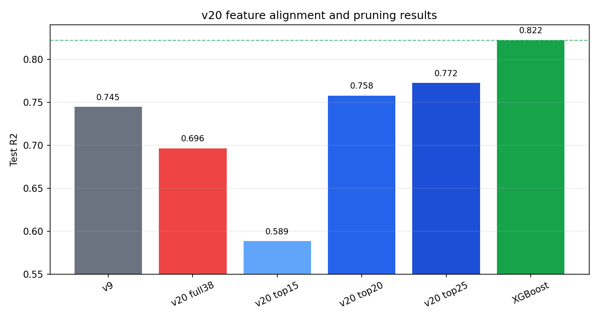
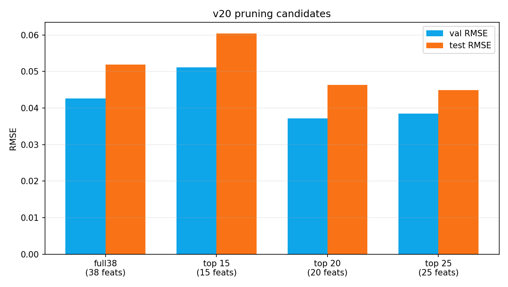
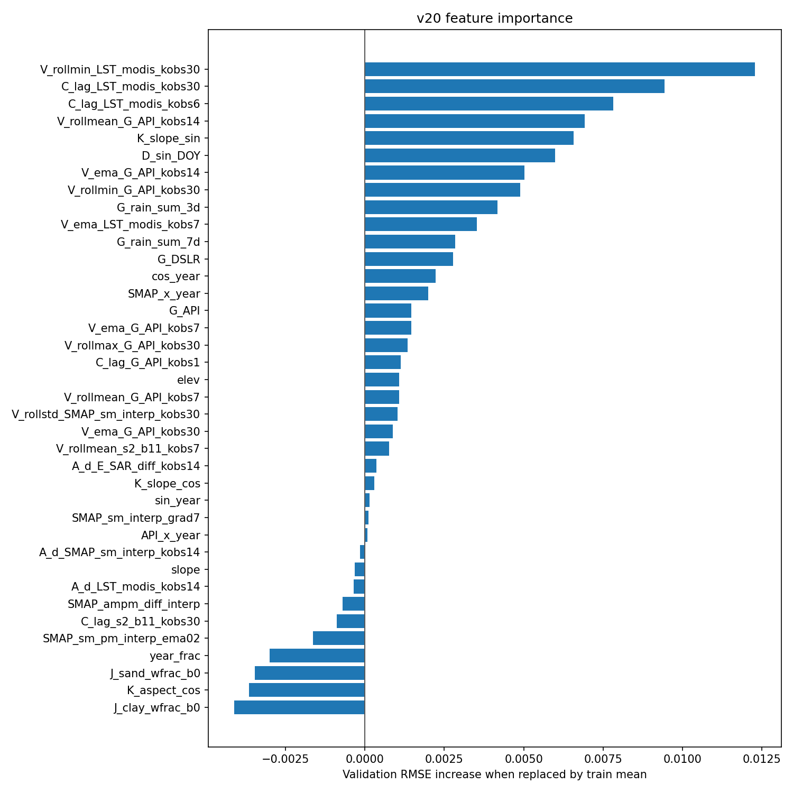
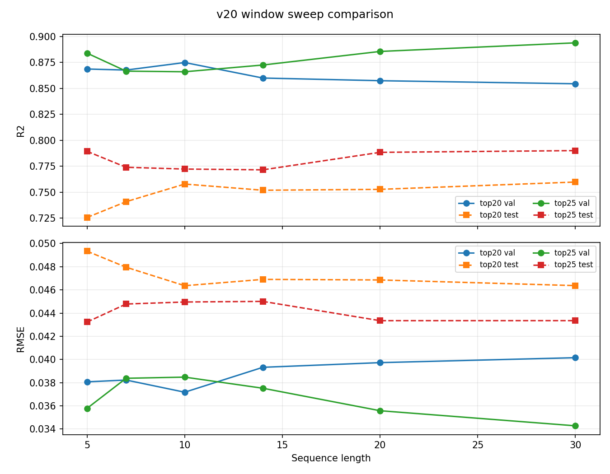
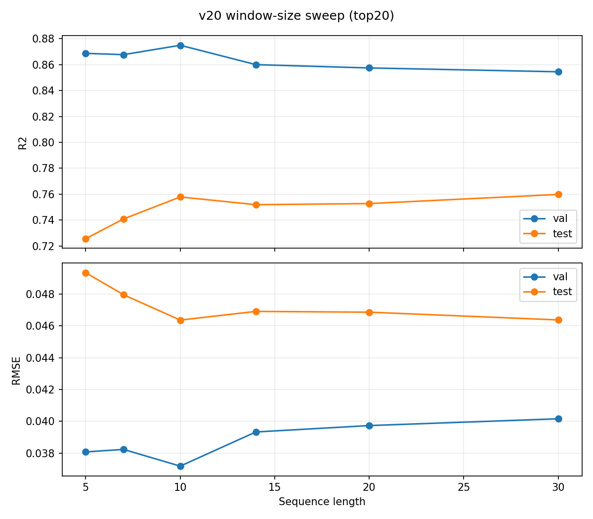

# LSTM Temporal Experiments, Findings & Next Steps

## What I Did This Week
Starting from the 06-30 action list, I completed the v20 audit on `derived_8.0`: aligning the
temporal LSTM to Jakob's 38-feature XGBoost input set, pruning those features by LSTM validation
importance, checking the scheduler/training-length confound, and sweeping sequence length.

Comparison anchors:
- v9 BiLSTM+Attention: test R2 = 0.747
- Jakob XGBoost one-model baseline: test R2 = 0.822
- All v20 runs use the same `derived_8.0` split for apples-to-apples comparison

### Experiment 1, 38-Feature Alignment (`train_v20.py`)
Finding: feature alignment alone did not close the gap.

The full-38 v20 model uses Jakob's exact 38 MDR-v25 features as per-timestep LSTM inputs. It
underperformed both the v9 temporal baseline and Jakob's XGBoost model:

| Run | Feature count | Val R2 | Val RMSE | Test R2 | Test RMSE | Notes |
|---|---:|---:|---:|---:|---:|---|
| v9 baseline | 30-ish | -- | -- | 0.747 | -- | Previous BiLSTM+Attention anchor |
| v20 full38 | 38 | 0.836 | 0.0426 | 0.696 | 0.0519 | Jakob feature alignment only |
| Jakob XGBoost | 38 | -- | -- | 0.822 | -- | Tabular one-model baseline |

So the LSTM/XGBoost gap is not explained by the LSTM missing Jakob's feature set. In fact, feeding
all 38 aligned features to the LSTM made the model worse than v9.

### Experiment 2, Feature Pruning & Importance (`train_v20.py`)
Finding: pruning is the useful part of v20.

Permutation importance was computed on the validation set by replacing each feature with its
train-sequence mean across every validation timestep. The pruned runs show that the LSTM benefits
from fewer, better-aligned dynamic features:

| Run | Feature count | Selection rule | Val R2 | Val RMSE | Test R2 | Test RMSE | Notes |
|---|---:|---|---:|---:|---:|---:|---|
| v20 full38 | 38 | Jakob feature alignment | 0.836 | 0.0426 | 0.696 | 0.0519 | All 38 features are not helpful inside the LSTM |
| v20 top15 | 15 | Top-K importance | 0.763 | 0.0511 | 0.589 | 0.0604 | Too aggressive; drops important signal |
| v20 top20 | 20 | Best validation RMSE at seq_len=10 | 0.875 | 0.0372 | 0.758 | 0.0464 | Beats v9 |
| v20 top25 | 25 | Sensitivity candidate at seq_len=10 | 0.866 | 0.0385 | 0.772 | 0.0450 | Best test result before the window sweep |

Most important validation features:
1. `V_rollmin_LST_modis_kobs30`
2. `C_lag_LST_modis_kobs30`
3. `C_lag_LST_modis_kobs6`
4. `V_rollmean_G_API_kobs14`
5. `K_slope_sin`

Lowest / harmful-by-ablation features:
1. `J_clay_wfrac_b0`
2. `K_aspect_cos`
3. `J_sand_wfrac_b0`
4. `year_frac`
5. `SMAP_sm_pm_interp_ema02`

Interpretation: LST/API lag summaries are carrying the aligned LSTM, while several static soil and
aspect features look redundant or harmful in this sequence model. XGBoost feature usefulness does
not transfer directly into LSTM usefulness.

### Experiment 3, Training-Length Audit (`train_v20.py`)
Finding: the v20 pruned candidates are not undertrained.

The longer-training audit used `max_epochs=500` and `patience=120` for the two relevant pruned
feature sets. Neither improved beyond the original best validation checkpoint.

| Run | Seq len | Best epoch | Epochs run | Val R2 | Val RMSE | Test R2 | Test RMSE | Verdict |
|---|---:|---:|---:|---:|---:|---:|---:|---|
| top20 long train | 10 | 23 | 143 | 0.875 | 0.0372 | 0.758 | 0.0464 | Not undertrained |
| top25 long train | 10 | 11 | 131 | 0.866 | 0.0385 | 0.772 | 0.0450 | Not undertrained |

The short early-stop concern was real for interpreting v18/v19, but for v20 top20/top25 the best
checkpoints happen early and do not improve with a much longer budget. The fix is not "train
longer"; it is feature/window selection.

### Experiment 4, Sequence-Length Sweep (`train_v20_window_sweep.py`)
Finding: the window sweep changes the recommendation. Top25 with `seq_len=30` is now the best
validation-selected and best test-performing v20 candidate.

Top20 feature set:

| Seq len | Val R2 | Val RMSE | Test R2 | Test RMSE | Best epoch |
|---:|---:|---:|---:|---:|---:|
| 5 | 0.869 | 0.0381 | 0.726 | 0.0493 | 36 |
| 7 | 0.868 | 0.0382 | 0.741 | 0.0480 | 28 |
| 10 | 0.875 | 0.0372 | 0.758 | 0.0464 | 23 |
| 14 | 0.860 | 0.0393 | 0.752 | 0.0469 | 18 |
| 20 | 0.857 | 0.0397 | 0.753 | 0.0469 | 13 |
| 30 | 0.854 | 0.0402 | 0.760 | 0.0464 | 23 |

Top20 decision: `seq_len=10` wins by validation RMSE.

Top25 feature set:

| Seq len | Val R2 | Val RMSE | Test R2 | Test RMSE | Best epoch |
|---:|---:|---:|---:|---:|---:|
| 5 | 0.884 | 0.0358 | 0.789 | 0.0432 | 80 |
| 7 | 0.867 | 0.0384 | 0.774 | 0.0448 | 11 |
| 10 | 0.866 | 0.0385 | 0.772 | 0.0450 | 11 |
| 14 | 0.873 | 0.0375 | 0.772 | 0.0450 | 26 |
| 20 | 0.886 | 0.0356 | 0.788 | 0.0433 | 27 |
| 30 | 0.894 | 0.0343 | 0.790 | 0.0433 | 21 |

Top25 decision: `seq_len=30` wins by validation RMSE and has the best overall v20 test R2.

Final v20 candidate from these experiments:
- Feature set: top25
- Sequence length: 30
- Scheduler: `ReduceLROnPlateau`
- Test R2: 0.790
- Test RMSE: 0.0433

## What We've Ruled Out (so far)
| Approach | Result | Why |
|---|---|---|
| 38-feature alignment only | 0.696 test R2 | All aligned features add noise/redundancy for the LSTM |
| Top15 pruning | 0.589 test R2 | Too aggressive; drops important sequence signal |
| Training longer | No improvement | Top20/top25 best checkpoints still occur early |
| Keeping top20 as the final candidate | 0.758 test R2 at seq_len=10 | Top25 with seq_len=30 wins by validation RMSE and test R2 |
| Another small training-budget tweak | Low priority | The main gains came from feature/window selection, not more epochs |

## Root Cause (working hypothesis)
The temporal LSTM is sensitive to how the aligned tabular features are converted into sequences.
Matching XGBoost's full feature list is insufficient because several features that help a tree
model appear redundant or harmful in the LSTM. The useful signal is concentrated in LST/API lag and
rolling-window summaries, and the best candidate needs a longer 30-day context.

The remaining gap to XGBoost is smaller but still meaningful: v20 top25 seq30 is 0.032 R2 below
Jakob's 0.822. At this point the gap is less likely to be caused by missing features or
undertraining, and more likely tied to sequence construction, station coverage, or model class.

## Next Steps (priority order)
### Next Steps - v20 Finalization & Station Expansion
1. Audit `seq_len=30` sample coverage before declaring v20 final. Windows are built after
   year-filtering in `dataset.py:_build_sequences`, so longer windows drop more split-boundary
   rows. This is conservative for leakage, but changes which rows are evaluated.

2. Update the v20 training defaults/config to the current best candidate:
   - feature set: top25
   - `seq_len=30`
   - scheduler: `ReduceLROnPlateau`

3. Re-run the final v20 configuration once with the fixed defaults and record the result alongside
   v9 (0.747), v20 full38 (0.696), v20 top20 (0.758), v20 top25 seq30 (0.790), and Jakob XGBoost
   (0.822).

4. If the split-boundary/sample-coverage audit does not reveal a comparability problem, treat
   top25 + `seq_len=30` as the `derived_8.0` temporal LSTM default.

5. Move the next experiment to `derived_9.0` station expansion rather than another small
   architecture tweak. The v20 audit suggests station/data coverage is a more plausible next
   source of improvement than another training-budget adjustment.

6. Repeat the SMAP OOD and per-station diagnostic plots on the final v20 candidate so the
   `derived_8.0` to `derived_9.0` comparison is interpretable.

## Verification / how to confirm
- `python -m Models.Temporal.lstm.train_v20` runs end-to-end and writes
  `outputs_v20/metrics.json`, `outputs_v20/feature_importance.json`,
  `report_figs/lstm_feature_importance.png`, `report_figs/training_curve.png`,
  `report_figs/v20_test_r2_comparison.png`, and `report_figs/v20_pruning_rmse.png`.
- `python -m Models.Temporal.lstm.train_v20_window_sweep` writes the top20/top25 window-sweep
  summaries and metrics under `outputs_v20/`, plus `report_figs/window_sweep_top20.png`,
  `report_figs/window_sweep_top25.png`, and `report_figs/window_sweep_comparison.png`.
- The final candidate is recorded as top25 + `seq_len=30` with test R2 = 0.790 and test RMSE =
  0.0433.
- The comparison table explicitly includes v9 (0.747), v20 full38 (0.696), v20 top20 (0.758),
  v20 top25 seq30 (0.790), and Jakob XGBoost (0.822).
- Before moving to `derived_9.0`, confirm whether the `seq_len=30` row coverage is comparable to
  the shorter-window runs.

---

## Known Issues / Errors Found (for future work)
No new blocking code bugs were identified in this pass. The main issues are comparability and
experiment-design risks before calling v20 final.

### 1. DESIGN, seq_len=30 changes sample coverage
Windows are built after year-filtering in `dataset.py:_build_sequences`, so `seq_len=30` silently
drops more rows at each split boundary than `seq_len=10`. This avoids leakage, but the final
top25 seq30 result is not evaluated on exactly the same target rows as shorter-window runs.
- Fix: report row counts per split/station for each sequence length, or build windows on the full
  timeline and assign each window to a split by its target date.

### 2. DECISION, validation and test rankings shifted during pruning
At `seq_len=10`, top20 was selected by validation RMSE while top25 had better test R2. After the
window sweep, top25 seq30 wins by both validation RMSE and test R2, but the selection path should
be documented so the final result does not look test-chosen.
- Fix: present top25 seq30 as the validation-selected window-sweep winner, not as a retrospective
  test-set pick.

### 3. NOTE, XGBoost still leads the best LSTM
The best v20 result is test R2 = 0.790, still below Jakob's XGBoost test R2 = 0.822 on the same
`derived_8.0` split. The gap is now small enough to keep the temporal model in play, but large
enough that the next experiment should change data coverage (`derived_9.0`) rather than only
tuning architecture.
