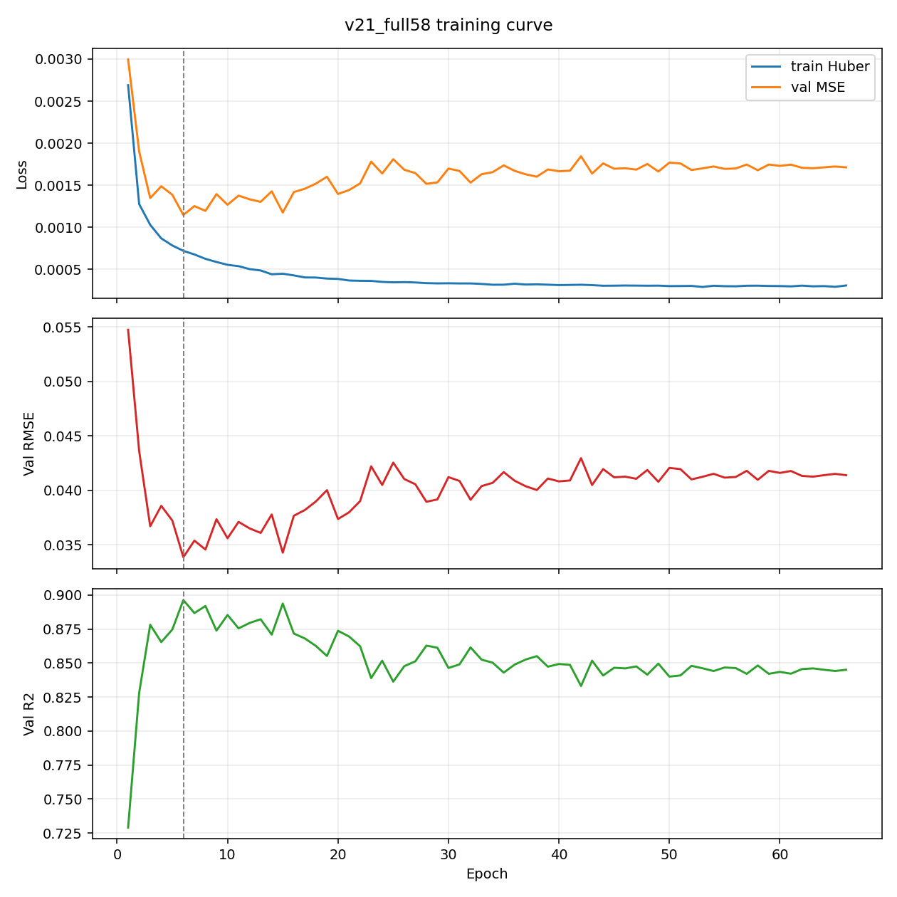
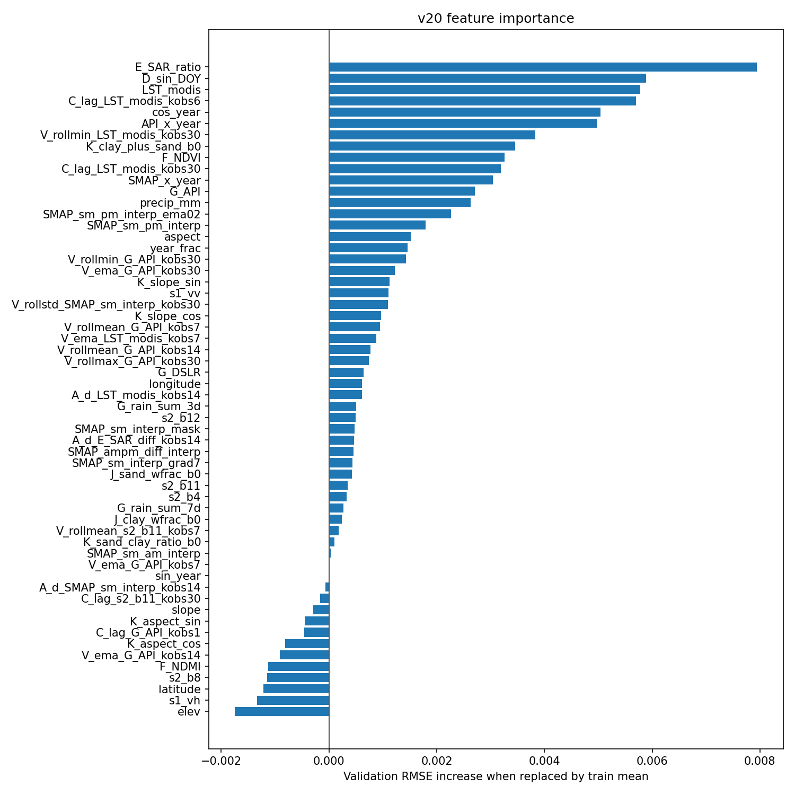
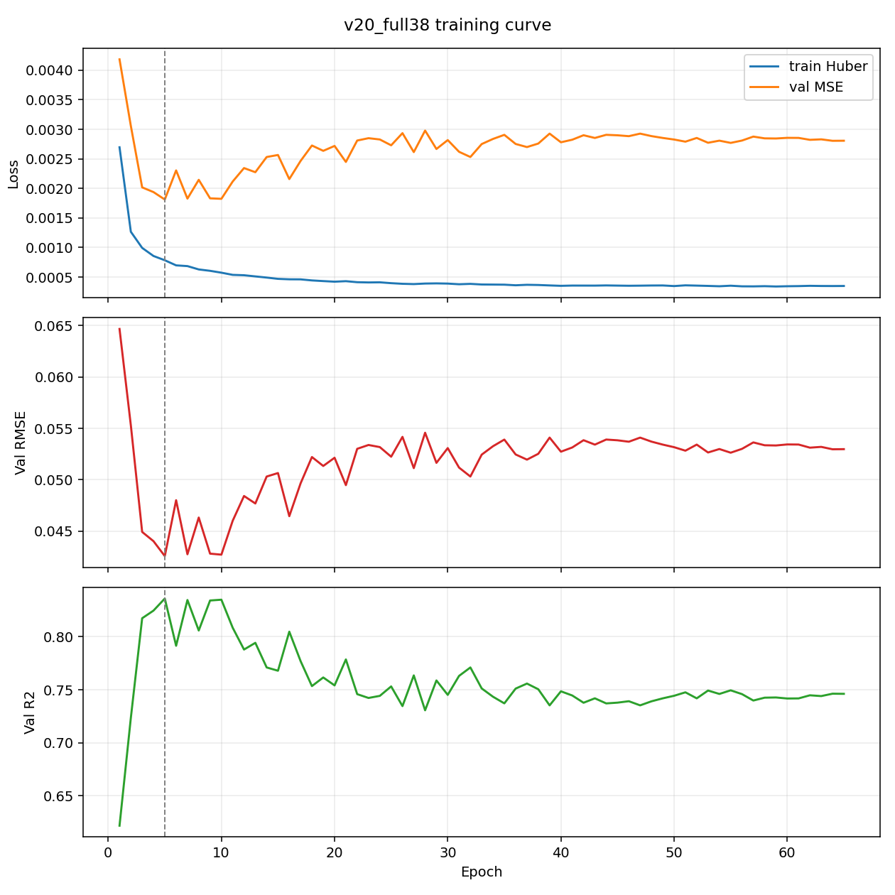
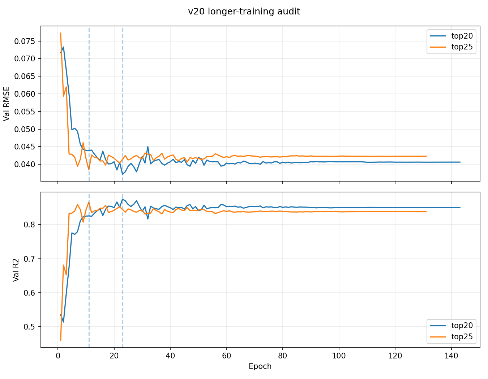
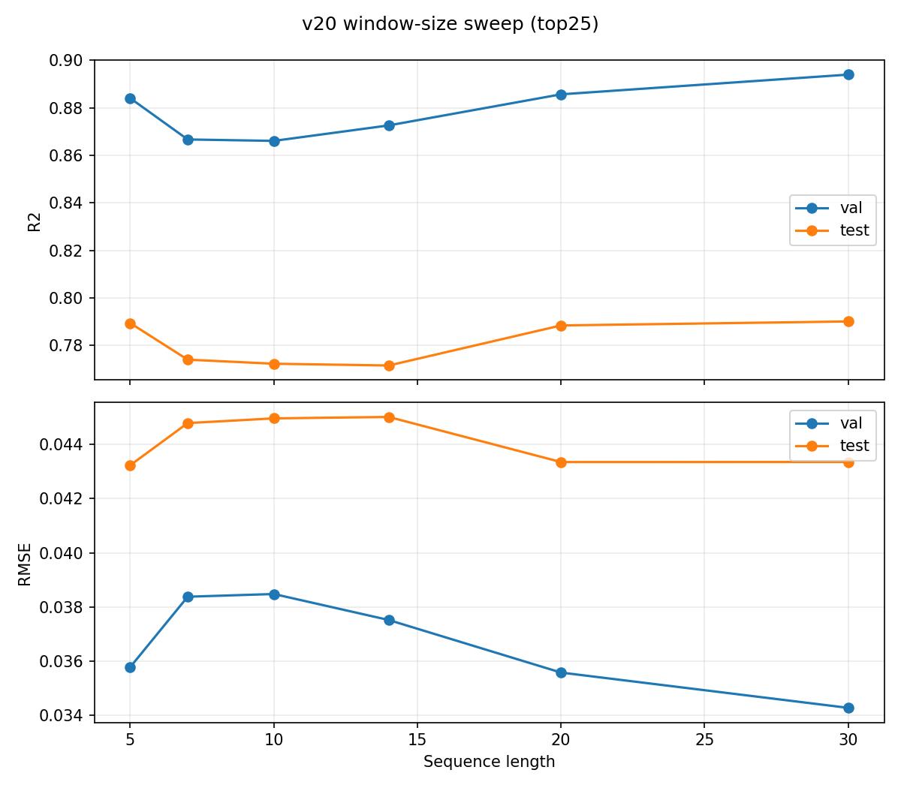
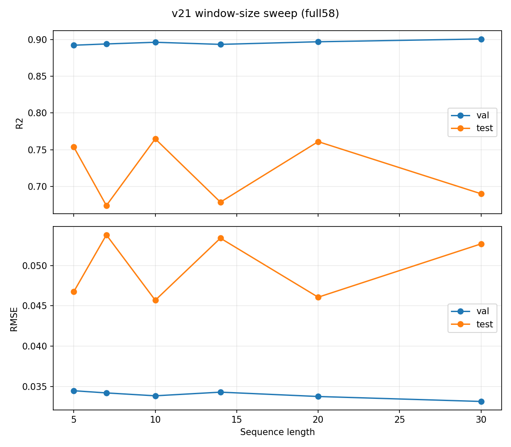
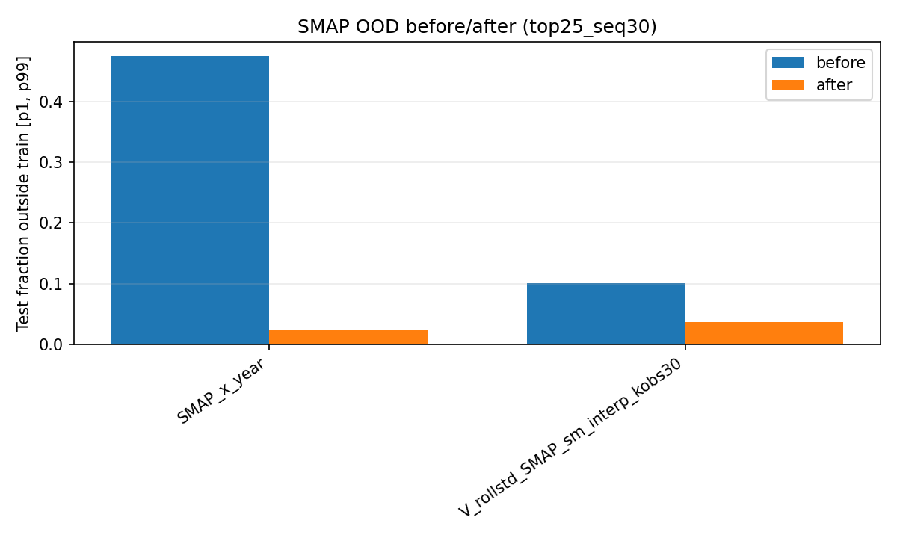
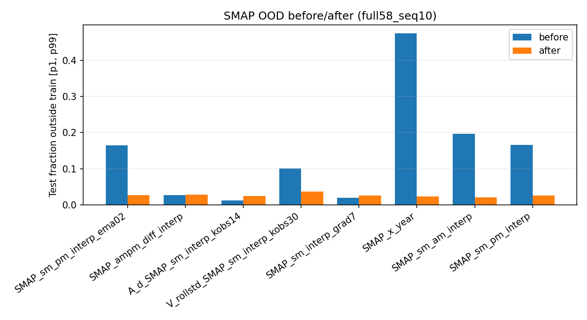

# LSTM Temporal Experiments
## Kerry Cheon 07/07/2026

## v20 vs v21 Context
Both v20 and v21 use the same BiLSTM+Attention architecture family. The main
difference is the input feature set.

| Version | Feature setup | Feature count | Best tested variant | Test R2 | Takeaway |
|---|---|---:|---|---:|---|
| v20 | Jakob's MDR-v25/XGBoost features only | 38 full, 25 pruned | v20 top25, `seq_len=30` | 0.790 | Best temporal LSTM this week |
| v21 | Jakob's 38 features plus 20 v9 LSTM-unique raw/static/time-series features | 58 | v21 full58, `seq_len=10` | 0.765 | The extra v9 features helped the full model, but did not beat pruned v20 |

In short: v20 asks whether Jakob's feature set works better in the LSTM. v21
asks whether keeping Daniel's v9-specific inputs on top of Jakob's features
helps. The answer was mixed: v21 full58 beat v20 full38, but the cleaner v20
top25 model generalized best.

## Current Best Performing Model
This week I was able to best Daniel's results. However, it was with just Jakob's features only:

- Feature set: The top 25 pruned features from Jakob's MDR-v25/XGBoost feature set (v20 top25)
- Window length: 30
- Test R2: 0.790
- Test RMSE: 0.0433

The best v21 test result, full58 with `seq_len=10`, reaches test R2 = 0.765.
That is better than v9 and much better than v20 full38, but still below v20
top25 `seq_len=30` and below Jakob's XGBoost baseline.

## Experiments Done This Week
| # | Experiment | Code / Output | Main Result | TLDR |
|---|---|---|---|---|
| 1 | Feature alignment and total feature count | `train_v20.py`, `train_v21.py` | v20 full38 test R2 = 0.696; v21 full58 test R2 = 0.765 | Jakob-only features were not enough; adding LSTM time-series/raw features helped |
| 2 | Feature importance and less-than-38 pruning | `outputs_v20/feature_importance.json`, `outputs_v21/feature_importance.json` | v20 top25 uses 25 features and later reaches test R2 = 0.790 with seq30 | Pruning helped v20, but simple pruning did not help v21 |
| 3 | Training-length / undertraining audit | `train_v20_training_audit.py` | top20/top25 did not improve with longer training | The v20 candidates were not undertrained |
| 4 | Window-size sweep | `train_v20_window_sweep.py`, `train_v21.py` | v20 top25 seq30 test R2 = 0.790; v21 full58 seq10 test R2 = 0.765 | Window size matters; v20 top25 seq30 is still the best temporal LSTM |
| 5 | SMAP-specific input normalization | `train_v22_smap_norm.py` | OOD fractions dropped, but test R2 dropped to 0.614 on top25 seq30 and 0.732 on full58 seq10 | Rolling SMAP normalization fixed the range shift but removed useful absolute signal |

The report should be read as one experiment chain, not as only
three v21 experiments. First we checked the old 06-30 issues, then we aligned
features with Jakob, checked feature importance, tested longer training, swept
time-window size, and tested SMAP-specific normalization.

## Experiment 1: Feature Alignment and Total Feature Count
Finding: feature alignment alone was not enough, but adding the LSTM-unique
time-series/raw features helped.

Full58 clearly helped compared with Jakob-only full38. It also
beat the old v9 baseline. But it was still below v20 top25 with `seq_len=30`,
so it is an improvement, not the new best temporal model.

| Run | Feature count | Seq len | Val R2 | Val RMSE | Test R2 | Test RMSE | Notes |
|---|---:|---:|---:|---:|---:|---:|---|
| Daniel v9 LSTM | 30 | 10 | 0.845 | 0.0414 | 0.747 | 0.0474 | Original BiLSTM+Attention baseline |
| v20 full38 | 38 | 10 | 0.836 | 0.0426 | 0.696 | 0.0519 | Jakob features only |
| v21 full58 | 58 | 10 | 0.896 | 0.0338 | 0.765 | 0.0457 | Jakob + v9-unique features |
| v20 top25 | 25 | 30 | 0.894 | 0.0343 | 0.790 | 0.0433 | Current best temporal LSTM |
| Jakob XGBoost | 38 | -- | -- | -- | 0.822 | -- | Tabular one-model baseline |

Feature-count check:

| Feature set | Count | What It Means |
|---|---:|---|
| v9 LSTM features | 30 | Original LSTM feature surface |
| Jakob aligned features | 38 | Jakob's MDR-v25/XGBoost feature set |
| Overlap between v9 and Jakob | 10 | Features already shared by both |
| LSTM-unique additions | 20 | v9 features not in Jakob's 38 |
| v21 union | 58 | Jakob 38 + LSTM-unique 20 |
| Best v20 pruned set | 25 | Less than 38 features, selected from Jakob's aligned set |

Interpretation: Experiment 1 in the July 3 report was too strict if read as
"replace the LSTM features with Jakob's features." The union run shows that the
old LSTM-specific raw/static inputs contain useful context. Full58 improves
over full38 by about +0.068 test R2 and beats v9 by about +0.018.

However, v21 full58 still trails the previous best temporal LSTM, v20 top25
`seq_len=30`, by about -0.025 test R2.

## Experiment 2: Feature Importance & Pruning
Finding: feature importance helped the v20 Jakob-aligned model, but did not
help when applied naively to the v21 full58 union.

The important point is that we did get a less-than-38 feature
model: v20 top25 uses 25 features and became the best temporal LSTM after the
window sweep. But pruning the larger v21 union did not work.

v20 pruning from Jakob's 38 features:

| Run | Feature count | Selection rule | Val R2 | Val RMSE | Test R2 | Test RMSE | Notes |
|---|---:|---|---:|---:|---:|---:|---|
| v20 full38 | 38 | Jakob feature alignment | 0.836 | 0.0426 | 0.696 | 0.0519 | All 38 features were noisy in the LSTM |
| v20 top15 | 15 | Top-K importance | 0.763 | 0.0511 | 0.589 | 0.0604 | Too aggressive |
| v20 top20 | 20 | Best validation RMSE at seq10 | 0.875 | 0.0372 | 0.758 | 0.0464 | Beats v9 |
| v20 top25 | 25 | Sensitivity candidate at seq10 | 0.866 | 0.0385 | 0.772 | 0.0450 | Best seq10 test before window sweep |

v21 pruning from the full58 union:

| Run | Feature count | Best epoch | Val R2 | Val RMSE | Test R2 | Test RMSE | Verdict |
|---|---:|---:|---:|---:|---:|---:|---|
| v21 full58 | 58 | 6 | 0.896 | 0.0338 | 0.765 | 0.0457 | Best seq10 union candidate |
| v21 top20 | 20 | 5 | 0.864 | 0.0388 | 0.329 | 0.0772 | Collapsed on test |
| v21 top25 | 25 | 72 | 0.860 | 0.0393 | 0.310 | 0.0782 | Collapsed on test |
| v21 top30 | 30 | 7 | 0.808 | 0.0460 | 0.272 | 0.0804 | Collapsed on test |
| v21 top35 | 35 | 12 | 0.869 | 0.0380 | 0.325 | 0.0774 | Collapsed on test |
| v21 top40 | 40 | 15 | 0.808 | 0.0461 | 0.562 | 0.0623 | Still below full58 |

Most important validation features in full58:

1. `E_SAR_ratio`
2. `D_sin_DOY`
3. `LST_modis`
4. `C_lag_LST_modis_kobs6`
5. `cos_year`
6. `API_x_year`
7. `V_rollmin_LST_modis_kobs30`
8. `K_clay_plus_sand_b0`
9. `F_NDVI`
10. `C_lag_LST_modis_kobs30`

Lowest / harmful-by-ablation features:

1. `elev`
2. `s1_vh`
3. `latitude`
4. `s2_b8`
5. `F_NDMI`
6. `V_ema_G_API_kobs14`
7. `K_aspect_cos`
8. `C_lag_G_API_kobs1`
9. `K_aspect_sin`
10. `slope`

Interpretation: the union model appears to use the old LSTM raw/static features
as context, but naive top-K pruning from the full58 importance ranking destroys
test generalization. The pruning path that helped v20 does not transfer cleanly
to the 58-feature union.

## Experiment 3: Is the LSTM Model Undertrained?
Finding: the best v20 pruned candidates were not undertrained.

This answers the question from last week: if v18/v19 may
have stopped too early because of the scheduler. For v20 top20/top25, training
longer did not improve the best checkpoint, so the fix is not simply "train
more."

| Run | Seq len | Best epoch | Epochs run | Val R2 | Val RMSE | Test R2 | Test RMSE | Verdict |
|---|---:|---:|---:|---:|---:|---:|---:|---|
| top20 long train | 10 | 23 | 143 | 0.875 | 0.0372 | 0.758 | 0.0464 | Not undertrained |
| top25 long train | 10 | 11 | 131 | 0.866 | 0.0385 | 0.772 | 0.0450 | Not undertrained |

## Experiment 4: Best Performing Window for LSTM Features
Finding: window size changes the final recommendation. For v20 top25,
`seq_len=30` is the best validation-selected and best test-performing temporal
LSTM. For v21 full58, validation prefers `seq_len=30`, but test performance is
best at `seq_len=10`.

Window size is one of the most important knobs for the time
series model. For v20 top25, `seq_len=30` wins. For v21 full58, `seq_len=30`
looks good on validation but weak on test, so v21 is less trustworthy.

v20 top25 window sweep:

| Seq len | Val R2 | Val RMSE | Test R2 | Test RMSE | Best epoch |
|---:|---:|---:|---:|---:|---:|
| 5 | 0.884 | 0.0358 | 0.789 | 0.0432 | 80 |
| 7 | 0.867 | 0.0384 | 0.774 | 0.0448 | 11 |
| 10 | 0.866 | 0.0385 | 0.772 | 0.0450 | 11 |
| 14 | 0.873 | 0.0375 | 0.772 | 0.0450 | 26 |
| 20 | 0.886 | 0.0356 | 0.788 | 0.0433 | 27 |
| 30 | 0.894 | 0.0343 | 0.790 | 0.0433 | 21 |

v21 full58 window sweep:

| Seq len | Val R2 | Val RMSE | Test R2 | Test RMSE | Test n | Best epoch |
|---:|---:|---:|---:|---:|---:|---:|
| 5 | 0.892 | 0.0345 | 0.754 | 0.0468 | 3991 | 9 |
| 7 | 0.894 | 0.0342 | 0.674 | 0.0538 | 3981 | 11 |
| 10 | 0.896 | 0.0338 | 0.765 | 0.0457 | 3966 | 6 |
| 14 | 0.894 | 0.0343 | 0.679 | 0.0534 | 3946 | 9 |
| 20 | 0.897 | 0.0338 | 0.761 | 0.0461 | 3916 | 17 |
| 30 | 0.901 | 0.0331 | 0.690 | 0.0527 | 3866 | 18 |

If we select strictly by validation RMSE, v21's selected candidate is full58
with `seq_len=30`, but its test R2 is only 0.690. If we look at test
performance diagnostically, full58 with `seq_len=10` is the best v21 run at
test R2 = 0.765.

Because the validation-selected candidate underperforms, v21 should not replace
v20 top25 `seq_len=30` as the temporal LSTM default.

## Experiment 5: SMAP-Specific Input Normalization
Finding: rolling per-station SMAP normalization reduced SMAP OOD fractions, but
it made prediction worse.

This did what it was supposed to do on the input side: it made
test SMAP values look less out-of-range compared with train. But the LSTM was
using some of the absolute SMAP level as signal, so removing that level hurt
the final soil-moisture prediction.

Method:

- Script: `train_v22_smap_norm.py`
- Transform: per-station rolling z-score for continuous SMAP-derived features
- Window: 30 rows, matching the current best temporal context and the existing
  30-day SMAP rolling feature
- Leakage rule: each station is sorted by date; each value uses only current
  and past values in the rolling window
- Normal train-only imputer/scaler is still applied after the SMAP transform

Model results:

| Run | SMAP cols normalized | Seq len | Val R2 | Val RMSE | Test R2 | Test RMSE | Baseline Test R2 | Verdict |
|---|---:|---:|---:|---:|---:|---:|---:|---|
| v22 SMAP-norm top25 | 2 | 30 | 0.829 | 0.0435 | 0.614 | 0.0588 | 0.790 | Worse |
| v22 SMAP-norm full58 | 8 | 10 | 0.879 | 0.0366 | 0.732 | 0.0488 | 0.765 | Worse |

OOD fraction before and after normalization:

| Feature | top25 before | top25 after | full58 before | full58 after |
|---|---:|---:|---:|---:|
| `SMAP_x_year` | 0.475 | 0.023 | 0.475 | 0.023 |
| `V_rollstd_SMAP_sm_interp_kobs30` | 0.101 | 0.036 | 0.101 | 0.036 |
| `SMAP_sm_am_interp` | -- | -- | 0.197 | 0.021 |
| `SMAP_sm_pm_interp` | -- | -- | 0.166 | 0.025 |
| `SMAP_sm_pm_interp_ema02` | -- | -- | 0.165 | 0.027 |

Interpretation: The original OOD diagnosis was correct: SMAP was shifted in
the test years. But this normalization is too blunt for the supervised model.
It reduces distribution shift while also removing real seasonal/wetness level
information that helps predict `soil_moisture_5cm`.

## Root Cause (Working Hypothesis)
The union feature set gives the LSTM useful raw sensor and station-context
features that were missing from Jakob-only full38, which explains the
full58 improvement. But the same expanded surface also creates a stronger
validation/test selection problem. Validation favors longer windows and some
feature combinations that do not generalize to the test years.

The most likely issue is not simply "more features are better." The useful
direction is a constrained hybrid: keep the LSTM raw/static context, keep the
strong Jakob lag/rolling features, but avoid naive top-K pruning and avoid
trusting `seq_len=30` without a coverage/per-station audit.

The SMAP-normalization result adds one more detail: the SMAP shift is real, but
removing absolute SMAP level with rolling z-scores is not the right fix. The
model still needs level information, not only local anomalies.

The LSTM benefits from both raw context and engineered features.
The expanded feature set and SMAP normalization both make model selection less
stable, so the next step should be controlled pruning and stability checks, not
just adding more features or normalizing away level information.

## Possible Next Steps
1. Keep v20 top25 + `seq_len=30` as the current temporal LSTM default for
   `derived_8.0`.

2. Run a seed-stability audit for v20 top25 seq30, v21 full58 seq10, v21 full58
   seq20, and v21 full58 seq30. The v21 validation/test disagreement is large
   enough that a single seed should not drive the next decision.

3. Audit per-station and per-year residuals for v21 full58 seq10 versus v20
   top25 seq30. The large positive test bias in the pruned v21 runs suggests
   station/year coverage effects.

4. Try constrained pruning rather than global top-K pruning: keep the v9 raw
   sensor/static context fixed, then prune only the added Jakob engineered
   features.

5. Before moving this result to `derived_9.0`, repeat the sample-coverage audit
   for window sizes 10, 20, and 30. Longer windows are still dropping more rows
   at split boundaries.

6. If SMAP normalization is revisited, use a gentler representation: keep the
   raw SMAP level and add a separate rolling anomaly feature, rather than
   replacing the SMAP-derived inputs with anomalies.
