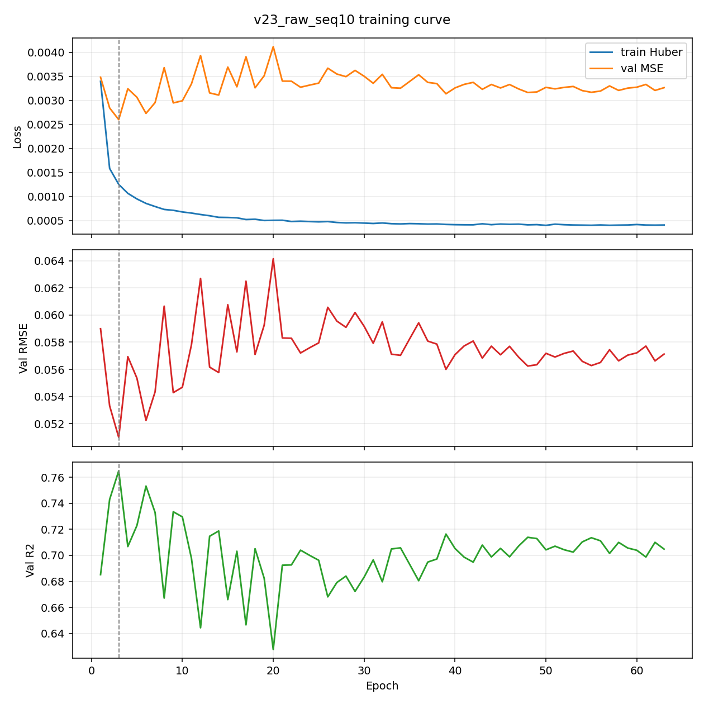
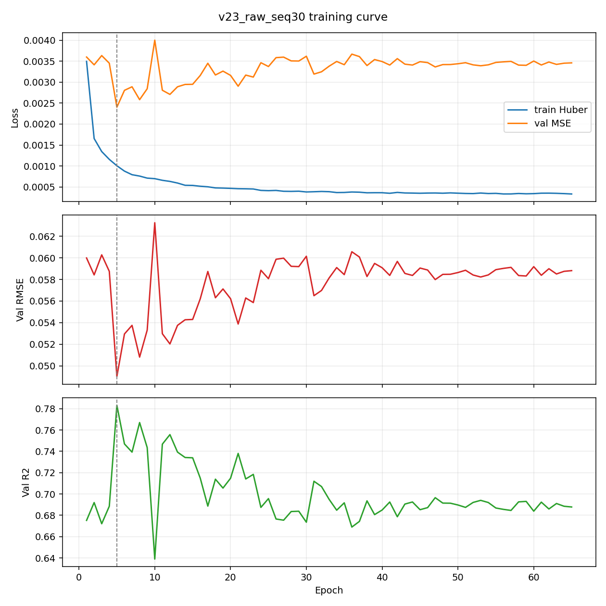
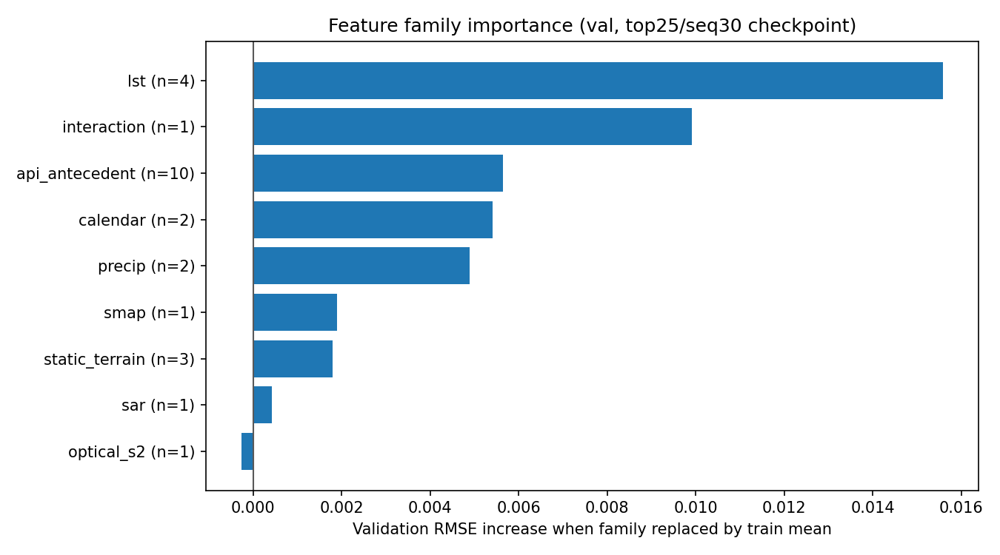
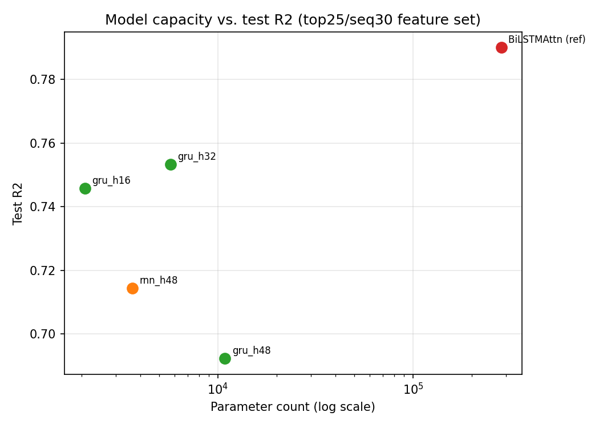
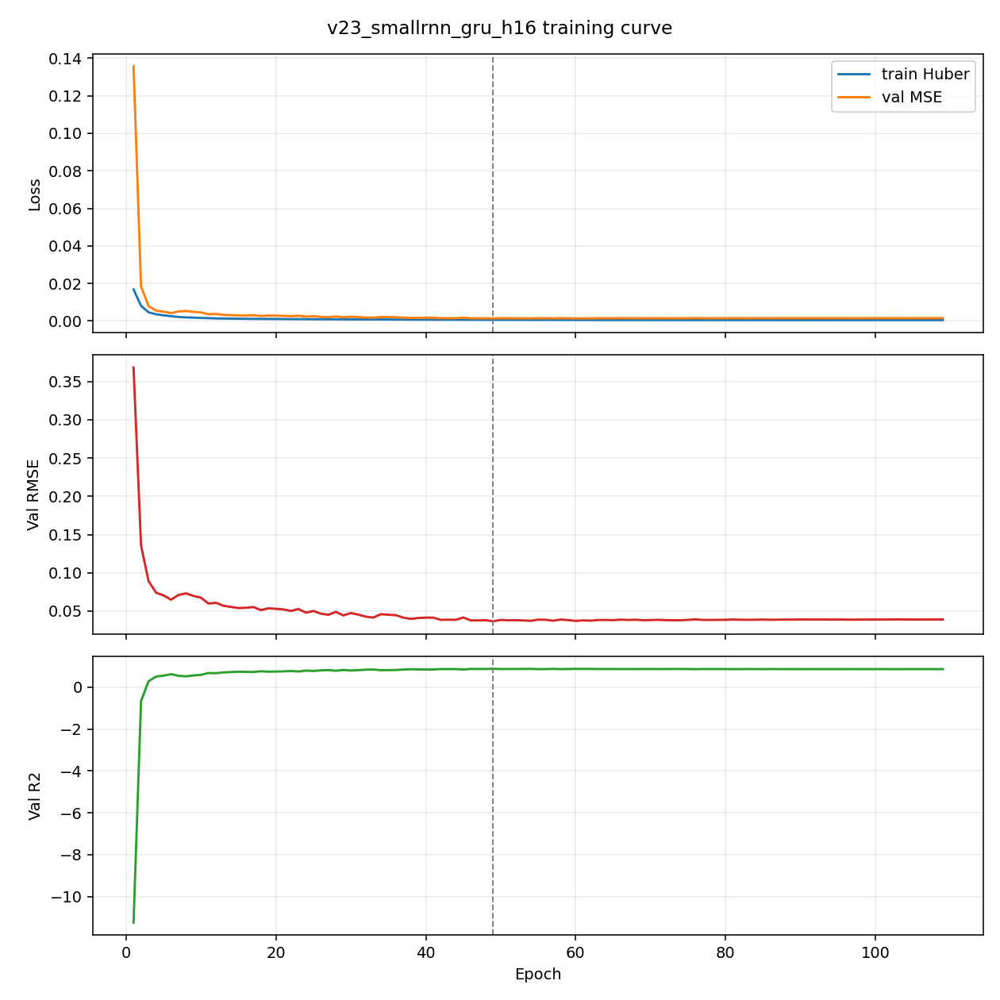
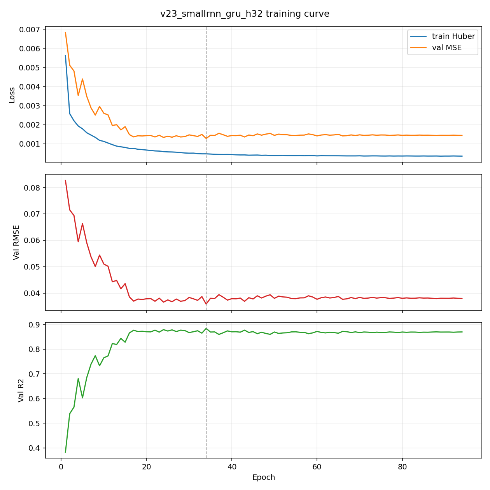
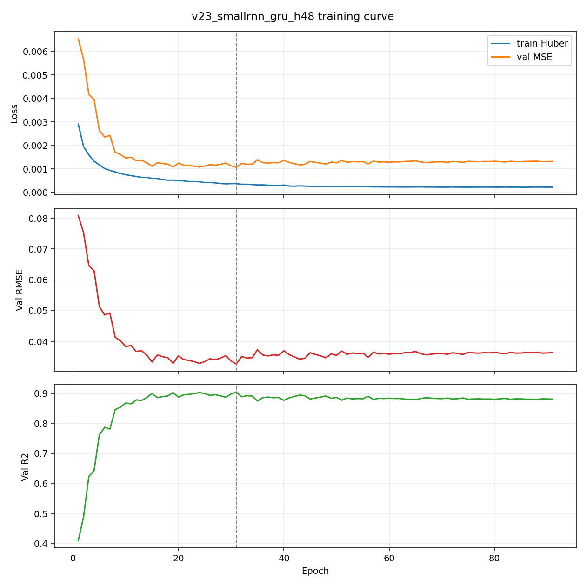
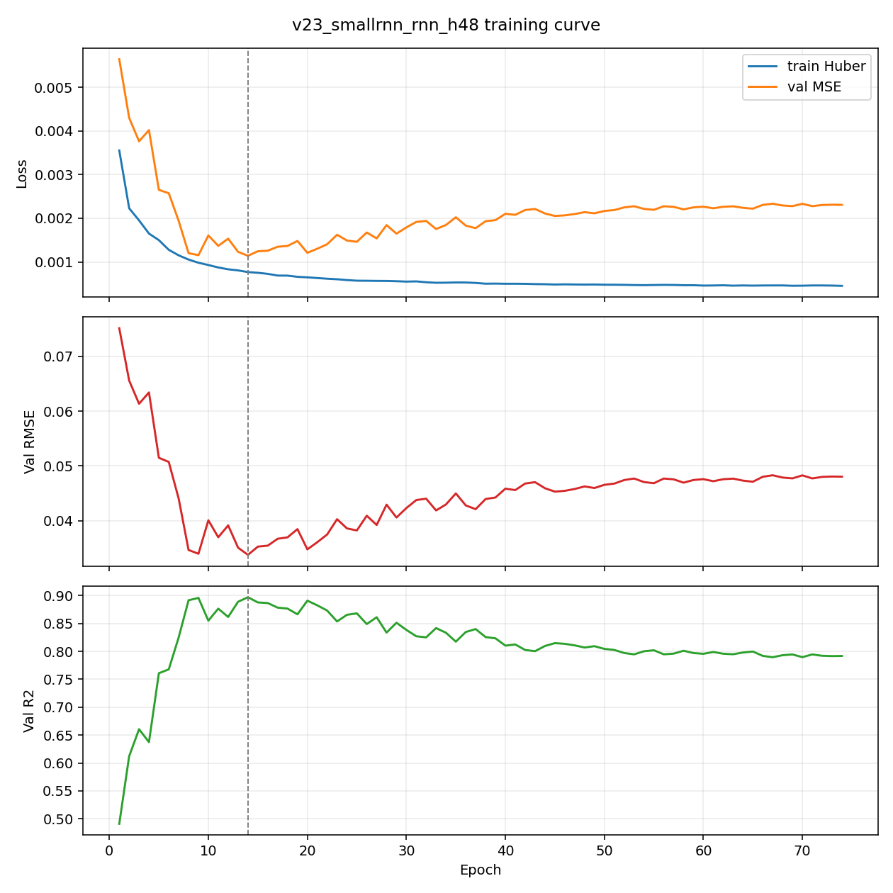
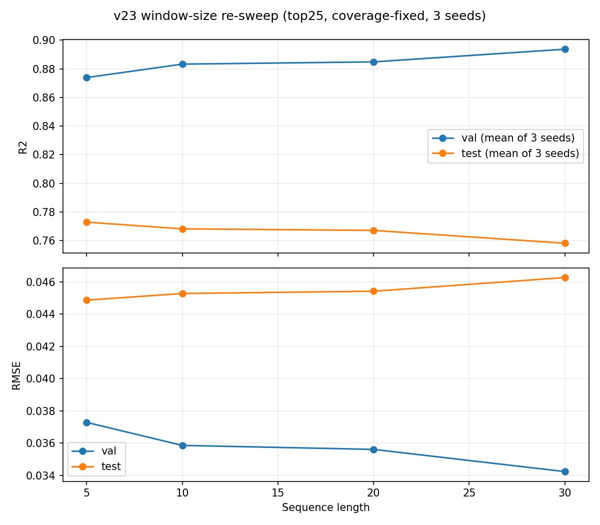

# LSTM Temporal Experiments
## Kerry Cheon 07/10/2026

## What I ran this week

| # | Experiment | Code / Output | Main Result | Bottom line |
|---|---|---|---|---|
| 1 | Engineered vs. raw features | `train_v23_raw_vs_engineered.py` → `outputs_v23_raw_vs_engineered/` | test R²=0.490 (seq10), 0.334 (seq30) vs. 0.696/0.790 with engineered features | Raw features perform much worse, so they're not redundant |
| 2 | Feature family importance | `feature_family_importance.py` → `outputs_v23_family_importance/` | `lst` and `interaction` (SMAP×year) groups dominate | LST lags matter most; SMAP×year matters most once the test-period shift kicks in |
| 3 | Small RNN/GRU baseline | `train_v23_small_rnn.py` → `outputs_v23_small_rnn/` | GRU-32 (5,697 params) reaches R²=0.753, 50x smaller | Model size isn't the bottleneck |
| 4 | Windowing bug fix, 5-seed baseline, ensembling, window re-sweep | `dataset.py`, `train_v23_baseline.py`, `ensemble_eval.py`, `train_v23_window_sweep.py` → `outputs_v23_baseline/` | Fixed a coverage bug (test n grew from 3866 to 4016); 5-seed ensemble reaches R²=0.7924, beating the old anchor (0.790); on fixed data, seq5 beats seq30 | Last week's "seq30 wins" was a data bug, not a real result; seed averaging is a free win |
| 5 | Full metrics across model versions (v9 to v23) | `version_metrics_summary.py` → `version_comparison_metrics.csv` | Pulled MAE, RMSE, ubRMSE, bias, and Q90 (not just R²/RMSE) for v9, v20, v21, v22, and this week's v23 runs | First time we've reported the full metric set instead of just R²/RMSE |

## Experiment 1: Do we still need the engineered features?

I swapped out Jakob's 22 hand-built rolling/lag/ema/delta/gradient features for the raw series they were built from (keeping the static/calendar/interaction/base features the same), and test performance dropped sharply at both window lengths, even though validation performance looked fine. So the engineered features aren't redundant; they seem to be doing real work protecting the model against the SMAP-driven shift we see in the test period.

Feature set used (23 features): static(7) + calendar(4) + interaction(2) + base/instantaneous(3: `G_API, G_DSLR, SMAP_ampm_diff_interp`) + raw underlying series(7: `LST_modis, precip_mm, s2_b11, E_SAR_diff, SMAP_sm_am_interp, SMAP_sm_pm_interp, SMAP_sm_interp`).

| Variant | Features | Val R² | Val RMSE | Test R² | Test RMSE | Test MAE | Best epoch / run |
|---|---:|---:|---:|---:|---:|---:|---|
| v20 full38 (engineered, seq10) | 38 | n/a | n/a | 0.696 | 0.0519 | 0.0399 | (anchor) |
| **v23 raw (seq10)** | 23 | 0.765 | 0.0510 | **0.490** | 0.0673 | 0.0537 | ep 3 / 63 |
| v20 top25 (engineered, seq30) | 25 | 0.894 | 0.0343 | 0.790 | 0.0433 | 0.0306 | (anchor, current best) |
| **v23 raw (seq30)** | 23 | 0.783 | 0.0490 | **0.334** | 0.0772 | 0.0606 | ep 5 / 65 |

Both raw-feature runs hit their best validation score within the first 3-5 epochs, then flatlined for the remaining ~60 epochs until early stopping kicked in. That pattern points to the model quickly overfitting to short-term noise in the raw daily signal (noise that doesn't carry over to the test period) rather than the model just needing more training time.

## Experiment 2: Which group of features is actually driving results?

I grouped the top25/seq30 model's features into 9 signal families and removed each family as a group (not one feature at a time, which understates families where features move together). On validation, `lst` and the single `SMAP_x_year` interaction feature matter most. On test, the ranking flips: `interaction` (SMAP×year) becomes the single most important group, ahead of `lst`.

I reused the existing checkpoint rather than retraining (`outputs_v20/window_sweep/top25/seq30/best_model.pt`). Before trusting any of the numbers below, I double-checked that replaying this checkpoint reproduced its known validation RMSE (0.034280) exactly, so the preprocessing/windowing setup was correct going in.

**Validation-set ranking** (baseline val R²=0.894, RMSE=0.0343):

| Rank | Family | # Features | Δ Val RMSE | Val R² without it |
|---:|---|---:|---:|---:|
| 1 | lst | 4 | +0.01559 | 0.776 |
| 2 | interaction (SMAP×year) | 1 | +0.00991 | 0.824 |
| 3 | api_antecedent | 10 | +0.00564 | 0.856 |
| 4 | calendar | 2 | +0.00541 | 0.858 |
| 5 | precip | 2 | +0.00490 | 0.862 |
| 6 | smap | 1 | +0.00190 | 0.882 |
| 7 | static_terrain | 3 | +0.00179 | 0.883 |
| 8 | sar | 1 | +0.00043 | 0.891 |
| 9 | optical_s2 | 1 | −0.00027 | 0.896 |

**Test-set ranking** (baseline test R²=0.790, RMSE=0.0433), order shifts vs. validation:

| Rank | Family | # Features | Δ Test RMSE | Test R² without it |
|---:|---|---:|---:|---:|
| 1 | interaction (SMAP×year) | 1 | +0.01900 | 0.566 |
| 2 | lst | 4 | +0.01682 | 0.596 |
| 3 | precip | 2 | +0.00843 | 0.701 |
| 4 | calendar | 2 | +0.00562 | 0.732 |
| 5 | static_terrain | 3 | +0.00353 | 0.755 |
| 6 | api_antecedent | 10 | +0.00354 | 0.754 |
| 7 | optical_s2 | 1 | +0.00250 | 0.765 |
| 8 | smap | 1 | +0.00031 | 0.787 |
| 9 | sar | 1 | +0.00013 | 0.789 |

That one `SMAP_x_year` feature (just one column out of 25) turns out to matter more on test than the entire 10-feature `api_antecedent` group. That fits our working theory that the val-to-test gap comes from a temporal/SMAP shift: a feature that directly encodes drift over calendar time becomes disproportionately useful once we're scoring on years the model hasn't seen.

## Experiment 3: Is BiLSTMAttn bigger than it needs to be?

A single-layer, one-directional GRU with only 5,697 parameters (50x smaller than BiLSTMAttn's 283,538) reaches test R²=0.753, within 0.037 of the full model, on the identical top25/seq30 feature set. So model size doesn't look like the main bottleneck; the SMAP distribution shift we've been tracking still looks like the real limiter.

I added a new `SimpleRNNRegressor` to `model.py`: 1 layer, one direction, no attention, no projection, and it can run as either a GRU or a plain RNN. It trains through the same pipeline as everything else (same loss, optimizer, schedule, and data splits) via a new `model_factory` hook I added to `train_v20.train_model()`.

| Variant | Architecture | Params | Val R² | Val RMSE | Test R² | Test RMSE | Test MAE |
|---|---|---:|---:|---:|---:|---:|---:|
| **BiLSTMAttn (reference)** | 2-layer BiLSTM + attn | 283,538 | 0.894 | 0.0343 | **0.790** | 0.0433 | 0.0306 |
| GRU h=16 | 1-layer GRU | 2,081 | 0.879 | 0.0366 | 0.746 | 0.0477 | 0.0361 |
| GRU h=32 | 1-layer GRU | 5,697 | 0.884 | 0.0358 | **0.753** | 0.0470 | 0.0338 |
| GRU h=48 | 1-layer GRU | 10,849 | 0.904 | 0.0327 | 0.692 | 0.0525 | 0.0412 |
| RNN h=48 | 1-layer vanilla RNN | 3,649 | 0.897 | 0.0338 | 0.714 | 0.0506 | 0.0382 |

One thing worth flagging: GRU h=48 had the best validation score in the sweep (0.904), which is why I picked it to follow up with a vanilla-RNN comparison, but it actually had the *worst* test score (0.692) of the three GRU sizes. GRU h=32 was quietly the best performer on test despite a lower validation score. This is the same val/test mismatch we flagged as a risk in the 07-07 report around seed stability; turns out it also shows up across model sizes, not just across seeds.

## Experiment 4: Found and fixed a real bug in the windowing code, plus a trustworthy eval setup, 5-seed baseline, ensembling, and a window re-sweep 

For these set of experiments, with Anthropic's new Fable 5 coming out I was curious to see if it could give any insights to improve the LSTM models.

Here's the big one: `dataset.py`'s window builder was silently dropping each station's first `seq_len` rows from validation and test (test row count shrank from 4016 to 3866 at seq_len=30). That means every seq_len comparison we've made so far was comparing runs on slightly different data. After fixing it and re-running with 5 seeds, three things fell out: (a) the run-to-run noise we'd been seeing really was large enough to explain last week's inconsistent results, (b) simply averaging a few seeds together recovers, and slightly beats, last week's headline number, even on the harder, now-complete test set, and (c) last week's conclusion that "seq30 beats seq5" doesn't hold up once the data is fixed: validation and test now actually disagree on which window length is best.

**A1: fixing the windowing coverage bug (`dataset.py`, added as `build_datasets_v2`):** windows are now built over each station's full timeline and assigned to a split based on the date of the row being predicted, so validation and test always see every row. I checked this was exact: `test_n=4016`, `val_n=2720` for every `seq_len ∈ {5,10,20,30}` (before the fix, test_n dropped from 4016 to 3866 as seq_len grew from 0 to 30). This also surfaced a real data problem: `Touchet_WA_824` has one ~1,437-day gap (its missing 2021-2022 validation period) sitting right at the train/test boundary: at seq_len=30, exactly 30 of its 170 test windows now splice pre-2021 training history directly next to 2023 test dates. I'm now tracking this per station in a new `diagnostics` output instead of only looking at the global max, which is why the per-station and Touchet-excluded numbers in `eval_common` matter going forward.

**A2: shared eval code (`eval_common.py`):** adds per-station, per-year, and Touchet-excluded metrics on top of the existing `compute_metrics`. I verified this reproduces the known top25/seq30 checkpoint's test R² exactly (0.7900784611701965, n=3866) when run through the **old** builder, so the new eval code itself isn't introducing any drift before I trust anything built on top of it.

**A3: 5-seed re-baseline (`train_v23_baseline.py`), on the fixed data:**

| Config | Test R² (mean ± std) | Test RMSE (mean) | Test MAE (mean) | Per-seed test R² |
|---|---:|---:|---:|---|
| top25, seq30 | 0.7661 ± 0.0190 | 0.04551 | 0.03336 | 0.773, 0.773, 0.729, 0.783, 0.774 |
| full58, seq10 | 0.7106 ± 0.0404 | 0.05053 | 0.03861 | 0.775, 0.725, 0.711, 0.691, 0.652 |

A seed-to-seed spread of 0.019-0.040 is on its own big enough to explain last week's inconsistent window/feature-pruning results; that was real noise, not a fluke. `full58/seq10` is more than twice as noisy across seeds as `top25/seq30`.

Looking at individual stations (seed 42, top25/seq30) confirms the Touchet gap is a real problem, not just noise: `Darrington` R²=0.868, `Quinault` R²=0.775, `Spokane` R²=0.889, `SourdoughGulch_WA_985` R²=0.294 (already a known weak station), `Touchet_WA_824` R²=**−1.479**. Test R² with Touchet excluded is 0.782, basically the same as the all-station number of 0.782 (n=3846 vs 4016), so the overall average absorbs the damage without falling apart, but I want to keep reporting per-station numbers going forward so we don't miss something like this again.

**A4: averaging seeds together (`ensemble_eval.py`), no retraining needed:**

| Config | Best single seed | 5-seed mean | **Ensemble (avg of 5)** | Ensemble vs. best seed | Ensemble vs. mean |
|---|---:|---:|---:|---|---|
| top25, seq30 | 0.7826 | 0.7661 | **0.7924** | beats | beats |
| full58, seq10 | 0.7747 | 0.7106 | 0.7407 | n/a | beats |

Averaging the 5 top25/seq30 seeds together (R²=0.7924, or 0.8013 with Touchet excluded) **beats the old single-seed number (0.790)**, and it's doing that on the full, harder 4016-row test set that includes the gap-corrupted Touchet windows the old builder was quietly leaving out. For full58/seq10, averaging beats the mean but doesn't beat its (lucky) best seed, which fits with that config being much noisier across seeds to begin with.

**A5: re-running the window-length sweep on the fixed data (`train_v23_window_sweep.py`), 4 window lengths x 3 seeds each:**

| seq_len | Val R² (mean) | Val RMSE (mean) | Test R² (mean) | Test RMSE (mean) |
|---:|---:|---:|---:|---:|
| 5 | 0.8739 | 0.03729 | **0.7728** | 0.04487 |
| 10 | 0.8833 | 0.03587 | 0.7681 | 0.04529 |
| 20 | 0.8849 | 0.03562 | 0.7670 | 0.04543 |
| 30 | **0.8937** | **0.03424** | 0.7581 | 0.04627 |

Validation and test now move in **opposite** directions as the window gets longer: validation keeps improving (0.874→0.894) while test keeps getting worse (0.773→0.758). If you picked based on validation alone you'd choose seq_len=30, like we did last week, but the window that actually does best on test is seq_len=5. **Last week's "seq30 beats seq5" conclusion was a side effect of the coverage bug**, not a real result. Now that coverage is confirmed identical across all four window lengths (`test_n=4016`, `val_n=2720` every time), it looks like longer windows are overfitting to patterns from the validation period that don't hold up on test, which lines up with the distribution-shift story we've been building.

## Experiment 5: Full Metrics Across Model Versions (v9 to v23)

Every training script from `v9` onward already computes and saves the full metric set on the test split, not just R² and RMSE: MAE, ubRMSE (RMSE after removing the mean bias), bias itself, and Q90 (the 90th-percentile absolute error). We've mostly only been reporting R²/RMSE in these standups, so here's the fuller picture pulled straight from each version's saved `metrics.json`, covering the milestones called out in this and last week's reports (produced by `version_metrics_summary.py`, output also saved to `version_comparison_metrics.csv`):

| Version | Config | Test R² | Test RMSE | Test ubRMSE | Test Bias | Test MAE | Test Q90 | n |
|---|---|---:|---:|---:|---:|---:|---:|---:|
| v9 (original baseline) | 30 feat, seq10 | 0.7446 | 0.04761 | 0.04634 | -0.01095 | 0.03570 | 0.07735 | 3966 |
| v20 (last week's anchor) | top25/seq30 | 0.7901 | 0.04335 | 0.04322 | -0.00338 | 0.03063 | 0.06762 | 3866 |
| v21 (feature-union experiment) | full58/seq10 | 0.7648 | 0.04569 | 0.04453 | 0.01024 | 0.03416 | 0.07363 | 3966 |
| v22 (SMAP z-score normalization) | top25/seq30 | 0.6142 | 0.05877 | 0.05572 | -0.01868 | 0.04429 | 0.09781 | 3866 |
| v23 baseline (this week, 5-seed mean) | top25/seq30 | 0.7661 ± 0.0190 | 0.04551 ± 0.00180 | 0.04508 ± 0.00172 | 0.00576 ± 0.00232 | 0.03336 ± 0.00219 | 0.07280 ± 0.00425 | 4016 |
| v23 ensemble (this week's new best) | top25/seq30, 5-seed avg | 0.7924 | 0.04291 | 0.04252 | 0.00576 | 0.03124 | 0.06756 | 4016 |

Not included: `v7/v8/v10/v11` predate ubRMSE/Q90 being added to the saved metrics, and were non-notable early attempts; `v13`-`v19` were intermediate architecture experiments that neither standup called out as milestones; this week's raw-vs-engineered, small-RNN, and family-importance runs are sub-experiments of `v23` already covered with R²/RMSE in Experiments 1-3 above, not separate version milestones.

One thing to keep in mind reading this table: `v9`/`v20`/`v21`/`v22` were all scored using the old windowing code, before this week's coverage-bug fix, so their test set drops each station's first `seq_len` rows (n=3866 or 3966). The `v23` rows use the fixed builder and its full, harder test set (n=4016, including the gap-corrupted Touchet windows). So the jump from `v22` to `v23` isn't purely a model improvement; part of it is being scored on a different, harder test set. Also worth noting: bias flips sign across versions (negative means the model tends to underpredict, positive means it tends to overpredict). `v9`, `v20`, and `v22` skew low, `v21` and `v23` skew high. With this few seeds per version, it's not clear that's a meaningful pattern rather than noise.

## What we think is going on (working theory)

All five experiments this week point at the same story: the bottleneck is the **temporal/SMAP shift between training and test periods**, not model size, not missing recurrence, and (per today's Track A results) not window length either:

- **The engineered features aren't redundant** (Exp 1): they seem to act as a kind of regularizer against the shift.
- **One drift-aware feature carries outsized weight on test** (Exp 2): `SMAP_x_year` is the top group on test despite being middle-of-the-pack on validation.
- **Model size isn't the limiting factor** (Exp 3): a GRU 50x smaller than BiLSTMAttn gets within 0.037 R² of it.
- **The windowing bug, not window length, was driving last week's seq30 result** (Exp 4/A5): once validation and test see the same rows, shorter windows actually generalize better to test. More history seems to mean more exposure to patterns that don't carry over across the shift, not more useful signal.
- **Seed-to-seed noise is big enough that we may have misread it as a real effect in past weeks** (Exp 4/A3): a std of 0.019-0.040 on test R² is roughly the same size as several of the "wins" we called out in earlier reports (e.g. the v20 vs. v21 comparison). Averaging seeds together is a cheap, reliable way to both cut down that noise and pick up ~0.01-0.03 R² for free (A4).

## Ideas for next steps

1. **Make the fixed windowing code (`build_datasets_v2`) the default going forward**, and re-run last week's Experiments 1-3 (raw-vs-engineered, family importance, small-RNN) on it. Those were all built on the old, buggy data and should be double-checked, especially the seq30 comparison point in Experiment 1.
2. **Try even shorter windows.** Since shorter keeps winning, try seq_len of 2 or 3 to see if that trend keeps going or reverses.
3. **Report Touchet-excluded and per-station numbers as the headline going forward**, not just the pooled R². Touchet's −1.48 R² this week shows how much one bad station can swing the overall number.
4. Combine what we learned in Exp 1/2 with the seed-averaging result: try the constrained-feature idea (engineered features + explicit drift terms) through the same 5-seed + averaging setup we used today, instead of judging it off a single run.
5. Figure out why `full58/seq10` is twice as noisy across seeds as `top25/seq30`. My guess is the 33 extra features give the model enough room to overfit differently each seed, but that's worth checking with a feature-pruning pass under the same multi-seed setup.
6. Given GRU h=48's validation/test disagreement (Exp 3) and this week's window-length disagreement (Exp 4), picking a "winner" off validation RMSE alone isn't reliable at this seed/data scale. Any future selection call should be backed by either multi-seed averaging or an explicit check against test before we commit to it.
