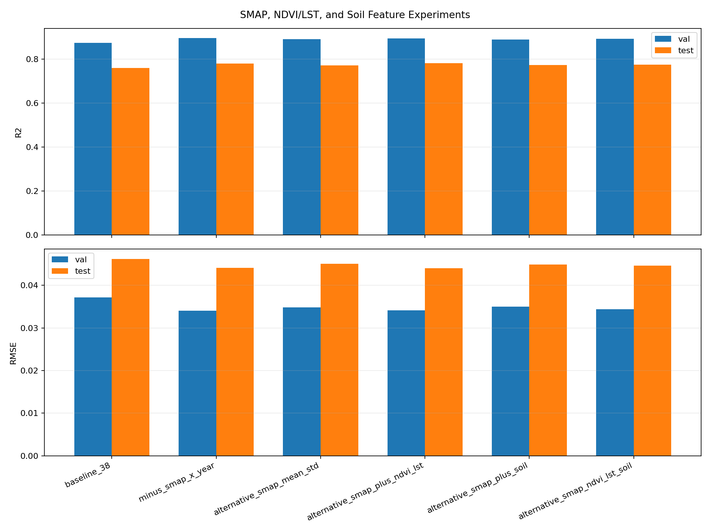
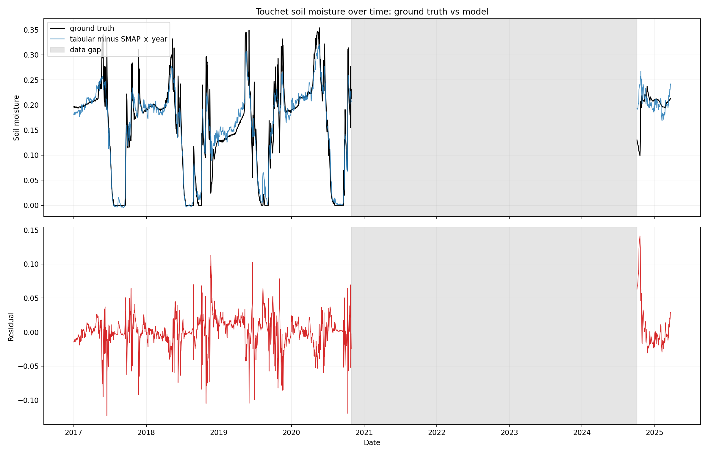
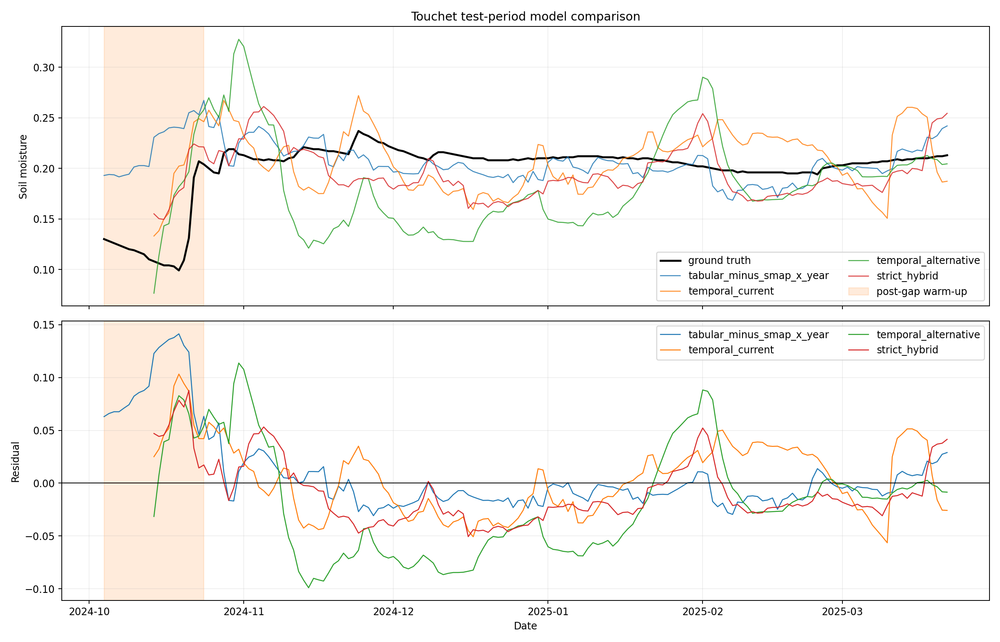
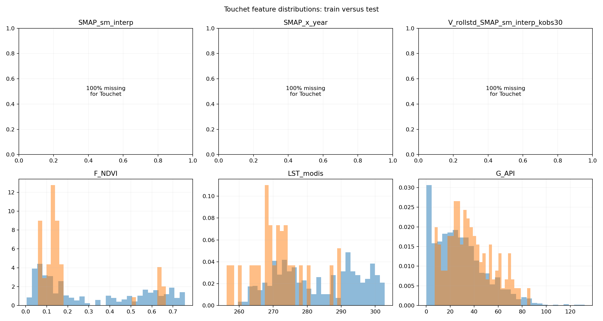
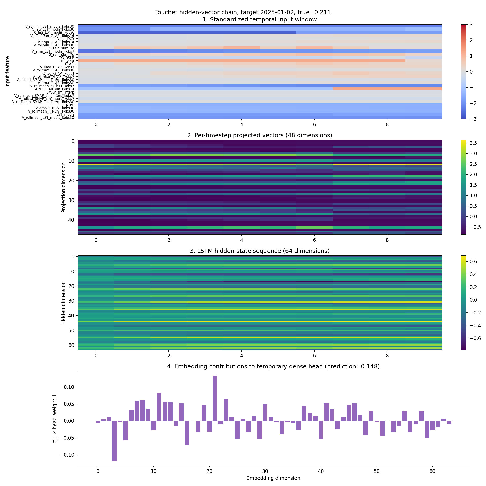
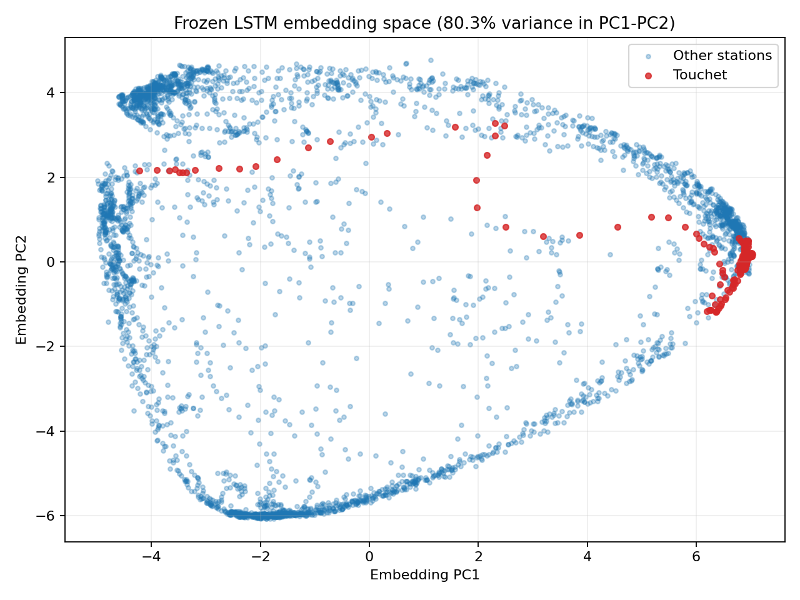
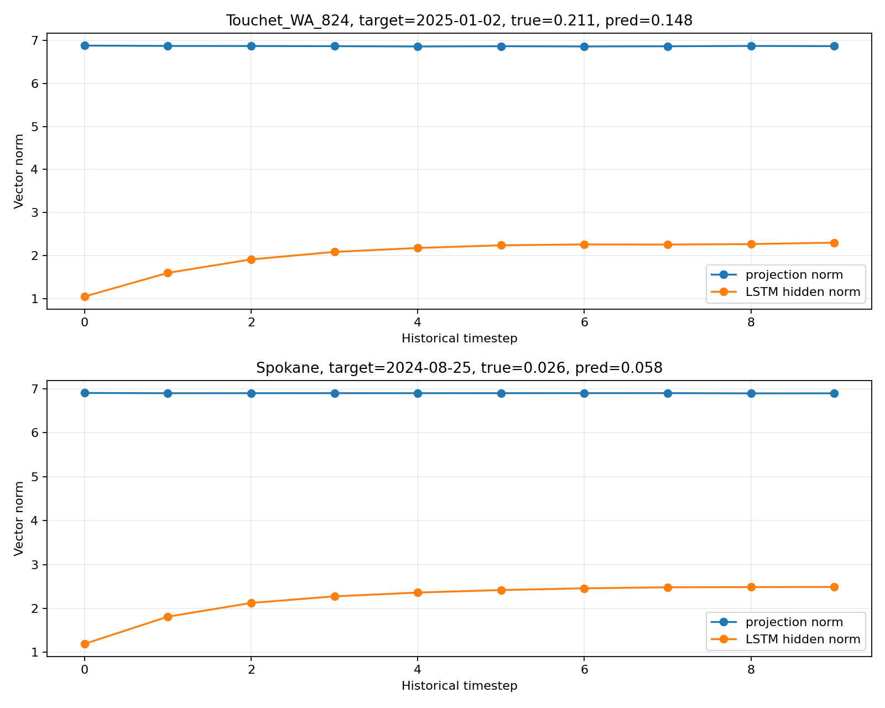
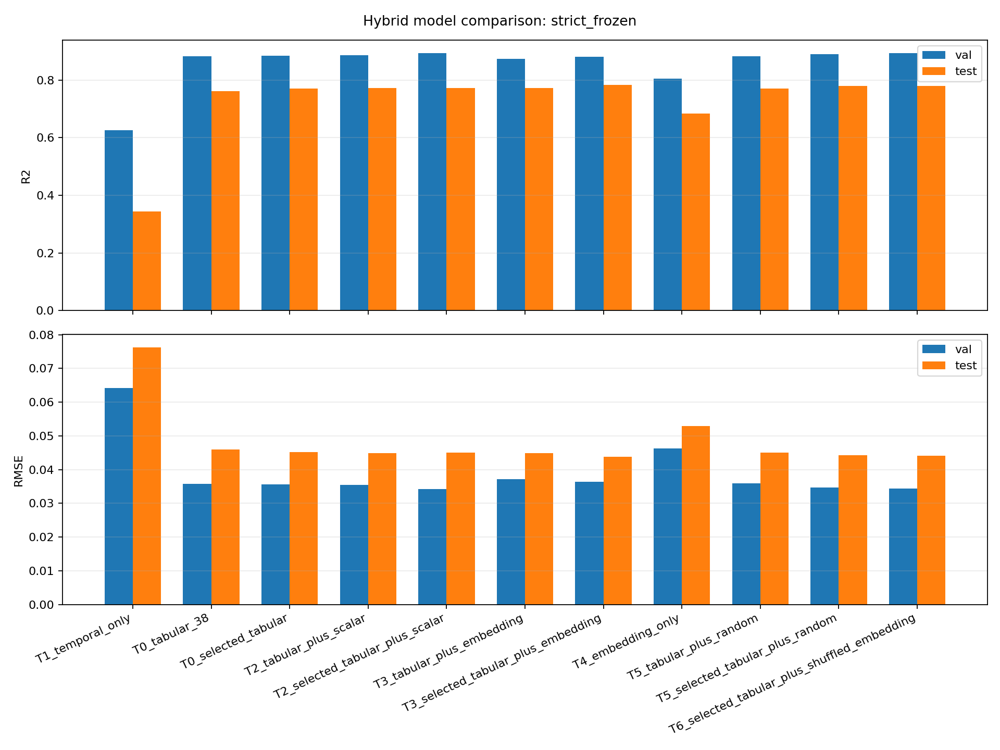

# LSTM Temporal Experiments
## Kerry Cheon 07/21/2026

## Context: what the v23 LSTM uses

The reference temporal model for this report is the v23 baseline from `Models/Temporal/lstm/train_v23_baseline.py`. That script has two configs, but the one carried forward into this week's hybrid work is `top25_seq30`: the v23 top-25 MDR-v25-derived feature set with a 30-day sequence window. The 7/21 hybrid experiment uses that v23 top-25 list as its starting point, then removes static site terms before constructing the temporal encoder inputs.

The v23 top-25 features are:

| Feature family | v23 features |
|---|---|
| LST / temperature dynamics | `V_rollmin_LST_modis_kobs30`, `C_lag_LST_modis_kobs30`, `C_lag_LST_modis_kobs6`, `V_ema_LST_modis_kobs7` |
| Rain, API, and drydown dynamics | `V_rollmean_G_API_kobs14`, `V_ema_G_API_kobs14`, `V_rollmin_G_API_kobs30`, `G_rain_sum_3d`, `G_rain_sum_7d`, `G_DSLR`, `G_API`, `V_ema_G_API_kobs7`, `V_rollmax_G_API_kobs30`, `C_lag_G_API_kobs1`, `V_rollmean_G_API_kobs7`, `V_ema_G_API_kobs30` |
| Seasonal / drift terms | `D_sin_DOY`, `cos_year`, `SMAP_x_year` |
| SMAP history | `V_rollstd_SMAP_sm_interp_kobs30` |
| Sentinel / SAR dynamics | `V_rollmean_s2_b11_kobs7`, `A_d_E_SAR_diff_kobs14` |
| Static site terms | `K_slope_sin`, `elev`, `K_slope_cos` |

For the 7/21 encoder, `current_with_smap_x_year` drops the static terms (`K_slope_sin`, `elev`, `K_slope_cos`) and keeps the remaining 22 v23 temporal inputs. The alternative encoder removes `SMAP_x_year` and adds raw/rolling SMAP summaries plus NDVI/LST terms, giving the 30-input chain audited below.

## What I ran this week

| # | Experiment | Code / Output | Main Result | Bottom line |
|---|---|---|---|---|
| 1 | Remove `SMAP_x_year`; test SMAP mean/std, NDVI/LST, and soil | `notebooks/experiment/hybrid-temporal-tabular-1.0/run_feature_experiments.py` → `artifacts/feature_experiments/` | Five-station XGBoost test R² improved from 0.759 to 0.780 after removing `SMAP_x_year`; NDVI/LST reached 0.781; soil did not add another gain | `SMAP_x_year` is harmful in the tabular model under this matched run, but the replacement SMAP summaries are not the reason for the gain |
| 2 | Touchet error analysis | `run_touchet_analysis.py` → `artifacts/touchet_analysis/` | Touchet has a 1,437-day gap, no validation rows, low test variance, and 100% missing SMAP-derived values; persistence reaches R²=0.897 while the best learned model is still negative | Touchet is simultaneously a data-availability, temporal-continuity, distribution-shift, and R²-denominator problem |
| 3 | Hidden-vector chain audit | `temporal.py`, `run_hidden_trace.py` → `artifacts/hybrid/hidden_trace/` | Traced 30 inputs → 48 projected values/timestep → 64 LSTM states/timestep → 64-vector embedding → scalar head; Touchet's embedding OOD score is 1.021, similar to the other stations | Touchet does not fail through exploding/collapsed hidden states; the representation is in-support but maps its shifted, SMAP-missing sequence poorly |
| 4 | Frozen LSTM-vector + XGBoost hybrid | `run_hybrid.py`, `rerun_tree_controls.py` → `artifacts/hybrid/` | Leakage-safer selected-tabular + learned 64-vector reaches test R²=0.783 vs. 0.770 without extra vectors, but random and shuffled-vector controls reach 0.779 and 0.781 | Most of the apparent hybrid gain is reproduced by nuisance dimensions; learned temporal-vector benefit is not established yet |

## Experiment scope and protocol

I used the canonical `derived_9.0` CSVs but filtered them to the original five temporal stations so the experiment addresses the same Touchet/LSTM problem as the earlier reports:

- Darrington
- Quinault
- SourdoughGulch_WA_985
- Spokane
- Touchet_WA_824

The controlled tabular model is an actual `xgboost.XGBRegressor` using the 38-feature MDR-v25-aligned manifest exported by `train_v20.py`. The active MDR-v25 notebook itself could not be audited because the trusted `nb` CLI is not installed, so the numbers below are a new controlled experiment and **not** a claimed reproduction of the historical 0.822 notebook score.

The temporal extractor uses `seq_len=10` and excludes targets whose ten-row history spans more than 20 calendar days. This produces 6,731 training, 2,660 validation, and 3,916 test sequences. The experiments use seed 42; multi-seed confirmation is still required.

## Experiment 1: Remove SMAP×year and test alternative environmental features

Finding: removing `SMAP_x_year` is the clear improvement. Adding raw/rolling SMAP mean and standard deviation does not beat removal alone. NDVI/LST is approximately neutral on validation and gives the highest test R² by a very small margin. Soil features do not add another improvement.

The soil experiment uses the existing topsoil clay/sand features, adds the existing sand-clay ratio and clay-plus-sand terms, and one-hot encodes `J_soil_texture_usda_b0`. NDVI and LST are separate feature families: `F_NDVI` is vegetation greenness, while `LST_modis` is land-surface temperature.

| Variant | Features | Val R² | Val RMSE | Test R² | Test RMSE | Test MAE |
|---|---:|---:|---:|---:|---:|---:|
| 38-feature baseline | 38 | 0.875 | 0.03721 | 0.759 | 0.04623 | 0.03588 |
| **Remove `SMAP_x_year`** | 37 | **0.895** | **0.03405** | 0.780 | 0.04414 | **0.03309** |
| Alternative SMAP mean/std | 41 | 0.890 | 0.03484 | 0.771 | 0.04506 | 0.03422 |
| Alternative SMAP + NDVI/LST | 46 | 0.895 | 0.03411 | **0.781** | **0.04406** | 0.03346 |
| Alternative SMAP + soil | 44 | 0.889 | 0.03501 | 0.772 | 0.04493 | 0.03398 |
| Alternative SMAP + NDVI/LST + soil | 49 | 0.893 | 0.03441 | 0.775 | 0.04466 | 0.03390 |

Relative to the 38-feature control, removing `SMAP_x_year` improves test R² by +0.021 and lowers RMSE by 0.00209. Adding the alternate SMAP summaries back gives up 0.009 R², so the result does not support “replace the interaction with more SMAP rolling statistics” as the main explanation.

NDVI/LST raises test R² by only +0.0008 over removal alone. That is too small to treat as established with one seed, although its macro station R² is also slightly higher (0.456 vs. 0.439). The soil-only addition lowers test R² from 0.780 to 0.772. The existing soil variables may still help spatial generalization, but they did not improve this temporal five-station test.

The broader all-station diagnostic is much harder: baseline test R²=0.432, removal-only R²=0.428, and the complete environmental variant R²=0.438. Therefore the five-station `SMAP_x_year` conclusion should not be generalized to the full 31-station test surface without a station-scope analysis.



## Experiment 2: Why Touchet performs poorly

Finding: Touchet's negative R² is not caused by one issue.

### A. Coverage and target distribution

| Item | Touchet value |
|---|---:|
| Train rows | 1,397 |
| Validation rows | 0 |
| Test rows | 170 |
| Gap between last train and first test observation | 1,437 days |
| Train target mean | 0.1542 |
| Test target mean | 0.1989 |
| Mean shift | +0.0447 |
| Test target standard deviation | 0.0300 |

The low test standard deviation makes station-level R² very punitive: an RMSE of 0.03-0.04 is enough to produce a strongly negative value even though that error is not catastrophic on the global soil-moisture scale.

### B. SMAP is entirely unavailable at Touchet

All three audited SMAP-derived inputs are 100% missing in both Touchet train and test:

- `SMAP_sm_interp`
- `SMAP_x_year`
- `V_rollstd_SMAP_sm_interp_kobs30`

They are therefore replaced by global train medians during preprocessing. The model never receives a Touchet-specific SMAP signal, and the SMAP-only baseline cannot be calculated (`n=0`). This also explains why removing `SMAP_x_year` is harmless or beneficial for Touchet specifically.

### C. The remaining dynamic features shift

| Feature | Test-train standardized mean shift | Wasserstein distance | Test outside Touchet train [p1,p99] |
|---|---:|---:|---:|
| `LST_modis` | **−1.002** | 11.85 K | 12.4% |
| `F_NDVI` | −0.491 | 0.131 | 0.0% |
| `G_API` | +0.396 | 9.05 | 0.0% |
| `G_rain_sum_7d` | +0.322 | 7.73 | 0.0% |

The 2024-2025 Touchet observations are substantially cooler and less vegetated than its 2017-2020 history, while API and recent rainfall are higher.

### D. Model and baseline results

| Model | n | Touchet R² | RMSE | MAE | Bias |
|---|---:|---:|---:|---:|---:|
| Persistence (previous in-situ target) | 170 | **0.897** | **0.00963** | **0.00256** | +0.00011 |
| Strict frozen hybrid | 160 | −0.710 | 0.03066 | 0.02637 | −0.00871 |
| Current temporal inputs | 160 | −1.082 | 0.03383 | 0.02899 | +0.00437 |
| Monthly train climatology | 170 | −0.367 | 0.03502 | 0.03111 | −0.01862 |
| Tabular minus `SMAP_x_year` | 170 | −0.620 | 0.03813 | 0.02352 | +0.00753 |
| 38-feature tabular baseline | 170 | −0.790 | 0.04008 | 0.02472 | +0.01063 |
| Alternative temporal inputs | 160 | −4.454 | 0.05476 | 0.04645 | −0.01853 |

Persistence assumes yesterday's in-situ soil moisture is available, so it is not a fair deployment baseline if the station sensor is absent. It is still an important diagnostic: Touchet's test target is extremely smooth, and the current satellite/weather-only models are failing to preserve that continuity.

The gap-aware models exclude the first ten Touchet targets after the 1,437-day break, which is why their coverage is 160 rather than 170. On matched rows, the hybrid reduces Touchet RMSE from 0.03951 for its selected-tabular control to 0.03066 and raises R² from −1.840 to −0.710. It helps materially, but does not solve the station.







## Experiment 3: What happens inside the temporal extractor

Finding: the learned vector chain is numerically stable, and Touchet's embedding is not globally out-of-distribution. The error develops as an incorrect but in-support temporal representation rather than an exploding or obviously corrupt activation.

I implemented an explicit encoder/head separation:

```text
30 time-varying inputs × 10 historical timesteps
    → 48-dimensional projected vector at every timestep
    → 64-dimensional LSTM hidden state at every timestep
    → final 64-dimensional hidden state
    → learned 64-dimensional embedding
    → temporary dense scalar head
```

`encode(sequence)` returns the 64-vector. `forward(sequence)` applies the temporary head. `forward_with_trace(sequence)` returns the input, projection, recurrent sequence, final hidden/cell states, embedding, and scalar prediction.

### Input-set comparison

| Temporal input set | Val R² | Val RMSE | Test R² | Test RMSE | Test MAE |
|---|---:|---:|---:|---:|---:|
| Current set with `SMAP_x_year` | 0.710 | 0.05654 | **0.653** | **0.05546** | **0.04328** |
| Alternative without `SMAP_x_year`, with SMAP summaries + NDVI/LST | **0.785** | **0.04865** | 0.600 | 0.05955 | 0.04507 |

This is another validation/test reversal. The alternative was correctly selected by validation for the hybrid experiment, but the current temporal input set generalized better to test. Removing `SMAP_x_year` is therefore beneficial for XGBoost but not proven beneficial for the standalone LSTM.

### Hidden-state findings

The per-station test embedding OOD scores are:

| Station | Mean embedding OOD score |
|---|---:|
| Quinault | 0.904 |
| Spokane | 0.988 |
| SourdoughGulch | 1.007 |
| Darrington | 1.017 |
| Touchet | **1.021** |

Touchet is the highest, but only marginally. Its mean projected, recurrent, final-hidden, and embedding norms are also within the other stations' ranges. The near-constant projection and embedding norms are expected consequences of their LayerNorm stages, not evidence of collapse.

PCA puts Touchet mainly on one populated edge of the learned manifold rather than in an isolated cloud. PC1-PC2 explain 80.3% of embedding variance. The representation recognizes Touchet as a specific temporal regime, but the temporary head maps portions of that regime incorrectly.

For the traced 2025-01-02 example, ground truth is 0.211 and the temporary head predicts 0.148. The recurrent-state norm grows smoothly across the ten-day history; there is no numerical jump. The largest head contributions include `z_21=+0.133` and `z_03=−0.120`, showing that the final error is produced by competing embedding components rather than one saturated dimension.







## Experiment 4: Frozen LSTM embedding + XGBoost

Finding: the full 64-vector scores better than the LSTM's scalar output, but matched random and shuffled-vector controls reproduce most of that gain. The result depends on how the extractor and tree-training periods are separated and is not yet convincing evidence that the learned representation is responsible.

I evaluated two protocols.

### A. Conventional full-train extraction

The encoder is trained on 2017-2020, frozen, and used to generate embeddings for those same training rows. This matches the straightforward hybrid recipe, but the tree sees in-sample supervised representations.

Under this protocol, the selected 37-feature tabular model scores test R²=0.768, while selected tabular + embedding falls to 0.758. Selected tabular plus random or shuffled dimensions scores 0.776 and 0.775, respectively. The conventional learned hybrid does **not** work in this run.

### B. Strict frozen extraction

To keep a stable latent basis without training the encoder on the tree's target rows:

1. Select the encoder epoch using 2017 → 2018; best epoch = 44.
2. Refit the encoder on 2017-2018 for exactly 44 epochs.
3. Freeze the encoder.
4. Train XGBoost on 2019-2020 tabular rows and frozen embeddings.
5. Validate on 2021-2022 and test on 2023-2025.

| Model | Inputs | Val R² | Test R² | Test RMSE | Test MAE | Macro station R² |
|---|---|---:|---:|---:|---:|---:|
| T1 | Temporary LSTM head only | 0.626 | 0.344 | 0.07628 | 0.05941 | −1.454 |
| T0 | Original 38 tabular | 0.884 | 0.761 | 0.04602 | 0.03412 | 0.188 |
| T0 selected | 37 tabular, no `SMAP_x_year` | **0.885** | 0.770 | 0.04516 | 0.03302 | 0.192 |
| T2 | Original tabular + scalar LSTM prediction | 0.886 | 0.772 | 0.04497 | 0.03317 | 0.085 |
| T2 selected | Selected tabular + scalar LSTM prediction | **0.894** | 0.772 | 0.04499 | 0.03251 | 0.079 |
| T3 | Original tabular + 64-vector | 0.875 | 0.772 | 0.04493 | 0.03344 | 0.352 |
| **T3 selected** | **Selected tabular + 64-vector** | 0.880 | **0.783** | **0.04385** | **0.03227** | **0.426** |
| T4 | 64-vector only through XGBoost | 0.806 | 0.684 | 0.05292 | 0.04056 | 0.254 |
| T5 | Original tabular + 64 random values | 0.883 | 0.770 | 0.04511 | 0.03338 | 0.155 |
| T5 selected | Selected tabular + 64 random values | 0.891 | 0.779 | 0.04422 | **0.03189** | 0.275 |
| T6 selected | Selected tabular + row-shuffled learned vector | 0.893 | 0.781 | 0.04410 | 0.03196 | 0.281 |

The matched embedding effect is:

- Selected tabular only: test R²=0.7699, RMSE=0.04516.
- Selected tabular + scalar: test R²=0.7717, RMSE=0.04499.
- Selected tabular + 64 random values: test R²=0.7794, RMSE=0.04422.
- Selected tabular + row-shuffled learned vector: test R²=0.7806, RMSE=0.04410.
- Selected tabular + 64-vector: test R²=0.7831, RMSE=0.04385.
- Gain from the vector over its selected-tabular control: **+0.0132 R²**, with RMSE reduced by 0.00131 (2.9%).

The learned vector improves R² by only +0.0037 over the matched random-vector control and +0.0025 over the shuffled-embedding control. It also has slightly worse MAE than both nuisance controls. This suggests that adding 64 columns changes XGBoost's stochastic feature subsampling or regularization behavior and accounts for most of the raw +0.0132 gain. The embedding-only tree's R²=0.684 shows that the representation is predictive by itself, but does not establish incremental information after tabular inputs are present.

### Per-station effect of the strict hybrid

| Station | Selected tabular R² | Selected tabular + vector R² | Change |
|---|---:|---:|---:|
| Darrington | 0.840 | 0.830 | −0.009 |
| Quinault | 0.700 | 0.709 | +0.009 |
| SourdoughGulch | 0.385 | 0.382 | −0.003 |
| Spokane | 0.877 | 0.916 | +0.039 |
| Touchet | −1.840 | −0.710 | +1.130 |

Most of the macro-station improvement comes from Touchet, while most of the strong-station gain comes from Spokane. Darrington and SourdoughGulch get slightly worse. This is not yet a uniform improvement.

There is also a selection warning: the strict hybrid has lower validation R² than the selected-tabular control (0.880 vs. 0.885) even though it performs better on test. Both nuisance controls also beat the learned vector on validation. Combined with the one-seed design and the failure of the conventional protocol, this is an exploratory result, not evidence for a new production winner.



## What I think is going on

1. **`SMAP_x_year` is model-dependent.** Removing it helps the tabular model, but the LSTM without it selects better on validation and generalizes worse on test. The temporal model was using the interaction as a crude drift correction.
2. **More SMAP statistics do not fix missing SMAP.** Touchet has no SMAP values at all, so every SMAP variant collapses to imputed constants there.
3. **Touchet's strongest signal is short-term target persistence.** Its test target is smooth enough for yesterday's value to reach R²=0.897. The current models do not receive that in-situ state and reconstruct continuity poorly after the multi-year break.
4. **The LSTM representation is not numerically broken.** Touchet's hidden states and embedding remain within the learned support. Its failure is semantic/calibrational, driven by shifted non-SMAP inputs and missing station-specific SMAP information.
5. **A learned-vector advantage is not established.** The strict learned vector is best on test R²/RMSE, but random and row-shuffled vectors recover most of its improvement and achieve slightly better MAE. The remaining +0.0025 to +0.0037 R² could be temporal information or one-seed noise.
6. **How the embedding is produced matters.** Independently trained encoders have unaligned latent dimensions, while using same-row supervised embeddings can overfit. A single earlier-period frozen encoder gives a stable and cleaner interface, but uses less data.

## Limitations

- These are seed-42 experiments. Previous work showed LSTM test R² standard deviations around 0.02-0.04, so even the raw +0.013 hybrid gain—and especially the +0.0025 to +0.0037 residual over nuisance controls—requires multi-seed confirmation.
- With `colsample_bytree<1`, adding 64 columns changes how often the original tabular features are sampled. Random and shuffled controls expose this confound but do not remove it.
- The exact MDR-v25 notebook pipeline was not available through the required notebook CLI. The 38-feature manifest is versioned, but the XGBoost setup here is a new controlled baseline rather than a 0.822 reproduction.
- Test metrics are reported for diagnosis, as in the previous standups, but the validation/test ranking reversals show that repeated test-guided iteration is risky.
- The strict protocol trains the encoder on 2017-2018 and the tree on 2019-2020, sacrificing data to keep the representation basis stable and target separation clean.
- Persistence is only deployable when a recent in-situ measurement is available.
- The gap rule removes 100 test targets across the five stations. All reported hybrid models use the same 3,916-row gap-safe target set, and the exported artifacts record each window span.

## Ideas for next steps

1. **Run the strict frozen hybrid across the existing five seeds.** Include several random-vector and within-split shuffled-embedding replicates, keep identical rows, and report mean±std plus block-bootstrap uncertainty.
2. **Add a persistence/delta target experiment.** If yesterday's in-situ value is available, predict the daily change. If it is not, add a learned state initialized from weather/remote sensing and compare against the diagnostic persistence ceiling.
3. **Make missingness explicit.** Add station/timestep masks for SMAP availability and time since last observation so the LSTM can distinguish a measured zero-like value from globally imputed SMAP.
4. **Test 32 versus 64 embedding dimensions.** The 64-vector works under the strict protocol, but a smaller representation may reduce tree overfitting and seed instability.
5. **Use later rolling-origin validation.** The current validation period prefers the wrong temporal feature set. Evaluate whether a 2022-only or expanding-window selection criterion predicts 2023-2025 ordering better.
6. **Reproduce the active MDR-v25 baseline once `nb` is available.** Export its exact data filtering, feature list, preprocessing, and model settings before comparing the hybrid against the historical 0.822 anchor.
7. **Separate station scopes.** Repeat the feature and hybrid experiments on Washington-only stations and the full 31-station surface; the all-station feature results already behave differently from the original five.
8. **Remove the XGBoost feature-subsampling confound.** Rerun matched controls with `colsample_bytree=1.0`, or otherwise hold the expected number of sampled original tabular variables constant as vector width changes.

## Reproducibility artifacts

All new code and generated evidence are under:

```text
notebooks/experiment/hybrid-temporal-tabular-1.0/
```

The artifact validator checks that:

- every embedding has exactly 64 finite dimensions;
- `(station_id, date)` keys are unique and align with prediction rows;
- every retained sequence spans at most 20 days;
- stored R²/RMSE values reproduce directly from prediction CSVs;
- Touchet's SMAP missingness is exactly represented in the diagnostic outputs.

Validation command:

```bash
MPLCONFIGDIR=/private/tmp/mpl XDG_CACHE_HOME=/private/tmp/cache \
  .venv/bin/python notebooks/experiment/hybrid-temporal-tabular-1.0/validate_artifacts.py
```
