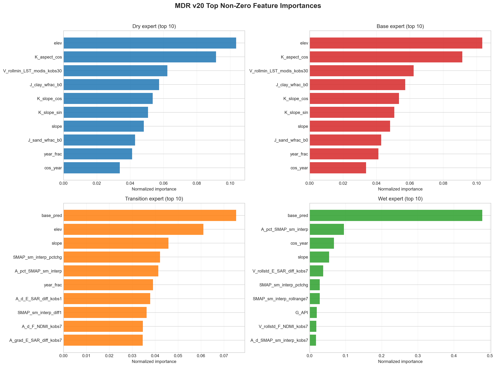
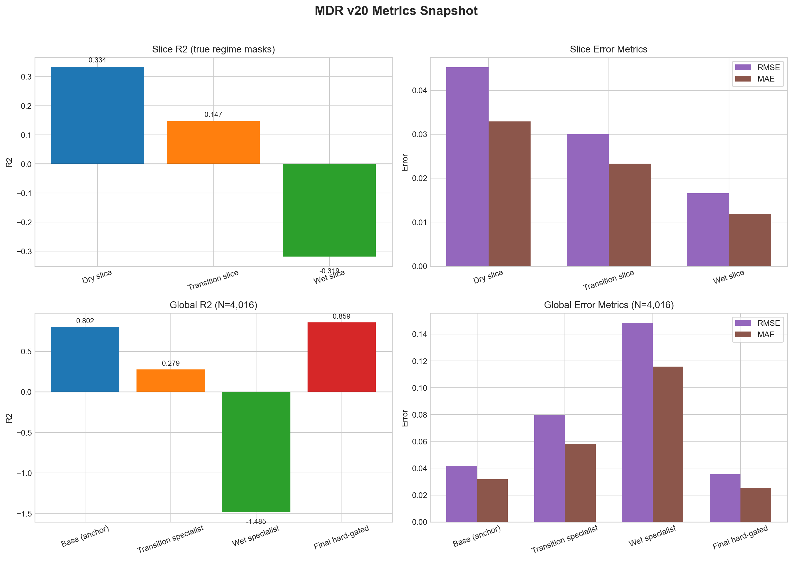

# MDR v20 Report (Feature Importances + Regime Metrics)

**Author:** Jakob Balkovec
**Date:** March 11, 2026

> Notes:
> 1. This report lists **non-zero** feature importances only.
> 2. `base_pred` = Base (anchor/dry) model prediction used as a meta-feature.
> 3. Metrics are split into **slice** (true regime mask) and **global** (full test set) so things don’t get mixed.

## Quick Read

- `Wet Expert` is still strongly anchored by `base_pred` (0.478872), then moisture-change and seasonal/topographic terms.
- `Dry` and `Base` look structurally similar: topography (`elev`, `K_aspect_cos`, slope terms) and seasonal features dominate, the differnence is how they're evaluated (dry slice vs full test set).
- `Transition Expert` is flatter (more distributed), with no single runaway feature.
- Slice performance: Dry is strongest (`r2=0.334`), Transition is moderate (`r2=0.147`), Wet slice is hardest (`r2=-0.319`).
- Global performance: hard-gated final blend is best overall (`r2=0.8586`, `rmse=0.0354`).

## Gating Thresholds (eval-only)

The gating thersholds are:
```yaml
t1: 0.200
t2: 0.313
```

These come from the distribution of the ground truth soil moisture values. The idea was just to split the data into three roughly equal chunks using quantiles. So t1 is the 33rd percentile and t2 is the 66th percentile of the soil moisture values.

## Visual Summary





## Metrics Snapshot

### Regime Slice Metrics (true masks)

| Regime Slice | $n$ | $r^2$ | $\text{MAE}$ | $\text{RMSE}$ | $\text{ubRMSE}$ | $\text{bias}$ | med_ae | p90_ae | q05_err | q50_err | q95_err |
|---|---:|---:|---:|---:|---:|---:|---:|---:|---:|---:|---:|
| Dry | 1,509 | 0.33437 | 0.03288 | 0.04525 | 0.03919 | -0.02262 | 0.02253 | 0.07470 | -0.09031 | -0.01637 | 0.03918 |
| Transition | 2,015 | 0.14745 | 0.02331 | 0.02997 | 0.02990 | -0.00204 | 0.01929 | 0.04969 | -0.05511 | -0.00083 | 0.04632 |
| Wet | 492 | -0.31852 | 0.01181 | 0.01659 | 0.01612 | 0.00395 | 0.00807 | 0.02969 | -0.01742 | 0.00048 | 0.03788 |

### Global Metrics (full test set, N=4,016)

| Model | $r^2$ | $\text{MAE}$ | $\text{RMSE}$ | $\text{ubRMSE}$ | $\text{bias}$ | med_ae | q05_err | q50_err | q95_err |
|---|---:|---:|---:|---:|---:|---:|---:|---:|---:|
| Base (anchor) | 0.80199 | 0.03186 | 0.04190 | 0.04178 | -0.00324 | 0.02458 | -0.07353 | -0.00503 | 0.06218 |
| Transition specialist | 0.27920 | 0.05810 | 0.07990 | 0.07070 | -0.03731 | 0.03791 | -0.18150 | -0.01850 | 0.05243 |
| Wet specialist | -1.48470 | 0.11584 | 0.14840 | 0.09516 | -0.11391 | 0.08970 | -0.29757 | -0.09006 | 0.00289 |
| Final (hard-gated, eval-only) | 0.85860 | 0.02550 | 0.03541 | 0.03423 | -0.00904 | 0.01837 | -0.07135 | -0.00651 | 0.04343 |

## Feature Sets Used (v20.5)

### Base Expert (`FEATURE_COLS_BASE`)

```python
FEATURE_COLS_BASE = [
    "SMAP_sm_pm_interp_ema02",
    "SMAP_sm_interp_grad7",
    "SMAP_ampm_diff_interp",

    "G_API",
    "G_rain_sum_3d",
    "G_rain_sum_7d",
    "V_ema_G_API_kobs7",
    "V_ema_G_API_kobs14",
    "V_ema_G_API_kobs30",
    "V_rollmean_G_API_kobs7",
    "V_rollmean_G_API_kobs14",

    "A_d_E_SAR_diff_kobs14",

    "V_ema_LST_modis_kobs7",
    "A_d_LST_modis_kobs14",
    "V_rollmin_LST_modis_kobs30",

    "V_rollmean_s2_b11_kobs7",

    "year_frac", "sin_year", "cos_year",
    "API_x_year", "SMAP_x_year",

    "slope", "elev",
    "K_slope_sin", "K_slope_cos", "K_aspect_cos",
    "J_clay_wfrac_b0", "J_sand_wfrac_b0",
]
```

### Dry Expert (`FEATURE_COLS_DRY`)

```python
FEATURE_COLS_DRY = [
    "SMAP_sm_pm_interp_ema02",
    "SMAP_sm_interp_grad7",
    "SMAP_sm_interp_diff1",
    "A_d_SMAP_sm_interp_kobs14",

    "V_ema_LST_modis_kobs7",
    "V_rollmin_LST_modis_kobs30",
    "A_d_LST_modis_kobs14",

    "slope", "elev",
    "K_slope_sin", "K_slope_cos", "K_aspect_cos",
    "J_clay_wfrac_b0", "J_sand_wfrac_b0",

    "G_API",
    "V_ema_G_API_kobs14",
    "C_lag_G_API_kobs1",

    "V_rollmean_s2_b11_kobs7",

    "year_frac", "sin_year", "cos_year",
]
```

### Wet Expert (`FEATURE_COLS_WET`)

```python
FEATURE_COLS_WET = [
    "SMAP_sm_interp_diff1",
    "SMAP_sm_interp_rollstd7",
    "SMAP_sm_interp_rollrange7",
    "SMAP_sm_interp_pctchg",
    "A_d_SMAP_sm_interp_kobs7",
    "A_grad_SMAP_sm_interp_kobs7",
    "A_pct_SMAP_sm_interp",

    "G_API",
    "G_rain_sum_3d",
    "G_rain_sum_7d",
    "V_rollstd_G_API_kobs7",
    "V_rollcv_G_API_kobs7",
    "A_d_G_API_kobs7",

    "A_d_E_SAR_diff_kobs1",
    "A_d_E_SAR_diff_kobs7",
    "A_grad_E_SAR_diff_kobs7",
    "A_grad_E_SAR_ratio_kobs7",
    "V_rollstd_E_SAR_diff_kobs7",
    "V_rollstd_E_SAR_ratio_kobs7",

    "V_rollstd_F_NDMI_kobs7",
    "A_d_F_NDMI_kobs7",

    "year_frac", "sin_year", "cos_year",

    "slope", "elev",
]
```

### Transition Expert Inputs

```python
FEATURE_COLS_TRANSITION = FEATURE_COLS_WET + ["base_pred"]
```

## Non-Zero Feature Importances

### Wet Expert (24 non-zero features)

| Feature | Importance |
|---|---:|
| `base_pred` | 0.478872 |
| `A_pct_SMAP_sm_interp` | 0.094829 |
| `cos_year` | 0.067320 |
| `slope` | 0.053914 |
| `V_rollstd_E_SAR_diff_kobs7` | 0.037539 |
| `SMAP_sm_interp_pctchg` | 0.028101 |
| `SMAP_sm_interp_rollrange7` | 0.028045 |
| `G_API` | 0.019900 |
| `V_rollstd_F_NDMI_kobs7` | 0.018588 |
| `A_d_SMAP_sm_interp_kobs7` | 0.017699 |
| `A_grad_E_SAR_ratio_kobs7` | 0.014575 |
| `G_rain_sum_3d` | 0.014130 |
| `G_rain_sum_7d` | 0.014024 |
| `A_d_E_SAR_diff_kobs1` | 0.012060 |
| `sin_year` | 0.011976 |
| `A_d_F_NDMI_kobs7` | 0.011067 |
| `A_d_G_API_kobs7` | 0.008940 |
| `A_d_E_SAR_diff_kobs7` | 0.008860 |
| `year_frac` | 0.008491 |
| `A_grad_E_SAR_diff_kobs7` | 0.007790 |
| `V_rollstd_E_SAR_ratio_kobs7` | 0.007528 |
| `SMAP_sm_interp_diff1` | 0.007356 |
| `elev` | 0.006043 |
| `A_grad_SMAP_sm_interp_kobs7` | 0.003631 |

### Transition Expert (24 non-zero features)

| Feature | Importance |
|---|---:|
| `base_pred` | 0.075296 |
| `elev` | 0.061046 |
| `slope` | 0.045780 |
| `SMAP_sm_interp_pctchg` | 0.042115 |
| `A_pct_SMAP_sm_interp` | 0.041378 |
| `year_frac` | 0.039031 |
| `A_d_E_SAR_diff_kobs1` | 0.037856 |
| `SMAP_sm_interp_diff1` | 0.036240 |
| `A_d_F_NDMI_kobs7` | 0.034635 |
| `A_grad_E_SAR_diff_kobs7` | 0.034594 |
| `A_d_E_SAR_diff_kobs7` | 0.034297 |
| `A_grad_SMAP_sm_interp_kobs7` | 0.033453 |
| `A_d_G_API_kobs7` | 0.033370 |
| `sin_year` | 0.033297 |
| `A_grad_E_SAR_ratio_kobs7` | 0.033164 |
| `V_rollstd_F_NDMI_kobs7` | 0.033122 |
| `G_rain_sum_7d` | 0.032991 |
| `V_rollstd_E_SAR_ratio_kobs7` | 0.032948 |
| `G_rain_sum_3d` | 0.032854 |
| `A_d_SMAP_sm_interp_kobs7` | 0.032853 |
| `SMAP_sm_interp_rollrange7` | 0.032739 |
| `V_rollstd_E_SAR_diff_kobs7` | 0.032271 |
| `cos_year` | 0.032214 |
| `G_API` | 0.030540 |

### Dry Expert (28 non-zero features)

| Feature | Importance |
|---|---:|
| `elev` | 0.103500 |
| `K_aspect_cos` | 0.091500 |
| `V_rollmin_LST_modis_kobs30` | 0.062300 |
| `J_clay_wfrac_b0` | 0.057300 |
| `K_slope_cos` | 0.053500 |
| `K_slope_sin` | 0.050700 |
| `slope` | 0.048200 |
| `J_sand_wfrac_b0` | 0.042900 |
| `year_frac` | 0.041200 |
| `cos_year` | 0.033800 |
| `sin_year` | 0.033600 |
| `SMAP_x_year` | 0.028500 |
| `A_d_LST_modis_kobs14` | 0.026800 |
| `V_ema_G_API_kobs30` | 0.026300 |
| `API_x_year` | 0.025000 |
| `V_ema_LST_modis_kobs7` | 0.024600 |
| `A_d_E_SAR_diff_kobs14` | 0.023900 |
| `V_rollmean_G_API_kobs7` | 0.023500 |
| `V_rollmean_G_API_kobs14` | 0.023500 |
| `V_rollmean_s2_b11_kobs7` | 0.023000 |
| `V_ema_G_API_kobs14` | 0.021800 |
| `SMAP_ampm_diff_interp` | 0.021600 |
| `V_ema_G_API_kobs7` | 0.021200 |
| `G_rain_sum_7d` | 0.020300 |
| `G_rain_sum_3d` | 0.019500 |
| `SMAP_sm_interp_grad7` | 0.019200 |
| `SMAP_sm_pm_interp_ema02` | 0.017300 |
| `G_API` | 0.016700 |

### Base Expert (23 non-zero features)

| Feature | Importance |
|---|---:|
| `elev` | 0.103349 |
| `K_aspect_cos` | 0.091431 |
| `V_rollmin_LST_modis_kobs30` | 0.062222 |
| `J_clay_wfrac_b0` | 0.057228 |
| `K_slope_cos` | 0.053431 |
| `K_slope_sin` | 0.050679 |
| `slope` | 0.048147 |
| `J_sand_wfrac_b0` | 0.042830 |
| `year_frac` | 0.041115 |
| `cos_year` | 0.033772 |
| `sin_year` | 0.033569 |
| `SMAP_x_year` | 0.028469 |
| `A_d_LST_modis_kobs14` | 0.026732 |
| `V_ema_G_API_kobs30` | 0.026229 |
| `API_x_year` | 0.025010 |
| `V_ema_LST_modis_kobs7` | 0.024605 |
| `A_d_E_SAR_diff_kobs14` | 0.023830 |
| `V_rollmean_G_API_kobs7` | 0.023508 |
| `V_rollmean_G_API_kobs14` | 0.023501 |
| `V_rollmean_s2_b11_kobs7` | 0.022984 |
| `G_rain_sum_7d` | 0.020235 |
| `G_rain_sum_3d` | 0.019482 |
| `G_API` | 0.016677 |
