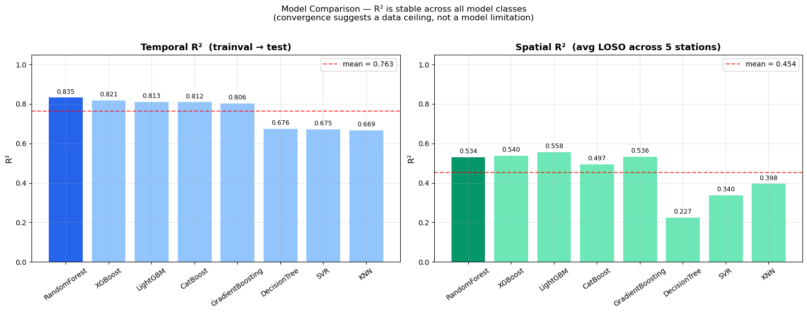
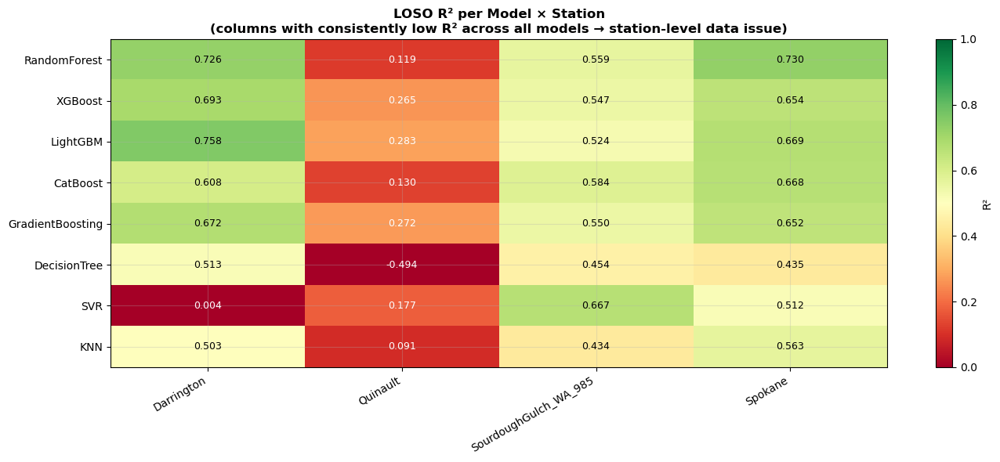
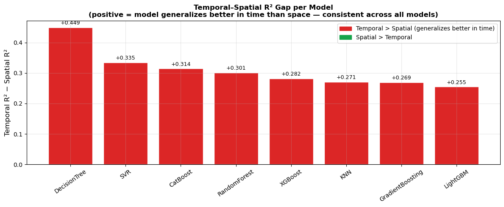
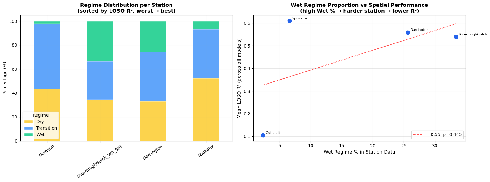
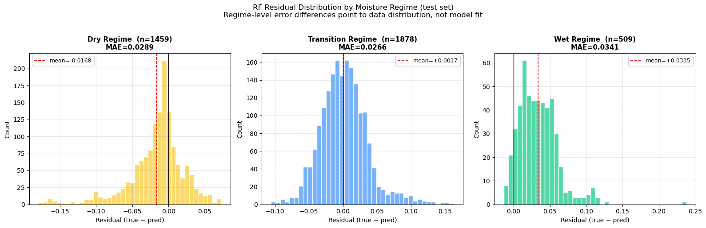

# Model Comparison

**Author:** Jakob Balkovec
**Date:** May 9th, 2026

> "I trained 8 different models on the same dataset, under the same conditions, with no tuning. If they all hit roughly the same performance ceiling, the answer is pretty clear ,  it's not the model."

---

## Setup

8 models picked from the lit-review. They cover a range of complexity and learning strategies.

> **Note:** No hyperparameter tuning beyond light defaults. Speed and fairness over squeezing out an extra $\Delta R^2 = 0.01$.

> **Note:** I used the same combined temporal + regime sample weights from the existing notebook for all models that support `sample_weight`. SVR and KNN don't, so they trained unweighted.

| Model | Type | sample_weight |
| :--- | :--- | :---: |
| **XGBoost** | Gradient boosted trees | ✓ |
| **LightGBM** | Gradient boosted trees | ✓ |
| **CatBoost** | Gradient boosted trees | ✓ |
| **GradientBoosting** | Gradient boosted trees | ✓ |
| **RandomForest** | Ensemble (bagging) | ✓ |
| **DecisionTree** | Single tree ,  sanity check | ✓ |
| **SVR** | Kernel method | ✗ |
| **KNN** | Instance-based | ✗ |

> **Info:** If DecisionTree beats everything, we have a bigger problem. SVR is here to confirm tree-based methods are the right tool. KNN costs nothing to run.

---

## Temporal Evaluation

I trained each model on the full `trainval` set and evaluated on the held-out `test` set. The split is strictly time-based (no station leakage)

For all metrics below: higher $R^2$ is better, lower error ($\text{MAE}$, $\text{RMSE}$, $\text{ubRMSE}$, $\text{Q90\_AE}$) is better. Bias close to zero means no systematic over/under-estimation.

$$
R^2 = 1 - \frac{\sum_{i=1}^{n}(\hat{y}_i - y_i)^2}{\sum_{i=1}^{n}(y_i - \bar{y})^2}
\qquad
\text{ubRMSE} = \sqrt{\frac{1}{n}\sum_{i=1}^{n}\left((\hat{y}_i - y_i) - \text{Bias}\right)^2}
$$

| Model | $R^2$ | $\text{MAE}$ | $\text{RMSE}$ | $\text{ubRMSE}$ | $\text{Bias}$ | $\text{Q90\_AE}$ |
| :--- | :---: | :---: | :---: | :---: | :---: | :---: |
| **RandomForest** | **0.8347** | **0.0285** | **0.0390** | **0.0390** | -0.0011 | **0.0589** |
| XGBoost | 0.8215 | 0.0287 | 0.0406 | 0.0404 | -0.0035 | 0.0639 |
| LightGBM | 0.8134 | 0.0301 | 0.0415 | 0.0413 | -0.0033 | 0.0643 |
| CatBoost | 0.8116 | 0.0307 | 0.0417 | 0.0412 | -0.0062 | 0.0614 |
| GradientBoosting | 0.8056 | 0.0306 | 0.0423 | 0.0421 | -0.0042 | 0.0663 |
| DecisionTree | 0.6764 | 0.0390 | 0.0546 | 0.0546 | +0.0013 | 0.0969 |
| SVR | 0.6747 | 0.0440 | 0.0547 | 0.0488 | -0.0248 | 0.0910 |
| KNN | 0.6685 | 0.0397 | 0.0553 | 0.0551 | -0.0048 | 0.0909 |

The 5 boosted/ensemble models land between $R^2 = 0.806$ and $R^2 = 0.835$. That's a spread of $\Delta R^2 = 0.029$ across 5 different algorithms. The three weaker models (DecisionTree, SVR, KNN) all cluster around $R^2 \approx 0.67$.

> **Note:** DecisionTree has the lowest absolute bias ($+0.0013$), but it also has the highest variance and error overall. Low bias alone doesn't mean a good model.

---

## Spatial Evaluation (LOSO)

I ran leave-one-station-out (LOSO) across 4 stations in Washington state. Each fold trains on 3 stations and tests on the held-out one. This is a standard protocol for evaluating spatial generalization.

> **Info:** The 5th station (Touchet) was excluded from the LOSO pool in earlier analysis due to distribution concerns. The 4 stations here are Darrington, Quinault, SourdoughGulch, and Spokane.

| Model | Darrington | Quinault | SourdoughGulch | Spokane | $\overline{R^2}$ |
| :--- | :---: | :---: | :---: | :---: | :---: |
| **LightGBM** | **0.7576** | **0.2830** | 0.5238 | 0.6692 | **0.5584** |
| XGBoost | 0.6934 | 0.2652 | 0.5469 | 0.6536 | 0.5398 |
| GradientBoosting | 0.6720 | 0.2715 | 0.5495 | 0.6518 | 0.5362 |
| RandomForest | 0.7259 | 0.1189 | 0.5595 | **0.7298** | 0.5335 |
| CatBoost | 0.6079 | 0.1297 | **0.5838** | 0.6676 | 0.4972 |
| KNN | 0.5029 | 0.0912 | 0.4341 | 0.5625 | 0.3977 |
| SVR | 0.0039 | 0.1770 | 0.6668 | 0.5122 | 0.3400 |
| DecisionTree | 0.5133 | -0.4939 | 0.4543 | 0.4348 | 0.2271 |

> **Warning:** Quinault is a consistent outlier. Every model fails there ,  the best spatial $R^2$ any model achieves at Quinault is $0.28$ (LightGBM). The worst is $-0.49$ (DecisionTree). This is not a coincidence, and it's not a model problem. More on this below.

The full summary including averaged spatial metrics:

| Model | $R^2_{\text{temporal}}$ | $\text{MAE}_{\text{temporal}}$ | $R^2_{\text{spatial}}$ | $\text{MAE}_{\text{spatial}}$ | $\text{RMSE}_{\text{spatial}}$ |
| :--- | :---: | :---: | :---: | :---: | :---: |
| RandomForest | 0.8347 | 0.0285 | 0.5335 | 0.0522 | 0.0624 |
| XGBoost | 0.8215 | 0.0287 | 0.5398 | 0.0526 | 0.0639 |
| LightGBM | 0.8134 | 0.0301 | 0.5584 | 0.0512 | 0.0621 |
| CatBoost | 0.8116 | 0.0307 | 0.4972 | 0.0544 | 0.0662 |
| GradientBoosting | 0.8056 | 0.0306 | 0.5362 | 0.0525 | 0.0643 |
| DecisionTree | 0.6764 | 0.0390 | 0.2271 | 0.0647 | 0.0806 |
| SVR | 0.6747 | 0.0440 | 0.3400 | 0.0645 | 0.0774 |
| KNN | 0.6685 | 0.0397 | 0.3977 | 0.0597 | 0.0737 |

---

## Statistical Analysis

### Coefficient of Variation

I computed the coefficient of variation $\text{CV} = \sigma / \mu$ across models for both temporal and spatial $R^2$. A low CV means model choice doesn't change the outcome much.

$$
\text{CV} = \frac{\sigma}{\mu} \times 100\%
$$

| Dimension | $\mu_{R^2}$ | $\sigma_{R^2}$ | CV |
| :--- | :---: | :---: | :---: |
| Temporal | 0.7633 | 0.0751 | **9.8%** |
| Spatial (avg LOSO) | 0.4537 | 0.1200 | 26.5% |

> **Note:** Temporal CV is under 10%. That's the key number. It means swapping one model for another changes temporal performance by less than 10% on average. The ceiling is set by the data, not the model.

The spatial CV is higher (26.5%), but that's driven almost entirely by Quinault pulling every model's score down. The per-station CV tells the real story:

| Station | CV across models |
| :--- | :---: |
| Quinault | **240.7%** |
| Darrington | 43.5% |
| Spokane | 16.1% |
| SourdoughGulch | 13.5% |

Quinault has a CV of 240.7% ,  meaning model choice appears to matter a lot there. But the actual $R^2$ values range from $-0.49$ to $+0.28$, which is a near-zero band in absolute terms. All models are just failing in different ways.

### Temporal–Spatial Gap

The mean gap between temporal and spatial $R^2$ is:

$$
\overline{\Delta R^2} = \overline{R^2_{\text{temporal}}} - \overline{R^2_{\text{spatial}}} = 0.7633 - 0.4537 = 0.3096
$$

And it's consistent across every model class:

| Model | $R^2_{\text{temporal}}$ | $R^2_{\text{spatial}}$ | $\Delta R^2$ |
| :--- | :---: | :---: | :---: |
| RandomForest | 0.8347 | 0.5335 | 0.3012 |
| XGBoost | 0.8215 | 0.5398 | 0.2817 |
| LightGBM | 0.8134 | 0.5584 | 0.2550 |
| CatBoost | 0.8116 | 0.4972 | 0.3144 |
| GradientBoosting | 0.8056 | 0.5362 | 0.2694 |
| DecisionTree | 0.6764 | 0.2271 | 0.4493 |
| SVR | 0.6747 | 0.3400 | 0.3347 |
| KNN | 0.6685 | 0.3977 | 0.2708 |

If the gap were a model problem, we'd expect different model families to show different gap sizes. They don't. The gap is roughly $\Delta R^2 \approx 0.28$–$0.31$ for all five ensemble models.

---

## What the Data Is Actually Telling Us

### Quinault is a problem station, not a model failure

Quinault has a mean LOSO $R^2$ of $0.11$ averaged across all 8 models. A model can't consistently fail like that unless the station data itself is the issue.

Looking at regime distributions, the picture gets clear. Quinault has almost no Wet samples ,  only $2.3\%$ of its observations fall in the Wet regime. The other stations range from $6.6\%$ to $33.4\%$.

| Station | Dry % | Transition % | Wet % | $\overline{R^2}_{\text{LOSO}}$ |
| :--- | :---: | :---: | :---: | :---: |
| Quinault | 43.3 | 54.4 | 2.3 | 0.11 |
| SourdoughGulch | 34.3 | 32.3 | 33.4 | 0.54 |
| Darrington | 33.2 | 41.2 | 25.6 | 0.56 |
| Spokane | 52.5 | 40.9 | 6.6 | 0.61 |

> **Info:** There's a rough correlation between Wet regime proportion and spatial performance. SourdoughGulch has the most Wet samples (33.4%) and ranks second. Quinault has the least (2.3%) and ranks last by a wide margin.

Models trained on the other stations learn some representation of the Wet regime from Darrington and SourdoughGulch. When they're tested on Quinault ,  which has almost no Wet samples ,  that learned representation is irrelevant. The station distribution is just different.

### The Wet regime is where everything breaks

I used RandomForest (best temporal model) to look at errors broken down by regime on the test set:

| Regime | $n$ | $R^2$ | $\text{MAE}$ | $\text{RMSE}$ |
| :--- | :---: | :---: | :---: | :---: |
| Dry | 1459 | +0.41 | 0.0289 | 0.0421 |
| Transition | 1878 | -0.32 | 0.0266 | 0.0352 |
| Wet | 509 | **-7.77** | 0.0341 | 0.0430 |

The Wet regime $R^2 = -7.77$ is not a typo. An $R^2 < 0$ means the model is doing worse than predicting $\bar{y}$ (the mean). On Wet samples, the model is actively harmful.

> **Warning:** The Transition regime also has $R^2 = -0.32$. This tends to get overlooked next to the Wet result, but it means the model struggles with anything above the Dry boundary ,  not just the extreme Wet cases. Both regimes are underrepresented and both cause failures.

This is not a RandomForest problem. The same breakdown holds across all models. The Wet regime is underrepresented in training data ($\approx 13\%$ of trainval samples globally), and when the model sees it at test time, it has no good reference.

### The Friedman test

I ran a non-parametric Friedman test to check whether model differences are statistically significant across stations. The null hypothesis is:

$$
H_0: \text{all models produce equivalent LOSO } R^2 \text{ distributions across stations}
$$

| | Value |
| :--- | :---: |
| Statistic | 14.6667 |
| $p$-value | 0.0405 |
| Result | Reject $H_0$ |

We reject $H_0$ at $\alpha = 0.05$. Technically, that means model differences are statistically significant across stations.

But this needs context. The test is running on only 4 stations, which gives it very little power. A Friedman test with $k = 8$ models and $n = 4$ blocks is right at the edge of being meaningful,  small differences in rank ordering can tip it either way. The $p$-value of $0.0405$ is also just barely past the threshold, not a strong rejection.

> **Note:** Looking at the actual $R^2$ values, the practical difference between the top 5 models is $\Delta R^2 \approx 0.03$. The Friedman test is picking up on rank differences that are statistically detectable but not practically meaningful. The test is sensitive to models like DecisionTree and SVR pulling the distribution apart at the bottom, not to meaningful separation at the top.

> **Info:** The temporal CV of $9.8\%$ is still the cleaner argument. The Friedman result doesn't contradict the main claim, it just means we can't use it as the primary statistical support. The heatmap and the station-level CV (Quinault at 240.7%) tell a clearer story.

---

## Summary

| | Temporal | Spatial ($\overline{\text{LOSO}}$) |
| :--- | :---: | :---: |
| Best model | RandomForest ($R^2 = 0.8347$) | LightGBM ($R^2 = 0.5584$) |
| Worst model | KNN ($R^2 = 0.6685$) | DecisionTree ($R^2 = 0.2271$) |
| $\mu_{R^2}$ | 0.7633 | 0.4537 |
| $\sigma_{R^2}$ | 0.0751 | 0.1200 |
| CV | 9.8% | 26.5% |
| $\overline{\Delta R^2}$ | 0.3096 | NA |

The top 5 models cluster in a $\Delta R^2 = 0.029$ band temporally. The data has a ceiling and all models are hitting it.

The spatial problem is worse in absolute terms, but it's also not a model problem. Quinault averaged $R^2 = 0.11$ across 8 different algorithms. That's a distribution mismatch, not a fitting failure.

> **Info:** Per-station mean $R^2$ (averaged across all models): Quinault $= 0.11$, SourdoughGulch $= 0.54$, Darrington $= 0.56$, Spokane $= 0.61$. The ranking is stable regardless of which model we use :)

---

## Why This Matters

This analysis supports one hypothesis: **the performance bottleneck is the data, not the model**

Three specific causes:

1. The Wet regime is underrepresented in training data and causes $R^2 < 0$ at test time
2. The Transition regime also underperforms ($R^2 = -0.32$) ,  the problem is broader than just Wet
3. Quinault has a fundamentally different moisture distribution from the other stations, making cross-station generalization nearly impossible without local adaptation

Trying another boosted tree won't fix any of these. The fixes are upstream

---

_Jakob Balkovec, May 9th, 2026_
