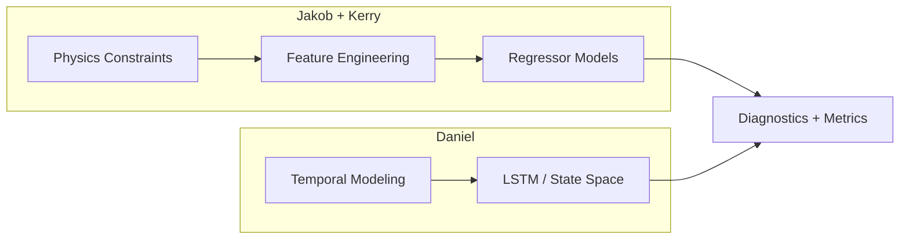
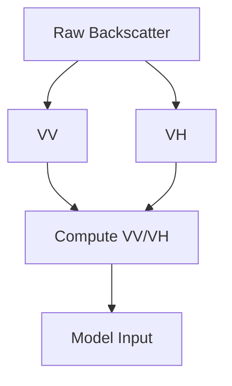
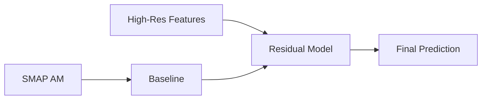
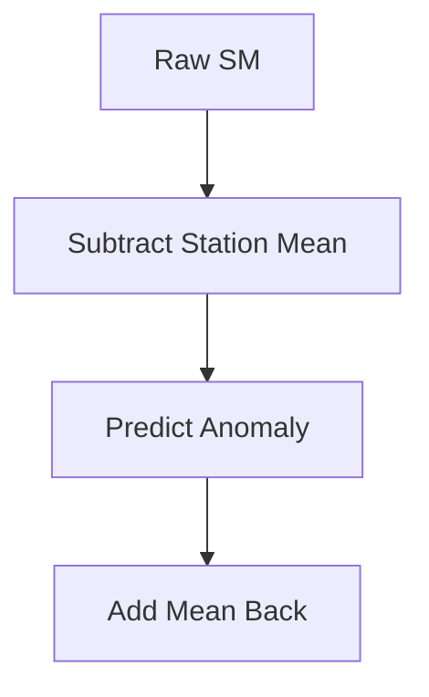
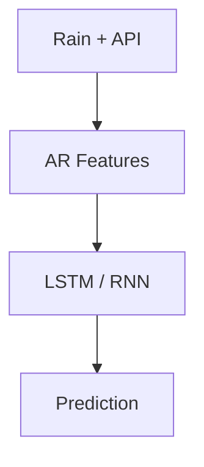
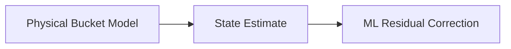
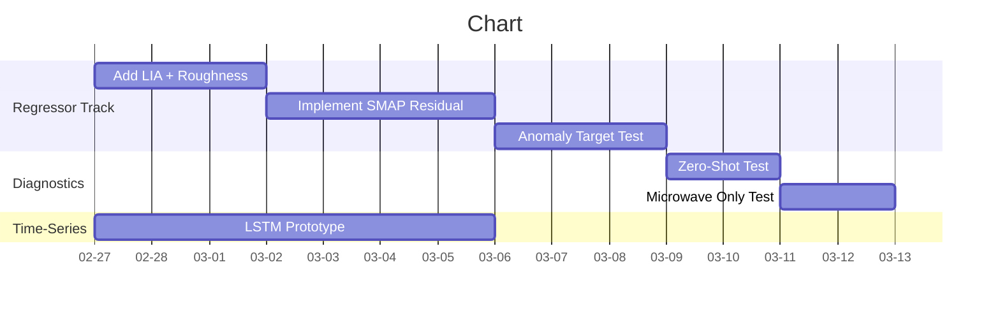

# Action Plan
_Based on Dr. Zhou Feedback_

Assignments:
- Daniel: Time-Series / Dynamic Modeling
- Jakob + Kerry: Physics-Aligned Regressors

---

# 1. Strategic Objective

Transition from pure algorithmic tuning to **physics-aligned modeling**.

Primary goals:

- Break structural performance ceiling
- Improve winter stability
- Improve station transferability
- Align feature importance with physical drivers
- Validate SMAP fusion correctly

---

# 2. High-Level Architecture

---

# PART I (Physics-Aligned Regressor Plan)

---

## A. Sentinel-1 Signal Strategy

Use:
- VV
- VH
- Ratio: $\frac{VV}{VH} $

Avoid:
- RVI unless validated

---

## B. Geometry

Add explicitly:
- Local Incidence Angle (LIA)

Ablation:
- DEM slope/aspect only
- DEM + LIA

Goal: verify geometry sensitivity improves physical alignment.

---

## C. Surface Roughness Proxy

Add static baseline features:

- Long-term temporal variance of VV
- Historical minimum VV

These approximate stable roughness characteristics.

---

## D. Freeze / Thaw Screening

Add flags:

$\text{Freeze Flag} =
\begin{cases}
1 & \text{if } LST < 0^\circ C \
0 & \text{otherwise}
\end{cases}$

Add:
- NDSI (snow index)

Re-evaluate winter R².

---

# PART II (SMAP Fusion Strategy)

---

## A. Switch to Residual Learning

Instead of: $\hat{y} = f(\text{Features}, \text{SMAP})$

Use: $r = y_{\text{station}} - y_{\text{SMAP}}$

Train: $\hat{r} = f(\text{High-Res Features})$

Final prediction: $\hat{y} = y_{\text{SMAP}} + \hat{r}$

Rules:
- Use AM only
- No imputation
- Train only on valid SMAP pixels

---

## B. Spatial Mismatch Test

Run 3 variants:

1. No SMAP
2. SMAP as feature
3. SMAP as baseline residual

Compare:

- $R^2$
- `ubRMSE`
- Bias (See note)
- Spatial variance retention

> **Note**: From what I observed, bias is irrelevant (at least for me & Kerry), the problem is variance.
---

# PART III (Target Strategy)

---

## Predict Anomalies

Compute station mean: $\mu_s = \frac{1}{N} \sum_{i=1}^{N} y_{s,i}$

Define anomaly: $y’ = y - \mu_s$

Train on $y’$

Final prediction: $\hat{y} = \hat{y’} + \mu_s$

Evaluate transferability under Leave-One-Station-Out (LOSO / Holdout)

---

# PART IV (Diagnostic Ablations)

---

## 1. Microwave + Rain Only

Remove:
- NDVI
- Optical features

Test robustness under cloud cover.

---

## 2. Memoryless Test

Remove:
- API
- Temporal lags

Measure drop in: $\Delta R^2$

Quantifies temporal memory importance.

---

## 3. Spatial Zero-Shot

Leave one station completely out of training.

Evaluate:
- Transferability
- Bias drift
- Stability

---

# PART V (Dynamic Track)

---

## Autoregressive Enhancement

Alternative hybrid:

Compare against boosting + strong AR features.

---

# PART VI (Evaluation Upgrade)

Beyond $$ R\^2 $$, compute:

$\text{ubRMSE} = \sqrt{\frac{1}{N} \sum \left( (y - \bar{y}) - (\hat{y} - \bar{\hat{y}}) \right)^2}$

Track:

- Bias
- Seasonal phase error
- Event response fidelity

Feature sanity expectation:

1. API / Rain
2. SMAP
3. LST
4. VV
5. NDVI

If ranking deviates strongly, reassess physics alignment.

---

# Definition of Success

We consider this phase successful if:

- Winter $R^2$ improves
- ubRMSE decreases
- Leave-one-station-out stabilizes
- Feature importance aligns with physics
- SMAP improves bias without destroying spatial texture

---

# Execution Gantt

---
_Jakob Balkovec_
