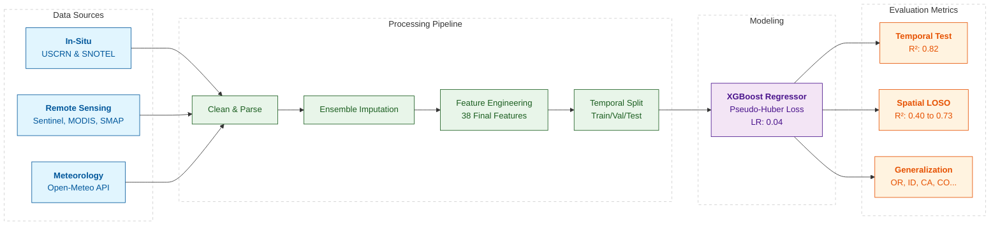

# Enhancing Spatial and Temporal Coverage of Soil Moisture Estimation Using Satellite and Weather-Driven Machine Learning

Jakob Balkovec · Kerry Cheon · Daniel Kirov-Tomilov · Wai Nam Lo · Gina Philipose · Xin Zhou · Shiny Abraham · Lin Li

Seattle University — Accepted to AIIoT 2026


---

## Abstract

> **Abstract—Soil moisture monitoring is essential for hydrology,
agriculture, and climate science, but current methods are limited
in either spatial or temporal coverage. In-situ sensors provide
accurate, high-frequency measurements but are sparsely
deployed, while satellite observations offer broader spatial
coverage but often lack daily continuity. To address this gap, we
propose a satellite-driven machine learning approach that uses
data imputation and XGBoost to estimate daily soil moisture at
locations without sensors. Model inputs include Sentinel-1,
Sentinel-2, Moderate Resolution Imaging Spectroradiometer
(MODIS), Soil Moisture Active Passive (SMAP), a digital elevation
model, and weather variables, with ground-truth soil moisture
from five public stations in Washington State, USA. Temporal
evaluation achieved strong performance, with R² = 0.822, MAE =
0.0283, RMSE = 0.0397, ubRMSE = 0.0396, bias = -0.0032, and the
90th quantile of residuals = 0.0615. Spatial evaluation showed
moderate performance with slightly higher errors due to station-
to-station variability. This work is part of an ongoing
interdisciplinary effort to develop low-cost, ground-based soil
moisture sensors for resource-constrained environments and to
design data fusion approaches that enhance the spatial and
temporal coverage of soil moisture estimation. Future work will
focus on integrating these new in-situ measurements to further
evaluate the data fusion framework.**

> **Keywords—soil moisture, remote sensing, satellite
observations, machine learning, in-situ sensing**

---

## Key Results

### Table III — Temporal performance across model families (test set 2023–2025)

| Model | R² | MAE | RMSE | ubRMSE | Bias |
| --- | --- | --- | --- | --- | --- |
| XGBoost (weighted) | **0.822** | **0.0283** | **0.0397** | **0.0396** | −0.0032 |
| XGBoost (unweighted) | 0.814 | 0.0304 | 0.0406 | 0.0405 | −0.0028 |

XGBoost with exponential temporal weighting achieves the best overall fit, reducing MAE by 7% relative to the unweighted baseline.

### Table IV — Effect of temporal weighting

| Metric | Unweighted | Weighted |
| --- | --- | --- |
| R² | 0.814 | **0.822** |
| MAE | 0.0304 | **0.0283** |
| RMSE | 0.0406 | **0.0397** |
| ubRMSE | 0.0405 | **0.0396** |
| Bias | −0.0028 | −0.0032 |
| P90 \|error\| | 0.0634 | **0.0615** |

Temporal weighting consistently improves all error metrics, confirming that emphasizing recent observations helps with environmental nonstationarity.

### Table V — LOSO spatial performance on Washington State stations

| Station | R² | MAE | RMSE | ubRMSE | Bias |
| --- | --- | --- | --- | --- | --- |
| Darrington | 0.730 | 0.0446 | 0.0543 | 0.0539 | +0.0064 |
| Quinault | 0.498 | 0.0439 | 0.0529 | 0.0449 | −0.0279 |
| SourdoughGulch\_WA\_985 | 0.545 | 0.0518 | 0.0646 | 0.0591 | +0.0262 |
| Spokane | 0.728 | 0.0499 | 0.0577 | 0.0570 | −0.0092 |
| Touchet\_WA\_824 | 0.403 | 0.0586 | 0.0677 | 0.0595 | −0.0322 |
| **Mean** | **0.581** | **0.0498** | **0.0594** | **0.0549** | — |

Leave-one-station-out cross-validation shows reasonable transfer to unseen stations (mean R² = 0.58), with Darrington and Spokane generalizing best.

### Table VI — Spatial performance on out-of-state ECE sensor deployments

| Device | n | Pearson | Spearman | Trend |
| --- | --- | --- | --- | --- |
| DEV3 | 7 | 0.81 | 0.82 | 0.50 |
| DEV4 | 8 | 0.65 | 0.55 | 0.57 |
| DEV7 | 11 | 0.24 | 0.23 | 0.70 |

The model captures coarse wet/dry temporal behavior at fully unseen sensor deployments, though small sample sizes limit statistical confidence.

---

## System Overview



---

## Dataset

### Training stations (Washington State)

| Station | Network | Climate |
| --- | --- | --- |
| Darrington-21-NNE | USCRN | Maritime / western Cascades |
| Quinault-4-NE | USCRN | Wet maritime / Olympic Peninsula |
| Spokane-17-SSW | USCRN | Semi-arid continental |
| SourdoughGulch | SNOTEL | Mountain snowpack zone |
| Touchet | SNOTEL | Semi-arid eastern Washington |

**Temporal coverage:** January 2017 – December 2025 (SMAP-constrained final window)

**Satellite inputs (Google Earth Engine)**
- Sentinel-1 SAR: VV/VH backscatter (dB and linear), 1000 m buffer
- Sentinel-2 L2A: bands B2, B3, B4, B8, B11, B12
- MODIS: land surface temperature (LST), NDVI
- SMAP: AM/PM soil moisture retrievals + quality flags
- SRTM DEM: elevation, slope, aspect

**Weather:** Open-Meteo historical archive API (daily precipitation, temperature, humidity)

**Target variable:** soil moisture at 5 cm depth (volumetric water content, m³/m³)

---

## Reproducing Results

```bash
conda env create -f environment.yml
conda activate mdr
make train
make eval
make figures
```

---

## LoRa Sensor Node

As part of this work we designed and deployed a low-cost soil moisture sensor node built around an ESP32 microcontroller and SX1262 LoRa radio ($40–70 USD in components). The node transmits readings over the Helium network using a capacitive soil moisture sensor and is solar-powered for continuous field deployment. These sensors provided the out-of-state ECE device evaluations (DEV3, DEV4, DEV7) described in Table VI. See Figure 1 in the paper for hardware details.

---

## Citation

```bibtex
@article{balkovec2026mdr,
  title   = {Enhancing Spatial and Temporal Coverage of Soil Moisture Estimation
             Using Satellite and Weather-Driven Machine Learning},
  author  = {Balkovec, Jakob and Cheon, Kerry and Kirov-Tomilov, Daniel and
             Lo, Wai Nam and Philipose, Gina and Zhou, Xin and
             Abraham, Shiny and Li, Lin},
  journal = {IEEE Xplore},
  year    = {2026},
  note    = {in press},
  % TODO: add doi = {...} when assigned
}
```

---

## Acknowledgements

> **The authors gratefully acknowledge the support provided by
the Multidisciplinary Research Grant from the College of
Science and Engineering at Seattle University. We also thank
Prof. Robin Q. Zhang in the Department of Earth and
Environmental Sciences at Murray State University for
contributing disciplinary expertise and valuable insights that
informed this work.**
