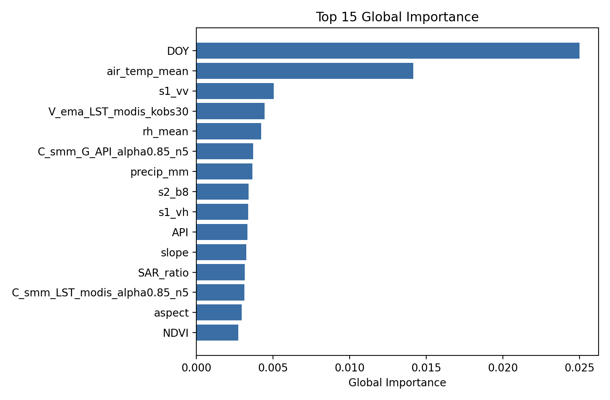
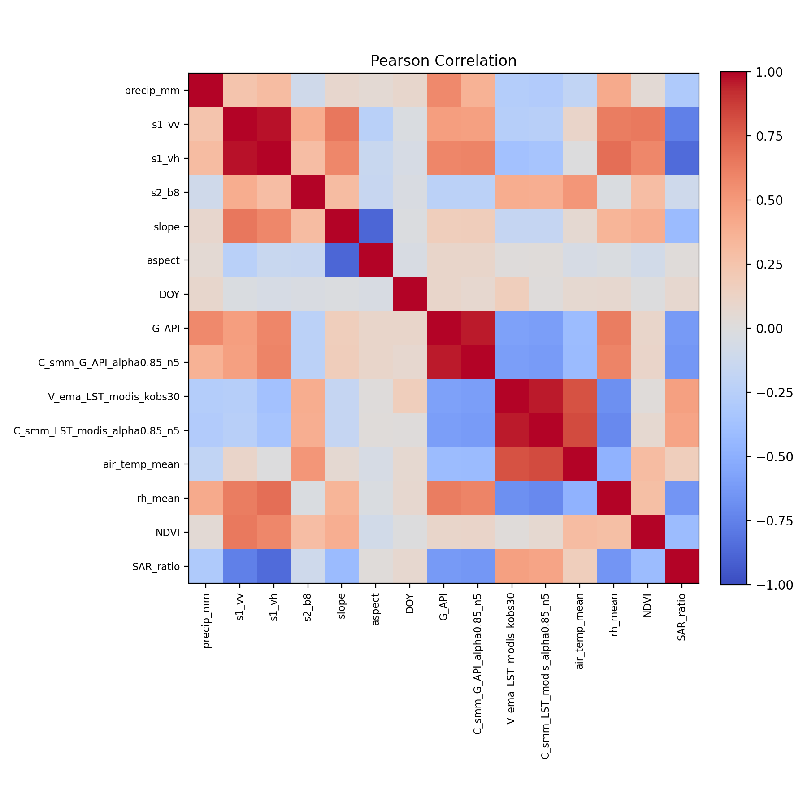
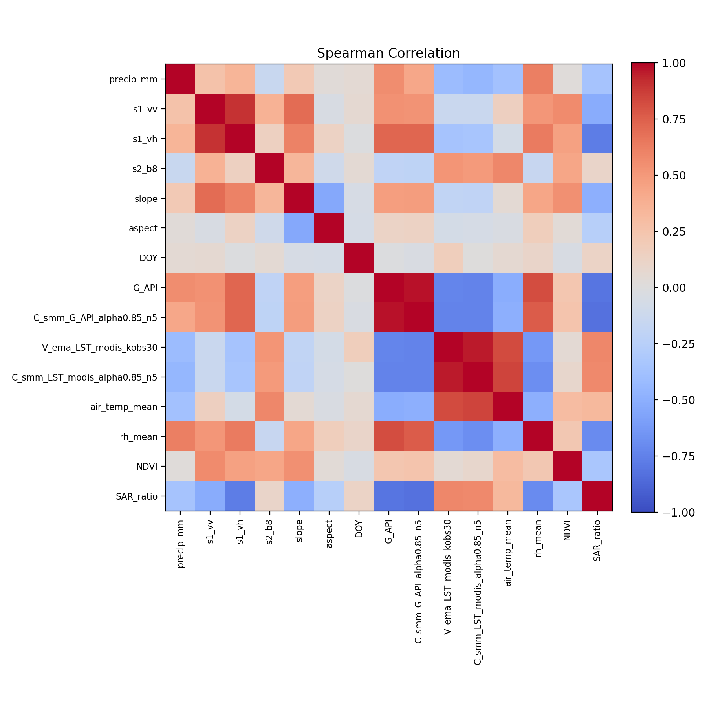
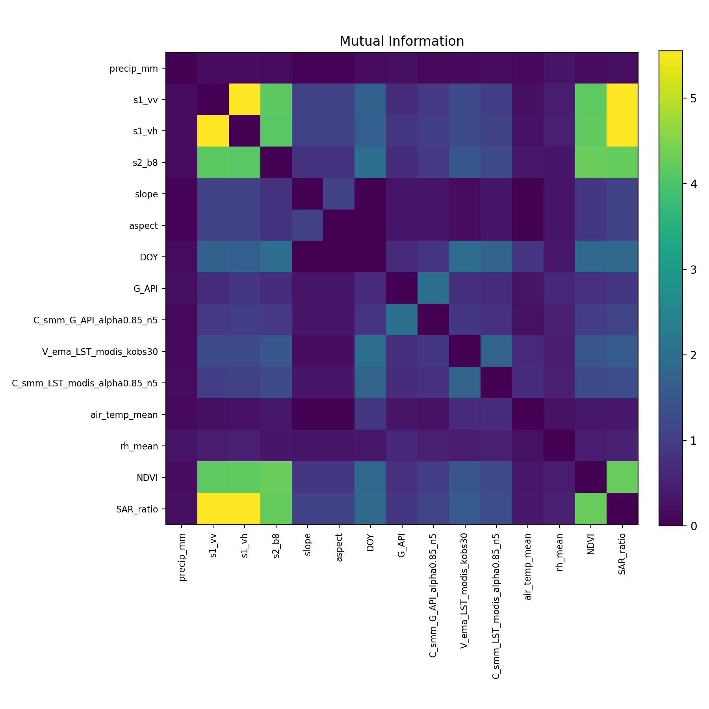

# Global SHAP Feature Importance + Correlation Report

**Author**: Jakob Balkovec
**Date:** Feb 10th 2026

## Quick Summary

- **Dataset**: `MDR/Temporal/Pipeline/data/splits/derived_new_updated/test_derived_updated.csv`
  - I had to make another split since some of the features were dropped in the original `test_derived.csv`. This new split is based on the same original data but retains all features for the test set.
- Selected features (after mapping): 15
- Missing after mapping: `None`
- Feature set 10 handling: `xgb`
- MI estimator: `scikit-learn` (symmetrized)
- Dataset selection: `max_coverage`

### Method

For each feature, I defined the following quantities:

- **Frequency**

  $$
  f = \frac{\#\{\text{feature sets where the feature appears in the top-10}\}}{11}
  $$

- **Average SHAP magnitude**

  $$
  \overline{|\mathrm{SHAP}|} = \frac{1}{n_f} \sum_{i=1}^{n_f} |\mathrm{SHAP}_i|
  $$

> Note: Where $n_f$ is the number of feature sets in which the feature appears in the top-10

- **Global feature importance**

  $$
  G = f \times \overline{|\mathrm{SHAP}|}
  $$

> Note: This metric prioritizes features that are both consistently important across feature sets and strongly influential within each set

Feature selection for correlation uses `top 15 by global_importance`. Correlations are computed on `MDR/Temporal/Pipeline/data/splits/derived_new_updated/test_derived_updated.csv`

**Stats:**

```
(rows: 1967, dropped NaNs: 862)
```

## Top Features by Global Importance

| Feature                      | Freq Count | Frequency | Avg SHAP | Global Importance |
| ---------------------------- | ---------- | --------- | -------- | ----------------- |
| DOY                          | 9          | 0.818     | 0.030560 | 0.025003          |
| air_temp_mean                | 4          | 0.364     | 0.038941 | 0.014160          |
| s1_vv                        | 7          | 0.636     | 0.007951 | 0.005060          |
| V_ema_LST_modis_kobs30       | 2          | 0.182     | 0.024560 | 0.004465          |
| rh_mean                      | 3          | 0.273     | 0.015523 | 0.004234          |
| C_smm_G_API_alpha0.85_n5     | 2          | 0.182     | 0.020411 | 0.003711          |
| precip_mm                    | 5          | 0.455     | 0.008061 | 0.003664          |
| s2_b8                        | 5          | 0.455     | 0.007492 | 0.003406          |
| s1_vh                        | 6          | 0.545     | 0.006226 | 0.003396          |
| API                          | 1          | 0.091     | 0.036759 | 0.003342          |
| slope                        | 3          | 0.273     | 0.011967 | 0.003264          |
| SAR_ratio                    | 5          | 0.455     | 0.006948 | 0.003158          |
| C_smm_LST_modis_alpha0.85_n5 | 2          | 0.182     | 0.017209 | 0.003129          |
| aspect                       | 3          | 0.273     | 0.010882 | 0.002968          |
| NDVI                         | 5          | 0.455     | 0.006030 | 0.002741          |



## Consistent Features

> Note: The following features appear in the top-10 for at least 6 out of the 11 feature sets. This indicates they are consistently important across different model configurations and data subsets

| Feature | Freq Count | Frequency | Avg SHAP | Global Importance |
| ------- | ---------- | --------- | -------- | ----------------- |
| DOY     | 9          | 0.818     | 0.030560 | 0.025003          |
| s1_vv   | 7          | 0.636     | 0.007951 | 0.005060          |
| s1_vh   | 6          | 0.545     | 0.006226 | 0.003396          |

**Condensed:**

| Feature (>=6/11) |
| ---------------- |
| DOY              |
| s1_vv            |
| s1_vh            |

## Correlation Analysis and Thresholding

After identifying features with high global importance, I moved onto examining pairwise relationships between these features using three complementary correlation measures

> Note: The formulas have been truncated for readability + the fact that these are standard definitions that can be easily looked up. The key point is that I used a combination of linear, monotonic, and nonlinear metrics to capture a wide range of potential dependencies between features.

For any feature pair \( (x, y) \), I computed:

- **Pearson correlation**
  \[
  r(x, y) = \frac{\mathrm{cov}(x, y)}{\sigma_x \sigma_y}
  \]

  > Note: This measures the strength of **linear** relationships

- **Spearman rank correlation**
  \[
  \rho(x, y) = r(\mathrm{rank}(x), \mathrm{rank}(y))
  \]

  > Note: This captures **monotonic** relationships, including nonlinear but consistently increasing or decreasing trends

- **Mutual information**
  \[
  \mathrm{MI}(x, y)
  \]
  > Note: This measures which **general nonlinear dependence** and can detect relationships missed by correlation coefficients

**Yoinked from**:

- [Pearson correlation coefficient](https://en.wikipedia.org/wiki/Pearson_correlation_coefficient)
- [Spearman’s rank correlation coefficient](https://en.wikipedia.org/wiki/Spearman%27s_rank_correlation_coefficient)
- [Mutual information](https://en.wikipedia.org/wiki/Mutual_information)

Feature pairs were flagged as **highly correlated** if **any** of the following criteria were satisfied:

- **Pearson correlation**:
  \( |r| \ge 0.8 \), indicating a strong linear relationship

- **Spearman correlation**:
  \( |\rho| \ge 0.8 \), indicating a strong monotonic relationship

- **Mutual information**:
  \( \mathrm{MI} \ge 0.1 \), indicating a meaningful nonlinear dependency

Using all three metrics together helps avoid missing important interactions that may not be strictly linear, while still keeping the set of candidate feature pairs focused and interpretable

## Heatmaps

These are for the selected features (after mapping)




## Top Correlated Pairs

> Note: I broke down the table into three sections based on the type of relationship (linear, monotonic, nonlinear) and the strength of the correlation. See below.

| Feature A                    | Feature B                    | Pearson | Spearman | Mutual Info | Relationship Type         |
| ---------------------------- | ---------------------------- | ------- | -------- | ----------- | ------------------------- |
| s1_vv                        | s1_vh                        | 0.976   | 0.899    | 5.554       | Strong positive linear    |
| s1_vh                        | SAR_ratio                    | -0.857  | -0.773   | 5.550       | Strong negative linear    |
| s1_vv                        | SAR_ratio                    | -0.757  | -0.518   | 5.549       | Nonlinear dependency      |
| s2_b8                        | NDVI                         | 0.293   | 0.431    | 4.285       | Nonlinear dependency      |
| NDVI                         | SAR_ratio                    | -0.410  | -0.330   | 4.260       | Nonlinear dependency      |
| s2_b8                        | SAR_ratio                    | -0.109  | 0.107    | 4.241       | Nonlinear dependency      |
| s1_vh                        | NDVI                         | 0.583   | 0.458    | 4.207       | Nonlinear dependency      |
| s1_vv                        | NDVI                         | 0.641   | 0.570    | 4.173       | Nonlinear dependency      |
| s1_vv                        | s2_b8                        | 0.398   | 0.366    | 4.145       | Nonlinear dependency      |
| s1_vh                        | s2_b8                        | 0.291   | 0.144    | 4.139       | Nonlinear dependency      |
| G_API                        | C_smm_G_API_alpha0.85_n5     | 0.955   | 0.975    | 2.029       | Strong positive monotonic |
| s2_b8                        | DOY                          | -0.033  | 0.050    | 2.004       | Nonlinear dependency      |
| DOY                          | V_ema_LST_modis_kobs30       | 0.168   | 0.170    | 1.959       | Nonlinear dependency      |
| DOY                          | SAR_ratio                    | 0.075   | 0.118    | 1.931       | Nonlinear dependency      |
| DOY                          | NDVI                         | -0.006  | -0.039   | 1.885       | Nonlinear dependency      |
| DOY                          | C_smm_LST_modis_alpha0.85_n5 | 0.009   | 0.007    | 1.772       | Nonlinear dependency      |
| V_ema_LST_modis_kobs30       | C_smm_LST_modis_alpha0.85_n5 | 0.959   | 0.960    | 1.758       | Strong positive linear    |
| s1_vv                        | DOY                          | -0.026  | 0.055    | 1.727       | Nonlinear dependency      |
| s1_vh                        | DOY                          | -0.049  | -0.009   | 1.667       | Nonlinear dependency      |
| V_ema_LST_modis_kobs30       | SAR_ratio                    | 0.461   | 0.584    | 1.619       | Strong positive monotonic |
| s2_b8                        | V_ema_LST_modis_kobs30       | 0.394   | 0.518    | 1.509       | Strong positive monotonic |
| V_ema_LST_modis_kobs30       | NDVI                         | 0.016   | 0.047    | 1.480       | Nonlinear dependency      |
| C_smm_LST_modis_alpha0.85_n5 | SAR_ratio                    | 0.442   | 0.574    | 1.344       | Strong positive monotonic |
| s1_vv                        | V_ema_LST_modis_kobs30       | -0.260  | -0.134   | 1.280       | Nonlinear dependency      |
| s1_vh                        | V_ema_LST_modis_kobs30       | -0.370  | -0.355   | 1.276       | Nonlinear dependency      |
| s2_b8                        | C_smm_LST_modis_alpha0.85_n5 | 0.385   | 0.497    | 1.270       | Strong positive monotonic |
| C_smm_LST_modis_alpha0.85_n5 | NDVI                         | 0.068   | 0.091    | 1.260       | Nonlinear dependency      |
| C_smm_G_API_alpha0.85_n5     | SAR_ratio                    | -0.634  | -0.827   | 1.137       | Strong negative monotonic |
| slope                        | aspect                       | -0.875  | -0.541   | 1.099       | Strong negative linear    |
| slope                        | SAR_ratio                    | -0.416  | -0.494   | 1.096       | Strong negative monotonic |

### Strong Linear Relationships

**Positive**:
| Feature A | Feature B | Pearson | Spearman | Mutual Info |
|----------|-----------|---------|----------|-------------|
| s1_vv | s1_vh | 0.976 | 0.899 | 5.554 |
| V_ema_LST_modis_kobs30 | C_smm_LST_modis_alpha0.85_n5 | 0.959 | 0.960 | 1.758 |

**Negative**:
| Feature A | Feature B | Pearson | Spearman | Mutual Info |
|----------|-----------|---------|----------|-------------|
| s1_vh | SAR_ratio | -0.857 | -0.773 | 5.550 |
| slope | aspect | -0.875 | -0.541 | 1.099 |

### Strong Monotonic Relationships

**Positive**:
| Feature A | Feature B | Pearson | Spearman | Mutual Info |
|----------|-----------|---------|----------|-------------|
| G_API | C_smm_G_API_alpha0.85_n5 | 0.955 | 0.975 | 2.029 |
| V_ema_LST_modis_kobs30 | SAR_ratio | 0.461 | 0.584 | 1.619 |
| s2_b8 | V_ema_LST_modis_kobs30 | 0.394 | 0.518 | 1.509 |
| C_smm_LST_modis_alpha0.85_n5 | SAR_ratio | 0.442 | 0.574 | 1.344 |
| s2_b8 | C_smm_LST_modis_alpha0.85_n5 | 0.385 | 0.497 | 1.270 |

**Negative**:
| Feature A | Feature B | Pearson | Spearman | Mutual Info |
|----------|-----------|---------|----------|-------------|
| C_smm_G_API_alpha0.85_n5 | SAR_ratio | -0.634 | -0.827 | 1.137 |
| slope | SAR_ratio | -0.416 | -0.494 | 1.096 |

### Nonlinear Dependencies

| Feature A                    | Feature B                    | Pearson | Spearman | Mutual Info |
| ---------------------------- | ---------------------------- | ------- | -------- | ----------- |
| s1_vv                        | SAR_ratio                    | -0.757  | -0.518   | 5.549       |
| s2_b8                        | NDVI                         | 0.293   | 0.431    | 4.285       |
| NDVI                         | SAR_ratio                    | -0.410  | -0.330   | 4.260       |
| s2_b8                        | SAR_ratio                    | -0.109  | 0.107    | 4.241       |
| s1_vh                        | NDVI                         | 0.583   | 0.458    | 4.207       |
| s1_vv                        | NDVI                         | 0.641   | 0.570    | 4.173       |
| s1_vv                        | s2_b8                        | 0.398   | 0.366    | 4.145       |
| s1_vh                        | s2_b8                        | 0.291   | 0.144    | 4.139       |
| s2_b8                        | DOY                          | -0.033  | 0.050    | 2.004       |
| DOY                          | V_ema_LST_modis_kobs30       | 0.168   | 0.170    | 1.959       |
| DOY                          | SAR_ratio                    | 0.075   | 0.118    | 1.931       |
| DOY                          | NDVI                         | -0.006  | -0.039   | 1.885       |
| DOY                          | C_smm_LST_modis_alpha0.85_n5 | 0.009   | 0.007    | 1.772       |
| s1_vv                        | DOY                          | -0.026  | 0.055    | 1.727       |
| s1_vh                        | DOY                          | -0.049  | -0.009   | 1.667       |
| V_ema_LST_modis_kobs30       | NDVI                         | 0.016   | 0.047    | 1.480       |
| s1_vv                        | V_ema_LST_modis_kobs30       | -0.260  | -0.134   | 1.280       |
| s1_vh                        | V_ema_LST_modis_kobs30       | -0.370  | -0.355   | 1.276       |
| C_smm_LST_modis_alpha0.85_n5 | NDVI                         | 0.068   | 0.091    | 1.260       |
