# Temporal Feature Sets Used in the Models

**Authors:** Jakob Balkovec, Kerry Cheon
**Last updated:** Fri Jan 23

This is a simple reference for which feature sets were used by each model run. Scores are **Test** set metrics from `Models/Temporal/RESULTS_JAKOB.md` + Kerry's results log. Feature names are the exact code labels used in the models (kept as-is)

## How to read the scores

- **$R^2$**: higher is better (explained variance)
- **RMSE / MAE**: lower is better (error size)

## Notes

These sets essentially form a timeline of our modeling decisions. The early ones are raw baselines. From there, we layer in derived features once leakage is addressed, and finally we prune or expand based on what actually moves the needle.

Family importance charts sum `feature_importance.csv` by family and normalize to 1.0. Unless noted otherwise, the run used is the first listed in each feature set.

We’d be happy to share additional details, data, or reports if helpful. Correlation and contribution analysis is not included in this notebook, but it is documented elsewhere. Our analysis shows that the features are very stable and provide a fairly strong signal. We validated this by removing features one by one and tracking changes in both error and $R^2$. That process made it clear that we are past the “add a clever feature to boost performance” phase. At this point, gains are coming less from new features and more from how specific parts of the data are modeled.

Most of our recent focus has been on understanding and stabilizing these harder regimes. Early on, rain appeared to be a major source of noise. Rain features fluctuate heavily and are difficult to model, which led us to experiment with modeling rain separately, potentially using a dedicated model to predict rain impact on soil moisture and then feeding that signal back in as a feature. That experiment did not improve performance, but it was still informative. It showed us that rain itself was not the core issue.

We then shifted our attention to seasonality. Initially, we assumed the problem was a simple summer versus winter split. What we found instead was that winter alone is the real challenge. I can’t fully explain the physical reasons behind this, as I’m not a domain expert and don’t yet have enough soil science background, but empirically the winter data is much harder to model and tends to inject noisy or misleading signal. We are intentionally not removing winter data, since doing so would inflate metrics and reduce generalization. We’re actively exploring ways to model winter behavior more effectively, but it has proven more difficult than we initially expected.

The next major direction is time series modeling. This is where we deliberately pumped the brakes. Building a proper time series model is nontrivial and would likely require more data. Given that, our current hypothesis is that adding spatial context could improve performance within the existing framework, effectively moving toward a spatio-temporal model rather than a purely temporal one.

**Motivation in plain terms**

- `v1.x`: start simple (raw bands + metadata) to get a clean baseline and sanity check the split.
- `v2.x`: fix leakage, then try a small, handpicked derived bundle to see if temporal dynamics help.
- `v3.x`: go all-in on derived families, then prune by importance to keep the signal and drop the noise.
- `v5.1`: swap in ElasticNet for a diagnostic pass (interpretability + feature selection).
- `v7.x`: pipeline-driven feature set, tuned models, and some careful pruning passes.
- `v8.x`: add rain impulse features to test explicit rainfall effects.

**What changed, and why**

- `Feature set 01-05`: raw inputs + light tweaks (baseline + early ablations like dropping `DOY`).
- `Feature set 06`: first curated derived set (handpicked, temporally valid).
- `Feature set 07`: derived set with one risky feature removed (`I_ts_spike_s1_vv`).
- `Feature set 08`: 40-feature derived subset (pruned from the full set).
- `Feature set 09`: rain impulse additions on top of the temporal core.
- `Feature set 10`: expanded temporal set used in the v7.x tuned runs.
- `Feature set 11`: the full derived family (89 features).

**Selection notes (where choices came from)**

- Ablation-driven tweaks: dropping `DOY` in v1.1, pruning low-importance families in v3.2, and removing `I_ts_spike_s1_vv` in v3.3.
- ElasticNet diagnostic: v5.1 runs on the same 40-feature core as v3.2, mainly for interpretability and feature selection signals.
- Feature pipeline: the derived families (A/B/C/D/E/F/G/H/I) powering v2.3 onward come straight from the temporal feature pipeline, and the v7.x feature bundle is pipeline-generated and then tuned.

> Note: If the importance says `0.0` for a feature, it means it was included in the model but had negligible importance (below rounding threshold). It does not equal 0.

## Feature set 01 (9 features)

Context: Baseline feature set built mostly from raw satellite bands and basic metadata.

Model runs:
| Version | Run folder | Test $R^2$ | Test RMSE | Test MAE |
| --- | --- | --- | --- | --- |
| v1.0.0 | `Models/Temporal/v1/v1.0/mdr_ts_v2_3_20260108_115420` | 0.520847 | 0.064362 | 0.049829 |
| v2.2.0 | `Models/Temporal/v2/v2.2/mdr_ts_v2_2_20260107_162107` | 0.506571 | 0.065313 | 0.050461 |

Features used:

```yaml
features:
  DOY: 0.3890
  s1_vv: 0.1315
  precip_mm: 0.1250
  SAR_ratio: 0.0883
  NDMI: 0.0759
  s1_vh: 0.0645
  MSI: 0.0589
  NDVI: 0.0450
  rain_mm: 0.0219
```

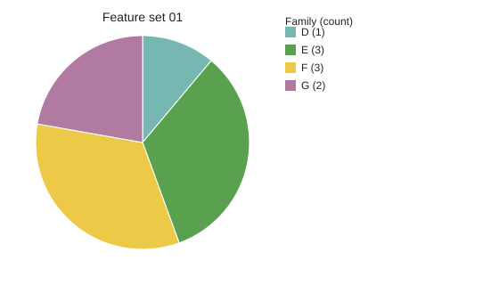

**Family importance (from `Models/Temporal/v1/v1.0/mdr_ts_v2_3_20260108_115420/feature_importance.csv`)**

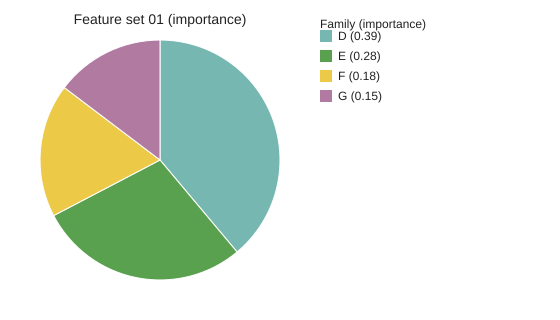

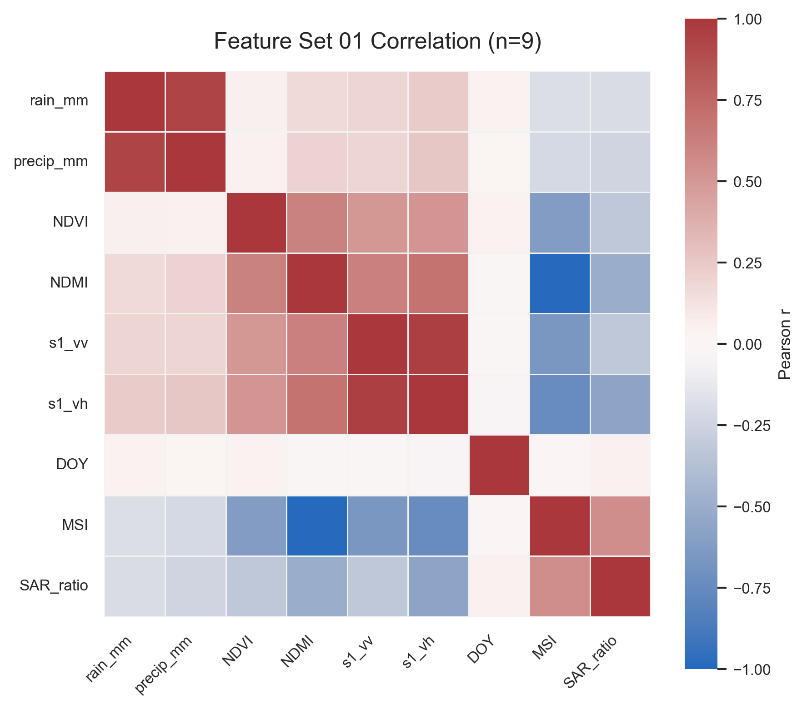

## Feature set 02 (12 features)

Context: Baseline feature set built mostly from raw satellite bands and basic metadata.

Model runs:
| Version | Run folder | Test $R^2$ | Test RMSE | Test MAE |
| --- | --- | --- | --- | --- |
| v1.2.0 | `Models/Temporal/v1/v1.2/mdr_ts_v1_2_20251223_113808` | 0.201255 | 0.068399 | 0.057298 |

Features used:

```yaml
features:
  air_temp_mean: 0.4226
  NDMI: 0.1138
  MSI: 0.0860
  precip_mm: 0.0730
  SAR_ratio: 0.0583
  s1_vv: 0.0543
  solar_radiation: 0.0532
  s1_vh: 0.0496
  rain_mm: 0.0468
  NDVI: 0.0425
  elev: 0.0000
  slope: 0.0000
```

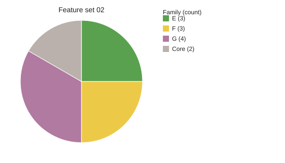

**Family importance (from `Models/Temporal/v1/v1.2/mdr_ts_v1_2_20251223_113808/feature_importance.csv`)**

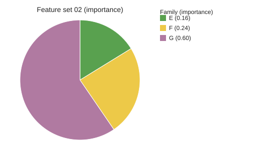

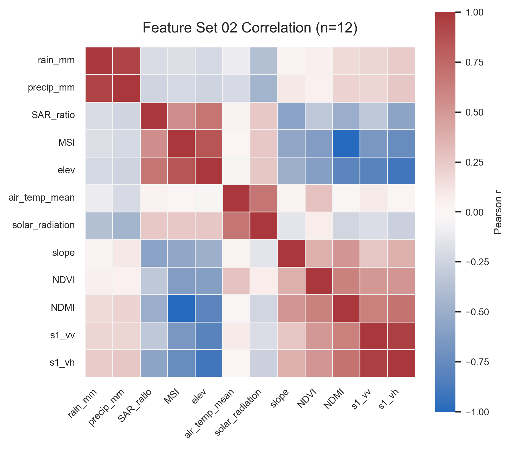

## Feature set 03 (12 features)

Context: Baseline feature set built mostly from raw satellite bands and basic metadata.

Model runs:
| Version | Run folder | Test $R^2$ | Test RMSE | Test MAE |
| --- | --- | --- | --- | --- |
| v2.1.0 | `Models/Temporal/v2/v2.1/mdr_ts_v2_1_20260106_211015` | 0.712817 | 0.052080 | 0.039524 |
| v2.2.0 | `Models/Temporal/v2/v2.2/mdr_ts_v2_2_20260107_161235` | 0.506571 | 0.065313 | 0.050461 |

Features used:

```yaml
features:
  air_temp_mean: 0.3956
  DOY: 0.1349
  s1_vh: 0.0906
  rh_mean: 0.0592
  MSI: 0.0591
  s1_vv: 0.0435
  SAR_ratio: 0.0429
  precip_mm: 0.0424
  NDMI: 0.0408
  NDVI: 0.0343
  solar_radiation: 0.0337
  rain_mm: 0.0230
```

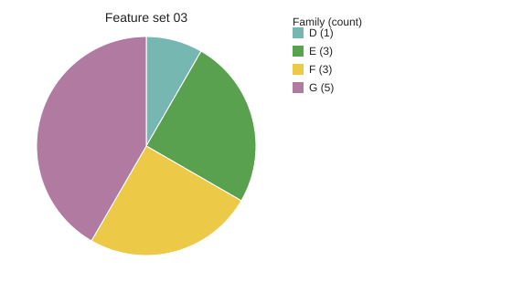

**Family importance (from `Models/Temporal/v2/v2.1/mdr_ts_v2_1_20260106_211015/feature_importance.csv`)**

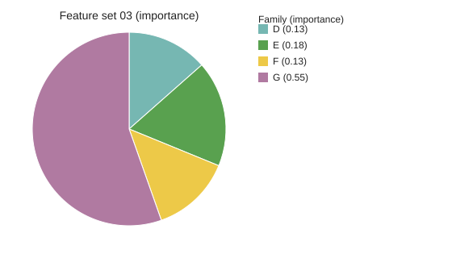

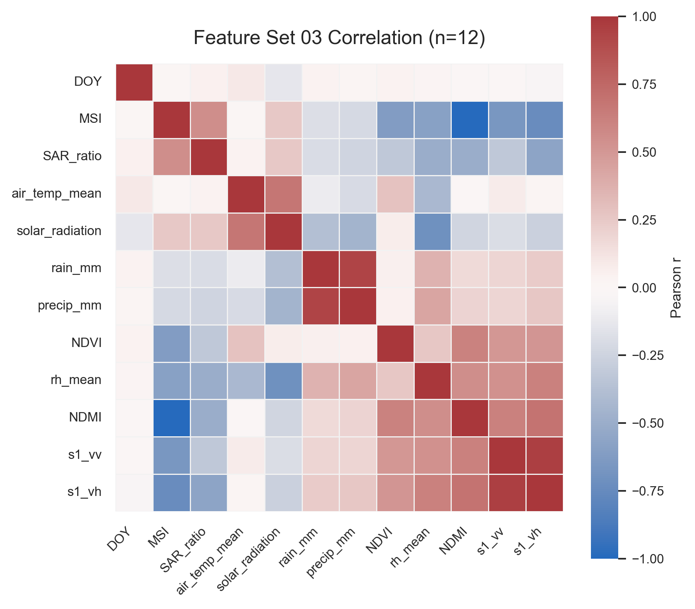

## Feature set 04 (13 features)

Context: Baseline feature set built mostly from raw satellite bands and basic metadata.

Model runs:
| Version | Run folder | Test $R^2$ | Test RMSE | Test MAE |
| --- | --- | --- | --- | --- |
| v1.1.0 | `Models/Temporal/v1/v1.1/mdr_ts_v1_1_20251223_113030` | 0.017134 | 0.075874 | 0.064540 |

Features used:

```yaml
features:
  air_temp_mean: 0.3680
  rh_mean: 0.1144
  MSI: 0.1132
  NDMI: 0.0750
  s1_vv: 0.0633
  precip_mm: 0.0574
  SAR_ratio: 0.0494
  s1_vh: 0.0466
  solar_radiation: 0.0465
  NDVI: 0.0382
  rain_mm: 0.0280
  elev: 0.0000
  slope: 0.0000
```

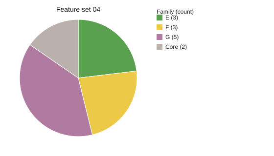

**Family importance (from `Models/Temporal/v1/v1.1/mdr_ts_v1_1_20251223_113030/feature_importance.csv`)**

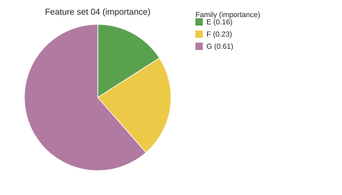

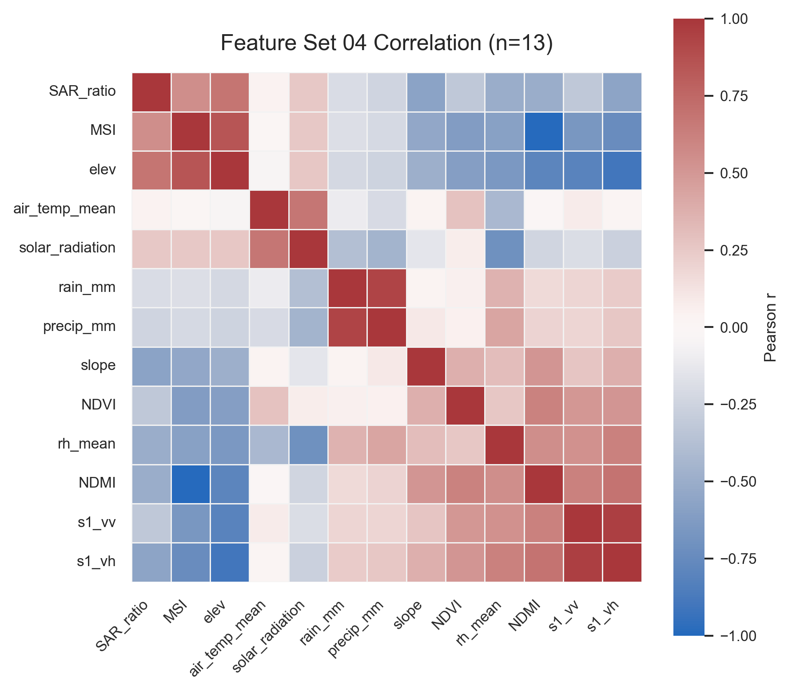

## Feature set 05 (14 features)

Context: Baseline feature set built mostly from raw satellite bands and basic metadata.

Model runs:
| Version | Run folder | Test $R^2$ | Test RMSE | Test MAE |
| --- | --- | --- | --- | --- |
| v1.0.0 | `Models/Temporal/v1/v1.0/mdr_ts_v1_0_20251223_105722` | 0.520847 | 0.064362 | 0.049829 |

Features used:

```yaml
features:
  air_temp_mean: 0.2793
  elev: 0.1922
  DOY: 0.1869
  NDMI: 0.0714
  rh_mean: 0.0656
  MSI: 0.0478
  solar_radiation: 0.0270
  s1_vv: 0.0227
  SAR_ratio: 0.0225
  precip_mm: 0.0224
  NDVI: 0.0222
  s1_vh: 0.0219
  rain_mm: 0.0116
  slope: 0.0064
```

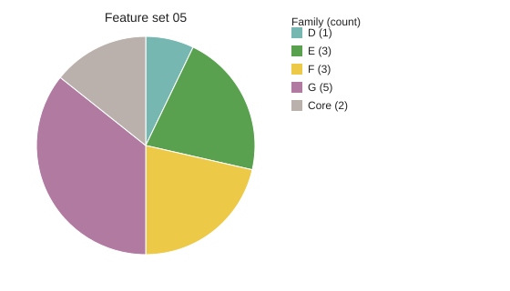

**Family importance (from `Models/Temporal/v1/v1.0/mdr_ts_v1_0_20251223_105722/feature_importance.csv`)**

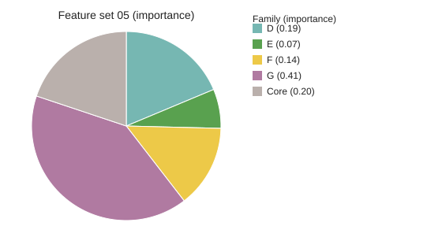

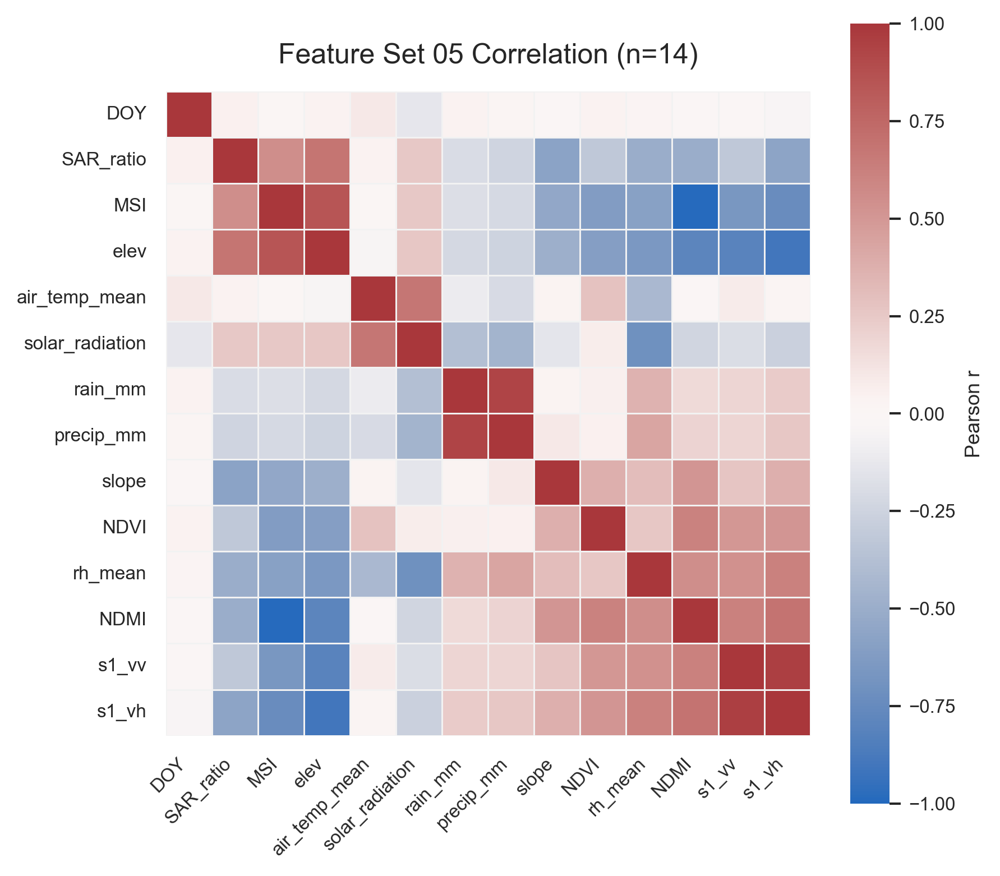

## Feature set 06 (22 features)

Context: Compact, handpicked derived set focused on short-term dynamics and precipitation memory.

Model runs:
| Version | Run folder | Test $R^2$ | Test RMSE | Test MAE |
| --- | --- | --- | --- | --- |
| v2.3.0 | `Models/Temporal/v2/v2.3/mdr_ts_v2_2_20260107_170214` | 0.671525 | 0.053289 | 0.041054 |

Features used:

```yaml
features:
  API: 0.3082
  DOY: 0.1272
  LST_modis: 0.0929
  s2_b8: 0.0686
  NDMI_sa: 0.0480
  SAR_ratio_sa: 0.0442
  rollstd_API_7: 0.0395
  s1_vh: 0.0387
  NDMI: 0.0370
  SAR_ratio: 0.0311
  s1_vv: 0.0276
  DSLR: 0.0194
  s2_b11: 0.0189
  grad_API_7: 0.0175
  grad_LST_modis_7: 0.0156
  precip_mm: 0.0142
  rollstd_SAR_ratio_7: 0.0121
  grad_SAR_ratio_7: 0.0112
  LST_modis_sa: 0.0091
  grad_NDMI_7: 0.0089
  rollstd_NDMI_7: 0.0056
  rollstd_LST_modis_7: 0.0046
```

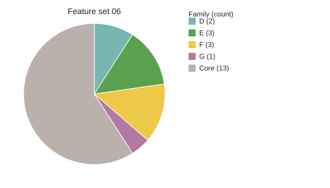

**Family importance (from `Models/Temporal/v2/v2.3/mdr_ts_v2_2_20260107_170214/feature_importance.csv`)**

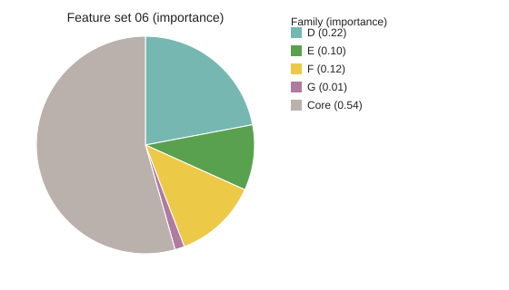

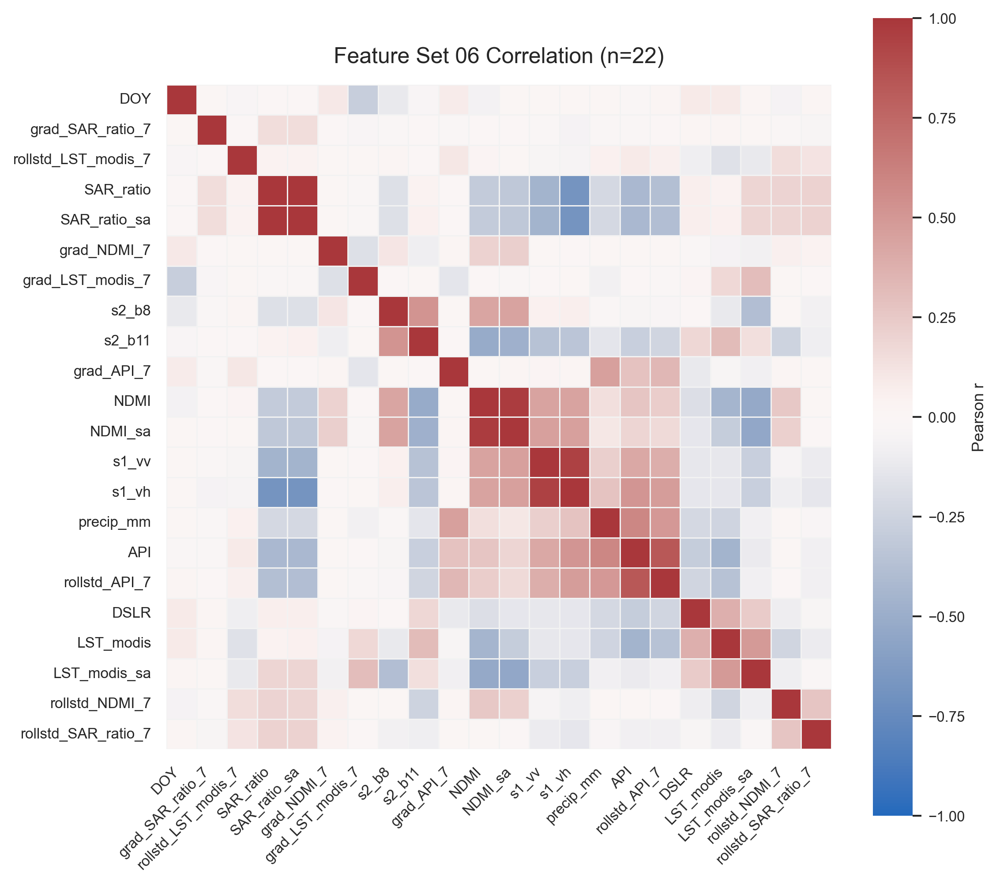

## Feature set 07 (39 features)

Context: Derived temporal features (lags, rolling stats, and seasonal anomalies) built on top of core inputs.

Model runs:
| Version | Run folder | Test $R^2$ | Test RMSE | Test MAE |
| --- | --- | --- | --- | --- |
| v3.3.0 | `Models/Temporal/v3/v3.3/mdr_ts_v3_3_20260109_113817` | 0.714397 | 0.049690 | 0.038198 |
| v6.1.0 | `Models/Temporal/v6/v6.1/mdr_ts_rf_v6_1_20260111_012146` | N/A | N/A | N/A |

Features used:

```yaml
features:
  C_smm_G_API_alpha0.85_n5: 0.2024
  G_API: 0.1519
  DOY: 0.1314
  C_smm_LST_modis_alpha0.85_n5: 0.1164
  G_rain_sum_30d: 0.0569
  aspect: 0.0428
  LST_modis: 0.0415
  s2_b8: 0.0326
  D_z_F_NDMI: 0.0189
  D_sa_F_NDMI: 0.0166
  C_smm_F_NDMI_alpha0.85_n5: 0.0143
  G_rain_sum_7d: 0.0136
  C_smm_E_SAR_ratio_alpha0.85_n5: 0.0128
  D_z_E_SAR_ratio: 0.0105
  F_MSI: 0.0099
  D_sa_E_SAR_ratio: 0.0098
  F_NDMI: 0.0097
  E_SAR_ratio: 0.0094
  V_rollstd_G_API_kobs7: 0.0094
  G_rain_sum_3d: 0.0092
  s1_vh: 0.0089
  E_SAR_diff: 0.0081
  s1_vv: 0.0077
  s2_b11: 0.0069
  F_NDVI: 0.0068
  s2_b12: 0.0068
  s2_b4: 0.0060
  D_sa_LST_modis: 0.0051
  D_z_LST_modis: 0.0050
  precip_mm: 0.0047
  A_d_G_API_kobs1: 0.0035
  V_rollstd_LST_modis_kobs7: 0.0029
  V_rollstd_E_SAR_ratio_kobs7: 0.0022
  V_rollstd_F_NDMI_kobs7: 0.0022
  G_DSLR: 0.0020
  A_d_F_NDMI_kobs1: 0.0005
  A_d_E_SAR_ratio_kobs1: 0.0004
  A_d_LST_modis_kobs1: 0.0002
  G_DSLR_isnan: 0.0000
```

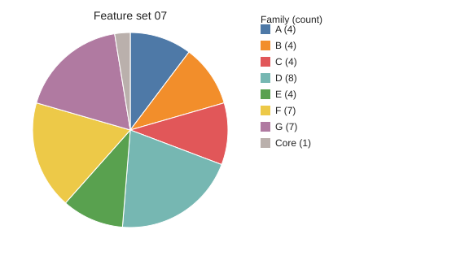

**Family importance (from `Models/Temporal/v6/v6.1/mdr_ts_rf_v6_1_20260111_012146/feature_importance.csv`)**

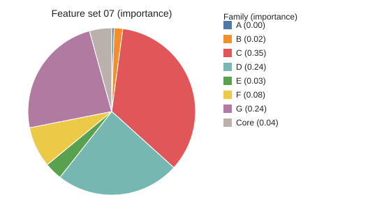

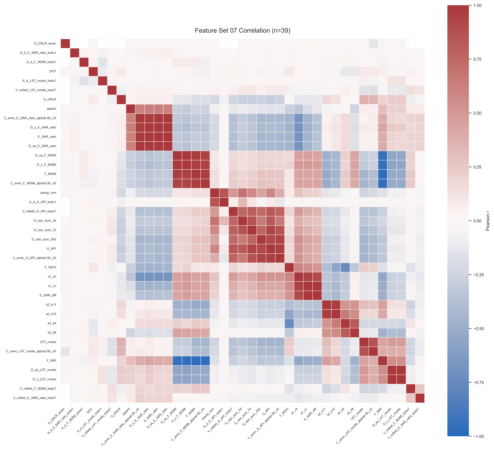

## Feature set 08 (40 features)

Context: Derived temporal features (lags, rolling stats, and seasonal anomalies) built on top of core inputs.

Model runs:
| Version | Run folder | Test $R^2$ | Test RMSE | Test MAE |
| --- | --- | --- | --- | --- |
| v3.1.0 | `Models/Temporal/v3/v3.1/mdr_ts_v3_1_20260108_151234` | 0.632453 | 0.056370 | 0.043802 |
| v3.2.0 | `Models/Temporal/v3/v3.2/mdr_ts_v3_2_20260108_151018` | 0.628125 | 0.056701 | 0.043800 |

Features used:

```yaml
features:
  C_smm_G_API_alpha0.85_n5: 0.2366
  G_API: 0.0942
  aspect: 0.0788
  DOY: 0.0735
  s2_b8: 0.0671
  C_smm_LST_modis_alpha0.85_n5: 0.0642
  F_NDMI: 0.0420
  D_z_F_NDMI: 0.0324
  F_MSI: 0.0269
  C_smm_F_NDMI_alpha0.85_n5: 0.0206
  s1_vv: 0.0205
  s1_vh: 0.0193
  E_SAR_ratio: 0.0177
  G_rain_sum_30d: 0.0170
  G_rain_sum_3d: 0.0164
  E_SAR_diff: 0.0160
  D_sa_E_SAR_ratio: 0.0145
  D_z_E_SAR_ratio: 0.0144
  precip_mm: 0.0139
  D_sa_F_NDMI: 0.0103
  LST_modis: 0.0099
  s2_b11: 0.0091
  F_NDVI: 0.0090
  s2_b12: 0.0085
  G_rain_sum_7d: 0.0085
  s2_b4: 0.0084
  I_ts_spike_s1_vv: 0.0076
  C_smm_E_SAR_ratio_alpha0.85_n5: 0.0070
  G_DSLR: 0.0068
  V_rollstd_F_NDMI_kobs7: 0.0055
  D_z_LST_modis: 0.0039
  D_sa_LST_modis: 0.0039
  V_rollstd_E_SAR_ratio_kobs7: 0.0036
  V_rollstd_G_API_kobs7: 0.0031
  V_rollstd_LST_modis_kobs7: 0.0030
  A_d_G_API_kobs1: 0.0023
  A_d_LST_modis_kobs1: 0.0012
  A_d_F_NDMI_kobs1: 0.0012
  A_d_E_SAR_ratio_kobs1: 0.0010
  G_DSLR_isnan: 0.0000
```

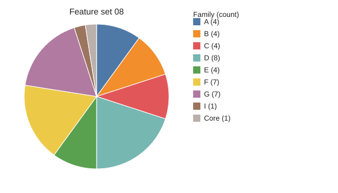

**Family importance (from `Models/Temporal/v3/v3.1/mdr_ts_v3_1_20260108_151234/feature_importance.csv`)**

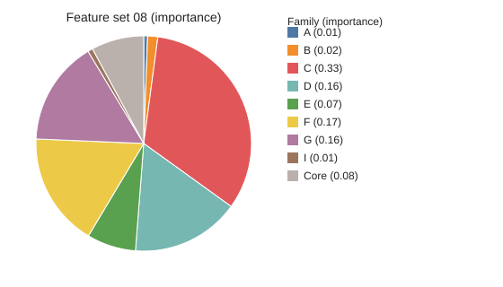

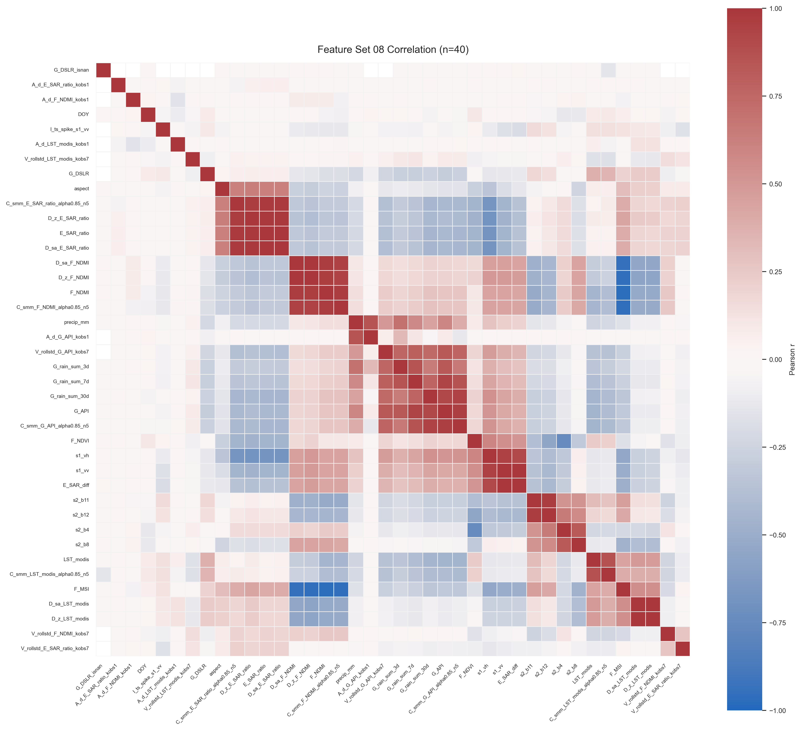

## Feature set 09 (41 features)

Context: Adds explicit rain-impulse signals on top of the core temporal features.

Model runs:
| Version | Run folder | Test $R^2$ | Test RMSE | Test MAE |
| --- | --- | --- | --- | --- |
| v8.1.0 | `Models/Temporal/v8/v8.1/mdr_ts_v8_1_20260121_105425` | 0.674228 | 0.053383 | 0.041720 |

Features used:

```yaml
features:
  V_ema_LST_modis_kobs30: 0.2119
  G_rain_sum_30d: 0.0607
  V_rollmin_F_NDMI_kobs30: 0.0593
  s2_b8: 0.0591
  days_since_rain_event: 0.0551
  C_lag_LST_modis_kobs30: 0.0442
  V_rollmin_E_SAR_diff_kobs30: 0.0399
  C_lag_LST_modis_kobs12: 0.0362
  D_z_F_NDMI: 0.0339
  DOY: 0.0322
  V_rollmax_E_SAR_diff_kobs14: 0.0236
  E_SAR_ratio: 0.0207
  V_rollmax_F_NDVI_kobs30: 0.0198
  V_rollmin_E_SAR_ratio_kobs30: 0.0197
  D_sa_F_NDMI: 0.0197
  rain_mm_impulse_0_7: 0.0186
  D_sa_E_SAR_ratio: 0.0164
  s1_vh: 0.0164
  V_rollmin_s2_b12_kobs30: 0.0162
  D_z_E_SAR_ratio: 0.0153
  V_rollmin_s2_b11_kobs30: 0.0148
  V_rollmax_s2_b11_kobs30: 0.0144
  rain_event_impulse_0_7: 0.0144
  F_MSI: 0.0139
  V_rollmax_E_SAR_diff_kobs30: 0.0134
  E_SAR_diff: 0.0116
  V_rollmax_E_SAR_ratio_kobs14: 0.0110
  F_NDMI: 0.0110
  V_rollmax_E_SAR_diff_kobs7: 0.0106
  C_lag_E_SAR_diff_kobs6: 0.0095
  V_rollmax_LST_modis_kobs7: 0.0088
  s2_b12: 0.0066
  V_rollmax_F_NDVI_kobs14: 0.0061
  C_lag_E_SAR_diff_kobs30: 0.0061
  C_lag_E_SAR_ratio_kobs30: 0.0058
  C_lag_F_NDVI_kobs30: 0.0054
  A_grad_LST_modis_kobs14: 0.0044
  D_sa_LST_modis: 0.0040
  A_d_LST_modis_kobs7: 0.0034
  C_lag_E_SAR_diff_kobs12: 0.0031
  precip_mm: 0.0028
```

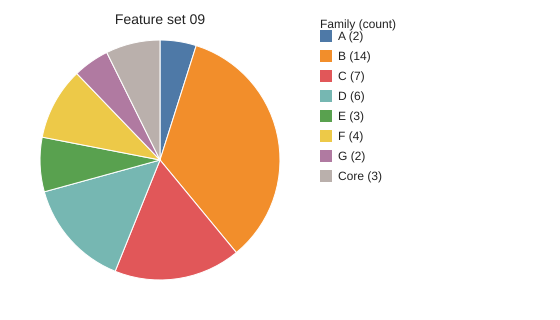

**Family importance (from `Models/Temporal/v8/v8.1/mdr_ts_v8_1_20260121_105425/feature_importance.csv`)**

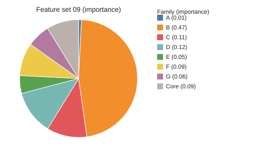

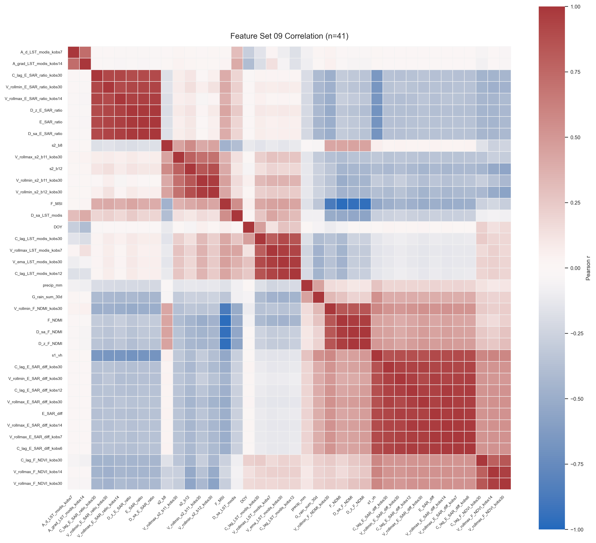

## Feature set 10 (46 features)

Context: Derived temporal features (lags, rolling stats, and seasonal anomalies) built on top of core inputs.

Model runs:
| Version | Run folder | Test $R^2$ | Test RMSE | Test MAE |
| --- | --- | --- | --- | --- |
| v7.1.0 | `Models/Temporal/v7/v7.1/mdr_ts_v7_1_20260117_161048` | 0.757695 | 0.046039 | 0.036493 |
| v7.3.0 | `Models/Temporal/v7/v7.3/mdr_ts_v7_3_20260117_165132` | 0.757695 | 0.046039 | 0.036493 |
| v7.5.0 | `Models/Temporal/v7/v7.5/mdr_ts_v7_5_20260118_135014` | 0.709898 | 0.050376 | 0.039043 |
| v7.6.0 | `Models/Temporal/v7/v7.6/mdr_ts_v7_6_20260118_141451` | N/A | N/A | N/A |

Features used:

```yaml
features:
  V_ema_LST_modis_kobs30: 0.1914
  V_rollmin_G_API_kobs7: 0.1498
  G_rain_sum_30d: 0.0686
  V_rollmean_G_API_kobs30: 0.0402
  V_rollmax_G_API_kobs7: 0.0346
  V_rollmax_LST_modis_kobs7: 0.0318
  D_z_F_NDMI: 0.0314
  G_API: 0.0310
  C_lag_LST_modis_kobs30: 0.0287
  V_rollmax_E_SAR_diff_kobs14: 0.0284
  s2_b8: 0.0274
  E_SAR_ratio: 0.0239
  DOY: 0.0208
  D_sa_F_NDMI: 0.0203
  C_lag_E_SAR_diff_kobs6: 0.0192
  G_rain_sum_7d: 0.0169
  V_rollmin_F_NDMI_kobs30: 0.0141
  V_rollmin_E_SAR_diff_kobs30: 0.0140
  G_DSLR: 0.0121
  C_lag_LST_modis_kobs12: 0.0116
  V_rollmin_s2_b11_kobs30: 0.0113
  V_rollmax_G_API_kobs30: 0.0103
  G_rain_sum_3d: 0.0103
  C_lag_E_SAR_diff_kobs12: 0.0102
  V_rollmin_E_SAR_ratio_kobs30: 0.0102
  s1_vh: 0.0101
  V_rollmax_E_SAR_diff_kobs30: 0.0099
  C_lag_F_NDVI_kobs30: 0.0097
  V_rollmax_s2_b11_kobs30: 0.0094
  C_lag_E_SAR_diff_kobs30: 0.0091
  V_rollmin_s2_b12_kobs30: 0.0089
  V_rollmax_E_SAR_diff_kobs7: 0.0089
  V_rollmax_F_NDVI_kobs30: 0.0088
  D_sa_E_SAR_ratio: 0.0087
  C_lag_E_SAR_ratio_kobs30: 0.0086
  D_z_E_SAR_ratio: 0.0085
  F_MSI: 0.0083
  E_SAR_diff: 0.0077
  V_rollmax_E_SAR_ratio_kobs14: 0.0077
  precip_mm: 0.0072
  F_NDMI: 0.0000
  A_d_LST_modis_kobs7: 0.0000
  A_grad_LST_modis_kobs14: 0.0000
  V_rollmax_F_NDVI_kobs14: 0.0000
  s2_b12: 0.0000
  D_sa_LST_modis: 0.0000
```

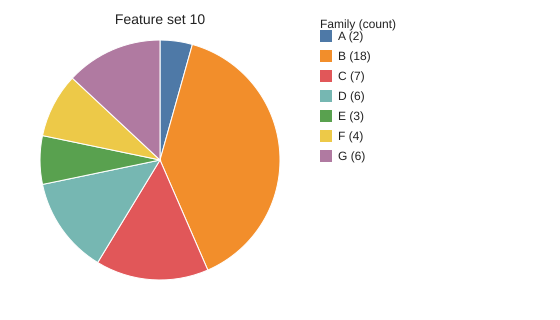

**Family importance (from `Models/Temporal/v7/v7.1/mdr_ts_v7_1_20260117_161048/feature_importance.csv`)**

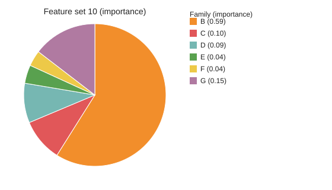

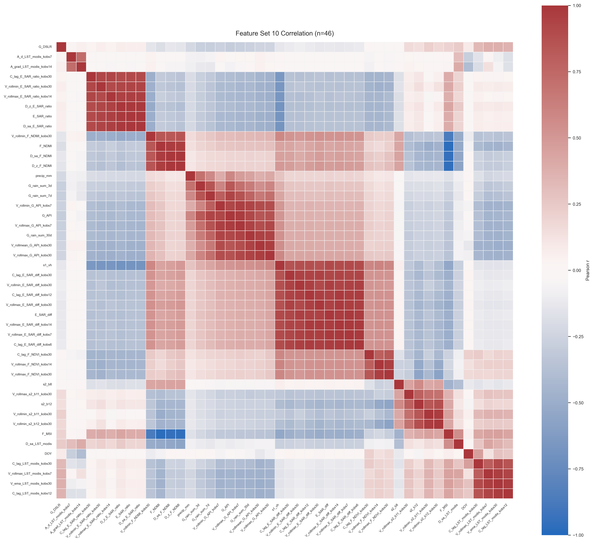

## Feature set 11 (89 features)

Context: Derived temporal features (lags, rolling stats, and seasonal anomalies) built on top of core inputs.

Model runs:
| Version | Run folder | Test $R^2$ | Test RMSE | Test MAE |
| --- | --- | --- | --- | --- |
| v3.1.0 | `Models/Temporal/v3/v3.1/mdr_ts_v3_1_20260108_144926` | 0.632453 | 0.056370 | 0.043802 |
| v3.2.0 | `Models/Temporal/v3/v3.2/mdr_ts_v3_2_20260108_151136` | 0.628125 | 0.056701 | 0.043800 |

Features used:

```yaml
features:
  V_ema_G_API_kobs7: 0.2992
  V_rollmin_G_API_kobs7: 0.0988
  V_rollmean_G_API_kobs7: 0.0685
  C_lag_G_API_kobs1: 0.0391
  C_lag_LST_modis_kobs5: 0.0386
  DOY: 0.0354
  aspect: 0.0306
  s2_b8: 0.0298
  V_ema_F_NDMI_kobs7: 0.0282
  V_ema_LST_modis_kobs7: 0.0198
  V_rollmin_F_NDMI_kobs7: 0.0172
  V_rollmin_LST_modis_kobs7: 0.0164
  D_z_F_NDMI: 0.0149
  G_API: 0.0126
  G_rain_sum_3d: 0.0112
  E_SAR_diff: 0.0110
  C_lag_LST_modis_kobs1: 0.0107
  V_rollmax_E_SAR_ratio_kobs7: 0.0097
  s1_vh: 0.0091
  V_rollmax_F_NDMI_kobs7: 0.0077
  G_rain_sum_30d: 0.0075
  D_sa_E_SAR_ratio: 0.0073
  D_z_E_SAR_ratio: 0.0072
  F_MSI: 0.0067
  V_rollmax_LST_modis_kobs7: 0.0066
  C_lag_F_NDMI_kobs5: 0.0065
  D_sa_F_NDMI: 0.0064
  G_rain_sum_7d: 0.0063
  s1_vv: 0.0061
  C_lag_E_SAR_ratio_kobs1: 0.0058
  C_lag_E_SAR_ratio_kobs5: 0.0058
  F_NDVI: 0.0048
  V_rollmax_G_API_kobs7: 0.0047
  s2_b11: 0.0047
  V_ema_E_SAR_ratio_kobs7: 0.0046
  E_SAR_ratio: 0.0043
  s2_b12: 0.0040
  V_rollmin_E_SAR_ratio_kobs7: 0.0039
  s2_b4: 0.0039
  F_NDMI: 0.0038
  C_lag_F_NDMI_kobs1: 0.0038
  C_lag_F_NDMI_kobs2: 0.0036
  C_lag_LST_modis_kobs2: 0.0034
  precip_mm: 0.0033
  I_ts_spike_s1_vv: 0.0032
  V_rollrng_E_SAR_ratio_kobs7: 0.0032
  G_DSLR: 0.0031
  C_lag_E_SAR_ratio_kobs2: 0.0031
  V_rollmean_LST_modis_kobs7: 0.0027
  LST_modis: 0.0026
  V_rollmean_E_SAR_ratio_kobs7: 0.0025
  V_rollmean_F_NDMI_kobs7: 0.0024
  A_grad_LST_modis_kobs7: 0.0023
  A_d_G_API_kobs2: 0.0023
  C_smm_G_API_alpha0.85_n5: 0.0021
  A_grad_F_NDMI_kobs7: 0.0020
  D_z_LST_modis: 0.0019
  D_sa_LST_modis: 0.0019
  A_pct_F_NDMI: 0.0018
  V_rollcv_F_NDMI_kobs7: 0.0017
  C_lag_G_API_kobs2: 0.0016
  C_smm_E_SAR_ratio_alpha0.85_n5: 0.0016
  C_smm_LST_modis_alpha0.85_n5: 0.0015
  A_grad_E_SAR_ratio_kobs7: 0.0014
  V_rollcv_G_API_kobs7: 0.0014
  A_pct_G_API: 0.0013
  A_grad_G_API_kobs7: 0.0013
  V_rollrng_F_NDMI_kobs7: 0.0013
  V_rollrng_LST_modis_kobs7: 0.0013
  V_rollstd_F_NDMI_kobs7: 0.0012
  V_rollcv_E_SAR_ratio_kobs7: 0.0011
  A_d_G_API_kobs1: 0.0011
  A_pct_E_SAR_ratio: 0.0010
  A_d_E_SAR_ratio_kobs1: 0.0010
  V_rollrng_G_API_kobs7: 0.0010
  C_smm_F_NDMI_alpha0.85_n5: 0.0010
  V_rollstd_G_API_kobs7: 0.0009
  V_rollstd_E_SAR_ratio_kobs7: 0.0009
  C_lag_G_API_kobs5: 0.0008
  V_rollcv_LST_modis_kobs7: 0.0008
  E_dVV_1: 0.0008
  A_d_LST_modis_kobs2: 0.0006
  A_d_F_NDMI_kobs1: 0.0005
  V_rollstd_LST_modis_kobs7: 0.0005
  A_d_E_SAR_ratio_kobs2: 0.0005
  A_d_F_NDMI_kobs2: 0.0005
  A_pct_LST_modis: 0.0004
  A_d_LST_modis_kobs1: 0.0004
  G_DSLR_isnan: 0.0000
```

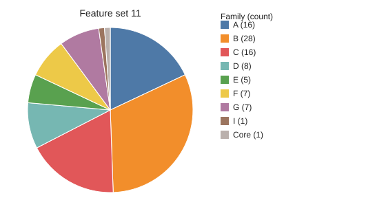

**Family importance (from `Models/Temporal/v3/v3.1/mdr_ts_v3_1_20260108_144926/feature_importance.csv`)**

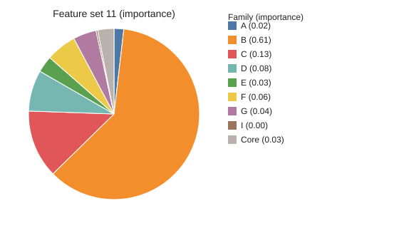

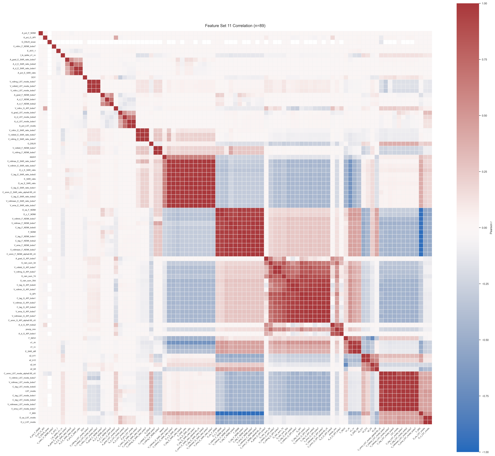

## Appendix: Rain Model | Winter Model

This appendix summarizes the **v9 (v9.\*) mixture-of-experts experiments** (v9.1–v9.4).
All gates are calibrated using **train-only statistics** and then applied unchanged to validation and test splits.

---

## Rain-Gated Model (v9.1–v9.2)

### Gate Definition (Wet vs Dry)

- **Gate column**:
  `GATE_COL = G_rain_sum_7d`

- **Gate mode**:
  Quantile-based thresholding using train-only data

- **Threshold**:

  $$
  \text{thr} = Q\_{\text{train}}(\text{WET\_Q})
  $$

- **Quantile settings**:
  - **v9.1**: $\text{WET\_Q} = 0.75$
  - **v9.2**: $\text{WET\_Q} = 0.55$

- **Binary gate**:
  $$
  \text{is\_wet} = \mathbb{1}(\text{G\_rain\_sum\_7d} \ge \text{thr})
  $$

---

### Expert A (Dry Regime)

- **Training data**:
  Train split rows where `is_wet == 0`

- **Model**:
  Stacked ensemble with:
  - Base learners: `XGBoost` + `Random Forest (RF)`
  - Meta-learner: `Ridge` regression

- **Features**:
  `FEATURE_COLS_A` (baseline temporal feature set)

---

### Expert B (Wet Regime)

- **Training data**:
  Train split rows where `is_wet == 1`

- **Model**:
  Same stacked architecture as Expert A (`XGB` + `RF` into `Ridge`)

---

### Feature Variants

- **v9.1**:
  Uses `FEATURE_COLS_A`

- **v9.2**:
  $$\text{FEATURE\_COLS\_B} = \text{FEATURE\_COLS\_A} \cup \{\text{rain impulse features}\}$$

---

### Rain Impulse Features (v9.2)

All impulse features are computed **before data splitting** to avoid edge effects.

- **Event impulse mask**:
  - `rain_event_impulse_0_7`: weighted binary mask where `precip_mm ≥ 4.0`

- **Rain amount impulse**:
  - `rain_mm_impulse_0_7`: weighted rain amount over lags 0–7

- **Dryness memory**:
  - `days_since_rain_event`: per-station days since last event, clipped to 30

- **Lag weights**:
  \[
  [1.0,\ 0.6,\ 0.2,\ 0.1,\ 0.05,\ 0.02,\ 0.01,\ 0.0]
  \]

- **Per-station logic**:
  Data are sorted by `station_id` and `date`, with lag features computed independently per station.

---

### Combination with Base Model

- **Hard gate**:

  $$\hat{y} = \text{is\_wet} \cdot \hat{y}\_B + (1 - \text{is\_wet}) \cdot \hat{y}\_A$$

- **Soft gate**:
  $$w\_B = \sigma\bigl(K (\text{G\_rain\_sum\_7d} - \text{thr})\bigr), \quad K = 1.0$$
  $$\hat{y} = w_B \cdot \hat{y}\_B + (1 - w_B) \cdot \hat{y}\_A$$

---

## Winter-Gated Model (v9.3–v9.4)

### Season Binning

- **Day-of-year**:

  $$\text{DOY} = \text{day-of-year}(\text{date})$$

- **Season definitions**:
  - Winter: \( \text{DOY} \le 90 \) or \( \text{DOY} \ge 335 \)
  - Shoulder: \( 90 < \text{DOY} \le 150 \) or \( 275 \le \text{DOY} < 335 \)
  - Summer: otherwise

- **Season codes**:
  - winter = 0
  - shoulder = 1
  - summer = 2

---

### Expert A (Non-Winter)

- **Training data**:
  Train split rows where `season_bin != 0`

- **Model**:
  Stacked `XGB` + `RF` with `Ridge` meta-learner

- **Features**:
  `FEATURE_COLS_A` (baseline temporal features)

---

### Expert B (Winter-Focused)

- **v9.3**:
  - Training data: `season_bin == 0`
  - Model: stacked XGB + RF + Ridge

- **v9.4**:
  - Training data: `season_bin ∈ {0, 1}` (winter + shoulder)
  - Model: XGB only
  - Features:

    $$\text{FEATURE\_COLS\_B} = \text{FEATURE\_COLS\_A} \cup \{\text{rain impulse features}\}$$

---

### Combination with Base Model

- **Hard season gate**:

  $$\text{gate} = \mathbb{1}(\text{season\_bin} = 0)$$
  $$\hat{y} = \text{gate} \cdot \hat{y}\_B + (1 - \text{gate}) \cdot \hat{y}\_A$$

- **Soft season gate (v9.3)**:

  $$\theta = \frac{2\pi \cdot \text{DOY}}{365.25}, \quad s = \cos(\theta)$$
  $$\text{thr} = Q*{\text{train}}(1 - r*{\text{winter}})$$
  $$w\_B = \sigma\bigl(K (s - \text{thr})\bigr), \quad K = 3.5$$

- **Soft season gate (v9.4)**:

  $$\theta = \frac{2\pi (\text{DOY} - 355)}{365.25}$$

  $$s = \cos(\theta)\,(1 - |\sin(\theta)|)$$

  $$w\_B = \text{CAP} \cdot \sigma\bigl(K (s - \text{thr})\bigr)$$

  with:
  - $K = 3.8$
  - $\text{CAP} = 0.35$
  - $w\_B \le 0.30$

---

### Winter Residual Add-On (v9.2 / v9.4)

- **Baseline winter model** (winter slices only):
  - Ridge regression
  - Features:

    $$\text{BASE\_FEATURES} = [\text{DOY},\ \text{G\_API},\ \text{G\_rain\_sum\_30d},\ \text{C\_lag\_LST\_modis\_kobs30}]$$

- **Residual model**:
  - XGBoost
  - Features:
    $$
    \begin{aligned}
    \text{RESIDUAL\_FEATURES} = [&\text{rain\_event\_impulse\_0\_7},\ \text{rain\_mm\_impulse\_0\_7},\ \text{days\_since\_rain\_event}, \\
                                &\text{E\_SAR\_diff},\ \text{C\_lag\_E\_SAR\_diff\_kobs6},\ \text{A\_d\_LST\_modis\_kobs7}]
    \end{aligned}
    $$

- **Residual handling**:
  - Mean-centered
  - Clipped at $$\pm 0.12$$

- **Final winter prediction**:

  $$\hat{y}_B = \hat{y}_{\text{base}} + \hat{r}$$

- Combined with Expert A using the same hard or soft winter gate.

---

_Jakob Balkovec_, _Kerry Cheon_
