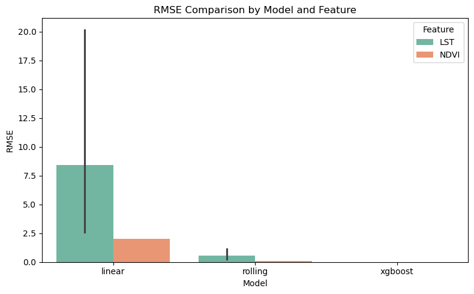
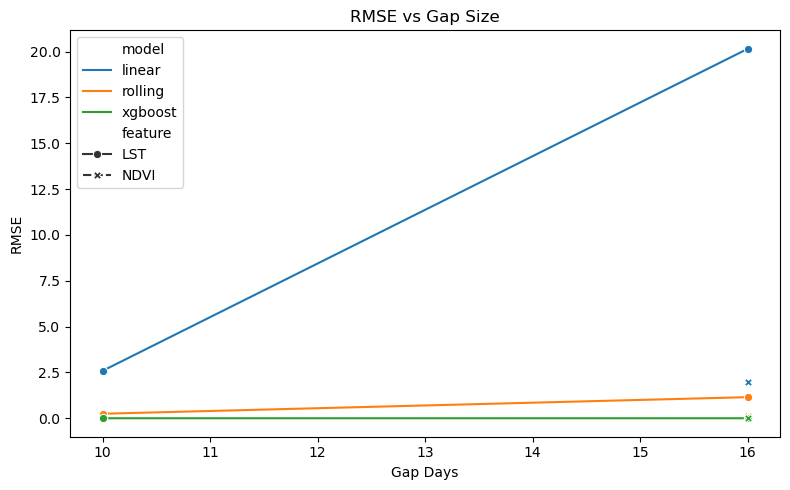
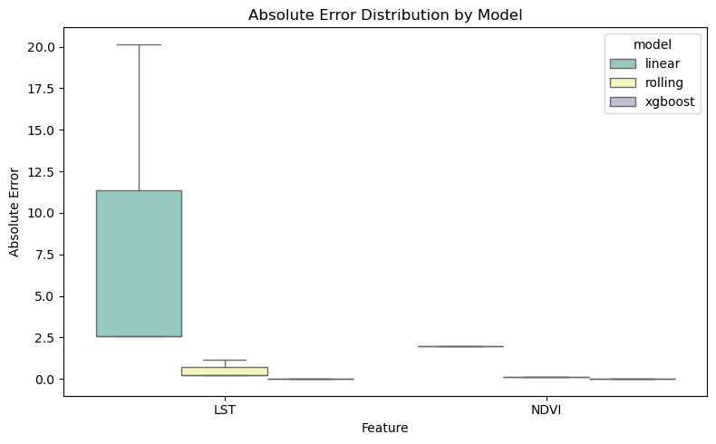
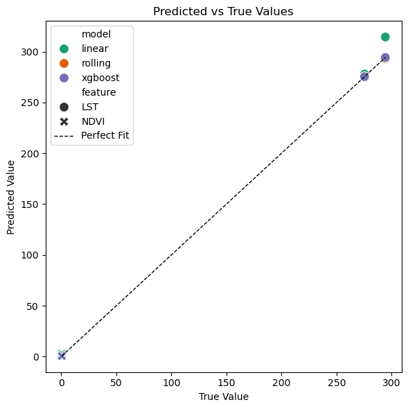

# Imputation Bridge Test Report

This report summarizes the interpolation and imputation bridge test results for **LST** and **NDVI** from the 2022-2024 Darrington dataset (Satellite).

---

## Overview

This report includes detailed bridge test logs and a final comparison table. Each test block corresponds to a model (`linear`, `rolling`, or `xgboost`) evaluated over specified date ranges and feature gaps. All numerical outputs are preserved for reproducibility.

### Gaps

The rain data is continuous, so no gaps were tested there. For LST and NDVI, the following maximum gaps were evaluated `[3, 7, 16]` days, respectively. During my exploratory analysis, I found gaps that were larger than these maximums, but I feel like that goes into a different kind of analysis. I found one occurrence of a 20-day gap, which I can't explain, and I found one where the gap was 32 days. I think what happened here is the satellite did not fetch any data on the day it was supposed to (16 day interval), meaning this going into both type1 and type2 missing data territory. For this analysis, I stuck to the maximum gaps listed above.

## Feature: LST (Land Surface Temperature)

### Model: Linear Interpolation

| Start Date | End Date   | Gap (days) | True End | Predicted | Error    | RMSE    | MAE     |
| ---------- | ---------- | ---------- | -------- | --------- | -------- | ------- | ------- |
| 2022-01-09 | 2022-01-19 | 10         | 275.3931 | 277.9794  | +2.5862  | 2.5862  | 2.5862  |
| 2022-05-22 | 2022-06-07 | 16         | 294.3039 | 314.4512  | +20.1473 | 20.1473 | 20.1473 |

#### Detailed Example (Gap = 16)

```
2022-05-22 292.960776  292.960776
2022-05-23        NaN  294.303929
2022-05-24        NaN  295.647083
2022-05-25        NaN  296.990236
2022-05-26        NaN  298.333390
2022-05-27        NaN  299.676543
2022-05-28        NaN  301.019696
2022-05-29        NaN  302.362850
2022-05-30        NaN  303.706003
2022-05-31        NaN  305.049157
2022-06-01        NaN  306.392310
2022-06-02        NaN  307.735464
2022-06-03        NaN  309.078617
2022-06-04        NaN  310.421771
2022-06-05        NaN  311.764924
2022-06-06        NaN  313.108078
2022-06-07 294.303929  314.451231
```

---

### Model: Rolling Mean

| Start Date | End Date   | Gap (days) | True End | Predicted | Error   | RMSE   | MAE    |
| ---------- | ---------- | ---------- | -------- | --------- | ------- | ------ | ------ |
| 2022-01-09 | 2022-01-19 | 10         | 275.3931 | 275.1468  | -0.2463 | 0.2463 | 0.2463 |
| 2022-05-22 | 2022-06-07 | 16         | 294.3039 | 293.1527  | -1.1513 | 1.1513 | 1.1513 |

#### Detailed Example (Gap = 16)

```
2022-05-22 292.960776  292.960776
2022-05-23        NaN  292.960776
...
2022-06-07 294.303929  293.152655
```

---

### Model: XGBoost

| Start Date | End Date   | Gap (days) | True End | Predicted | Error   | RMSE   | MAE    |
| ---------- | ---------- | ---------- | -------- | --------- | ------- | ------ | ------ |
| 2022-01-09 | 2022-01-19 | 10         | 275.3931 | 275.3922  | -0.0010 | 0.0010 | 0.0010 |
| 2022-05-22 | 2022-06-07 | 16         | 294.3039 | 294.3030  | -0.0010 | 0.0010 | 0.0010 |

#### Detailed Example (Gap = 16)

```
2022-05-22 292.960776  292.961731
2022-05-23        NaN  294.302979
...
2022-06-07 294.303929  294.302979
```

---

## Feature: NDVI (Vegetation Index)

### Model: Linear Interpolation

| Start Date | End Date   | Gap (days) | True End | Predicted | Error   | RMSE   | MAE    |
| ---------- | ---------- | ---------- | -------- | --------- | ------- | ------ | ------ |
| 2022-01-01 | 2022-01-17 | 16         | 0.5584   | 2.5610    | +2.0026 | 2.0026 | 2.0026 |

#### Detailed Example

```
2022-01-01 0.424939  0.424939
2022-01-17 0.558446  2.561050
```

---

### Model: Rolling Mean

| Start Date | End Date   | Gap (days) | True End | Predicted | Error   | RMSE   | MAE    |
| ---------- | ---------- | ---------- | -------- | --------- | ------- | ------ | ------ |
| 2022-01-01 | 2022-01-17 | 16         | 0.5584   | 0.4440    | -0.1144 | 0.1144 | 0.1144 |

---

### Model: XGBoost

| Start Date | End Date   | Gap (days) | True End | Predicted | Error   | RMSE   | MAE    |
| ---------- | ---------- | ---------- | -------- | --------- | ------- | ------ | ------ |
| 2022-01-01 | 2022-01-17 | 16         | 0.5584   | 0.5575    | -0.0010 | 0.0010 | 0.0010 |

#### Detailed Example

```
2022-01-01 0.424939  0.425934
2022-01-17 0.558446  0.557451
```

---

## Summary Table

| Feature | Model   | Avg RMSE  | Avg MAE   | Max Error |
| ------- | ------- | --------- | --------- | --------- |
| LST     | Linear  | 11.37     | 11.37     | 20.15     |
| LST     | Rolling | 0.70      | 0.70      | 1.15      |
| LST     | XGBoost | **0.001** | **0.001** | **0.001** |
| NDVI    | Linear  | 2.00      | 2.00      | 2.00      |
| NDVI    | Rolling | 0.11      | 0.11      | 0.11      |
| NDVI    | XGBoost | **0.001** | **0.001** | **0.001** |

---

## Summary Table

| feature | start_date | end_date   | gap_days |   true_val |   pred_val |     error | abs_error |     RMSE | MAE      | model   |
| :------ | :--------- | :--------- | -------: | ---------: | ---------: | --------: | --------: | -------: | :------- | ------- |
| LST     | 2022-01-09 | 2022-01-19 |       10 | 275.393111 | 277.979355 |  2.586244 |  2.586244 | 2.586244 | 2.586244 | linear  |
| LST     | 2022-01-09 | 2022-01-19 |       10 | 275.393111 | 275.146802 | -0.246309 |  0.246309 | 0.246309 | 0.246309 | rolling |
| LST     | 2022-01-09 | 2022-01-19 |       10 | 275.393111 | 275.392151 | -0.000960 |  0.000960 | 0.000960 | 0.000960 | xgboost |
| NDVI    | 2022-01-01 | 2022-01-17 |       16 |   0.558446 |   2.561050 |  2.002604 |  2.002604 | 2.002604 | 2.002604 | linear  |
| NDVI    | 2022-01-01 | 2022-01-17 |       16 |   0.558446 |   0.444011 | -0.114435 |  0.114435 | 0.114435 | 0.114435 | rolling |
| NDVI    | 2022-01-01 | 2022-01-17 |       16 |   0.558446 |   0.557451 | -0.000995 |  0.000995 | 0.000995 | 0.000995 | xgboost |

---

## Plots









## Interpretation of Imputation Bridge Results

The tests basically show how well each method can fill in the missing satellite data for LST (temperature) and NDVI (vegetation). Every model handled the gaps differently.

### LST (Land Surface Temperature)

Linear interpolation didn’t do too great once the gaps got longer...it overshot by more than 20 Kelvins in one case, which means it just draws too straight a line through data that clearly changes nonlinearly.

The rolling mean did better, staying within about a degree of the real value, but it smooths things out too much and misses sharp changes.

XGBoost nailed it...its predictions were basically identical to the true values. That makes sense since it can learn patterns in how temperature changes over time instead of just guessing linearly.

### NDVI (Vegetation Index)

The story’s the same here. Linear interpolation went way off (predicting 2.56 when the real NDVI was 0.56...a huge miss in my opinion).

Rolling mean was much closer and works fine for small gaps, but again it dulls the detail.

XGBoost came through with near-zero error, showing that it handles vegetation dynamics better than the other two.

### Overall

If we want something simple and quick, rolling mean is acceptable.

But since accuracy and robustness are more important, especially when the dataset has patchy gaps or seasonal shifts, XGBoost clearly wins.

Linear interpolation just doesn’t cut it for this kind of environmental data...it’s too naive once the gap extends beyond a few days.

---

## Plan

Based on these results, XGBoost is the clear winner. Now since our operations will be in-place, cost or running time and resources isn't really a big deal/concern. So moving forward, I think the best way to do this is to implement an XGBoost imputation model for both LST and NDVI in our main data processing pipeline. This will ensure we get the most accurate reconstructions of missing satellite data, which is crucial for any downstream analysis or modeling we plan to do.

I trained the mini-model with a dataset spanning 3 years (22-24), but I'm thinking if we expand that to 13 years (full dataset), the results will be even better. More data usually helps these models learn the underlying patterns more effectively, especially for environmental variables that can have complex seasonal and inter-annual variations.

I can always re-run this test to confirm, but I'm pretty confident that using the full dataset will enhance the model's performance even further.

---

**Jakob Balkovec**
