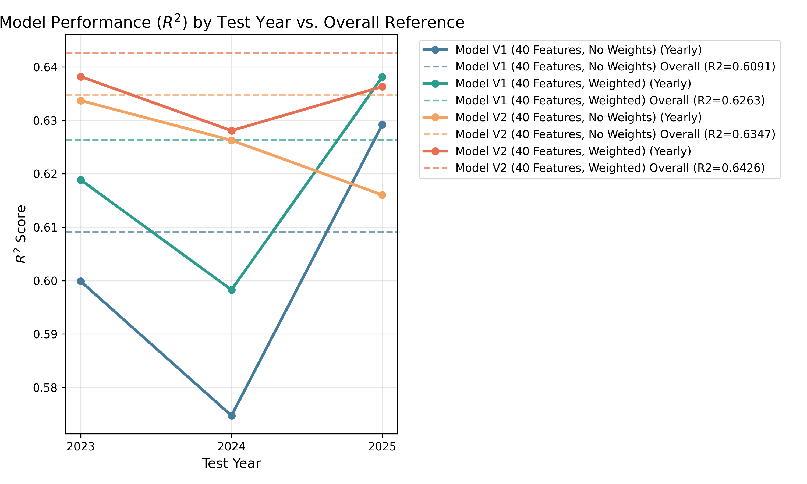

# July 6, 2026

## Improvements: feature selection
Optimized the pipeline in several ways that now get R^2 of ~0.64 on a single global model.
- Detect correlated features and drop another for address collinearity dilution.
- Use RF to compute non-linear feature importance to more similar to the actual models we use at the end.

Additionally, the newly selected features are also more stable 
