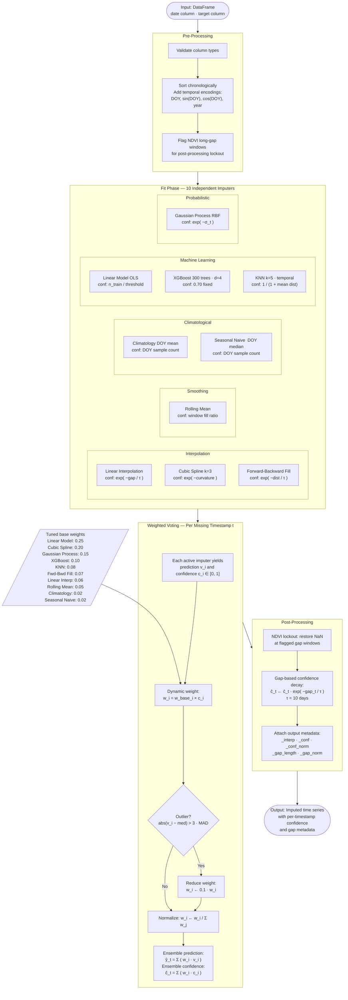
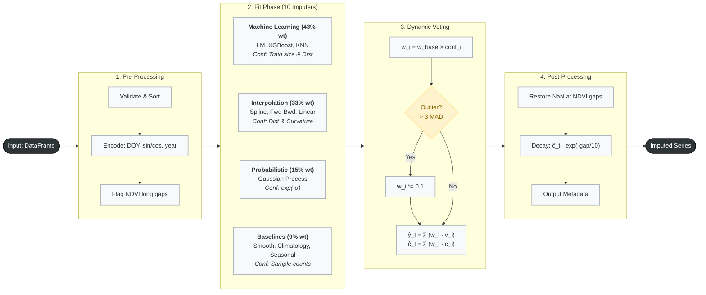

# Imputation Ensamble Diagram

```mermaid
flowchart TD
    IN(["Input: DataFrame\ndate column · target column"])

    subgraph PRE["Pre-Processing"]
        direction TB
        pr1["Validate column types"]
        pr2["Sort chronologically\nAdd temporal encodings:\nDOY, sin(DOY), cos(DOY), year"]
        pr3["Flag NDVI long-gap windows\nfor post-processing lockout"]
        pr1 --> pr2 --> pr3
    end

    subgraph FIT["Fit Phase — 10 Independent Imputers"]
        direction LR
        subgraph GrpInterp["Interpolation"]
            direction TB
            f1["Linear Interpolation\nconf: exp( −gap / τ )"]
            f2["Cubic Spline  k=3\nconf: exp( −curvature )"]
            f3["Forward-Backward Fill\nconf: exp( −dist / τ )"]
        end
        subgraph GrpSmooth["Smoothing"]
            f4["Rolling Mean\nconf: window fill ratio"]
        end
        subgraph GrpClim["Climatological"]
            direction TB
            f5["Climatology  DOY mean\nconf: DOY sample count"]
            f6["Seasonal Naive  DOY median\nconf: DOY sample count"]
        end
        subgraph GrpML["Machine Learning"]
            direction TB
            f7["Linear Model  OLS\nconf: n_train / threshold"]
            f8["XGBoost  300 trees · d=4\nconf: 0.70  fixed"]
            f9["KNN  k=5 · temporal\nconf: 1 / (1 + mean dist)"]
        end
        subgraph GrpProb["Probabilistic"]
            f10["Gaussian Process  RBF\nconf: exp( −σ_t )"]
        end
    end

    subgraph VOTE["Weighted Voting — Per Missing Timestamp t"]
        direction TB
        v1["Each active imputer yields\nprediction v_i and confidence c_i ∈ [0, 1]"]
        v2["Dynamic weight:\nw_i = w_base_i × c_i"]
        v3{"Outlier?\nabs(v_i − med) > 3 · MAD"}
        v4["Reduce weight:\nw_i ← 0.1 · w_i"]
        v5["Normalize: w_i ← w_i / Σ w_j"]
        v6["Ensemble prediction:\nŷ_t = Σ ( w_i · v_i )\nEnsemble confidence:\nĉ_t = Σ ( w_i · c_i )"]
        v1 --> v2 --> v3
        v3 -- Yes --> v4 --> v5
        v3 -- No  --> v5
        v5 --> v6
    end

    BW[/"Tuned base weights\nLinear Model: 0.25\nCubic Spline: 0.20\nGaussian Process: 0.15\nXGBoost: 0.10\nKNN: 0.08\nFwd-Bwd Fill: 0.07\nLinear Interp: 0.06\nRolling Mean: 0.05\nClimatology: 0.02\nSeasonal Naive: 0.02"/]

    subgraph POST["Post-Processing"]
        direction TB
        p1["NDVI lockout: restore NaN\nat flagged gap windows"]
        p2["Gap-based confidence decay:\nĉ_t ← ĉ_t · exp( −gap_t / τ )\nτ = 10 days"]
        p3["Attach output metadata:\n_interp · _conf · _conf_norm\n_gap_length · _gap_norm"]
        p1 --> p2 --> p3
    end

    OUT(["Output: Imputed time series\nwith per-timestamp confidence\nand gap metadata"])

    IN --> PRE --> FIT --> VOTE --> POST --> OUT
    BW --> v2
```

## Simpler

```mermaid
flowchart LR
    %% Slide-optimized styling
    classDef io fill:#2d3436,color:#fff,stroke:#000,stroke-width:1px
    classDef step fill:#f8f9fa,color:#2d3436,stroke:#adb5bd,stroke-width:2px
    classDef decision fill:#fff3cd,color:#856404,stroke:#ffe8a1,stroke-width:2px

    IN(["Input: DataFrame"]):::io

    subgraph S1["1. Pre-Processing"]
        direction TB
        p1["Validate & Sort"]:::step
        p2["Encode: DOY, sin/cos, year"]:::step
        p3["Flag NDVI long gaps"]:::step
        p1 --> p2 --> p3
    end

    subgraph S2["2. Fit Phase (10 Imputers)"]
        direction TB
        f1["<b>Machine Learning (43% wt)</b><br>LM, XGBoost, KNN<br><i>Conf: Train size & Dist</i>"]:::step
        f2["<b>Interpolation (33% wt)</b><br>Spline, Fwd-Bwd, Linear<br><i>Conf: Dist & Curvature</i>"]:::step
        f3["<b>Probabilistic (15% wt)</b><br>Gaussian Process<br><i>Conf: exp(-σ)</i>"]:::step
        f4["<b>Baselines (9% wt)</b><br>Smooth, Climatology, Seasonal<br><i>Conf: Sample counts</i>"]:::step
        f1 ~~~ f2 ~~~ f3 ~~~ f4
    end

    subgraph S3["3. Dynamic Voting"]
        direction TB
        v1["w_i = w_base × conf_i"]:::step
        v2{"Outlier?<br>> 3 MAD"}:::decision
        v3["w_i *= 0.1"]:::step
        v4["ŷ_t = Σ (w_i · v_i)<br>ĉ_t = Σ (w_i · c_i)"]:::step
        v1 --> v2
        v2 -- Yes --> v3 --> v4
        v2 -- No --> v4
    end

    subgraph S4["4. Post-Processing"]
        direction TB
        po1["Restore NaN at NDVI gaps"]:::step
        po2["Decay: ĉ_t · exp(-gap/10)"]:::step
        po3["Output Metadata"]:::step
        po1 --> po2 --> po3
    end

    OUT(["Imputed Series"]):::io

    IN --> S1 --> S2 --> S3 --> S4 --> OUT
```
