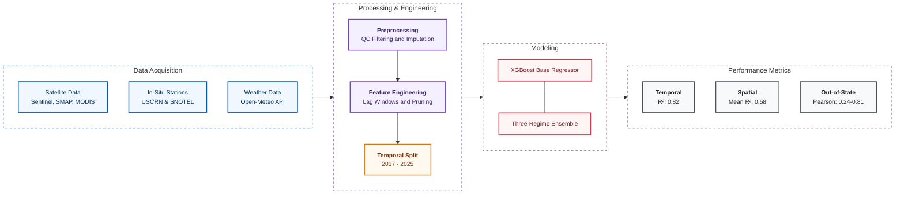

# Pipeline Diagram

```mermaid
flowchart LR
    %% Global Configuration
    classDef default font-family:Arial,font-size:14px;
    classDef header font-weight:bold,font-size:16px;

    %% Node Styles
    classDef blue fill:#f0f7ff,stroke:#0056b3,stroke-width:2px,color:#003366
    classDef purple fill:#f5f0ff,stroke:#6f42c1,stroke-width:2px,color:#3b2266
    classDef orange fill:#fff9f0,stroke:#d97706,stroke-width:2px,color:#78350f
    classDef red fill:#fff5f5,stroke:#dc3545,stroke-width:2px,color:#721c24
    classDef grey fill:#f8f9fa,stroke:#495057,stroke-width:2px,color:#212529

    %% STAGE 1: Horizontal sources
    subgraph SOURCES [Data Acquisition]
        direction TB
        S1[Satellite Data<br/>Sentinel, SMAP, MODIS]:::blue
        S2[In-Situ Stations<br/>USCRN & SNOTEL]:::blue
        S3[Weather Data<br/>Open-Meteo API]:::blue
    end

    %% STAGE 2: Vertical pipeline (takes up the middle height)
    subgraph PIPELINE [Processing & Engineering]
        direction TB
        P1[<b>Preprocessing</b><br/>QC Filtering and Imputation]:::purple
        P2[<b>Feature Engineering</b><br/>Lag Windows and Pruning]:::purple
        P3[<b>Temporal Split</b><br/>2017 - 2025]:::orange

        P1 --> P2 --> P3
    end

    %% STAGE 3: Stacked model
    subgraph MODEL [Modeling]
        direction TB
        M1[XGBoost Base Regressor]:::red
        M2[Three-Regime Ensemble]:::red

        M1 --- M2
    end

    %% STAGE 4: Stacked results
    subgraph EVAL [Performance Metrics]
        direction TB
        E1[<b>Temporal</b><br/>R²: 0.82]:::grey
        E2[<b>Spatial</b><br/>Mean R²: 0.58]:::grey
        E3[<b>Out-of-State</b><br/>Pearson: 0.24-0.81]:::grey
    end

    %% Main Horizontal Flow
    SOURCES --> PIPELINE
    PIPELINE --> MODEL
    MODEL --> EVAL

    %% Subgraph Styling
    style SOURCES fill:none,stroke:#0056b3,stroke-dasharray: 5 5
    style PIPELINE fill:none,stroke:#6f42c1,stroke-dasharray: 5 5
    style MODEL fill:none,stroke:#dc3545,stroke-dasharray: 5 5
    style EVAL fill:none,stroke:#495057,stroke-dasharray: 5 5
```
