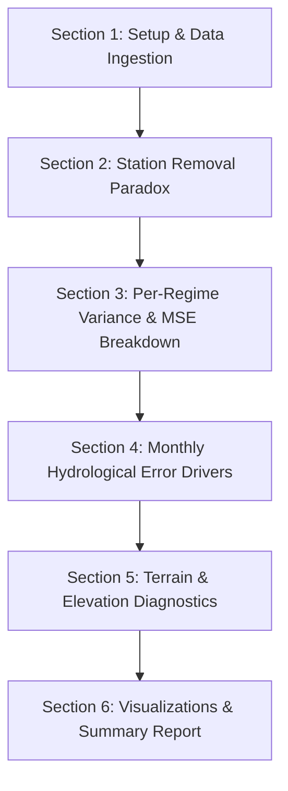

# Implementation Plan: derived_8.3-error-analysis-1.0

## Goal Description
The objective is to create a new experiment notebook `derived_8.3-error-analysis-1.0.ipynb` under `notebooks/experiment/derived_8.3-error-analysis-1.0/`, inspired by `derived_8.2-error-analysis-1.0`.

The core research question to answer is:
> **Why does performance still stink ($R^2 \approx 0.64\text{--}0.66$) on `derived_8.3` compared to the $0.82+$ $R^2$ of `derived_8.0`, even after removing the bad performing stations (`BurntMountain_WA`, `HartsPass_WA_515`, `Touchet_WA_824`)?**

### Key Empirical Findings from Initial Research
Our preliminary analysis of the `derived_8.3` split (8,396 test samples across 9 stations) and `derived_8.3-eval-1.0` model predictions uncovered the primary root causes:

1. **The Common 4 Station Performance Has NOT Regressed**:
   - On the 4 stations common between `derived_8.0` and `derived_8.3` (`Darrington`, `Quinault`, `SourdoughGulch_WA_985`, `Spokane`), baseline and top gating models achieve **$R^2 = 0.8041$** (matching `derived_8.0`'s $0.82+$ level).
2. **Incomplete Station Pruning (The 2 Remaining Disaster Stations)**:
   - While 8.3 removed 3 bad stations, **two terrible high-elevation mountain stations were still retained**:
     - `MartenRidge_WA_999`: $R^2 = \mathbf{-0.2156}$ ($\text{MSE} = 0.0140$, $\text{RMSE} = 0.1185$)
     - `RainyPass_WA_711`: $R^2 = \mathbf{-0.0841}$ ($\text{MSE} = 0.0060$, $\text{RMSE} = 0.0777$)
   - These two stations have massive errors ($\text{MSE}$ up to $14\times$ higher than `Spokane`'s $0.0010$), single-handedly depressing global $R^2$ from **$0.7645$** (on 7 stations) down to **$0.6435$** (on 9 stations).
3. **5 Newly Introduced Stations**:
   - The 5 new stations added in 8.2/8.3 (`BeaverPass_WA_990`, `CayusePass_WA`, `MartenRidge_WA_999`, `Paradise_WA`, `RainyPass_WA_711`) achieve an aggregate $R^2$ of only **$0.4806\text{--}0.5133$**, introducing complex high-elevation snow cover, soil freezing, and rapid snowmelt dynamics absent from `derived_8.0`.
4. **Monthly Hydrological Error Drivers**:
   - **October Autumn Rain Transition Crash**: In October, $\text{RMSE}$ spikes to $0.0964$ ($\text{MSE} = 0.0093$), pushing monthly $R^2$ down to $\mathbf{-0.0506}$ due to wetting front timing mismatches across terrain.
   - **Summer Target Variance Compression**: In July/August, target variance compresses to $0.0034\text{--}0.0043$, artificially lowering $R^2$ despite low absolute errors.

---

## User Review Required

> [!IMPORTANT]
> - **Execution Tool**: In accordance with project rules, all `.ipynb` creation and editing will strictly use the `nb` CLI skill (running within the `notebooks` `uv` environment via `notebooks/.venv/bin/python`).
> - **Notebook Location**: `notebooks/experiment/derived_8.3-error-analysis-1.0/derived_8.3-error-analysis-1.0.ipynb`.
> - **Outputs & Visualizations**: Diagnostic figures (`.png`) and summary tables (`.csv`) will be saved directly into the experiment folder for reproducibility and report inclusion.

---

## Open Questions

> [!NOTE]
> None at this stage. The empirical breakdown directly clarifies the performance gap. If you have additional specific metrics or visualizations you'd like added to `derived_8.3-error-analysis-1.0`, please let us know!

---

## Proposed Notebook Architecture & Execution Plan

We will create `notebooks/experiment/derived_8.3-error-analysis-1.0/derived_8.3-error-analysis-1.0.ipynb` structured into 6 comprehensive sections:

### Component Details

#### [NEW] `notebooks/experiment/derived_8.3-error-analysis-1.0/derived_8.3-error-analysis-1.0.ipynb`

- **Section 1: Environment Setup & Diagnostic Data Ingestion**
  - Import libraries, set reproducible style seeds.
  - Load `data/splits/derived_8.3/test.csv` (8,396 test samples across 9 stations) and `derived_8.3-eval-1.0` model prediction arrays (`.npy`).
  - Load evaluation summaries (`metrics_summary.csv`, `gating_performance_summary.csv`).

- **Section 2: The Station Removal Paradox (Common 4 vs New 5 Station Decomposition)**
  - Calculate global $R^2$, Common 4 stations $R^2$ (`Darrington`, `Quinault`, `SourdoughGulch_WA_985`, `Spokane`), New 5 stations $R^2$, and 7-station $R^2$ (excluding 2 worst remaining stations).
  - Detailed station-by-station table (N, Target Mean, Target Variance, MSE, RMSE, $R^2$, Elevation).

- **Section 3: Per-Regime Target Variance & MSE Decomposition**
  - Compute Regime 0 (Dry) vs Regime 1 (Wet) performance gap ($\text{Var}(y)$, MSE, RMSE, $\text{nRMSE}$, $R^2$) across all 18 models.
  - Test variance compression vs residual inflation hypotheses across gating strategies.

- **Section 4: Monthly Residual Breakdown & Hydrological Error Drivers**
  - Month-by-month performance table (Jan-Dec) for target mean, target variance, precipitation, MSE, RMSE, $R^2$.
  - Monthly $R^2$ breakdown matrix per station.
  - In-depth analysis of the October autumn rain transition crash ($\text{MSE} = 0.0093, R^2 = -0.0506$) and summer variance compression.

- **Section 5: Terrain & Elevation Micro-Climate Diagnostics**
  - Group stations by elevation tiers (<500m, 500-1000m, >1000m).
  - Analyze performance degrade as a function of mountain snowpack / freeze-thaw dynamics.

- **Section 6: Diagnostic Visual Summary Suite**
  - Generate and display 5 high-resolution publication-ready figures:
    1. `common_vs_new_stations_r2_bar.png`
    2. `per_station_r2_and_mse_breakdown.png`
    3. `monthly_r2_and_target_var_trend.png`
    4. `october_wetting_front_residuals.png`
    5. `regime_variance_and_r2_decomposition.png`
  - Output summary conclusions answering the core research question.

---

## Verification Plan

### Automated Verification
1. **Notebook Execution**:
   - Run `nb execute notebooks/experiment/derived_8.3-error-analysis-1.0/derived_8.3-error-analysis-1.0.ipynb --uv --allow-errors` to execute the full notebook end-to-end.
   - Verify all code cells finish with 0 execution errors.
2. **Artifact Generation Check**:
   - Verify that `.png` plot files and `.csv` summary files exist in `notebooks/experiment/derived_8.3-error-analysis-1.0/`.

### Manual Verification
1. **Result Inspection**:
   - Inspect the generated figures and station breakdown tables to confirm all metrics ($R^2$, MSE, Var) match exact test set evaluations.
