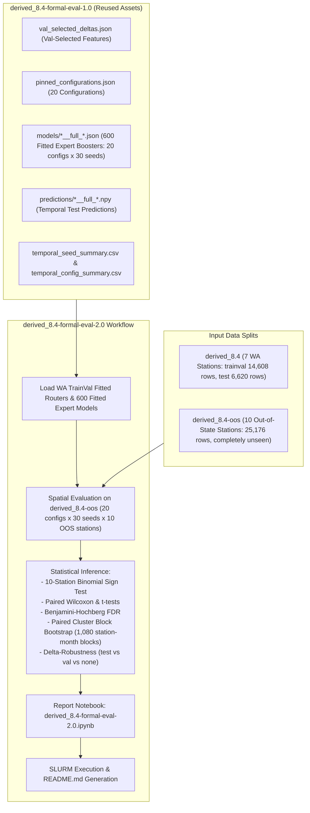

# Implementation Plan: `derived_8.4-formal-eval-2.0` (Out-of-State Formal Statistical Evaluation)

## Goal Description

The objective of `derived_8.4-formal-eval-2.0` is to perform a formal statistical evaluation of the two-regime MoE clustering model (`Clustering_V0_Full_k2` and variants) against the single-regime global baseline (`Global_Single_54`), the V0-50 baseline (`Baseline_V0_50`), and the trained gating baseline (`Trained_Gating_k2`) on **spatial generalization to 10 out-of-state (OOS) stations** (`derived_8.4-oos`, 25,176 rows across 2017–2025 in Oregon, Idaho, California, Colorado, Wyoming, and Montana).

Models and routers are trained **strictly on the 7 Washington state stations** from `derived_8.4` (`trainval`, 2017–2022, 14,608 rows). The out-of-state dataset `derived_8.4-oos` is **completely unseen** during training (no stations from `derived_8.4-oos` appear in training or feature selection).

To eliminate redundant computation, `derived_8.4-formal-eval-2.0` reuses the 20 pinned configurations, selected features (`val_selected_deltas.json`), trained model weights (`models/*__full_*.json`), and temporal test performance from `derived_8.4-formal-eval-1.0`. All **30 random seeds** (seeds 42, 7, 13, ..., 2222) will be evaluated for both temporal and spatial performance.



---

## User Review Required

> [!IMPORTANT]
> **Spatial Evaluation Scope on `derived_8.4-oos`**:
> - Training: Models and routers are fitted strictly on `derived_8.4` (7 Washington stations, 2017–2022 `trainval`, 14,608 rows). `derived_8.4-oos` is 100% unseen during training.
> - Evaluation: All 10 out-of-state stations (25,176 rows across 2017–2025) are evaluated. We compute:
>   1. **Pooled OOS metrics**: overall $R^2$, RMSE, ubRMSE, MAE, bias, Pearson correlation.
>   2. **Per-station metrics**: for each of the 10 stations (John Day, Corvallis, Riley, Murphy, Redding, Boulder, Lander, Wolf Point, Clackamas Lake, Rock Springs).
>   3. **Per-year breakdown**: 2017 through 2025.
>   4. **Per-regime cluster breakdown**: regime 0 vs regime 1 metrics on OOS.
>   5. **Station sign test**: two-sided binomial test with $n = 10$ stations ($10/10 \to p \approx 0.002$, $9/10 \to p \approx 0.021$, $8/10 \to p \approx 0.109$).

> [!TIP]
> **Zero Redundant Computation**:
> - We copy `val_selected_deltas.json`, `pinned_configurations.json`, `pinned_configs.csv`, trained models `models/*__full_*.json`, temporal predictions `predictions/*__full_*.npy`, job meta `artifacts/jobs/*__full/meta.json`, and temporal summary CSVs directly from `derived_8.4-formal-eval-1.0`.
> - `run_temporal.py` verifies the existing 600 jobs and reproduces temporal metrics in seconds without re-training.
> - The GPU run focuses on evaluating the 600 trained models on `derived_8.4-oos`, generating all spatial metrics, running statistical tests, and executing the report notebook.

---

## Proposed Changes

### Experiment Directory: `notebooks/experiment/derived_8.4-formal-eval-2.0/`

```
notebooks/experiment/derived_8.4-formal-eval-2.0/
├── config.yaml
├── val_selected_deltas.json             # Reused from formal-eval-1.0
├── pinned_configurations.json           # Reused from formal-eval-1.0
├── pinned_configs.csv                   # Reused from formal-eval-1.0
├── eval_formal/
│   ├── __init__.py
│   ├── configs.py                       # Config loader and metadata
│   ├── data.py                          # Data loader for derived_8.4 and derived_8.4-oos
│   ├── evaluator.py                     # Evaluates WA temporal and OOS spatial
│   ├── jobs.py                          # Multi-worker parallel executor
│   ├── plots.py                         # OOS pair plots, boxplots, station bars, delta robustness
│   ├── routers.py                       # The 6 routing strategies
│   └── stats.py                         # Multi-seed stats, sign test (n=10), cluster bootstrap, BH-FDR
├── run_temporal.py                      # Verifies and aggregates temporal evaluation
├── run_spatial.py                       # Executes spatial evaluation on derived_8.4-oos (30 seeds)
├── run_worker.py                        # Worker subprocess for individual (config, seed, mode) jobs
├── run_slurm.sh                         # SLURM GPU submission script
├── derived_8.4-formal-eval-2.0.ipynb    # Report notebook
└── README.md                            # Populated strictly from notebook stdout
```

---

### Component Details

#### 1. Configuration: `config.yaml`
- Sets `data.splits` for `derived_8.4` (train/val/test) and `data.spatial_oos` for `derived_8.4-oos` (`data/splits/derived_8.4-oos/{train,val,test}.csv`).
- Sets `seeds.temporal: [42, 7, 13, ..., 2222]` (30 seeds).
- Sets `seeds.spatial: [42, 7, 13, ..., 2222]` (30 seeds).
- Sets `spatial.predictions_dir: "predictions_spatial"` and `spatial.save_predictions: true`.
- Pins the 20 configurations identical to `derived_8.4-formal-eval-1.0`.

#### 2. Data Loader: `eval_formal/data.py`
- Extends `ExperimentData` to load:
  - WA split: `train`, `val`, `test`, `trainval` from `data/splits/derived_8.4/`.
  - OOS split: `oos_train`, `oos_val`, `oos_test`, and `oos_all` (concatenated 2017–2025, 25,176 rows) from `data/splits/derived_8.4-oos/`.
  - Exposes list of 10 OOS station IDs and ensures numeric cleaning, feature alignment, and date/month/year parsing.

#### 3. Evaluator: `eval_formal/evaluator.py`
- Implements `evaluate_spatial_oos()`:
  - Loads router fitted on `derived_8.4` `trainval` (seed 42).
  - Routes all rows of `derived_8.4-oos` into regimes.
  - Loads/fits the expert regressors for the configuration using the given `seed`.
  - Evaluates on `derived_8.4-oos` (all 25,176 rows), computing:
    - Pooled metrics ($R^2$, RMSE, ubRMSE, bias, MAE, Pearson).
    - Per-station metrics for all 10 OOS stations.
    - Yearly metrics (2017–2025).
    - Per-cluster metrics.
  - Persists predictions under `predictions_spatial/<config_id>__s<seed>__oos_preds.npy`, cluster labels, and per-job `meta.json`.

#### 4. Spatial Driver: `run_spatial.py`
- Spawns parallel workers for all 20 configurations × 30 seeds on `derived_8.4-oos`.
- Supports `--smoke` mode (`data_version=-1` + CPU for instant testing).
- Resumes completed jobs safely via `meta.json` + prediction file presence.
- Aggregates results into:
  - `spatial_seed_summary.csv` (pooled OOS metrics per config and seed)
  - `spatial_seed_station.csv` (per config, seed, station for all 10 OOS stations)
  - `spatial_seed_year.csv` (per config, seed, year across 2017–2025)
  - `spatial_seed_cluster.csv` (per config, seed, cluster)

#### 5. Statistical Engine & Plots: `eval_formal/stats.py` & `eval_formal/plots.py`
- Statistical inference on OOS spatial results:
  - 10-station win counts and two-sided sign test ($n=10$).
  - Paired t-tests and Wilcoxon signed-rank tests across the 10 per-station medians.
  - Seed-level summary over the 30 seeds (mean, std, median, 95% t-CI).
  - Sample-level paired cluster bootstrap over (station, month) blocks (1,080 blocks on OOS).
  - Benjamini–Hochberg FDR over the comparison family.
- Plotting functions:
  - `spatial_seed_boxplot_r2.png`: Boxplots of pooled OOS $R^2$ across 30 seeds.
  - `spatial_pair_r2_*.png`, `spatial_pair_rmse_*.png`: Scatter plots comparing headline models across 10 OOS stations with identity line and "A wins $k$ of 10 stations" annotation.
  - `spatial_station_bars_r2_*.png`: Per-station bar plots with seed error bars for all 10 OOS stations.
  - `delta_robustness_r2.png`: Bar plots showing delta robustness across test-selected, val-selected, and none delta sources for both Temporal (WA) and Spatial (OOS) performance.

#### 6. Report Notebook: `derived_8.4-formal-eval-2.0.ipynb`
- Formatted using `nb` CLI in accordance with `notebook-cli` skill.
- Structured narrative:
  1. Experiment overview & configuration provenance.
  2. Temporal results reproduction (WA test set, 30 seeds).
  3. Spatial generalization results on 10 unseen OOS stations (`derived_8.4-oos`, 30 seeds).
  4. Per-station OOS breakdown & station difficulty analysis.
  5. Focused pairwise comparisons & 10-station sign tests.
  6. Sample-level cluster bootstrap on OOS.
  7. Delta-robustness analysis (transferability of feature selection).
  8. Replication checks against baseline deterministic anchors.
  9. Paper takeaways & caveats.

#### 7. SLURM Pipeline: `run_slurm.sh`
- Configured for `#SBATCH --partition=gpu`, `#SBATCH --gres=gpu:h100:1`, `#SBATCH --cpus-per-task=6`.
- Execution steps:
  ```bash
  step uv run --no-sync python run_temporal.py --n-parallel 8
  step uv run --no-sync python run_spatial.py --n-parallel 8
  step uv run --no-sync python -m eval_formal.stats
  step nb execute derived_8.4-formal-eval-2.0.ipynb --uv --timeout 1800
  step uv run --no-sync python update_readme_from_notebook.py
  ```

---

## Verification Plan

### Automated Verification Steps

1. **Unit & Statistical Self-Tests**:
   ```bash
   cd notebooks/experiment/derived_8.4-formal-eval-2.0
   uv run python -m eval_formal.stats
   ```
2. **Smoke Test (CPU, 2 configs, 2 seeds, never reused)**:
   ```bash
   uv run python run_temporal.py --smoke --max-configs 2 --seeds 42 7
   uv run python run_spatial.py --smoke --max-configs 2 --seeds 42 7
   ```
3. **Data Integrity & Zero-Leakage Check**:
   - Verify `derived_8.4-oos` stations do not appear anywhere in the training data or feature selection.
   - Verify all 10 OOS stations have 25,176 rows evaluated across 2017–2025.
4. **SLURM Job Submission**:
   ```bash
   sbatch run_slurm.sh
   ```
   - Monitor job execution via `squeue -u u.rp352032` and `artifacts/slurm/slurm-*.out`.
5. **Notebook Execution & Reproducibility**:
   - Run `nb execute experiment/derived_8.4-formal-eval-2.0/derived_8.4-formal-eval-2.0.ipynb --uv` from `notebooks/`.
   - Verify all cells run sequentially to code 0 with clean stdout outputs and exported figures.
6. **README.md Validation**:
   - Verify all markdown tables and figure links in `README.md` are strictly populated from the executed notebook stdout.

---

## Next Steps Upon Approval

1. Initialize directory `notebooks/experiment/derived_8.4-formal-eval-2.0/`.
2. Copy over and link reusable assets (`val_selected_deltas.json`, `pinned_configurations.json`, `pinned_configs.csv`, `models/*__full_*.json`, `predictions/*__full_*.npy`, `temporal_*.csv`) from `derived_8.4-formal-eval-1.0`.
3. Implement `eval_formal/`, `run_temporal.py`, `run_spatial.py`, `run_worker.py`, `run_slurm.sh`, and `derived_8.4-formal-eval-2.0.ipynb`.
4. Submit the SLURM GPU run with `sbatch run_slurm.sh`.
5. Monitor completion, verify results, and compile the final walkthrough artifact.
