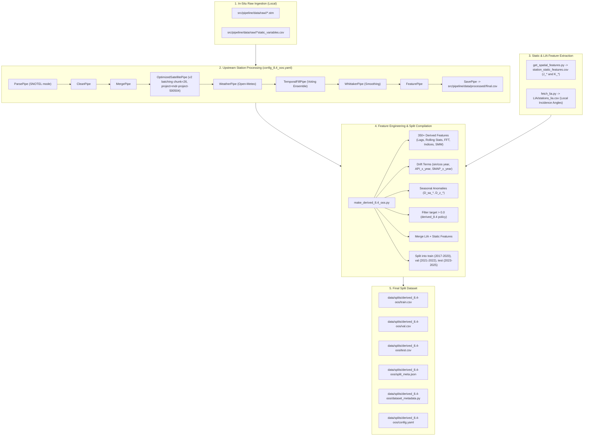

# Implementation Plan: Creation of `derived_8.4-oos` Out-of-State Dataset (Updated)

## Goal Description
Create a new dataset split `derived_8.4-oos` that mirrors the exact post-processing, feature engineering schema (350+ derived features, LIA, and static geospatial features), and train/val/test temporal split structure of `derived_8.4` across **2017–2025** (excluding 2026).

---

## Station Selection & SNOTEL Audit

### 1. SNOTEL Replacement Diagnostics (Bourne, Madison Butte, Rock Springs, Snow Mountain vs High Ridge)
We performed an audit across `2017-01-01` to `2025-12-31` (Train 2017–2020, Val 2021–2022, Test 2023–2025):

| SNOTEL Station | Site ID | State | Elev (m) | Train Pos / Total (% Zero) | Val Pos / Total (% Zero) | Test Pos / Total (% Zero) | Total Pos Days (2017–2025) | Dropped Zeros | Verdict / Recommendation |
|---|---|---|---|---|---|---|---|---|---|
| **RockSprings** | 721 | OR | 1,612 | 1,461 / 1,461 (**0.0%**) | 720 / 720 (**0.0%**) | 1,096 / 1,096 (**0.0%**) | **3,277** | **0** | **Strongly Recommended**: 99.7% calendar completeness, **0.0% zero readings** throughout. Ideal replacement for HighRidge. |
| **ClackamasLake** | 398 | OR | 1,036 | 702 / 751 (6.5%) | 730 / 730 (**0.0%**) | 1,000 / 1,090 (8.3%) | **2,432** | **139** | **Selected**: Replaces MillerWoods and ClearLake. 100% full calendar coverage in validation split. |
| **HighRidge** | 523 | OR | 1,494 | 1,302 / 1,461 (10.9%) | 616 / 730 (15.6%) | 971 / 1,096 (11.4%) | **2,889** | **398** | Candidate baseline; ~12% zero readings during winter freeze. |
| **Bourne** | 361 | OR | 1,783 | 726 / 1,461 (50.3%) | 561 / 724 (22.5%) | 939 / 1,092 (14.0%) | **2,226** | **1,051** | Not recommended: Severe zero dropouts (50.3% in train, 32% overall). |
| **MadisonButte** | 608 | OR | 1,570 | 859 / 919 (6.5%) | 14 / 100 (86.0%) | 0 / 573 (100.0%) | **873** | **719** | Not usable: Lacks 5cm sensor (only 10cm/50cm) and sensor failed after 2021. |
| **SnowMountain** | 767 | OR | 1,899 | 0 / 0 | 0 / 2 (100.0%) | 0 / 0 | **0** | **2** | Not usable: Only 2 recorded days for 5cm sensor in raw dataset. |

### 2. Final Selected 10-Station Dataset Composition
The dataset consists of **8 USCRN Stations** + **2 SNOTEL Stations**:

| # | Station Name | Station ID | Network | State | Latitude | Longitude | Elevation (m) | 2017–2025 Positive Days | Zero Reading % |
|---|---|---|---|---|---|---|---|---|---|
| 1 | **John Day 35 WNW** | `John_Day_35_WNW` | USCRN | OR | 44.55600 | -119.64590 | 684.0 | **3,165** | 0.0% |
| 2 | **Corvallis 10 SSW** | `Corvallis_10_SSW` | USCRN | OR | 44.41850 | -123.32570 | 95.0 | **2,459** | 0.0% |
| 3 | **Riley 10 WSW** | `Riley_10_WSW` | USCRN | OR | 43.47110 | -119.69170 | 1,397.0 | **2,692** | 0.0% |
| 4 | **Murphy 10 W** | `Murphy_10_W` | USCRN | ID | 43.20440 | -116.75050 | 1,204.0 | **2,970** | 0.0% |
| 5 | **Redding 12 WNW** | `Redding_12_WNW` | USCRN | CA | 40.65070 | -122.60680 | 432.0 | **3,069** | 0.0% |
| 6 | **Boulder 14 W** | `Boulder_14_W` | USCRN | CO | 40.03540 | -105.54090 | 2,996.0 | **1,809** | 0.0% |
| 7 | **Lander 11 SSE** | `Lander_11_SSE` | USCRN | WY | 42.67540 | -108.66860 | 1,760.0 | **2,085** | 0.0% |
| 8 | **Wolf Point 29 ENE** | `Wolf_Point_29_ENE` | USCRN | MT | 48.30820 | -105.10180 | 636.0 | **1,544** | 0.0% |
| 9 | **Clackamas Lake** | `Clackamas_Lake_398` | SNOTEL | OR | 45.09658 | -121.75443 | 1,036.0 | **2,432** | 5.4% |
| 10 | **Rock Springs** | `Rock_Springs_721` | SNOTEL | OR | 44.00883 | -118.83842 | 1,612.0 | **3,277** | 0.0% |

---

## Earth Engine Integration (`mdr-project-500504`)

> [!NOTE]
> **Authentication Status: Verified Working**
> Verified that Google Earth Engine initializes successfully with project `mdr-project-500504` via persistent OAuth credentials at `~/.config/earthengine/credentials`.
> `initialize_ee()` in `src/pipeline/utils/gee.py` will include an automatic fallback to load persistent OAuth tokens directly when `gcloud` binary is not in PATH.

---

## Architecture & Data Flow



---

## Proposed Changes

### 1. Robust GEE Utility Initialization
#### [MODIFY] [src/pipeline/utils/gee.py](src/pipeline/utils/gee.py)
- Update `initialize_ee(logger=None)` to try direct persistent OAuth loading from `~/.config/earthengine/credentials` with `google.oauth2.credentials.Credentials` before attempting system CLI calls, defaulting to `mdr-project-500504` if `GEE_PROJECT_ID` is unset.

### 2. Versioned Pipeline Configuration
#### [NEW] [src/pipeline/config_8.4_oos.yaml](src/pipeline/config_8.4_oos.yaml)
- Configure the selected 10 out-of-state stations:
  - `start_year: 2016`, `end_year: 2025` (no 2026 data).
  - `snotel_mode: true` for `.stm` parsing.
  - Set `satellite.version: "v2"`, `use_optimized: true`, `batch_chunk_size: 26`, `use_server_batching: true`.

### 3. Static & LIA Extraction Tools
#### [NEW] [data/splits/derived_8.4-oos/LIA/fetch_lia.py](data/splits/derived_8.4-oos/LIA/fetch_lia.py)
- Sample Sentinel-1 ascending and descending orbit local incidence angle mean/std for the 10 stations, outputting `LIA/stations_lia.csv`.

#### [NEW] [data/splits/derived_8.4-oos/get_spatial_features.py](data/splits/derived_8.4-oos/get_spatial_features.py)
- Sample terrain DEM, WorldCover land cover, WorldClim bioclimatic variables (`J_bio_bio01..19`), OpenLandMap clay/sand fractions across depth bands, and Family K derived trigonometric/ratio features into `station_static_features.csv`.

### 4. Split Generation Script & Artifacts
#### [NEW] [data/splits/derived_8.4-oos/make_derived_8.4_oos.py](data/splits/derived_8.4-oos/make_derived_8.4_oos.py)
- Feature engineering script generating the exact 350+ derived features matching `derived_8.4`.
- Temporal splitting:
  - `TRAIN_YEARS = set(range(2017, 2021))` (2017–2020)
  - `VAL_YEARS   = set(range(2021, 2023))` (2021–2022)
  - `TEST_YEARS  = set(range(2023, 2026))` (2023–2025)
- Apply `target > 0.0` filtering and save `train.csv`, `val.csv`, `test.csv`, and `split_meta.json`.

#### [NEW] [data/splits/derived_8.4-oos/dataset_metadata.py](data/splits/derived_8.4-oos/dataset_metadata.py)
- Export metadata class providing station names, features list, and target column definitions.

---

## Verification Plan

### Automated Tests
1. **Pipeline Config & Listing**:
   ```bash
   PYTHONPATH=. GEE_PROJECT_ID=mdr-project-500504 uv run python src/pipeline/main.py --config src/pipeline/config_8.4_oos.yaml --list-stations
   ```
2. **Station Pipeline Execution**:
   Run the pipeline for each new station to produce the processed final CSVs:
   ```bash
   PYTHONPATH=. GEE_PROJECT_ID=mdr-project-500504 uv run python src/pipeline/main.py --config src/pipeline/config_8.4_oos.yaml --station <station_key>
   ```
3. **Feature Compilation & Schema Parity Check**:
   Run `make_derived_8.4_oos.py` and assert:
   - Identical columns between `data/splits/derived_8.4/train.csv` and `data/splits/derived_8.4-oos/train.csv`.
   - Max date in test split is `2025-12-31` (no 2026 records).
   - Zero missing static/LIA features.

### Manual Verification
- Review generated `split_meta.json` to verify per-station row counts across train, val, and test splits.
