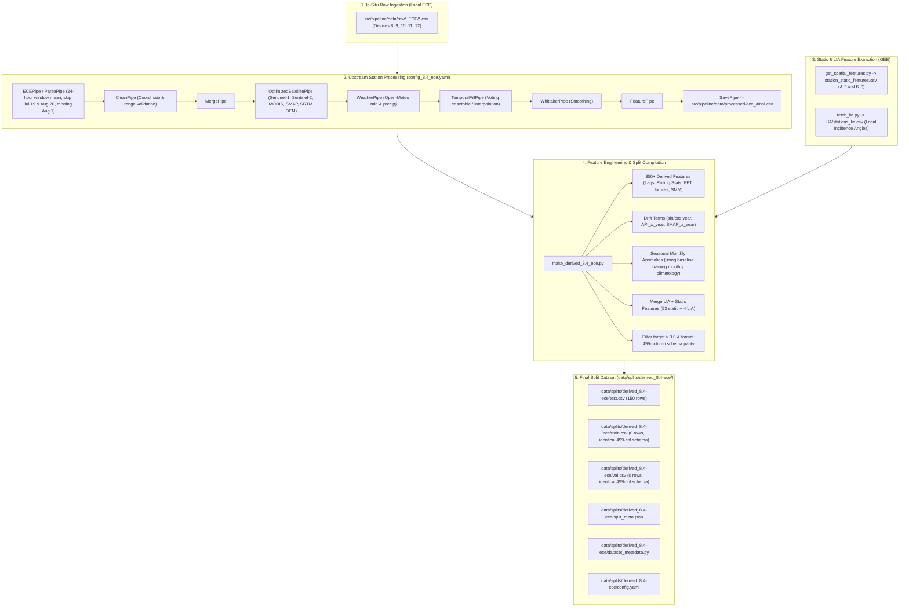

# Implementation Plan: Creation of `derived_8.4-ece` In-Situ Dataset & Pipeline Integration

## Goal Description
Create a new dataset split `derived_8.4-ece` that mirrors `derived_8.4-oos` and `derived_8.4` schemas (350+ derived features, LIA, and static geospatial features across 499 standardized columns) exclusively using the in-situ soil moisture sensor stations in `src/pipeline/data/raw/_ECE/*.csv` as a held-out evaluation dataset.

The dataset integrates the 5 Washington state sensor deployment sites developed in collaboration with the ECE team:
1. **Bellevue Botanical Garden (Main Street)** (Device 8, `ECE_BBG_Main_St`)
2. **Bellevue Botanical Garden (Lost Meadow Trail)** (Device 10, `ECE_BBG_Lost_Meadow`)
3. **Renton Home** (Device 11, `ECE_Renton_Home`)
4. **Renton Garden (North)** (Device 9, `ECE_Renton_Garden_North`)
5. **Renton Garden (Shed)** (Device 12, `ECE_Renton_Garden_Shed`)

---

## User Review Required

> [!IMPORTANT]
> **Measurement Averaging & Date Filtering Policy**:
> - **Sampling & Windowing**: Raw measurements are recorded at sub-minute intervals with local Seattle time (`Timestamp (Seattle Time)`). As instructed, measurements are averaged across each 24-hour calendar day window.
> - **Partial Days Excluded**: The start day `2026-07-19` (measurements begin at ~12:15 PM) and end day `2026-08-20` (measurements end at ~10:00 AM) are partial days and will be skipped completely.
> - **Missing Data**: `2026-08-01` is known to be completely missing in the raw sensor recordings and will have no target measurements.
> - **Evaluation Dataset Structure**: Yields exactly 30 valid ground-truth calendar days per station across 5 stations (**150 evaluation rows total**). All 150 rows will be compiled into `test.csv`, with `train.csv` and `val.csv` having the identical 499-column schema for full compatibility with existing MDR evaluation loaders.
> - **Target Unit Normalization**: Raw `Soil Moisture (%)` values (e.g. 5.18%, 23.47%) are converted to volumetric water content fraction ($m^3/m^3$, e.g. 0.0518, 0.2347) matching `soil_moisture_5cm` in `derived_8.4` and `derived_8.4-oos`.

---

## Architecture & Data Flow



---

## Proposed Changes

### 1. Ingestion Pipeline & ECE Parser
#### [NEW] [`src/pipeline/pipes/ece_pipe.py`](src/pipeline/pipes/ece_pipe.py)
- Implements `ECEPipe` class to parse ECE CSV files:
  - Extracts device metadata, DevEUI, soil type, and coordinates from header.
  - Converts `Timestamp (Seattle Time)` to local datetime.
  - Excludes incomplete boundary days `2026-07-19` and `2026-08-20`.
  - Groups by calendar date to calculate 24-hour window means for `Soil Moisture (%)`.
  - Converts `Soil Moisture (%)` to volumetric fraction ($m^3/m^3$) under `soil_moisture_5cm` (`value / 100.0`).
  - Standardizes metadata columns: `date`, `station_id`, `latitude`, `longitude`, `elevation`.

#### [MODIFY] [`src/pipeline/pipes/parse_pipe.py`](src/pipeline/pipes/parse_pipe.py)
- Add `ece_mode` branch to `ParsePipe.run()` delegating to `ECEPipe`.

#### [MODIFY] [`src/pipeline/main.py`](src/pipeline/main.py)
- Update `run_pipeline_for_station` to support `is_ece = station_cfg.get("parse", {}).get("ece_mode", False)`, skipping `RequestPipe` for local raw ECE files.

---

### 2. Upstream Pipeline Configuration
#### [NEW] [`src/pipeline/config_8.4_ece.yaml`](src/pipeline/config_8.4_ece.yaml)
- Configure all 5 ECE stations:
  - `ece_bbg_main_st` (lat: 47.6098164, lon: -122.1824678, Device 8)
  - `ece_bbg_lost_meadow` (lat: 47.6072232, lon: -122.1795066, Device 10)
  - `ece_renton_home` (lat: 47.4887385, lon: -122.1446671, Device 11)
  - `ece_renton_garden_north` (lat: 47.4962798, lon: -122.1406354, Device 9)
  - `ece_renton_garden_shed` (lat: 47.4958091, lon: -122.1407765, Device 12)
- Configure `satellite` (v2 batching with GEE), `weather` (Open-Meteo), `temporal_fill`, `whittaker`, and `save` pipes to output to `src/pipeline/data/processed/ece_<station_slug>/final.csv`.

---

### 3. Static Geospatial & LIA Extraction Tools
#### [NEW] [`data/splits/derived_8.4-ece/station_coords.csv`](data/splits/derived_8.4-ece/station_coords.csv)
- Station coordinates for the 5 ECE deployment sites.

#### [NEW] [`data/splits/derived_8.4-ece/get_spatial_features.py`](data/splits/derived_8.4-ece/get_spatial_features.py)
- Extracts static features (WorldClim bioclimatic variables `J_bio_bio01..19`, OpenLandMap soil clay/sand/texture across depth bands, WorldCover land cover, SRTM DEM terrain slope/aspect, and Family K derived trigonometric/ratio features) into `station_static_features.csv`.

#### [NEW] [`data/splits/derived_8.4-ece/LIA/stations.csv`](data/splits/derived_8.4-ece/LIA/stations.csv) & [`data/splits/derived_8.4-ece/LIA/fetch_lia.py`](data/splits/derived_8.4-ece/LIA/fetch_lia.py)
- Samples Sentinel-1 orbit local incidence angles (`lia_mean_asc_deg`, `lia_std_asc_deg`, `lia_mean_desc_deg`, `lia_std_desc_deg`) into `LIA/stations_lia.csv`.

---

### 4. Split Compilation & Feature Engineering
#### [NEW] [`data/splits/derived_8.4-ece/make_derived_8.4_ece.py`](data/splits/derived_8.4-ece/make_derived_8.4_ece.py)
- Feature engineering compiler:
  - Loads processed ECE station CSVs.
  - Applies 350+ derived feature math (vegetation/moisture indices, SAR ratio/diff/roughness, API decay, DSLR, rain sums, SMAP lags & stats, difference sequences, rolling volatility & SMM indices).
  - Computes seasonal anomalies using training climatology from `derived_8.4`.
  - Merges static geospatial (`J_*`, `K_*`) and LIA features.
  - Applies target filter `soil_moisture_5cm.notna() & (soil_moisture_5cm > 0.0)`.
  - Produces `test.csv`, `train.csv`, `val.csv`, `split_meta.json`, `config.yaml`, and `dataset_metadata.py`.
  - Verifies exact 499 column schema parity against `derived_8.4/train.csv` and `derived_8.4-oos/train.csv`.

#### [NEW] [`data/splits/derived_8.4-ece/dataset_metadata.py`](data/splits/derived_8.4-ece/dataset_metadata.py)
- Standardized metadata helper module with station constants and split paths.

---

## Verification Plan

### Automated Tests
1. **Pipeline Execution**:
   ```bash
   PYTHONPATH=. uv run python src/pipeline/main.py --config src/pipeline/config_8.4_ece.yaml
   ```
   Verify 5 processed CSV files generated under `src/pipeline/data/processed/ece_*/final.csv`.

2. **Static & LIA Feature Generation**:
   ```bash
   PYTHONPATH=. uv run python data/splits/derived_8.4-ece/get_spatial_features.py --coords_csv data/splits/derived_8.4-ece/station_coords.csv --out_csv data/splits/derived_8.4-ece/station_static_features.csv
   PYTHONPATH=. uv run python data/splits/derived_8.4-ece/LIA/fetch_lia.py --stations-csv data/splits/derived_8.4-ece/LIA/stations.csv --out-csv data/splits/derived_8.4-ece/LIA/stations_lia.csv
   ```
   Verify zero NaN values across 53 static features and 4 LIA columns.

3. **Split Compilation & Parity Check**:
   ```bash
   uv run python data/splits/derived_8.4-ece/make_derived_8.4_ece.py
   ```
   Verify:
   - Exactly 150 rows in `test.csv` (30 days $\times$ 5 stations).
   - Date range strictly `2026-07-20` to `2026-08-19`, with `2026-08-01` absent.
   - Complete 499-column schema parity with `data/splits/derived_8.4/train.csv` and `data/splits/derived_8.4-oos/train.csv`.

4. **Integration Test with Experiment Loader**:
   Verify that `data.py` from `derived_8.4-formal-eval-2.0` can load `derived_8.4-ece` without errors.

### Manual Verification
- Verify that `split_meta.json` records 30 rows for each of the 5 ECE stations and accurately documents the dataset metadata.
