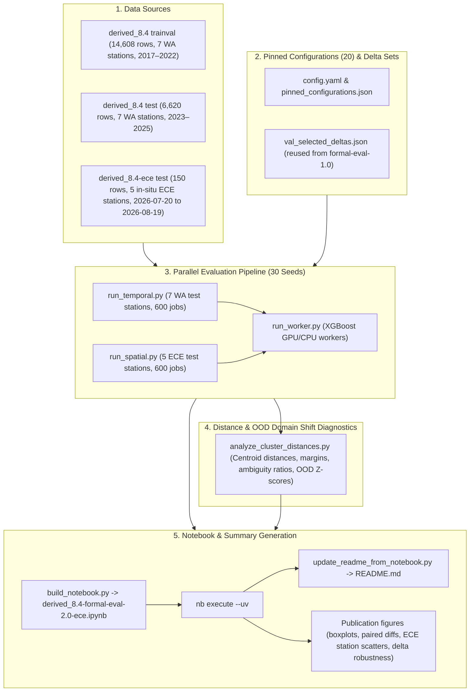

# Implementation Plan: `derived_8.4-formal-eval-2.0-ece` Formal Statistical Evaluation on In-Situ ECE Sensors

## Goal Description
Create a new formal evaluation experiment `derived_8.4-formal-eval-2.0-ece` under [`notebooks/experiment/derived_8.4-formal-eval-2.0-ece/`](notebooks/experiment/derived_8.4-formal-eval-2.0-ece/) mirroring the rigorous statistical methodology of `derived_8.4-formal-eval-2.0`.

The evaluation will assess in-state spatial transfer and generalization of the 20 pinned model configurations (including two-regime KMeans clustering, single-regime global baselines, and supervised trained-gating models across 30 seeds) on the newly deployed in-situ ECE soil moisture sensors in Washington State ([`derived_8.4-ece`](data/splits/derived_8.4-ece/), 5 stations, 150 rows recorded between July 20 and August 19, 2026), **strictly excluding the out-of-state stations from `derived_8.4-oos`**.

---

## User Review Required

> [!IMPORTANT]
> **Dataset Scope & Evaluation Protocol**:
> 1. **Training Split**: All models and routers are trained strictly on the 7 Washington state stations from [`data/splits/derived_8.4/`](data/splits/derived_8.4/) (`trainval`, 2017–2022, 14,608 rows).
> 2. **Spatial Split (`derived_8.4-ece`)**: Evaluated on all 5 in-situ ECE sensor deployment sites in Washington (`ECE_BBG_Main_St`, `ECE_BBG_Lost_Meadow`, `ECE_Renton_Home`, `ECE_Renton_Garden_North`, `ECE_Renton_Garden_Shed`; 150 total rows across July 20 – August 19, 2026). The ECE dataset is **completely unseen** during model training and router fitting.
> 3. **Exclusion of OOS Dataset**: As requested, out-of-state stations from `derived_8.4-oos` are omitted from this experiment.
> 4. **Temporal Split (In-Distribution Baseline)**: Evaluated on the frozen Washington test set (2023–2025, 6,620 rows, 7 WA stations) across 30 seeds to maintain exact in-distribution baseline anchor and replication verification.
> 5. **Multi-Seed Scope**: 30 random seeds (seeds 42, 7, 13, ..., 2222) for both temporal and spatial evaluations.
> 6. **Feature Space Parity**: The 20 pinned configurations and feature additions (`val_selected_deltas.json`) from `derived_8.4-formal-eval-1.0` / `2.0` will be reused directly to guarantee architectural consistency without redundant search.

---

## Architecture & Data Flow



---

## Proposed Changes

### Experiment Directory Structure: `notebooks/experiment/derived_8.4-formal-eval-2.0-ece/`

All changes will be isolated inside the new directory [`notebooks/experiment/derived_8.4-formal-eval-2.0-ece/`](notebooks/experiment/derived_8.4-formal-eval-2.0-ece/).

```
notebooks/experiment/derived_8.4-formal-eval-2.0-ece/
├── .gitignore
├── README.md
├── analyze_cluster_distances.py
├── build_notebook.py
├── config.yaml
├── derived_8.4-formal-eval-2.0-ece.ipynb
├── eval_formal/
│   ├── __init__.py
│   ├── configs.py
│   ├── data.py
│   ├── evaluator.py
│   ├── jobs.py
│   ├── plots.py
│   ├── routers.py
│   └── stats.py
├── run_slurm.sh
├── run_spatial.py
├── run_temporal.py
├── run_worker.py
├── setup_config.py
├── update_readme_from_notebook.py
└── val_selected_deltas.json
```

---

### Component Details

#### [NEW] [`notebooks/experiment/derived_8.4-formal-eval-2.0-ece/config.yaml`](notebooks/experiment/derived_8.4-formal-eval-2.0-ece/config.yaml)
- Define `data.spatial_ece` pointing to `data/splits/derived_8.4-ece/`:
  ```yaml
  data:
    target: soil_moisture_5cm
    metadata_path: data/splits/derived_8.4/dataset_metadata.py
    splits:
      train: data/splits/derived_8.4/train.csv
      val: data/splits/derived_8.4/val.csv
      test: data/splits/derived_8.4/test.csv
    spatial_ece:
      metadata_path: data/splits/derived_8.4-ece/dataset_metadata.py
      splits:
        train: data/splits/derived_8.4-ece/train.csv
        val: data/splits/derived_8.4-ece/val.csv
        test: data/splits/derived_8.4-ece/test.csv
  candidate_pool_file: notebooks/experiment/derived_8.4-feature-selection-2.0/artifacts/candidate_pool.csv
  # Shared 54 backbone, 20 pinned configs, 30 seeds (temporal & spatial)
  ```
- Remove all references to `spatial_oos` / `derived_8.4-oos`.

#### [NEW] [`notebooks/experiment/derived_8.4-formal-eval-2.0-ece/eval_formal/data.py`](notebooks/experiment/derived_8.4-formal-eval-2.0-ece/eval_formal/data.py)
- Expose `ExperimentData` dataclass with ECE fields:
  ```python
  @dataclass
  class ExperimentData:
      train: pd.DataFrame
      val: pd.DataFrame
      test: pd.DataFrame
      trainval: pd.DataFrame
      ece_train: pd.DataFrame
      ece_val: pd.DataFrame
      ece_test: pd.DataFrame
      ece_all: pd.DataFrame
      ece_stations: list[str]
      feature_columns: list[str]
      source_order: list[str]
      target: str
      v0_features: list[str]
      shared_backbone_54: list[str]
      candidate_pool: list[str]
  ```
- Load `spatial_ece` splits from `derived_8.4-ece` and extract the 5 ECE stations (`ECE_BBG_Main_St`, `ECE_BBG_Lost_Meadow`, `ECE_Renton_Home`, `ECE_Renton_Garden_North`, `ECE_Renton_Garden_Shed`).

#### [NEW] [`notebooks/experiment/derived_8.4-formal-eval-2.0-ece/eval_formal/evaluator.py`](notebooks/experiment/derived_8.4-formal-eval-2.0-ece/eval_formal/evaluator.py)
- Implement `evaluate_full()` (temporal evaluation on Washington test set) and `evaluate_spatial_ece()` (spatial evaluation on the 5 ECE deployment stations).
- Checkpoint / reuse fitted XGBoost expert models from `models/` when available.

#### [NEW] [`notebooks/experiment/derived_8.4-formal-eval-2.0-ece/eval_formal/plots.py`](notebooks/experiment/derived_8.4-formal-eval-2.0-ece/eval_formal/plots.py)
- Update plot annotations and figure generators for 5 ECE stations (e.g. `n = 5` station win scatters, ECE station bar charts).

#### [NEW] [`notebooks/experiment/derived_8.4-formal-eval-2.0-ece/eval_formal/jobs.py`](notebooks/experiment/derived_8.4-formal-eval-2.0-ece/eval_formal/jobs.py) & [`run_worker.py`](notebooks/experiment/derived_8.4-formal-eval-2.0-ece/run_worker.py)
- Support `--target full` (WA test) and `--target ece` (ECE spatial evaluation).

#### [NEW] [`notebooks/experiment/derived_8.4-formal-eval-2.0-ece/run_spatial.py`](notebooks/experiment/derived_8.4-formal-eval-2.0-ece/run_spatial.py)
- Execute spatial jobs on `ece` split across 20 pinned configs $\times$ 30 seeds.
- Aggregate per-job outputs into:
  - `spatial_seed_summary.csv`
  - `spatial_seed_station.csv`
  - `spatial_seed_year.csv`
  - `spatial_seed_cluster.csv`

#### [NEW] [`notebooks/experiment/derived_8.4-formal-eval-2.0-ece/run_temporal.py`](notebooks/experiment/derived_8.4-formal-eval-2.0-ece/run_temporal.py)
- Execute temporal jobs on `derived_8.4` test set across 20 pinned configs $\times$ 30 seeds and verify replication anchors for seed 42.

#### [NEW] [`notebooks/experiment/derived_8.4-formal-eval-2.0-ece/analyze_cluster_distances.py`](notebooks/experiment/derived_8.4-formal-eval-2.0-ece/analyze_cluster_distances.py)
- Compute KMeans ($k=2$) cluster centroid distances, boundary margins, ambiguity ratios, OOD Z-scores, and volumetric soil moisture target statistics comparing the 7 Washington training stations to the 5 in-situ ECE stations.
- Export `spatial_focused_no_delta_station_cluster_distances.csv`.

#### [NEW] [`notebooks/experiment/derived_8.4-formal-eval-2.0-ece/build_notebook.py`](notebooks/experiment/derived_8.4-formal-eval-2.0-ece/build_notebook.py)
- Deterministically generate `derived_8.4-formal-eval-2.0-ece.ipynb` via the `nb` CLI with sequential narrative cells and code blocks for:
  1. Title & Experiment Objectives
  2. Setup & Data Loading
  3. Pinned Configurations Table (20 configs)
  4. Temporal Seed Summary (R², RMSE, MAE, BIAS)
  5. Focused Temporal Pairwise Tests (BH-FDR)
  6. Temporal Sample-Level Block Bootstrap
  7. In-Situ ECE Spatial Summary (5 stations, 150 rows, 30 seeds)
  8. Per-Station Breakdown Across 5 ECE Stations & Difficulty Ranking
  9. Spatial Focused Pairwise Tests (per-station sign test, paired t-test, Wilcoxon, BH-FDR)
  10. Spatial Sample-Level Block Bootstrap on ECE dataset
  11. Focused Architectural Comparison (No Deltas: Clustering vs Global Single vs Trained Gating vs Seasonal Binary)
  12. Table 4: Cluster Distances & OOD Domain Shift Diagnostics (WA Baseline vs 5 ECE Deployment Sites)
  13. Publication Figure Generation
  14. Delta-Source Robustness Summary
  15. Seed-42 Historical Replication Checks
  16. Key Takeaways & Physical In-Situ Sensor Transfer Discussion

#### [NEW] [`notebooks/experiment/derived_8.4-formal-eval-2.0-ece/update_readme_from_notebook.py`](notebooks/experiment/derived_8.4-formal-eval-2.0-ece/update_readme_from_notebook.py)
- Populate `README.md` strictly from the executed stdout of `derived_8.4-formal-eval-2.0-ece.ipynb`.

---

## Verification Plan

### Automated Tests
1. **Smoke Test Execution (CPU, 2 configs $\times$ 2 seeds)**:
   ```bash
   cd notebooks/experiment/derived_8.4-formal-eval-2.0-ece
   uv run python run_temporal.py --smoke --max-configs 2 --seeds 42 7
   uv run python run_spatial.py --smoke --max-configs 2 --seeds 42 7
   ```
   Verify rapid execution and non-empty output CSVs.

2. **Statistical Package Self-Tests**:
   ```bash
   cd notebooks/experiment/derived_8.4-formal-eval-2.0-ece
   uv run python -m eval_formal.stats
   ```
   Verify 100% pass on statistical calculations (t-tests, Wilcoxon, bootstrap, BH-FDR, sign tests).

3. **Full Multi-Seed Evaluation (GPU / Multi-core, 20 configs $\times$ 30 seeds)**:
   ```bash
   cd notebooks/experiment/derived_8.4-formal-eval-2.0-ece
   uv run python run_temporal.py
   uv run python run_spatial.py
   uv run python analyze_cluster_distances.py
   ```
   Verify completion of all 600 temporal + 600 spatial jobs and generation of all summary CSVs.

4. **Notebook Build & Reproducible Execution**:
   ```bash
   cd notebooks/experiment/derived_8.4-formal-eval-2.0-ece
   uv run python build_notebook.py
   cd ../.. # in notebooks/
   nb execute experiment/derived_8.4-formal-eval-2.0-ece/derived_8.4-formal-eval-2.0-ece.ipynb --uv
   ```
   Verify zero execution errors across all sequential cells.

5. **README Sync & Verification**:
   ```bash
   cd notebooks/experiment/derived_8.4-formal-eval-2.0-ece
   uv run python update_readme_from_notebook.py
   ```
   Verify that all tables in `README.md` match notebook outputs verbatim and all generated `.png` figure files exist.

### Manual Verification
- Review the generated `README.md` and `derived_8.4-formal-eval-2.0-ece.ipynb` to verify that all 5 ECE stations are evaluated, cluster allocations are physically sound, and statistical conclusions reflect the in-situ sensor evaluation.
