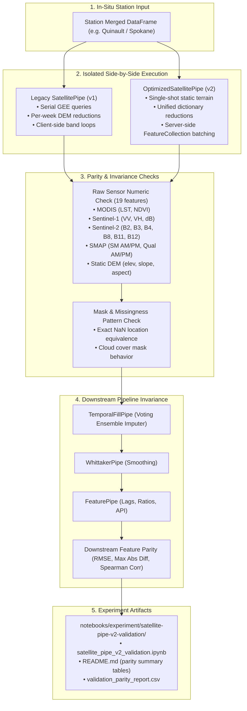

# Implementation Plan: Satellite Pipeline V2 Validation Experiment (`satellite-pipe-v2-validation`)

## Goal Description
Perform an empirical validation of the overhauled satellite pipeline (`OptimizedSatellitePipe` / `SatellitePipeV2`) against the legacy baseline (`SatellitePipe` / `v1`). While theoretical reviews indicated equivalence, downstream performance discrepancies on newly generated datasets require verifying that `OptimizedSatellitePipe` produces numerically and semantically identical outputs across all remote sensing bands, terrain metrics, missing value patterns, and downstream feature transformations.

To avoid excessive GEE API consumption and compute credits, validation will proceed incrementally:
1. **Micro-Slice Validation (1–4 weeks)**: Isolated single-week and 4-week comparisons across all 19 satellite features on uncached live GEE queries.
2. **Seasonal Chunk Validation (12–26 weeks)**: Testing GEE server-side multi-week `ee.FeatureCollection` batching (`batch_chunk_size=26`) through varying seasons (cloudy winter vs. arid summer).
3. **Downstream Pipeline Parity Validation**: Passing v1 and v2 outputs through `TemporalFillPipe`, `WhittakerPipe`, and `FeaturePipe` to ensure imputed and derived features match downstream.
4. **Bug Diagnosis & Patching**: Identifying and fixing any subtle discrepancies discovered (e.g. band scaling, reduction geometry, temporal padding, or NaN handling).
5. **Reproducible Experiment Notebook & Report**: Building `notebooks/experiment/satellite-pipe-v2-validation/` with fully reproducible execution.

---

## User Review Required

> [!IMPORTANT]
> **Station Selection for Incremental Validation**:
> We recommend using `quinault_4_ne` (USCRN WA station with high precipitation and cloud cover, ideal for testing Sentinel-2 cloud filtering and SAR penetration) and `spokane_17_ssw` (USCRN WA station with arid inland climate, ideal for MODIS LST/NDVI and SMAP soil moisture dynamics).
>
> Both stations have existing ground truth and historical configs in `src/pipeline/config.yaml`.

> [!NOTE]
> **Credit & API Cost Management**:
> - Validation will start with small date slices (e.g. 4 weeks = 1 month) using temporary isolated cache sandboxes.
> - We only scale to multi-month (26 weeks) and full-year slices once micro-slice parity is verified.

---

## Proposed Validation Architecture & Workflow



---

## Proposed Changes

### Component 1: Validation Experiment (`notebooks/experiment/satellite-pipe-v2-validation/`)

#### [NEW] `notebooks/experiment/satellite-pipe-v2-validation/satellite_pipe_v2_validation.ipynb`
A structured, reproducible Jupyter Notebook executing the phased comparison:
- **Cell Group 1**: Environment setup, GEE initialization, configuration loading.
- **Cell Group 2**: Micro-slice benchmark (4 weeks) comparing V1 vs. V2 single-week mode on `quinault_4_ne`.
- **Cell Group 3**: Medium slice (26 weeks) comparing V1 vs. V2 batch-collection mode on `spokane_17_ssw`.
- **Cell Group 4**: Feature-by-feature numeric difference metrics (Max Absolute Difference, Mean Absolute Difference, Relative Error, NaN mismatch count).
- **Cell Group 5**: Downstream pipe evaluation (`TemporalFillPipe` -> `WhittakerPipe` -> `FeaturePipe`) verifying that imputed series and 350+ derived features match within machine precision ($< 10^{-5}$).
- **Cell Group 6**: Performance and runtime benchmarking (speedup factor, RPC call count comparison).

#### [NEW] `notebooks/experiment/satellite-pipe-v2-validation/README.md`
Standard markdown experiment report documenting:
- Objectives and hypothesis.
- Detailed stdout output tables from notebook execution.
- Feature parity verification tables for all 19 raw satellite channels and key downstream features.
- Any bugs or discrepancies discovered and their fixes.

---

### Component 2: Bug Fixes in Pipeline (if any discovered during validation)

#### [MODIFY] `src/pipeline/pipes/optimized_satellite_pipe.py`
If micro- or medium-slice testing uncovers discrepancies (such as handling of empty collections in server-side batches, date padding differences, or coordinate median aggregation), patch and verify with unit tests.

#### [MODIFY] `tests/test_satellite_pipeline.py`
Add regression test cases covering the specific scenario or bug pattern discovered during validation.

---

## Verification Plan

### Automated Tests
1. Run existing test suite to ensure no regressions across feature selection and pipeline tests:
   ```bash
   uv run pytest tests/
   ```
2. Run dedicated satellite comparison runner across multiple test configurations:
   ```bash
   # Micro slice (4 weeks) on Quinault
   PYTHONPATH=. uv run python -m src.pipeline.validation.compare_satellite_pipes --station quinault_4_ne --weeks 4

   # Medium slice (12 weeks) on Spokane
   PYTHONPATH=. uv run python -m src.pipeline.validation.compare_satellite_pipes --station spokane_17_ssw --weeks 12
   ```

### Manual & Notebook Verification
3. Execute the validation notebook end-to-end using the `notebook-cli` tool:
   ```bash
   nb execute notebooks/experiment/satellite-pipe-v2-validation/satellite_pipe_v2_validation.ipynb --uv
   ```
4. Verify all tables in `README.md` are populated directly from executed cell outputs.