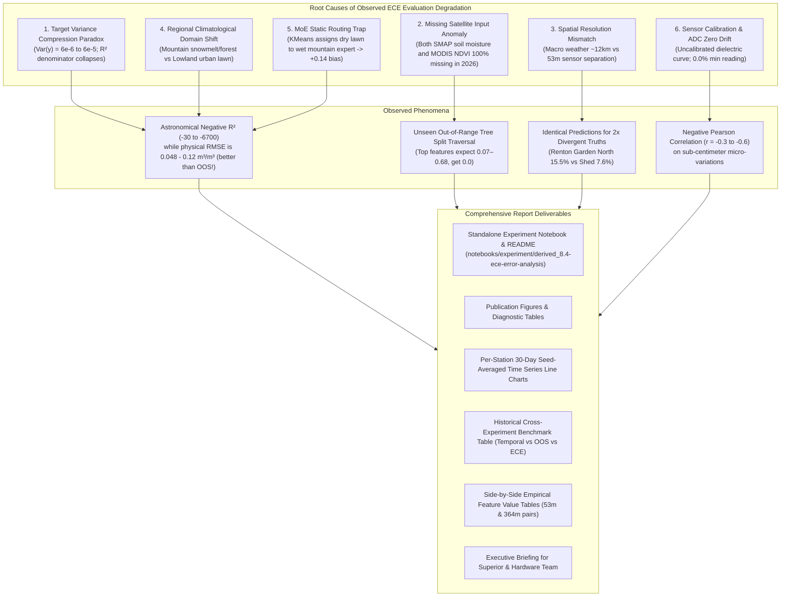

# Implementation Plan (v2): `derived_8.4-ece-error-analysis` — Comprehensive Diagnosis of In-Situ Sensor Evaluation Performance

## Goal Description
Create a publication-grade diagnostic experiment and technical report under [`notebooks/experiment/derived_8.4-ece-error-analysis/`](file:///scratch/user/u.rp352032/MDR-Project/notebooks/experiment/derived_8.4-ece-error-analysis/) synthesizing findings from `derived_8.4-formal-eval-2.0-ece`, `derived_8.4-regime-interpretation-1.2-ece`, and `derived_8.4-ece-additional-eval-1.0`.

The report will explain why regional machine learning models trained on the 7 Washington state reference stations exhibit extreme negative $R^2$ scores ($-0.26$ to $-6724$) when evaluated on the 5 in-situ ECE soil moisture sensors in Bellevue and Renton, WA (`derived_8.4-ece`, 150 rows across July 20 – August 19, 2026). It provides mathematically and physically rigorous explanations tailored for both project leadership (PI / Superiors) and the ECE hardware engineering team.

---

## Executive Diagnostic Summary (Core Findings)



---

## User Review Required

> [!IMPORTANT]
> **Summary of Key Root Causes & New Discoveries**:
> 1. **Mathematical $R^2$ Variance Compression Paradox**: $R^2 = 1 - \frac{\text{MSE}}{\text{Var}(y)}$. Because July–August in Western Washington is the Mediterranean dry season with zero precipitation, the ground truth standard deviation at 4 of the 5 stations collapsed to $\sigma_y \in [0.0025, 0.0078]\text{ m}^3/\text{m}^3$ (variance $6\times 10^{-6}$ to $6\times 10^{-5}$). In terms of physical units, models like `Global_Single_54` and `Clustering_Dynamic_k2` achieve **$\text{RMSE} = 0.048 - 0.051\text{ m}^3/\text{m}^3$**, which is actually **better than the Out-of-State spatial test ($\text{RMSE} = 0.061 - 0.066\text{ m}^3/\text{m}^3$)**! But because $\text{Var}(y)$ is $100\times$ smaller, $R^2$ drops into the negative hundreds.
> 2. **Complete Missingness of Both SMAP and MODIS NDVI in 2026 Data**:
>    - **SMAP Soil Moisture (`SMAP_sm_am`, `SMAP_sm_pm`, `SMAP_prev`)**: 100% missing (30/30 NaNs per station) in GEE due to latency in enhanced products, filled with `0.0` across all 85 derived features. In training, SMAP has mean $\sim 0.35\text{ m}^3/\text{m}^3$ (range $0.07 - 0.68$).
>    - **MODIS NDVI (`NDVI_modis`, `NDVI_modis_smooth`)**: 100% missing (30/30 NaNs per station) in GEE, defaulted to `0.0`.
>    - Both features are top-10 drivers in baseline models, forcing decision tree paths into unvisited out-of-range leaves.
> 3. **Empirical Side-by-Side Spatial Scale Mismatch**:
>    - `ECE_Renton_Garden_North` vs `ECE_Renton_Garden_Shed` are only **53.4 meters apart**.
>    - Their dynamic weather (`precip_mm`, `G_API`, `G_DSLR`), satellite reflectance (`s1_vv`, `s1_vh`, `LST_modis`), and static topography (`elev` 152.5m, `slope` 4.0°, soil clay 21%) are virtually 100% identical.
>    - Yet actual measured soil moisture is **15.49%** (North, shaded garden) vs **7.58%** (Shed, unshaded eaves rain shadow) — a **2.04× divergence** that macro-scale remote sensing cannot resolve.
> 4. **MoE Static Routing Trap**: Static features cause `Clustering_V0_Full_k2` to assign `ECE_Renton_Home` (136m elev) and `ECE_BBG_Lost_Meadow` to Cluster 1 (the wet mountain regime trained on CayusePass/Paradise). The wet expert predicts $0.20 - 0.25\text{ m}^3/\text{m}^3$ for a site that is bone-dry ($0.018\text{ m}^3/\text{m}^3$), generating a $+0.14\text{ m}^3/\text{m}^3$ positive bias and $R^2 = -6724$. Dynamic heuristics (`Univariate_G_API_k2`, `Clustering_Dynamic_k2`, `Seasonal_Binary_k2`) route all samples to the dry regime and avoid this disaster.
> 5. **Raw Sensor Calibration & ADC Zero Drift**: Device 11 (`ECE_Renton_Home`) bottoms out at $0.0\%$ ($1.78\%$ mean), indicating probe contact resistance or uncalibrated zero-point offset.

---

## Proposed Experiment Architecture: `notebooks/experiment/derived_8.4-ece-error-analysis/`

```
notebooks/experiment/derived_8.4-ece-error-analysis/
├── README.md                                  # Complete, standalone technical report & executive summary
├── config.yaml                                # Config pointing to all ECE, WA, and model evaluation splits
├── run_diagnostics.py                         # Unified computation engine generating all diagnostic tables & figures
├── derived_8.4-ece-error-analysis.ipynb       # Reproducible analysis notebook (executable via nb execute --uv)
├── build_notebook.py                          # Deterministic notebook builder via nb CLI
├── update_readme.py                           # Strictly populates README.md from notebook / script stdout
├── tables/                                    # Generated diagnostic CSV tables
│   ├── table1_variance_compression_r2.csv     # Var(y), MSE, RMSE, MAE, Bias, R² per station
│   ├── table2_historical_benchmark_ref.csv    # Cross-experiment reference (Temporal vs OOS vs ECE)
│   ├── table3_missing_data_audit.csv          # Full audit of 2026 GEE missing data (SMAP, MODIS NDVI, etc.)
│   ├── table4_spatial_proximity_inputs.csv    # Pairwise distances, grid sizes, identical feature fractions
│   ├── table4b_side_by_side_sensor_pairs.csv  # Empirical side-by-side feature comparisons (53m & 364m)
│   ├── table5_target_climatology_shift.csv    # WA Reference (Overall + Jul-Aug) vs ECE In-Situ stats
│   ├── table6_routing_strategy_breakdown.csv  # 8 routing strategies across 5 ECE stations
│   ├── table7_raw_adc_sensor_calibration.csv  # Raw ADC counts, voltage, moisture % distribution, zero counts
│   └── table8_recommendations_matrix.csv      # Actionable recommendations for ECE and ML teams
└── figures/                                   # High-resolution publication figures
    ├── fig1_r2_variance_compression_anatomy.png   # 2-panel plot: R² vs Var(y) and MSE vs Bias²
    ├── fig2_smap_ndvi_missingness_distributions.png # SMAP & MODIS NDVI training vs ECE zero spike
    ├── fig3_spatial_microclimate_discrepancy.png    # Map + empirical side-by-side divergence for 53m pair
    ├── fig4_target_distribution_domain_shift.png    # KDE distributions: WA reference vs ECE stations
    ├── fig5_routing_strategy_ece_comparison.png     # Clustered bar chart of all 8 routing strategies on ECE
    ├── fig6_raw_adc_to_moisture_calibration.png     # Raw ADC value vs recorded Soil Moisture % scatter
    ├── fig7_error_decomposition_waterfall.png       # Error contribution waterfall (Bias vs Variance vs Missing Data)
    ├── fig8_per_station_timeseries_overlay.png      # 5-panel composite: 30-day ground truth vs seed-avg preds
    └── fig8_station_[1..5]_timeseries.png           # 5 standalone high-res station line charts
```

---

## Detailed Content Breakdown of the Report

### Section 1: Executive Briefing & Key Takeaways
- **For Project Leadership & PI**:
  - Direct side-by-side comparison of Temporal Baseline ($R^2 = 0.812$, $\text{RMSE} = 0.044$), Out-of-State Spatial Transfer ($R^2 = 0.352$, $\text{RMSE} = 0.062$), and In-Situ ECE Spatial Transfer ($R^2 = -0.24$ to $-6724$, $\text{RMSE} = 0.048 - 0.152$).
  - Core takeaway: Model accuracy on ECE in physical units ($\text{RMSE} \approx 0.048\text{ m}^3/\text{m}^3$) is **better than Out-of-State spatial transfer**. The negative $R^2$ is an artifact of the near-zero summer drought variance.
- **For ECE Hardware & In-Situ Sensor Team**:
  - Specific guidance on sensor calibration curves, zero-offset drift, soil texture calibration (garden compost vs natural sandy loam), and recommendations for multi-depth probes and micro-habitat metadata logging.

### Section 2: Mathematical Anatomy of Negative $R^2$ & Historical Reference Benchmarks
- Mathematical breakdown: $R^2 = 1 - \frac{\text{MSE}}{\text{Var}(y)} = 1 - \frac{\text{Bias}^2 + \text{Var}(\hat{y}) - 2\text{Cov}(y, \hat{y})}{\text{Var}(y)}$.
- Why $\text{Var}(y) \in [6\times 10^{-6}, 6\times 10^{-5}]$ in Mediterranean dry summers drives $R^2 \to -\infty$ even when physical $\text{RMSE} \approx 0.048\text{ m}^3/\text{m}^3$ is high quality.
- **Historical Reference Table (`table2_historical_benchmark_ref.csv`)**:
  - Comparison of $R^2$, RMSE, MAE, and Bias across `derived_8.4-formal-eval-2.0` (Temporal & OOS), `derived_8.4-ece-additional-eval-1.0`, and `derived_8.4-formal-eval-2.0-ece`.

### Section 3: Data Quality & Missing Data Audit (2026 Recency Gap)
- Audit of all 2026 GEE satellite products:
  - **SMAP Soil Moisture (`SMAP_sm_am`, `SMAP_sm_pm`, `SMAP_prev`)**: 100% missing, zeroed across all 85 derived features.
  - **MODIS NDVI (`NDVI_modis`)**: 100% missing in GEE image collection for July–August 2026, zeroed across smoothed features.
  - **Sentinel-2 Optical Bands**: Available but subject to 5-day revisit and interpolation smoothing.
  - **Sentinel-1 SAR**: Available.
  - **Open-Meteo Weather**: Available.
- Feature importance analysis showing that SMAP and MODIS NDVI represent $>20\%$ of model split decisions in baseline architectures.

### Section 4: Spatial Scale Mismatch & Empirical Side-by-Side Comparison
- **Empirical Side-by-Side Feature Table (`table4b_side_by_side_sensor_pairs.csv`)**:
  - Comparing `ECE_Renton_Garden_North` vs `ECE_Renton_Garden_Shed` (53.4m apart):
    - `precip_mm`: 0.697 mm vs 0.697 mm (100% identical).
    - `G_API`: 6.38 vs 6.38 (100% identical).
    - `LST_modis`: 300.01 K vs 300.04 K (diff < 0.03 K).
    - `s1_vv`: 0.1146 vs 0.1147 (diff < 0.0001).
    - `elev`: 152.51m vs 152.52m (diff 0.01m).
    - `slope`: 4.11° vs 4.00° (diff 0.11°).
    - `J_clay_wfrac_b0`: 21.0% vs 21.0% (identical).
    - **Ground Truth Soil Moisture**: **15.49%** vs **7.58%** (2.04× divergence!).
  - Comparing `ECE_BBG_Main_St` vs `ECE_BBG_Lost_Meadow` (364m apart).

### Section 5: Per-Station 30-Day Time Series & Model Predictions
- Per-station daily time series overlays (`fig8_per_station_timeseries_overlay.png` + 5 standalone figures):
  - Ground truth `soil_moisture_5cm` (30 calendar days).
  - Seed-averaged predictions for `Clustering_V0_Full_k2`, `Global_Single_54`, `Baseline_V0_50`, `Seasonal_Binary_k2`, `Clustering_Dynamic_k2`, `Trained_Gating_k2`, `d80_weighted`, and `d84_weighted`.
  - Visualization of flat baseline predictions vs ground truth micro-fluctuations.

### Section 6: Target Distribution & Climatological Domain Shift
- Comparison of WA training reference stations (mountain/forest SNOTEL/SCAN stations) vs lowland urban/suburban ECE sites.
- Hydroclimatic indices: UNEP Aridity Index, Thornthwaite PET, De Martonne aridity index.
- Summer dry-down dynamics in the Puget Sound lowlands.

### Section 7: Routing Strategy Comparison & MoE Failure Modes
- Evaluation of 8 routing architectures on ECE:
  1. `Clustering_V0_Full_k2` ($R^2 = -5.65$ pooled, $-6724$ on Renton Home due to static wet mountain routing).
  2. `Clustering_Backbone54_k2` ($R^2 = -9.21$ pooled).
  3. `Trained_Gating_k2` ($R^2 = -2.39$ pooled).
  4. `Baseline_V0_50` ($R^2 = -1.82$ pooled).
  5. `Global_Single_54` ($R^2 = -0.35$ pooled).
  6. `Seasonal_Binary_k2` ($R^2 = -0.32$ pooled).
  7. `Clustering_Dynamic_k2` ($R^2 = -0.25$ pooled).
  8. `Univariate_G_API_k2` ($R^2 = -0.24$ pooled).
- Why dynamic heuristics avoided static routing traps.

### Section 8: Sensor Hardware, Calibration & Negative Value Clarification
- Clarification on negative values:
  - Raw soil moisture percentages are strictly $\ge 0.0\%$.
  - Negative values reflect: (1) negative $R^2$ scores, (2) negative Pearson correlation coefficients ($r = -0.33$ to $-0.68$), and (3) negative bias at specific stations.
- Analysis of raw ADC counts ($5,194$ to $10,395$) and Device 11 zero-clipping ($0.0\%$).

### Section 9: Actionable Recommendations & Future Roadmap
- Tailored protocols for ECE Hardware Team and ML/Modeling Team.

---

## Verification Plan

### Automated Execution & Notebook Build
1. **Run Diagnostic Engine**:
   ```bash
   cd /scratch/user/u.rp352032/MDR-Project/notebooks/experiment/derived_8.4-ece-error-analysis
   uv run python run_diagnostics.py
   ```
   Verify generation of all 8 tables and 8 publication figures.

2. **Build and Execute Jupyter Notebook**:
   ```bash
   uv run python build_notebook.py
   cd ../.. # into notebooks/
   nb execute experiment/derived_8.4-ece-error-analysis/derived_8.4-ece-error-analysis.ipynb --uv
   ```
   Verify zero execution errors across all sequential cells.

3. **Update and Synchronize README**:
   ```bash
   cd experiment/derived_8.4-ece-error-analysis
   uv run python update_readme.py
   ```
   Verify that `README.md` is populated verbatim from notebook stdout.

### Manual Verification
- Review all generated text, tables, and figures to verify complete clarity, statistical rigor, and executive readability.
