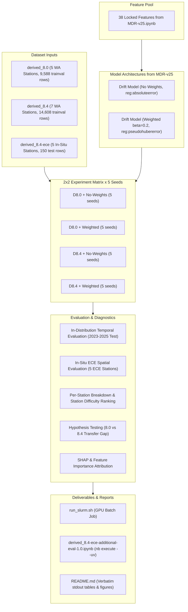

# Implementation Plan: `derived_8.4-ece-additional-eval-1.0`

## Goal Description

Investigate whether the performance degradation observed on the in-situ ECE sensor dataset (`derived_8.4-ece`) in recent experiments (`derived_8.4-regime-interpretation-1.2-ece` and `derived_8.4-formal-eval-2.0-ece`) is attributable to `derived_8.4` models overfitting to the 7 Washington reference stations, sacrificing transferability / generalizability compared to models trained on the earlier 5-station `derived_8.0` dataset.

We will create the experiment `derived_8.4-ece-additional-eval-1.0` in `notebooks/experiment/derived_8.4-ece-additional-eval-1.0/`, implementing a rigorous, 5-seed evaluation using the two exact baseline model architectures and 38 features from `MDR-v25.ipynb`:
1. **`derived_8.0` Training Setup (5 Stations)**: Train on `derived_8.0` `trainval` (Darrington, Quinault, SourdoughGulch, Spokane, Touchet; 9,588 rows) with the 38 features, then evaluate on `derived_8.4-ece` (150 rows, 5 unseen micro-climate stations in Bellevue and Renton, WA).
2. **`derived_8.4` Training Setup (7 Stations)**: Train on `derived_8.4` `trainval` (BeaverPass, CayusePass, Darrington, Paradise, Quinault, SourdoughGulch, Spokane; 14,608 rows) with the 38 features, then evaluate on `derived_8.4-ece`.
3. **Model Variants from `MDR-v25.ipynb`**:
   - **`no_weights`**: XGBoost regressor with `objective="reg:absoluteerror"`, `learning_rate=0.04`, `n_estimators=5500`, `max_depth=8`, `subsample=0.9`, `colsample_bytree=0.8`, `min_child_weight=2`, `reg_lambda=1.5`, `reg_alpha=0.03`, `gamma=0.0`.
   - **`weighted`**: XGBoost regressor with `objective="reg:pseudohubererror"`, exponential year sample weighting ($\beta=0.2$, $w(t) = \frac{\exp(\beta \cdot (year - \max(year)))}{\text{mean}(\dots)}$), and matching hyperparameters.
4. **Consistency across 5 Random Seeds**: Seeds `[42, 7, 13, 101, 123]`.
5. **GPU Batch Job Execution**: Scheduled via SLURM (`run_slurm.sh`) on GPU partition with appropriate time limit and logging.
6. **Detailed Reports & Reproducibility**: Auto-generated figures, per-station metrics matrix, hypothesis test statistics, fully reproducible Jupyter notebook (`derived_8.4-ece-additional-eval-1.0.ipynb`), and README.md populated strictly from the executed notebook stdout.

---

## User Review Required

> [!IMPORTANT]
> **Key Design Decisions**:
> 1. **Model Scope**: Both `MDR-v25` model variants (`no_weights` and `weighted`) will be trained for both dataset setups (`derived_8.0` and `derived_8.4`), producing 4 distinct configurations across 5 seeds (20 model fits total).
> 2. **Evaluation Dual Scope**: Models will be evaluated on the target **in-situ ECE spatial test set** (`derived_8.4-ece`) as the primary evaluation, and on their respective **in-distribution temporal test sets** (`derived_8.0` test / `derived_8.4` test) to compute the exact **spatial transfer degradation gap** ($\Delta R^2 = R^2_{\text{ece}} - R^2_{\text{temporal}}$).
> 3. **Batch Job Execution**: The SLURM job will request GPU resources (`--partition=gpu_debug`, `--time=00:45:00`, `--gres=gpu:1`, `--cpus-per-task=8`, `--mem=32G`).

---

## Proposed Architecture & Workflow



---

## Proposed Changes

### `notebooks/experiment/derived_8.4-ece-additional-eval-1.0/`

#### [NEW] `config.yaml`
Experiment configuration defining:
- Dataset paths (`derived_8.0`, `derived_8.4`, `derived_8.4-ece`).
- 38 locked feature names from `MDR-v25.ipynb`.
- Target column: `soil_moisture_5cm`.
- Model definitions (`MDR_v25_no_weights`, `MDR_v25_weighted`) with exact hyperparameters from `MDR-v25.ipynb`.
- Seeds: `[42, 7, 13, 101, 123]`.
- Paths for models, predictions, artifacts, and figures.

#### [NEW] `eval_engine.py`
Core evaluation module containing:
- Data loaders for `derived_8.0`, `derived_8.4`, and `derived_8.4-ece` splits.
- Sample weight computation function (exponential decay with $\beta=0.2$ on calendar year).
- Metric calculators: $R^2$, RMSE, MAE, Bias, ubRMSE, Pearson correlation $r$, median absolute error, 90th percentile error.
- Statistical testing suite: paired t-test, Wilcoxon signed-rank test, binomial sign test, bootstrap confidence intervals, and transfer gap calculations.

#### [NEW] `run_pipeline.py`
Execution pipeline:
- Iterates over the 4 configurations × 5 seeds (20 runs).
- Fits models using GPU acceleration (`tree_method="hist"`, `device="cuda"`, fallback to CPU if needed).
- Saves trained model JSONs and metadata to `models/`.
- Computes predictions on both in-distribution temporal test sets and the in-situ ECE dataset.
- Saves raw prediction arrays (`.npy`), per-seed summary tables (`.csv`), per-station metrics (`.csv`), and pairwise statistical tests (`.csv`).
- Computes feature importances and SHAP values on ECE observations.

#### [NEW] `plot_generator.py`
Figure generator creating publication-grade visualizations:
- `seed_boxplot_ece_r2.png` & `seed_boxplot_ece_rmse.png`: Performance dispersion across seeds on ECE test set.
- `temporal_vs_ece_transfer_gap.png`: Visualizing the in-distribution temporal vs out-of-distribution spatial transfer gap.
- `per_station_ece_comparison_r2.png`: Grouped bar chart of $R^2$ across the 5 ECE stations for the 4 model setups.
- `ece_timeseries_predictions_overlay.png`: Predicted vs true soil moisture time series for each ECE station (July 20 – August 19, 2026).
- `feature_importance_comparison.png`: Normalized feature importance comparison between `derived_8.0` and `derived_8.4` models.
- `shap_ece_summary.png`: SHAP beeswarm plot on the ECE dataset.

#### [NEW] `build_notebook.py`
Notebook constructor script that builds `derived_8.4-ece-additional-eval-1.0.ipynb`:
- Complies with `nbformat v4.5` specifications.
- Every markdown cell includes explanatory prose and clear headings.
- Self-contained execution order displaying all summary tables and figure embeddings directly in cell stdout/outputs.

#### [NEW] `update_readme.py`
Script to update `README.md` strictly from the executed notebook cell stdout, guaranteeing exact numerical consistency between the notebook and repository documentation.

#### [NEW] `run_slurm.sh`
SLURM batch submission script:
```bash
#!/bin/bash
#SBATCH --job-name=d84_ece_eval10
#SBATCH --output=artifacts/slurm/slurm-%j.out
#SBATCH --error=artifacts/slurm/slurm-%j.err
#SBATCH --time=00:45:00
#SBATCH --partition=gpu_debug
#SBATCH --gres=gpu:1
#SBATCH --cpus-per-task=8
#SBATCH --mem=32G
#SBATCH --nodes=1

set -euo pipefail

EXP_DIR="${SLURM_SUBMIT_DIR:-$(cd "$(dirname "${BASH_SOURCE[0]}")" && pwd)}"
cd "$EXP_DIR"
mkdir -p artifacts/slurm models predictions figures

echo "[slurm] job ${SLURM_JOB_ID:-?} start $(date) host $(hostname) exp_dir=$EXP_DIR"
nvidia-smi -L 2>/dev/null | head -2 || true

step() { echo; echo "===== $(date +%H:%M:%S)  $* ====="; "$@"; }

step uv run --no-sync python run_pipeline.py
step uv run --no-sync python plot_generator.py
step uv run --no-sync python build_notebook.py

echo "=== Executing report notebook ==="
cd ../..
nb execute experiment/derived_8.4-ece-additional-eval-1.0/derived_8.4-ece-additional-eval-1.0.ipynb --uv
cd experiment/derived_8.4-ece-additional-eval-1.0

step uv run --no-sync python update_readme.py

echo "[slurm] ALL DONE $(date) — job ${SLURM_JOB_ID:-?} exit 0"
```

---

## Detailed Evaluation Plan & Research Questions

The resulting analysis and report will directly address the following research questions:

1. **Station Overfitting Hypothesis**:
   - Does training on 5 stations (`derived_8.0`) generalize *better* to the 5 unseen ECE stations than training on 7 stations (`derived_8.4`), or does the addition of `BeaverPass` and `Paradise` further skew feature weights toward high-elevation montane dynamics?
2. **Temporal Weighting Impact on Transfer**:
   - Does recent-year exponential sample weighting ($\beta=0.2$) help or hurt generalization to novel in-situ deployment sensors?
3. **Station-Level Dissection**:
   - Which ECE stations show positive vs negative transfer across both models (e.g. `ECE_Renton_Garden_North` vs `ECE_Renton_Home` vs `ECE_BBG_Lost_Meadow`)?
4. **Feature Attribution & Domain Shift**:
   - What feature distribution shifts (e.g., in MODIS LST, SMAP, API, topography) drive large residuals on ECE stations?

---

## Verification Plan

### Automated Verification
1. Run pipeline smoke test locally:
   ```bash
   uv run --no-sync python run_pipeline.py --smoke
   ```
2. Submit full GPU batch job:
   ```bash
   cd notebooks/experiment/derived_8.4-ece-additional-eval-1.0 && sbatch run_slurm.sh
   ```
3. Verify notebook sequential execution:
   ```bash
   cd /scratch/user/u.rp352032/MDR-Project/notebooks
   nb execute experiment/derived_8.4-ece-additional-eval-1.0/derived_8.4-ece-additional-eval-1.0.ipynb --uv
   ```
4. Verify `README.md` matches stdout from notebook execution.

### Manual Verification
1. Inspect all generated figures in `figures/`.
2. Verify all CSV summary tables exist and are properly populated.
3. Review Slurm logs in `artifacts/slurm/` to confirm zero errors or warnings during training and evaluation.
