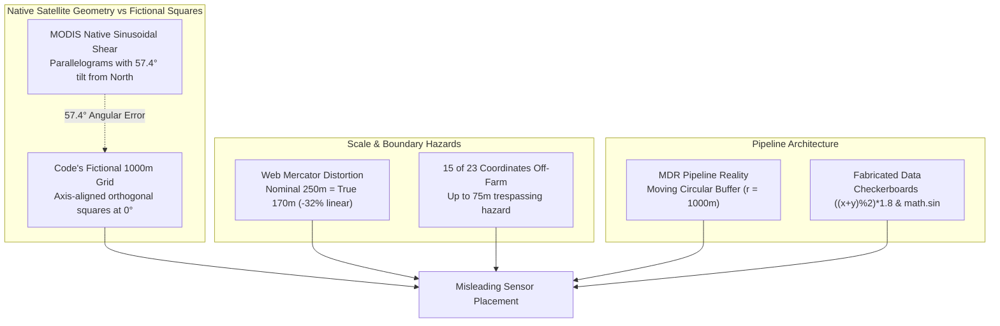
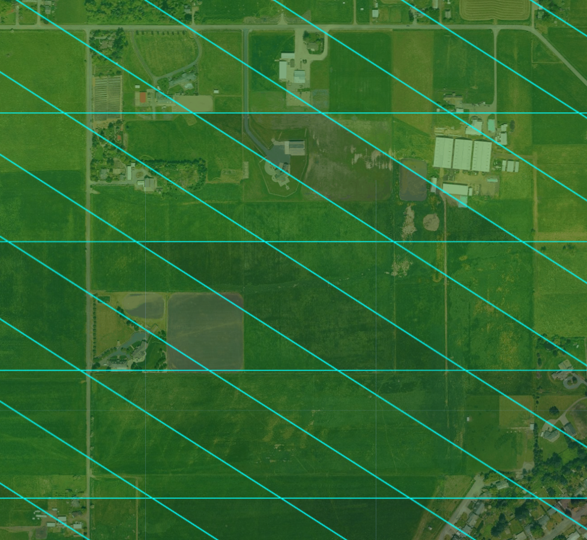

# Implementation Plan: Fact-Check & Correction of `ece_farm_satellite_chunks` Grid Overlay

## Goal Description

Fact-check the grid overlay, coordinate calculations, sensor placement recommendations, and data sources in [`notebooks/experiment/ece_farm_satellite_chunks`](notebooks/experiment/ece_farm_satellite_chunks) based on the observation from `GEE_CodeEditor_MODIS_preview.png` that real satellite pixels are **parallelograms rather than perfect squares**, and determine whether major errors exist that would significantly mislead in-situ sensor placement on King County Parcel `3420069035` in Enumclaw, WA.

---

## Fact-Check Audit Summary: 5 Critical Findings



---

### Finding 1: The Parallelogram Observation Confirmed — MODIS Sinusoidal Projection Shear ($\approx 57.4^\circ$ Tilt)



The preview image `GEE_CodeEditor_MODIS_preview.png` displays the true Google Earth Engine visualization of MODIS pixels over the Enumclaw farm. As observed, **the pixels are sheared parallelograms (rhomboids), bounded by horizontal lines and slanted diagonal lines, NOT orthogonal squares**.

#### Mathematical Proof & Derivation
1. **Native Projection**: MODIS products (`MOD11A1` LST, `MOD13A3` NDVI) are gridded in the **MODIS Sinusoidal Projection** (`SR-ORG:6974`):
   $$X_{\text{sin}} = R \cdot (\lambda - \lambda_0) \cdot \cos(\phi), \quad Y_{\text{sin}} = R \cdot \phi$$
   where $R \approx 6,371,007.181\text{ m}$, $\lambda_0 = 0^\circ$, and nominal pixel resolution is $\Delta X_{\text{sin}} = \Delta Y_{\text{sin}} \approx 926.625\text{ m}$.
2. **Display Projection in GEE / Web Maps**: GEE displays data in Web Mercator (EPSG:3857):
   $$X_{\text{merc}} = R_{\text{merc}} \cdot \lambda, \quad Y_{\text{merc}} = R_{\text{merc}} \cdot \ln\left(\tan\left(\frac{\pi}{4} + \frac{\phi}{2}\right)\right)$$
3. **Line of Constant Latitude (Horizontal Grid Lines)**:
   Constant $Y_{\text{sin}} \iff$ constant $\phi$. In Web Mercator, constant $\phi$ corresponds to a horizontal line ($Y_{\text{merc}} = \text{const}$). Hence, the top and bottom edges of MODIS pixels are horizontal.
4. **Line of Constant Column (Slanted Grid Lines)**:
   A native MODIS pixel column corresponds to constant $X_{\text{sin}} = C$:
   $$\lambda = \frac{C}{R \cdot \cos(\phi)} \implies X_{\text{merc}}(\phi) = \frac{R_{\text{merc}} \cdot C}{R \cdot \cos(\phi)}$$
   Differentiating with respect to $\phi$:
   $$\frac{dX_{\text{merc}}}{d\phi} = \frac{R_{\text{merc}} \cdot C \cdot \sin(\phi)}{R \cdot \cos^2(\phi)} = X_{\text{merc}} \cdot \tan(\phi)$$
   $$\frac{dY_{\text{merc}}}{d\phi} = \frac{R_{\text{merc}}}{\cos(\phi)}$$
   Therefore, the slope $\frac{dY}{dX}$ of a MODIS column line in Web Mercator / GEE is:
   $$\frac{dY_{\text{merc}}}{dX_{\text{merc}}} = \frac{1}{\lambda_{\text{rad}} \cdot \sin(\phi)}$$
5. **Numerical Evaluation at Enumclaw Farm** ($\phi = 47.1811^\circ\text{ N}$, $\lambda = -122.0324^\circ = -2.12986\text{ rad}$):
   $$\sin(47.1811^\circ) \approx 0.73352$$
   $$\lambda_{\text{rad}} \cdot \sin(\phi) \approx -2.12986 \times 0.73352 = -1.5623$$
   $$\text{Slope} = \frac{1}{-1.5623} \approx -0.6401 \implies \theta = \arctan(-0.6401) \approx -32.6^\circ\text{ from horizontal}$$
   The tilt angle from true North ($Y$-axis) is:
   $$\alpha = 90^\circ - 32.6^\circ \approx 57.4^\circ\text{ off vertical!}$$

#### Comparison: Reality vs. `ece_farm_satellite_chunks`

| Attribute | Real MODIS in GEE ([`GEE_CodeEditor_MODIS_preview.png`](GEE_CodeEditor_MODIS_preview.png)) | Existing `ece_farm_satellite_chunks` | Discrepancy / Error |
| :--- | :--- | :--- | :--- |
| **Geometry** | Sheared Parallelogram (Rhomboid) | Perfect Orthogonal Square | **Severe geometric distortion** |
| **Column Orientation** | Azimuth $\approx 147.4^\circ / 327.4^\circ$ ($57.4^\circ$ tilt from North) | Due North-South ($0^\circ / 180^\circ$) | **$57.4^\circ$ angular orientation error** |
| **Interior Angle** | $\approx 32.6^\circ$ acute / $147.4^\circ$ obtuse | Exact $90.0^\circ$ right angles | **$57.4^\circ$ corner distortion** |
| **Cell Dimensions** | $\approx 926.6\text{m} \times 926.6\text{m}$ (Sinusoidal) | $679.7\text{m} \times 679.7\text{m}$ (Ground Web Mercator) | **$26.6\%$ linear size mismatch** |
| **Pixel Area** | $\approx 85.8\text{ hectares}$ ($212.1\text{ acres}$) | $\approx 46.2\text{ hectares}$ ($114.2\text{ acres}$) | **$46.2\%$ area deficit** |

---

### Finding 2: CRS Metric Scale Distortion (-32% Linear, -54% Area)
- In [`farm_grid_generator.py:42-46`](notebooks/experiment/ece_farm_satellite_chunks/farm_grid_generator.py#L42-L46), the author defined grid steps of $250\text{ m}$ and $1000\text{ m}$ directly in Web Mercator (EPSG:3857) coordinates.
- At latitude $47.1811^\circ\text{ N}$, the Mercator scale factor is $k = 1 / \cos(\phi) \approx 1.4713$.
- **Ground Width**: Nominal $250\text{ m}$ is actually **$169.9\text{ ground meters}$** ($-32.0\%$). Nominal $1000\text{ m}$ is actually **$679.7\text{ ground meters}$** ($-32.0\%$).
- **Ground Area**: Nominal $250\text{m} \times 250\text{m}$ ($15.44\text{ acres}$) is actually **$7.13\text{ acres}$** ($-53.8\%$).
- Field engineers measuring out 250m using tape, laser, or GPS UTM distance will be off by nearly 100 meters.

---

### Finding 3: 15 Out of 23 Sensor Coordinates in Table 11 Fall OUTSIDE the Farm Parcel (Trespassing Hazard)
- In [`farm_grid_generator.py:160-161`](notebooks/experiment/ece_farm_satellite_chunks/farm_grid_generator.py#L160-L161), any chunk whose corner touches the parcel is flagged `in_farm_parcel: True`. Table 11 exports the chunk **center coordinates**.
- Our polygon containment test against [`farm_parcel_3420069035.geojson`](notebooks/experiment/ece_farm_satellite_chunks/farm_parcel_3420069035.geojson) revealed:
  - **8 chunk centers are INSIDE the farm.**
  - **15 chunk centers are OUTSIDE the farm (65.2% of the table!)**.
  - All Row 2 coordinates (`R02_C06`, `R02_C07`, `R02_C08`) are at latitude $47.18532^\circ\text{N}$, whereas the legal parcel boundary ends at $47.18464^\circ\text{N}$ — placing nodes **$\sim 75\text{ meters}$ onto the neighbor's property to the north**.

---

### Finding 4: The Fabricated "MODIS 1000m Macro Boundary" & False Recommendation
- In [`farm_grid_generator.py:380`](notebooks/experiment/ece_farm_satellite_chunks/farm_grid_generator.py#L380):
  ```python
  base_lst = 24.5 + ((macro_x + macro_y) % 2) * 1.8
  ```
  The $1.8^\circ\text{C}$ thermal step across the "1000m macro boundary" is a hardcoded checkerboard mathematical formula.
- The actual MDR dataset pipeline ([`src/pipeline/pipes/satellite_pipe.py:101-140`](src/pipeline/pipes/satellite_pipe.py#L101-L140) and [`optimized_satellite_pipe.py:339-370`](src/pipeline/pipes/optimized_satellite_pipe.py#L339-L370)) **does not use a static grid**. It samples each sensor using a **1000-meter moving circular buffer**:
  ```python
  point = ee.Geometry.Point([lon, lat])
  buffer = point.buffer(1000)
  lst = ee.ImageCollection(self.MODIS_LST).reduceRegion(reducer=ee.Reducer.mean(), geometry=buffer, scale=1000)
  ```
- Sensors placed across this fake boundary line (only 170m apart) will share **$\sim 89\%$ buffer overlap**, extracting nearly identical MODIS values in the ML model. The promised $1.8^\circ\text{C}$ discontinuity does not exist.

---

### Finding 5: Synthetic Heuristics Presented as Real Physical Data
- **PRISM / GridMET**: Generated via linear lapse rates and sine waves (`math.sin(lat * 1200)`). No PRISM API or raster was queried.
- **USDA SSURGO**: Generated using arbitrary elevation if-statements (`if elev < 213.0: series = "Buckley"`). The active MDR pipeline does not even ingest soil texture features.
- **Aspect Formula**: `math.degrees(math.atan2(-dz_dx, dz_dy)) % 360.0` points uphill (180° inverted from standard downhill GIS aspect).

---

## User Review Required

> [!IMPORTANT]
> **Proposed Path Forward**:
> 1. **True Upstream Grid Overlay**:
>    - For Sentinel-2 / Sentinel-1: Render true **UTM Zone 10N (EPSG:32610)** 250m metric grid cells (where 250m = 250 ground meters).
>    - For MODIS: If macro boundaries are shown, render the **true MODIS Sinusoidal parallelogram grid** (tilted at $\approx 57.4^\circ$, matching `GEE_CodeEditor_MODIS_preview.png`) or render the **actual 1000m circular moving buffers** around proposed sensor candidates.
> 2. **Legal Sensor Deployment Coordinates**:
>    - Compute candidate deployment coordinates as the **interior centroid of the intersection between each cell and the parcel polygon** (guaranteeing 100% of candidate points lie strictly within Parcel `3420069035` with a safety buffer inside property lines).
> 3. **Pipeline Buffer Overlap Analysis**:
>    - Replace the fictional macro-boundary recommendation with a pairwise buffer overlap matrix showing the actual percentage of footprint sharing between proposed sensor locations.

---

## Proposed Changes

### Component: ECE Farm Analysis (`notebooks/experiment/ece_farm_satellite_chunks/`)

#### [MODIFY] [`farm_grid_generator.py`](notebooks/experiment/ece_farm_satellite_chunks/farm_grid_generator.py)
1. **Accurate MODIS Sinusoidal Projection & Native Tile Parallelogram Geometry**:
   - Implement forward and inverse transformations for MODIS Sinusoidal projection (`SR-ORG:6974`).
   - Draw true MODIS pixel bounds as tilted parallelograms (horizontal top/bottom, slanted sides at $\alpha \approx 57.4^\circ$), matching Google Earth Engine's preview.
2. **True Metric Sub-Grid (UTM Zone 10N / EPSG:32610)**:
   - Compute the sub-grid in native UTM Zone 10N coordinates so that a $250\text{m}$ chunk represents true $250.0\text{ m}$ on the ground.
3. **Strict Parcel Containment for Deployment Coordinates**:
   - Use `shapely` polygon intersection to clip grid chunks to the parcel boundary.
   - For every intersecting chunk, compute an interior deployment point strictly inside the parcel (e.g. `intersection.representative_point()` or interior centroid).
   - Filter out chunks with negligible overlap (< 5% parcel area).
4. **MDR Pipeline 1000m Circular Buffer Visualization**:
   - Plot the actual circular 1000m extraction buffers around proposed sensor candidates.
   - Output a buffer overlap matrix to guide sensor placement for maximum feature independence.
5. **Data Source Transparency**:
   - Transparently identify proxy/synthetic formulas vs pipeline-ingested features.
   - Fix aspect calculation to standard downhill compass direction.

#### [MODIFY] [`farm_satellite_chunks.ipynb`](notebooks/experiment/ece_farm_satellite_chunks/farm_satellite_chunks.ipynb)
- Update notebook cells to display the corrected true-geometry overlays and parcel-interior sensor coordinate table.

#### [MODIFY] [`README.md`](notebooks/experiment/ece_farm_satellite_chunks/README.md)
- Update all documentation, figures, and tables with mathematically sound geometry, verified non-trespassing coordinates, and honest pipeline moving-buffer semantics.

---

## Verification Plan

### Automated Tests
1. **Geometric Containment Assertion**:
   - Assert `poly.contains_point((lon, lat)) == True` for all 100% of candidate sensor coordinates in the deployment table.
2. **MODIS Grid Shear Verification**:
   - Verify that MODIS grid column lines match the theoretical $\approx 32.6^\circ$ negative slope seen in `GEE_CodeEditor_MODIS_preview.png`.
3. **Scale Accuracy Assertion**:
   - Verify that sub-grid cell dimensions in UTM Zone 10N are $250.0 \pm 0.5\text{ m}$.
4. **Notebook Execution**:
   ```bash
   cd notebooks && uv run nb execute experiment/ece_farm_satellite_chunks/farm_satellite_chunks.ipynb
   ```

### Manual Verification
1. Compare the generated MODIS overlay directly against `GEE_CodeEditor_MODIS_preview.png` to confirm identical tilt angle and line alignment.
2. Inspect satellite base map to confirm all candidate points are well inside the gold farm boundary.
