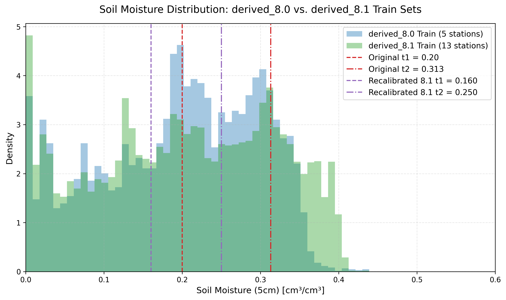
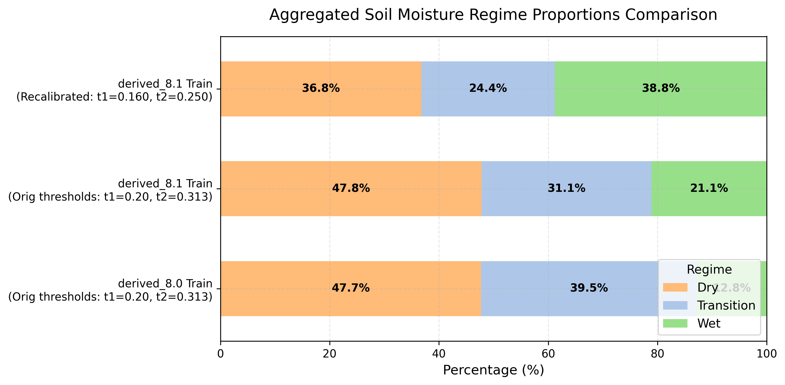
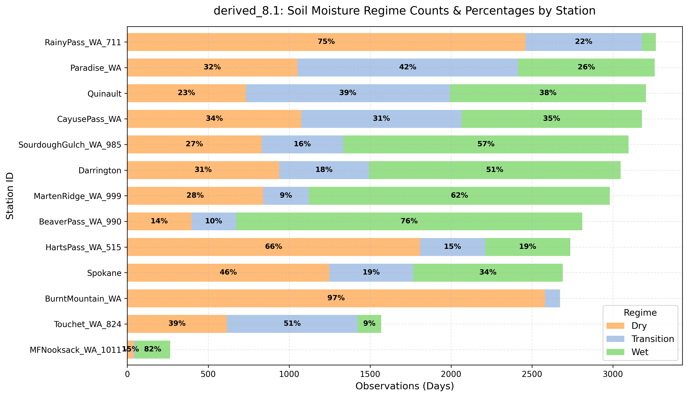
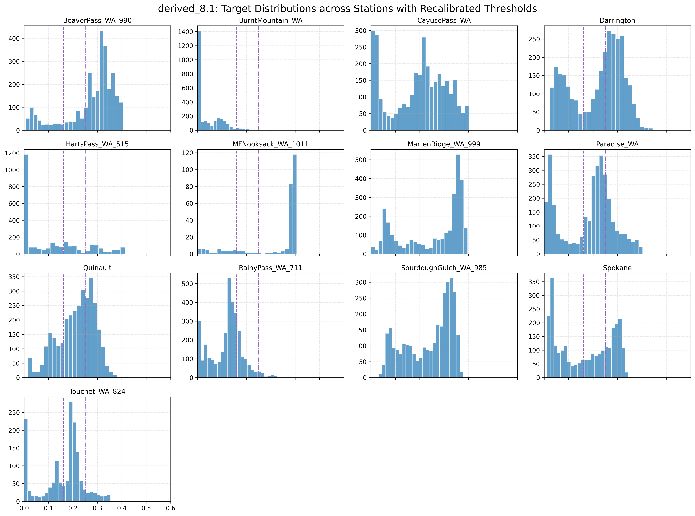

# derived_8.1 Soil Moisture Dataset Exploratory Data Analysis Report

This directory contains the exploratory data analysis (EDA) conducted on the `derived_8.1` soil moisture dataset, comparing it against the `derived_8.0` baseline. 

The primary objective is to evaluate:
1. **Dataset Quality**: Whether the new dataset provides a larger, more representative sample size across the target space.
2. **Regime Distribution**: How samples are distributed across **Dry**, **Transition**, and **Wet** moisture regimes.
3. **Threshold Validity**: Whether the original thresholds hold or require recalibration.

---

## Files in this Directory

* **Analysis Script**: [analyze_regimes.py](./analyze_regimes.py) - Python script to load the data splits, compute quantiles, process regime distributions, and save the figures.
* **Density Comparison Plot**: [soil_moisture_density_comparison.png](./soil_moisture_density_comparison.png)
* **Aggregated Regimes Plot**: [aggregated_regime_comparison.png](./aggregated_regime_comparison.png)
* **Regimes by Station Plot**: [regime_distribution_by_station.png](./regime_distribution_by_station.png)
* **Histograms by Station Grid**: [soil_moisture_by_station_grid.png](./soil_moisture_by_station_grid.png)

---

## 1. Dataset Scale and Station Coverage

`derived_8.1` expands the spatial coverage of the Washington-only subset by adding **8 new SNOTEL stations** to the **5 original stations**, raising the total station count from 5 to 13.

* **derived_8.0 Stations (5)**: Spokane, Darrington, Quinault, Touchet_WA_824, SourdoughGulch_WA_985
* **derived_8.1 Stations (13)**: Original 5 + BeaverPass_WA_990, BurntMountain_WA, CayusePass_WA, HartsPass_WA_515, MFNooksack_WA_1011, MartenRidge_WA_999, Paradise_WA, RainyPass_WA_711

This yields a **2.5x increase** in total observations:

| Metric | derived_8.0 | derived_8.1 | Change |
|---|---|---|---|
| **Stations** | 5 | 13 | +8 stations |
| **Total Rows** | 13,604 | 34,775 | +21,171 rows (+155.6%) |
| **Train Split** | 6,868 | 16,462 | +9,594 rows |
| **Val Split** | 2,720 | 7,714 | +4,994 rows |
| **Test Split** | 4,016 | 10,599 | +6,583 rows |

---

## 2. Soil Moisture Target Distribution & Quantiles

Analyzing the percentiles of `soil_moisture_5cm` in the training splits reveals a shift in the overall distribution:

| Percentile | derived_8.0 (Train) | derived_8.1 (Train) | Difference |
|---|---|---|---|
| **0% (Min)** | 0.0000 | 0.0000 | 0.0000 |
| **10%** | 0.0390 | 0.0320 | -0.0070 |
| **25%** | 0.1210 | 0.1160 | -0.0050 |
| **33%** | 0.1570 | 0.1430 | -0.0140 |
| **50% (Median)** | 0.2060 | 0.2075 | +0.0015 |
| **66%** | 0.2530 | 0.2690 | +0.0160 |
| **75%** | 0.2800 | 0.3020 | +0.0220 |
| **90%** | 0.3203 | 0.3530 | +0.0327 |
| **100% (Max)** | 0.4390 | 0.4390 | 0.0000 |

### Density Distribution comparison
The plot below displays the density distribution of `soil_moisture_5cm` for the training sets of both versions, showing the locations of the original and valleys-based boundaries:

*The new dataset has a wider, flatter profile in the middle-to-high moisture range (0.20 to 0.38), indicating a richer sample set for intermediate and wet regimes.*

---

## 3. Aggregated Regime Proportions Comparison

Below is the aggregated distribution of Dry, Transition, and Wet regimes across both datasets, comparing:
1. `derived_8.0` Train set (with original thresholds: $t_1 = 0.20, t_2 = 0.313$)
2. `derived_8.1` Train set (with original thresholds: $t_1 = 0.20, t_2 = 0.313$)
3. `derived_8.1` Train set (with recalibrated valleys-based thresholds: $t_1 = 0.160, t_2 = 0.250$)

*This highlights how the inclusion of new Washington SNOTEL stations increases the proportion of wet observations under the original thresholds (from 12.8% to 21.1%), and how using valleys-based thresholds ($t_1 = 0.160, t_2 = 0.250$) splits the data into physically distinct regimes corresponding to modes of the target distribution.*

---

## 4. Regime Threshold Validation

In the three-regime modeling framework, samples are routed into **Dry**, **Transition**, and **Wet** classes. We evaluated two threshold options on the training sets:

### Option A: Original 8.0 Thresholds ($t_1 = 0.20, t_2 = 0.313$)
These boundaries were calibrated on `derived_8.0` and result in severe class imbalance:
* **derived_8.0 Train**: Dry: 47.7%, Transition: 39.5%, **Wet: 12.8%**
* **derived_8.1 Train**: Dry: 47.8%, Transition: 31.1%, **Wet: 21.1%**

While the new SNOTEL stations double the proportion of Wet samples under the original thresholds (from 12.8% to 21.1%), the overall distribution remains heavily skewed toward Dry and Transition.

### Option B: Recalibrated Valleys-Based Thresholds ($t_1 = 0.160, t_2 = 0.250$)
Instead of dividing the dataset into three arbitrary folds or using the outdated `derived_8.0` thresholds, we recalibrate the boundaries based on the natural valleys (density minima) of the `derived_8.1` training distribution:
* **Dry**: $y < 0.160$ (mode centered around Peak 1 at `0.135`, extending up to the first valley at `0.160`. Values to the right of each peak belong to the same regime.)
* **Transition**: $0.160 \le y < 0.250$ (mode centered around Peak 2 at `0.200`, extending up to the second valley at `0.250`)
* **Wet**: $y \ge 0.250$ (mode centered around Peak 3 at `0.310`, extending to the upper tail)

This valleys-based partitioning ensures that each specialist model's training set is aligned with the natural physical boundaries of soil moisture modes:

| Split | Dry | Transition | Wet | Total Rows |
|---|---|---|---|---|
| **Train** | 6,053 (36.8%) | 4,014 (24.4%) | 6,395 (38.8%) | 16,462 |
| **Val** | 3,504 (45.4%) | 1,293 (16.8%) | 2,917 (37.8%) | 7,714 |
| **Test** | 5,054 (47.7%) | 2,471 (23.3%) | 3,074 (29.0%) | 10,599 |

*Note: The original thresholds ($t_1 = 0.20, t_2 = 0.313$) are misaligned with the new dataset structure. Recalibrating to the bimodal/multimodal valleys ($t_1 = 0.160$ and $t_2 = 0.250$) provides a physically motivated partition where values to the right of each peak belong to the same regime, maintaining highly distinct training conditions for the specialists.*

---

## 5. Station-by-Station Regime Distributions

The regime counts and percentages vary significantly across the 13 Washington stations due to localized environmental conditions:

### Station-Level Metrics (under Recalibrated Thresholds)
Below is the tabular summary of observations, average soil moisture, and regime counts per station:

| Station | Total Obs | Mean SM | Min SM | Max SM | Dry % (Count) | Trans % (Count) | Wet % (Count) |
|:---|:---:|:---:|:---:|:---:|:---:|:---:|:---:|
| **BeaverPass_WA_990** | 2,811 | 0.2773 | 0.0070 | 0.4040 | 14.1% (396) | 9.8% (276) | **76.1% (2139)** |
| **BurntMountain_WA** | 2,673 | 0.0406 | 0.0000 | 0.3280 | **96.5% (2580)** | 3.4% (92) | 0.0% (1) |
| **CayusePass_WA** | 3,179 | 0.1926 | 0.0000 | 0.4010 | 33.8% (1075) | 31.1% (989) | 35.1% (1115) |
| **Darrington** | 3,047 | 0.2192 | 0.0220 | 0.4440 | 30.8% (938) | 18.2% (554) | 51.0% (1555) |
| **HartsPass_WA_515** | 2,737 | 0.1123 | 0.0000 | 0.4480 | 66.1% (1809) | 14.7% (401) | 19.3% (527) |
| **MFNooksack_WA_1011** | 265 | 0.3341 | 0.0000 | 0.4060 | 14.7% (39) | 3.8% (10) | **81.5% (216)** |
| **MartenRidge_WA_999** | 2,981 | 0.2544 | 0.0000 | 0.3960 | 28.1% (839) | 9.5% (283) | **62.4% (1859)** |
| **Paradise_WA** | 3,258 | 0.1827 | 0.0000 | 0.4030 | 32.3% (1051) | 41.8% (1363) | 25.9% (844) |
| **Quinault** | 3,204 | 0.2146 | 0.0160 | 0.4310 | 22.8% (732) | 39.4% (1261) | 37.8% (1211) |
| **RainyPass_WA_711** | 3,265 | 0.1206 | 0.0000 | 0.3410 | 75.3% (2459) | 22.1% (720) | 2.6% (86) |
| **SourdoughGulch_WA_985** | 3,097 | 0.2390 | 0.0320 | 0.3780 | 26.8% (830) | 16.3% (504) | **56.9% (1763)** |
| **Spokane** | 2,690 | 0.1683 | 0.0110 | 0.3590 | 46.4% (1248) | 19.3% (518) | 34.3% (924) |
| **Touchet_WA_824** | 1,568 | 0.1590 | 0.0000 | 0.3540 | 39.2% (615) | 51.5% (807) | 9.3% (146) |

### Individual Target Histograms per Station
The small multiples grid below shows the soil moisture density distributions for each station, overlaid with the new valleys-based regime boundaries ($t_1$ and $t_2$):

### Key Insights from Station-Level Analysis:
1. **High Heterogeneity**: Stations have very different soil moisture ranges. **BurntMountain** is extremely dry (mean = 0.0406, 96.5% of days in Dry), whereas **MFNooksack** (mean = 0.3341, 81.5% Wet) and **BeaverPass** (mean = 0.2773, 76.1% Wet) are highly wet. 
2. **Data Sparsity**: **MFNooksack** has only **265 observations** total due to missing target sensor data. It should be treated as a sparse target station during model training.
3. **Balanced Stations**: **Spokane**, **Darrington**, and **CayusePass** span a wide range of values and display bimodal or spread distributions across all three regimes.

---

## 6. Conclusions & Next Steps

### 1. Dataset Quality Verdict: **EXCELLENT**
* The `derived_8.1` dataset provides a **2.5x larger sample set** (34,775 rows).
* Under valleys-based thresholds, the **Wet regime has 6,395 training samples** (compared to 879 in `derived_8.0`). This solves the minority class undersupply issue highlighted in the handoff notes, providing a robust base to train a high-quality **Wet Specialist** expert model.

### 2. Threshold Verdict: **RECALIBRATE**
* Do **not** use the original thresholds ($t_1=0.20, t_2=0.313$), as they result in a heavily dry-skewed model.
* Adopt the **valleys-based thresholds ($t_1=0.160, t_2=0.250$)** to align with the empirical distribution modes.

### 3. Recommendations for MoE Modeling
* **Gating Design**: Because individual stations are highly skewed (e.g. BurntMountain is 96.5% Dry), station-level static features (latitude, longitude, elevation, HWSD clay/sand fractions) will be critical for the router to identify spatial regime shifts.
* **Evaluation**: The test split in `derived_8.1` is also larger (10,599 rows), allowing for a much cleaner out-of-sample evaluation of MoE routing strategies (e.g. comparing 3-class vs. 2-class gating as discussed in the handoff notes).
