# derived_8.1_pos Soil Moisture Dataset Exploratory Data Analysis Report

This directory contains the exploratory data analysis (EDA) conducted on the `derived_8.1_pos` soil moisture dataset, comparing it against the `derived_8.0` baseline. 

`derived_8.1_pos` is derived from `derived_8.1` by filtering out soil moisture values <= 0.0.

The primary objective is to evaluate:
1. **Dataset Quality**: Whether the new dataset provides a larger, more representative sample size across the target space.
2. **Regime Distribution**: How samples are distributed across **Dry**, **Transition**, and **Wet** moisture regimes.
3. **Threshold Validity**: Whether the original thresholds hold or require recalibration.

---

## Files in this Directory

* **Analysis Script**: [analyze_regimes.py](./analyze_regimes.py) - Python script to load the data splits, compute quantiles, process regime distributions, and save the figures.
* **Calibration Script**: [calibrate_valleys.py](./calibrate_valleys.py) - Programmatic threshold valley-calibration verification script using KDE and peak/valley detection.
* **Density Comparison Plot**: [soil_moisture_density_comparison.png](./soil_moisture_density_comparison.png)
* **Calibration Plot**: [programmatic_valleys_calibration.png](./programmatic_valleys_calibration.png) - Plot showing identified density modes and valleys.
* **Aggregated Regimes Plot (3-Regime)**: [aggregated_regime_comparison.png](./aggregated_regime_comparison.png)
* **Regimes by Station Plot (3-Regime)**: [regime_distribution_by_station.png](./regime_distribution_by_station.png)
* **Histograms by Station Grid**: [soil_moisture_by_station_grid.png](./soil_moisture_by_station_grid.png)
* **Histograms by Month Grid**: [soil_moisture_by_month_grid.png](./soil_moisture_by_month_grid.png)
* **Aggregated Regimes Plot (2-Regime)**: [aggregated_regime_comparison_2r.png](./aggregated_regime_comparison_2r.png)
* **Regimes by Station Plot (2-Regime)**: [regime_distribution_by_station_2r.png](./regime_distribution_by_station_2r.png)
* **Monthly Regime Proportions (2-Regime)**: [monthly_regime_distribution_2r.png](./monthly_regime_distribution_2r.png)
* **Separability Scatter Plots (2-Regime)**: [separability_scatter_plots_2r.png](./separability_scatter_plots_2r.png)
* **Gating Confusion Matrices (2-Regime)**: [gating_confusion_matrices_2r.png](./gating_confusion_matrices_2r.png)
* **Decision Tree Gating Structure (2-Regime)**: [decision_tree_gating_structure_2r.png](./decision_tree_gating_structure_2r.png)

---

## 1. Dataset Scale and Station Coverage

`derived_8.1_pos` expands the spatial coverage of the Washington-only subset by adding **8 new SNOTEL stations** to the **5 original stations**, raising the total station count from 5 to 13.

* **derived_8.0 Stations (5)**: Spokane, Darrington, Quinault, Touchet_WA_824, SourdoughGulch_WA_985
* **derived_8.1_pos Stations (13)**: Original 5 + BeaverPass_WA_990, BurntMountain_WA, CayusePass_WA, HartsPass_WA_515, MFNooksack_WA_1011, MartenRidge_WA_999, Paradise_WA, RainyPass_WA_711

This yields a **2.35x increase** in total observations:

| Metric | derived_8.0 | derived_8.1_pos | Change |
|---|---|---|---|
| **Stations** | 5 | 13 | +8 stations |
| **Total Rows** | 13,604 | 32,015 | +18,411 rows (+135.3%) |
| **Train Split** | 6,868 | 15,964 | +9,096 rows |
| **Val Split** | 2,720 | 7,149 | +4,429 rows |
| **Test Split** | 4,016 | 8,902 | +4,886 rows |

---

## 2. Soil Moisture Target Distribution & Quantiles

Analyzing the percentiles of `soil_moisture_5cm` in the training splits reveals a shift in the overall distribution:

| Percentile | derived_8.0 (Train) | derived_8.1_pos (Train) | Difference |
|---|---|---|---|
| **0% (Min)** | 0.0000 | 0.0010 | +0.0010 |
| **10%** | 0.0390 | 0.0470 | +0.0080 |
| **25%** | 0.1210 | 0.1250 | +0.0040 |
| **33%** | 0.1570 | 0.1520 | -0.0050 |
| **50% (Median)** | 0.2060 | 0.2130 | +0.0070 |
| **66%** | 0.2530 | 0.2730 | +0.0200 |
| **75%** | 0.2800 | 0.3040 | +0.0240 |
| **90%** | 0.3203 | 0.3540 | +0.0337 |
| **100% (Max)** | 0.4390 | 0.4390 | 0.0000 |

### Density Distribution comparison
The plot below displays the density distribution of `soil_moisture_5cm` for the training sets of both versions, showing the locations of the original and valleys-based boundaries:

*The new dataset has a wider, flatter profile in the middle-to-high moisture range (0.20 to 0.38), indicating a richer sample set for intermediate and wet regimes.*

---

## 3. Aggregated Regime Proportions Comparison

Below is the aggregated distribution of Dry, Transition, and Wet regimes across datasets, comparing:
1. `derived_8.0` Train set (with original thresholds: $t_1 = 0.20, t_2 = 0.313$)
2. `derived_8.1` Train set (with original thresholds: $t_1 = 0.20, t_2 = 0.313$)
3. `derived_8.1` Train set (with recalibrated valleys-based thresholds: $t_1 = 0.160, t_2 = 0.250$)
4. `derived_8.1_pos` Train set (with original thresholds: $t_1 = 0.20, t_2 = 0.313$)
5. `derived_8.1_pos` Train set (with recalibrated valleys-based thresholds: $t_1 = 0.159, t_2 = 0.248$)

*This highlights how the inclusion of new Washington SNOTEL stations increases the proportion of wet observations under the original thresholds (from 12.8% in `derived_8.0` to 21.1% in `derived_8.1` and 21.8% in `derived_8.1_pos`), and how using valleys-based thresholds splits the data into physically distinct regimes corresponding to modes of the target distribution.*

---

## 4. Regime Threshold Validation

In the three-regime modeling framework, samples are routed into **Dry**, **Transition**, and **Wet** classes. We evaluated threshold options on the training sets:

### Option A: Original 8.0 Thresholds ($t_1 = 0.20, t_2 = 0.313$)
These boundaries were calibrated on `derived_8.0` and result in severe class imbalance:
* **derived_8.0 Train**: Dry: 47.7%, Transition: 39.5%, **Wet: 12.8%**
* **derived_8.1 Train**: Dry: 47.8%, Transition: 31.1%, **Wet: 21.1%**
* **derived_8.1_pos Train**: Dry: 46.2%, Transition: 32.1%, **Wet: 21.8%**

While the new SNOTEL stations double the proportion of Wet samples under the original thresholds (from 12.8% to 21.1%/21.8%), the overall distribution remains heavily skewed toward Dry and Transition.

### Option B: Recalibrated Valleys-Based Thresholds ($t_1 = 0.159, t_2 = 0.248$ for `derived_8.1_pos`)
Instead of dividing the dataset into three arbitrary folds or using the outdated `derived_8.0` thresholds, we recalibrate the boundaries based on the natural valleys (density minima) of the training distribution:
* **derived_8.1 Train (valleys: $t_1 = 0.160, t_2 = 0.250$)**: Dry: 36.8%, Transition: 24.4%, Wet: 38.8%
* **derived_8.1_pos Train (valleys: $t_1 = 0.159, t_2 = 0.248$)**: Dry: 34.5%, Transition: 24.9%, Wet: 40.6%

Our peak detection for `derived_8.1_pos` identifies modes at `0.030`, `0.135`, `0.201`, and `0.310`, with density minima (valleys) at `0.063`, `0.159`, and `0.248`. We ignore the valley at `0.063` as it separates two sub-modes within the dry range (likely caused by the removal of <= 0.0 values exposing a small positive peak at `0.030`). We adopt the primary physical valleys at `0.159` and `0.248` to define the boundaries:
* **Dry**: $y < 0.159$
* **Transition**: $0.159 \le y < 0.248$
* **Wet**: $y \ge 0.248$

This valleys-based partitioning ensures that each specialist model's training set is aligned with the natural physical boundaries of soil moisture modes:

| Split | Dry | Transition | Wet | Total Rows |
|---|---|---|---|---|
| **Train** | 5,514 (34.5%) | 3,971 (24.9%) | 6,479 (40.6%) | 15,964 |
| **Val** | 2,918 (40.8%) | 1,293 (18.1%) | 2,938 (41.1%) | 7,149 |
| **Test** | 3,333 (37.4%) | 2,441 (27.4%) | 3,128 (35.1%) | 8,902 |

*Note: The original thresholds ($t_1 = 0.20, t_2 = 0.313$) are misaligned with the new dataset structure. Recalibrating to the bimodal/multimodal valleys ($t_1 = 0.159$ and $t_2 = 0.248$) provides a physically motivated partition where values to the right of each peak belong to the same regime, maintaining highly distinct training conditions for the specialists.*

---

## 5. Station-by-Station Regime Distributions

The regime counts and percentages vary significantly across the 13 Washington stations due to localized environmental conditions:

### Station-Level Metrics (under Recalibrated Thresholds)
Below is the tabular summary of observations, average soil moisture, and regime counts per station:

| Station | Total Obs | Mean SM | Min SM | Max SM | Dry % (Count) | Trans % (Count) | Wet % (Count) |
|:---|:---:|:---:|:---:|:---:|:---:|:---:|:---:|
| **BeaverPass_WA_990** | 2,811 | 0.2773 | 0.0070 | 0.4040 | 14.1% (395) | 9.6% (271) | **76.3% (2145)** |
| **BurntMountain_WA** | 1,483 | 0.0733 | 0.0010 | 0.3280 | **93.5% (1387)** | 6.4% (95) | 0.1% (1) |
| **CayusePass_WA** | 3,123 | 0.1960 | 0.0010 | 0.4010 | 32.3% (1008) | 31.4% (982) | 36.3% (1133) |
| **Darrington** | 3,047 | 0.2192 | 0.0220 | 0.4440 | 30.7% (934) | 17.5% (532) | **51.9% (1581)** |
| **HartsPass_WA_515** | 1,600 | 0.1921 | 0.0010 | 0.4480 | 41.4% (663) | 25.6% (409) | 33.0% (528) |
| **MFNooksack_WA_1011** | 260 | 0.3405 | 0.0160 | 0.4060 | 13.1% (34) | 3.8% (10) | **83.1% (216)** |
| **MartenRidge_WA_999** | 2,957 | 0.2565 | 0.0110 | 0.3960 | 27.3% (808) | 9.6% (285) | **63.0% (1864)** |
| **Paradise_WA** | 3,256 | 0.1828 | 0.0020 | 0.4030 | 32.0% (1041) | 41.0% (1335) | 27.0% (880) |
| **Quinault** | 3,204 | 0.2146 | 0.0160 | 0.4310 | 22.7% (727) | 38.5% (1234) | 38.8% (1243) |
| **RainyPass_WA_711** | 3,108 | 0.1267 | 0.0010 | 0.3410 | **73.4% (2281)** | 23.7% (737) | 2.9% (90) |
| **SourdoughGulch_WA_985** | 3,097 | 0.2390 | 0.0320 | 0.3780 | 26.6% (824) | 16.1% (499) | **57.3% (1774)** |
| **Spokane** | 2,690 | 0.1683 | 0.0110 | 0.3590 | 46.2% (1243) | 18.8% (507) | 34.9% (940) |
| **Touchet_WA_824** | 1,379 | 0.1808 | 0.0010 | 0.3540 | 30.5% (420) | **58.7% (809)** | 10.9% (150) |

### Individual Target Histograms per Station
The small multiples grid below shows the soil moisture density distributions for each station, overlaid with the new valleys-based regime boundaries ($t_1$ and $t_2$):

### Individual Target Histograms per Month (Aggregated)
The small multiples grid below shows the soil moisture density distributions for all observations aggregated by month across the year, overlaid with the valleys-based regime boundaries:

### Key Insights from Station-Level & Seasonal Analysis:
1. **Seasonal Cycles (Wet Winters, Dry Summers)**: As expected from the Pacific Northwest climate, soil moisture displays strong seasonality. Winter months (November through March) are heavily skewed towards the Wet regime (exceeding the $t_2 = 0.250$ threshold), with very few dry observations. Conversely, Summer months (July, August, September) show a dominant Dry mode (below the $t_1 = 0.160$ threshold) as precipitation drops and evapotranspiration peaks.
2. **Transition Periods**: Months like May, June, and October act as transition zones where the target distributions are broad and span all three regimes, reflecting the shifting weather patterns.
3. **High Spatial Heterogeneity**: Stations have very different soil moisture ranges. **BurntMountain** is extremely dry (mean = 0.0406, 96.5% of days in Dry), whereas **MFNooksack** (mean = 0.3341, 81.5% Wet) and **BeaverPass** (mean = 0.2773, 76.1% Wet) are highly wet. 
4. **Data Sparsity**: **MFNooksack** has only **260 observations** total due to missing target sensor data. It should be treated as a sparse target station during model training.
5. **Balanced Stations**: **Spokane**, **Darrington**, and **CayusePass** span a wide range of values and display bimodal or spread distributions across all three regimes.

---

## 6. 2-Regime Boundary Analysis

In addition to the 3-regime specialist framework, we analyzed a **2-regime specialist model** configuration. In this setup, we collapse the Transition and Wet classes into a single **Wet (Transition & Wet combined)** regime, leaving a single boundary threshold $T_{2REGIME} = 0.159$ to partition the dataset.

* **Dry**: $SM < 0.159$
* **Wet**: $SM \ge 0.159$

This bimodal split aligns with the primary valley identified in the training distribution, dividing the moisture space into two robust training conditions.

### Aggregated 2-Regime Split Proportions
Partitioning the splits under the $T = 0.159$ boundary produces the following distributions:

| Split | Dry % (Count) | Wet % (Count) | Total Rows |
|---|---|---|---|
| **Train** | 34.5% (5,514) | 65.5% (10,450) | 15,964 |
| **Val** | 40.8% (2,918) | 59.2% (4,231) | 7,149 |
| **Test** | 37.4% (3,333) | 62.6% (5,569) | 8,902 |

Using a single threshold yields a highly balanced sample split between the Dry and Wet specialists, ensuring both models receive ample training data.

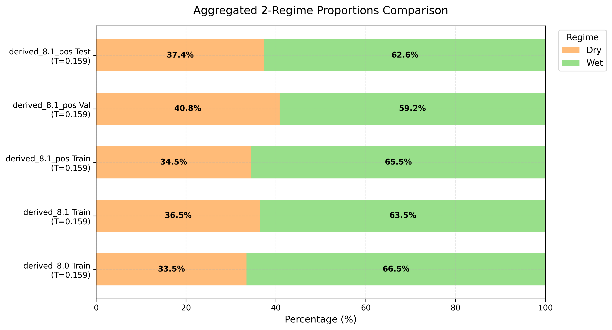

### Station-by-Station 2-Regime Distributions
The percentage of Dry vs Wet observations varies substantially between stations due to local climates:

| Station | Total Obs | Dry % (Count) | Wet % (Count) |
|:---|:---:|:---:|:---:|
| **BeaverPass_WA_990** | 2,811 | 14.1% (395) | **85.9% (2,416)** |
| **BurntMountain_WA** | 1,483 | **93.5% (1,387)** | 6.5% (96) |
| **CayusePass_WA** | 3,123 | 32.3% (1,008) | 67.7% (2,115) |
| **Darrington** | 3,047 | 30.7% (934) | 69.3% (2,113) |
| **HartsPass_WA_515** | 1,600 | 41.4% (663) | 58.6% (937) |
| **MFNooksack_WA_1011** | 260 | 13.1% (34) | **86.9% (226)** |
| **MartenRidge_WA_999** | 2,957 | 27.3% (808) | 72.7% (2,149) |
| **Paradise_WA** | 3,256 | 32.0% (1,041) | 68.0% (2,215) |
| **Quinault** | 3,204 | 22.7% (727) | 77.3% (2,477) |
| **RainyPass_WA_711** | 3,108 | **73.4% (2,281)** | 26.6% (827) |
| **SourdoughGulch_WA_985** | 3,097 | 26.6% (824) | 73.4% (2,273) |
| **Spokane** | 2,690 | 46.2% (1,243) | 53.8% (1,447) |
| **Touchet_WA_824** | 1,379 | 30.5% (420) | 69.5% (959) |

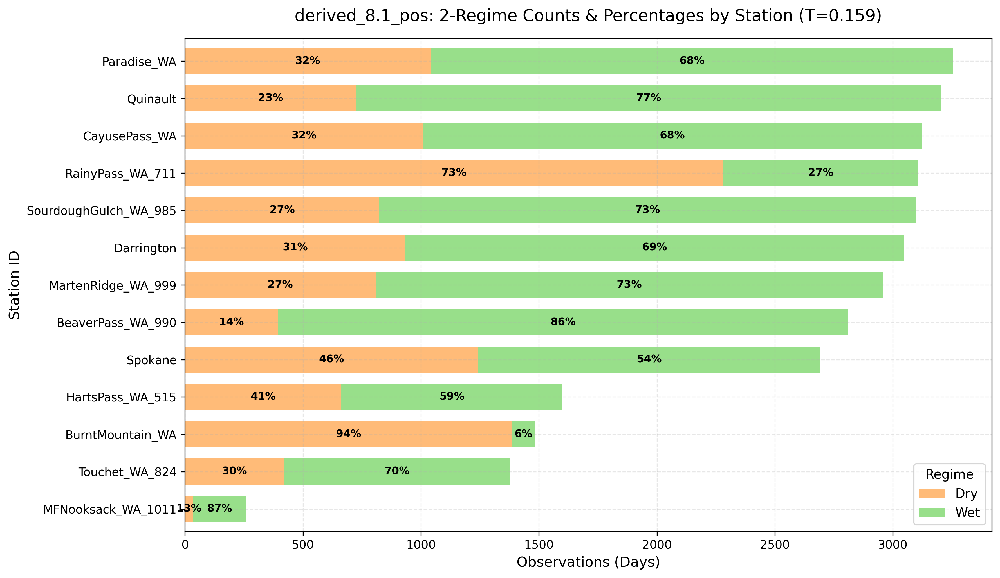

---

## 7. Seasonal Regime Distributions & Gating Feasibility

We conducted a detailed analysis of monthly regime distributions and evaluated the feasibility of modeling the 3-regime gating router using seasonal indicators and key physical features.

### Monthly Regime Distributions
Washington's Pacific Northwest climate creates strong seasonal soil moisture patterns. However, winter months still see dry/transition days, and summer months still see wet days due to localized storm events and spatial heterogeneity.

Below is the monthly distribution of regimes under the recalibrated valleys-based thresholds ($t_1 = 0.159, t_2 = 0.248$):

| Month | Dry (Count) | Transition (Count) | Wet (Count) | Dry % | Transition % | Wet % |
|:---|:---:|:---:|:---:|:---:|:---:|:---:|
| **January** | 563 | 776 | 1,365 | 20.8% | 28.7% | 50.5% |
| **February** | 455 | 699 | 1,227 | 19.1% | 29.4% | 51.5% |
| **March** | 469 | 734 | 1,650 | 16.4% | 25.7% | 57.8% |
| **April** | 381 | 627 | 1,812 | 13.5% | 22.2% | 64.3% |
| **May** | 446 | 807 | 1,692 | 15.1% | 27.4% | 57.5% |
| **June** | 819 | 663 | 1,377 | 28.6% | 23.2% | 48.2% |
| **July** | 1,897 | 455 | 484 | 66.9% | 16.0% | 17.1% |
| **August** | 2,289 | 199 | 34 | 90.8% | 7.9% | 1.3% |
| **September** | 1,894 | 316 | 135 | 80.8% | 13.5% | 5.8% |
| **October** | 1,262 | 753 | 594 | 48.4% | 28.9% | 22.8% |
| **November** | 647 | 895 | 974 | 25.7% | 35.6% | 38.7% |
| **December** | 643 | 781 | 1,201 | 24.5% | 29.8% | 45.8% |

Comparing this to the original thresholds shows a massive difference in how transition and wet regimes are represented seasonally:

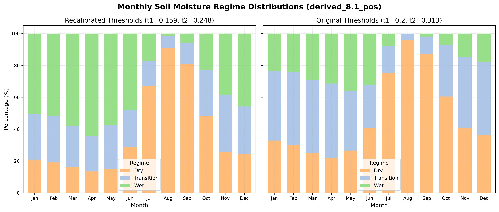
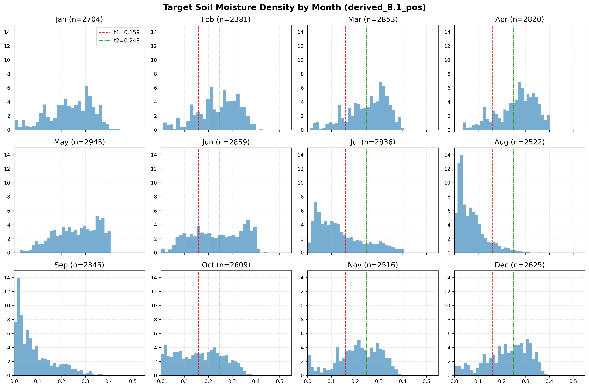
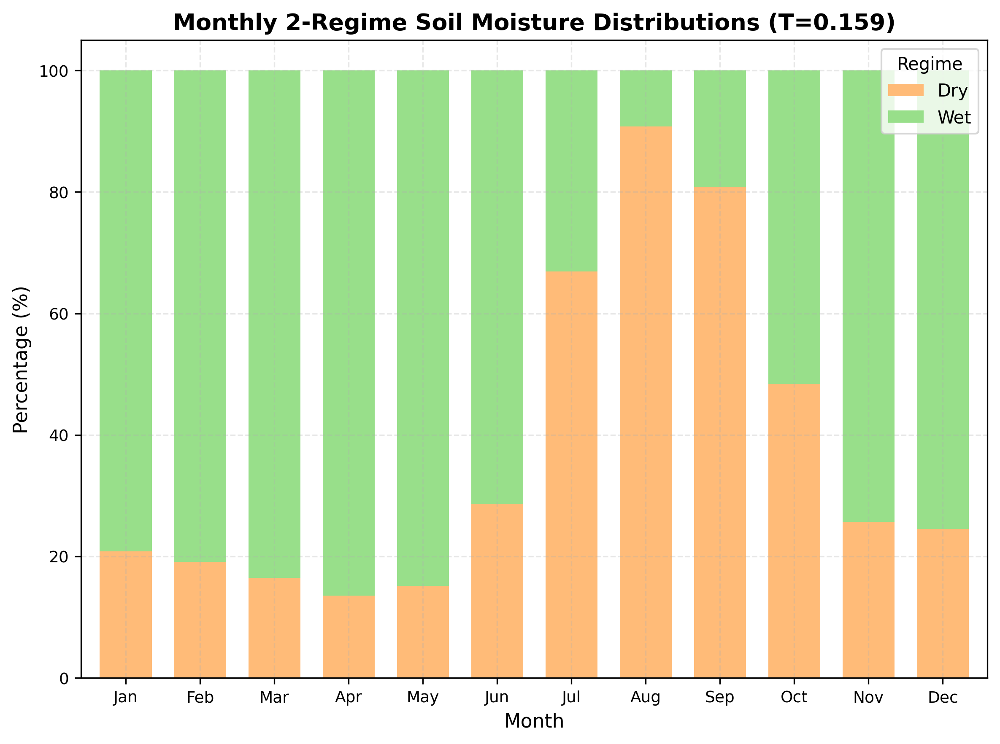

### Seasonal Correlation Trends
We computed the Pearson correlation ($r$) of target soil moisture against key physical drivers across each month:

* **Antecedent Precipitation Index (`G_API`)**: Highly correlated with soil moisture in summer/early autumn (e.g., $r = 0.641$ in September, $r = 0.500$ in July). In winter, correlation drops to $r = 0.139$ (January) because soils are already saturated and excess rainfall runs off rather than raising moisture.
* **Land Surface Temperature (`LST_modis`)**: Consistently anti-correlated with soil moisture during summer (up to $r = -0.374$ in June) due to evapotranspiration drying the soil, but shows weak positive correlation in winter.
* **Satellite Soil Moisture (`SMAP`)**: Moderately correlated in late summer and autumn ($r = 0.404$ in September) but decouples during wet winters.

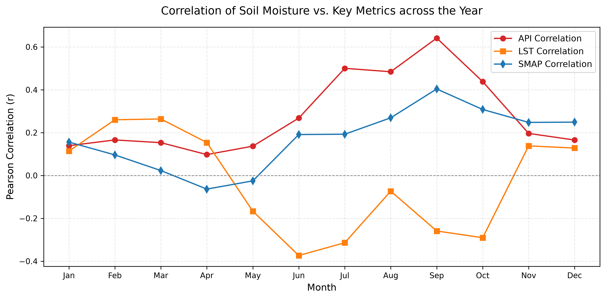
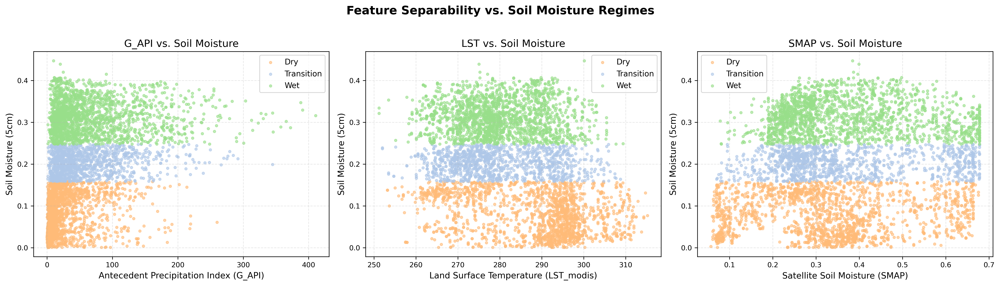
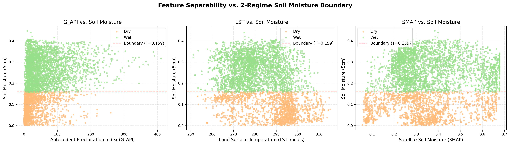

### Evaluating Gating Routing Strategies
To evaluate how realistic it is to route samples using seasonal or simple physical rules, we benchmarked gating routers on the validation + test splits:

#### 3-Regime Gating Performance
##### 1. Heuristic Month-Only Gating
We route samples using a static seasonal rule:
* **Wet Season (Nov–Mar)** $\to$ Wet
* **Dry Season (Jul–Sep)** $\to$ Dry
* **Transition Season (Apr–Jun, Oct)** $\to$ Transition

* **Performance:**
  - **Overall Accuracy:** **49%**
  - **Dry F1-Score:** 0.63 (Recall: 51%, Precision: 83%)
  - **Transition F1-Score:** 0.31 (Recall: 38%, Precision: 26%)
  - **Wet F1-Score:** 0.52 (Recall: 54%, Precision: 50%)

##### 2. Decision Tree Gating (Month + `G_API`)
A simple, interpretable tree trained on the train split (max_depth=3).

* **Performance:**
  - **Overall Accuracy:** **58%**
  - **Dry F1-Score:** 0.67 (Recall: 61%, Precision: 75%)
  - **Transition F1-Score:** **0.00** (Recall: 0%, Precision: 0%)
  - **Wet F1-Score:** 0.66 (Recall: 92%, Precision: 51%)

##### 3. Decision Tree Gating (Month + `G_API` + `LST_modis` + `SMAP_sm_pm_interp`)
Max depth = 4.

* **Performance:**
  - **Overall Accuracy:** **57%**
  - **Dry F1-Score:** 0.68 (Recall: 62%, Precision: 76%)
  - **Transition F1-Score:** 0.13 (Recall: 9%, Precision: 27%)
  - **Wet F1-Score:** 0.63 (Recall: 81%, Precision: 51%)

##### 4. Random Forest Gating (Month + `G_API` + `LST_modis` + `SMAP_sm_pm_interp`)
100 estimators, max depth = 8.

* **Performance:**
  - **Overall Accuracy:** **58%**
  - **Dry F1-Score:** 0.71 (Recall: 64%, Precision: 82%)
  - **Transition F1-Score:** **0.26** (Recall: 22%, Precision: 32%)
  - **Wet F1-Score:** 0.61 (Recall: 74%, Precision: 52%)

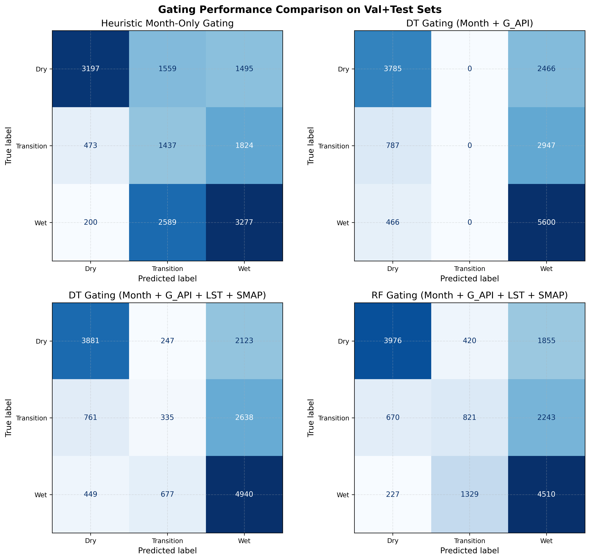
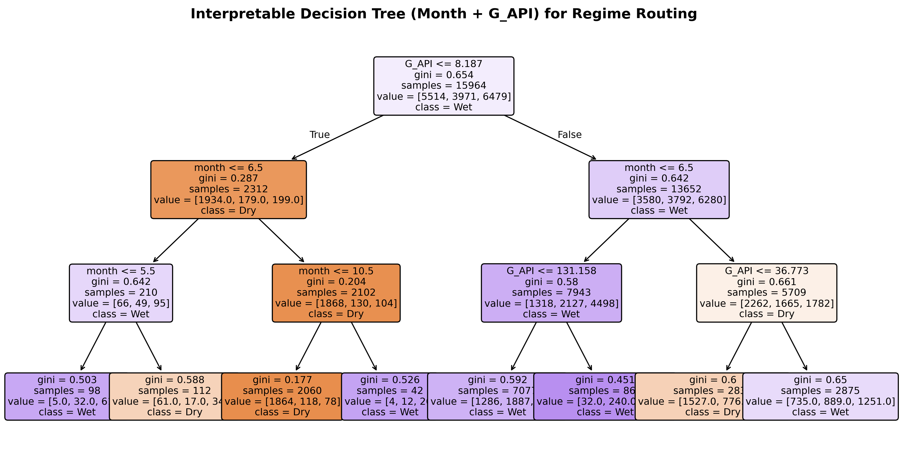

#### 2-Regime Gating Performance (Binary Routing)
By collapsing the gating problem into a binary router (Dry vs. Wet/Transition), we bypass the poorly separable intermediate transition zone. We benchmarked the four routing strategies on the val + test splits:

##### 1. Heuristic Month-Only Binary Gating
Dry season is defined as Jul–Sep (Months 7, 8, 9), and all other months route to the Wet specialist.

* **Performance:**
  - **Overall Accuracy:** **77%**
  - **Dry F1-Score:** 0.63 (Recall: 51%, Precision: 83%)
  - **Wet F1-Score:** **0.83** (Recall: 93%, Precision: 75%)

##### 2. Decision Tree Gating (Month + `G_API`)
* **Performance:**
  - **Overall Accuracy:** **77%**
  - **Dry F1-Score:** 0.67 (Recall: 61%, Precision: 75%)
  - **Wet F1-Score:** **0.82** (Recall: 87%, Precision: 78%)

##### 3. Decision Tree Gating (Month + `G_API` + `LST_modis` + `SMAP_sm_pm_interp`)
* **Performance:**
  - **Overall Accuracy:** **78%**
  - **Dry F1-Score:** 0.68 (Recall: 60%, Precision: 79%)
  - **Wet F1-Score:** **0.83** (Recall: 90%, Precision: 78%)

##### 4. Random Forest Gating (Month + `G_API` + `LST_modis` + `SMAP_sm_pm_interp`)
* **Performance:**
  - **Overall Accuracy:** **80%**
  - **Dry F1-Score:** **0.70** (Recall: 60%, Precision: 85%)
  - **Wet F1-Score:** **0.85** (Recall: 93%, Precision: 79%)

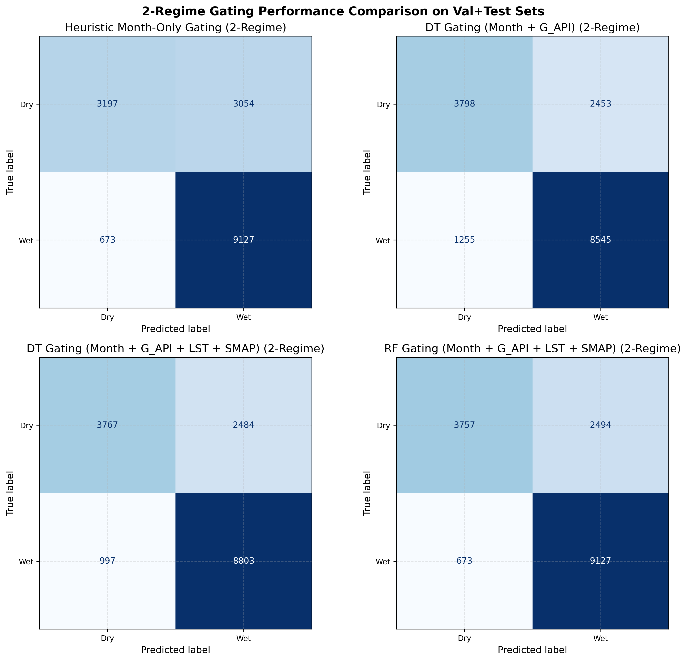
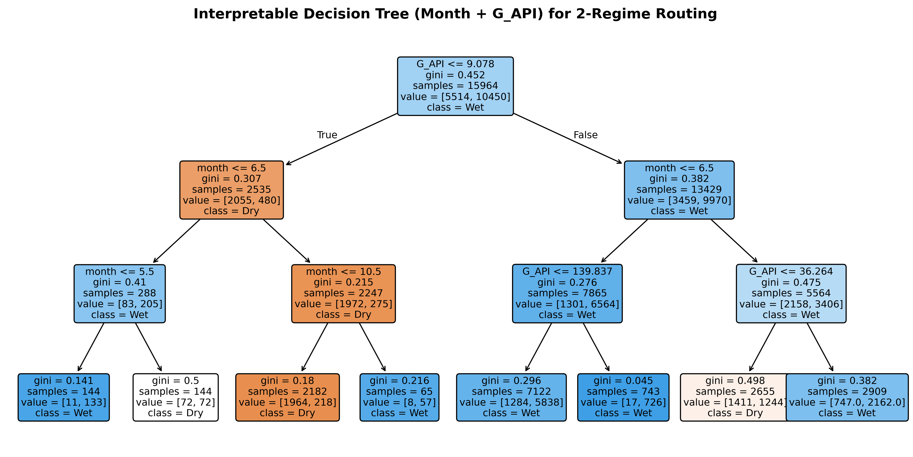

### Key Takeaways on Season-Based Gating Feasibility
1. **Seasons alone are insufficient for 3-regime routing:** A simple seasonal router only achieves 49% accuracy in the 3-regime setup, but achieves **77% accuracy** in the 2-regime setup.
2. **Transition class is poorly separable:** Across all 3-regime gating strategies, the Transition class F1-score peaks at only 0.26. The intermediate moisture range acts as a high-entropy zone where Dry-like and Wet-like dynamics overlap in feature space.
3. **2-Regime collapses the high-entropy zone:** By using a single threshold ($T_{2REGIME}=0.159$) and binary routing, we achieve **80% overall accuracy** with a 4-feature Random Forest. This completely avoids the recall wall of the transition zone, boosting routing accuracy by over 20% absolute.

---

## 8. Temporal Regime Drift & Year-over-Year Analysis

Because the dataset splits are partitioned on a year-by-year basis (**Train**: 2017–2020, **Val**: 2021–2022, **Test**: 2023–2025), any inter-annual variability in weather patterns and soil moisture levels translates directly into a **temporal covariate shift** or **temporal label shift** between the training, validation, and testing sets.

To assess this drift, we analyzed the annual regime distributions from 2017 through 2025 across all splits under the three threshold configurations:

### 1. Original 3-Regime Thresholds ($t_1 = 0.20, t_2 = 0.313$)

Under the original baseline thresholds, the test split years (2023–2025) exhibit a severe drop in the proportion of Wet observations, falling to only ~10–12% compared to ~19–26% in the training years.

| Year | Dry Count | Dry % | Transition Count | Transition % | Wet Count | Wet % | Total |
|:---:|:---:|:---:|:---:|:---:|:---:|:---:|:---:|
| **2017** | 1,959 | 48.01% | 1,044 | 25.59% | 1,077 | 26.40% | 4,080 |
| **2018** | 2,239 | 54.99% | 1,048 | 25.74% | 785 | 19.28% | 4,072 |
| **2019** | 1,584 | 41.34% | 1,529 | 39.90% | 719 | 18.76% | 3,832 |
| **2020** | 1,586 | 39.85% | 1,498 | 37.64% | 896 | 22.51% | 3,980 |
| **2021** | 1,645 | 45.04% | 1,095 | 29.98% | 912 | 24.97% | 3,652 |
| **2022** | 1,693 | 48.41% | 988 | 28.25% | 816 | 23.33% | 3,497 |
| **2023** | 1,943 | 59.29% | 1,003 | 30.61% | 331 | 10.10% | 3,277 |
| **2024** | 1,275 | 40.77% | 1,478 | 47.27% | 374 | 11.96% | 3,127 |
| **2025** | 1,131 | 45.28% | 1,072 | 42.91% | 295 | 11.81% | 2,498 |

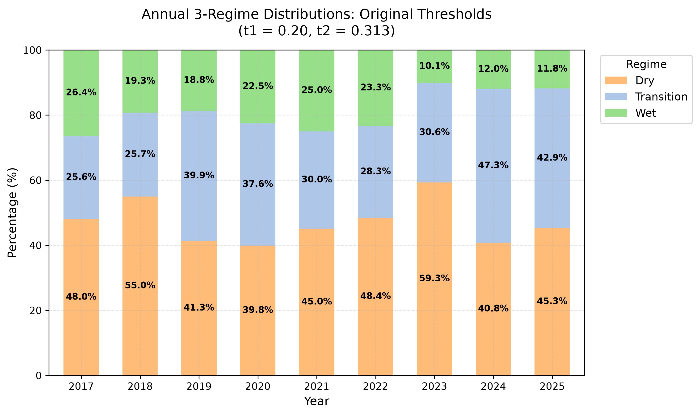

---

### 2. Valley-Calibrated 3-Regime Thresholds ($t_1 = 0.159, t_2 = 0.248$)

Recalibrating boundaries to the empirical distribution valleys maintains a more substantial representation of the Wet class in the test set (averaging ~35% across 2023–2025, compared to ~41% in training years). 

| Year | Dry Count | Dry % | Transition Count | Transition % | Wet Count | Wet % | Total |
|:---:|:---:|:---:|:---:|:---:|:---:|:---:|:---:|
| **2017** | 1,476 | 36.18% | 964 | 23.63% | 1,640 | 40.20% | 4,080 |
| **2018** | 1,671 | 41.04% | 1,025 | 25.17% | 1,376 | 33.79% | 4,072 |
| **2019** | 1,058 | 27.61% | 1,224 | 31.94% | 1,550 | 40.45% | 3,832 |
| **2020** | 1,309 | 32.89% | 758 | 19.05% | 1,913 | 48.07% | 3,980 |
| **2021** | 1,444 | 39.54% | 703 | 19.25% | 1,505 | 41.21% | 3,652 |
| **2022** | 1,474 | 42.15% | 590 | 16.87% | 1,433 | 40.98% | 3,497 |
| **2023** | 1,566 | 47.79% | 734 | 22.40% | 977 | 29.81% | 3,277 |
| **2024** | 933 | 29.84% | 928 | 29.68% | 1,266 | 40.49% | 3,127 |
| **2025** | 834 | 33.39% | 779 | 31.18% | 885 | 35.43% | 2,498 |

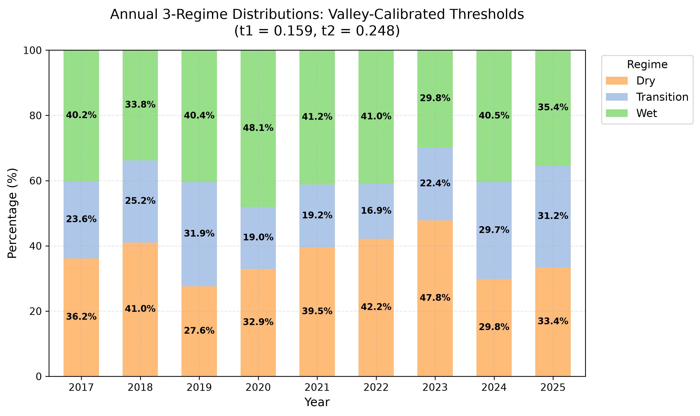

---

### 3. Valley-Calibrated 2-Regime Threshold ($T = 0.159$)

Collapsing the classification to a binary router at $T = 0.159$ creates a robust split that remains highly stable across years, with Wet observations consistently making up 52–72% of the dataset.

| Year | Dry Count | Dry % | Wet Count | Wet % | Total |
|:---:|:---:|:---:|:---:|:---:|:---:|
| **2017** | 1,476 | 36.18% | 2,604 | 63.82% | 4,080 |
| **2018** | 1,671 | 41.04% | 2,401 | 58.96% | 4,072 |
| **2019** | 1,058 | 27.61% | 2,774 | 72.39% | 3,832 |
| **2020** | 1,309 | 32.89% | 2,671 | 67.11% | 3,980 |
| **2021** | 1,444 | 39.54% | 2,208 | 60.46% | 3,652 |
| **2022** | 1,474 | 42.15% | 2,023 | 57.85% | 3,497 |
| **2023** | 1,566 | 47.79% | 1,711 | 52.21% | 3,277 |
| **2024** | 933 | 29.84% | 2,194 | 70.16% | 3,127 |
| **2025** | 834 | 33.39% | 1,664 | 66.61% | 2,498 |

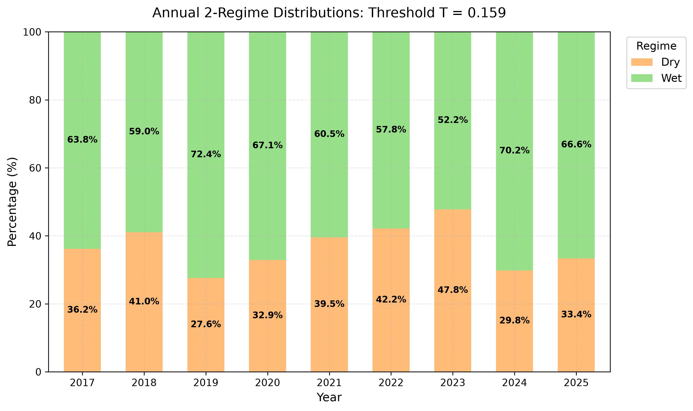

---

### 4. Year-over-Year Trends and Key Insights

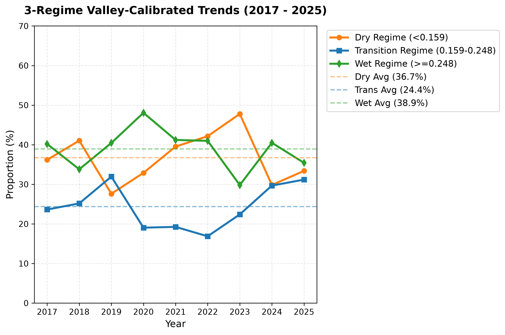
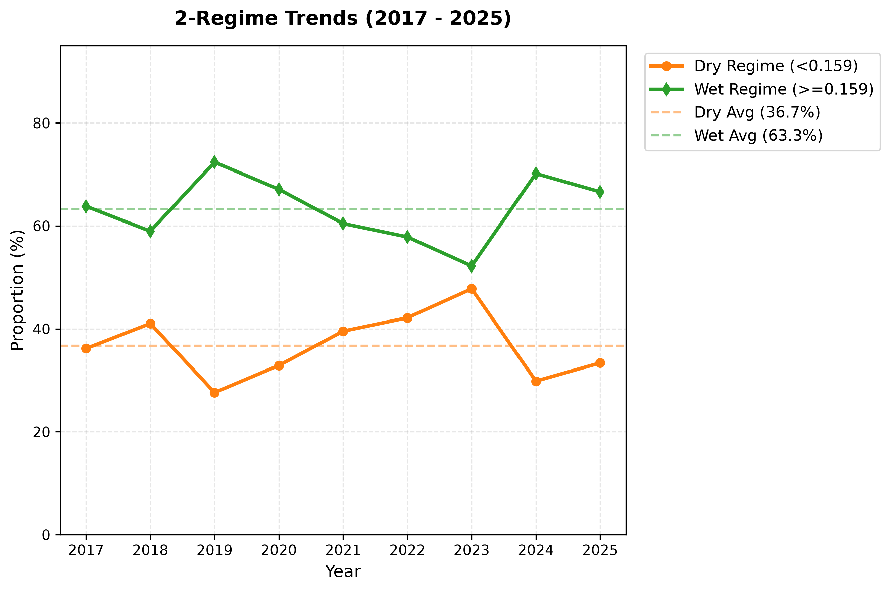

1. **The 2023 Drought Shift**: The year 2023 stands out as an exceptionally dry outlier. The Dry regime proportion surges to **47.79%** (valley-calibrated) and **59.29%** (original thresholds), representing the driest conditions in the 9-year dataset. Concurrently, the Wet regime proportion hits a record low.
2. **Impact of Temporal Split**: Since the validation split covers 2021–2022 and the test split covers 2023–2025, evaluating models on 2023 tests their ability to generalize to drier-than-average climate regimes. 
3. **Evaluating Wet Specialists**: If using the original thresholds, the test set has so few Wet samples (only 10.10% in 2023, 11.96% in 2024, 11.81% in 2025) that evaluating the Wet Specialist will yield high-variance, low-sample metrics. Valley-calibrated thresholds ($t_2 = 0.248$) mitigate this by keeping a healthy Wet population (~30–40%) in the test set.

---

## 9. Conclusions & Next Steps

### 1. Dataset Quality Verdict: **EXCELLENT**
* The `derived_8.1_pos` dataset provides a **2.35x larger sample set** (32,015 rows vs 13,604 in `derived_8.0`).
* Under valleys-based thresholds, the **Wet regime has 6,479 training samples** (compared to 879 in `derived_8.0`). This solves the minority class undersupply issue, providing a robust base to train a high-quality **Wet Specialist** expert model.

### 2. Threshold Verdict: **RECALIBRATE**
* Do **not** use the original thresholds ($t_1=0.20, t_2=0.313$), as they result in a heavily dry-skewed model and leave very few test observations for evaluating the Wet Specialist.
* Adopt the **valleys-based thresholds ($t_1=0.159, t_2=0.248$)** to align with the empirical distribution modes.

### 3. Recommendations for MoE Modeling
* **Gating Design**: Because individual stations are highly skewed (e.g. BurntMountain is 93.5% Dry), station-level static features (latitude, longitude, elevation, HWSD clay/sand fractions) will be critical for the router to identify spatial regime shifts.
* **Temporal Shift Robustness**: Due to year-to-year climate drift (like the 2023 drought), router gating networks must be simple and robust to avoid overfitting to specific training years.
* **Binary Routing Alternative**: Given the Transition class's poor separability (F1-score of 0.26), collapsing the problem into a Binary MoE (Dry vs. Wet/Transition) using the valley-calibrated threshold $T=0.159$ is highly recommended. The binary gating model achieves **80% accuracy** and completely avoids the transition zone recall wall, yielding balanced and stable regime counts over time.

