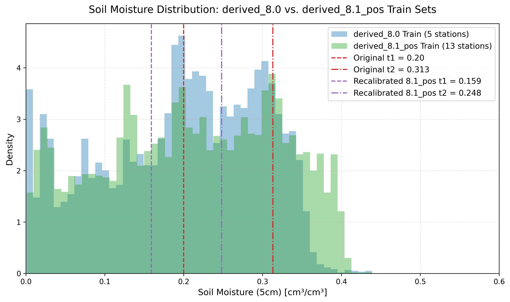
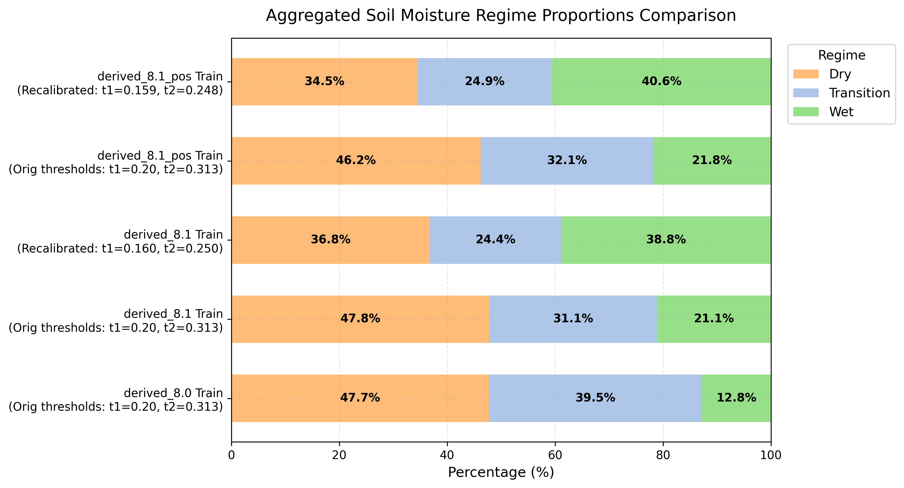
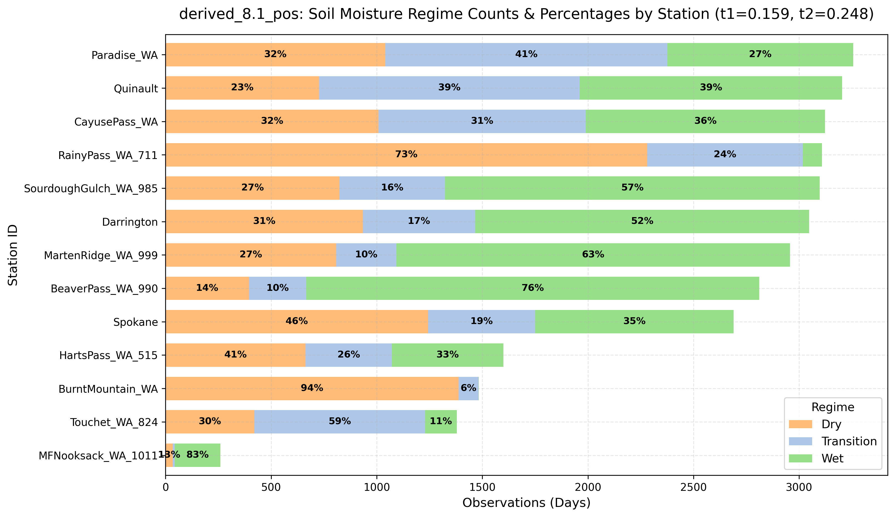
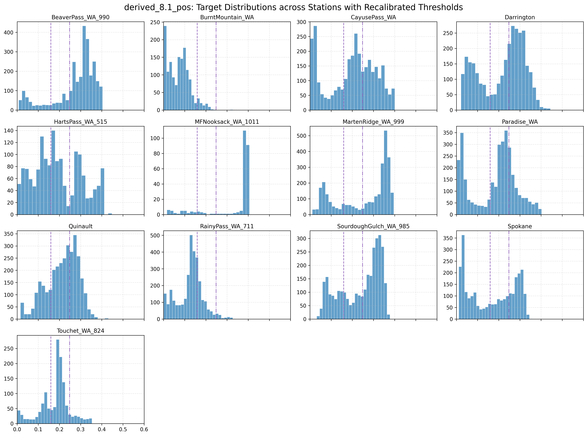
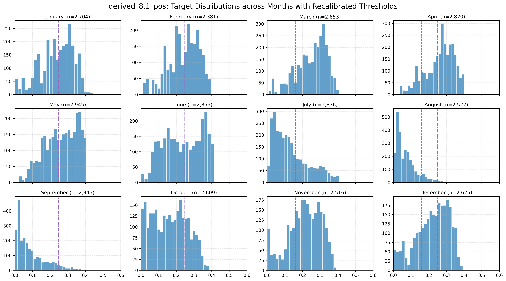

# derived_8.1_pos Soil Moisture Dataset Exploratory Data Analysis Report

This directory contains the exploratory data analysis (EDA) conducted on the `derived_8.1_pos` soil moisture dataset, comparing it against the `derived_8.0` baseline. 

`derived_8.1_pos` is derived from `derived_8.1` by filtering out soil moisture values <= 0.0.

The primary objective is to evaluate:
1. **Dataset Quality**: Whether the new dataset provides a larger, more representative sample size across the target space.
2. **Regime Distribution**: How samples are distributed across **Dry**, **Transition**, and **Wet** moisture regimes.
3. **Threshold Validity**: Whether the original thresholds hold or require recalibration.

---

## Files in this Directory

* **Analysis Script**: [analyze_regimes.py](./analyze_regimes.py) - Python script to load the data splits, compute quantiles, process regime distributions, and save the figures.
* **Calibration Script**: [calibrate_valleys.py](./calibrate_valleys.py) - Programmatic threshold valley-calibration verification script using KDE and peak/valley detection.
* **Density Comparison Plot**: [soil_moisture_density_comparison.png](./soil_moisture_density_comparison.png)
* **Calibration Plot**: [programmatic_valleys_calibration.png](./programmatic_valleys_calibration.png) - Plot showing identified density modes and valleys.
* **Aggregated Regimes Plot**: [aggregated_regime_comparison.png](./aggregated_regime_comparison.png)
* **Regimes by Station Plot**: [regime_distribution_by_station.png](./regime_distribution_by_station.png)
* **Histograms by Station Grid**: [soil_moisture_by_station_grid.png](./soil_moisture_by_station_grid.png)
* **Histograms by Month Grid**: [soil_moisture_by_month_grid.png](./soil_moisture_by_month_grid.png)

---

## 1. Dataset Scale and Station Coverage

`derived_8.1_pos` expands the spatial coverage of the Washington-only subset by adding **8 new SNOTEL stations** to the **5 original stations**, raising the total station count from 5 to 13.

* **derived_8.0 Stations (5)**: Spokane, Darrington, Quinault, Touchet_WA_824, SourdoughGulch_WA_985
* **derived_8.1_pos Stations (13)**: Original 5 + BeaverPass_WA_990, BurntMountain_WA, CayusePass_WA, HartsPass_WA_515, MFNooksack_WA_1011, MartenRidge_WA_999, Paradise_WA, RainyPass_WA_711

This yields a **2.35x increase** in total observations:

| Metric | derived_8.0 | derived_8.1_pos | Change |
|---|---|---|---|
| **Stations** | 5 | 13 | +8 stations |
| **Total Rows** | 13,604 | 32,015 | +18,411 rows (+135.3%) |
| **Train Split** | 6,868 | 15,964 | +9,096 rows |
| **Val Split** | 2,720 | 7,149 | +4,429 rows |
| **Test Split** | 4,016 | 8,902 | +4,886 rows |

---

## 2. Soil Moisture Target Distribution & Quantiles

Analyzing the percentiles of `soil_moisture_5cm` in the training splits reveals a shift in the overall distribution:

| Percentile | derived_8.0 (Train) | derived_8.1_pos (Train) | Difference |
|---|---|---|---|
| **0% (Min)** | 0.0000 | 0.0010 | +0.0010 |
| **10%** | 0.0390 | 0.0470 | +0.0080 |
| **25%** | 0.1210 | 0.1250 | +0.0040 |
| **33%** | 0.1570 | 0.1520 | -0.0050 |
| **50% (Median)** | 0.2060 | 0.2130 | +0.0070 |
| **66%** | 0.2530 | 0.2730 | +0.0200 |
| **75%** | 0.2800 | 0.3040 | +0.0240 |
| **90%** | 0.3203 | 0.3540 | +0.0337 |
| **100% (Max)** | 0.4390 | 0.4390 | 0.0000 |

### Density Distribution comparison
The plot below displays the density distribution of `soil_moisture_5cm` for the training sets of both versions, showing the locations of the original and valleys-based boundaries:

*The new dataset has a wider, flatter profile in the middle-to-high moisture range (0.20 to 0.38), indicating a richer sample set for intermediate and wet regimes.*

---

## 3. Aggregated Regime Proportions Comparison

Below is the aggregated distribution of Dry, Transition, and Wet regimes across datasets, comparing:
1. `derived_8.0` Train set (with original thresholds: $t_1 = 0.20, t_2 = 0.313$)
2. `derived_8.1` Train set (with original thresholds: $t_1 = 0.20, t_2 = 0.313$)
3. `derived_8.1` Train set (with recalibrated valleys-based thresholds: $t_1 = 0.160, t_2 = 0.250$)
4. `derived_8.1_pos` Train set (with original thresholds: $t_1 = 0.20, t_2 = 0.313$)
5. `derived_8.1_pos` Train set (with recalibrated valleys-based thresholds: $t_1 = 0.159, t_2 = 0.248$)

*This highlights how the inclusion of new Washington SNOTEL stations increases the proportion of wet observations under the original thresholds (from 12.8% in `derived_8.0` to 21.1% in `derived_8.1` and 21.8% in `derived_8.1_pos`), and how using valleys-based thresholds splits the data into physically distinct regimes corresponding to modes of the target distribution.*

---

## 4. Regime Threshold Validation

In the three-regime modeling framework, samples are routed into **Dry**, **Transition**, and **Wet** classes. We evaluated threshold options on the training sets:

### Option A: Original 8.0 Thresholds ($t_1 = 0.20, t_2 = 0.313$)
These boundaries were calibrated on `derived_8.0` and result in severe class imbalance:
* **derived_8.0 Train**: Dry: 47.7%, Transition: 39.5%, **Wet: 12.8%**
* **derived_8.1 Train**: Dry: 47.8%, Transition: 31.1%, **Wet: 21.1%**
* **derived_8.1_pos Train**: Dry: 46.2%, Transition: 32.1%, **Wet: 21.8%**

While the new SNOTEL stations double the proportion of Wet samples under the original thresholds (from 12.8% to 21.1%/21.8%), the overall distribution remains heavily skewed toward Dry and Transition.

### Option B: Recalibrated Valleys-Based Thresholds ($t_1 = 0.159, t_2 = 0.248$ for `derived_8.1_pos`)
Instead of dividing the dataset into three arbitrary folds or using the outdated `derived_8.0` thresholds, we recalibrate the boundaries based on the natural valleys (density minima) of the training distribution:
* **derived_8.1 Train (valleys: $t_1 = 0.160, t_2 = 0.250$)**: Dry: 36.8%, Transition: 24.4%, Wet: 38.8%
* **derived_8.1_pos Train (valleys: $t_1 = 0.159, t_2 = 0.248$)**: Dry: 34.5%, Transition: 24.9%, Wet: 40.6%

Our peak detection for `derived_8.1_pos` identifies modes at `0.030`, `0.135`, `0.201`, and `0.310`, with density minima (valleys) at `0.063`, `0.159`, and `0.248`. We ignore the valley at `0.063` as it separates two sub-modes within the dry range (likely caused by the removal of <= 0.0 values exposing a small positive peak at `0.030`). We adopt the primary physical valleys at `0.159` and `0.248` to define the boundaries:
* **Dry**: $y < 0.159$
* **Transition**: $0.159 \le y < 0.248$
* **Wet**: $y \ge 0.248$

This valleys-based partitioning ensures that each specialist model's training set is aligned with the natural physical boundaries of soil moisture modes:

| Split | Dry | Transition | Wet | Total Rows |
|---|---|---|---|---|
| **Train** | 5,514 (34.5%) | 3,971 (24.9%) | 6,479 (40.6%) | 15,964 |
| **Val** | 2,918 (40.8%) | 1,293 (18.1%) | 2,938 (41.1%) | 7,149 |
| **Test** | 3,333 (37.4%) | 2,441 (27.4%) | 3,128 (35.1%) | 8,902 |

*Note: The original thresholds ($t_1 = 0.20, t_2 = 0.313$) are misaligned with the new dataset structure. Recalibrating to the bimodal/multimodal valleys ($t_1 = 0.159$ and $t_2 = 0.248$) provides a physically motivated partition where values to the right of each peak belong to the same regime, maintaining highly distinct training conditions for the specialists.*

---

## 5. Station-by-Station Regime Distributions

The regime counts and percentages vary significantly across the 13 Washington stations due to localized environmental conditions:

### Station-Level Metrics (under Recalibrated Thresholds)
Below is the tabular summary of observations, average soil moisture, and regime counts per station:

| Station | Total Obs | Mean SM | Min SM | Max SM | Dry % (Count) | Trans % (Count) | Wet % (Count) |
|:---|:---:|:---:|:---:|:---:|:---:|:---:|:---:|
| **BeaverPass_WA_990** | 2,811 | 0.2773 | 0.0070 | 0.4040 | 14.1% (395) | 9.6% (271) | **76.3% (2145)** |
| **BurntMountain_WA** | 1,483 | 0.0733 | 0.0010 | 0.3280 | **93.5% (1387)** | 6.4% (95) | 0.1% (1) |
| **CayusePass_WA** | 3,123 | 0.1960 | 0.0010 | 0.4010 | 32.3% (1008) | 31.4% (982) | 36.3% (1133) |
| **Darrington** | 3,047 | 0.2192 | 0.0220 | 0.4440 | 30.7% (934) | 17.5% (532) | **51.9% (1581)** |
| **HartsPass_WA_515** | 1,600 | 0.1921 | 0.0010 | 0.4480 | 41.4% (663) | 25.6% (409) | 33.0% (528) |
| **MFNooksack_WA_1011** | 260 | 0.3405 | 0.0160 | 0.4060 | 13.1% (34) | 3.8% (10) | **83.1% (216)** |
| **MartenRidge_WA_999** | 2,957 | 0.2565 | 0.0110 | 0.3960 | 27.3% (808) | 9.6% (285) | **63.0% (1864)** |
| **Paradise_WA** | 3,256 | 0.1828 | 0.0020 | 0.4030 | 32.0% (1041) | 41.0% (1335) | 27.0% (880) |
| **Quinault** | 3,204 | 0.2146 | 0.0160 | 0.4310 | 22.7% (727) | 38.5% (1234) | 38.8% (1243) |
| **RainyPass_WA_711** | 3,108 | 0.1267 | 0.0010 | 0.3410 | **73.4% (2281)** | 23.7% (737) | 2.9% (90) |
| **SourdoughGulch_WA_985** | 3,097 | 0.2390 | 0.0320 | 0.3780 | 26.6% (824) | 16.1% (499) | **57.3% (1774)** |
| **Spokane** | 2,690 | 0.1683 | 0.0110 | 0.3590 | 46.2% (1243) | 18.8% (507) | 34.9% (940) |
| **Touchet_WA_824** | 1,379 | 0.1808 | 0.0010 | 0.3540 | 30.5% (420) | **58.7% (809)** | 10.9% (150) |

### Individual Target Histograms per Station
The small multiples grid below shows the soil moisture density distributions for each station, overlaid with the new valleys-based regime boundaries ($t_1$ and $t_2$):

### Individual Target Histograms per Month (Aggregated)
The small multiples grid below shows the soil moisture density distributions for all observations aggregated by month across the year, overlaid with the valleys-based regime boundaries:

### Key Insights from Station-Level & Seasonal Analysis:
1. **Seasonal Cycles (Wet Winters, Dry Summers)**: As expected from the Pacific Northwest climate, soil moisture displays strong seasonality. Winter months (November through March) are heavily skewed towards the Wet regime (exceeding the $t_2 = 0.250$ threshold), with very few dry observations. Conversely, Summer months (July, August, September) show a dominant Dry mode (below the $t_1 = 0.160$ threshold) as precipitation drops and evapotranspiration peaks.
2. **Transition Periods**: Months like May, June, and October act as transition zones where the target distributions are broad and span all three regimes, reflecting the shifting weather patterns.
3. **High Spatial Heterogeneity**: Stations have very different soil moisture ranges. **BurntMountain** is extremely dry (mean = 0.0406, 96.5% of days in Dry), whereas **MFNooksack** (mean = 0.3341, 81.5% Wet) and **BeaverPass** (mean = 0.2773, 76.1% Wet) are highly wet. 
4. **Data Sparsity**: **MFNooksack** has only **260 observations** total due to missing target sensor data. It should be treated as a sparse target station during model training.
5. **Balanced Stations**: **Spokane**, **Darrington**, and **CayusePass** span a wide range of values and display bimodal or spread distributions across all three regimes.

---

## 6. Conclusions & Next Steps

### 1. Dataset Quality Verdict: **EXCELLENT**
* The `derived_8.1_pos` dataset provides a **2.35x larger sample set** (32,015 rows vs 13,604 in `derived_8.0`).
* Under valleys-based thresholds, the **Wet regime has 6,479 training samples** (compared to 879 in `derived_8.0`). This solves the minority class undersupply issue highlighted in the handoff notes, providing a robust base to train a high-quality **Wet Specialist** expert model.

### 2. Threshold Verdict: **RECALIBRATE**
* Do **not** use the original thresholds ($t_1=0.20, t_2=0.313$), as they result in a heavily dry-skewed model.
* Adopt the **valleys-based thresholds ($t_1=0.159, t_2=0.248$)** to align with the empirical distribution modes.

### 3. Recommendations for MoE Modeling
* **Gating Design**: Because individual stations are highly skewed (e.g. BurntMountain is 93.5% Dry), station-level static features (latitude, longitude, elevation, HWSD clay/sand fractions) will be critical for the router to identify spatial regime shifts.
* **Evaluation**: The test split in `derived_8.1_pos` is also larger (8,902 rows), allowing for a clean out-of-sample evaluation of MoE routing strategies.
