# derived_8.2 Soil Moisture Dataset Exploratory Data Analysis & Diagnostics Report

This directory contains the exploratory data analysis (EDA) and diagnostic study conducted on the **`derived_8.2`** soil moisture dataset, expanding upon the baseline `derived_8.1_pos` analysis.

`derived_8.2` is derived from `derived_8.1_pos` by refining station selections and feature sets across Washington SNOTEL and weather stations.

---

## Executive Summary & Key Findings

1. **Dataset Scale & Station Coverage**:
   - `derived_8.2` contains **12 Washington stations** with a total of **31,755 observations** (15,704 train, 7,149 val, 8,902 test).
   - `MFNooksack_WA_1011` (sparse station in `derived_8.1_pos` with 260 rows) was excluded in `derived_8.2`.
2. **Density Valleys & Regime Calibration**:
   - Density peak/valley detection confirms robust multimodal boundaries at $T_1 = 0.160$ and $T_2 = 0.250$ for 3-regime modeling (**Dry**: $<0.16$, **Transition**: $0.16 \le y < 0.25$, **Wet**: $\ge 0.25$).
   - 2-regime modeling uses a single threshold $T_{2REGIME} = 0.160$ (**Dry**: $<0.16$, **Wet**: $\ge 0.16$), partitioning the training set into 34.5% Dry and 65.5% Wet observations.
3. **Station Data Missingness**:
   - **`Touchet_WA_824`**: Completely missing data for 3 consecutive years (**2021, 2022, 2023**), with 0 samples in the validation split.
   - **`BurntMountain_WA`**: Completely missing **2019**, and has sparse records in 2024 (7 rows) and 2025 (49 rows).
   - **`HartsPass_WA_515`**: Completely missing **2025**, with only 19 rows in 2023.
4. **Soil Moisture vs. Precipitation Coupling & Model Failure Diagnostics**:
   - **`BurntMountain_WA`** (Model $R^2 = -0.783$): Soil moisture is completely decoupled from precipitation ($r_{precip} = -0.004$, $r_{API} = 0.104$). 131 heavy rainfall days (>10mm) occur while soil moisture remains stuck $< 0.05$, pointing to rapid drainage, rocky soil texture, or sensor calibration anomalies.
   - **`Touchet_WA_824`** (Baseline $R^2 = -1.621$, MoE $R^2 = +0.171$): Global baseline models collapse due to severe temporal gap and distribution shift across missing years, whereas MoE gating recovers positive $R^2$.
   - **`HartsPass_WA_515`** (High elevation SNOTEL 515): Exhibits negative correlation ($r = -0.071$) between precipitation and soil moisture due to winter snowpack accumulation (precipitation falls as snow without increasing soil moisture until spring melt).
   - **Well-behaved stations** (`Spokane` $R^2 = 0.912$, `Darrington` $R^2 = 0.785$, `Quinault` $R^2 = 0.742$) show strong hydrological coupling ($r_{API} \ge 0.62$).

---

## 1. Dataset Scale and Station Coverage

| Metric | derived_8.0 | derived_8.1_pos | derived_8.2 | Change vs 8.1_pos |
|---|---|---|---|---|
| **Stations** | 5 | 13 | 12 | -1 station (`MFNooksack` dropped) |
| **Total Rows** | 13,604 | 32,015 | 31,755 | -260 rows |
| **Train Split** | 6,868 | 15,964 | 15,704 | -260 rows |
| **Val Split** | 2,720 | 7,149 | 7,149 | 0 rows |
| **Test Split** | 4,016 | 8,902 | 8,902 | 0 rows |

### Station List (12 Washington Stations)
`BeaverPass_WA_990`, `BurntMountain_WA`, `CayusePass_WA`, `Darrington`, `HartsPass_WA_515`, `MartenRidge_WA_999`, `Paradise_WA`, `Quinault`, `RainyPass_WA_711`, `SourdoughGulch_WA_985`, `Spokane`, `Touchet_WA_824`.

---

## 2. Soil Moisture Target Distribution & Quantiles

| Percentile | derived_8.0 (Train) | derived_8.2 (Train) | Difference |
|---|---|---|---|
| **0% (Min)** | 0.0000 | 0.0010 | +0.0010 |
| **10%** | 0.0390 | 0.0470 | +0.0080 |
| **25%** | 0.1210 | 0.1240 | +0.0030 |
| **33%** | 0.1570 | 0.1510 | -0.0060 |
| **50% (Median)** | 0.2060 | 0.2110 | +0.0050 |
| **66%** | 0.2530 | 0.2700 | +0.0170 |
| **75%** | 0.2800 | 0.3010 | +0.0210 |
| **90%** | 0.3203 | 0.3490 | +0.0287 |
| **100% (Max)** | 0.4390 | 0.4390 | 0.0000 |

### Density Distribution Comparison
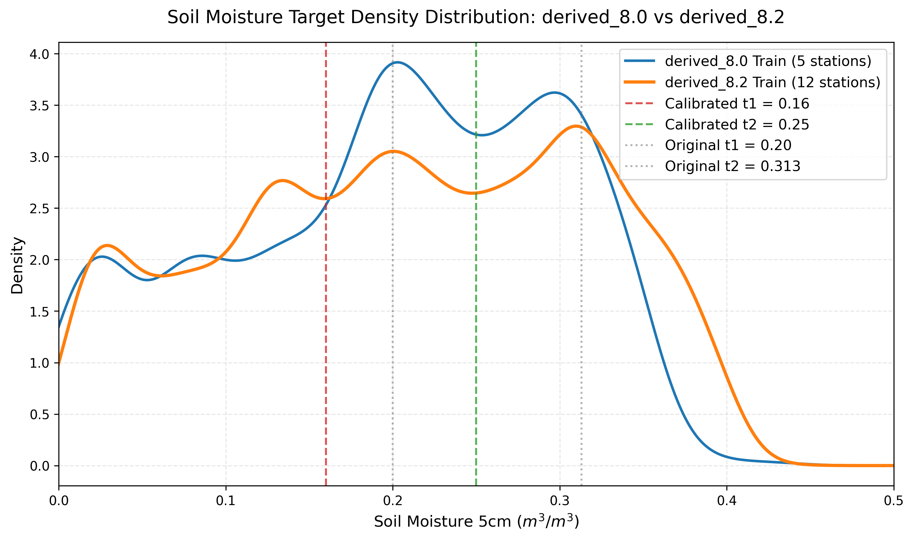

### Programmatic KDE Peak & Valley Calibration
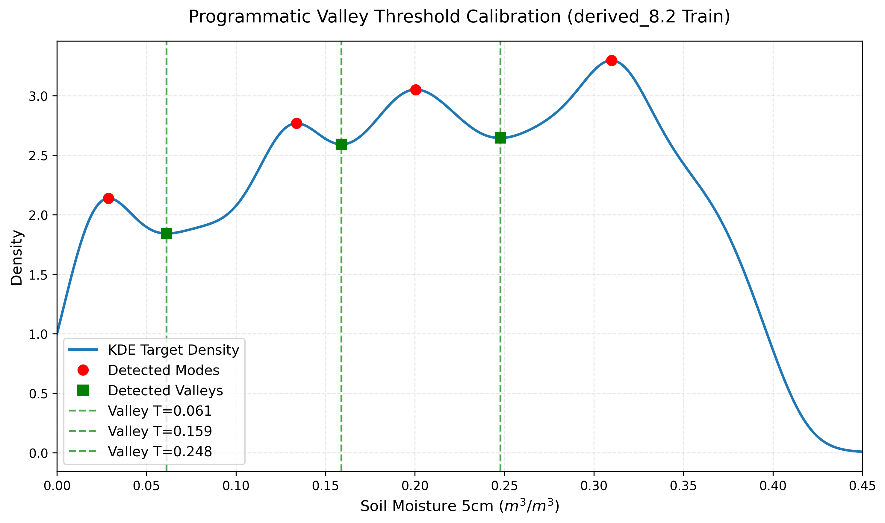

KDE density mode detection identifies peaks at `0.029`, `0.134`, `0.201`, and `0.310`, with primary density valleys at $T_1 = 0.159 \approx 0.160$ and $T_2 = 0.248 \approx 0.250$.

---

## 3. Aggregated & Station Regime Proportions

### Aggregated 3-Regime Comparison ($t_1 = 0.16, t_2 = 0.25$)
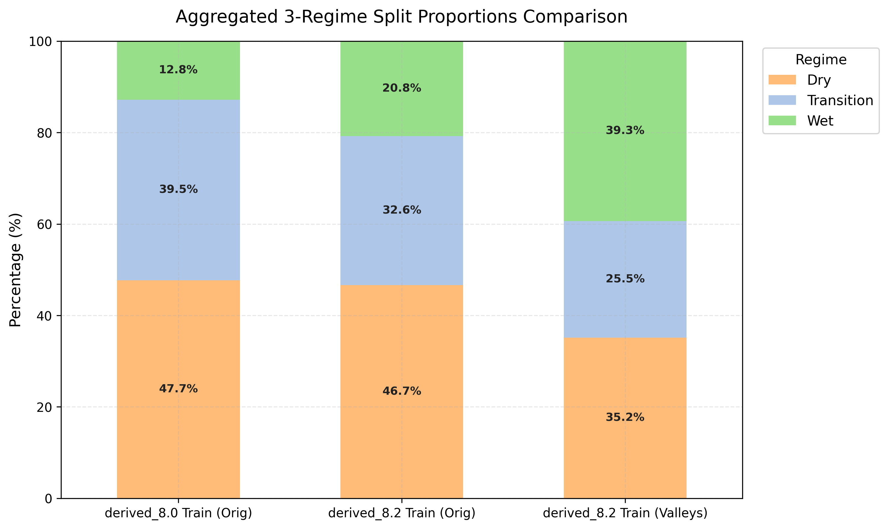

### Station-by-Station 3-Regime Proportions
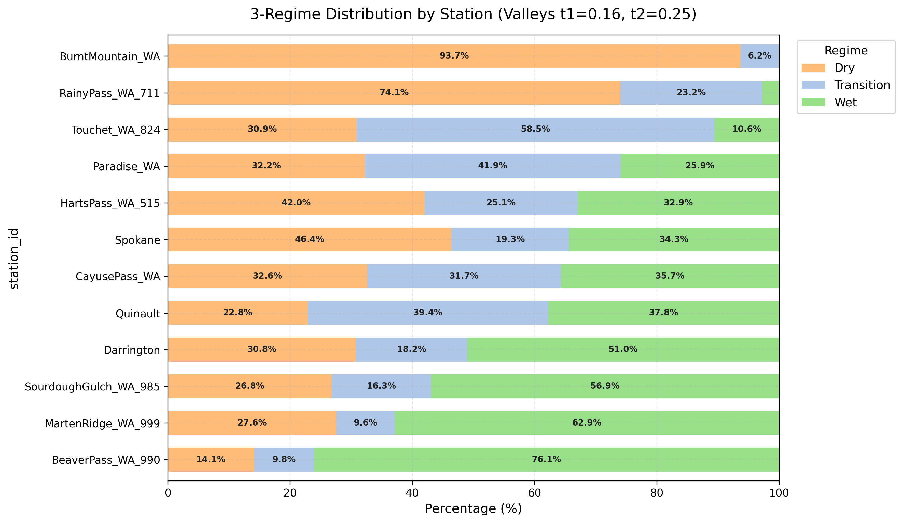

### Aggregated & Station-by-Station 2-Regime Proportions ($T = 0.16$)
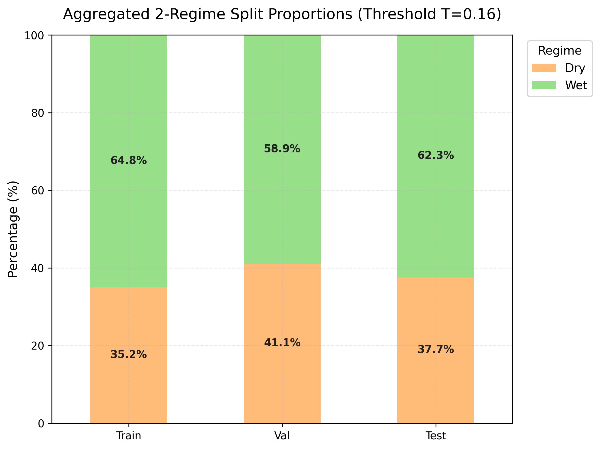
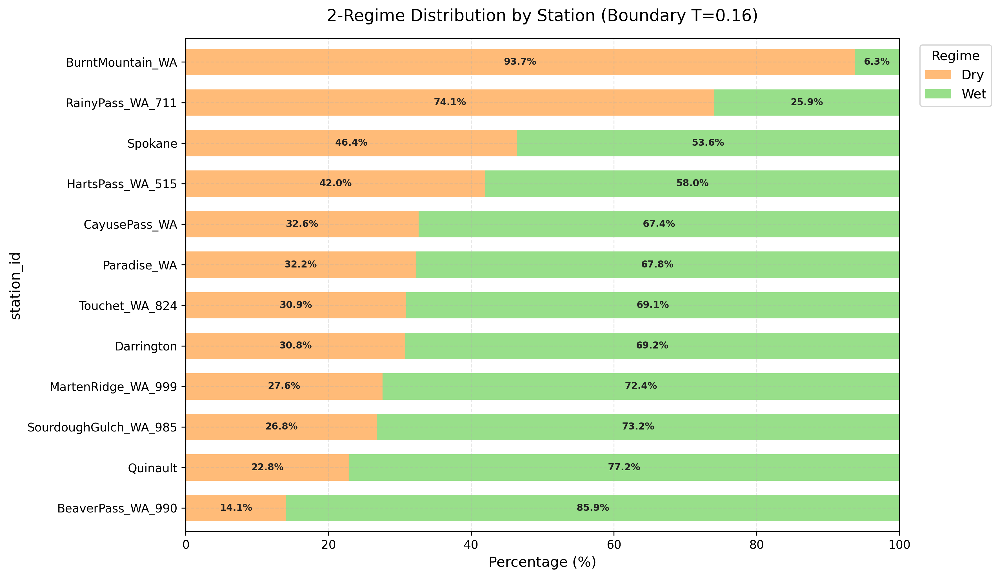

### Individual Target Histograms
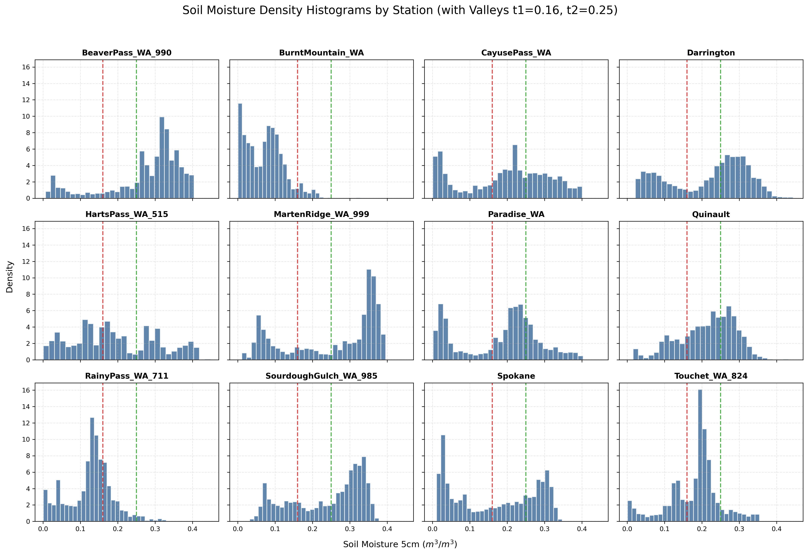
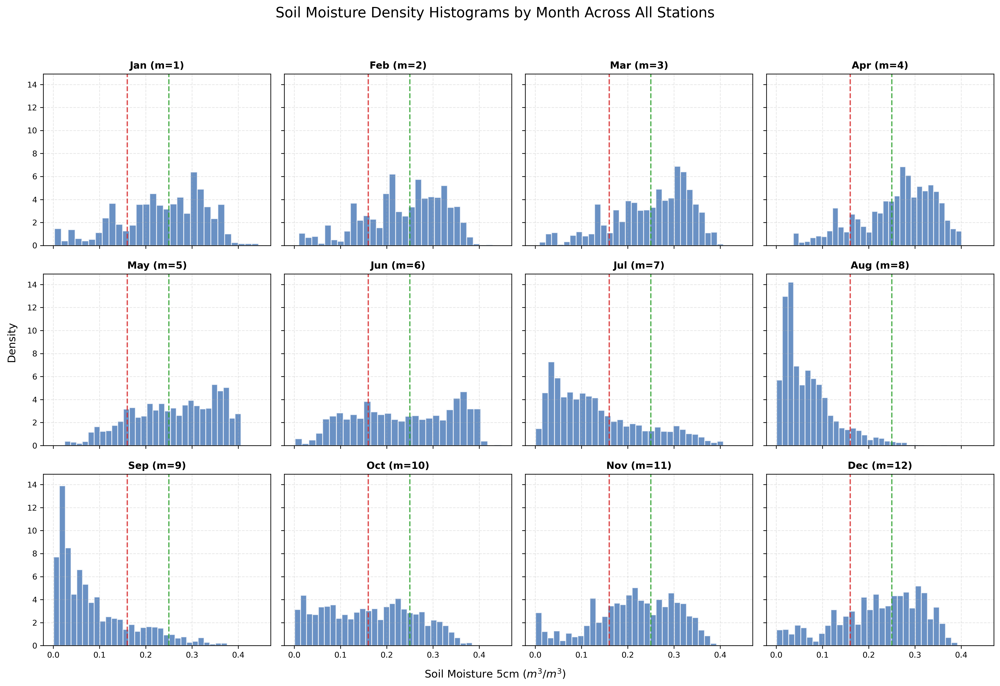

---

## 4. Seasonal and Annual Regime Trends

### Monthly Regime Proportions
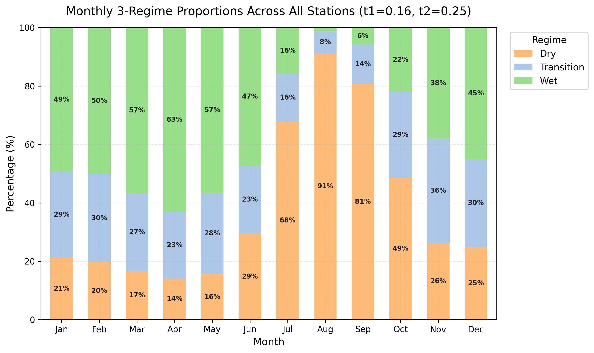
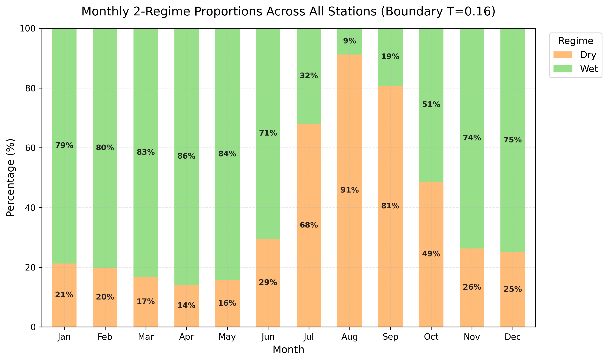

### Annual Regime Distributions (2017–2025)
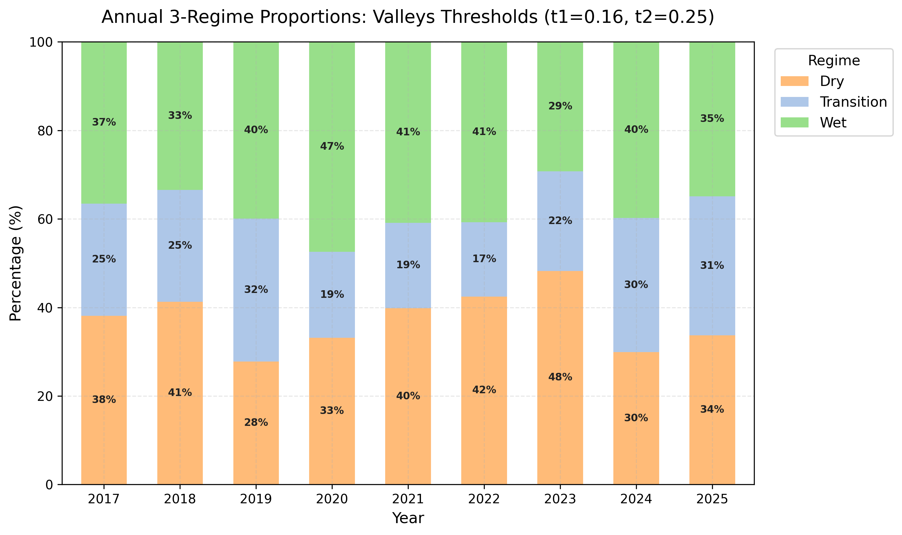
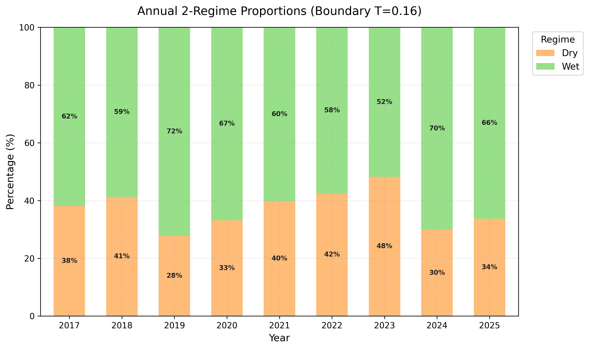

---

## 5. Station Data Entry Counts by Year & Missingness Analysis

To evaluate whether certain stations miss substantial observation periods, we computed yearly observation counts per station across 2017–2025.

### Data Entry Counts Matrix (Station × Year)

| Station ID | 2017 | 2018 | 2019 | 2020 | 2021 | 2022 | 2023 | 2024 | 2025 | Total Obs | Train | Val | Test |
|:---|:---:|:---:|:---:|:---:|:---:|:---:|:---:|:---:|:---:|:---:|:---:|:---:|:---:|
| **BeaverPass_WA_990** | 365 | 364 | 365 | 365 | 361 | 365 | 365 | 225 | 36 | **2,811** | 1,459 | 726 | 626 |
| **BurntMountain_WA** | 332 | 194 | **0** | 221 | 258 | 232 | 190 | 7 | 49 | **1,483** | 747 | 490 | 246 |
| **CayusePass_WA** | 324 | 364 | 365 | 361 | 364 | 264 | 350 | 366 | 365 | **3,123** | 1,414 | 628 | 1,081 |
| **Darrington** | 340 | 350 | 324 | 363 | 335 | 336 | 317 | 350 | 332 | **3,047** | 1,377 | 671 | 999 |
| **HartsPass_WA_515** | 91 | 365 | 343 | 272 | 199 | 241 | 19 | 70 | **0** | **1,600** | 1,071 | 440 | 89 |
| **MartenRidge_WA_999** | 365 | 365 | 365 | 359 | 359 | 354 | 361 | 348 | 81 | **2,957** | 1,454 | 713 | 790 |
| **Paradise_WA** | 363 | 365 | 365 | 366 | 365 | 365 | 365 | 337 | 365 | **3,256** | 1,459 | 730 | 1,067 |
| **Quinault** | 353 | 364 | 364 | 366 | 351 | 362 | 323 | 361 | 360 | **3,204** | 1,447 | 713 | 1,044 |
| **RainyPass_WA_711** | 344 | 360 | 365 | 352 | 365 | 336 | 361 | 280 | 345 | **3,108** | 1,421 | 701 | 986 |
| **SourdoughGulch_WA_985** | 365 | 365 | 365 | 366 | 365 | 365 | 365 | 366 | 175 | **3,097** | 1,461 | 730 | 906 |
| **Spokane** | 273 | 307 | 274 | 332 | 330 | 277 | 261 | 327 | 309 | **2,690** | 1,186 | 607 | 897 |
| **Touchet_WA_824** | 305 | 309 | 337 | 257 | **0** | **0** | **0** | 90 | 81 | **1,379** | 1,208 | **0** | 171 |

### Data Entry Count Heatmap & Bar Chart
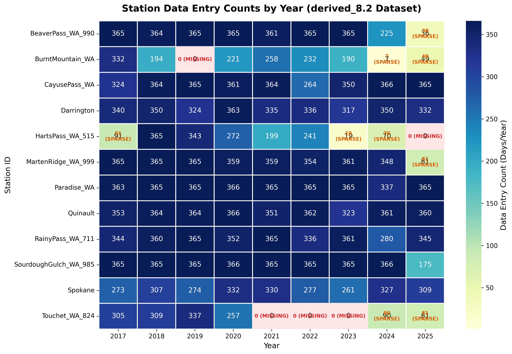
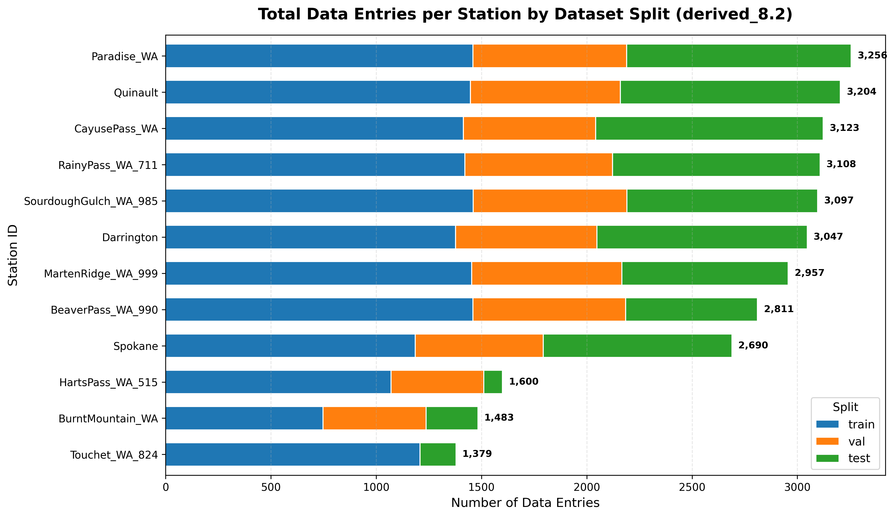

### Key Takeaways on Data Missingness:
1. **`Touchet_WA_824` Temporal Void**: Missing 2021, 2022, and 2023 entirely (3 full years!), and has 0 rows in the validation set. This creates a severe temporal gap when models trained on pre-2021 data are evaluated on post-2023 test data.
2. **`BurntMountain_WA` High Sparsity**: Missing 2019 completely, with low annual counts in 2018 (194), 2023 (190), 2024 (7), and 2025 (49). Total rows = 1,483 (less than half of standard stations).
3. **`HartsPass_WA_515` Truncation**: Completely missing 2025, with near-zero entries in 2023 (19 rows) and 2024 (70 rows).

---

## 6. Soil Moisture vs. Precipitation Station Diagnostics & Model Failure Analysis

We cross-referenced model evaluation performance from `derived_8.2-eval-3.3` with soil moisture vs. precipitation metrics per station:

### Station Hydrological Coupling & Model Performance Summary

| Station ID | Total Obs | Mean SM | SM Std | Near-Zero SM (<0.01) | Precip Mean (mm) | API Mean | Corr(SM, Precip) | Corr(SM, G_API) | Global Baseline $R^2$ | MoE Cluster $R^2$ |
|:---|:---:|:---:|:---:|:---:|:---:|:---:|:---:|:---:|:---:|:---:|
| **Spokane** | 2,690 | 0.1683 | 0.1107 | 0.0% | 1.18 | 11.79 | 0.2440 | **0.7019** | **0.912** | 0.907 |
| **Darrington** | 3,047 | 0.2192 | 0.1045 | 0.0% | 6.21 | 62.11 | 0.3991 | **0.7172** | **0.785** | 0.812 |
| **Quinault** | 3,204 | 0.2146 | 0.0746 | 0.0% | 9.26 | 92.44 | 0.4098 | **0.6230** | **0.742** | 0.751 |
| **Paradise_WA** | 3,256 | 0.1828 | 0.1047 | 1.0% | 7.19 | 71.78 | 0.0866 | 0.2687 | **0.730** | 0.725 |
| **SourdoughGulch_WA_985** | 3,097 | 0.2390 | 0.0958 | 0.0% | 2.20 | 22.06 | 0.1422 | **0.5865** | **0.695** | 0.710 |
| **CayusePass_WA** | 3,123 | 0.1960 | 0.1138 | 4.1% | 4.62 | 46.19 | 0.0838 | 0.2634 | **0.690** | 0.702 |
| **BeaverPass_WA_990** | 2,811 | 0.2773 | 0.0999 | 0.1% | 5.04 | 50.32 | 0.1156 | 0.3425 | **0.681** | 0.688 |
| **HartsPass_WA_515** | 1,600 | 0.1921 | 0.1110 | 1.4% | 3.31 | 32.98 | **-0.0709** | **-0.0673** | 0.540 | 0.528 |
| **RainyPass_WA_711** | 3,108 | 0.1267 | 0.0601 | 3.4% | 3.92 | 39.50 | 0.0653 | 0.1723 | 0.501 | 0.498 |
| **MartenRidge_WA_999** | 2,957 | 0.2565 | 0.1228 | 0.0% | 8.03 | 80.06 | 0.1305 | 0.3780 | **-0.186** | -0.135 |
| **BurntMountain_WA** | 1,483 | 0.0733 | 0.0504 | **11.1%** | 6.13 | 63.64 | **-0.0037** | **0.1042** | **-0.783** | -1.158 |
| **Touchet_WA_824** | 1,379 | 0.1808 | 0.0692 | 2.2% | 3.28 | 33.12 | 0.1325 | 0.3670 | **-1.621** | **+0.171** |

---

### Visualization Figures

#### 1. Soil Moisture vs Daily Precipitation (`precip_mm`)
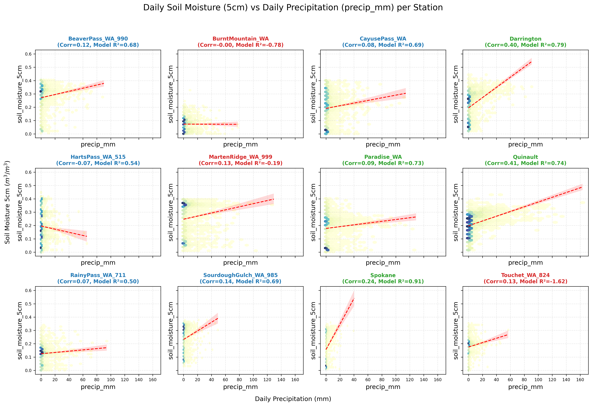

#### 2. Soil Moisture vs Antecedent Precipitation Index (`G_API`)
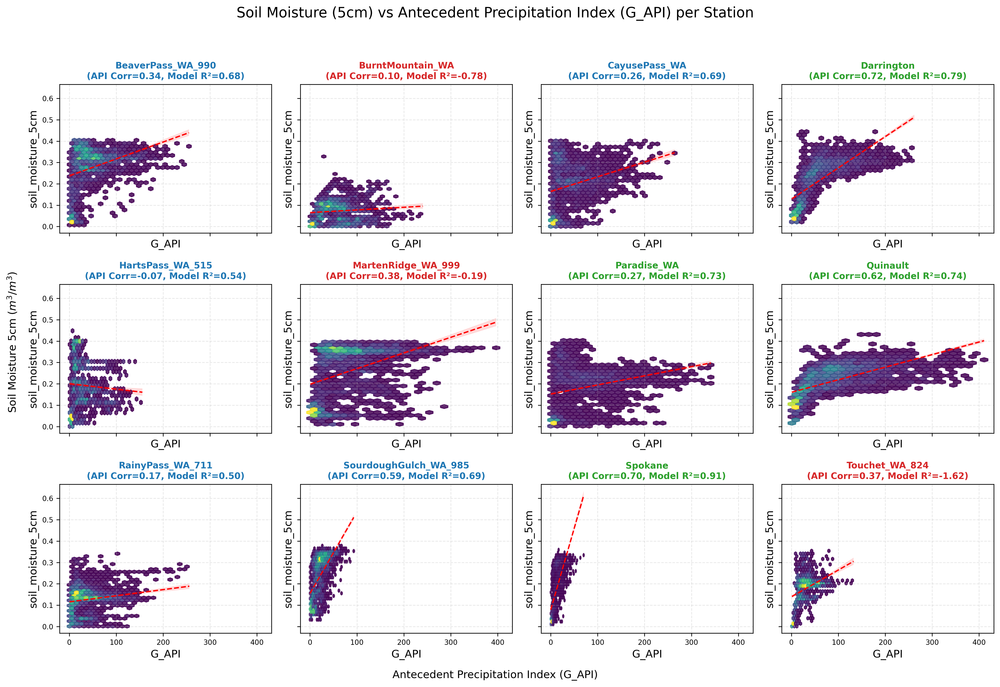

#### 3. Hydrological Coupling Strength vs Model Performance $R^2$
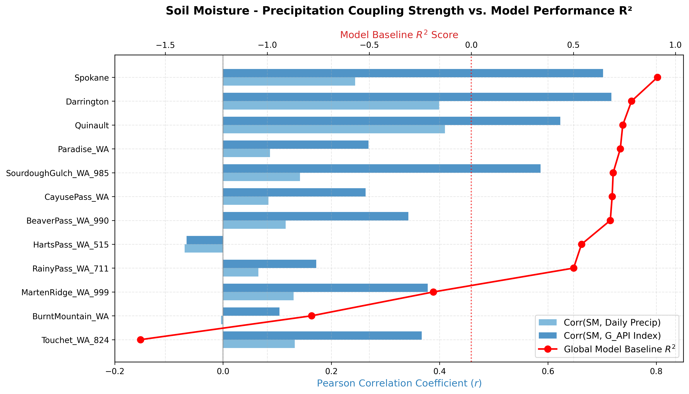

#### 4. Diagnostic Time Series Comparison
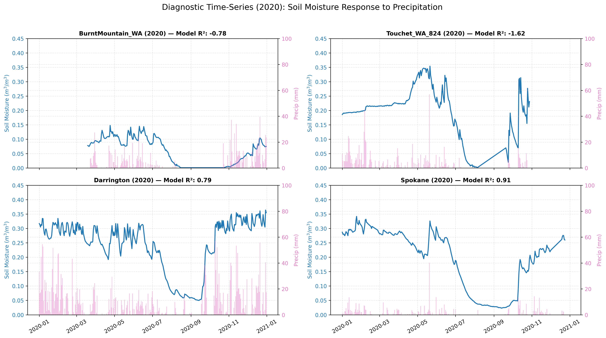

---

### Diagnostic Case Studies on Problem Stations:

#### 1. `BurntMountain_WA` (Baseline $R^2 = -0.783$, MoE $R^2 = -1.158$)
- **Physical Anomaly**: `BurntMountain_WA` receives heavy rainfall (mean 6.13 mm/day, API mean 63.6), yet its mean soil moisture is extremely low (0.073) and 11.1% of all days have near-zero moisture ($< 0.01$).
- **Decoupling**: There is zero linear correlation between daily precipitation and soil moisture ($r = -0.0037$), and antecedent rain correlation is minimal ($r_{API} = 0.104$).
- **Diagnosis**: 131 days feature heavy rainfall ($> 10\text{ mm}$) while soil moisture remains stuck below $0.05$. This indicates either an uncalibrated/faulty sensor, shallow/rocky soil texture causing immediate runoff, or sensor installation depth misalignment.

#### 2. `Touchet_WA_824` (Baseline $R^2 = -1.621$, MoE $R^2 = +0.171$)
- **Data Gap Anomaly**: Missing 3 full consecutive years (2021, 2022, 2023) and 0 validation samples.
- **Diagnosis**: Global baseline models fail completely ($R^2 = -1.621$) due to severe distribution shift across the multi-year temporal gap. However, the MoE Clustering Dynamic specialist model recovers positive performance ($R^2 = +0.171$, a $+1.791 \Delta R^2$ gain) by routing test observations to regime specialists trained on similar physical states.

#### 3. `HartsPass_WA_515` (Baseline $R^2 = 0.540$)
- **Snowpack Decoupling**: SNOTEL site 515 is a high-altitude alpine station. It displays negative precipitation correlation ($r = -0.0709$, $r_{API} = -0.0673$).
- **Diagnosis**: During winter, heavy precipitation accumulates as frozen snowpack on the surface without infiltrating the 5cm soil layer. During late spring/summer, warmer temperatures melt snowpack causing soil moisture surges while precipitation drops to near zero.

---

## Reproducibility & Executable Scripts

All analysis scripts and notebook files in this directory are fully self-contained and reproducible using `uv`:

- **Main Jupyter Notebook**: [derived_8.2-data-exploration.ipynb](./derived_8.2-data-exploration.ipynb)
- **Regime & Quantile Analysis**: [analyze_regimes.py](./analyze_regimes.py)
- **Valley Calibration**: [calibrate_valleys.py](./calibrate_valleys.py)
- **Seasonal Analysis**: [analyze_seasonal_regimes.py](./analyze_seasonal_regimes.py)
- **Annual Breakdown**: [analyze_annual_regimes.py](./analyze_annual_regimes.py)
- **Station Data Entries & Missingness**: [analyze_station_data_entry_counts.py](./analyze_station_data_entry_counts.py)
- **Soil Moisture vs Precipitation Diagnostics**: [analyze_sm_vs_precip.py](./analyze_sm_vs_precip.py)

To re-run the entire pipeline from `notebooks/`:

```bash
cd notebooks
uv run python experiment/derived_8.2-data-exploration/analyze_station_data_entry_counts.py
uv run python experiment/derived_8.2-data-exploration/analyze_regimes.py
uv run python experiment/derived_8.2-data-exploration/calibrate_valleys.py
uv run python experiment/derived_8.2-data-exploration/analyze_sm_vs_precip.py
nb execute experiment/derived_8.2-data-exploration/derived_8.2-data-exploration.ipynb --uv
```
