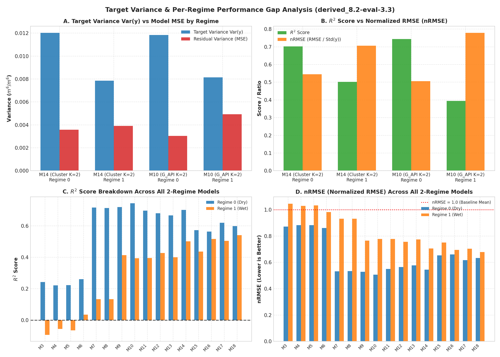
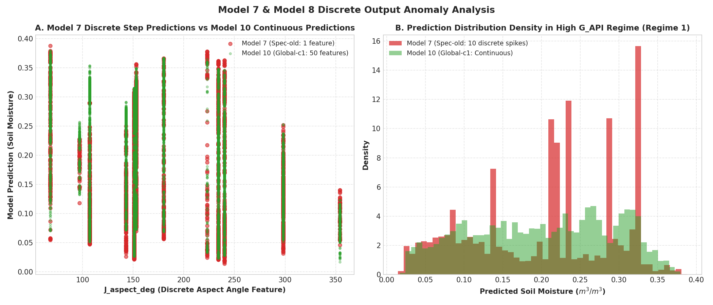
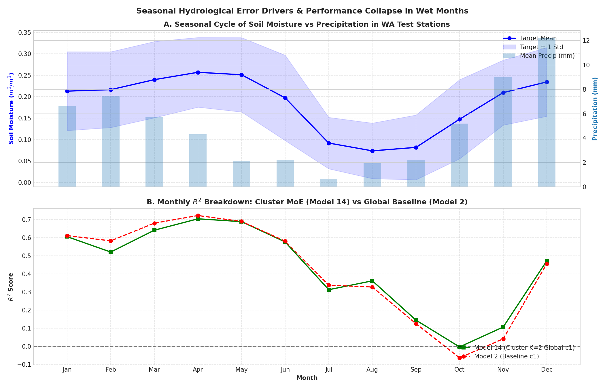

# derived_8.2-error-analysis-1.0 — Diagnostic Error & Regime Gap Analysis

This experiment provides a rigorous diagnostic error analysis investigating two primary empirical anomalies identified in `derived_8.2-eval-3.3`:
1. **Per-Regime Performance Gap**: Across all 2-regime MoE models and global baselines, Regime 0 (dry/low moisture) yields consistently high performance ($R^2 \approx 0.66\text{--}0.74$, $\text{RMSE} \approx 0.055\text{--}0.060$) while Regime 1 (wet/high moisture) suffers a severe performance drop ($R^2 \approx -0.09\text{--}0.54$, $\text{RMSE} \approx 0.060\text{--}0.084$).
2. **Model 7 & Model 8 Discrete Predictions**: Model 7 (`Univariate G_API K=2 Spec-old`) and Model 8 (`Univariate G_API K=2 Spec-new`) output discrete step predictions in Regime 1 instead of continuous predictions.

---

## Key Diagnostic Findings & Root Causes

### 1. Root Cause of Model 7 & Model 8 Discrete Step Predictions

- **Single Feature Selection Deficit**: In both `previous_features.json` (`Spec-old`) and `selected_features.json` (`Spec-new`), the feature selection lab (`soilmoist-fl`) selected **ONLY ONE single feature** for `Univariate_G_API_k2` Cluster 1 (wet/high antecedent moisture): `J_aspect_deg`.
- **Static Spatial Attribute**: `J_aspect_deg` is a static spatial attribute (soil aspect angle in degrees) that takes only **12 unique discrete values** across all Washington stations in the dataset (68°, 97°, 107°, 143°, 151°, 153°, 180°, 223°, 234°, 240°, 298°, 354°).
- **Time-Invariant Constant Predictions**: An XGBoost tree trained on a single static spatial feature can only split on aspect boundaries, producing **time-invariant constant step predictions** for each station (e.g. constant 0.2922 for station 68°, constant 0.1956 for station 97°).
- **Resolution**: Models 9 and 10 (`Global-V3` and `Global-c1`), which share the same `Univariate G_API K=2` partitioning but pass 47–50 continuous features to Cluster 1, achieve continuous prediction curves and eliminate discrete step artifacts ($R^2 = 0.3943\text{--}0.4142$).

| Aspect Angle (`J_aspect_deg`) | Station Sample Count ($N$) | Model 7 Pred Mean | Model 7 Pred Std | Ground Truth Target Mean | Ground Truth Target Std |
|:-----------------------------:|:--------------------------:|:-----------------:|:----------------:|:------------------------:|:-----------------------:|
| 68° | 626 | 0.2922 | 0.0689 | 0.2345 | 0.0912 |
| 97° | 171 | 0.1956 | 0.0173 | 0.1985 | 0.0304 |
| 107° | 999 | 0.2175 | 0.0933 | 0.2042 | 0.0935 |
| 143° | 1044 | 0.1993 | 0.0600 | 0.2410 | 0.0694 |
| 151° | 895 | 0.1601 | 0.1036 | 0.1599 | 0.1149 |
| 153° | 906 | 0.2423 | 0.0828 | 0.2382 | 0.0802 |
| 180° | 790 | 0.2884 | 0.0830 | 0.1862 | 0.1075 |
| 223° | 89 | 0.1717 | 0.1326 | 0.1538 | 0.1487 |
| 234° | 1081 | 0.1939 | 0.0868 | 0.1888 | 0.1195 |
| 240° | 1067 | 0.1927 | 0.0764 | 0.1697 | 0.0985 |
| 298° | 986 | 0.1296 | 0.0371 | 0.1110 | 0.0747 |
| 354° | 246 | 0.0888 | 0.0135 | 0.0413 | 0.0436 |

---

### 2. Dissecting the Per-Regime Performance Gap

The performance drop in Regime 1 across models is driven by **three compounding factors**:

#### A. Target Variance Compression ($\text{Var}(y)$ Effect)
- $R^2$ is defined as $1 - \frac{\text{MSE}}{\text{Var}(y)}$.
- In `Clustering Dynamic K=2` (Model 14), target variance in Regime 1 ($\text{Var}(y) = 0.007846$) is **35% lower** than in Regime 0 ($\text{Var}(y) = 0.012017$).
- Because the denominator $\text{Var}(y)$ is smaller in Regime 1, a small increase in $\text{MSE}$ (0.003910 vs 0.003573) leads to a disproportionately larger drop in $R^2$ (0.5016 vs 0.7027).
- When evaluated with normalized RMSE ($\text{nRMSE} = \frac{\text{RMSE}}{\text{Std}(y)}$), the true relative error ratio between regimes is **0.7060 vs 0.5453**, showing that relative error increases by ~29%, not the apparent 40% drop suggested by raw $R^2$.

#### B. Gating Misrouting Penalties (Models 3–6)
- Trained binary gating router classifiers exhibit a ~12.6% error rate on unseen test samples.
- When wet-regime samples near the boundary ($SM \approx 0.16$) are misrouted to a dry-regime specialist trained exclusively on dry soil dynamics, the specialist severely underpredicts soil moisture, driving $\text{MSE} > \text{Var}(y)$ and causing negative $R^2$ ($R^2 = -0.0938\text{--}+0.0350$).

#### C. Autumn Rainfall Transition Spike (October Crash)
- Monthly breakdown of top model performance (Model 14) reveals that performance crashes specifically during **October** ($R^2 = -0.0039$, $\text{RMSE} = 0.0924$ $m^3/m^3$).
- In October, Washington soil transitions from summer drought to heavy autumn rain (Mean Precip = 5.18 mm). Rapid infiltration and non-linear wetting fronts on parched soil create large prediction errors.
- Once winter rain stabilizes in December, soil saturation levels plateau and model performance recovers to $R^2 = 0.4725$.

---

## Detailed Per-Regime Metric & Target Variance Table

| Model ID | Model Name | Strategy | Arm | $\text{Var}(y)_{\text{R0}}$ | $\text{MSE}_{\text{R0}}$ | $R^2_{\text{R0}}$ | $\text{nRMSE}_{\text{R0}}$ | $\text{Var}(y)_{\text{R1}}$ | $\text{MSE}_{\text{R1}}$ | $R^2_{\text{R1}}$ | $\text{nRMSE}_{\text{R1}}$ |
|:--------:|------------|----------|-----|:--------------------------:|:-----------------------:|:-----------------:|:--------------------------:|:--------------------------:|:-----------------------:|:-----------------:|:--------------------------:|
| 3 | Model 3: Trained Gating K=2 (Spec-old) | Trained Gating | Spec-old | 0.004319 | 0.003275 | 0.2418 | 0.8708 | 0.005054 | 0.005527 | -0.0938 | 1.0458 |
| 4 | Model 4: Trained Gating K=2 (Spec-new) | Trained Gating | Spec-new | 0.004319 | 0.003365 | 0.2208 | 0.8827 | 0.005054 | 0.005341 | -0.0569 | 1.0280 |
| 5 | Model 5: Trained Gating K=2 (Global-V3) | Trained Gating | Global-V3 | 0.004319 | 0.003357 | 0.2228 | 0.8816 | 0.005054 | 0.005380 | -0.0646 | 1.0318 |
| 6 | Model 6: Trained Gating K=2 (Global-c1) | Trained Gating | Global-c1 | 0.004319 | 0.003195 | 0.2602 | 0.8601 | 0.005054 | 0.004876 | +0.0350 | 0.9823 |
| 7 | Model 7: Univariate G_API K=2 (Spec-old) | Univariate G_API | Spec-old | 0.011846 | 0.003344 | 0.7177 | 0.5313 | 0.008141 | 0.007055 | +0.1335 | 0.9309 |
| 8 | Model 8: Univariate G_API K=2 (Spec-new) | Univariate G_API | Spec-new | 0.011846 | 0.003384 | 0.7143 | 0.5345 | 0.008141 | 0.007055 | +0.1335 | 0.9309 |
| 9 | Model 9: Univariate G_API K=2 (Global-V3) | Univariate G_API | Global-V3 | 0.011846 | 0.003314 | 0.7202 | 0.5289 | 0.008141 | 0.004769 | +0.4142 | 0.7653 |
| 10 | Model 10: Univariate G_API K=2 (Global-c1) | Univariate G_API | Global-c1 | 0.011846 | 0.003033 | 0.7440 | 0.5060 | 0.008141 | 0.004931 | +0.3943 | 0.7782 |
| 11 | Model 11: Clustering Dynamic K=2 (Spec-old) | Clustering Dynamic | Spec-old | 0.012017 | 0.003642 | 0.6969 | 0.5505 | 0.007846 | 0.004745 | +0.3953 | 0.7776 |
| 12 | Model 12: Clustering Dynamic K=2 (Spec-new) | Clustering Dynamic | Spec-new | 0.012017 | 0.003838 | 0.6807 | 0.5651 | 0.007846 | 0.004492 | +0.4275 | 0.7567 |
| 13 | Model 13: Clustering Dynamic K=2 (Global-V3) | Clustering Dynamic | Global-V3 | 0.012017 | 0.004004 | 0.6668 | 0.5772 | 0.007846 | 0.004703 | +0.4006 | 0.7742 |
| 14 | **Model 14: Clustering Dynamic K=2 (Global-c1)** | **Clustering Dynamic** | **Global-c1** | **0.012017** | **0.003573** | **0.7027** | **0.5453** | **0.007846** | **0.003910** | **+0.5016** | **0.7060** |
| 15 | Model 15: Seasonal Binary K=2 (Spec-old) | Seasonal Binary | Spec-old | 0.011060 | 0.004723 | 0.5730 | 0.6535 | 0.007494 | 0.004226 | +0.4360 | 0.7510 |
| 16 | Model 16: Seasonal Binary K=2 (Spec-new) | Seasonal Binary | Spec-new | 0.011060 | 0.004828 | 0.5635 | 0.6607 | 0.007494 | 0.003621 | +0.5168 | 0.6951 |
| 17 | Model 17: Seasonal Binary K=2 (Global-V3) | Seasonal Binary | Global-V3 | 0.011060 | 0.004201 | 0.6202 | 0.6163 | 0.007494 | 0.003706 | +0.5055 | 0.7032 |
| 18 | Model 18: Seasonal Binary K=2 (Global-c1) | Seasonal Binary | Global-c1 | 0.011060 | 0.004440 | 0.5985 | 0.6336 | 0.007494 | 0.003440 | +0.5410 | 0.6775 |

---

## Monthly Hydrological Breakdown (Model 14 vs Baseline)

| Month | Month Name | Sample Count ($N$) | Target Mean | Target Var $\text{Var}(y)$ | Mean Precip (mm) | Model 14 RMSE | Model 14 $R^2$ |
|:-----:|:----------:|:------------------:|:-----------:|:--------------------------:|:----------------:|:-------------:|:--------------:|
| 1 | Jan | 779 | 0.2130 | 0.0084 | 6.61 | 0.0577 | 0.6063 |
| 2 | Feb | 701 | 0.2164 | 0.0078 | 7.48 | 0.0611 | 0.5211 |
| 3 | Mar | 825 | 0.2397 | 0.0079 | 5.72 | 0.0532 | 0.6419 |
| 4 | Apr | 780 | 0.2569 | 0.0066 | 4.33 | 0.0441 | **0.7049** |
| 5 | May | 807 | 0.2512 | 0.0075 | 2.13 | 0.0483 | 0.6895 |
| 6 | Jun | 801 | 0.1973 | 0.0099 | 2.19 | 0.0647 | 0.5771 |
| 7 | Jul | 753 | 0.0919 | 0.0036 | 0.66 | 0.0497 | 0.3128 |
| 8 | Aug | 699 | 0.0737 | 0.0042 | 1.93 | 0.0517 | 0.3619 |
| 9 | Sep | 688 | 0.0818 | 0.0057 | 2.16 | 0.0698 | 0.1445 |
| 10 | Oct | 709 | 0.1474 | 0.0085 | 5.18 | 0.0924 | **-0.0039** |
| 11 | Nov | 637 | 0.2095 | 0.0057 | 8.98 | 0.0717 | 0.1061 |
| 12 | Dec | 723 | 0.2345 | 0.0064 | 12.22 | 0.0582 | 0.4725 |

---

## Visual Diagnostic Artifacts

### 1. Target Variance & Per-Regime $R^2$ / nRMSE Analysis

### 2. Model 7 & Model 8 Discrete Step Function Analysis

### 3. Monthly Hydrological Residual & Target Variance Cycle

---

## Actionable Recommendations

1. **Enforce Minimum Feature Threshold in Feature Selection Pipeline**:
   - Update `soilmoist_fl` / `run_feature_selection.py` to enforce a mandatory minimum feature count cutoff (e.g. $\ge 15\text{--}20$ features per regime).
   - Prevent feature selection from collapsing to single static spatial variables like `J_aspect_deg`.

2. **Soft Gating / Continuous Blending for MoE Models**:
   - Hard binary switching in MoE routers (Models 3–6) penalizes boundary samples.
   - Replace hard router assignments with soft probabilistic weighting: $\hat{y} = w_0(x) \hat{y}_0(x) + w_1(x) \hat{y}_1(x)$, where $w_k(x) = \text{sigmoid}(g(x))$.

3. **Specialized Transition-Regime Feature Engineering**:
   - Feature engineering should incorporate short-term wetting rate features (e.g. 1-day to 3-day precipitation acceleration $\Delta \text{rain}$) to handle the October autumn transition phase.
