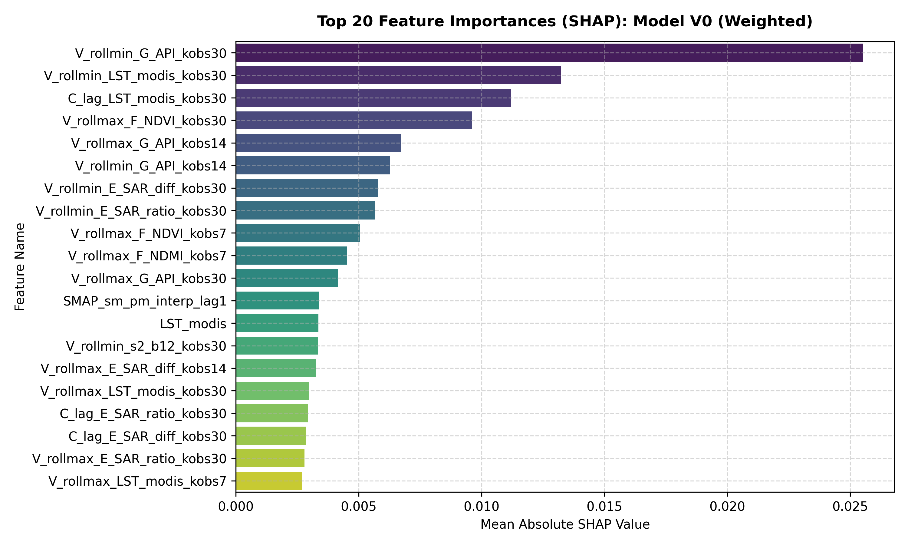
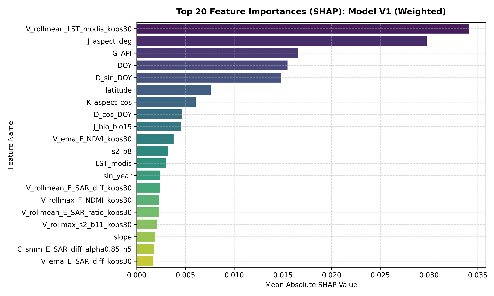
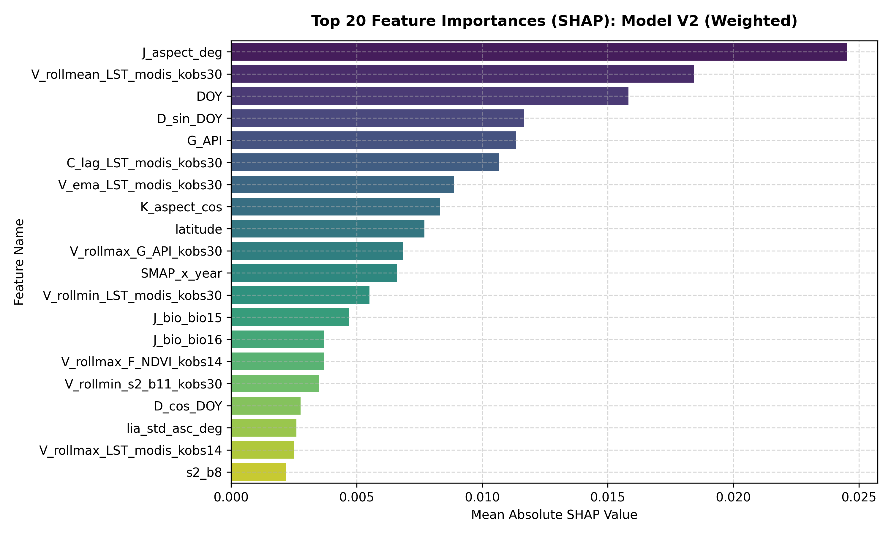
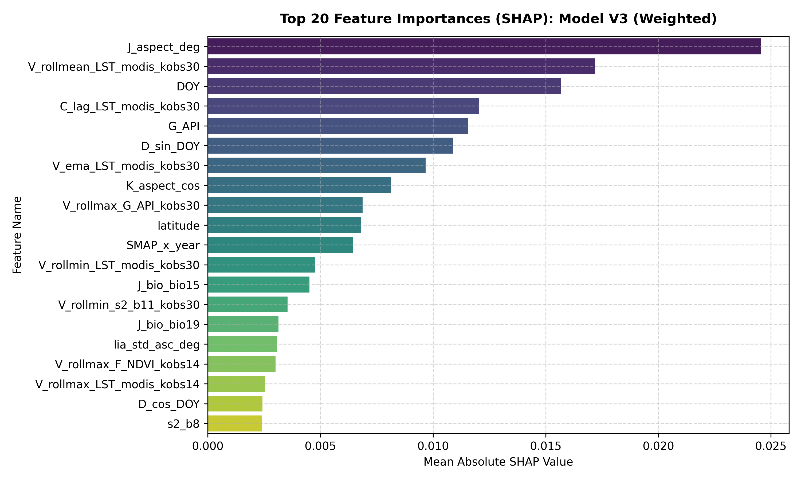
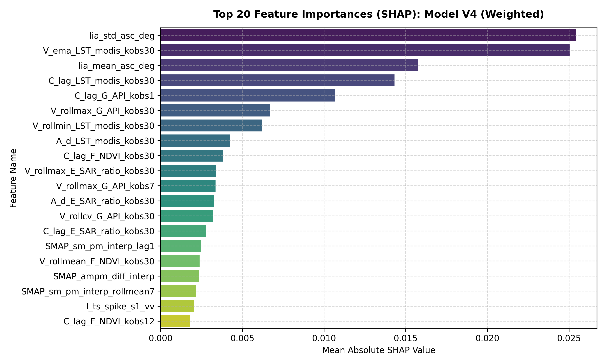
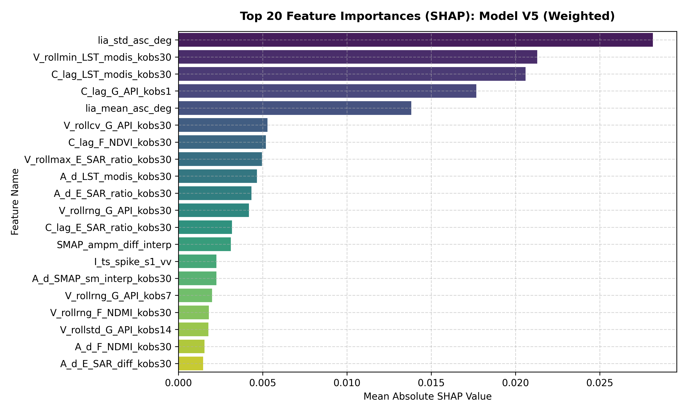

# Features Analysis: Models V0, V1, V2, V3, V4, and V5 Comparison

This document provides a detailed comparative analysis of the features used by **Model V0 (40 features)**, **Model V1 (40 features)**, **Model V2 (40 features)**, **Model V3 (47 features)**, **Model V4 (50 features)**, and **Model V5 (32 features)** on the Washington-only `derived_8.2` dataset.

---

## 1. Feature Selection Configurations & Pipeline Context

The six feature sets represent the chronological and architectural evolution of the soil moisture modeling pipeline:

1. **Model V0 (40 Features)**:
   - **Pipeline Context**: Represents the **flawed initial baseline** that used the original pipeline settings. It relies heavily on rolling operators (`V_*`) and autoregressive lags (`C_lag_*`), completely omitting critical static soil attributes (HWSD Clay/Sand fractions) and bioclimatic statistics. 

2. **Model V1 (40 Features)**:
   - **Pipeline Context**: The baseline pipeline stage. **No SMAP soil moisture data** was integrated yet. The pipeline also had **no autoregressive lags (`C_lag_`)**, **no temporal differences (`A_d_`)**, and **no temporal gradients (`A_grad_`)**. It relied heavily on raw observations and seasonal anomalies.

3. **Model V2 (40 Features)**:
   - **Pipeline Context**: The **Temporal Refinement stage**. This pipeline integrated coarse-scale SMAP soil moisture as a primary physical prior, and introduced structured temporal differences (`A_d_`), linear gradients (`A_grad_`), and autoregressive lags (`C_lag_`) calculated over local observation (`kobs`) windows to smooth out sensor noise and model temporal memory.

4. **Model V3 (47 Features)**:
   - **Pipeline Context**: The **Expanded Feature stage** (highest performer, $R^2 = 0.6474$). This pipeline added advanced spectral Fourier features (`D_fft_`) to capture temperature periodicities and multi-temporal Sentinel-1 roughness proxies (`E_rough_`) to decouple canopy/surface roughness from soil moisture dielectric changes.

5. **Model V4 (50 Features)**:
   - **Pipeline Context**: **No MI stage** $\rightarrow$ ElasticNet linear selection $\rightarrow$ Bootstrap Stability Selection. Keeps all features with bootstrap frequency above 1%, sorting to select the top 50.

6. **Model V5 (32 Features)**:
   - **Pipeline Context**: **No MI stage** $\rightarrow$ ElasticNet linear selection $\rightarrow$ Bootstrap Stability Selection. Restores strict stability frequency threshold of 60% (retaining only the top 32 most stable features from the V4 selection).

---

## 2. Category Summary Table

The table below breaks down the number of features selected in each category across the six models, as well as their Union (all unique features across all configurations):

| Feature Category | V0 (40) | V1 (40) | V2 (40) | V3 (47) | V4 (50) | V5 (32) | Union (133) | Description |
| :--- | :---: | :---: | :---: | :---: | :---: | :---: | :---: | :--- |
| **Autoregressive Lag (C_lag_)** | 11 | 0 | 2 | 2 | 5 | 4 | 14 |
| **Bioclimatic Variable (J_bio_)** | 0 | 2 | 5 | 3 | 0 | 0 | 6 |
| **Hydrologic / Precipitation (G_)** | 0 | 1 | 2 | 2 | 0 | 0 | 2 |
| **Local Incidence Angle (lia_)** | 0 | 1 | 1 | 1 | 2 | 2 | 2 |
| **Raw Input (RAW)** | 2 | 9 | 4 | 5 | 0 | 0 | 9 |
| **Rolling / Moving Average (V_)** | 21 | 14 | 10 | 12 | 21 | 11 | 53 |
| **SMAP Interpolations (SMAP_)** | 4 | 0 | 2 | 2 | 5 | 3 | 9 |
| **Seasonal / Calendar (D_)** | 2 | 9 | 3 | 4 | 0 | 0 | 10 |
| **Spectral Fourier (D_fft_)** | 0 | 0 | 0 | 2 | 0 | 0 | 2 |
| **Static GIS / Soil (J_ / K_)** | 0 | 4 | 6 | 6 | 0 | 0 | 6 |
| **Surface Roughness Proxy (E_rough_)** | 0 | 0 | 0 | 2 | 2 | 1 | 4 |
| **Temporal Anomalous Spike (I_)** | 0 | 0 | 0 | 0 | 1 | 1 | 1 |
| **Temporal Difference (A_d_)** | 0 | 0 | 3 | 3 | 7 | 5 | 8 |
| **Temporal Gradient (A_grad_)** | 0 | 0 | 2 | 3 | 7 | 5 | 7 |

---

## 3. SHAP Feature Importance Analysis

We conducted SHAP analysis on all 6 weighted models to identify their top drivers and understand their physical representations:

### Model V0 (Weighted)

Top 10 features sorted by mean absolute SHAP value:
1. **`V_rollmin_G_API_kobs30`** (SHAP = 0.025526)
2. **`V_rollmin_LST_modis_kobs30`** (SHAP = 0.013231)
3. **`C_lag_LST_modis_kobs30`** (SHAP = 0.011205)
4. **`V_rollmax_F_NDVI_kobs30`** (SHAP = 0.009617)
5. **`V_rollmax_G_API_kobs14`** (SHAP = 0.006719)
6. **`V_rollmin_G_API_kobs14`** (SHAP = 0.006281)
7. **`V_rollmin_E_SAR_diff_kobs30`** (SHAP = 0.005784)
8. **`V_rollmin_E_SAR_ratio_kobs30`** (SHAP = 0.005659)
9. **`V_rollmax_F_NDVI_kobs7`** (SHAP = 0.005051)
10. **`V_rollmax_F_NDMI_kobs7`** (SHAP = 0.004530)

### Model V1 (Weighted)

Top 10 features sorted by mean absolute SHAP value:
1. **`V_rollmean_LST_modis_kobs30`** (SHAP = 0.034121)
2. **`J_aspect_deg`** (SHAP = 0.029759)
3. **`G_API`** (SHAP = 0.016553)
4. **`DOY`** (SHAP = 0.015474)
5. **`D_sin_DOY`** (SHAP = 0.014791)
6. **`latitude`** (SHAP = 0.007577)
7. **`K_aspect_cos`** (SHAP = 0.006054)
8. **`D_cos_DOY`** (SHAP = 0.004628)
9. **`J_bio_bio15`** (SHAP = 0.004580)
10. **`V_ema_F_NDVI_kobs30`** (SHAP = 0.003786)

### Model V2 (Weighted)

Top 10 features sorted by mean absolute SHAP value:
1. **`J_aspect_deg`** (SHAP = 0.024525)
2. **`V_rollmean_LST_modis_kobs30`** (SHAP = 0.018433)
3. **`DOY`** (SHAP = 0.015831)
4. **`D_sin_DOY`** (SHAP = 0.011676)
5. **`G_API`** (SHAP = 0.011356)
6. **`C_lag_LST_modis_kobs30`** (SHAP = 0.010662)
7. **`V_ema_LST_modis_kobs30`** (SHAP = 0.008880)
8. **`K_aspect_cos`** (SHAP = 0.008311)
9. **`latitude`** (SHAP = 0.007694)
10. **`V_rollmax_G_API_kobs30`** (SHAP = 0.006837)

### Model V3 (Weighted)

Top 10 features sorted by mean absolute SHAP value:
1. **`J_aspect_deg`** (SHAP = 0.024576)
2. **`V_rollmean_LST_modis_kobs30`** (SHAP = 0.017188)
3. **`DOY`** (SHAP = 0.015674)
4. **`C_lag_LST_modis_kobs30`** (SHAP = 0.012039)
5. **`G_API`** (SHAP = 0.011540)
6. **`D_sin_DOY`** (SHAP = 0.010886)
7. **`V_ema_LST_modis_kobs30`** (SHAP = 0.009670)
8. **`K_aspect_cos`** (SHAP = 0.008126)
9. **`V_rollmax_G_API_kobs30`** (SHAP = 0.006876)
10. **`latitude`** (SHAP = 0.006797)

### Model V4 (Weighted)

Top 10 features sorted by mean absolute SHAP value:
1. **`lia_std_asc_deg`** (SHAP = 0.025436)
2. **`V_ema_LST_modis_kobs30`** (SHAP = 0.025062)
3. **`lia_mean_asc_deg`** (SHAP = 0.015743)
4. **`C_lag_LST_modis_kobs30`** (SHAP = 0.014323)
5. **`C_lag_G_API_kobs1`** (SHAP = 0.010701)
6. **`V_rollmax_G_API_kobs30`** (SHAP = 0.006690)
7. **`V_rollmin_LST_modis_kobs30`** (SHAP = 0.006189)
8. **`A_d_LST_modis_kobs30`** (SHAP = 0.004227)
9. **`C_lag_F_NDVI_kobs30`** (SHAP = 0.003799)
10. **`V_rollmax_E_SAR_ratio_kobs30`** (SHAP = 0.003402)

### Model V5 (Weighted)

Top 10 features sorted by mean absolute SHAP value:
1. **`lia_std_asc_deg`** (SHAP = 0.028155)
2. **`V_rollmin_LST_modis_kobs30`** (SHAP = 0.021291)
3. **`C_lag_LST_modis_kobs30`** (SHAP = 0.020598)
4. **`C_lag_G_API_kobs1`** (SHAP = 0.017670)
5. **`lia_mean_asc_deg`** (SHAP = 0.013821)
6. **`V_rollcv_G_API_kobs30`** (SHAP = 0.005288)
7. **`C_lag_F_NDVI_kobs30`** (SHAP = 0.005184)
8. **`V_rollmax_E_SAR_ratio_kobs30`** (SHAP = 0.004966)
9. **`A_d_LST_modis_kobs30`** (SHAP = 0.004660)
10. **`A_d_E_SAR_ratio_kobs30`** (SHAP = 0.004334)

---

## 4. Comprehensive Feature Catalog

Below is the complete catalog of all 133 unique features across all six models, along with their category and physical/mathematical interpretation:

| Feature Name | Category | Physical / Mathematical Interpretation |
| :--- | :--- | :--- |
| `A_d_E_SAR_diff_kobs30` | Temporal Difference (A_d_) | 30-obs difference in radar difference. Seasonal radar change trend. |
| `A_d_E_SAR_ratio_kobs14` | Temporal Difference (A_d_) | 14-obs difference in radar ratio. Sub-seasonal canopy shifts. |
| `A_d_E_SAR_ratio_kobs30` | Temporal Difference (A_d_) | 30-obs difference in radar ratio. Seasonal canopy-dielectric shifts. |
| `A_d_F_NDMI_kobs30` | Temporal Difference (A_d_) | 30-obs difference in NDMI. Tracks seasonal canopy moisture stress changes. |
| `A_d_LST_modis_kobs14` | Temporal Difference (A_d_) | 14-obs difference in MODIS LST. Sub-seasonal temperature shift. |
| `A_d_LST_modis_kobs30` | Temporal Difference (A_d_) | 30-obs difference in MODIS LST. Long-term thermal shifts. |
| `A_d_SMAP_sm_interp_kobs30` | Temporal Difference (A_d_) | 30-obs difference in SMAP. Long-term (6-month) regional soil trends. |
| `A_d_SMAP_sm_interp_kobs5` | Temporal Difference (A_d_) | 5-obs difference in SMAP. Captures short-term (1-2 weeks) regional shifts. |
| `A_grad_E_SAR_diff_kobs30` | Temporal Gradient (A_grad_) | 30-obs slope of radar difference. Rate of change of radar backscattering. |
| `A_grad_E_SAR_ratio_kobs14` | Temporal Gradient (A_grad_) | 14-obs slope of radar ratio. Sub-seasonal vegetation rate of change. |
| `A_grad_E_SAR_ratio_kobs30` | Temporal Gradient (A_grad_) | 30-obs slope of radar ratio. Rate of change of vegetation density/water content. |
| `A_grad_F_NDMI_kobs30` | Temporal Gradient (A_grad_) | 30-obs slope of NDMI. Rate of change of vegetation moisture stress. |
| `A_grad_LST_modis_kobs14` | Temporal Gradient (A_grad_) | 14-obs slope of LST. Sub-seasonal warming/cooling rate. |
| `A_grad_LST_modis_kobs30` | Temporal Gradient (A_grad_) | 30-obs slope of MODIS LST. Seasonal warming/cooling rate. |
| `A_grad_SMAP_sm_interp_kobs30` | Temporal Gradient (A_grad_) | 30-obs slope of SMAP. General rate of change of regional soil moisture. |
| `C_lag_E_SAR_diff_kobs12` | Autoregressive Lag (C_lag_) | Lagged radar difference (VV-VH) shifted back by 12 observations. |
| `C_lag_E_SAR_diff_kobs30` | Autoregressive Lag (C_lag_) | Lagged radar difference (VV-VH) shifted back by 30 observations. |
| `C_lag_E_SAR_ratio_kobs30` | Autoregressive Lag (C_lag_) | Radar ratio 30 observations ago. Represents historical vegetation-soil state. |
| `C_lag_E_SAR_ratio_kobs5` | Autoregressive Lag (C_lag_) | Lagged radar ratio (VV/VH) shifted back by 5 observations. |
| `C_lag_F_NDMI_kobs12` | Autoregressive Lag (C_lag_) | Lagged Normalized Difference Moisture Index shifted back by 12 observations. |
| `C_lag_F_NDMI_kobs30` | Autoregressive Lag (C_lag_) | Lagged Normalized Difference Moisture Index shifted back by 30 observations. |
| `C_lag_F_NDMI_kobs6` | Autoregressive Lag (C_lag_) | Lagged Normalized Difference Moisture Index shifted back by 6 observations. |
| `C_lag_F_NDVI_kobs12` | Autoregressive Lag (C_lag_) | NDVI 12 observations ago. Mid-term vegetation baseline prior. |
| `C_lag_F_NDVI_kobs30` | Autoregressive Lag (C_lag_) | NDVI 30 observations ago. Historical vegetation baseline prior. |
| `C_lag_G_API_kobs1` | Autoregressive Lag (C_lag_) | Previous day's weather API. Immediate antecedent precipitation memory. |
| `C_lag_LST_modis_kobs30` | Autoregressive Lag (C_lag_) | MODIS LST 30 observations ago. Represents thermal history. |
| `C_lag_SMAP_sm_interp_kobs2` | Autoregressive Lag (C_lag_) | Lagged SMAP soil moisture shifted back by 2 observations. |
| `C_lag_SMAP_sm_interp_kobs6` | Autoregressive Lag (C_lag_) | Lagged SMAP soil moisture shifted back by 6 observations. |
| `C_lag_s2_b11_kobs30` | Autoregressive Lag (C_lag_) | Lagged SWIR Band 11 shifted back by 30 observations. |
| `C_smm_E_SAR_diff_alpha0.85_n5` | Rolling / Moving Average (V_) | Smoothed moving average of radar difference. Double exponentially smoothed. |
| `DOY` | Raw Input (RAW) | Day of Year (1 to 365). Represents raw annual calendar progression. |
| `D_cos_DOY` | Seasonal / Calendar (D_) | Harmonic day of year cosine transform. Models smooth annual solar cycle. |
| `D_fft_dom_LST_modis_kobs30` | Spectral Fourier (D_fft_) | Dominant frequency from FFT of LST. Captures temperature seasonality cycles. |
| `D_fft_ent_LST_modis_kobs30` | Spectral Fourier (D_fft_) | Spectral entropy of LST. Measures complexity of local temperature dynamics. |
| `D_sa_E_SAR_ratio` | Seasonal / Calendar (D_) | Seasonally adjusted radar ratio anomaly. |
| `D_sa_F_NDMI` | Seasonal / Calendar (D_) | Seasonally adjusted NDMI anomaly. |
| `D_sa_LST_modis` | Seasonal / Calendar (D_) | Seasonally adjusted MODIS LST anomaly (Current LST - Daily climate mean). |
| `D_sin_DOY` | Seasonal / Calendar (D_) | Harmonic day of year sine transform. Models smooth annual solar cycle. |
| `D_z_E_SAR_ratio` | Seasonal / Calendar (D_) | Z-scored radar ratio anomaly. |
| `D_z_F_NDMI` | Seasonal / Calendar (D_) | Z-scored NDMI anomaly. |
| `D_z_LST_modis` | Seasonal / Calendar (D_) | Z-scored MODIS LST anomaly. Standardized temperature deviation. |
| `E_SAR_ratio` | Raw Input (RAW) | Raw Sentinel-1 backscatter ratio (VV/VH). Volatile raw radar backscatter proxy. |
| `E_rough_s1_vh_kobs14` | Surface Roughness Proxy (E_rough_) | 14-obs variance of VH backscatter. Proxies long-term canopy/vegetation roughness. |
| `E_rough_s1_vh_kobs7` | Surface Roughness Proxy (E_rough_) | 7-obs variance of cross-polarized VH backscatter. Proxies canopy roughness. |
| `E_rough_s1_vv_kobs14` | Surface Roughness Proxy (E_rough_) | 14-obs variance of VV backscatter. Proxies long-term ground roughness. |
| `E_rough_s1_vv_kobs7` | Surface Roughness Proxy (E_rough_) | 7-obs variance of co-polarized VV backscatter. Proxies short-term ground roughness. |
| `F_MSI` | Raw Input (RAW) | Raw Moisture Stress Index. Reflects canopy water stress. |
| `F_NDMI` | Raw Input (RAW) | Raw Normalized Difference Moisture Index. Volatile raw vegetation moisture reference. |
| `G_API` | Hydrologic / Precipitation (G_) | Antecedent Precipitation Index. Tracks decayed rain storage. |
| `G_DSLR` | Hydrologic / Precipitation (G_) | Days Since Last Rain. Measures length of dry spells to govern soil drydown. |
| `I_ts_spike_s1_vv` | Temporal Anomalous Spike (I_) | Binary indicator for spikes in VV backscatter. Filters out sensor noise. |
| `J_aspect_deg` | Static GIS / Soil (J_ / K_) | Aspect angle (0–360°). Determines solar radiation exposure. |
| `J_bio_bio03` | Bioclimatic Variable (J_bio_) | Isothermality (diurnal range / annual range). Tracks local temperature stability. |
| `J_bio_bio12` | Bioclimatic Variable (J_bio_) | Annual Precipitation. Represents the long-term annual moisture baseline. |
| `J_bio_bio13` | Bioclimatic Variable (J_bio_) | Precipitation of the Wettest Month. Represents wet-season baseline. |
| `J_bio_bio15` | Bioclimatic Variable (J_bio_) | Precipitation Seasonality (CV of monthly rain). Tracks annual rainfall consistency. |
| `J_bio_bio16` | Bioclimatic Variable (J_bio_) | Precipitation of the Wettest Quarter. Tracks extreme seasonal rainfall limits. |
| `J_bio_bio19` | Bioclimatic Variable (J_bio_) | Precipitation of the Coldest Quarter. Tracks winter precipitation (often snowpack). |
| `J_lc_code` | Static GIS / Soil (J_ / K_) | Copernicus land cover class. Dictates root depth and transpiration characteristics. |
| `J_soil_texture_usda_b0` | Static GIS / Soil (J_ / K_) | USDA soil texture class of topsoil (0cm). Determines topsoil water retention. |
| `J_soil_texture_usda_b10` | Static GIS / Soil (J_ / K_) | USDA soil texture class of subsoil (10cm). Controls sub-surface percolation. |
| `J_soil_texture_usda_b200` | Static GIS / Soil (J_ / K_) | USDA soil texture class of deep soil (200cm). Governs deep drainage limits. |
| `K_aspect_cos` | Static GIS / Soil (J_ / K_) | Cosine of aspect. Solves angular discontinuity (1 = North, -1 = South). |
| `LST_modis` | Raw Input (RAW) | Raw MODIS Land Surface Temperature. Volatile daily temperature reference. |
| `SMAP_ampm_diff_interp` | SMAP Interpolations (SMAP_) | Diurnal difference (AM - PM) of SMAP. Captures soil drying under solar heating. |
| `SMAP_sm_am_interp_lag30` | SMAP Interpolations (SMAP_) | Lagged morning SMAP soil moisture shifted back by 30 observations. |
| `SMAP_sm_am_interp_rollrange30` | SMAP Interpolations (SMAP_) | 30-obs rolling range of morning SMAP soil moisture. |
| `SMAP_sm_pm_interp_lag1` | SMAP Interpolations (SMAP_) | Previous evening's SMAP soil moisture. Coarse temporal prior. |
| `SMAP_sm_pm_interp_lag30` | SMAP Interpolations (SMAP_) | Lagged evening SMAP soil moisture shifted back by 30 observations. |
| `SMAP_sm_pm_interp_rollmean7` | SMAP Interpolations (SMAP_) | 7-obs rolling mean of evening SMAP. Recent average regional soil moisture. |
| `SMAP_sm_pm_interp_rollrange30` | SMAP Interpolations (SMAP_) | 30-obs range of evening SMAP. Seasonal regional soil moisture bounds. |
| `SMAP_sm_pm_interp_rollstd30` | SMAP Interpolations (SMAP_) | 30-obs std dev of evening SMAP. Regional soil moisture volatility. |
| `SMAP_x_year` | SMAP Interpolations (SMAP_) | Interaction between SMAP and year. Models long-term satellite calibration drift. |
| `V_ema_E_SAR_diff_kobs30` | Rolling / Moving Average (V_) | 30-obs EMA of radar difference (VV-VH). Captures smoothed historical radar levels. |
| `V_ema_E_SAR_ratio_kobs30` | Rolling / Moving Average (V_) | 30-obs EMA of radar ratio (VV/VH). |
| `V_ema_F_NDVI_kobs30` | Rolling / Moving Average (V_) | 30-obs EMA of NDVI. Smoothed historical vegetation baseline. |
| `V_ema_LST_modis_kobs30` | Rolling / Moving Average (V_) | 30-obs EMA of LST. Exponentially decayed historical temperature. |
| `V_rollcv_E_SAR_diff_kobs14` | Rolling / Moving Average (V_) | 14-obs CV of radar difference. |
| `V_rollcv_E_SAR_diff_kobs30` | Rolling / Moving Average (V_) | 30-obs CV of radar difference. Normalized radar volatility. |
| `V_rollcv_G_API_kobs14` | Rolling / Moving Average (V_) | 14-obs CV of weather API. |
| `V_rollcv_G_API_kobs30` | Rolling / Moving Average (V_) | 30-obs CV of weather API. Normalized precipitation volatility. |
| `V_rollcv_G_API_kobs7` | Rolling / Moving Average (V_) | 7-obs CV of weather API. |
| `V_rollmax_E_SAR_diff_kobs14` | Rolling / Moving Average (V_) | 14-obs rolling maximum of radar difference (VV-VH). |
| `V_rollmax_E_SAR_ratio_kobs30` | Rolling / Moving Average (V_) | 30-obs rolling maximum of radar ratio. Tracks peak seasonal vegetation/moisture. |
| `V_rollmax_F_NDMI_kobs30` | Rolling / Moving Average (V_) | 30-obs rolling maximum of NDMI. Seasonal peak canopy water content. |
| `V_rollmax_F_NDMI_kobs7` | Rolling / Moving Average (V_) | 7-obs rolling maximum of NDMI. Recent peak canopy water content. |
| `V_rollmax_F_NDVI_kobs14` | Rolling / Moving Average (V_) | 14-obs maximum of NDVI. Captures recent peak vegetation density. |
| `V_rollmax_F_NDVI_kobs30` | Rolling / Moving Average (V_) | 30-obs rolling maximum of NDVI. Peak vegetation density limit. |
| `V_rollmax_F_NDVI_kobs7` | Rolling / Moving Average (V_) | 7-obs rolling maximum of NDVI. Recent vegetation greenness peaks. |
| `V_rollmax_G_API_kobs14` | Rolling / Moving Average (V_) | 14-obs rolling maximum of weather API. Sub-seasonal storm peaks. |
| `V_rollmax_G_API_kobs30` | Rolling / Moving Average (V_) | 30-obs maximum of weather API. Tracks peak rainfall index over ~6 months. |
| `V_rollmax_G_API_kobs7` | Rolling / Moving Average (V_) | 7-obs maximum of weather API. Peak storm index in the last 2 weeks. |
| `V_rollmax_LST_modis_kobs14` | Rolling / Moving Average (V_) | 14-obs maximum of LST. Captures recent hot temperature extremes. |
| `V_rollmax_LST_modis_kobs30` | Rolling / Moving Average (V_) | 30-obs rolling maximum of Land Surface Temperature. Peak warming bounds. |
| `V_rollmax_LST_modis_kobs7` | Rolling / Moving Average (V_) | 7-obs rolling maximum of Land Surface Temperature. Recent temperature extremes. |
| `V_rollmax_SMAP_sm_interp_kobs14` | Rolling / Moving Average (V_) | 14-obs rolling maximum of SMAP soil moisture. |
| `V_rollmax_SMAP_sm_interp_kobs7` | Rolling / Moving Average (V_) | 7-obs rolling maximum of SMAP soil moisture. |
| `V_rollmax_s2_b11_kobs30` | Rolling / Moving Average (V_) | 30-obs rolling maximum of SWIR Band 11. Tracks peak dry-season ground reflectance. |
| `V_rollmax_s2_b11_kobs7` | Rolling / Moving Average (V_) | 7-obs rolling maximum of SWIR Band 11. |
| `V_rollmean_E_SAR_diff_kobs30` | Rolling / Moving Average (V_) | 30-obs moving average of radar difference. |
| `V_rollmean_E_SAR_ratio_kobs30` | Rolling / Moving Average (V_) | 30-obs moving average of radar ratio. |
| `V_rollmean_F_NDMI_kobs30` | Rolling / Moving Average (V_) | 30-obs moving average of NDMI. |
| `V_rollmean_F_NDVI_kobs30` | Rolling / Moving Average (V_) | 30-obs moving average of NDVI. Average vegetation density. |
| `V_rollmean_LST_modis_kobs30` | Rolling / Moving Average (V_) | 30-obs moving average of LST. Average temperature seasonal trend. |
| `V_rollmin_E_SAR_diff_kobs30` | Rolling / Moving Average (V_) | 30-obs rolling minimum of radar difference. |
| `V_rollmin_E_SAR_ratio_kobs30` | Rolling / Moving Average (V_) | 30-obs rolling minimum of radar ratio. |
| `V_rollmin_F_NDMI_kobs14` | Rolling / Moving Average (V_) | 14-obs minimum of NDMI. Represents peak vegetation water stress. |
| `V_rollmin_F_NDVI_kobs30` | Rolling / Moving Average (V_) | 30-obs moving minimum of NDVI. Tracks dry/winter leaf-off greenness baseline. |
| `V_rollmin_G_API_kobs14` | Rolling / Moving Average (V_) | 14-obs rolling minimum of weather API. Sub-seasonal dry limits. |
| `V_rollmin_G_API_kobs30` | Rolling / Moving Average (V_) | 30-obs rolling minimum of weather API. Seasonal dry limits. |
| `V_rollmin_LST_modis_kobs30` | Rolling / Moving Average (V_) | 30-obs minimum of LST. Captures typical coldest temperature baseline. |
| `V_rollmin_s2_b11_kobs30` | Rolling / Moving Average (V_) | 30-obs minimum of SWIR Band 11. Reflects peak soil/canopy water absorption. |
| `V_rollmin_s2_b12_kobs30` | Rolling / Moving Average (V_) | 30-obs minimum of SWIR Band 12. Tracks peak water absorption. |
| `V_rollrng_E_SAR_diff_kobs14` | Rolling / Moving Average (V_) | 14-obs range of radar difference. |
| `V_rollrng_E_SAR_diff_kobs30` | Rolling / Moving Average (V_) | 30-obs range of radar difference. Extreme radar response swings. |
| `V_rollrng_E_SAR_ratio_kobs30` | Rolling / Moving Average (V_) | 30-obs range of radar ratio. Measures seasonal radar envelope width. |
| `V_rollrng_F_NDMI_kobs30` | Rolling / Moving Average (V_) | 30-obs range of NDMI. Extreme swing of vegetation water content. |
| `V_rollrng_F_NDVI_kobs30` | Rolling / Moving Average (V_) | 30-obs range of NDVI. Seasonal amplitude of vegetation growth. |
| `V_rollrng_G_API_kobs14` | Rolling / Moving Average (V_) | 14-obs range of weather API. Mid-term storm intensity. |
| `V_rollrng_G_API_kobs30` | Rolling / Moving Average (V_) | 30-obs range of weather API. Total seasonal water input variation. |
| `V_rollrng_G_API_kobs7` | Rolling / Moving Average (V_) | 7-obs range of weather API. Measures short-term storm intensity. |
| `V_rollrng_s2_b11_kobs30` | Rolling / Moving Average (V_) | 30-obs range of SWIR Band 11. Tracks surface moisture variability. |
| `V_rollstd_G_API_kobs14` | Rolling / Moving Average (V_) | 14-obs std dev of weather API. Mid-term rainfall volatility. |
| `V_rollstd_G_API_kobs30` | Rolling / Moving Average (V_) | 30-obs std dev of weather API. Seasonal weather volatility. |
| `V_rollstd_G_API_kobs7` | Rolling / Moving Average (V_) | 7-obs std dev of weather API. Short-term rainfall volatility. |
| `cos_year` | Seasonal / Calendar (D_) | Cosine of fractional year. Complements sin_year. |
| `latitude` | Raw Input (RAW) | Geographic latitude. Captures solar insolation limits and broad temperature gradients. |
| `lia_mean_asc_deg` | Local Incidence Angle (lia_) | Mean ascending pass Local Incidence Angle. Captures orbital viewing baseline. |
| `lia_std_asc_deg` | Local Incidence Angle (lia_) | Std dev of ascending pass LIA. Calibrates topography-induced radar distortions (universal). |
| `s2_b4` | Raw Input (RAW) | Sentinel-2 Band 4 (Red reflectance). Sensitive to soil color and vegetation chlorophyll. |
| `s2_b8` | Raw Input (RAW) | Sentinel-2 Band 8 (Near-Infrared reflectance). Sensitive to canopy density and leaf structure. |
| `sin_year` | Seasonal / Calendar (D_) | Sine of fractional year. Models inter-annual cycles. |
| `slope` | Raw Input (RAW) | Terrain slope angle. Controls the rate of surface water runoff vs infiltration. |

---

### V0's 2024 Jump

Here are the key findings on why Model V0 jumped to a weighted $R^2$ of **0.6239** in 2024 (beating Model V1's **0.5983** and matching V3's **0.6283**) but collapsed in 2023 (**0.4559**) and 2025 (**0.3827**):

#### 1. Stronger Temperature & Hydrologic Coupling in 2024
In 2024, soil moisture at the Washington stations was extremely strongly coupled with Land Surface Temperature (LST) and antecedent precipitation index (API):
- **MODIS LST**: `C_lag_LST_modis_kobs30` (30-obs LST lag) correlation with soil moisture jumped to **−0.5471** in 2024, whereas in 2023 it was only **−0.3370**.
- **Precipitation API**: `V_rollmin_G_API_kobs30` (rolling minimum API) correlation with soil moisture rose to **+0.4286** in 2024 (vs **+0.2626** in 2023).
Because Model V0 relies almost entirely on direct rolling operators of temperature and precipitation, its features became highly predictive during 2024.

#### 2. SMAP Regional Predictive Power
In 2023, coarse-scale SMAP soil moisture interpolations had zero correlation with the Washington in-situ soil moisture stations:
- **SMAP lag (`SMAP_sm_pm_interp_lag1`)**:
  - Year 2023 Correlation: **−0.0050** (completely uncorrelated)
  - Year 2024 Correlation: **+0.1928** (positively correlated)
  - Year 2025 Correlation: **+0.2033** (positively correlated)
During the drier year of 2023, local soil moisture dried out significantly (mean: **0.1668**), but coarse SMAP data failed to capture this localized drydown (mean remained **0.3557**). Model V0 includes multiple SMAP lags, which acted as pure noise in 2023 but provided a predictive prior in 2024 and 2025.

#### 3. Direct Temporal Operators vs. Multi-Year Climatological Anomalies
- Model V1 relies heavily on seasonal adjusted anomalies (`D_sa_*`, `D_z_*`), which subtract the daily climatology mean. If a test year's weather deviates significantly from the historical average (such as seasonal shifts in 2024), these anomalies can mislead the model.
- Model V0 uses direct rolling statistics over the current year's local observation window (e.g., `V_rollmin_G_API_kobs30` and `V_rollmin_LST_modis_kobs30`). This allows it to capture the actual sub-seasonal drydown and heating trends of 2024 directly, without being biased by smooth climatological averages.

---