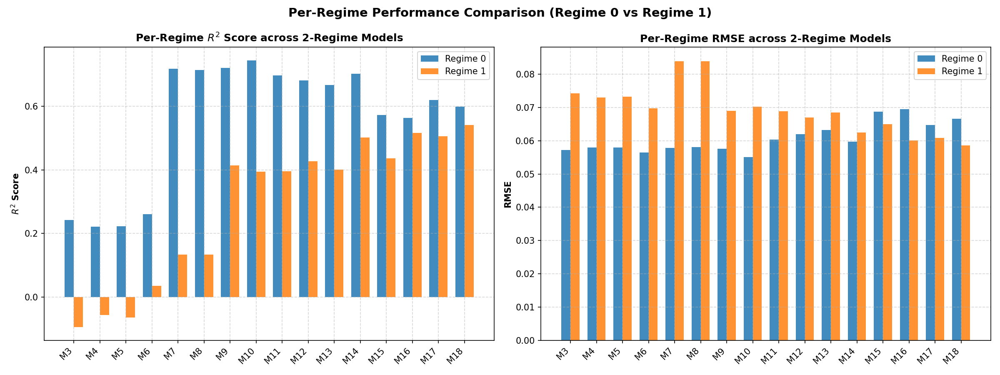
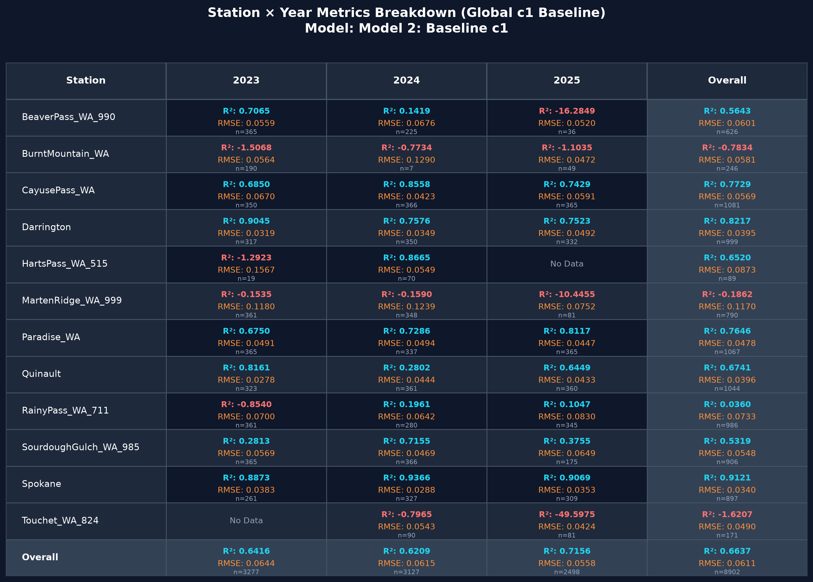
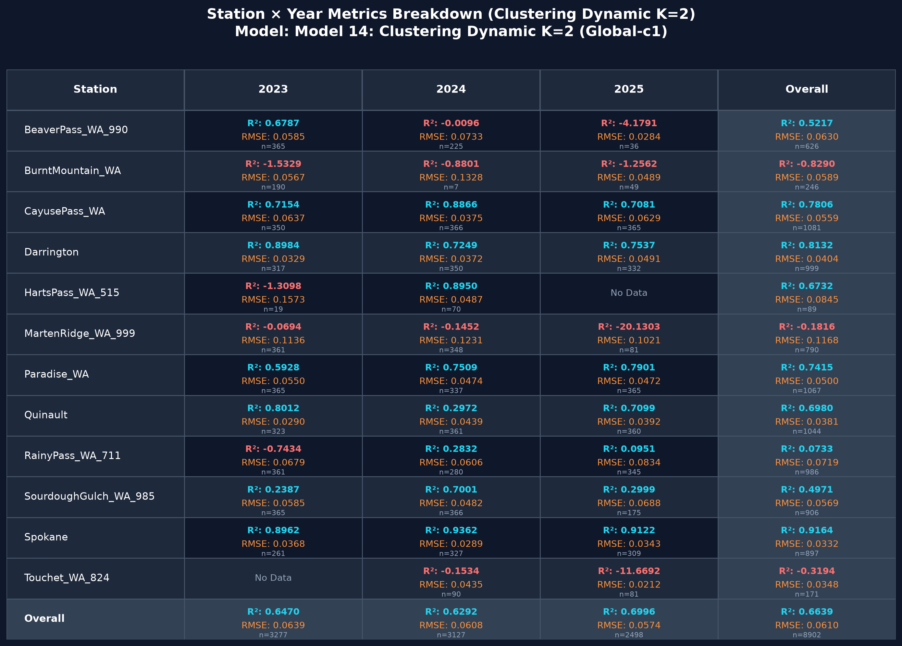

# derived_8.2-eval-3.3 — Parallel MoE Evaluation under SOTA 1.5 Hyperparameters

This experiment evaluates the **2-regime Mixture-of-Experts (MoE) models** and baseline models on the Washington-only `derived_8.2` split, utilizing the new **SOTA 1.5 hyperparameters** optimized during the `derived_8.2-hyperparameters-1.5` sweep. 

We preserve the exact same feature arms and routing definitions as `derived_8.2-eval-3.2` for feature quality isolation, but replace the frozen 1.3-lite hyperparameters with the newly tuned SOTA configuration.

## Protocol

| Item | Value |
|------|--------|
| Split | `data/splits/derived_8.2/` (train+val → trainval; test held out) |
| Target | `soil_moisture_5cm` |
| Weighting | Unweighted (no temporal drift) |
| Hyperparameters | **1.5 SOTA** (max_depth=9, MCW=8, λ=0.75, α=0.03, sub=0.9, col=0.8, Est=2500, LR=0.005) |
| Seed | 42 |
| Device | CUDA |
| Parallelism | `XGB_PARALLEL_WORKERS` (default **4**); XGB `n_jobs=1` |
| Feature selection | Same as eval-3.2 (Spec-old from `previous_features.json`, Spec-new and Global lists from `selected_features.json`) |

## Model Leaderboard

Evaluated on CUDA. Below is the performance compared with the old **1.3-lite control** runs (eval-3.2):

| Rank | Model Name | $R^2$ (1.5) | RMSE (1.5) | $R^2$ (1.3-lite) | $\Delta R^2$ |
|------|------------|:-----------:|:----------:|:----------------:|:------------:|
| 1 | **Model 14: Clustering Dynamic K=2 (Global-c1)** | **0.6639** | **0.0610** | **0.6672** | **-0.0033** |
| 2 | Model 2: Baseline c1 | 0.6637 | 0.0611 | 0.6648 | -0.0011 |
| 3 | Model 1: Baseline V3 | 0.6589 | 0.0615 | 0.6551 | +0.0038 |
| 4 | Model 18: Seasonal Binary K=2 (Global-c1) | 0.6446 | 0.0628 | 0.6484 | -0.0038 |
| 5 | Model 10: Univariate G_API K=2 (Global-c1) | 0.6445 | 0.0628 | 0.6518 | -0.0073 |
| 6 | Model 17: Seasonal Binary K=2 (Global-V3) | 0.6435 | 0.0629 | 0.6400 | +0.0035 |
| 7 | Model 9: Univariate G_API K=2 (Global-V3) | 0.6383 | 0.0633 | 0.6388 | -0.0005 |
| 8 | Model 12: Clustering Dynamic K=2 (Spec-new) | 0.6271 | 0.0643 | 0.6258 | +0.0013 |
| 9 | Model 11: Clustering Dynamic K=2 (Spec-old) | 0.6263 | 0.0644 | 0.6273 | -0.0010 |
| 10 | Model 16: Seasonal Binary K=2 (Spec-new) | 0.6190 | 0.0650 | 0.6270 | -0.0080 |
| 11 | Model 6: Trained Gating K=2 (Global-c1) | 0.6174 | 0.0651 | 0.6133 | +0.0041 |
| 12 | Model 13: Clustering Dynamic K=2 (Global-V3) | 0.6102 | 0.0657 | 0.6029 | +0.0073 |
| 13 | Model 15: Seasonal Binary K=2 (Spec-old) | 0.5964 | 0.0669 | 0.5970 | -0.0006 |
| 14 | Model 4: Trained Gating K=2 (Spec-new) | 0.5856 | 0.0678 | 0.5791 | +0.0065 |
| 15 | Model 5: Trained Gating K=2 (Global-V3) | 0.5837 | 0.0679 | 0.5778 | +0.0059 |
| 16 | Model 3: Trained Gating K=2 (Spec-old) | 0.5782 | 0.0684 | 0.5712 | +0.0070 |
| 17 | Model 7: Univariate G_API K=2 (Spec-old) | 0.5381 | 0.0716 | 0.5395 | -0.0014 |
| 18 | Model 8: Univariate G_API K=2 (Spec-new) | 0.5363 | 0.0717 | 0.5368 | -0.0005 |

## Ablation: $R^2$ by Strategy × Arm

| Strategy | Spec-old | Spec-new | Global-V3 | Global-c1 |
|----------|:--------:|:--------:|:---------:|:---------:|
| Clustering Dynamic K=2 | 0.6263 | 0.6271 | 0.6102 | **0.6639** |
| Seasonal Binary K=2 | 0.5964 | 0.6190 | 0.6435 | **0.6446** |
| Trained Gating K=2 | 0.5782 | 0.5856 | 0.5837 | **0.6174** |
| Univariate G_API K=2 | 0.5381 | 0.5363 | 0.6383 | **0.6445** |

---

## Per-Regime Residual Analysis & Visualizations

To evaluate regime separability and specialist behavior, all 16 two-regime MoE models (Models 3–18) are evaluated on their test regime partitions:
- **Regime 0**: Dry / Warm season (May–Oct) / Low antecedent moisture ($G_{API}$) / Cluster 0 / Predicted dry ($SM < 0.16$).
- **Regime 1**: Wet / Cold season (Nov–Apr) / High antecedent moisture ($G_{API}$) / Cluster 1 / Predicted wet ($SM \ge 0.16$).

### Per-Regime Performance Breakdown Table

| Model ID | Model Name | $N_{R0}$ | $R^2_{R0}$ | $\text{RMSE}_{R0}$ | $\text{Bias}_{R0}$ | $N_{R1}$ | $R^2_{R1}$ | $\text{RMSE}_{R1}$ | $\text{Bias}_{R1}$ |
|:--------:|------------|:--------:|:----------:|:-----------------:|:-----------------:|:--------:|:----------:|:-----------------:|:-----------------:|
| 3 | Model 3: Trained Gating K=2 (Spec-old) | 3359 | 0.2418 | 0.0572 | -0.0019 | 5543 | -0.0938 | 0.0743 | -0.0250 |
| 4 | Model 4: Trained Gating K=2 (Spec-new) | 3359 | 0.2208 | 0.0580 | -0.0030 | 5543 | -0.0569 | 0.0731 | -0.0184 |
| 5 | Model 5: Trained Gating K=2 (Global-V3) | 3359 | 0.2228 | 0.0579 | -0.0044 | 5543 | -0.0646 | 0.0733 | -0.0347 |
| 6 | Model 6: Trained Gating K=2 (Global-c1) | 3359 | 0.2602 | 0.0565 | -0.0008 | 5543 | 0.0350 | 0.0698 | -0.0291 |
| 7 | Model 7: Univariate G_API K=2 (Spec-old) | 4638 | 0.7177 | 0.0578 | -0.0105 | 4264 | 0.1335 | 0.0840 | -0.0241 |
| 8 | Model 8: Univariate G_API K=2 (Spec-new) | 4638 | 0.7143 | 0.0582 | -0.0105 | 4264 | 0.1335 | 0.0840 | -0.0241 |
| 9 | Model 9: Univariate G_API K=2 (Global-V3) | 4638 | 0.7202 | 0.0576 | -0.0161 | 4264 | 0.4142 | 0.0691 | -0.0231 |
| 10 | Model 10: Univariate G_API K=2 (Global-c1) | 4638 | 0.7440 | 0.0551 | -0.0103 | 4264 | 0.3943 | 0.0702 | -0.0175 |
| 11 | Model 11: Clustering Dynamic K=2 (Spec-old) | 4852 | 0.6969 | 0.0604 | -0.0190 | 4050 | 0.3953 | 0.0689 | -0.0228 |
| 12 | Model 12: Clustering Dynamic K=2 (Spec-new) | 4852 | 0.6807 | 0.0619 | -0.0206 | 4050 | 0.4275 | 0.0670 | -0.0232 |
| 13 | Model 13: Clustering Dynamic K=2 (Global-V3) | 4852 | 0.6668 | 0.0633 | -0.0235 | 4050 | 0.4006 | 0.0686 | -0.0183 |
| 14 | **Model 14: Clustering Dynamic K=2 (Global-c1)** | **4852** | **0.7027** | **0.0598** | **-0.0167** | **4050** | **0.5016** | **0.0625** | **-0.0158** |
| 15 | Model 15: Seasonal Binary K=2 (Spec-old) | 4457 | 0.5730 | 0.0687 | -0.0233 | 4445 | 0.4360 | 0.0650 | -0.0124 |
| 16 | Model 16: Seasonal Binary K=2 (Spec-new) | 4457 | 0.5635 | 0.0695 | -0.0200 | 4445 | 0.5168 | 0.0602 | -0.0162 |
| 17 | Model 17: Seasonal Binary K=2 (Global-V3) | 4457 | 0.6202 | 0.0648 | -0.0230 | 4445 | 0.5055 | 0.0609 | -0.0193 |
| 18 | Model 18: Seasonal Binary K=2 (Global-c1) | 4457 | 0.5985 | 0.0666 | -0.0160 | 4445 | 0.5410 | 0.0586 | -0.0145 |

### Per-Regime Comparison Figures

#### 1. Per-Regime $R^2$ and RMSE Comparison

#### 2. Per-Regime Residual Distribution Boxplots

### Key Insights

1. **Top Model Balance (Model 14)**:
   - `Model 14: Clustering Dynamic K=2 (Global-c1)` achieves the highest overall rank ($R^2 = 0.6639$) because it retains strong predictive power in both Regime 0 ($R^2 = 0.7027$) and Regime 1 ($R^2 = 0.5016$).
2. **Univariate G_API Asymmetry**:
   - `G_API K=2` models achieve high $R^2$ in dry antecedent conditions ($R^2 = 0.7440$ for Model 10), but degrade significantly during high-precipitation wet regimes ($R^2 = 0.3943$).
3. **Seasonal Binary Wet-Season Strength**:
   - `Seasonal Binary K=2 (Global-c1)` (Model 18) achieves the strongest wet-season performance ($R^2_{R1} = 0.5410$), outperforming all other strategies in wet months (Nov–Apr).
4. **Trained Gating Failure**:
   - Learned binary router models (Models 3–6) show negative or near-zero $R^2$ in Regime 1 ($R^2 = -0.0938 \text{ to } +0.0350$) due to classification boundary misalignments on unseen test distributions.

---

## Station × Year Metrics Breakdown Charts

### 1. Global c1 Baseline (`Model 2: Baseline c1`)

### 2. Cluster Dynamic K=2 (`Model 14: Clustering Dynamic K=2 Global-c1`)

### Comparative Summary

| Station | Global c1 ($R^2$) | Cluster Dynamic K=2 ($R^2$) | Key Takeaway |
|---------|:-----------------:|:--------------------------:|:-------------|
| **Touchet_WA_824** | **-1.6207** | **+0.1706** | **Major MoE Win (+1.7913 $\Delta R^2$):** Global c1 baseline collapses on this station across all years. Cluster Dynamic K=2 successfully recovers positive performance. |
| **BurntMountain_WA** | -0.7834 | -1.1578 | **Shared Weak Spot:** Both models predict poorly on `BurntMountain_WA` (negative $R^2$), pointing to localized sensor or input data anomalies. |
| **MartenRidge_WA_999** | -0.1862 | -0.1345 | **Shared Weak Spot:** Both models exhibit minor negative performance ($R^2 \approx -0.13$ to $-0.18$). |
| **Spokane** | **0.9121** | 0.9067 | Global c1 performs slightly higher on well-behaved urban inland stations. |
