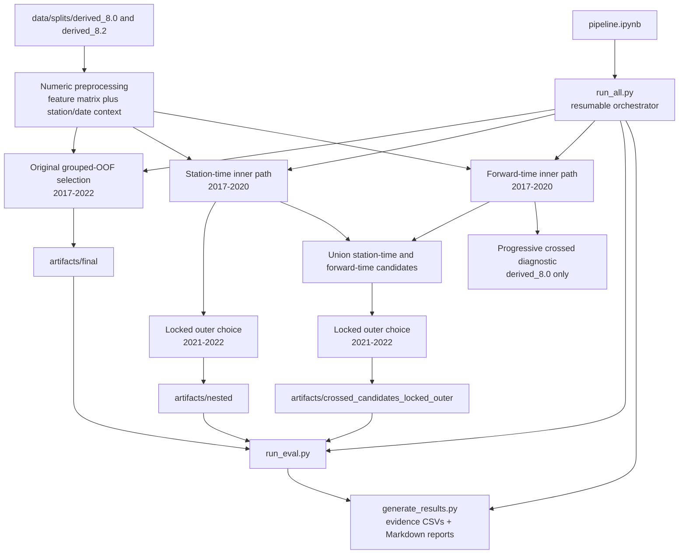

# derived_8.2-feature-selection-2.2

This experiment replaces pooled-row feature importance with predictive utility measured on future-time and held-out-station folds. It runs the same name-agnostic selection algorithm on `derived_8.0` and `derived_8.2`, then evaluates a global model and, for `derived_8.2`, a K=2 shared-backbone mixture of experts (MoE).

> **Frozen original plus diagnostic revisions:** the original final gates failed. The original protocol is preserved under `artifacts/final`; nested, locked-outer, crossed-fold, and progressive-elimination diagnostics live in separate artifact trees. Because the original run consumed 2023–2025, every current test-period result is retrospective and cannot support a new unbiased SOTA claim. See [`RESULTS.md`](RESULTS.md).

## Why 2.2 exists

The 2.1 pipeline ranks features with mutual information, ElasticNet coefficients, correlation filters, tree gain, and row-bootstrap stability on pooled training rows. A feature can therefore appear stable because it repeatedly explains the same station/year mixture, even if it fails on a new station in a later year. Sequential univariate and correlation filters can also remove interaction-only features or correlated substitutes before the final learner evaluates them.

Version 2.2 makes the generalization target part of selection itself:

- station IDs and dates define folds but never enter the predictive feature matrix;
- importance is a paired change in held-out normalized RMSE, not an in-sample model statistic;
- every reduction is followed by a refit, allowing a correlated substitute to become useful after a stronger correlate is removed;
- feature names and feature-family labels never affect admission, ranking, or tie-breaking;
- candidate feature counts are chosen with uncertainty-aware out-of-fold error;
- regime specialists must beat the shared global backbone on paired folds or receive no extra features.

## Architecture at a glance



The shared selector implementation is [`Modeling/Src/soilmoist_fl/Selectors/grouped_oof.py`](../../../Modeling/Src/soilmoist_fl/Selectors/grouped_oof.py). The experiment runners configure that library, enforce data boundaries, and serialize its decisions.

## Data and leakage boundaries

Both datasets use the same time split:

| Split | Years | Role in the original arm | Role in nested/crossed arms |
|---|---:|---|---|
| `train.csv` | 2017–2020 | Part of the combined development pool | Inner ranking and candidate generation only |
| `val.csv` | 2021–2022 | Part of the combined development pool | Disjoint outer candidate/path selection |
| `test.csv` | 2023–2025 | Originally held until the one-shot final evaluation | Retrospective diagnostics only; never eligible for a new SOTA claim |

The original `final` arm concatenates train and validation before constructing rolling folds. Its later `validation_eval` re-score on 2021–2022 is consequently a development diagnostic, not an independent holdout estimate. The nested and crossed revisions correct that architecture for feature-count/path choice: no 2021–2022 labels are read while the 2017–2020 candidate lists are being generated.

`preprocess_split` removes `soil_moisture_5cm`, `station_id`, and `date` from `X`, coerces predictors to numeric values, and converts infinities to missing values. XGBoost handles the remaining `NaN` values natively. The untouched station/date columns remain aligned with `X` as fold context.

## Core grouped-OOF selector

### 1. Deterministic folds

Stations are greedily assigned to four row-balanced groups, ordered by descending row count and then station name. For a station-time fold with validation year `t` and station group `g`:

- training rows have `year < t` and `station not in g`;
- validation rows have `year == t` and `station in g`.

The original arm uses the last four eligible validation years in 2017–2022. The nested inner arm uses the last two eligible years within 2017–2020. Folds below the configured 100 training rows or 20 validation rows are skipped, and fewer than two usable folds is an error.

The crossed arm also builds a pure forward-time path. Those folds retain every available station, train on years before `t`, and validate on all rows in year `t`. This separates temporal drift utility from joint temporal/spatial utility.

### 2. Paired permutation utility

For every fold and temporal weighting protocol, the selector fits an XGBoost regressor, records normalized RMSE, permutes one validation feature at a time, and predicts again with the same fitted model. For feature `j`:

```text
delta_j = NRMSE(permuted j) - NRMSE(unpermuted)
importance_j = mean(delta_j) - z * SE(delta_j)
```

NRMSE is fold RMSE divided by the standard deviation of that fold's target. The configured `z=1.0` makes `importance_j` a one-standard-error lower confidence bound (LCB). Features sort by descending LCB, then descending mean permutation delta, then original column position. The final tie-break makes selection invariant to renaming.

Each fold is evaluated twice: unweighted (`beta=0.0`) and with mean-normalized temporal weights (`beta=0.2`):

```text
w(year) = exp(beta * (year - latest_training_year)) / mean(w)
```

The two protocols are pooled as paired fold tasks during importance and candidate scoring, so a feature set must be robust to both training policies.

### 3. Iterative elimination and count selection

The selector begins with every numeric predictor. At each configured checkpoint it:

1. ranks the current feature set by permutation-importance LCB;
2. retains the highest-ranked features needed for the next checkpoint;
3. refits and recomputes importance on the reduced set;
4. scores the checkpoint with `mean(NRMSE) + z * SE(NRMSE)`.

The original arm evaluates `[100, 80, 65, 50, 40]`; the nested inner arm evaluates `[150, 125, 100, 80, 65, 50, 40]`. Sizes are clipped to the available column count and deduplicated. The global winner minimizes the candidate upper confidence bound (UCB), breaking a tie in favor of fewer features.

Normal elimination can make a large first jump from all predictors to the largest requested checkpoint. The progressive diagnostic inserts intermediate bridge sizes and re-ranks at each bridge so one step never removes more features than the requested retained count. The canonical pipeline runs that expensive diagnostic only for `derived_8.0`.

### 4. Ranking learner versus locked learner

| Use | Trees | Depth | Minimum child weight | Learning rate |
|---|---:|---:|---:|---:|
| Inner permutation ranking | 160 | 6 | 5 | 0.04 |
| Locked outer choice and reported evaluation | 1,500 | 8 | 10 | 0.01 |

Both use histogram trees, subsampling `0.9`, column subsampling `0.8`, L2 `1.5`, L1 `0.03`, seed 42, and `n_jobs=1`. The runtime device is injected from `--device`; independent fold/candidate fits are parallelized by `--workers` to avoid nested oversubscription.

## Nested and crossed candidate selection

The nested revision has two label-disjoint layers:

1. `run_nested_selection.py` generates a station-time candidate path from 2017–2020 with the ranking learner.
2. `evaluate_forward_station_time_candidates` scores those frozen lists on 2021 and 2022 with the locked learner. For each outer year/station group, it trains on 2017–2020 while excluding matching training stations and validates only that group's outer-year rows. Stations that appear only in the outer period are included in validation and are absent from training by construction.

`run_locked_outer_selection.py` independently re-scores the frozen global station-time paths into `nested_locked_outer`. This isolates the outer-model architecture from inner ranking and provides a reusable source for the crossed comparison. With the current `nested_config.yaml`, the nested outer and locked-outer learners both use the 1,500-tree evaluation configuration.

`run_crossed_candidate_selection.py` generates a second path with pure forward-time folds, takes the ordered-set union of the forward-time and station-time candidates, and chooses among that union on the same locked outer folds. `candidate_sources.json` records whether the winning list came from the station-time path, the forward-time path, or both.

## Global backbone and K=2 experts

Only `derived_8.2` runs regime-specific selection. The router standardizes three variables and fits seeded K-means with `K=2` and `n_init=10`:

- `SMAP_sm_pm_interp_lag1`
- `G_API`
- `LST_modis`

The selected global list is mandatory for both experts. Within each regime, the selector considers the shared count plus `[0, 5, 10, 15]` additions. For each candidate it computes the paired fold improvement over the shared-only baseline:

```text
improvement = NRMSE(shared) - NRMSE(shared + delta)
```

A delta is admissible only if its one-standard-error improvement LCB is positive. Otherwise that expert receives exactly the shared backbone. Among admissible deltas, the selector again minimizes candidate UCB and then feature count.

The original arm fits its router on the combined development pool during selection and refits a router on the evaluation fit frame because it has no saved router artifact. The nested arm fits the imputer, scaler, and K-means model on 2017–2020 only, applies it to 2021–2022, and saves the means, scales, and centroids in `router.json`. For nested evaluation, the primary `2.2_clustering_dynamic_k2_shared_plus_delta` label uses that saved router; additional frozen-router/shared-only and refit-router/shared-plus-delta rows provide the MoE ablation.

## Experiment arms and outputs

| Artifact tree | Producer | What it answers |
|---|---|---|
| `artifacts/final` | `run_selection.py` | What the original combined-development grouped-OOF protocol selected |
| `artifacts/nested` | `run_nested_selection.py` | Which station-time inner candidate and regime deltas survive a disjoint 2021–2022 outer choice |
| `artifacts/nested_locked_outer` | `run_locked_outer_selection.py` | What changes when frozen global inner candidates are re-scored with the locked evaluation learner |
| `artifacts/crossed_candidates_locked_outer` | `run_crossed_candidate_selection.py` | Whether a station-time or pure forward-time candidate path wins on locked outer folds |
| `artifacts/progressive_crossed_locked_outer` | `run_crossed_candidate_selection.py --progressive` | Whether bridge refits repair the large initial pruning step; canonical run covers `derived_8.0` only |
| `*/candidate_diagnostics` | `run_candidate_diagnostics.py` | Direct locked-model outer metrics and descriptive retrospective ceilings for every candidate |
| `*/validation_eval` and `*/retrospective_test_eval` | `run_eval.py` | Overall, per-year, and per-station metrics for selected global/MoE models and baselines |
| `artifacts/report` | `generate_results.py` | Normalized evidence CSVs, manifest, and completion marker for generated [`RESULTS.md`](RESULTS.md) and the protected evidence block in [`CONTINUATION.md`](CONTINUATION.md) |

Global and regime selection directories contain the selected feature payload, full selection details, fold metrics, configuration, split hashes, stopping reason, and a completion marker. Nested directories separate `inner_selection.json` from `outer_selection.json` so candidate generation and candidate choice can be audited independently.

`run_eval.py` uses the locked learner and reports R², RMSE, unbiased RMSE, bias (`truth - prediction`), MAE, median absolute error, and Pearson correlation overall and by year/station. It also scores the historical MDR-v25 hand list for `derived_8.0`, and V3 plus the 2.1 C1 list for `derived_8.2`.

## Orchestration and restart safety

`pipeline.ipynb` is the single notebook entry point. It invokes `run_all.py`, which executes the following exact stage sequence:

| # | Journal stage | Command and output |
|---:|---|---|
| 1 | `selection` | `run_selection.py` → `artifacts/final` |
| 2 | `validation` | `run_eval.py --artifact-set final` |
| 3 | `final_retrospective` | `run_eval.py --artifact-set final --retrospective-test` |
| 4 | `nested_selection` | `run_nested_selection.py` → `artifacts/nested` |
| 5 | `nested_locked_outer` | `run_locked_outer_selection.py` |
| 6 | `crossed_selection` | `run_crossed_candidate_selection.py` |
| 7 | `progressive_selection` | `run_crossed_candidate_selection.py --progressive --dataset derived_8.0` |
| 8 | `nested_diagnostics` | Candidate diagnostics for `nested` |
| 9 | `crossed_diagnostics` | Candidate diagnostics for `crossed_candidates_locked_outer` |
| 10 | `progressive_diagnostics` | Candidate diagnostics for `progressive_crossed_locked_outer` |
| 11 | `nested_retrospective` | Retrospective evaluation of `nested` |
| 12 | `crossed_retrospective` | Retrospective evaluation of `crossed_candidates_locked_outer` |
| 13 | `report` | `generate_results.py` → `RESULTS.md` |

Every JSON/CSV result is atomically replaced. A stage writes `completion.json` last, containing SHA-256 hashes of its required files; a missing or changed file invalidates reuse. `artifacts/run_state.json` journals the device, worker count, commands, status, and stage-runner/config fingerprints.

Restart behavior is intentionally strict:

- no journal, `--restart`, or a journal marked `complete` starts a clean rebuild and deletes this experiment's existing `artifacts/` directory;
- a `running` or `failed` journal resumes at the first incomplete stage;
- resuming requires the same device and worker count;
- changed stage inputs normally require `--restart` so artifacts from different runs are not mixed.

The journal is lightweight resume protection, not full source-tree provenance. Git history and the saved scripts/configs remain the reproducibility record.

## Code map

| Path | Responsibility |
|---|---|
| `pipeline.ipynb` | Canonical long-running entry point and display of generated tables |
| `run_all.py` | Stage order, cleanup, subprocess execution, and resume journal |
| `config.yaml` | Original selector, MoE delta, and final evaluation parameters |
| `nested_config.yaml` | Inner/outer split and locked outer learner parameters |
| `run_selection.py` | Original global and regime selection on combined development data |
| `run_nested_selection.py` | Inner/outer global selection, train-only router, and nested regime deltas |
| `run_locked_outer_selection.py` | Locked global outer re-score of the station-time path |
| `run_crossed_candidate_selection.py` | Forward-time path, candidate union, and progressive arm |
| `run_candidate_diagnostics.py` | Locked-model candidate tables for outer and retrospective periods |
| `run_eval.py` | Global/baseline/MoE fits and overall/year/station metrics |
| `generate_results.py` | Registered evidence builders and generation/checking of both Markdown reports |
| `split_provenance.py` | Stable split reads and SHA-256 validation shared by evaluation, diagnostics, and reporting |
| `artifact_state.py` | Atomic writes and hash-verified completion markers |
| `runtime.py` | Shared `--device` and `--workers` CLI options |
| `analysis.ipynb`, `eval.ipynb`, `nested_analysis.ipynb` | Read-only artifact views; they do not own experiment calculations |
| [`PROTOCOL.md`](PROTOCOL.md) | Locked research and post-final interpretation rules |

## Reproduction

From the repository root, execute the canonical notebook in the managed `uv` environment:

```bash
cd notebooks
nb execute experiment/derived_8.2-feature-selection-2.2/pipeline.ipynb \
  --uv --timeout 86400
```

The full run is long-running and defaults to four CUDA workers with one XGBoost thread per fit. If a VM stops during a stage, run the same notebook command again to resume. Do not rerun a completed pipeline unless a clean deletion and rebuild of the artifact tree is intended.

The master runner can also be called directly when runtime controls or an explicit restart are needed:

```bash
cd notebooks
uv run python experiment/derived_8.2-feature-selection-2.2/run_all.py \
  --device cuda --workers 4

# Explicitly discard an incomplete artifact tree and rebuild it.
uv run python experiment/derived_8.2-feature-selection-2.2/run_all.py \
  --device cuda --workers 4 --restart
```

All result values in [`RESULTS.md`](RESULTS.md) and the protected evidence block in [`CONTINUATION.md`](CONTINUATION.md) are generated from completed CSV/JSON artifacts. The analysis notebooks import the same report functions rather than independently filtering or rounding results.

The report can also be rebuilt directly, without rerunning model fits:

```bash
cd notebooks
uv run python experiment/derived_8.2-feature-selection-2.2/generate_results.py

# Read-only verification: recompute every evidence table and Markdown block in
# memory, then fail if any tracked output, manifest hash, or completion input is stale.
uv run python experiment/derived_8.2-feature-selection-2.2/generate_results.py --check
```

This tracked command is the sole owner of report calculations. The reproducible chain is producer scripts → completed artifacts → registered report builders → normalized evidence CSVs → generated Markdown. Inline Python snippets and notebook-only cells are not accepted as sources for report values. The report manifest records each evidence builder, both Markdown hashes, generator hashes, and all six split hashes; the completion marker directly guards those outputs, generators, and live split files.

## Historical final gates

These thresholds belonged to the original one-shot final protocol. `run_eval.py --confirm-final` records their pass/fail state only for `artifacts/final`; the canonical rebuild uses `--retrospective-test`, marks `unbiased_sota_eligible: false`, and does not issue a new gate verdict.

| Dataset/model | Required held-out test result |
|---|---:|
| derived_8.0 global, drift | R² > 0.8253479 |
| derived_8.0 global, no drift | R² > 0.8222 |
| derived_8.2 global | R² > 0.6648 |
| derived_8.2 Clustering Dynamic K=2 | R² > 0.6672 |

A failed gate remains a failed research result; the consumed test split is not reused for another 2.2 tuning cycle.
