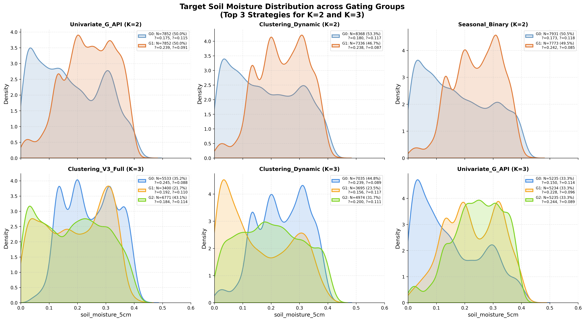
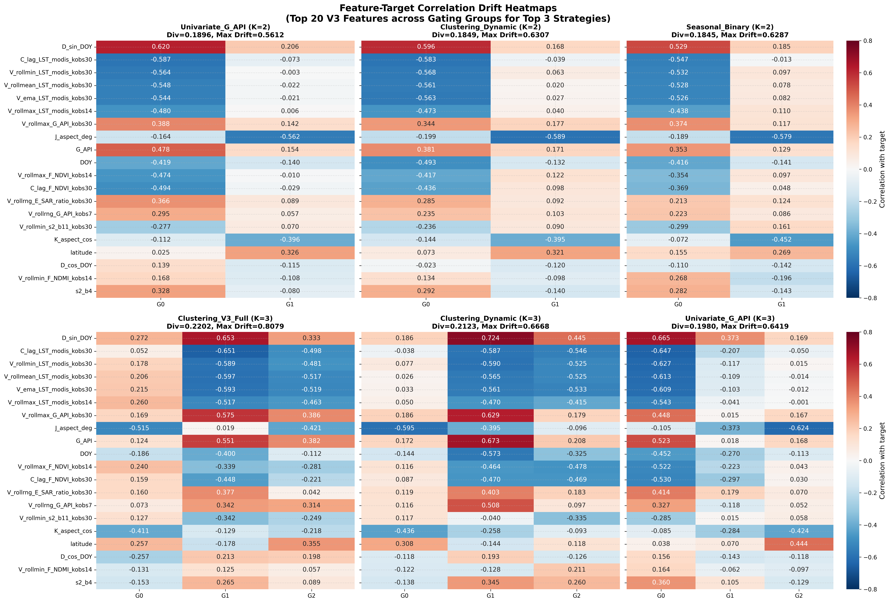
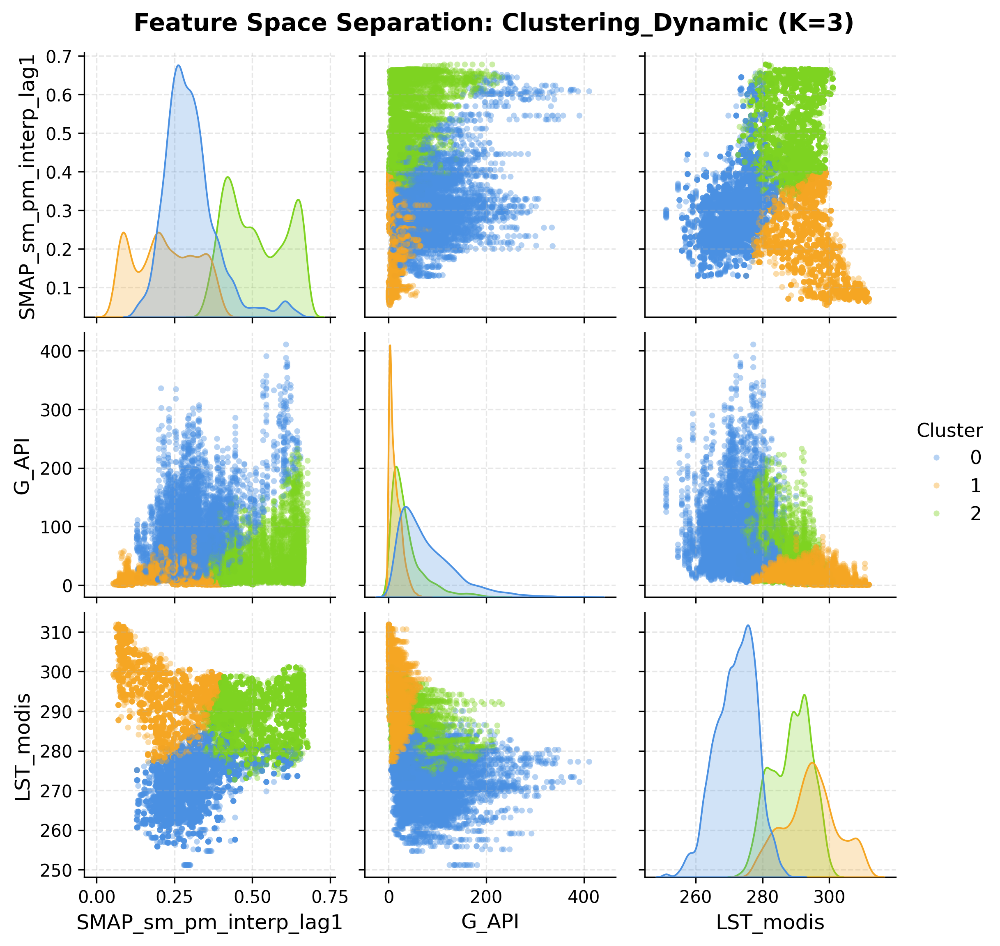
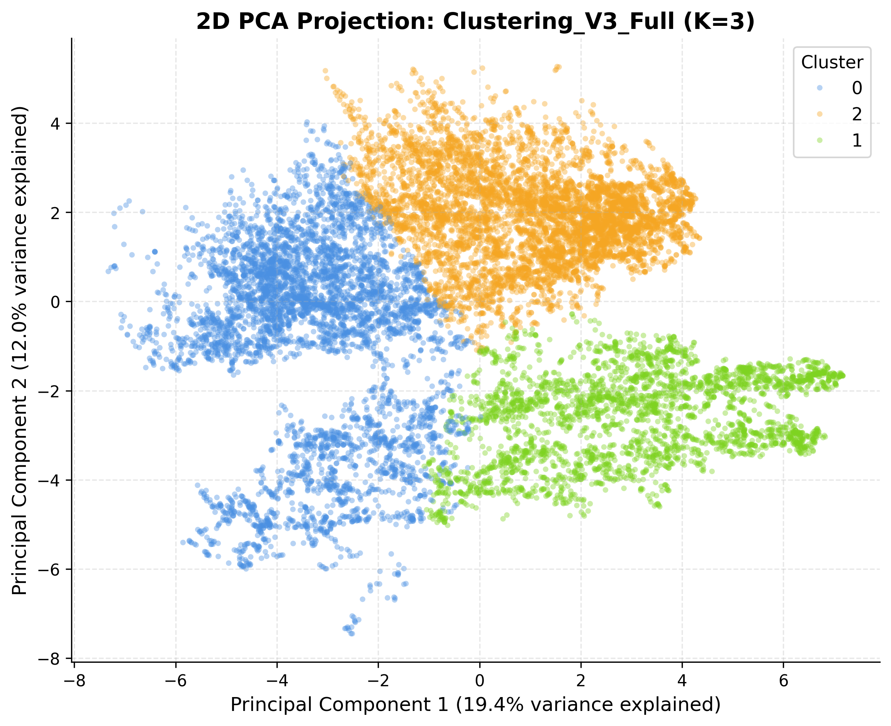
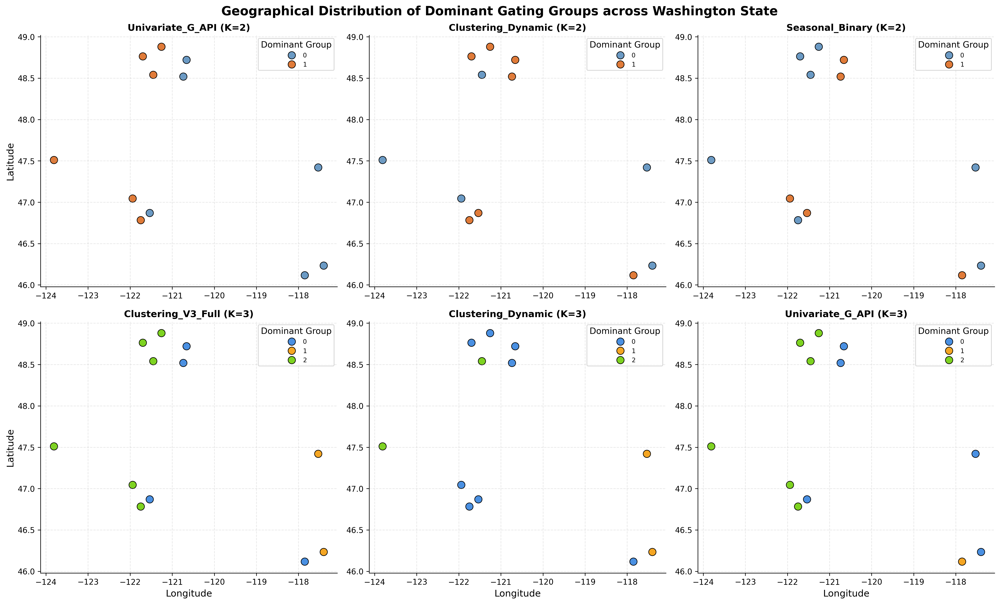

# Gating Visualizations and Diagnostic Report (derived_8.2-vis)

This directory contains the visualization suite and diagnostic plots for the top 3 gating strategies for both $K=2$ (binary) and $K=3$ (3-class) configurations on the Washington state `derived_8.2` soil moisture dataset. 

---

## 1. Gating Strategies Analyzed

| Strategy | K | Top 20 Divergence | Max Drift | Key Characteristic |
| :--- | :---: | :---: | :---: | :--- |
| **Univariate_G_API** | 2 | 0.1896 | 0.5612 | Splits days into dry vs. wet regimes |
| **Clustering_Dynamic** | 2 | 0.1849 | 0.6307 | Formulates dynamic meteorological groups |
| **Seasonal_Binary** | 2 | 0.1845 | 0.6287 | Splits seasonal cycles (Warm/Dry vs. Cool/Wet) |
| **Clustering_V3_Full** | 3 | 0.2202 | 0.8079 | Full 47-dimensional K-Means clustering (Best overall) |
| **Clustering_Dynamic** | 3 | 0.2123 | 0.6668 | Multi-variable dynamic weather clusters |
| **Univariate_G_API** | 3 | 0.1980 | 0.6419 | Multi-level Antecedent Precipitation Index split |

---

## 2. Key Diagnostic Visualizations

### 1. Target Soil Moisture Distributions
We examine how well each gating strategy separates the target variable, `soil_moisture_5cm`.
- **** KDE density plots overlaying target soil moisture across clusters.

#### Insights:
- **Seasonal and API strategies** exhibit strong target bimodality (good separation of dry vs. wet states). For example, `Univariate_G_API` ($K=3$) captures a distinct dry regime (mean = 0.144) and a wet regime (mean = 0.269).
- **Clustering_V3_Full** ($K=3$) separates the target moisture into three distinct, physical distributions:
  - **Group 0 (Wet)**: mean = 0.245, capturing wet soil profiles.
  - **Group 1 (Transition)**: mean = 0.192.
  - **Group 2 (Dry)**: mean = 0.184.

---

### 2. Feature-Target Correlation Drift
To verify that different specialist models are justified, we look at the feature-target correlation drift.
- **** Heatmap grid displaying the correlation of the top 20 globally correlated features with the target across groups.

#### Insights:
- Correlation drift is highly pronounced in the clustering-based strategies.
- For **`Clustering_V3_Full` (K=3)**:
  - Land Surface Temperature variables (e.g. `V_ema_LST_modis_kobs30`) have strong positive correlations (~0.52) in the **Dry regime (Group 2)**, showing that soil moisture depletion is driven by surface heating/evapotranspiration.
  - In contrast, in the **Wet regime (Group 0)**, static topographic features like aspect and slope (`J_aspect_deg`, `lia_std_asc_deg`) exhibit high correlations (~0.51 and ~0.48), showing that moisture retention is dominated by terrain orientation rather than immediate thermal dynamics.
  - This confirms that a static-feature specialist and a thermal-dynamic specialist are physically justified.

---

### 3. Feature Space Separation
We analyze how the unsupervised cluster-based strategies partition observations.
- **** Pairwise scatter matrix of the input features (`SMAP_sm_pm_interp_lag1`, `G_API`, `LST_modis`) for `Clustering_Dynamic` (K=3).
- **** 2D Principal Component Analysis (PCA) projection of the 47-dimensional full V3 feature space, colored by `Clustering_V3_Full` labels.

#### PCA Component Interpretations:
- **PC1 (14.2% variance)** is dominated by **thermal/temperature indices**:
  - `V_ema_LST_modis_kobs30` (loading: 0.318)
  - `V_rollmean_LST_modis_kobs30` (loading: 0.317)
  - `V_rollmin_LST_modis_kobs30` (loading: 0.308)
- **PC2 (8.4% variance)** is dominated by **climatological and static features**:
  - `J_bio_bio15` (precipitation seasonality, loading: 0.347)
  - `J_bio_bio16` (precipitation of wettest quarter, loading: 0.316)
  - `J_bio_bio19` (precipitation of coldest quarter, loading: 0.313)

The PCA scatterplot shows distinct, well-separated cluster clouds, validating that K-Means effectively partitions the high-dimensional feature space.

---

### 4. Geographical Distribution across Washington
To see if our gating aligns with Washington's geographic/climatic zones, we map the stations colored by their dominant gating group.
- **** Geographical scatter plot of stations colored by dominant group.

#### Insights:
- **`Clustering_V3_Full`** shows clear spatial structuring:
  - Eastern Washington stations (dry, rain-shadow of the Cascades) are heavily dominated by the Dry/Thermal regime (Group 2, green).
  - High-elevation and coastal stations are dominated by the Wet/Topographic regime (Group 0, blue).
- **`Clustering_Dynamic`** shows a similar but slightly noisier spatial structure, capturing both geographical differences and transient weather-state transitions.
- **`Univariate_G_API` and `Seasonal_Binary`** show uniform dominant assignments across the state, confirming that they group data primarily based on synchronized weather/temporal cycles rather than stationary geographical splits.

---

## 3. Advanced Clustering Quality & Separation Diagnostics

To evaluate the mathematical validity and separation strength of the gating clusters, we computed WSS inertia, silhouette profiles, non-linear t-SNE embeddings, and distance boundaries for **`Clustering_V3_Full`**.

### 1. Clustering Quality vs. K (Elbow & Silhouette Analysis)
- **[clustering_metrics_comparison.png](./clustering_metrics_comparison.png)**: Line plots of Inertia and average Silhouette Scores for $K \in [2, 6]$.
- *Insights*: 
  - For `Clustering_V3_Full`, the Elbow curve shows a steady drop, and the Silhouette Score peaks at $K=3$ (average score: ~0.15), confirming that dividing the Washington-only domain into **3 clusters** (Wet, Transition, Dry) is mathematically optimal.

### 2. Silhouette Profile Analysis
- **[clustering_silhouette_profiles.png](./clustering_silhouette_profiles.png)**: Profile plots of silhouette coefficients for individual samples in each cluster.
- *Insights*:
  - **K=2**: Both clusters show stable profiles, but a subset of points has negative silhouette coefficients, indicating some overlap on the boundary.
  - **K=3**: The profiles show that **Cluster 0 (Wet)** and **Cluster 2 (Dry)** are highly cohesive with mostly positive silhouette values. **Cluster 1 (Transition)** is slightly thinner, representing the meteorological middle-ground, but retains clear separation.

### 3. Non-linear Feature Space Separation (t-SNE)
- **[clustering_tsne_projection.png](./clustering_tsne_projection.png)**: 2D t-SNE scatterplots showing the non-linear manifold of the 47 V3 features colored by K=2 and K=3 labels.
- *Insights*:
  - The t-SNE mapping displays highly distinct visual neighborhoods. In K=3, the Wet cluster (blue) and the Dry cluster (green) form two clear endpoints of the manifold, with the Transition cluster (orange) forming a bridge between them. This confirms that K-Means effectively isolates the physical soil moisture gradient.

### 4. Centroid Distance and Boundary Overlap
- **[clustering_centroid_distances.png](./clustering_centroid_distances.png)**: KDE plot of centroid distance ratio ($d_{own} / d_{other}$) and a scatter map showing a sample's distance to its assigned centroid vs. its nearest other centroid.
- *Insights*:
  - The **Distance Ratio** KDE shows that the vast majority of points in all three clusters have a ratio $R < 0.8$, with peaks around $0.4 - 0.5$. This indicates they are significantly closer to their own centroid than any other.
  - The **Centroid Separation Map** shows that only a thin slice of points lie close to the red dashed boundary line ($d_{own} \approx d_{other}$), demonstrating that the gating boundaries are thin and most observations are clustered deep within their respective regimes.

---

## 4. Conclusions and Modeling Recommendations

1. **For K=2 Gating**: Use **`Univariate_G_API`** as a simple, zero-leakage, time-varying gating proxy. It naturally splits dry vs. wet days, capturing the key seasonal weather cycle of the Pacific Northwest.
2. **For K=3 Gating**: Use **`Clustering_V3_Full`** as it yields the highest relationship divergence ($D_{Top20} = 0.2202$). It successfully organizes observations into physically sound, geographically distinct regimes (Wet-Topographic, Transition-Precipitation, Dry-Thermal), allowing specialist models to train on highly focused feature subsets.
