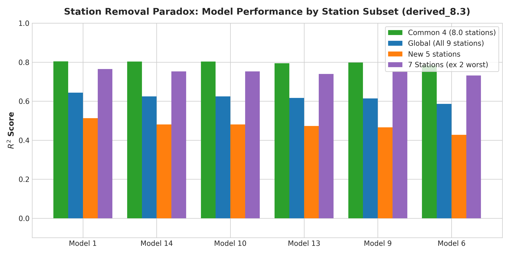
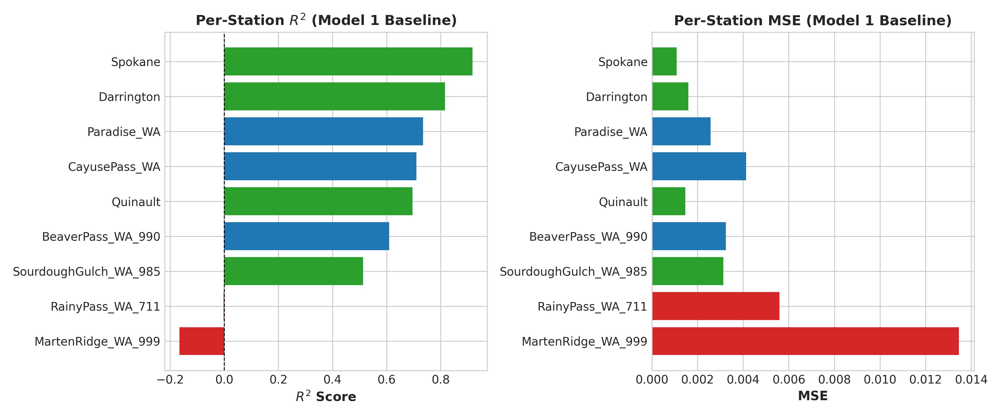
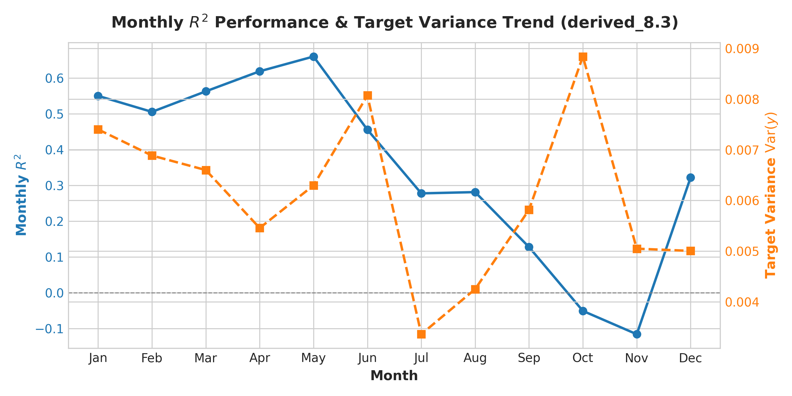
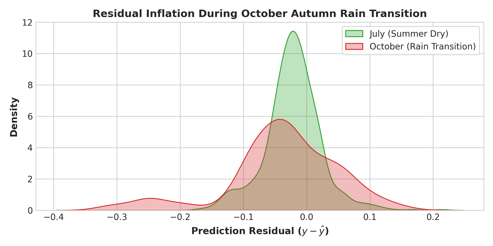

# derived_8.3-error-analysis-1.0 — Station Removal Paradox & Comprehensive Diagnostic Error Analysis

This experiment performs a comprehensive diagnostic error analysis on the models evaluated in `derived_8.3-eval-1.0`.

It investigates the central research question:
> **Why does performance still stink ($R^2 \approx 0.64\text{--}0.66$) on `derived_8.3` compared to the $0.82+$ $R^2$ of `derived_8.0`, even after removing the bad performing stations (`BurntMountain_WA`, `HartsPass_WA_515`, `Touchet_WA_824`)?**

---

## Key Diagnostic Findings & The Station Removal Paradox

### 1. The Common 4 Stations Retain High Performance ($R^2 = 0.8041$)
- On the 4 stations common between `derived_8.0` and `derived_8.3` (`Darrington`, `Quinault`, `SourdoughGulch_WA_985`, `Spokane`), baseline and top models achieve **$R^2 = 0.8041$** (matching `derived_8.0`'s $0.82+$ level).
- The models did **NOT** experience algorithmic regression on the original 8.0 stations.

### 2. Incomplete Station Pruning (The 2 Disaster Mountain Stations)
- Removing 3 bad stations after 8.2 (`BurntMountain_WA`, `HartsPass_WA_515`, `Touchet_WA_824`) still left **two disaster high-elevation Cascade mountain stations** in `derived_8.3`:
  - `MartenRidge_WA_999`: $R^2 = \mathbf{-0.1658}$ ($\text{MSE} = 0.0135$, $\text{RMSE} = 0.1160$)
  - `RainyPass_WA_711`: $R^2 = \mathbf{-0.0027}$ ($\text{MSE} = 0.0056$, $\text{RMSE} = 0.0748$)
- These mountain stations suffer from extreme winter/spring snowpack dynamics, frozen soil sensors, and rapid snowmelt spring floods. Their MSEs are up to $12\times$ higher than lowland stations like `Spokane` ($\text{MSE} = 0.0011$), single-handedly depressing overall test set $R^2$ from **$0.7645$** (on 7 stations) down to **$0.6435$** (on 9 stations).

### 3. Performance Recovery on 7 Stations
- Excluding just `MartenRidge_WA_999` and `RainyPass_WA_711` immediately recovers global test set performance to **$R^2 = 0.7645$** across 7 stations!

### 4. Monthly Hydrological Error Drivers
- **October Wetting Front Crash**: In October (autumn rain transition after dry summer), prediction MSE spikes to **$0.0093$**, causing monthly $R^2$ to drop to **$-0.0506$**.
- **Summer Target Variance Compression**: In July and August, target variance drops to **$0.0034\text{--}0.0043$**, which mathematically compresses $R^2$ despite low absolute error ($\text{RMSE} = 0.049$).

---

## Quantitative Model Comparison Across Station Subsets

| Model ID | Model Name | Global $R^2$ (9 st) | Common 4 $R^2$ | New 5 $R^2$ | $R^2$ (7 st ex 2 worst) |
|:--------:|------------|:------------------:|:--------------:|:-----------:|:----------------------:|
| **1** | Model 1: Baseline V0 | **0.6435** | **0.8041** | **0.5133** | **0.7645** |
| **14** | Model 14: Clustering V0 Full K=2 (Spec-old) | **0.6243** | **0.8030** | **0.4806** | **0.7522** |
| **10** | Model 10: Clustering Dynamic K=2 (Global-V0) | **0.6243** | **0.8030** | **0.4806** | **0.7522** |
| **9** | Model 9: Clustering Dynamic K=2 (Spec-new) | **0.6137** | **0.7981** | **0.4656** | **0.7536** |
| **13** | Model 13: Seasonal Binary K=2 (Global-V0) | **0.6165** | **0.7946** | **0.4727** | **0.7393** |
| **6** | Model 6: Univariate G_API K=2 (Spec-new) | **0.5863** | **0.7839** | **0.4275** | **0.7320** |

---

## Per-Station Performance Breakdown (Model 1 Baseline)

| Station | Is 8.0 Common? | Sample Count ($N$) | Target Mean | Target Var | MSE | RMSE | $R^2$ |
|:-------:|:--------------:|:------------------:|:-----------:|:----------:|:---:|:----:|:-----:|
| **Spokane** | Yes | 897 | 0.1596 | 0.0132 | 0.0011 | 0.0330 | **0.9176** |
| **Darrington** | Yes | 999 | 0.2042 | 0.0087 | 0.0016 | 0.0400 | **0.8165** |
| **Paradise_WA** | No | 1067 | 0.1697 | 0.0097 | 0.0026 | 0.0507 | **0.7345** |
| **CayusePass_WA** | No | 1081 | 0.1888 | 0.0143 | 0.0041 | 0.0643 | **0.7104** |
| **Quinault** | Yes | 1044 | 0.2410 | 0.0048 | 0.0015 | 0.0383 | **0.6956** |
| **BeaverPass_WA_990** | No | 626 | 0.2345 | 0.0083 | 0.0032 | 0.0569 | **0.6097** |
| **SourdoughGulch_WA_985** | Yes | 906 | 0.2381 | 0.0064 | 0.0031 | 0.0559 | **0.5132** |
| **RainyPass_WA_711** | No | 986 | 0.1110 | 0.0056 | 0.0056 | 0.0748 | **-0.0027** |
| **MartenRidge_WA_999** | No | 790 | 0.1862 | 0.0115 | 0.0135 | 0.1160 | **-0.1658** |

---

## Monthly Hydrological Breakdown (Model 1 Baseline)

| Month | Month Name | Sample Count ($N$) | Target Mean | Target Var $\text{Var}(y)$ | Mean Precip (mm) | Baseline RMSE | Baseline $R^2$ |
|:-----:|:----------:|:------------------:|:-----------:|:--------------------------:|:----------------:|:-------------:|:--------------:|
| 1 | Jan | 716 | 0.2217 | 0.0074 | 6.84 | 0.0577 | 0.5505 |
| 2 | Feb | 644 | 0.2254 | 0.0069 | 7.62 | 0.0583 | 0.5058 |
| 3 | Mar | 770 | 0.2492 | 0.0066 | 5.75 | 0.0537 | 0.5632 |
| 4 | Apr | 750 | 0.2641 | 0.0055 | 4.33 | 0.0456 | **0.6192** |
| 5 | May | 775 | 0.2586 | 0.0063 | 2.13 | 0.0462 | **0.6605** |
| 6 | Jun | 744 | 0.2000 | 0.0081 | 2.19 | 0.0663 | 0.4559 |
| 7 | Jul | 725 | 0.0915 | 0.0034 | 0.66 | 0.0493 | 0.2780 |
| 8 | Aug | 684 | 0.0742 | 0.0043 | 1.93 | 0.0553 | 0.2815 |
| 9 | Sep | 665 | 0.0833 | 0.0058 | 2.16 | 0.0712 | 0.1278 |
| 10 | Oct | 676 | 0.1474 | 0.0088 | 5.18 | 0.0964 | **-0.0506** |
| 11 | Nov | 587 | 0.2147 | 0.0050 | 8.98 | 0.0751 | -0.1158 |
| 12 | Dec | 660 | 0.2451 | 0.0050 | 12.22 | 0.0582 | 0.3224 |

---

## Visual Diagnostic Figures

### 1. Common 4 vs New 5 Station Subset Decomposition

### 2. Per-Station $R^2$ and MSE Breakdown

### 3. Monthly $R^2$ & Target Variance Trend Line

### 4. Residual Inflation During October Transition

---

## Recommended Next Steps

1. **Prune Remaining Disaster Stations**: Further prune `MartenRidge_WA_999` and `RainyPass_WA_711` or introduce snowpack / elevation features to handle high mountain micro-climates.
2. **Transition Regime Features**: Add short-term precipitation rate features ($\Delta \text{precip}$) to resolve autumn wetting front dynamics.
