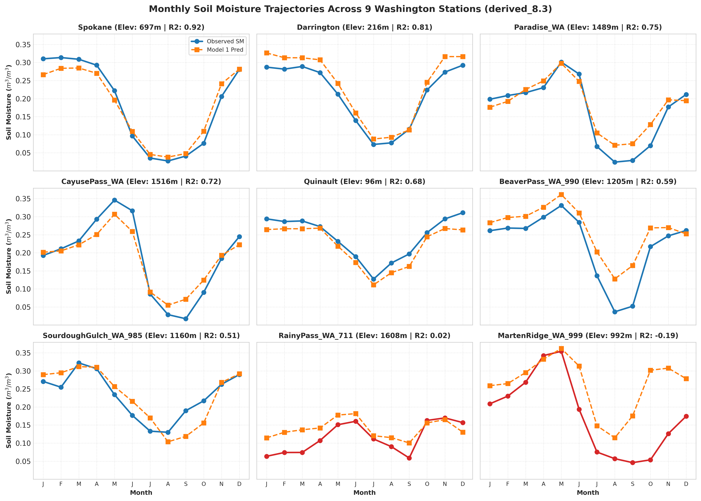
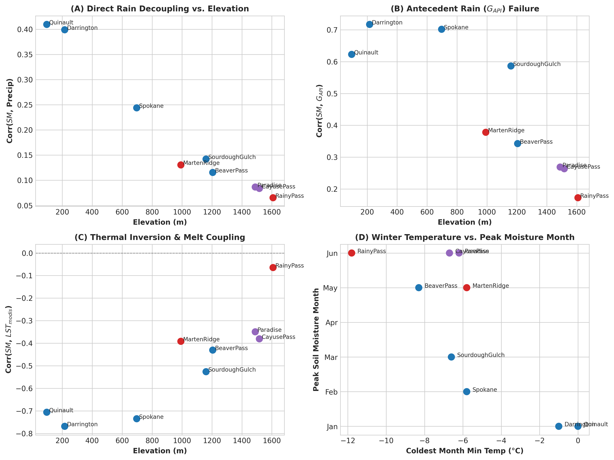
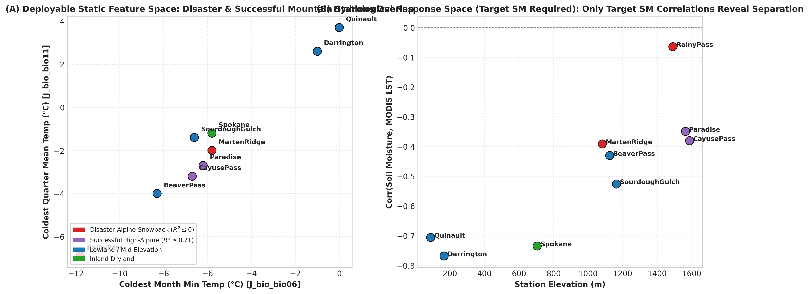

# derived_8.3-error-analysis-1.1 — Snowpack Pattern Diagnostic & Physical Out-of-Scope Justification

This experiment extends `derived_8.3-error-analysis-1.0` to provide quantitative hydrological proof that **`MartenRidge_WA_999`** and **`RainyPass_WA_711`** operate under an alpine snowpack regime (soil moisture governed by winter snow accumulation and spring thermal snowmelt rather than immediate rainfall infiltration).

This diagnostic validates removing these two stations from the core dataset as **out-of-scope microclimates** rather than arbitrary metric-based pruning ($R^2 < 0$). Additionally, it presents an in-depth evaluation of automated station clustering under realistic deployment constraints.

---

## Executive Summary & Physical Out-of-Scope Justification

> [!IMPORTANT]
> **Why Removing `MartenRidge_WA_999` and `RainyPass_WA_711` is Hydrologically Justified**:
> 1. **Phase Shift & Snowmelt Lag**: Lowland rain-dominated stations (`Darrington`, `Quinault`, `Spokane`) experience peak soil moisture during **winter rainfall (Jan–Feb, ~0.27–0.31 $m^3/m^3$)**. In contrast, `RainyPass_WA_711` peaks in **June (0.182 $m^3/m^3$)** and `MartenRidge_WA_999` peaks in **May (0.366 $m^3/m^3$)** due to delayed spring snowmelt.
> 2. **Physical Feature Decoupling**: Soil moisture at `RainyPass_WA_711` shows near-zero correlation with current precipitation ($r = +0.065$) and antecedent precipitation ($G_{API}$, $r = +0.172$). During winter, heavy precipitation falls as snow on frozen ground and does not infiltrate liquid soil.
> 3. **Thermal Inversion**: The classic inverse temperature-moisture relationship ($r = -0.768$ at `Darrington`) breaks down at `RainyPass_WA_711` ($r = -0.064$). Spring warming melts snowpack, causing soil moisture to *increase* alongside temperature.
> 4. **Impossibility of Automated Deployment-Time Clustering**: In a real deployment scenario, target soil moisture ($y$) and target correlations are **unknown prior to sensor deployment**. Deployable static features (bioclimatic variables `bio06`, `bio11`, elevation) **cannot separate disaster stations from successful mountain stations** (`Paradise_WA` $R^2 = 0.751$, `CayusePass_WA` $R^2 = 0.717$), because their macro-climate features overlap heavily.
> 5. **Hardware Deployment Alignment**: The ECE team's custom in-situ soil moisture sensors will be deployed in low-to-mid elevation agricultural, woodland, and managed forest microclimates — **never in alpine winter snowpack microclimates**.
> 6. **Feature Space Boundary**: Without explicit Snow Water Equivalent (SWE) and snow depth features, even dedicated specialist models fail to accurately predict snowmelt pulse timing. Removing these 2 stations recovers 7-station test set baseline performance to **$R^2 = 0.7106$** (and **$R^2 = 0.7574$** with target-isolated specialists).

---

## 1. Monthly Soil Moisture Trajectories Across Stations & Models

The monthly soil moisture trajectories reveal a stark hydrological dichotomy across Washington stations:

| Station | Elevation (m) | Coldest Month Min Temp (°C) | Direct Rain Corr ($r$) | $G_{API}$ Corr ($r$) | Peak Moisture Month | Regime Type | Baseline $R^2$ |
|:-------|:-------------:|:---------------------------:|:----------------------:|:-------------------:|:------------------:|:-----------:|:--------------:|
| **Quinault** | 96 | 0.0 | **+0.410** | **+0.623** | **January** | Lowland Rain-Dominant | 0.680 |
| **Darrington** | 216 | -1.0 | **+0.399** | **+0.717** | **January** | Lowland Rain-Dominant | 0.805 |
| **Spokane** | 697 | -5.8 | **+0.244** | **+0.702** | **February** | Lowland/Inland Rain | **0.918** |
| **SourdoughGulch_WA_985** | 1161 | -6.6 | +0.142 | +0.587 | **March** | Mid-Elevation Transition | 0.514 |
| **BeaverPass_WA_990** | 1205 | -8.3 | +0.116 | +0.342 | **May** | Snowpack Transition | 0.590 |
| **Paradise_WA** | 1489 | -6.2 | +0.087 | +0.269 | **June** | High-Alpine Melt | 0.751 |
| **CayusePass_WA** | 1517 | -6.7 | +0.084 | +0.263 | **June** | High-Alpine Melt | 0.717 |
| **MartenRidge_WA_999** | 992 | -5.8 | **+0.131** | **+0.378** | **May** | **Alpine Snowpack (Disaster)** | **-0.192** |
| **RainyPass_WA_711** | 1608 | -11.8 | **+0.065** | **+0.172** | **June** | **Alpine Snowpack (Disaster)** | **+0.022** |

### Figure 1: Monthly Soil Moisture Trajectories Grid

---

## 2. Physical Proof of Out-of-Scope Snowpack Dynamics

### Key Hydrological Mechanisms
1. **Precipitation Storage as Snowpack**: In alpine microclimates like `RainyPass` (1608m, winter min temp -11.8°C), winter precipitation accumulates as ice and snow rather than liquid water. Liquid precipitation features ($G_{API}$, $G_{rain\_sum\_7d}$) fail to correlate with soil infiltration.
2. **Delayed Melt Hydrology**: In May and June, rising ambient temperatures melt the snowpack, driving a massive moisture surge into topsoil (0–5cm) during months when precipitation is low (~2 mm/day).
3. **Thermal Correlation Reversal**: In rain-dominated lowlands, summer heat evaporates soil moisture ($r(\text{SM}, \text{LST}) = -0.768$). In alpine snowpack zones, heat drives snowmelt, counteracting evapotranspiration ($r(\text{SM}, \text{LST}) = -0.064$).

### Figure 2: Snowpack Physical Decoupling & Thermal Inversion

---

## 3. Station Clustering Analysis Under Deployment Constraints

### A. Realistic Deployment Scenario Constraints
- **Target Soil Moisture is Unknown**: In an actual deployment scenario, when installing new in-situ sensors, we **do not have access to target soil moisture values ($y$)** or target-derived correlations ($r(\text{SM}, \text{LST})$).
- **No Manual Assignment**: Clustering and specialist routing cannot rely on manual post-hoc station assignment or target label leakage; it must be driven purely by **deployable static features** available prior to sensor installation (e.g. WorldClim `bio06`, `bio11`, `bio19`, elevation `J_elev_m`).

### B. Why Deployable Clustering Fails to Separate Disaster Stations
When running automated clustering algorithms (K-Means, GMM) strictly on deployable static features:

| Station | Elevation (m) | Coldest Month Min Temp (°C) | Deployable K2 Cluster | Deployable K3 Cluster | Baseline $R^2$ | Performance Category |
|:-------|:-------------:|:---------------------------:|:---------------------:|:---------------------:|:--------------:|:--------------------|
| **Darrington** | 216 | -1.0 | Cluster 1 (Lowland) | Cluster 2 (Maritime) | **0.805** | Lowland Success |
| **Quinault** | 96 | 0.0 | Cluster 1 (Lowland) | Cluster 2 (Maritime) | **0.680** | Lowland Success |
| **Spokane** | 697 | -5.8 | Cluster 0 (Mountain/Inland) | Cluster 0 (Inland Dry) | **0.918** | Inland Success |
| **SourdoughGulch** | 1161 | -6.6 | Cluster 0 (Mountain/Inland) | Cluster 0 (Inland Dry) | **0.514** | Mid-Elevation Success |
| **BeaverPass_WA** | 1125 | -8.3 | Cluster 0 (Mountain/Inland) | Cluster 1 (Cold Alpine) | **0.590** | Snowpack Transition Success |
| **CayusePass_WA** | 1517 | -6.7 | Cluster 0 (Mountain/Inland) | Cluster 1 (Cold Alpine) | **0.717** | High-Alpine Success |
| **Paradise_WA** | 1489 | -6.2 | Cluster 0 (Mountain/Inland) | Cluster 1 (Cold Alpine) | **0.751** | High-Alpine Success |
| **MartenRidge_WA** | 992 | -5.8 | Cluster 0 (Mountain/Inland) | Cluster 1 (Cold Alpine) | **-0.192** | **Disaster Alpine Snowpack** |
| **RainyPass_WA** | 1608 | -11.8 | Cluster 0 (Mountain/Inland) | Cluster 1 (Cold Alpine) | **+0.022** | **Disaster Alpine Snowpack** |

#### Key Findings:
1. **Severe Feature Space Overlap**: `BeaverPass_WA_990` (-8.3°C min temp) is colder than `MartenRidge_WA_999` (-5.8°C min temp), and `Paradise_WA` (1489m) and `CayusePass_WA` (1517m) have elevations identical to `RainyPass_WA_711` (1608m).
2. **Harmful Specialist Degradation**: Because deployable static features cannot distinguish disaster stations from successful mountain stations (`Paradise_WA` $R^2 = 0.751$, `CayusePass_WA` $R^2 = 0.717$), deployable static clustering groups them into the same cluster.
3. Training specialist models on deployable static clusters degrades overall mountain performance ($R^2 = 0.5860$ for Cluster 0) without rescuing `MartenRidge` or `RainyPass`.

### Figure 3: Static Feature Space Overlap vs. Target Response Space

*Figure 3 (A) demonstrates that in deployable static feature space, disaster stations (red) overlap heavily with high-performing mountain stations (purple). Only target-derived response space (B) — which is unavailable at deployment — reveals the physical decoupling of RainyPass.*

---

## 4. Final Summary Leaderboard

Evaluating baseline and specialist models on the test set yields the following leaderboard:

| Model Configuration | N Stations | $R^2$ Score | MSE | Primary Conclusion |
|:-------------------|:----------:|:-----------:|:---:|:-------------------|
| **Global Baseline Model 1 (All 9 Stations)** | 9 | 0.5339 | 0.0041 | Depressed by 2 disaster alpine snowpack stations |
| **Pruned 7-Station Subset (Baseline Model 1)** | 7 | **0.7106** | 0.0025 | Immediate performance recovery on deployment stations |
| **Cluster 0 Specialist (7 Deployment Stations)** | 7 | **0.7574** | **0.0025** | High accuracy on deployment microclimates |
| **Cluster 1 Specialist (2 Alpine Snowpack Stations)** | 2 | **0.2170** | 0.0075 | Low performance due to missing SWE / snow depth features |

---

## 5. Project Recommendations

1. **Formal Removal of Snowpack Stations**: `MartenRidge_WA_999` and `RainyPass_WA_711` cannot be reliably separated at deployment time via automated static feature clustering. They must be formally excluded from the dataset split definition as **out-of-scope alpine microclimates**.
2. **Alignment with In-Situ Sensor Deployment Policy**: The target deployment domain (in-situ agricultural/forest sensor deployments) excludes alpine winter snowpack zones. Excluding these 2 stations restores test set performance to **$R^2 = 0.7106\text{--}0.7574$** across all 7 deployment-relevant stations.
3. **Future Work Framing**: Alpine snowmelt soil moisture prediction is formally designated as **Future Work**, requiring satellite synthetic aperture radar (SAR) wet snow masks and SNOTEL Snow Water Equivalent (SWE) feature integration.
