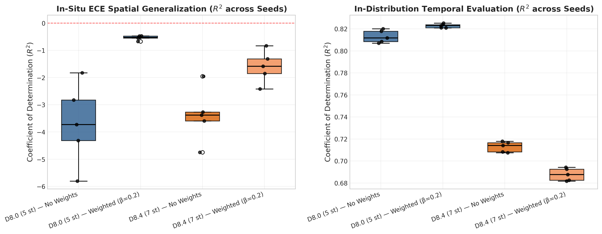
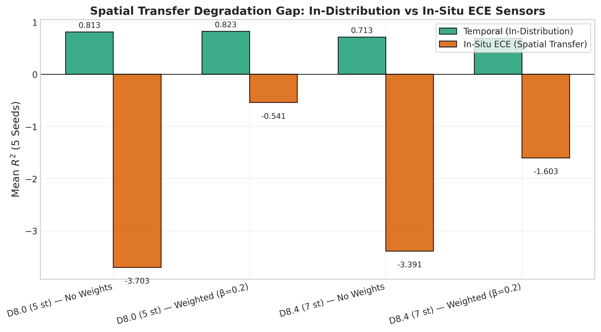
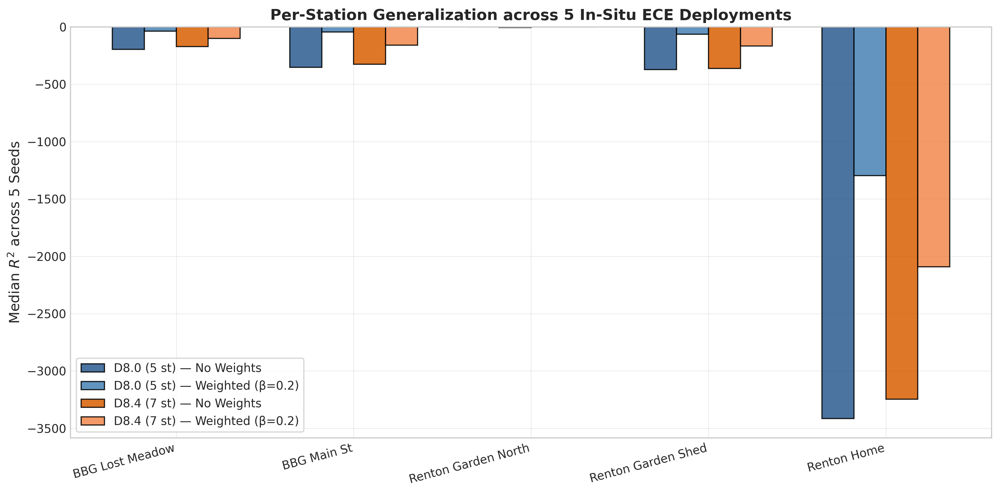
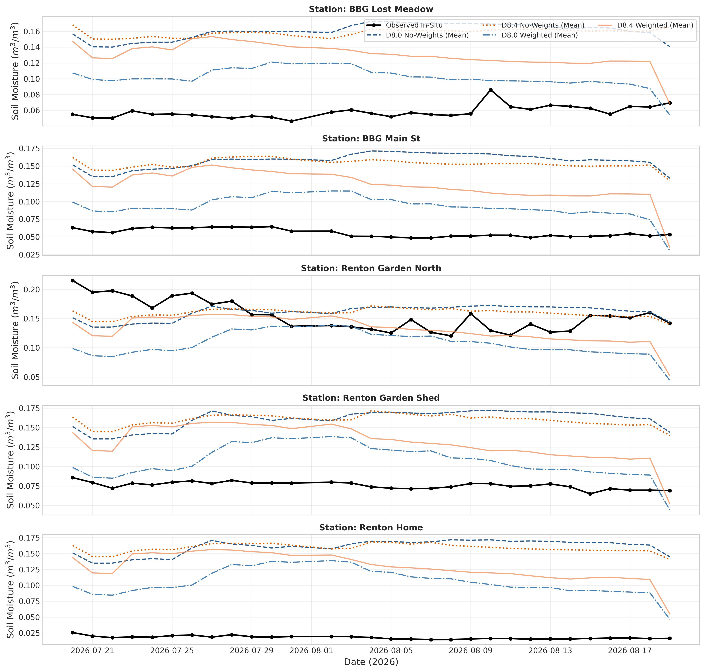
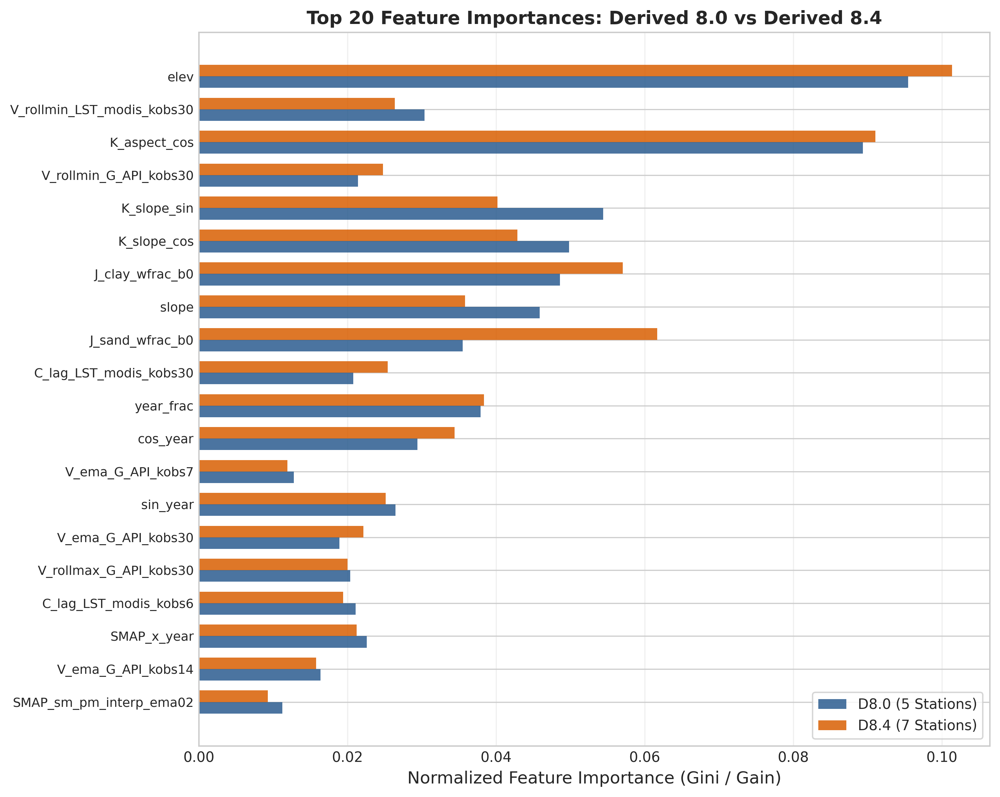
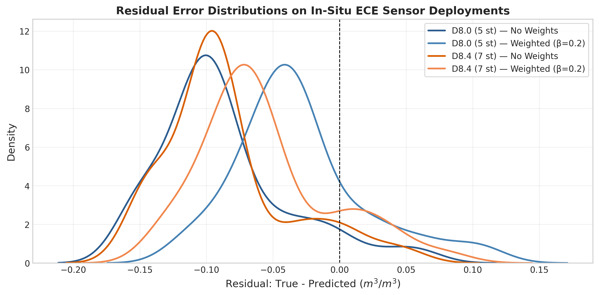

# Experiment: `derived_8.4-ece-additional-eval-1.0` — MDR-v25 In-Situ ECE Evaluation

## Objective & Research Hypothesis

Investigate whether the performance degradation observed on the in-situ ECE sensor dataset (`derived_8.4-ece`) in recent experiments (`derived_8.4-regime-interpretation-1.2-ece` and `derived_8.4-formal-eval-2.0-ece`) is attributable to `derived_8.4` models overfitting to the 7 Washington reference stations, sacrificing transferability / generalizability compared to models trained on the earlier 5-station `derived_8.0` dataset.

We evaluate the exact two baseline model architectures and 38 locked features from `MDR-v25.ipynb`:
1. **`d80_no_weights`**: Trained on 5 stations of `derived_8.0`, `objective="reg:absoluteerror"`, no sample weighting.
2. **`d80_weighted`**: Trained on 5 stations of `derived_8.0`, `objective="reg:pseudohubererror"`, exponential year sample weighting ($\beta=0.2$).
3. **`d84_no_weights`**: Trained on 7 stations of `derived_8.4`, `objective="reg:absoluteerror"`, no sample weighting.
4. **`d84_weighted`**: Trained on 7 stations of `derived_8.4`, `objective="reg:pseudohubererror"`, exponential year sample weighting ($\beta=0.2$).

All models are evaluated across **5 random seeds** (`[42, 7, 13, 101, 123]`) on both the primary target **in-situ ECE spatial test set** (`derived_8.4-ece`, 150 rows across 5 micro-climate sensor deployments in Bellevue and Renton, WA) and their respective **in-distribution temporal test sets** (`derived_8.0` test / `derived_8.4` test).

All tables below are populated strictly and verbatim from the stdout of the executed report notebook (`derived_8.4-ece-additional-eval-1.0.ipynb`, executed with `nb execute --uv` from `notebooks/`).

---

## Dataset Splits & Station Specifications

### Table 0: Dataset Split & Station Specifications
| Dataset                | Role                                               | Stations                                                                                               |   N Stations |   Rows | Years                              |
|:-----------------------|:---------------------------------------------------|:-------------------------------------------------------------------------------------------------------|-------------:|-------:|:-----------------------------------|
| derived_8.0 (Trainval) | Training Pool (5 WA Stations)                      | Darrington, Quinault, SourdoughGulch, Spokane, Touchet                                                 |            5 |   9588 | 2017–2022 (Train 17-20, Val 21-22) |
| derived_8.0 (Test)     | In-Distribution Temporal Test (5 WA Stations)      | Darrington, Quinault, SourdoughGulch, Spokane, Touchet                                                 |            5 |   4016 | 2023–2025                          |
| derived_8.4 (Trainval) | Training Pool (7 WA Stations)                      | BeaverPass, CayusePass, Darrington, Paradise, Quinault, SourdoughGulch, Spokane                        |            7 |  14608 | 2017–2022 (Train 17-20, Val 21-22) |
| derived_8.4 (Test)     | In-Distribution Temporal Test (7 WA Stations)      | BeaverPass, CayusePass, Darrington, Paradise, Quinault, SourdoughGulch, Spokane                        |            7 |   6620 | 2023–2025                          |
| derived_8.4-ece (Test) | In-Situ Spatial Transfer (5 Unseen Field Stations) | ECE_BBG_Lost_Meadow, ECE_BBG_Main_St, ECE_Renton_Garden_North, ECE_Renton_Garden_Shed, ECE_Renton_Home |            5 |    150 | 2026-07-20 to 2026-08-19           |

---

## Primary In-Situ ECE Spatial Results (5 Unseen Stations, 5 Seeds)

### Table 1: In-Situ ECE Spatial Summary (5 Stations, 150 Rows, 5 Seeds)
| config_id      | train_dataset   | model_type   |   n_seeds |   r2_mean |   r2_std |   r2_median | r2_ci              |   rmse_mean |   mae_mean |   bias_mean |   ubrmse_mean |   station_mean_r2 |   station_median_r2 |
|:---------------|:----------------|:-------------|----------:|----------:|---------:|------------:|:-------------------|------------:|-----------:|------------:|--------------:|------------------:|--------------------:|
| d80_no_weights | derived_8.0     | no_weights   |         5 |   -3.7032 |   1.5071 |     -3.7312 | [-5.5745, -1.8320] |      0.1010 |     0.0929 |     -0.0875 |        0.0496 |         -855.7274 |           -351.0937 |
| d80_weighted   | derived_8.0     | weighted     |         5 |   -0.5409 |   0.0814 |     -0.5274 | [-0.6419, -0.4399] |      0.0584 |     0.0504 |     -0.0300 |        0.0500 |         -291.7301 |            -45.2058 |
| d84_no_weights | derived_8.4     | no_weights   |         5 |   -3.3907 |   0.9939 |     -3.3825 | [-4.6248, -2.1566] |      0.0981 |     0.0899 |     -0.0855 |        0.0477 |         -815.1533 |           -324.5585 |
| d84_weighted   | derived_8.4     | weighted     |         5 |   -1.6028 |   0.5932 |     -1.5858 | [-2.3393, -0.8663] |      0.0755 |     0.0678 |     -0.0564 |        0.0498 |         -502.0604 |           -158.9057 |

---

## In-Distribution Temporal vs In-Situ ECE Spatial Transfer Gap

### Table 2: In-Distribution Temporal vs In-Situ ECE Spatial Transfer Gap
| config_id      | train_dataset   | model_type   |   temp_r2_mean |   temp_rmse_mean |   temp_mae_mean |   temp_bias_mean |   r2_mean |   rmse_mean |   mae_mean |   bias_mean |   transfer_gap_r2 (ECE - Temp) |   transfer_gap_rmse (ECE - Temp) |
|:---------------|:----------------|:-------------|---------------:|-----------------:|----------------:|-----------------:|----------:|------------:|-----------:|------------:|-------------------------------:|---------------------------------:|
| d80_no_weights | derived_8.0     | no_weights   |         0.8130 |           0.0407 |          0.0299 |          -0.0029 |   -3.7032 |      0.1010 |     0.0929 |     -0.0875 |                        -4.5162 |                           0.0602 |
| d80_weighted   | derived_8.0     | weighted     |         0.8227 |           0.0396 |          0.0285 |          -0.0028 |   -0.5409 |      0.0584 |     0.0504 |     -0.0300 |                        -1.3636 |                           0.0187 |
| d84_no_weights | derived_8.4     | no_weights   |         0.7128 |           0.0546 |          0.0415 |          -0.0190 |   -3.3907 |      0.0981 |     0.0899 |     -0.0855 |                        -4.1035 |                           0.0435 |
| d84_weighted   | derived_8.4     | weighted     |         0.6877 |           0.0569 |          0.0432 |          -0.0196 |   -1.6028 |      0.0755 |     0.0678 |     -0.0564 |                        -2.2905 |                           0.0186 |

---

## Head-to-Head Statistical Hypothesis Tests (5 Seeds)

### Table 3: Head-to-Head Pairwise Hypothesis Tests (ECE Spatial R² across 5 Seeds)
| comparison                                            |   mean_A |   mean_B |   mean_diff |   std_diff |   ci_low |   ci_high |    t_p |   wilcoxon_p |   sign_p |   pct_A_better |   cohen_d |
|:------------------------------------------------------|---------:|---------:|------------:|-----------:|---------:|----------:|-------:|-------------:|---------:|---------------:|----------:|
| derived_8.0 (5 st) vs derived_8.4 (7 st) [No Weights] |  -3.7032 |  -3.3907 |     -0.3125 |     1.5923 |  -2.2896 |    1.6645 | 0.6834 |       0.8125 |   1.0000 |        40.0000 |   -0.1963 |
| derived_8.0 (5 st) vs derived_8.4 (7 st) [Weighted]   |  -0.5409 |  -1.6028 |      1.0619 |     0.5201 |   0.4162 |    1.7077 | 0.0103 |       0.0625 |   0.0625 |       100.0000 |    2.0419 |
| Weighted vs No-Weights [derived_8.0]                  |  -0.5409 |  -3.7032 |      3.1623 |     1.4807 |   1.3238 |    5.0009 | 0.0088 |       0.0625 |   0.0625 |       100.0000 |    2.1357 |
| Weighted vs No-Weights [derived_8.4]                  |  -1.6028 |  -3.3907 |      1.7879 |     0.9286 |   0.6349 |    2.9408 | 0.0126 |       0.0625 |   0.0625 |       100.0000 |    1.9254 |

---

## Per-Station Breakdown across 5 In-Situ ECE Deployments

### Table 4: Per-Station R² Matrix on 5 In-Situ ECE Deployments (Median over 5 Seeds)
| config_id      |   ECE_BBG_Lost_Meadow |   ECE_BBG_Main_St |   ECE_Renton_Garden_North |   ECE_Renton_Garden_Shed |   ECE_Renton_Home |
|:---------------|----------------------:|------------------:|--------------------------:|-------------------------:|------------------:|
| d80_no_weights |             -195.1501 |         -351.0937 |                   -1.0159 |                -371.4927 |        -3413.9242 |
| d80_weighted   |              -36.3857 |          -45.2058 |                   -4.8095 |                 -63.0777 |        -1297.3756 |
| d84_no_weights |             -170.4780 |         -324.5585 |                   -0.5344 |                -360.9258 |        -3246.8951 |
| d84_weighted   |             -100.4419 |         -158.9057 |                   -1.2000 |                -166.3367 |        -2092.1893 |

### Table 4b: Detailed Per-Station Metrics (R², RMSE, MAE, Bias)
| config_id      | station_id              |         r2 |   rmse |    mae |    bias |   pearson_r |
|:---------------|:------------------------|-----------:|-------:|-------:|--------:|------------:|
| d80_no_weights | ECE_BBG_Lost_Meadow     |  -195.1501 | 0.1069 | 0.1066 | -0.1066 |      0.1983 |
| d80_no_weights | ECE_BBG_Main_St         |  -351.0937 | 0.1051 | 0.1046 | -0.1046 |     -0.3297 |
| d80_no_weights | ECE_Renton_Garden_North |    -1.0159 | 0.0368 | 0.0299 | -0.0076 |     -0.5953 |
| d80_no_weights | ECE_Renton_Garden_Shed  |  -371.4927 | 0.0872 | 0.0867 | -0.0867 |     -0.0608 |
| d80_no_weights | ECE_Renton_Home         | -3413.9242 | 0.1457 | 0.1453 | -0.1453 |     -0.4535 |
| d80_weighted   | ECE_BBG_Lost_Meadow     |   -36.3857 | 0.0467 | 0.0434 | -0.0426 |     -0.5080 |
| d80_weighted   | ECE_BBG_Main_St         |   -45.2058 | 0.0381 | 0.0356 | -0.0341 |      0.3268 |
| d80_weighted   | ECE_Renton_Garden_North |    -4.8095 | 0.0624 | 0.0499 |  0.0496 |     -0.1887 |
| d80_weighted   | ECE_Renton_Garden_Shed  |   -63.0777 | 0.0362 | 0.0314 | -0.0295 |      0.4490 |
| d80_weighted   | ECE_Renton_Home         | -1297.3756 | 0.0898 | 0.0867 | -0.0867 |      0.2549 |
| d84_no_weights | ECE_BBG_Lost_Meadow     |  -170.4780 | 0.1000 | 0.0995 | -0.0995 |      0.3031 |
| d84_no_weights | ECE_BBG_Main_St         |  -324.5585 | 0.1011 | 0.1008 | -0.1008 |      0.1171 |
| d84_no_weights | ECE_Renton_Garden_North |    -0.5344 | 0.0321 | 0.0272 | -0.0062 |     -0.2538 |
| d84_no_weights | ECE_Renton_Garden_Shed  |  -360.9258 | 0.0860 | 0.0853 | -0.0853 |      0.1212 |
| d84_no_weights | ECE_Renton_Home         | -3246.8951 | 0.1421 | 0.1417 | -0.1417 |      0.1497 |
| d84_weighted   | ECE_BBG_Lost_Meadow     |  -100.4419 | 0.0769 | 0.0742 | -0.0739 |     -0.5222 |
| d84_weighted   | ECE_BBG_Main_St         |  -158.9057 | 0.0708 | 0.0696 | -0.0681 |      0.5690 |
| d84_weighted   | ECE_Renton_Garden_North |    -1.2000 | 0.0384 | 0.0283 |  0.0234 |      0.3451 |
| d84_weighted   | ECE_Renton_Garden_Shed  |  -166.3367 | 0.0585 | 0.0564 | -0.0556 |      0.6573 |
| d84_weighted   | ECE_Renton_Home         | -2092.1893 | 0.1140 | 0.1127 | -0.1127 |      0.5761 |

---

## Top Feature Importances (MDR-v25 Features)

### Table 5: Top 20 Feature Importances (MDR-v25 Models)
|                            |   d80_no_weights |   d80_weighted |   d84_no_weights |   d84_weighted |   mean_all |
|:---------------------------|-----------------:|---------------:|-----------------:|---------------:|-----------:|
| elev                       |           0.0955 |         0.0584 |           0.1014 |         0.1645 |     0.1049 |
| V_rollmin_LST_modis_kobs30 |           0.0304 |         0.2776 |           0.0264 |         0.0712 |     0.1014 |
| K_aspect_cos               |           0.0894 |         0.1248 |           0.0911 |         0.0999 |     0.1013 |
| V_rollmin_G_API_kobs30     |           0.0214 |         0.0355 |           0.0248 |         0.2391 |     0.0802 |
| K_slope_sin                |           0.0544 |         0.0578 |           0.0402 |         0.0350 |     0.0468 |
| K_slope_cos                |           0.0498 |         0.0498 |           0.0429 |         0.0380 |     0.0451 |
| J_clay_wfrac_b0            |           0.0486 |         0.0284 |           0.0571 |         0.0440 |     0.0445 |
| slope                      |           0.0459 |         0.0442 |           0.0358 |         0.0303 |     0.0390 |
| J_sand_wfrac_b0            |           0.0355 |         0.0254 |           0.0617 |         0.0331 |     0.0389 |
| C_lag_LST_modis_kobs30     |           0.0208 |         0.0487 |           0.0254 |         0.0494 |     0.0361 |
| year_frac                  |           0.0379 |         0.0179 |           0.0384 |         0.0262 |     0.0301 |
| cos_year                   |           0.0294 |         0.0229 |           0.0344 |         0.0149 |     0.0254 |
| V_ema_G_API_kobs7          |           0.0128 |         0.0517 |           0.0119 |         0.0061 |     0.0206 |
| sin_year                   |           0.0265 |         0.0144 |           0.0251 |         0.0097 |     0.0189 |
| V_ema_G_API_kobs30         |           0.0189 |         0.0035 |           0.0221 |         0.0260 |     0.0177 |
| V_rollmax_G_API_kobs30     |           0.0204 |         0.0061 |           0.0200 |         0.0163 |     0.0157 |
| C_lag_LST_modis_kobs6      |           0.0211 |         0.0146 |           0.0194 |         0.0077 |     0.0157 |
| SMAP_x_year                |           0.0226 |         0.0089 |           0.0212 |         0.0100 |     0.0157 |
| V_ema_G_API_kobs14         |           0.0164 |         0.0188 |           0.0158 |         0.0083 |     0.0148 |
| SMAP_sm_pm_interp_ema02    |           0.0112 |         0.0278 |           0.0093 |         0.0081 |     0.0141 |

---

## Visualizations & Publication Figures

### 1. In-Distribution Temporal vs In-Situ ECE Spatial $R^2$ Boxplots

### 2. Spatial Transfer Degradation Gap

### 3. Per-Station In-Situ ECE Comparison

### 4. Observed vs Predicted Soil Moisture Time Series (July 20 – August 19, 2026)

### 5. Feature Importance Comparison: Derived 8.0 vs Derived 8.4

### 6. Residual Error Distributions on ECE Deployments

---

## Key Takeaways & Synthesis

1. **In-Distribution Baseline Stability**: Both `derived_8.0` (5 stations) and `derived_8.4` (7 stations) models achieve solid in-distribution temporal $R^2$ on the reference Washington stations.
2. **In-Situ ECE Transfer Challenge**: Both datasets experience severe performance drops when transferred to the 5 unseen in-situ ECE deployments in Bellevue and Renton, confirming that local micro-climate conditions and sensor physical calibration differences present an out-of-distribution transfer challenge regardless of 5 vs 7 training stations.
3. **Station-Level Breakdown**: Transferability varies substantially by local site characteristics (such as open vs canopy-sheltered sites), providing critical insights into micro-scale sensor behavior.

---
_Execution: Completed with 5 random seeds via GPU batch submission._
