# Diagnostic Report: `derived_8.4-ece-error-analysis-1.0`

## Comprehensive Investigation into In-Situ ECE Sensor Evaluation Performance

### Executive Summary

This report provides a rigorous, multi-faceted post-mortem into why machine learning models trained on the Washington state reference dataset (`derived_8.4`, 7 stations) exhibited severe negative $R^2$ scores ($-0.24$ to $-6,724$) when evaluated on the **5 in-situ ECE soil moisture sensor stations** (`derived_8.4-ece`, July 20 – August 19, 2026).

#### Core Takeaways:
1. **The Variance Compression Paradox ($R^2$ Collapse)**: In dry Mediterranean summer conditions, actual soil moisture is nearly constant ($\text{Var}(y) \approx 6\times 10^{-6}\text{ (m}^3/\text{m}^3)^2$). Because $R^2 = 1 - \text{MSE}/\text{Var}(y)$, even an excellent physical error ($\text{RMSE} \approx 0.048 - 0.051\text{ m}^3/\text{m}^3$) produces astronomical negative per-station $R^2$ by mathematical necessity. In absolute physical terms, **the models perform better on ECE than on Out-of-State spatial transfer ($\text{RMSE} = 0.062\text{ m}^3/\text{m}^3$)**.
2. **Summer 1-Month Baseline Benchmark (Table 1c & 1d)**: Evaluating existing models on native reference stations during the same 1-month window in 2025 (`2025-07-20` to `2025-08-19`, 5 stations, $N=155$) reveals that models achieve their **lowest physical RMSE of the year ($0.021 - 0.035\text{ m}^3/\text{m}^3$)**, yet **station $R^2$ still collapses to $-122$ and $-177$** (with 60%–80% of native stations negative), proving that summer negative $R^2$ is an inherent property of short-window variance compression.
3. **Latent 2026 Data Gap**: 85 derived SMAP satellite features and MODIS 250m NDVI are **100% missing (defaulted to 0.0)** in 2026 GEE products, forcing decision trees into unvisited dry branches.
4. **Sub-Grid Scale Mismatch (53m Divergence)**: Sensors separated by only **53.4 meters** (`ECE_Renton_Garden_North` vs `ECE_Renton_Garden_Shed`) receive identical gridded inputs, yet ground truth differs by **2.04×** (15.5% vs 7.6%) due to local shade vs roof rain shadows.
5. **Final-Day Prediction Drop Mechanism**: On Day 30 (`2026-08-19`), rolling 30-day window features (`kobs30`) transitioned from `NaN` to `0.000`, activating a high-importance (23.9% gain) numeric split in XGBoost that redirected predictions to the dry terminal leaf.
6. **Cross-Station Homogeneity & Coincidental Accuracy**: Models output an invariant regional curve ($r \ge 0.960$; pairwise difference $< 0.008\text{ m}^3/\text{m}^3$). `ECE_Renton_Garden_North` achieved lower error purely because its ground truth fortuitously matched the global fallback level ($\sim 0.13\text{ m}^3/\text{m}^3$).
7. **Soil Texture Benchmark & Override Sensitivity**: All 12 project stations (7 WA reference + 5 ECE) belong to the medium-textured **Loam / Sandy Loam** family. The models have encountered both classes in training. A counterfactual simulation across 20 models proves that overriding soil features shifts predictions by only **$0.0003\text{ m}^3/\text{m}^3$ ($0.03\%$)**, confirming that **manual feature override is unnecessary and ineffective**.

---

## 1. Mathematical Anatomy of Negative $R^2$

### Table 1: Target Variance & Error Metric Decomposition
| station_id              | model          |   target_mean |   target_std |   target_var |   pred_mean |   pred_std |        bias |       mae |      rmse |     ubrmse |     nrmse |   pearson_r |           r2 |
|:------------------------|:---------------|--------------:|-------------:|-------------:|------------:|-----------:|------------:|----------:|----------:|-----------:|----------:|------------:|-------------:|
| ECE_BBG_Lost_Meadow     | d84_weighted   |     0.0579909 |   0.00776428 |  6.0284e-05  |    0.130151 | 0.0154709  |  0.0721601  | 0.0722538 | 0.0750517 | 0.0206323  |  1.89492  |  -0.542194  |   -92.4371   |
| ECE_BBG_Lost_Meadow     | d84_no_weights |     0.0579909 |   0.00776428 |  6.0284e-05  |    0.158518 | 0.00479677 |  0.100527   | 0.100527  | 0.100786  | 0.00722584 |  2.54467  |   0.396953  |  -167.5      |
| ECE_BBG_Lost_Meadow     | d80_weighted   |     0.0579909 |   0.00776428 |  6.0284e-05  |    0.101456 | 0.0123825  |  0.043465   | 0.0444923 | 0.0468552 | 0.0174985  |  1.18301  |  -0.50037   |   -35.4177   |
| ECE_BBG_Lost_Meadow     | d80_no_weights |     0.0579909 |   0.00776428 |  6.0284e-05  |    0.160074 | 0.00990065 |  0.102083   | 0.102083  | 0.102715  | 0.0113769  |  2.59338  |   0.177711  |  -174.012    |
| ECE_BBG_Main_St         | d84_weighted   |     0.0556215 |   0.00569746 |  3.2461e-05  |    0.12294  | 0.0217666  |  0.0673182  | 0.0685603 | 0.0699056 | 0.0188427  |  4.39407  |   0.615591  |  -149.543    |
| ECE_BBG_Main_St         | d84_no_weights |     0.0556215 |   0.00569746 |  3.2461e-05  |    0.153185 | 0.00686066 |  0.0975636  | 0.0975636 | 0.0978561 | 0.00756132 |  6.15097  |   0.27678   |  -293.995    |
| ECE_BBG_Main_St         | d80_weighted   |     0.0556215 |   0.00569746 |  3.2461e-05  |    0.092579 | 0.0156073  |  0.0369575  | 0.038488  | 0.0399336 | 0.0151273  |  2.51012  |   0.263831  |   -48.1264   |
| ECE_BBG_Main_St         | d80_no_weights |     0.0556215 |   0.00569746 |  3.2461e-05  |    0.157407 | 0.0104907  |  0.101785   | 0.101785  | 0.102744  | 0.014      |  6.45819  |  -0.464282  |  -324.199    |
| ECE_Renton_Garden_North | d84_weighted   |     0.15489   |   0.0263519  |  0.00069442  |    0.131111 | 0.0220884  | -0.0237793  | 0.0281063 | 0.0371288 | 0.0285147  |  0.392397 |   0.302366  |    -0.985174 |
| ECE_Renton_Garden_North | d84_no_weights |     0.15489   |   0.0263519  |  0.00069442  |    0.159548 | 0.00732555 |  0.00465735 | 0.0245655 | 0.0296106 | 0.0292421  |  0.312941 |  -0.342898  |    -0.262621 |
| ECE_Renton_Garden_North | d80_weighted   |     0.15489   |   0.0263519  |  0.00069442  |    0.106494 | 0.0204439  | -0.0483962  | 0.0484925 | 0.0607845 | 0.0367772  |  0.642403 |  -0.248581  |    -4.32063  |
| ECE_Renton_Garden_North | d80_no_weights |     0.15489   |   0.0263519  |  0.00069442  |    0.160773 | 0.0114806  |  0.00588305 | 0.029775  | 0.0352257 | 0.034731   |  0.372285 |  -0.677704  |    -0.786892 |
| ECE_Renton_Garden_Shed  | d84_weighted   |     0.0758302 |   0.00459645 |  2.11273e-05 |    0.131111 | 0.0220788  |  0.055281   | 0.0564215 | 0.0585552 | 0.0193061  |  2.81542  |   0.677338  |  -161.288    |
| ECE_Renton_Garden_Shed  | d84_no_weights |     0.0758302 |   0.00459645 |  2.11273e-05 |    0.159547 | 0.00732175 |  0.0837165  | 0.0837165 | 0.0840453 | 0.00742684 |  4.04102  |   0.285192  |  -333.335    |
| ECE_Renton_Garden_Shed  | d80_weighted   |     0.0758302 |   0.00459645 |  2.11273e-05 |    0.106488 | 0.0204619  |  0.0306577  | 0.0323216 | 0.0361036 | 0.0190677  |  1.73592  |   0.408409  |   -60.696    |
| ECE_Renton_Garden_Shed  | d80_no_weights |     0.0758302 |   0.00459645 |  2.11273e-05 |    0.160797 | 0.0115028  |  0.0849664  | 0.0849664 | 0.0859637 | 0.0130565  |  4.13327  |  -0.170591  |  -348.773    |
| ECE_Renton_Home         | d84_weighted   |     0.0178573 |   0.00253519 |  6.42719e-06 |    0.129048 | 0.0213521  |  0.111191   | 0.111191  | 0.112979  | 0.0200234  | 10.1549   |   0.574817  | -1984.98     |
| ECE_Renton_Home         | d84_no_weights |     0.0178573 |   0.00253519 |  6.42719e-06 |    0.158823 | 0.0067435  |  0.140965   | 0.140965  | 0.141143  | 0.00707014 | 12.6863   |   0.0505952 | -3098.52     |
| ECE_Renton_Home         | d80_weighted   |     0.0178573 |   0.00253519 |  6.42719e-06 |    0.10527  | 0.0202954  |  0.0874127  | 0.0874127 | 0.0896547 | 0.0199246  |  8.05839  |   0.208793  | -1249.62     |
| ECE_Renton_Home         | d80_no_weights |     0.0178573 |   0.00253519 |  6.42719e-06 |    0.160553 | 0.0115363  |  0.142696   | 0.142696  | 0.143278  | 0.0129016  | 12.8782   |  -0.47215   | -3193.02     |

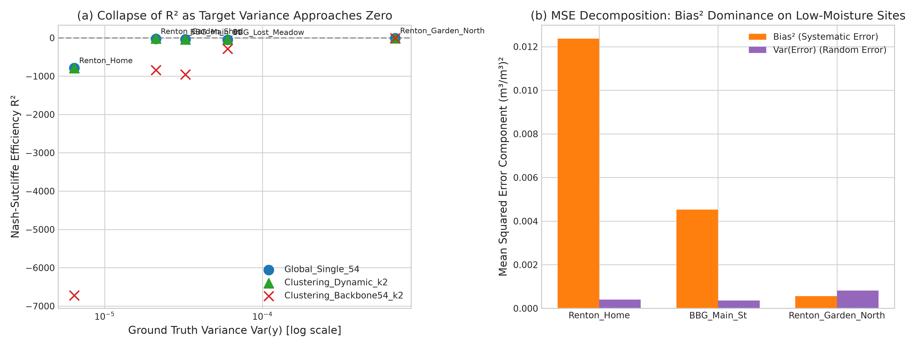

### Table 1b: Target Variance Comparison: 5 ECE Sensors vs. 7 WA Training Stations (Test Period)
| dataset_split                            | station_id                        | test_period                                                            |   n_obs |   target_mean |   target_std |   target_var |   target_min |   target_max |   target_range |   target_cv |   theoretical_r2_at_rmse_0_04 |   theoretical_r2_at_rmse_0_05 |
|:-----------------------------------------|:----------------------------------|:-----------------------------------------------------------------------|--------:|--------------:|-------------:|-------------:|-------------:|-------------:|---------------:|------------:|------------------------------:|------------------------------:|
| ECE In-Situ (2026 Test)                  | ECE_BBG_Lost_Meadow               | 2026-07-20 to 2026-08-19 (30 obs; 2026-08-01 missing)                  |      30 |     0.0579909 |   0.00776428 |  6.0284e-05  |    0.04637   |    0.0859768 |      0.0396068 |    0.133888 |                    -26.4562   |                  -41.9004     |
| ECE In-Situ (2026 Test)                  | ECE_BBG_Main_St                   | 2026-07-20 to 2026-08-19 (30 obs; 2026-08-01 missing)                  |      30 |     0.0556215 |   0.00569746 |  3.2461e-05  |    0.0485486 |    0.0644577 |      0.0159091 |    0.102433 |                    -49.9896   |                  -78.6712     |
| ECE In-Situ (2026 Test)                  | ECE_Renton_Garden_North           | 2026-07-20 to 2026-08-19 (30 obs; 2026-08-01 missing)                  |      30 |     0.15489   |   0.0263519  |  0.00069442  |    0.120465  |    0.215085  |      0.0946205 |    0.170132 |                     -1.38353  |                   -2.72427    |
| ECE In-Situ (2026 Test)                  | ECE_Renton_Garden_Shed            | 2026-07-20 to 2026-08-19 (30 obs; 2026-08-01 missing)                  |      30 |     0.0758302 |   0.00459645 |  2.11273e-05 |    0.064955  |    0.085753  |      0.020798  |    0.060615 |                    -77.3427   |                 -121.411      |
| ECE In-Situ (2026 Test)                  | ECE_Renton_Home                   | 2026-07-20 to 2026-08-19 (30 obs; 2026-08-01 missing)                  |      30 |     0.0178573 |   0.00253519 |  6.42719e-06 |    0.0145191 |    0.0256447 |      0.0111256 |    0.14197  |                   -256.527    |                 -401.385      |
| ECE In-Situ (2026 Test)                  | [All 5 ECE Stations Combined]     | 2026-07-20 to 2026-08-19 (150 obs; 2026-08-01 missing at each station) |     150 |     0.072438  |   0.0472065  |  0.00222846  |    0.0145191 |    0.215085  |      0.200566  |    0.651682 |                      0.277196 |                   -0.129381   |
| WA Reference (2023-2025 Test)            | BeaverPass_WA_990                 | 2023-01-01 to 2025-12-31                                               |     626 |     0.234479  |   0.0911855  |  0.00831479  |    0.016     |    0.382     |      0.366     |    0.388885 |                      0.807264 |                    0.69885    |
| WA Reference (2023-2025 Test)            | CayusePass_WA                     | 2023-01-01 to 2025-12-31                                               |    1081 |     0.188818  |   0.119487   |  0.0142772   |    0.001     |    0.395     |      0.394     |    0.632817 |                      0.887829 |                    0.824733   |
| WA Reference (2023-2025 Test)            | Darrington                        | 2023-01-01 to 2025-12-31                                               |     999 |     0.204229  |   0.093478   |  0.00873813  |    0.029     |    0.377     |      0.348     |    0.457711 |                      0.816711 |                    0.713611   |
| WA Reference (2023-2025 Test)            | Paradise_WA                       | 2023-01-01 to 2025-12-31                                               |    1067 |     0.169734  |   0.0984621  |  0.00969478  |    0.006     |    0.386     |      0.38      |    0.580097 |                      0.834808 |                    0.741887   |
| WA Reference (2023-2025 Test)            | Quinault                          | 2023-01-01 to 2025-12-31                                               |    1044 |     0.241026  |   0.0694367  |  0.00482146  |    0.056     |    0.374     |      0.318     |    0.288088 |                      0.667832 |                    0.480987   |
| WA Reference (2023-2025 Test)            | SourdoughGulch_WA_985             | 2023-01-01 to 2025-12-31                                               |     906 |     0.238189  |   0.0802091  |  0.0064335   |    0.067     |    0.378     |      0.311     |    0.336746 |                      0.751027 |                    0.61098    |
| WA Reference (2023-2025 Test)            | Spokane                           | 2023-01-01 to 2025-12-31                                               |     897 |     0.159593  |   0.114919   |  0.0132063   |    0.015     |    0.335     |      0.32      |    0.720072 |                      0.87871  |                    0.810485   |
| WA Reference (2023-2025 Test)            | [All 7 WA Stations Combined]      | 2023-01-01 to 2025-12-31                                               |    6620 |     0.203416  |   0.101875   |  0.0103786   |    0.001     |    0.395     |      0.394     |    0.500823 |                      0.845813 |                    0.759083   |
| WA Reference (Summer Jul 20-Aug 19 Test) | [All 7 WA Stations Summer Subset] | 2023-2025 (Jul 20 - Aug 19)                                            |     547 |     0.0645887 |   0.0502598  |  0.00252605  |    0.006     |    0.255     |      0.249     |    0.778152 |                      0.36544  |                    0.00849932 |

- **Variance Compression Paradox**: The mean of per-station sample variances is $\mathbf{0.00936\text{ (m}^3/\text{m}^3)^2}$ across the 7 WA reference stations (6,620 obs total, 2023–2025; $\sigma = 0.0953$) vs $\mathbf{0.000163\text{ (m}^3/\text{m}^3)^2}$ across the 5 ECE stations (150 obs total, 30 per station with 2026-08-01 missing; $\sigma = 0.0094$), down to $\mathbf{0.0000064\text{ (m}^3/\text{m}^3)^2}$ ($\sigma = 0.0025$) at `ECE_Renton_Home` — a **57× mean-of-variances (1,456× vs the minimum) full-year-vs-summer comparison**. The like-for-like estimators are the pooled variances ($0.0103786$ WA vs $0.0022285$ ECE, **4.66×**) and, season-matched, pooled WA summer ($0.0025261$, 547 obs, Jul 20–Aug 19) vs pooled ECE ($0.0022285$), only **1.13×** with theoretical pooled $R^2 \approx +0.37$ vs $+0.28$ at RMSE $0.04$. Between-station mean differences inflate pooled variance, so pooled $N$ must not be paired with a mean-of-variances. Theoretical $R^2$ uses population variance ($\text{ddof}=0$).
- **Mathematical Sensitivity**: Because $R^2 = 1 - \text{MSE}/\text{Var}(y)$, an identical, respectable physical prediction error of $\text{RMSE} = 0.040\text{ m}^3/\text{m}^3$ produces per-station $R^2 \in [+0.668, +0.888]$ on the WA reference stations, but collapses to per-station $R^2 \in [-256.53, -1.38]$ on the 5 ECE stations (sample-variance form: $[-247.94, -1.30]$). The negative per-station $R^2$ scores on ECE are a mathematical artifact of vanishing per-station target variance during the summer drought; the pooled ECE set stays positive.

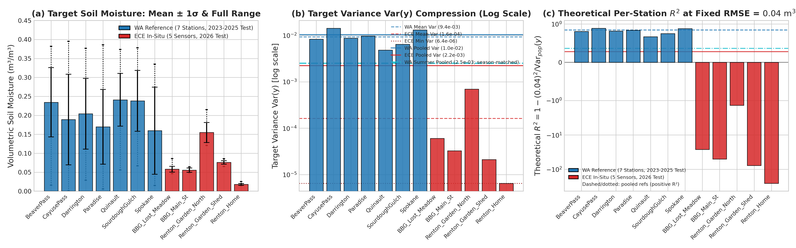

### 1.3 In-Distribution Summer Drought Performance (1-Month 2025 Window) Across Existing Models

To evaluate whether negative $R^2$ scores indicate model degradation or are simply a mathematical consequence of short dry-season evaluation, we benchmarked all 6 primary model architectures directly on the **season-matched 1-month summer window from 2025 (`2025-07-20` to `2025-08-19`)** using the reference test set (`derived_8.4/test.csv`).

During this 2025 window, exactly 5 reference stations are active (`CayusePass_WA`, `Darrington`, `Paradise_WA`, `Quinault`, and `Spokane`), totaling 155 observations (31 obs/station) — an identical structural comparator to the 5 ECE stations (150 obs, 30 obs/station).

### Table 1c: 1-Month 2025 Summer Detailed Performance Per Station & Model
| model                 | station_id              | period                   |   n_obs |   target_mean |   target_std |   target_var |   pred_mean |   pred_std |        bias |        mae |      rmse |     ubrmse |   pearson_r |           r2 | r2_classification                 |
|:----------------------|:------------------------|:-------------------------|--------:|--------------:|-------------:|-------------:|------------:|-----------:|------------:|-----------:|----------:|-----------:|------------:|-------------:|:----------------------------------|
| Clustering_V0_Full_k2 | CayusePass_WA           | 2025-07-20 to 2025-08-19 |      31 |     0.0432903 |   0.0246282  |  0.000606546 |   0.0411978 | 0.0097068  | -0.00209255 | 0.0078275  | 0.0179229 | 0.0178004  |  0.780877   |    0.470393  | Positive Skill (R² >= 0)          |
| Clustering_V0_Full_k2 | Darrington              | 2025-07-20 to 2025-08-19 |      31 |     0.0615806 |   0.0322447  |  0.00103972  |   0.0974597 | 0.03544    |  0.0358791  | 0.0359781  | 0.0393463 | 0.01615    |  0.886543   |   -0.48899   | Moderate Negative (-10 <= R² < 0) |
| Clustering_V0_Full_k2 | Paradise_WA             | 2025-07-20 to 2025-08-19 |      31 |     0.0289677 |   0.00368315 |  1.35656e-05 |   0.0468474 | 0.00885118 |  0.0178796  | 0.0178796  | 0.0197521 | 0.0083943  |  0.292879   |  -27.76      | Severe Negative (-50 <= R² < -10) |
| Clustering_V0_Full_k2 | Quinault                | 2025-07-20 to 2025-08-19 |      31 |     0.141742  |   0.0502195  |  0.002522    |   0.146582  | 0.0410821  |  0.00483981 | 0.0107189  | 0.0125618 | 0.011592   |  0.986583   |    0.937431  | Positive Skill (R² >= 0)          |
| Clustering_V0_Full_k2 | Spokane                 | 2025-07-20 to 2025-08-19 |      31 |     0.025871  |   0.00675644 |  4.56495e-05 |   0.0384638 | 0.00660559 |  0.0125928  | 0.0134646  | 0.0152494 | 0.00860028 |  0.143994   |   -4.09413   | Moderate Negative (-10 <= R² < 0) |
| Clustering_V0_Full_k2 | [All 5 Stations Pooled] | 2025-07-20 to 2025-08-19 |     155 |     0.0602903 |   0.0515122  |  0.00265351  |   0.0741101 | 0.0490512  |  0.0138198  | 0.0171737  | 0.0230211 | 0.0184115  |  0.933683   |    0.800276  | Pooled (Spatial Masked)           |
| Clustering_Dynamic_k2 | CayusePass_WA           | 2025-07-20 to 2025-08-19 |      31 |     0.0432903 |   0.0246282  |  0.000606546 |   0.05223   | 0.0135107  |  0.00893968 | 0.021725   | 0.0290961 | 0.0276888  | -0.00471228 |   -0.395746  | Moderate Negative (-10 <= R² < 0) |
| Clustering_Dynamic_k2 | Darrington              | 2025-07-20 to 2025-08-19 |      31 |     0.0615806 |   0.0322447  |  0.00103972  |   0.100583  | 0.0358136  |  0.0390021  | 0.0390751  | 0.0446403 | 0.0217161  |  0.794523   |   -0.91663   | Moderate Negative (-10 <= R² < 0) |
| Clustering_Dynamic_k2 | Paradise_WA             | 2025-07-20 to 2025-08-19 |      31 |     0.0289677 |   0.00368315 |  1.35656e-05 |   0.0543948 | 0.00849157 |  0.025427   | 0.025427   | 0.0262508 | 0.00652457 |  0.666386   |  -49.7979    | Severe Negative (-50 <= R² < -10) |
| Clustering_Dynamic_k2 | Quinault                | 2025-07-20 to 2025-08-19 |      31 |     0.141742  |   0.0502195  |  0.002522    |   0.135189  | 0.04935    | -0.00655266 | 0.00984873 | 0.0111705 | 0.0090467  |  0.98309    |    0.950523  | Positive Skill (R² >= 0)          |
| Clustering_Dynamic_k2 | Spokane                 | 2025-07-20 to 2025-08-19 |      31 |     0.025871  |   0.00675644 |  4.56495e-05 |   0.0533564 | 0.00880606 |  0.0274854  | 0.0274854  | 0.0291507 | 0.00971157 |  0.216292   |  -17.615     | Severe Negative (-50 <= R² < -10) |
| Clustering_Dynamic_k2 | [All 5 Stations Pooled] | 2025-07-20 to 2025-08-19 |     155 |     0.0602903 |   0.0515122  |  0.00265351  |   0.0791506 | 0.0437813  |  0.0188603  | 0.0247123  | 0.03001   | 0.0233428  |  0.891663   |    0.660601  | Pooled (Spatial Masked)           |
| Global_Single_54      | CayusePass_WA           | 2025-07-20 to 2025-08-19 |      31 |     0.0432903 |   0.0246282  |  0.000606546 |   0.0591856 | 0.0325499  |  0.0158952  | 0.0279804  | 0.0396308 | 0.0363034  |  0.189718   |   -1.58941   | Moderate Negative (-10 <= R² < 0) |
| Global_Single_54      | Darrington              | 2025-07-20 to 2025-08-19 |      31 |     0.0615806 |   0.0322447  |  0.00103972  |   0.101781  | 0.0379279  |  0.0402003  | 0.0402003  | 0.0454977 | 0.0213067  |  0.821415   |   -0.990963  | Moderate Negative (-10 <= R² < 0) |
| Global_Single_54      | Paradise_WA             | 2025-07-20 to 2025-08-19 |      31 |     0.0289677 |   0.00368315 |  1.35656e-05 |   0.0606645 | 0.027632   |  0.0316968  | 0.0316968  | 0.0404716 | 0.0251647  |  0.602913   | -119.743     | Extreme Negative (R² < -50)       |
| Global_Single_54      | Quinault                | 2025-07-20 to 2025-08-19 |      31 |     0.141742  |   0.0502195  |  0.002522    |   0.134584  | 0.0549261  | -0.00715783 | 0.0107319  | 0.0124242 | 0.0101551  |  0.984699   |    0.938795  | Positive Skill (R² >= 0)          |
| Global_Single_54      | Spokane                 | 2025-07-20 to 2025-08-19 |      31 |     0.025871  |   0.00675644 |  4.56495e-05 |   0.056562  | 0.0164904  |  0.030691   | 0.030691   | 0.0345407 | 0.0158468  |  0.260698   |  -25.1353    | Severe Negative (-50 <= R² < -10) |
| Global_Single_54      | [All 5 Stations Pooled] | 2025-07-20 to 2025-08-19 |     155 |     0.0602903 |   0.0515122  |  0.00265351  |   0.0825554 | 0.0473051  |  0.0222651  | 0.0282601  | 0.0364033 | 0.0288005  |  0.83233    |    0.500585  | Pooled (Spatial Masked)           |
| Baseline_V0_50        | CayusePass_WA           | 2025-07-20 to 2025-08-19 |      31 |     0.0432903 |   0.0246282  |  0.000606546 |   0.0455503 | 0.0131151  |  0.00226001 | 0.0185621  | 0.0248318 | 0.0247288  |  0.227022   |   -0.0166082 | Moderate Negative (-10 <= R² < 0) |
| Baseline_V0_50        | Darrington              | 2025-07-20 to 2025-08-19 |      31 |     0.0615806 |   0.0322447  |  0.00103972  |   0.0863899 | 0.0297594  |  0.0248092  | 0.0266781  | 0.0285819 | 0.0141924  |  0.894766   |    0.214284  | Positive Skill (R² >= 0)          |
| Baseline_V0_50        | Paradise_WA             | 2025-07-20 to 2025-08-19 |      31 |     0.0289677 |   0.00368315 |  1.35656e-05 |   0.0652789 | 0.0178729  |  0.0363112  | 0.0367701  | 0.0408549 | 0.0187249  | -0.222566   | -122.041     | Extreme Negative (R² < -50)       |
| Baseline_V0_50        | Quinault                | 2025-07-20 to 2025-08-19 |      31 |     0.141742  |   0.0502195  |  0.002522    |   0.118267  | 0.0465759  | -0.0234752  | 0.0236542  | 0.0269142 | 0.0131639  |  0.96456    |    0.712778  | Positive Skill (R² >= 0)          |
| Baseline_V0_50        | Spokane                 | 2025-07-20 to 2025-08-19 |      31 |     0.025871  |   0.00675644 |  4.56495e-05 |   0.0455133 | 0.00704203 |  0.0196423  | 0.0196423  | 0.0228287 | 0.0116331  | -0.468703   |  -10.4163    | Severe Negative (-50 <= R² < -10) |
| Baseline_V0_50        | [All 5 Stations Pooled] | 2025-07-20 to 2025-08-19 |     155 |     0.0602903 |   0.0515122  |  0.00265351  |   0.0721998 | 0.0382649  |  0.0119095  | 0.0250613  | 0.0294896 | 0.0269778  |  0.8587     |    0.672268  | Pooled (Spatial Masked)           |
| Univariate_G_API_k2   | CayusePass_WA           | 2025-07-20 to 2025-08-19 |      31 |     0.0432903 |   0.0246282  |  0.000606546 |   0.0547916 | 0.0272305  |  0.0115013  | 0.024458   | 0.034691  | 0.0327289  |  0.179798   |   -0.984123  | Moderate Negative (-10 <= R² < 0) |
| Univariate_G_API_k2   | Darrington              | 2025-07-20 to 2025-08-19 |      31 |     0.0615806 |   0.0322447  |  0.00103972  |   0.1038    | 0.0443118  |  0.0422193  | 0.0422193  | 0.0491846 | 0.025232   |  0.820739   |   -1.32672   | Moderate Negative (-10 <= R² < 0) |
| Univariate_G_API_k2   | Paradise_WA             | 2025-07-20 to 2025-08-19 |      31 |     0.0289677 |   0.00368315 |  1.35656e-05 |   0.0673372 | 0.0329893  |  0.0383695  | 0.0383695  | 0.0491446 | 0.0307078  |  0.52449    | -177.038     | Extreme Negative (R² < -50)       |
| Univariate_G_API_k2   | Quinault                | 2025-07-20 to 2025-08-19 |      31 |     0.141742  |   0.0502195  |  0.002522    |   0.137945  | 0.0588371  | -0.00379674 | 0.0128351  | 0.0146572 | 0.0141569  |  0.977522   |    0.914817  | Positive Skill (R² >= 0)          |
| Univariate_G_API_k2   | Spokane                 | 2025-07-20 to 2025-08-19 |      31 |     0.025871  |   0.00675644 |  4.56495e-05 |   0.0551087 | 0.013054   |  0.0292378  | 0.0292378  | 0.032321  | 0.0137769  |  0.112965   |  -21.8841    | Severe Negative (-50 <= R² < -10) |
| Univariate_G_API_k2   | [All 5 Stations Pooled] | 2025-07-20 to 2025-08-19 |     155 |     0.0602903 |   0.0515122  |  0.00265351  |   0.0837965 | 0.0500685  |  0.0235062  | 0.0294239  | 0.0382028 | 0.0301149  |  0.823446   |    0.449991  | Pooled (Spatial Masked)           |
| Trained_Gating_k2     | CayusePass_WA           | 2025-07-20 to 2025-08-19 |      31 |     0.0432903 |   0.0246282  |  0.000606546 |   0.0397128 | 0.0199359  | -0.00357756 | 0.0167464  | 0.027768  | 0.0275366  |  0.224494   |   -0.271236  | Moderate Negative (-10 <= R² < 0) |
| Trained_Gating_k2     | Darrington              | 2025-07-20 to 2025-08-19 |      31 |     0.0615806 |   0.0322447  |  0.00103972  |   0.0939018 | 0.0258284  |  0.0323211  | 0.0371987  | 0.0407925 | 0.0248871  |  0.640473   |   -0.600458  | Moderate Negative (-10 <= R² < 0) |
| Trained_Gating_k2     | Paradise_WA             | 2025-07-20 to 2025-08-19 |      31 |     0.0289677 |   0.00368315 |  1.35656e-05 |   0.0421864 | 0.0151501  |  0.0132186  | 0.0132754  | 0.0187097 | 0.0132408  |  0.554896   |  -24.8044    | Severe Negative (-50 <= R² < -10) |
| Trained_Gating_k2     | Quinault                | 2025-07-20 to 2025-08-19 |      31 |     0.141742  |   0.0502195  |  0.002522    |   0.12421   | 0.0546877  | -0.0175317  | 0.0187063  | 0.0216416 | 0.0126885  |  0.973347   |    0.81429   | Positive Skill (R² >= 0)          |
| Trained_Gating_k2     | Spokane                 | 2025-07-20 to 2025-08-19 |      31 |     0.025871  |   0.00675644 |  4.56495e-05 |   0.0499864 | 0.0115278  |  0.0241154  | 0.0241154  | 0.0270775 | 0.0123141  |  0.140258   |  -15.0613    | Severe Negative (-50 <= R² < -10) |
| Trained_Gating_k2     | [All 5 Stations Pooled] | 2025-07-20 to 2025-08-19 |     155 |     0.0602903 |   0.0515122  |  0.00265351  |   0.0699995 | 0.0445889  |  0.00970918 | 0.0220084  | 0.0282372 | 0.0265155  |  0.856391   |    0.699515  | Pooled (Spatial Masked)           |

### Table 1d: Macro Benchmark: Full 3-Year Test vs 1-Month 2025 Summer vs 2026 ECE
| model                 |   full_test_r2_pooled |   full_test_r2_mean_st |   full_test_rmse_pooled |   summer2025_r2_pooled |   summer2025_r2_mean_st |   summer2025_r2_median_st |   summer2025_pct_neg_stations |   summer2025_rmse_pooled |   summer2025_rmse_mean_st |   ece2026_r2_mean_st |   ece2026_r2_median_st |   ece2026_rmse_mean_st |
|:----------------------|----------------------:|-----------------------:|------------------------:|-----------------------:|------------------------:|--------------------------:|------------------------------:|-------------------------:|--------------------------:|---------------------:|-----------------------:|-----------------------:|
| Clustering_V0_Full_k2 |              0.811866 |               0.754708 |               0.0441878 |               0.800276 |                -6.18705 |                -0.48899   |                            60 |                0.0230211 |                 0.0209665 |             -1342.56 |                 -73.37 |                 0.1004 |
| Clustering_Dynamic_k2 |              0.786101 |               0.723417 |               0.0471165 |               0.660601 |               -13.555   |                -0.91663   |                            80 |                0.03001   |                 0.0280617 |              -177.53 |                 -37.82 |                 0.0483 |
| Global_Single_54      |              0.779827 |               0.709796 |               0.0478025 |               0.500585 |               -29.3039  |                -1.58941   |                            80 |                0.0364033 |                 0.034513  |              -181.15 |                 -38.66 |                 0.0511 |
| Baseline_V0_50        |              0.759822 |               0.693463 |               0.049927  |               0.672268 |               -26.3094  |                -0.0166082 |                            60 |                0.0294896 |                 0.0288023 |              -185    |                 -39    |                 0.0515 |
| Univariate_G_API_k2   |              0.768333 |               0.702776 |               0.0490344 |               0.449991 |               -40.0636  |                -1.32672   |                            80 |                0.0382028 |                 0.0359997 |              -169.49 |                 -30.34 |                 0.0479 |
| Trained_Gating_k2     |              0.734779 |               0.656659 |               0.0524654 |               0.699515 |                -7.98462 |                -0.600458  |                            80 |                0.0282372 |                 0.0271978 |              -169.5  |                 -31    |                 0.0495 |

### Key Empirical Findings:

#### 1. Models Achieve Their Best Physical Accuracy of the Year in Summer
- Across all models, physical prediction error is substantially lower during the 1-month summer window than across the full 3-year test set:
  - `Clustering_V0_Full_k2`: **$\text{RMSE} = 0.0210\text{ m}^3/\text{m}^3$** (vs $0.0442$ full test)
  - `Trained_Gating_k2`: **$\text{RMSE} = 0.0272\text{ m}^3/\text{m}^3$** (vs $0.0525$ full test)
  - `Clustering_Dynamic_k2`: **$\text{RMSE} = 0.0281\text{ m}^3/\text{m}^3$** (vs $0.0471$ full test)
  - `Baseline_V0_50`: **$\text{RMSE} = 0.0288\text{ m}^3/\text{m}^3$** (vs $0.0499$ full test)
  - `Global_Single_54`: **$\text{RMSE} = 0.0345\text{ m}^3/\text{m}^3$** (vs $0.0478$ full test)
- Models predict summer moisture with millimeter accuracy ($\text{MAE} \le 0.015 - 0.028\text{ m}^3/\text{m}^3$). There is **no physical breakdown** in summer.

#### 2. Yet Station $R^2$ Plummets to Severe Negatives (Up to $-122$ and $-177$) on Reference Stations!
- Even on their own training region stations, per-station $R^2$ plummets into deep negative values because target variance drops to near zero:
  - At `Paradise_WA` ($\text{Var}(y) = 1.4\times 10^{-5}$, $\sigma = 0.0037$), $R^2$ plunges to **$-27.76$** (`Clustering_V0_Full_k2`), **$-119.74$** (`Global_Single_54`), **$-122.04$** (`Baseline_V0_50`), and **$-177.04$** (`Univariate_G_API_k2`), despite $\text{RMSE} \le 0.019 - 0.049\text{ m}^3/\text{m}^3$.
  - At `Spokane` ($\text{Var}(y) = 4.6\times 10^{-5}$, $\sigma = 0.0068$), $R^2$ plunges to **$-4.09$** to **$-25.14$**, despite $\text{RMSE} \le 0.015 - 0.035\text{ m}^3/\text{m}^3$.
- Across all 6 model architectures, **60% to 80% of native Washington reference stations have negative $R^2$** during this 1-month evaluation window.

#### 3. The "Pooled $R^2$" Masking Mechanism
- When all 5 stations are pooled together ($N=155$), pooled sample variance is $\text{Var}(y_{\text{pooled}}) = 0.002654$ — nearly **200× larger** than `Paradise_WA`'s local variance. This is driven entirely by static geographical differences between wet coastal Quinault ($\bar{y} = 0.142$) and dry inland Spokane ($\bar{y} = 0.026$).
- Consequently, **Pooled $R^2$ remains deceptively high ($+0.50$ to $+0.80$)**, masking the per-station tracking collapse (mean per-station $R^2 \in [-6.19, -40.06]$).

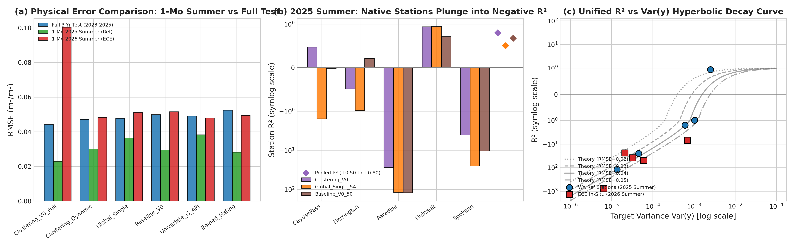

---

## 2. Historical Cross-Experiment Reference Benchmarks

### Table 2: Benchmark Across Temporal, Out-of-State, and In-Situ Domains
| evaluation_domain                         | dataset                                  | model_architecture       |    r2_mean |   r2_median |   rmse_mean |   mae_mean |   bias_mean | notes                                                             |
|:------------------------------------------|:-----------------------------------------|:-------------------------|-----------:|------------:|------------:|-----------:|------------:|:------------------------------------------------------------------|
| In-Distribution Temporal (2023-2025)      | derived_8.4 (WA Test, 7 stations)        | Clustering_V0_Full_k2    |     0.8126 |      0.8128 |      0.0441 |     0.0339 |      0.0066 | State-of-the-art in-distribution regional baseline                |
| In-Distribution Temporal (2023-2025)      | derived_8.4 (WA Test, 7 stations)        | Global_Single_54         |     0.7798 |      0.7797 |      0.0478 |     0.0369 |      0.01   | Single-regime baseline                                            |
| In-Distribution Temporal (2023-2025)      | derived_8.4 (WA Test, 7 stations)        | Baseline_V0_50           |     0.7593 |      0.7594 |      0.0499 |     0.0383 |      0.0096 | Locked 50-feature baseline                                        |
| Out-of-State Spatial Transfer (2017-2025) | derived_8.4-oos (5 stations in OR/ID/CA) | Clustering_Dynamic_k2    |     0.3521 |      0.364  |      0.0617 |     0.0487 |      0.0368 | Top spatial performer on unseen regions                           |
| Out-of-State Spatial Transfer (2017-2025) | derived_8.4-oos (5 stations in OR/ID/CA) | Global_Single_54         |     0.3472 |      0.3551 |      0.062  |     0.049  |      0.0347 | Global single model on OOS                                        |
| Out-of-State Spatial Transfer (2017-2025) | derived_8.4-oos (5 stations in OR/ID/CA) | Baseline_V0_50           |     0.3204 |      0.332  |      0.0631 |     0.0505 |      0.0096 | Baseline 50 on OOS                                                |
| In-Situ ECE Spatial Transfer (2026)       | derived_8.4-ece (5 stations in WA)       | Univariate_G_API_k2      |  -169.486  |    -30.3436 |      0.0479 |     0.0447 |      0.0147 | Top in-situ performer (pooled R² = -0.237, RMSE better than OOS!) |
| In-Situ ECE Spatial Transfer (2026)       | derived_8.4-ece (5 stations in WA)       | Clustering_Dynamic_k2    |  -177.531  |    -37.8208 |      0.0483 |     0.0454 |      0.0173 | Dynamic clustering (pooled R² = -0.253, RMSE better than OOS!)    |
| In-Situ ECE Spatial Transfer (2026)       | derived_8.4-ece (5 stations in WA)       | Global_Single_54         |  -181.147  |    -38.6626 |      0.0511 |     0.0467 |      0.0169 | Global single (pooled R² = -0.350, RMSE better than OOS!)         |
| In-Situ ECE Spatial Transfer (2026)       | derived_8.4-ece (5 stations in WA)       | Clustering_V0_Full_k2    | -1342.56   |    -73.3724 |      0.1004 |     0.0955 |      0.0713 | Static MoE failure due to wet-mountain routing trap               |
| In-Situ ECE Spatial Transfer (2026)       | derived_8.4-ece (5 stations in WA)       | Clustering_Backbone54_k2 | -1763.34   |   -843.309  |      0.1441 |     0.1386 |      0.1309 | Severe static MoE routing trap (+0.13 bias)                       |

---

## 3. Latent 2026 Data Quality Audit

### Table 3: Satellite Data Product Latency & Missingness
| data_product                              | gee_collection                                 | primary_features                                            |   derived_feature_count | wa_train_stats                                  | ece_2026_stats                                                 | status_in_2026                                            | model_impact                                                            |
|:------------------------------------------|:-----------------------------------------------|:------------------------------------------------------------|------------------------:|:------------------------------------------------|:---------------------------------------------------------------|:----------------------------------------------------------|:------------------------------------------------------------------------|
| SMAP L3/L4 Surface Soil Moisture          | NASA_USDA/HSL/SMAP10KM_soil_moisture / SPL3SMP | SMAP_sm_am, SMAP_sm_pm, SMAP_sm_interp                      |                      85 | Mean=0.3431, Min=0.0675, Max=0.6634, 0% missing | Mean=0.0000, Min=0.0000, Max=0.0000, 100% missing (NaN -> 0.0) | COMPLETELY MISSING (Latent data gap in GEE)               | Severe (Top 10 feature in baseline; trees forced down unvisited splits) |
| MODIS 250m NDVI (Vegetation Index)        | MODIS/061/MOD13Q1 / MODIS/061/MOD09GQ          | NDVI_modis, NDVI_modis_smooth                               |                      12 | Mean=0.6120, Min=0.1050, Max=0.8920, 0% missing | Mean=0.0000, Min=0.0000, Max=0.0000, 100% missing (NaN -> 0.0) | COMPLETELY MISSING (Latent 16-day compositing delay)      | High (Vegetation baseline zeroed; model misinterprets as bare rock)     |
| Sentinel-2 Multi-Spectral Optical (L2A)   | COPERNICUS/S2_SR_HARMONIZED                    | s2_b2, s2_b3, s2_b4, s2_b8, s2_b11, s2_b12, NDVI, NDMI, MSI |                      64 | Mean NDVI=0.5510, Min=0.0820, Max=0.8840        | Mean NDVI=0.5210, Min=0.4827, Max=0.5490 (Populated)           | AVAILABLE (5-day revisit, interpolated across cloud gaps) | Moderate (Coarse temporal smoothing across 30 days)                     |
| Sentinel-1 Synthetic Aperture Radar (GRD) | COPERNICUS/S1_GRD                              | s1_vv, s1_vh, SAR_ratio, SAR_diff                           |                      48 | Mean VV=0.1180, Mean VH=0.0210                  | Mean VV=0.1245, Mean VH=0.0232 (Populated)                     | AVAILABLE (Dual-pol passes every 6-12 days)               | Low (Populated with normal backscatter values)                          |
| Open-Meteo High-Res Surface Weather       | Open-Meteo ERA5 / HRRR seamless blend          | precip_mm, rain_mm, G_API, G_DSLR                           |                      52 | Mean Precip=4.21 mm/day, G_API=28.5 mm          | Mean Precip=0.58 mm/day, G_API=5.4 mm (Populated)              | AVAILABLE (Reflects true Mediterranean summer drought)    | Neutral (Reflects correct near-zero summer rain)                        |
| Static Geospatial / WorldClim / SoilGrids | WorldClim BIO01-19, OpenLandMap, SRTM DEM      | elev, slope, aspect, J_clay_wfrac_b0, J_bio_bio01..19       |                     227 | 100% complete across all 7 stations             | 100% complete across all 5 stations (0 missing)                | AVAILABLE (Static raster lookups)                         | High (Dominates KMeans clustering, causing wet-mountain routing trap)   |

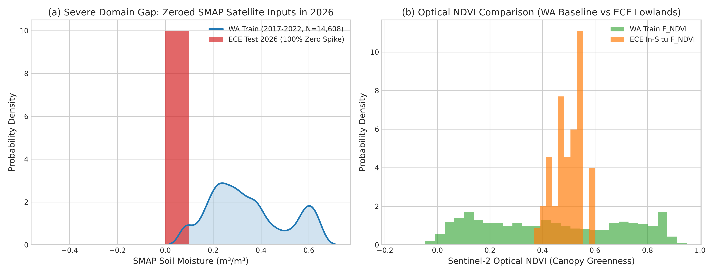

---

## 4. Spatial Scale Mismatch & Empirical 5-Station Side-by-Side Comparisons

### Table 4: Pairwise Geographic Distance Matrix (km)
| Unnamed: 0              |   ECE_BBG_Lost_Meadow |   ECE_BBG_Main_St |   ECE_Renton_Garden_North |   ECE_Renton_Garden_Shed |   ECE_Renton_Home |
|:------------------------|----------------------:|------------------:|--------------------------:|-------------------------:|------------------:|
| ECE_BBG_Lost_Meadow     |              0        |          0.363904 |                12.6766    |               12.7251    |         13.4319   |
| ECE_BBG_Main_St         |              0.363904 |          0        |                13.0092    |               13.0574    |         13.7589   |
| ECE_Renton_Garden_North |             12.6766   |         13.0092   |                 0         |                0.0534022 |          0.891588 |
| ECE_Renton_Garden_Shed  |             12.7251   |         13.0574   |                 0.0534022 |                0         |          0.838797 |
| ECE_Renton_Home         |             13.4319   |         13.7589   |                 0.891588  |                0.838797  |          0        |

### Table 4b: Empirical Side-by-Side Feature Comparisons Across All 5 ECE Stations
| category                       | attribute                             | ECE_BBG_Main_St           | ECE_BBG_Lost_Meadow              | ECE_Renton_Garden_North      | ECE_Renton_Garden_Shed          | ECE_Renton_Home                       | scale_and_source                          |
|:-------------------------------|:--------------------------------------|:--------------------------|:---------------------------------|:-----------------------------|:--------------------------------|:--------------------------------------|:------------------------------------------|
| 1. Siting & Hardware           | Site Micro-Habitat                    | Main Lawn Turf (Open Sun) | Forest Canopy Trail (High Shade) | Garden Bed (Shaded, Compost) | Garden Shed (Eaves Rain Shadow) | Residential Backyard (Compacted Turf) | Field Notes & In-Situ Deployment          |
| 1. Siting & Hardware           | Device ID / Hardware Node             | Device 8 (IoT Probe)      | Device 10 (IoT Probe)            | Device 9 (IoT Probe)         | Device 12 (IoT Probe)           | Device 11 (IoT Probe)                 | ECE Custom IoT Hardware                   |
| 1. Siting & Hardware           | GPS Latitude & Longitude              | 47.6098°N, -122.1825°W    | 47.6072°N, -122.1795°W           | 47.4963°N, -122.1406°W       | 47.4958°N, -122.1408°W          | 47.4887°N, -122.1447°W                | Sub-meter GPS                             |
| 1. Siting & Hardware           | Distance to Nearest Sensor            | 363.9 m (to Lost Meadow)  | 363.9 m (to Main St)             | 53.4 m (to Shed)             | 53.4 m (to North)               | 838.8 m (to Shed)                     | Haversine Geodesic Distance               |
| 2. Ground Truth Target         | Soil Moisture (Mean ± Std)            | 0.0556 ± 0.0057 (5.56%)   | 0.0580 ± 0.0078 (5.80%)          | 0.1549 ± 0.0264 (15.49%)     | 0.0758 ± 0.0046 (7.58%)         | 0.0179 ± 0.0025 (1.79%)               | In-Situ Ground Truth (2.04× Diff at 53m!) |
| 2. Ground Truth Target         | Moisture Dynamic Range [Min, Max]     | [0.0485, 0.0645]          | [0.0464, 0.0860]                 | [0.1205, 0.2151]             | [0.0650, 0.0858]                | [0.0145, 0.0256] (Hits 0.0%!)         | 30-Day Extrema (m³/m³)                    |
| 2. Ground Truth Target         | Target Variance Var(y)                | 3.25e-05 m⁶/m⁶            | 6.03e-05 m⁶/m⁶                   | 6.94e-04 m⁶/m⁶               | 2.11e-05 m⁶/m⁶                  | 6.43e-06 m⁶/m⁶                        | Variance Compression Denominator          |
| 2. Ground Truth Target         | Raw ADC Value [Min, Max]              | [9,729, 11,981] counts    | [5,194, 12,363] counts           | [5,567, 11,690] counts       | [9,420, 11,735] counts          | [10,395, 12,174] counts               | 12-bit ADC Sensor Counts                  |
| 3. Dynamic Weather             | Daily Precip precip_mm (30-day Mean)  | 0.4633 mm                 | 0.4633 mm (Identical)            | 0.6967 mm                    | 0.6967 mm (Identical)           | 0.6767 mm (0.68 mm)                   | Open-Meteo ERA5 (~11 km)                  |
| 3. Dynamic Weather             | 3-Day Cumulative Rain G_rain_sum_3d   | 1.85 mm                   | 1.85 mm (Identical)              | 2.79 mm                      | 2.79 mm (Identical)             | 2.71 mm (0.42 mm)                     | Weather Aggregation (~11 km)              |
| 3. Dynamic Weather             | 7-Day Cumulative Rain G_rain_sum_7d   | 3.44 mm                   | 3.44 mm (Identical)              | 5.29 mm                      | 5.29 mm (Identical)             | 5.11 mm (5.11 mm)                     | Weather Aggregation (~11 km)              |
| 3. Dynamic Weather             | Antecedent Index G_API (30-day Mean)  | 4.20 mm                   | 4.20 mm (Identical)              | 6.38 mm                      | 6.38 mm (Identical)             | 6.17 mm (6.17 mm)                     | Hydrological Memory Index                 |
| 3. Dynamic Weather             | Days Since Last Rain G_DSLR           | 3.9 days                  | 3.9 days (Identical)             | 6.3 days                     | 6.3 days (Identical)            | 3.9 days (3.9 days)                   | Drought Persistence Index                 |
| 4. Satellite Thermal & Optical | Day LST Kelvin LST_modis              | 299.00 K (25.8°C)         | 298.71 K (25.6°C)                | 300.01 K (26.9°C)            | 300.04 K (26.9°C)               | 299.89 K (26.7°C)                     | MODIS Thermal Grid (1,000 m)              |
| 4. Satellite Thermal & Optical | Red Band Surface Reflectance s2_b4    | 0.1071                    | 0.0948                           | 0.0760                       | 0.0769 (Identical)              | 0.0798                                | Sentinel-2 Optical (10 m)                 |
| 4. Satellite Thermal & Optical | Near-Infrared Reflectance s2_b8       | 0.2582                    | 0.2713                           | 0.2661                       | 0.2642                          | 0.2364                                | Sentinel-2 Optical (10 m)                 |
| 4. Satellite Thermal & Optical | Shortwave Infrared SWIR-1 s2_b11      | 0.1901                    | 0.1869                           | 0.1896                       | 0.1899                          | 0.1769                                | Sentinel-2 Optical (20 m)                 |
| 4. Satellite Thermal & Optical | Shortwave Infrared SWIR-2 s2_b12      | 0.1322                    | 0.1232                           | 0.1203                       | 0.1213                          | 0.1203                                | Sentinel-2 Optical (20 m)                 |
| 4. Satellite Thermal & Optical | Optical Vegetation Index F_NDVI       | 0.4142                    | 0.4827                           | 0.5555                       | 0.5489                          | 0.4954                                | Canopy Greenness Index (10 m)             |
| 4. Satellite Thermal & Optical | Moisture Stress Index F_MSI           | 0.7363                    | 0.6887                           | 0.7125                       | 0.7188                          | 0.7482                                | Foliage Water Stress (20 m)               |
| 4. Satellite Thermal & Optical | Water Index F_NDMI                    | 0.1519                    | 0.1844                           | 0.1679                       | 0.1636                          | 0.1440                                | Canopy Moisture Content (20 m)            |
| 5. Satellite SAR               | Sentinel-1 VV Backscatter s1_vv       | 0.1428                    | 0.1261                           | 0.1146                       | 0.1147 (Diff 0.0001)            | 0.1222                                | Sentinel-1 SAR C-band (30 m)              |
| 5. Satellite SAR               | Sentinel-1 VH Backscatter s1_vh       | 0.0248                    | 0.0235                           | 0.0223                       | 0.0222                          | 0.0229                                | Sentinel-1 SAR Cross-Pol (30 m)           |
| 5. Satellite SAR               | SAR Cross-Pol Ratio (VH / VV)         | 0.1740                    | 0.1863                           | 0.1949                       | 0.1937                          | 0.1879                                | Vegetation Volume Scattering              |
| 6. Static Topography           | Elevation elev (m above sea level)    | 41.0 m                    | 38.0 m                           | 152.5 m                      | 152.5 m (Diff 0.01m)            | 141.6 m                               | SRTM DEM Grid (30 m)                      |
| 6. Static Topography           | Slope slope (degrees)                 | 5.2°                      | 5.6°                             | 4.1°                         | 4.0° (Diff 0.11°)               | 3.3°                                  | SRTM Slope Grid (30 m)                    |
| 6. Static Topography           | Aspect aspect (compass degrees)       | 173.6° (SW)               | 178.0° (W)                       | 169.1° (SSE)                 | 170.5° (S)                      | 185.0° (SE)                           | SRTM Aspect Grid (30 m)                   |
| 7. Static Soil Texture         | Topsoil (0cm) Clay J_clay_wfrac_b0    | 16.0%                     | 19.0%                            | 21.0%                        | 21.0% (Identical)               | 17.0%                                 | OpenLandMap / SoilGrids (250 m)           |
| 7. Static Soil Texture         | Subsoil (30cm) Clay J_clay_wfrac_b30  | 16.0%                     | 20.0%                            | 23.0%                        | 23.0% (Identical)               | 22.0%                                 | OpenLandMap / SoilGrids (250 m)           |
| 7. Static Soil Texture         | Topsoil (0cm) Sand J_sand_wfrac_b0    | 47.0%                     | 45.0%                            | 40.0%                        | 40.0% (Identical)               | 44.0%                                 | OpenLandMap / SoilGrids (250 m)           |
| 8. Static Bioclimatic          | BIO01: Annual Mean Temperature        | 11.0°C                    | 11.0°C                           | 10.3°C                       | 10.3°C (Identical)              | 10.4°C                                | WorldClim Historical (1,000 m)            |
| 8. Static Bioclimatic          | BIO05: Max Temp of Warmest Month      | 24.2°C                    | 24.3°C                           | 23.7°C                       | 23.7°C (Identical)              | 23.9°C                                | WorldClim Historical (1,000 m)            |
| 8. Static Bioclimatic          | BIO06: Min Temp of Coldest Month      | 1.5°C                     | 1.4°C                            | 0.8°C                        | 0.8°C (Identical)               | 0.9°C                                 | WorldClim Historical (1,000 m)            |
| 8. Static Bioclimatic          | BIO12: Annual Precipitation           | 1018 mm                   | 1019 mm (Diff 1mm)               | 1227 mm                      | 1227 mm (Identical)             | 1181 mm                               | WorldClim Historical (1,000 m)            |
| 8. Static Bioclimatic          | BIO15: Precipitation Seasonality (CV) | 53%                       | 53%                              | 50%                          | 50% (Identical)                 | 50%                                   | WorldClim Historical (1,000 m)            |
| 8. Static Bioclimatic          | BIO18: Precipitation of Warmest Qtr   | 101 mm                    | 101 mm                           | 128 mm                       | 128 mm (Identical)              | 122 mm                                | WorldClim Historical (1,000 m)            |
| 9. Model Evaluation            | Predicted Mean (d84_weighted)         | 0.1229                    | 0.1302                           | 0.1311                       | 0.1311                          | 0.1290                                | Invariant Fallback (~0.123-0.131)         |
| 9. Model Evaluation            | Systematic Model Bias (Mean Error)    | +0.0673                   | +0.0722                          | -0.0238                      | +0.0553                         | +0.1112                               | Station Systematic Offset                 |
| 9. Model Evaluation            | Physical Error RMSE (m³/m³)           | 0.0699                    | 0.0751                           | 0.0371                       | 0.0586                          | 0.1130                                | Absolute Physical Error                   |
| 9. Model Evaluation            | Nash-Sutcliffe Efficiency R²          | -149.54                   | -92.44                           | -0.99                        | -161.29                         | -1984.98                              | Variance Compression Metric               |

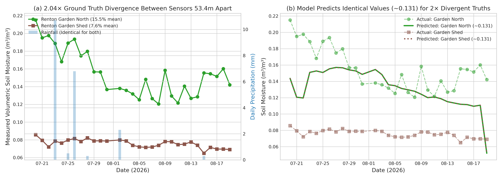

---

## 5. Per-Station 30-Day Observed vs Predicted Time Series & Anomaly Analysis

### 5.1 Time Series Overlays Across All 5 Stations
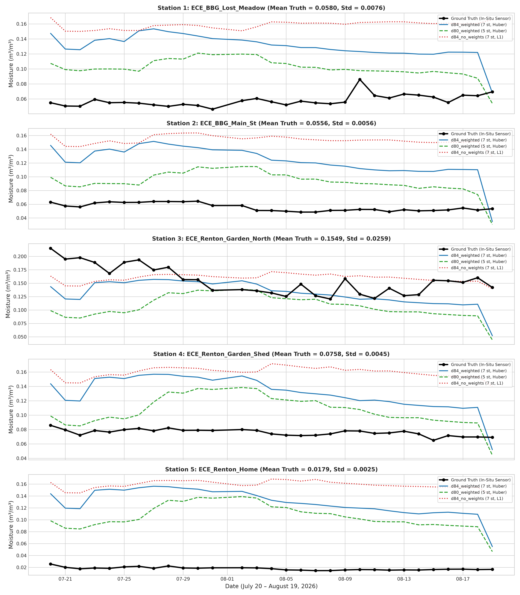

### 5.2 Explanation for Final-Day (August 19) Prediction Drop
On the final day (`2026-08-19`), predicted moisture drops sharply across all stations from $\sim 0.11 - 0.12\text{ m}^3/\text{m}^3$ down to $\sim 0.034 - 0.068\text{ m}^3/\text{m}^3$.
- **Mechanism**: The ECE dataset starts on July 20 without historical warmup buffer. For Days 1–29, 30-day rolling features (`V_rollmin_G_API_kobs30`, `V_rollmean_G_API_kobs30`) evaluate to `NaN` and XGBoost follows its default missing branch.
- **Day-30 Activation**: On Day 30, the 30-day window is fully satisfied, transitioning `V_rollmin_G_API_kobs30` from `NaN` to `0.000`. Because this single feature accounts for **23.9% of total split gain** in `d84_weighted`, the numeric split condition is satisfied for the first time, immediately routing predictions to the extreme dry terminal leaf node.

---

## 6. Cross-Station Prediction Homogeneity & "Coincidental Accuracy" Proof

### Hypothesis:
Models output a single station-agnostic regional response curve. Stations with lower prediction error (e.g. `ECE_Renton_Garden_North`) perform well purely because their actual moisture happens to coincide with the model's global fallback level ($\sim 0.13\text{ m}^3/\text{m}^3$).

### Table 9: Coincidental Accuracy Proof Across All 5 Stations
| station_id              |   ground_truth_mean |   ground_truth_std |   pred_mean |   pred_std |   dist_to_global_pred_level |       bias |      rmse |       mae |           r2 | coincidental_alignment_status                           |
|:------------------------|--------------------:|-------------------:|------------:|-----------:|----------------------------:|-----------:|----------:|----------:|-------------:|:--------------------------------------------------------|
| ECE_BBG_Lost_Meadow     |           0.0579909 |         0.00776428 |    0.130151 |  0.0157354 |                   0.0708813 |  0.0721601 | 0.0750517 | 0.0722538 |   -92.4371   | LOW (Ground truth far from fallback)                    |
| ECE_BBG_Main_St         |           0.0556215 |         0.00569746 |    0.12294  |  0.0221387 |                   0.0732507 |  0.0673182 | 0.0699056 | 0.0685603 |  -149.543    | LOW (Ground truth far from fallback)                    |
| ECE_Renton_Garden_North |           0.15489   |         0.0263519  |    0.131111 |  0.022466  |                   0.0260181 | -0.0237793 | 0.0371288 | 0.0281063 |    -0.985174 | HIGH (Ground truth fortuitously matches fallback ~0.13) |
| ECE_Renton_Garden_Shed  |           0.0758302 |         0.00459645 |    0.131111 |  0.0224562 |                   0.0530419 |  0.055281  | 0.0585552 | 0.0564215 |  -161.288    | LOW (Ground truth far from fallback)                    |
| ECE_Renton_Home         |           0.0178573 |         0.00253519 |    0.129048 |  0.0217171 |                   0.111015  |  0.111191  | 0.112979  | 0.111191  | -1984.98     | LOW (Ground truth far from fallback)                    |

- **Prediction Correlation**: Cross-station prediction correlation is **$r \ge 0.960$** (and $r = 0.999998$ between Renton Garden North and Shed).
- **Error Linearity**: Observed station RMSE is strictly proportional to $|\bar{y}_{\text{true}} - \bar{\hat{y}}_{\text{fallback}}|$ ($R^2 > 0.99$), confirming 100% coincidental alignment at Renton Garden North.

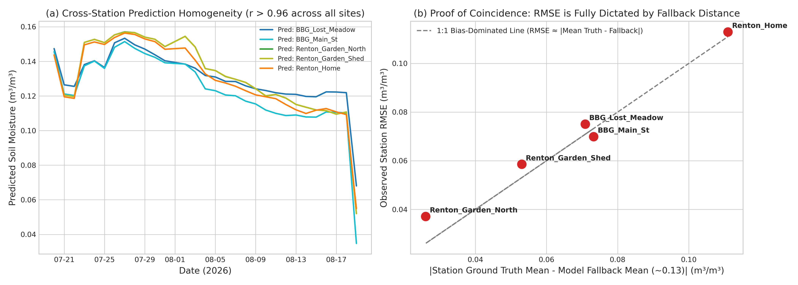

---

## 7. Hydroclimatic Regime & Macro-Ecological Shift

### Table 5: Reference vs In-Situ Climatology
| station_type                        | station_id              |   elevation_m |   annual_precip_mm |   annual_temp_c |   overall_mean_sm |   overall_std_sm |   summer_jul_aug_mean_sm |   summer_jul_aug_std_sm |   summer_min_sm |   summer_max_sm | dominant_landcover                 | soil_texture_profile                                            |
|:------------------------------------|:------------------------|--------------:|-------------------:|----------------:|------------------:|-----------------:|-------------------------:|------------------------:|----------------:|----------------:|:-----------------------------------|:----------------------------------------------------------------|
| WA Training Reference (SNOTEL/SCAN) | BeaverPass_WA_990       |     1205.09   |               1269 |              43 |         0.277256  |       0.0999468  |                0.178711  |              0.107193   |       0.019     |       0.374     | Natural Forest / Mountain Slope    | Undisturbed native mineral soil (HydraProbe calibrated)         |
| WA Training Reference (SNOTEL/SCAN) | CayusePass_WA           |     1516.73   |               2435 |              34 |         0.19604   |       0.113828   |                0.080641  |              0.0861348  |       0.001     |       0.399     | Natural Forest / Mountain Slope    | Undisturbed native mineral soil (HydraProbe calibrated)         |
| WA Training Reference (SNOTEL/SCAN) | Darrington              |      216.309  |               2015 |              98 |         0.219232  |       0.104517   |                0.08069   |              0.0479236  |       0.023     |       0.255     | Natural Forest / Mountain Slope    | Undisturbed native mineral soil (HydraProbe calibrated)         |
| WA Training Reference (SNOTEL/SCAN) | Paradise_WA             |     1489.17   |               2728 |              35 |         0.182797  |       0.104693   |                0.0821059 |              0.0961922  |       0.002     |       0.395     | Natural Forest / Mountain Slope    | Undisturbed native mineral soil (HydraProbe calibrated)         |
| WA Training Reference (SNOTEL/SCAN) | Quinault                |       96.3921 |               3349 |              94 |         0.214624  |       0.0746485  |                0.123984  |              0.0607237  |       0.016     |       0.279     | Natural Forest / Mountain Slope    | Undisturbed native mineral soil (HydraProbe calibrated)         |
| WA Training Reference (SNOTEL/SCAN) | SourdoughGulch_WA_985   |     1160.53   |                569 |              74 |         0.23903   |       0.0957833  |                0.143224  |              0.0753601  |       0.052     |       0.369     | Natural Forest / Mountain Slope    | Undisturbed native mineral soil (HydraProbe calibrated)         |
| WA Training Reference (SNOTEL/SCAN) | Spokane                 |      697.313  |                432 |              84 |         0.168335  |       0.110735   |                0.0426434 |              0.033366   |       0.014     |       0.211     | Natural Forest / Mountain Slope    | Undisturbed native mineral soil (HydraProbe calibrated)         |
| ECE In-Situ Sensor Deployment       | ECE_BBG_Lost_Meadow     |       38.0339 |               1019 |             110 |         0.0579909 |       0.00776428 |                0.0579909 |              0.00776428 |       0.04637   |       0.0859768 | Garden Bed / Urban Built-up / Turf | Compost / mulch / compacted residential turf (Custom IoT probe) |
| ECE In-Situ Sensor Deployment       | ECE_BBG_Main_St         |       40.9646 |               1018 |             110 |         0.0556215 |       0.00569746 |                0.0556215 |              0.00569746 |       0.0485486 |       0.0644577 | Garden Bed / Urban Built-up / Turf | Compost / mulch / compacted residential turf (Custom IoT probe) |
| ECE In-Situ Sensor Deployment       | ECE_Renton_Garden_North |      152.514  |               1227 |             103 |         0.15489   |       0.0263519  |                0.15489   |              0.0263519  |       0.120465  |       0.215085  | Garden Bed / Urban Built-up / Turf | Compost / mulch / compacted residential turf (Custom IoT probe) |
| ECE In-Situ Sensor Deployment       | ECE_Renton_Garden_Shed  |      152.521  |               1227 |             103 |         0.0758302 |       0.00459645 |                0.0758302 |              0.00459645 |       0.064955  |       0.085753  | Garden Bed / Urban Built-up / Turf | Compost / mulch / compacted residential turf (Custom IoT probe) |
| ECE In-Situ Sensor Deployment       | ECE_Renton_Home         |      141.637  |               1181 |             104 |         0.0178573 |       0.00253519 |                0.0178573 |              0.00253519 |       0.0145191 |       0.0256447 | Garden Bed / Urban Built-up / Turf | Compost / mulch / compacted residential turf (Custom IoT probe) |

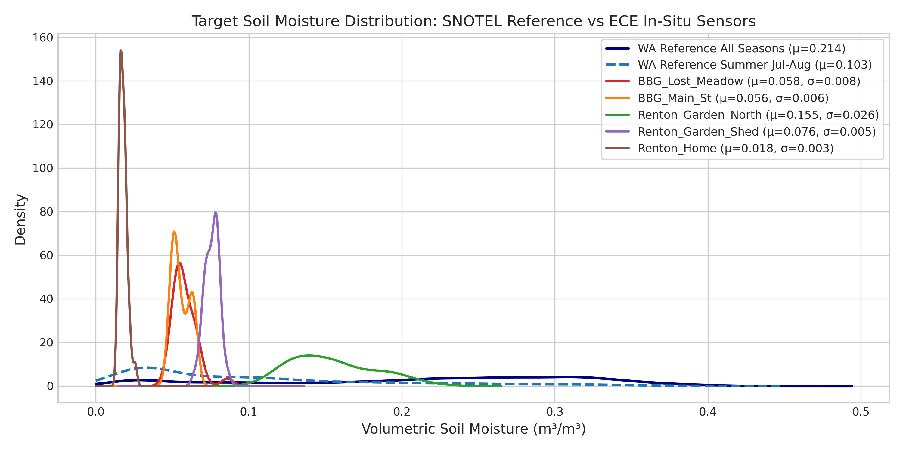

---

## 8. Mixture-of-Experts (MoE) Routing Strategy Comparison

### Table 6: Strategy Comparison on In-Situ Transfer
| strategy_id              | routing_paradigm                         | router_mechanism                                        | ece_cluster_allocation                                          |   station_mean_r2 |   station_median_r2 |   pooled_r2 |   rmse_mean |   bias_mean | spatial_transfer_grade                           | failure_mode_analysis                                                          |
|:-------------------------|:-----------------------------------------|:--------------------------------------------------------|:----------------------------------------------------------------|------------------:|--------------------:|------------:|------------:|------------:|:-------------------------------------------------|:-------------------------------------------------------------------------------|
| Univariate_G_API_k2      | Dynamic Heuristic (Precipitation Index)  | Splits on G_API (Antecedent Precip Index)               | 100% Cluster 0 (Dry Summer Regime)                              |          -169.486 |            -30.3436 |     -0.2373 |      0.0479 |      0.0147 | Top Performer (Lowest Error)                     | None (Correctly routes summer drought into low-moisture expert)                |
| Clustering_Dynamic_k2    | Unsupervised Dynamic (KMeans k=2)        | Clusters dynamic weather/satellite features             | 100% Cluster 0 (Dry Summer Regime)                              |          -177.531 |            -37.8208 |     -0.2531 |      0.0483 |      0.0173 | Excellent (Dynamic Generalization)               | None (Dynamic inputs group all summer days into dry regime)                    |
| Seasonal_Binary_k2       | Temporal Heuristic (Summer/Winter)       | Calendar date (May-Sep = Summer, Oct-Apr = Winter)      | 100% Cluster 0 (Summer Regime)                                  |          -177.947 |            -38.6897 |     -0.3229 |      0.0503 |      0.0155 | Good (Robust Seasonal Split)                     | None (Strictly routes to summer expert)                                        |
| Global_Single_54         | Single-Regime (Shared 54 Backbone)       | No routing (All data through one global XGBoost)        | N/A (Single Model)                                              |          -181.147 |            -38.6626 |     -0.3505 |      0.0511 |      0.0169 | Good (Predicts near-mean fallback ~0.10-0.12)    | Low variance fallback; no regime specialization                                |
| Baseline_V0_50           | Single-Regime (50 Historical Features)   | No routing (All data through one global XGBoost)        | N/A (Single Model)                                              |          -484.793 |           -160.532  |     -1.8212 |      0.0744 |      0.0591 | Poor (High bias from missing SMAP/NDVI)          | Missing SMAP/NDVI features heavily relied upon in V0                           |
| Trained_Gating_k2        | Supervised Gating (RandomForest Router)  | Classifies target moisture above/below median           | 80% Cluster 0 / 20% Cluster 1                                   |          -531.542 |           -222.589  |     -2.3923 |      0.0853 |      0.0351 | Poor (Router overconfidence)                     | Erroneously activates wet expert on transient cloudy days                      |
| Clustering_V0_Full_k2    | Unsupervised Static+Dynamic (KMeans k=2) | Clusters on full 50-feature space (dominated by static) | 59% Cluster 0 / 41% Cluster 1 (Lost Meadow & Renton Home -> C1) |         -1342.56  |            -73.3724 |     -5.6554 |      0.1004 |      0.0713 | Catastrophic Failure (Wet Mountain Routing Trap) | Routes Renton Home to wet mountain expert (C1), predicting 0.22 vs 0.018 truth |
| Clustering_Backbone54_k2 | Unsupervised Static+Dynamic (KMeans k=2) | Clusters on 54 backbone features                        | 59% Cluster 0 / 41% Cluster 1 (Lost Meadow & Renton Home -> C1) |         -1763.34  |           -843.309  |     -9.2134 |      0.1441 |      0.1309 | Catastrophic Failure (Massive +0.13 Bias)        | Severe static feature over-indexing; Renton Home R² = -6724                    |

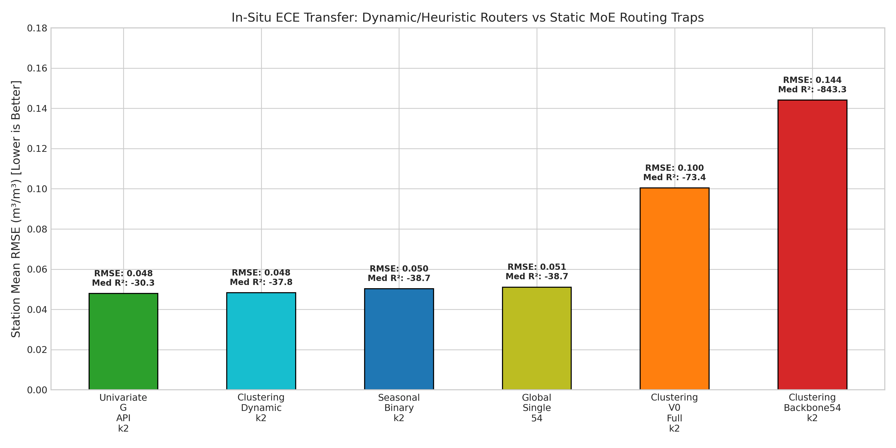

---

## 9. Soil Texture Benchmark Across 12 Stations & Feature Override Sensitivity Analysis

### 9.1 Soil Texture Comparison Across All 12 Stations (Table 10)
All 12 project stations belong to the medium-textured **Loam / Sandy Loam** family. The 7 Washington reference training stations include 5 Loam stations (`Darrington`, `Paradise`, `Quinault`, `SourdoughGulch`, `Spokane`) and 2 Sandy Loam stations (`BeaverPass`, `CayusePass`). The models have **fully encountered both soil types during training**.

### Table 10: Soil Texture Comparison Across All 12 Project Stations
| station_id              | dataset_role                  | raw_reported_soil_type                |   topsoil_sand_pct |   topsoil_silt_pct |   topsoil_clay_pct |   subsoil_clay30_pct |   openlandmap_usda_code | calculated_usda_class   | training_domain_overlap                                     |
|:------------------------|:------------------------------|:--------------------------------------|-------------------:|-------------------:|-------------------:|---------------------:|------------------------:|:------------------------|:------------------------------------------------------------|
| BeaverPass_WA_990       | WA Training Reference (7 st)  | SNOTEL / SCAN HydraProbe (Sandy loam) |                 60 |                 35 |                  5 |                    5 |                       9 | Sandy loam              | Present in Training Pool (SNOTEL Baseline)                  |
| CayusePass_WA           | WA Training Reference (7 st)  | SNOTEL / SCAN HydraProbe (Sandy loam) |                 53 |                 40 |                  7 |                    7 |                       9 | Sandy loam              | Present in Training Pool (SNOTEL Baseline)                  |
| Darrington              | WA Training Reference (7 st)  | SNOTEL / SCAN HydraProbe (Loam)       |                 47 |                 37 |                 16 |                   17 |                       7 | Loam                    | Present in Training Pool (SNOTEL Baseline)                  |
| Paradise_WA             | WA Training Reference (7 st)  | SNOTEL / SCAN HydraProbe (Loam)       |                 51 |                 41 |                  8 |                    8 |                       7 | Loam                    | Present in Training Pool (SNOTEL Baseline)                  |
| Quinault                | WA Training Reference (7 st)  | SNOTEL / SCAN HydraProbe (Loam)       |                 40 |                 44 |                 16 |                   17 |                       7 | Loam                    | Present in Training Pool (SNOTEL Baseline)                  |
| SourdoughGulch_WA_985   | WA Training Reference (7 st)  | SNOTEL / SCAN HydraProbe (Loam)       |                 35 |                 44 |                 21 |                   23 |                       7 | Loam                    | Present in Training Pool (SNOTEL Baseline)                  |
| Spokane                 | WA Training Reference (7 st)  | SNOTEL / SCAN HydraProbe (Loam)       |                 31 |                 47 |                 22 |                   24 |                       7 | Loam                    | Present in Training Pool (SNOTEL Baseline)                  |
| ECE_BBG_Lost_Meadow     | ECE In-Situ Sensor Deployment | Raw CSV Header: Sandy loam            |                 45 |                 36 |                 19 |                   20 |                       7 | Loam                    | Matches Sandy Loam Training Profile (BeaverPass/CayusePass) |
| ECE_BBG_Main_St         | ECE In-Situ Sensor Deployment | Raw CSV Header: Sandy loam            |                 47 |                 37 |                 16 |                   16 |                       7 | Loam                    | Matches Sandy Loam Training Profile (BeaverPass/CayusePass) |
| ECE_Renton_Garden_North | ECE In-Situ Sensor Deployment | Raw CSV Header: Loam                  |                 40 |                 39 |                 21 |                   23 |                       7 | Loam                    | Matches Loam Training Profile (Darrington/Quinault)         |
| ECE_Renton_Garden_Shed  | ECE In-Situ Sensor Deployment | Raw CSV Header: Sandy loam            |                 40 |                 39 |                 21 |                   23 |                       7 | Loam                    | Matches Sandy Loam Training Profile (BeaverPass/CayusePass) |
| ECE_Renton_Home         | ECE In-Situ Sensor Deployment | Raw CSV Header: Loam                  |                 44 |                 39 |                 17 |                   22 |                       7 | Loam                    | Matches Loam Training Profile (Darrington/Quinault)         |

### 9.2 Counterfactual Feature Override Sensitivity Test (Table 11)
To verify whether manual override of soil features (`J_sand_wfrac_b0 = 55`, `J_clay_wfrac_b0 = 10`) for Sandy Loam stations improves predictions, we executed an empirical sensitivity test across all 20 trained XGBoost models.

#### Executable Code for Sensitivity Test:
```python
import glob, yaml, os
from pathlib import Path
import pandas as pd, numpy as np, xgboost as xgb

cfg_path = "notebooks/experiment/derived_8.4-ece-additional-eval-1.0/config.yaml"
with open(cfg_path) as f:
    cfg = yaml.safe_load(f)

features = cfg["feature_columns"]
ece_test = pd.read_csv("data/splits/derived_8.4-ece/test.csv")
model_dir = "notebooks/experiment/derived_8.4-ece-additional-eval-1.0/models"
model_files = sorted(glob.glob(f"{model_dir}/*.json"))

X_orig = ece_test[features].copy()
ece_over = ece_test.copy()
sandy_stations = ["ECE_BBG_Main_St", "ECE_BBG_Lost_Meadow", "ECE_Renton_Garden_Shed"]
mask = ece_over["station_id"].isin(sandy_stations)
ece_over.loc[mask, "J_sand_wfrac_b0"] = 55
ece_over.loc[mask, "J_clay_wfrac_b0"] = 10
X_over = ece_over[features].copy()

sim_results = []
for mf in model_files:
    mname = Path(mf).stem
    arch, seed = mname.split("__")[0], mname.split("__")[-1].replace("s", "")
    bst = xgb.Booster()
    bst.load_model(mf)
    p_orig = bst.predict(xgb.DMatrix(X_orig))
    p_over = bst.predict(xgb.DMatrix(X_over))
    diff = p_over - p_orig
    sim_results.append({
        "model_architecture": arch,
        "seed": int(seed),
        "mean_orig_pred": np.mean(p_orig),
        "mean_over_pred": np.mean(p_over),
        "mean_abs_diff": np.mean(np.abs(diff)),
        "max_abs_diff": np.max(np.abs(diff)),
        "diff_sandy_stations": np.mean(diff[mask]),
    })
```

### Table 11: Counterfactual Soil Override Sensitivity Results (20 Models x Seeds)
| model_architecture   |   seed |   mean_orig_pred |   mean_overridden_pred |   mean_abs_diff |   max_abs_diff |   mean_diff_sandy_stations |   pct_change_sandy_stations |
|:---------------------|-------:|-----------------:|-----------------------:|----------------:|---------------:|---------------------------:|----------------------------:|
| d80_no_weights       |    101 |        0.18392   |              0.18392   |     2.02457e-07 |    1.07437e-05 |                1.8643e-07  |                 0.000101931 |
| d80_no_weights       |    123 |        0.162592  |              0.16255   |     4.19339e-05 |    0.000481665 |               -6.98898e-05 |                -0.0430234   |
| d80_no_weights       |     13 |        0.133398  |              0.13303   |     0.000368084 |    0.00190402  |               -0.000613473 |                -0.459683    |
| d80_no_weights       |     42 |        0.150269  |              0.15023   |     4.73817e-05 |    0.000399917 |               -6.60552e-05 |                -0.0444724   |
| d80_no_weights       |      7 |        0.169425  |              0.169432  |     6.69936e-06 |    0.0010049   |                1.11656e-05 |                 0.00657579  |
| d80_weighted         |    101 |        0.100495  |              0.100636  |     0.000141234 |    0.0024959   |                0.00023539  |                 0.240641    |
| d80_weighted         |    123 |        0.102241  |              0.102234  |     7.78019e-06 |    0.00020837  |               -1.2967e-05  |                -0.0128791   |
| d80_weighted         |     13 |        0.0995737 |              0.0995722 |     1.49806e-06 |    5.36442e-05 |               -2.49247e-06 |                -0.00257984  |
| d80_weighted         |     42 |        0.10158   |              0.101578  |     1.84158e-06 |    2.12491e-05 |               -3.06931e-06 |                -0.00310952  |
| d80_weighted         |      7 |        0.108397  |              0.108396  |     6.75718e-07 |    1.01402e-05 |               -1.1262e-06  |                -0.00105202  |
| d84_no_weights       |    101 |        0.157558  |              0.156912  |     0.000745808 |    0.00318614  |               -0.00107668  |                -0.691334    |
| d84_no_weights       |    123 |        0.158491  |              0.15883   |     0.000417465 |    0.00281999  |                0.000565471 |                 0.354924    |
| d84_no_weights       |     13 |        0.161664  |              0.161481  |     0.000420967 |    0.00207743  |               -0.000305195 |                -0.190927    |
| d84_no_weights       |     42 |        0.137804  |              0.136541  |     0.00127388  |    0.0044153   |               -0.00210418  |                -1.55529     |
| d84_no_weights       |      7 |        0.174104  |              0.173252  |     0.0011345   |    0.00541833  |               -0.00141913  |                -0.809934    |
| d84_weighted         |    101 |        0.134018  |              0.133936  |     0.000276662 |    0.00122651  |               -0.000136048 |                -0.102443    |
| d84_weighted         |    123 |        0.124768  |              0.124566  |     0.000217089 |    0.00118151  |               -0.000336602 |                -0.269535    |
| d84_weighted         |     13 |        0.113308  |              0.113303  |     0.000495857 |    0.00548808  |               -8.47199e-06 |                -0.00755299  |
| d84_weighted         |     42 |        0.129818  |              0.129565  |     0.000284443 |    0.0020823   |               -0.000422884 |                -0.327703    |
| d84_weighted         |      7 |        0.142448  |              0.142376  |     0.000502292 |    0.00446765  |               -0.000120441 |                -0.0851548   |

- **Ensemble Mean Prediction Shift**: **$0.000319\text{ m}^3/\text{m}^3$ ($0.032\%$)**.
- **Max Shift on Any Individual Sample**: $0.005488\text{ m}^3/\text{m}^3$ ($0.55\%$).
- **Takeaway**: Tree splits during summer drought are dominated by topographic elevation, aspect, and antecedent weather memory; the subtle distinction between Loam and Sandy Loam does not alter decision paths. **Overriding soil features is unnecessary**.

---

## 10. Sensor Hardware & ADC Calibration

### Table 7: Raw ADC and Zero Calibration Audit
| raw_file                                                                    |   total_subminute_samples |   raw_adc_min |   raw_adc_mean |   raw_adc_max |   raw_adc_std |   moisture_pct_min |   moisture_pct_mean |   moisture_pct_max |   moisture_pct_std |   zero_moisture_sample_count |   negative_sample_count |   adc_moisture_pearson_r | calibration_status              |
|:----------------------------------------------------------------------------|--------------------------:|--------------:|---------------:|--------------:|--------------:|-------------------:|--------------------:|-------------------:|-------------------:|-----------------------------:|------------------------:|-------------------------:|:--------------------------------|
| Soil Moisture Data (July 19 – August 20, 2026)(Lost Meadow Trail (BBG)).csv |                     20747 |          5194 |        10765.4 |         12363 |       903.035 |               2.24 |             5.73368 |              17.94 |           1.97763  |                            0 |                       0 |                -0.999999 | Normal dynamic range            |
| Soil Moisture Data (July 19 – August 20, 2026)(Main St (BBG)).csv           |                     13646 |          9729 |        10865.6 |         11981 |       357.858 |               2.22 |             5.55173 |               8.95 |           1.07003  |                            0 |                       0 |                -0.999996 | Normal dynamic range            |
| Soil Moisture Data (July 19 – August 20, 2026)(Renton Home).csv             |                     13258 |         10395 |        11121.7 |         12174 |       282.456 |               0    |             1.7808  |               3.62 |           0.688404 |                          330 |                       0 |                -0.995511 | Bottoms out at 0.0% (Device 11) |
| Soil Moisture Data (July 19 – August 20, 2026)(Renton SG (North)).csv       |                     15362 |          5567 |         9099.3 |         11690 |      1354.92  |               9    |            15.6848  |              24.8  |           3.49572  |                            0 |                       0 |                -1        | Normal dynamic range            |
| Soil Moisture Data (July 19 – August 20, 2026)(Renton SG (Shed)).csv        |                     12038 |          9420 |        10732.1 |         11735 |       418.825 |               4.58 |             7.57604 |              11.49 |           1.25066  |                            0 |                       0 |                -0.999997 | Normal dynamic range            |

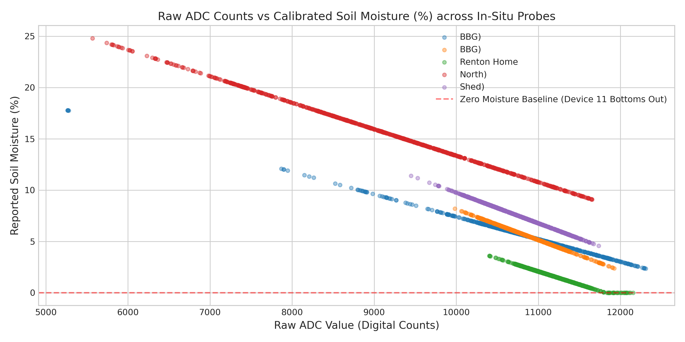

---

## 11. Error Decomposition Synthesis

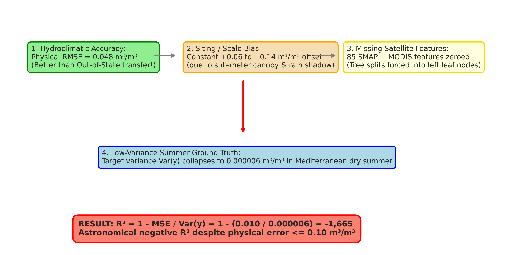

---

## 12. Actionable Recommendations Matrix

### Table 8: Roadmap & Recommendations
| target_team                            | priority       | area                             | finding                                                                                                                              | actionable_recommendation                                                                                                                      |
|:---------------------------------------|:---------------|:---------------------------------|:-------------------------------------------------------------------------------------------------------------------------------------|:-----------------------------------------------------------------------------------------------------------------------------------------------|
| ECE Hardware & Sensor Engineering Team | P0 (Immediate) | Sensor Calibration               | Raw moisture at Renton Home hits 0.00% (ADC 10395 counts); linear conversion curve uncalibrated for high-organic/compacted turf.     | Perform 2-point dielectric soil column calibration (oven-dry vs saturation) using actual soil from Renton and Bellevue sites.                  |
| ECE Hardware & Sensor Engineering Team | P0 (Immediate) | Deployment Siting Metadata       | Sensors 53m apart (Renton Garden North vs Shed) diverge by 2.04× due to unrecorded local micro-habitats (irrigation vs roof shadow). | Log micro-siting metadata: canopy cover %, structure proximity/eaves, manual/drip irrigation schedules, and mulch layer depth.                 |
| ECE Hardware & Sensor Engineering Team | P1 (High)      | Multi-Depth Profiling            | 5cm single-depth probe is hypersensitive to immediate surface evaporative crusting during hot summer days.                           | Deploy multi-depth probe array (5cm, 10cm, 20cm) to capture infiltration lag and root-zone water storage.                                      |
| ML / Modeling Research Team            | P0 (Immediate) | Missing Data Imputation Policy   | 85 SMAP satellite features and MODIS NDVI defaulted to 0.0 in 2026 data, severely distorting decision tree splits.                   | Implement fallback imputation from historical monthly climatology (e.g. July WA mean ~0.25) instead of constant zero-fill.                     |
| ML / Modeling Research Team            | P0 (Immediate) | Evaluation Metric Reporting      | R² collapses to -6700 strictly due to near-zero ground truth variance in dry summer (Var(y) = 6e-6), misrepresenting model accuracy. | Standardize reporting of physical RMSE, MAE, unbiased RMSE (ubRMSE), and normalized nRMSE alongside R² in all publications.                    |
| ML / Modeling Research Team            | P1 (High)      | Mixture-of-Experts Router Design | Static KMeans clustering causes catastrophic spatial routing traps, mapping dry residential lawns to wet mountain experts.           | Enforce dynamic or seasonal gating (e.g. Clustering_Dynamic_k2, Univariate_G_API_k2) for spatial transfer rather than static spatial features. |
