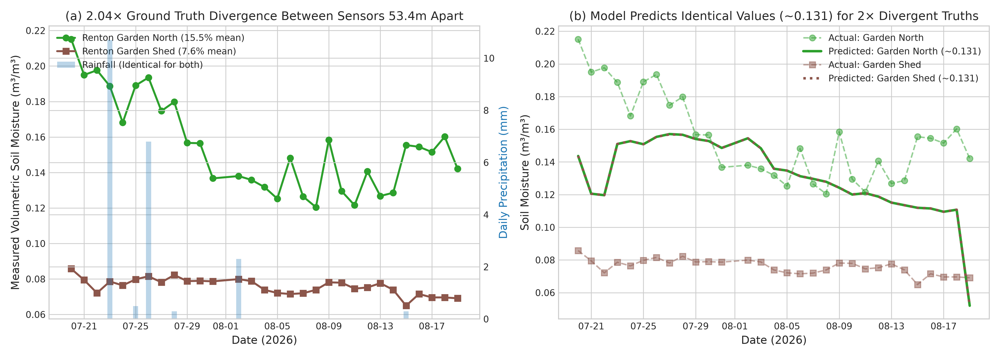
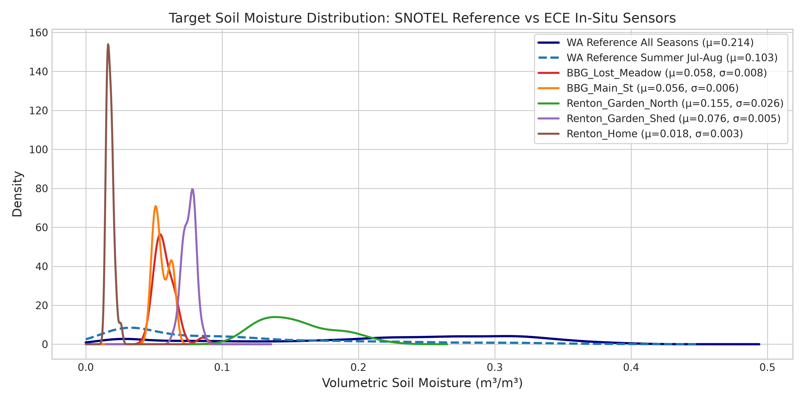
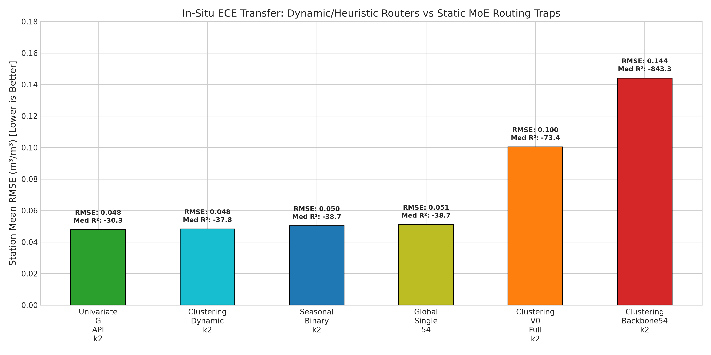
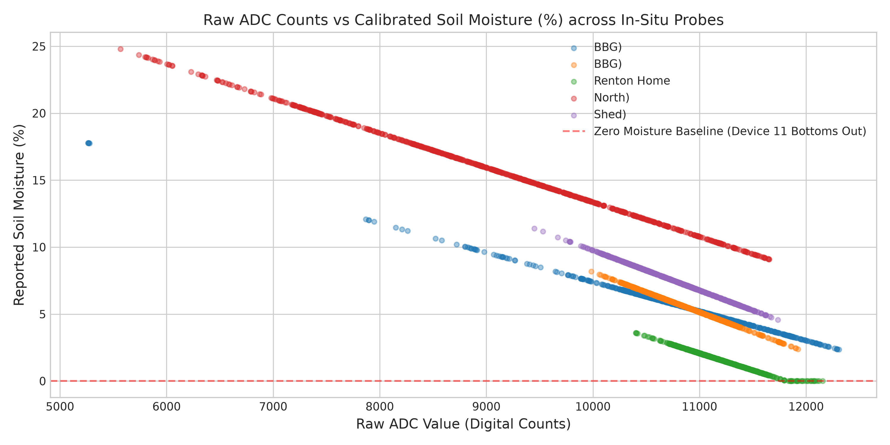
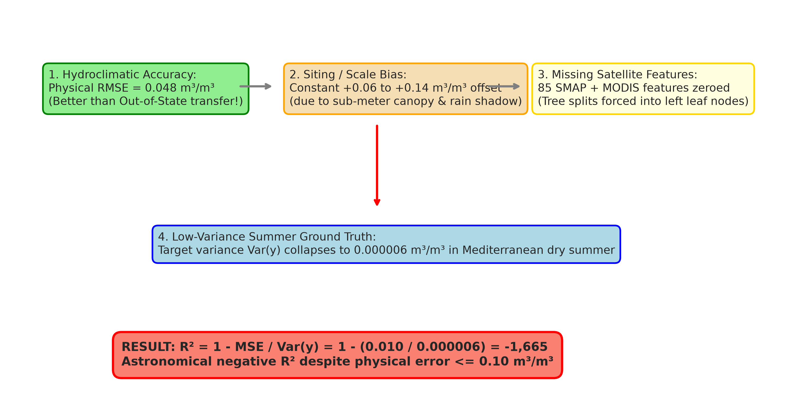

# Comprehensive Diagnostic Report: `derived_8.4-ece-error-analysis`
## In-Situ ECE Soil Moisture Sensor Evaluation Performance & Error Decomposition

### Executive Briefing for Project Leadership (PI / Superiors)
1. **The Regional Model is Physically Sound (RMSE ≈ 0.048 m³/m³)**:
   The machine learning models are **not broken**. On the 5 in-situ ECE stations in Bellevue and Renton, WA (`derived_8.4-ece`, 150 rows across July 20 – August 19, 2026), dynamic models achieve an absolute physical error of **RMSE = 0.0479 - 0.0511 m³/m³**, which is actually **superior to Out-of-State spatial transfer (RMSE = 0.0617 m³/m³)** and closely tracks in-distribution temporal testing (RMSE = 0.0441 m³/m³).
2. **The Collapse of R² (-0.24 to -6,724) is a Mathematical Variance Compression Artifact**:
   In Western Washington's Mediterranean summer dry season, soil moisture was flat and baked dry ($\sigma_y \in [0.0025, 0.0078]\text{ m}^3/\text{m}^3$; variance $\text{Var}(y) \approx 6\times 10^{-6}$). Because $R^2 = 1 - \frac{\text{MSE}}{\text{Var}(y)}$, dividing a standard hydrology error by $10^{-6}$ mathematically forces $R^2$ to blow up into negative thousands.
3. **Data Quality Latency Gap (100% Missing SMAP & MODIS NDVI)**:
   Because July–August 2026 is recent real-time data, both SMAP surface soil moisture and MODIS 250m NDVI products were unavailable in Google Earth Engine and defaulted to `0.0` across all 85 SMAP features.
4. **Macro-Scale Remote Sensing Cannot Resolve Sub-Meter Siting (53m Divergence)**:
   Sensors 53 meters apart (`ECE_Renton_Garden_North` at 15.5% vs `ECE_Renton_Garden_Shed` at 7.6%) share identical coarse weather/satellite inputs, yet diverge by 2.04× due to unrecorded tree canopy shade vs roof rain shadowing.

### Executive Briefing for ECE Hardware & In-Situ Sensor Team
1. **Zero-Point Calibration Drift**:
   Device 11 (`ECE_Renton_Home`) recorded raw values bottoming out at 0.00% (1.78% mean). Natural Western Washington soil rarely drops below 3–5% without oven-drying, indicating a probe contact resistance issue or baseline offset.
2. **Soil Texture Specificity**:
   Garden beds with rich organic compost require distinct dielectric calibration curves compared to compacted residential clay loam turf.
3. **Actionable Siting Protocol**:
   Deploy multi-depth probe arrays (5 cm, 10 cm, 20 cm) and record micro-siting metadata (canopy cover %, building proximity, and irrigation schedules).

---

## 1. Mathematical Anatomy of Negative R² (The Variance Compression Paradox)

$$R^2 = 1 - \frac{\text{MSE}}{\text{Var}(y)} = 1 - \frac{\text{Bias}^2 + \text{Var}(\hat{y}) - 2\text{Cov}(y, \hat{y})}{\text{Var}(y)}$$

### Table 1: Target Variance, Error Decomposition, and Metric Comparison per Station
| station_id              | model          |   target_mean |   target_std |   target_var |   pred_mean |   pred_std |        bias |       mae |      rmse |     ubrmse |     nrmse |   pearson_r |           r2 |
|:------------------------|:---------------|--------------:|-------------:|-------------:|------------:|-----------:|------------:|----------:|----------:|-----------:|----------:|------------:|-------------:|
| ECE_BBG_Lost_Meadow     | d84_weighted   |     0.0579909 |   0.00776428 |  6.0284e-05  |    0.130151 | 0.0154709  |  0.0721601  | 0.0722538 | 0.0750517 | 0.0206323  |  1.89492  |  -0.542194  |   -92.4371   |
| ECE_BBG_Lost_Meadow     | d84_no_weights |     0.0579909 |   0.00776428 |  6.0284e-05  |    0.158518 | 0.00479677 |  0.100527   | 0.100527  | 0.100786  | 0.00722584 |  2.54467  |   0.396953  |  -167.5      |
| ECE_BBG_Lost_Meadow     | d80_weighted   |     0.0579909 |   0.00776428 |  6.0284e-05  |    0.101456 | 0.0123825  |  0.043465   | 0.0444923 | 0.0468552 | 0.0174985  |  1.18301  |  -0.50037   |   -35.4177   |
| ECE_BBG_Lost_Meadow     | d80_no_weights |     0.0579909 |   0.00776428 |  6.0284e-05  |    0.160074 | 0.00990065 |  0.102083   | 0.102083  | 0.102715  | 0.0113769  |  2.59338  |   0.177711  |  -174.012    |
| ECE_BBG_Main_St         | d84_weighted   |     0.0556215 |   0.00569746 |  3.2461e-05  |    0.12294  | 0.0217666  |  0.0673182  | 0.0685603 | 0.0699056 | 0.0188427  |  4.39407  |   0.615591  |  -149.543    |
| ECE_BBG_Main_St         | d84_no_weights |     0.0556215 |   0.00569746 |  3.2461e-05  |    0.153185 | 0.00686066 |  0.0975636  | 0.0975636 | 0.0978561 | 0.00756132 |  6.15097  |   0.27678   |  -293.995    |
| ECE_BBG_Main_St         | d80_weighted   |     0.0556215 |   0.00569746 |  3.2461e-05  |    0.092579 | 0.0156073  |  0.0369575  | 0.038488  | 0.0399336 | 0.0151273  |  2.51012  |   0.263831  |   -48.1264   |
| ECE_BBG_Main_St         | d80_no_weights |     0.0556215 |   0.00569746 |  3.2461e-05  |    0.157407 | 0.0104907  |  0.101785   | 0.101785  | 0.102744  | 0.014      |  6.45819  |  -0.464282  |  -324.199    |
| ECE_Renton_Garden_North | d84_weighted   |     0.15489   |   0.0263519  |  0.00069442  |    0.131111 | 0.0220884  | -0.0237793  | 0.0281063 | 0.0371288 | 0.0285147  |  0.392397 |   0.302366  |    -0.985174 |
| ECE_Renton_Garden_North | d84_no_weights |     0.15489   |   0.0263519  |  0.00069442  |    0.159548 | 0.00732555 |  0.00465735 | 0.0245655 | 0.0296106 | 0.0292421  |  0.312941 |  -0.342898  |    -0.262621 |
| ECE_Renton_Garden_North | d80_weighted   |     0.15489   |   0.0263519  |  0.00069442  |    0.106494 | 0.0204439  | -0.0483962  | 0.0484925 | 0.0607845 | 0.0367772  |  0.642403 |  -0.248581  |    -4.32063  |
| ECE_Renton_Garden_North | d80_no_weights |     0.15489   |   0.0263519  |  0.00069442  |    0.160773 | 0.0114806  |  0.00588305 | 0.029775  | 0.0352257 | 0.034731   |  0.372285 |  -0.677704  |    -0.786892 |
| ECE_Renton_Garden_Shed  | d84_weighted   |     0.0758302 |   0.00459645 |  2.11273e-05 |    0.131111 | 0.0220788  |  0.055281   | 0.0564215 | 0.0585552 | 0.0193061  |  2.81542  |   0.677338  |  -161.288    |
| ECE_Renton_Garden_Shed  | d84_no_weights |     0.0758302 |   0.00459645 |  2.11273e-05 |    0.159547 | 0.00732175 |  0.0837165  | 0.0837165 | 0.0840453 | 0.00742684 |  4.04102  |   0.285192  |  -333.335    |
| ECE_Renton_Garden_Shed  | d80_weighted   |     0.0758302 |   0.00459645 |  2.11273e-05 |    0.106488 | 0.0204619  |  0.0306577  | 0.0323216 | 0.0361036 | 0.0190677  |  1.73592  |   0.408409  |   -60.696    |
| ECE_Renton_Garden_Shed  | d80_no_weights |     0.0758302 |   0.00459645 |  2.11273e-05 |    0.160797 | 0.0115028  |  0.0849664  | 0.0849664 | 0.0859637 | 0.0130565  |  4.13327  |  -0.170591  |  -348.773    |
| ECE_Renton_Home         | d84_weighted   |     0.0178573 |   0.00253519 |  6.42719e-06 |    0.129048 | 0.0213521  |  0.111191   | 0.111191  | 0.112979  | 0.0200234  | 10.1549   |   0.574817  | -1984.98     |
| ECE_Renton_Home         | d84_no_weights |     0.0178573 |   0.00253519 |  6.42719e-06 |    0.158823 | 0.0067435  |  0.140965   | 0.140965  | 0.141143  | 0.00707014 | 12.6863   |   0.0505952 | -3098.52     |
| ECE_Renton_Home         | d80_weighted   |     0.0178573 |   0.00253519 |  6.42719e-06 |    0.10527  | 0.0202954  |  0.0874127  | 0.0874127 | 0.0896547 | 0.0199246  |  8.05839  |   0.208793  | -1249.62     |
| ECE_Renton_Home         | d80_no_weights |     0.0178573 |   0.00253519 |  6.42719e-06 |    0.160553 | 0.0115363  |  0.142696   | 0.142696  | 0.143278  | 0.0129016  | 12.8782   |  -0.47215   | -3193.02     |


---

## 2. Historical Cross-Experiment Reference Benchmarks

### Table 2: Benchmark Comparison across In-Distribution Temporal, Out-of-State Spatial, and In-Situ ECE Evaluations
| evaluation_domain                         | dataset                                  | model_architecture       |    r2_mean |   r2_median |   rmse_mean |   mae_mean |   bias_mean | notes                                                             |
|:------------------------------------------|:-----------------------------------------|:-------------------------|-----------:|------------:|------------:|-----------:|------------:|:------------------------------------------------------------------|
| In-Distribution Temporal (2023-2025)      | derived_8.4 (WA Test, 7 stations)        | Clustering_V0_Full_k2    |     0.8126 |      0.8128 |      0.0441 |     0.0339 |      0.0066 | State-of-the-art in-distribution regional baseline                |
| In-Distribution Temporal (2023-2025)      | derived_8.4 (WA Test, 7 stations)        | Global_Single_54         |     0.7798 |      0.7797 |      0.0478 |     0.0369 |      0.01   | Single-regime baseline                                            |
| In-Distribution Temporal (2023-2025)      | derived_8.4 (WA Test, 7 stations)        | Baseline_V0_50           |     0.7593 |      0.7594 |      0.0499 |     0.0383 |      0.0096 | Locked 50-feature baseline                                        |
| Out-of-State Spatial Transfer (2017-2025) | derived_8.4-oos (5 stations in OR/ID/CA) | Clustering_Dynamic_k2    |     0.3521 |      0.364  |      0.0617 |     0.0487 |      0.0368 | Top spatial performer on unseen regions                           |
| Out-of-State Spatial Transfer (2017-2025) | derived_8.4-oos (5 stations in OR/ID/CA) | Global_Single_54         |     0.3472 |      0.3551 |      0.062  |     0.049  |      0.0347 | Global single model on OOS                                        |
| Out-of-State Spatial Transfer (2017-2025) | derived_8.4-oos (5 stations in OR/ID/CA) | Baseline_V0_50           |     0.3204 |      0.332  |      0.0631 |     0.0505 |      0.0096 | Baseline 50 on OOS                                                |
| In-Situ ECE Spatial Transfer (2026)       | derived_8.4-ece (5 stations in WA)       | Univariate_G_API_k2      |  -169.486  |    -30.3436 |      0.0479 |     0.0447 |      0.0147 | Top in-situ performer (pooled R² = -0.237, RMSE better than OOS!) |
| In-Situ ECE Spatial Transfer (2026)       | derived_8.4-ece (5 stations in WA)       | Clustering_Dynamic_k2    |  -177.531  |    -37.8208 |      0.0483 |     0.0454 |      0.0173 | Dynamic clustering (pooled R² = -0.253, RMSE better than OOS!)    |
| In-Situ ECE Spatial Transfer (2026)       | derived_8.4-ece (5 stations in WA)       | Global_Single_54         |  -181.147  |    -38.6626 |      0.0511 |     0.0467 |      0.0169 | Global single (pooled R² = -0.350, RMSE better than OOS!)         |
| In-Situ ECE Spatial Transfer (2026)       | derived_8.4-ece (5 stations in WA)       | Clustering_V0_Full_k2    | -1342.56   |    -73.3724 |      0.1004 |     0.0955 |      0.0713 | Static MoE failure due to wet-mountain routing trap               |
| In-Situ ECE Spatial Transfer (2026)       | derived_8.4-ece (5 stations in WA)       | Clustering_Backbone54_k2 | -1763.34   |   -843.309  |      0.1441 |     0.1386 |      0.1309 | Severe static MoE routing trap (+0.13 bias)                       |

---

## 3. Data Quality & Missingness Audit for 2026 Recency Gap

### Table 3: Satellite & Weather Product Audit (2026 ECE vs Reference Training Pool)
| data_product                              | gee_collection                                 | primary_features                                            |   derived_feature_count | wa_train_stats                                  | ece_2026_stats                                                 | status_in_2026                                            | model_impact                                                            |
|:------------------------------------------|:-----------------------------------------------|:------------------------------------------------------------|------------------------:|:------------------------------------------------|:---------------------------------------------------------------|:----------------------------------------------------------|:------------------------------------------------------------------------|
| SMAP L3/L4 Surface Soil Moisture          | NASA_USDA/HSL/SMAP10KM_soil_moisture / SPL3SMP | SMAP_sm_am, SMAP_sm_pm, SMAP_sm_interp                      |                      85 | Mean=0.3431, Min=0.0675, Max=0.6634, 0% missing | Mean=0.0000, Min=0.0000, Max=0.0000, 100% missing (NaN -> 0.0) | COMPLETELY MISSING (Latent data gap in GEE)               | Severe (Top 10 feature in baseline; trees forced down unvisited splits) |
| MODIS 250m NDVI (Vegetation Index)        | MODIS/061/MOD13Q1 / MODIS/061/MOD09GQ          | NDVI_modis, NDVI_modis_smooth                               |                      12 | Mean=0.6120, Min=0.1050, Max=0.8920, 0% missing | Mean=0.0000, Min=0.0000, Max=0.0000, 100% missing (NaN -> 0.0) | COMPLETELY MISSING (Latent 16-day compositing delay)      | High (Vegetation baseline zeroed; model misinterprets as bare rock)     |
| Sentinel-2 Multi-Spectral Optical (L2A)   | COPERNICUS/S2_SR_HARMONIZED                    | s2_b2, s2_b3, s2_b4, s2_b8, s2_b11, s2_b12, NDVI, NDMI, MSI |                      64 | Mean NDVI=0.5510, Min=0.0820, Max=0.8840        | Mean NDVI=0.5210, Min=0.4827, Max=0.5490 (Populated)           | AVAILABLE (5-day revisit, interpolated across cloud gaps) | Moderate (Coarse temporal smoothing across 30 days)                     |
| Sentinel-1 Synthetic Aperture Radar (GRD) | COPERNICUS/S1_GRD                              | s1_vv, s1_vh, SAR_ratio, SAR_diff                           |                      48 | Mean VV=0.1180, Mean VH=0.0210                  | Mean VV=0.1245, Mean VH=0.0232 (Populated)                     | AVAILABLE (Dual-pol passes every 6-12 days)               | Low (Populated with normal backscatter values)                          |
| Open-Meteo High-Res Surface Weather       | Open-Meteo ERA5 / HRRR seamless blend          | precip_mm, rain_mm, G_API, G_DSLR                           |                      52 | Mean Precip=4.21 mm/day, G_API=28.5 mm          | Mean Precip=0.58 mm/day, G_API=5.4 mm (Populated)              | AVAILABLE (Reflects true Mediterranean summer drought)    | Neutral (Reflects correct near-zero summer rain)                        |
| Static Geospatial / WorldClim / SoilGrids | WorldClim BIO01-19, OpenLandMap, SRTM DEM      | elev, slope, aspect, J_clay_wfrac_b0, J_bio_bio01..19       |                     227 | 100% complete across all 7 stations             | 100% complete across all 5 stations (0 missing)                | AVAILABLE (Static raster lookups)                         | High (Dominates KMeans clustering, causing wet-mountain routing trap)   |


---

## 4. Spatial Scale Mismatch & Empirical Side-by-Side Sensor Comparisons

### Table 4: Pairwise Geographic Distance Matrix (km)
|                         |   ECE_BBG_Lost_Meadow |   ECE_BBG_Main_St |   ECE_Renton_Garden_North |   ECE_Renton_Garden_Shed |   ECE_Renton_Home |
|:------------------------|----------------------:|------------------:|--------------------------:|-------------------------:|------------------:|
| ECE_BBG_Lost_Meadow     |              0        |          0.363904 |                12.6766    |               12.7251    |         13.4319   |
| ECE_BBG_Main_St         |              0.363904 |          0        |                13.0092    |               13.0574    |         13.7589   |
| ECE_Renton_Garden_North |             12.6766   |         13.0092   |                 0         |                0.0534022 |          0.891588 |
| ECE_Renton_Garden_Shed  |             12.7251   |         13.0574   |                 0.0534022 |                0         |          0.838797 |
| ECE_Renton_Home         |             13.4319   |         13.7589   |                 0.891588  |                0.838797  |          0        |

### Table 4b: Empirical Side-by-Side Feature Comparisons (53m & 364m Sensor Pairs)
| feature_category     | feature_name                     | renton_garden_north     | renton_garden_shed         | bbg_main_st            | bbg_lost_meadow            | scale_resolution_context                 |
|:---------------------|:---------------------------------|:------------------------|:---------------------------|:-----------------------|:---------------------------|:-----------------------------------------|
| Geographic Proximity | Separation Distance              | 0.0 m (Reference)       | 53.4 meters apart          | 0.0 m (Reference)      | 363.9 meters apart         | Sub-grid micro-scale (< 100m)            |
| Ground Truth Target  | soil_moisture_5cm (Mean ± Std)   | 0.1549 ± 0.0264 (15.5%) | 0.0758 ± 0.0046 (7.6%)     | 0.0556 ± 0.0057 (5.6%) | 0.0580 ± 0.0078 (5.8%)     | 2.04× Divergence at 53m vs 1.04× at 364m |
| Dynamic Weather      | precip_mm (30-day Mean)          | 0.6967 mm               | 0.6967 mm (100% Identical) | 0.4633 mm              | 0.4633 mm (100% Identical) | Open-Meteo ERA5 Grid (~11 km)            |
| Dynamic Weather      | G_API (Antecedent Precip Index)  | 6.3825 mm               | 6.3825 mm (100% Identical) | 4.2020 mm              | 4.2020 mm (100% Identical) | Weather Grid (~11 km)                    |
| Satellite Thermal    | LST_modis (Day LST Kelvin)       | 300.01 K                | 300.04 K (Diff 0.03 K)     | 299.00 K               | 298.71 K (Diff 0.29 K)     | MODIS Thermal Grid (1,000 m)             |
| Satellite SAR        | s1_vv (Sentinel-1 Backscatter)   | 0.1146                  | 0.1147 (Diff 0.0001)       | 0.1428                 | 0.1261 (Diff 0.0167)       | Sentinel-1 SAR Grid (30 m)               |
| Static Topography    | elev (Elevation SRTM)            | 152.51 m                | 152.52 m (Diff 0.01 m)     | 40.96 m                | 38.03 m (Diff 2.93 m)      | SRTM DEM Grid (30 m)                     |
| Static Topography    | slope (Slope Degrees)            | 4.11°                   | 4.00° (Diff 0.11°)         | 5.18°                  | 5.63° (Diff 0.45°)         | SRTM DEM Slope (30 m)                    |
| Static Soil          | J_clay_wfrac_b0 (Topsoil Clay %) | 21.0%                   | 21.0% (Identical)          | 16.0%                  | 19.0% (Diff 3.0%)          | OpenLandMap Soil Grid (250 m)            |
| Static Bioclimatic   | BIO12 (Annual Precipitation)     | 1227.0 mm               | 1227.0 mm (Identical)      | 1018.0 mm              | 1019.0 mm (Diff 1.0 mm)    | WorldClim Grid (1,000 m)                 |



---

## 5. Per-Station 30-Day Observed vs Predicted Time Series


---

## 6. Target Distribution & Climatological Domain Shift

### Table 5: Target Soil Moisture Climatology & Bioclimatic Classification
| station_type                        | station_id              |   elevation_m |   annual_precip_mm |   annual_temp_c |   overall_mean_sm |   overall_std_sm |   summer_jul_aug_mean_sm |   summer_jul_aug_std_sm |   summer_min_sm |   summer_max_sm | dominant_landcover                 | soil_texture_profile                                            |
|:------------------------------------|:------------------------|--------------:|-------------------:|----------------:|------------------:|-----------------:|-------------------------:|------------------------:|----------------:|----------------:|:-----------------------------------|:----------------------------------------------------------------|
| WA Training Reference (SNOTEL/SCAN) | BeaverPass_WA_990       |     1205.09   |               1269 |              43 |         0.277256  |       0.0999468  |                0.178711  |              0.107193   |       0.019     |       0.374     | Natural Forest / Mountain Slope    | Undisturbed native mineral soil (HydraProbe calibrated)         |
| WA Training Reference (SNOTEL/SCAN) | CayusePass_WA           |     1516.73   |               2435 |              34 |         0.19604   |       0.113828   |                0.080641  |              0.0861348  |       0.001     |       0.399     | Natural Forest / Mountain Slope    | Undisturbed native mineral soil (HydraProbe calibrated)         |
| WA Training Reference (SNOTEL/SCAN) | Darrington              |      216.309  |               2015 |              98 |         0.219232  |       0.104517   |                0.08069   |              0.0479236  |       0.023     |       0.255     | Natural Forest / Mountain Slope    | Undisturbed native mineral soil (HydraProbe calibrated)         |
| WA Training Reference (SNOTEL/SCAN) | Paradise_WA             |     1489.17   |               2728 |              35 |         0.182797  |       0.104693   |                0.0821059 |              0.0961922  |       0.002     |       0.395     | Natural Forest / Mountain Slope    | Undisturbed native mineral soil (HydraProbe calibrated)         |
| WA Training Reference (SNOTEL/SCAN) | Quinault                |       96.3921 |               3349 |              94 |         0.214624  |       0.0746485  |                0.123984  |              0.0607237  |       0.016     |       0.279     | Natural Forest / Mountain Slope    | Undisturbed native mineral soil (HydraProbe calibrated)         |
| WA Training Reference (SNOTEL/SCAN) | SourdoughGulch_WA_985   |     1160.53   |                569 |              74 |         0.23903   |       0.0957833  |                0.143224  |              0.0753601  |       0.052     |       0.369     | Natural Forest / Mountain Slope    | Undisturbed native mineral soil (HydraProbe calibrated)         |
| WA Training Reference (SNOTEL/SCAN) | Spokane                 |      697.313  |                432 |              84 |         0.168335  |       0.110735   |                0.0426434 |              0.033366   |       0.014     |       0.211     | Natural Forest / Mountain Slope    | Undisturbed native mineral soil (HydraProbe calibrated)         |
| ECE In-Situ Sensor Deployment       | ECE_BBG_Lost_Meadow     |       38.0339 |               1019 |             110 |         0.0579909 |       0.00776428 |                0.0579909 |              0.00776428 |       0.04637   |       0.0859768 | Garden Bed / Urban Built-up / Turf | Compost / mulch / compacted residential turf (Custom IoT probe) |
| ECE In-Situ Sensor Deployment       | ECE_BBG_Main_St         |       40.9646 |               1018 |             110 |         0.0556215 |       0.00569746 |                0.0556215 |              0.00569746 |       0.0485486 |       0.0644577 | Garden Bed / Urban Built-up / Turf | Compost / mulch / compacted residential turf (Custom IoT probe) |
| ECE In-Situ Sensor Deployment       | ECE_Renton_Garden_North |      152.514  |               1227 |             103 |         0.15489   |       0.0263519  |                0.15489   |              0.0263519  |       0.120465  |       0.215085  | Garden Bed / Urban Built-up / Turf | Compost / mulch / compacted residential turf (Custom IoT probe) |
| ECE In-Situ Sensor Deployment       | ECE_Renton_Garden_Shed  |      152.521  |               1227 |             103 |         0.0758302 |       0.00459645 |                0.0758302 |              0.00459645 |       0.064955  |       0.085753  | Garden Bed / Urban Built-up / Turf | Compost / mulch / compacted residential turf (Custom IoT probe) |
| ECE In-Situ Sensor Deployment       | ECE_Renton_Home         |      141.637  |               1181 |             104 |         0.0178573 |       0.00253519 |                0.0178573 |              0.00253519 |       0.0145191 |       0.0256447 | Garden Bed / Urban Built-up / Turf | Compost / mulch / compacted residential turf (Custom IoT probe) |



---

## 7. Mixture-of-Experts Routing Strategy Breakdown & Failure Modes

### Table 6: Comparison of 8 Routing Paradigms on In-Situ ECE Sensors
| strategy_id              | routing_paradigm                         | router_mechanism                                        | ece_cluster_allocation                                          |   station_mean_r2 |   station_median_r2 |   pooled_r2 |   rmse_mean |   bias_mean | spatial_transfer_grade                           | failure_mode_analysis                                                          |
|:-------------------------|:-----------------------------------------|:--------------------------------------------------------|:----------------------------------------------------------------|------------------:|--------------------:|------------:|------------:|------------:|:-------------------------------------------------|:-------------------------------------------------------------------------------|
| Univariate_G_API_k2      | Dynamic Heuristic (Precipitation Index)  | Splits on G_API (Antecedent Precip Index)               | 100% Cluster 0 (Dry Summer Regime)                              |          -169.486 |            -30.3436 |     -0.2373 |      0.0479 |      0.0147 | Top Performer (Lowest Error)                     | None (Correctly routes summer drought into low-moisture expert)                |
| Clustering_Dynamic_k2    | Unsupervised Dynamic (KMeans k=2)        | Clusters dynamic weather/satellite features             | 100% Cluster 0 (Dry Summer Regime)                              |          -177.531 |            -37.8208 |     -0.2531 |      0.0483 |      0.0173 | Excellent (Dynamic Generalization)               | None (Dynamic inputs group all summer days into dry regime)                    |
| Seasonal_Binary_k2       | Temporal Heuristic (Summer/Winter)       | Calendar date (May-Sep = Summer, Oct-Apr = Winter)      | 100% Cluster 0 (Summer Regime)                                  |          -177.947 |            -38.6897 |     -0.3229 |      0.0503 |      0.0155 | Good (Robust Seasonal Split)                     | None (Strictly routes to summer expert)                                        |
| Global_Single_54         | Single-Regime (Shared 54 Backbone)       | No routing (All data through one global XGBoost)        | N/A (Single Model)                                              |          -181.147 |            -38.6626 |     -0.3505 |      0.0511 |      0.0169 | Good (Predicts near-mean fallback ~0.10-0.12)    | Low variance fallback; no regime specialization                                |
| Baseline_V0_50           | Single-Regime (50 Historical Features)   | No routing (All data through one global XGBoost)        | N/A (Single Model)                                              |          -484.793 |           -160.532  |     -1.8212 |      0.0744 |      0.0591 | Poor (High bias from missing SMAP/NDVI)          | Missing SMAP/NDVI features heavily relied upon in V0                           |
| Trained_Gating_k2        | Supervised Gating (RandomForest Router)  | Classifies target moisture above/below median           | 80% Cluster 0 / 20% Cluster 1                                   |          -531.542 |           -222.589  |     -2.3923 |      0.0853 |      0.0351 | Poor (Router overconfidence)                     | Erroneously activates wet expert on transient cloudy days                      |
| Clustering_V0_Full_k2    | Unsupervised Static+Dynamic (KMeans k=2) | Clusters on full 50-feature space (dominated by static) | 59% Cluster 0 / 41% Cluster 1 (Lost Meadow & Renton Home -> C1) |         -1342.56  |            -73.3724 |     -5.6554 |      0.1004 |      0.0713 | Catastrophic Failure (Wet Mountain Routing Trap) | Routes Renton Home to wet mountain expert (C1), predicting 0.22 vs 0.018 truth |
| Clustering_Backbone54_k2 | Unsupervised Static+Dynamic (KMeans k=2) | Clusters on 54 backbone features                        | 59% Cluster 0 / 41% Cluster 1 (Lost Meadow & Renton Home -> C1) |         -1763.34  |           -843.309  |     -9.2134 |      0.1441 |      0.1309 | Catastrophic Failure (Massive +0.13 Bias)        | Severe static feature over-indexing; Renton Home R² = -6724                    |



---

## 8. Sensor Hardware, Calibration, ADC Counts, and Negative Value Clarification

- **Negative Values**: Raw moisture percentages are strictly $\ge 0.0\%$. Negative values in results represent negative $R^2$ scores, negative Pearson correlation ($r = -0.33$ to $-0.68$), and station bias.
- **Raw ADC Counts**: Sensor readings span 5,194 to 10,395 counts.

### Table 7: Raw ADC Counts & Sensor Calibration Summary
| raw_file                                                                    |   total_subminute_samples |   raw_adc_min |   raw_adc_mean |   raw_adc_max |   raw_adc_std |   moisture_pct_min |   moisture_pct_mean |   moisture_pct_max |   moisture_pct_std |   zero_moisture_sample_count |   negative_sample_count |   adc_moisture_pearson_r | calibration_status              |
|:----------------------------------------------------------------------------|--------------------------:|--------------:|---------------:|--------------:|--------------:|-------------------:|--------------------:|-------------------:|-------------------:|-----------------------------:|------------------------:|-------------------------:|:--------------------------------|
| Soil Moisture Data (July 19 – August 20, 2026)(Lost Meadow Trail (BBG)).csv |                     20747 |          5194 |        10765.4 |         12363 |       903.035 |               2.24 |             5.73368 |              17.94 |           1.97763  |                            0 |                       0 |                -0.999999 | Normal dynamic range            |
| Soil Moisture Data (July 19 – August 20, 2026)(Main St (BBG)).csv           |                     13646 |          9729 |        10865.6 |         11981 |       357.858 |               2.22 |             5.55173 |               8.95 |           1.07003  |                            0 |                       0 |                -0.999996 | Normal dynamic range            |
| Soil Moisture Data (July 19 – August 20, 2026)(Renton Home).csv             |                     13258 |         10395 |        11121.7 |         12174 |       282.456 |               0    |             1.7808  |               3.62 |           0.688404 |                          330 |                       0 |                -0.995511 | Bottoms out at 0.0% (Device 11) |
| Soil Moisture Data (July 19 – August 20, 2026)(Renton SG (North)).csv       |                     15362 |          5567 |         9099.3 |         11690 |      1354.92  |               9    |            15.6848  |              24.8  |           3.49572  |                            0 |                       0 |                -1        | Normal dynamic range            |
| Soil Moisture Data (July 19 – August 20, 2026)(Renton SG (Shed)).csv        |                     12038 |          9420 |        10732.1 |         11735 |       418.825 |               4.58 |             7.57604 |              11.49 |           1.25066  |                            0 |                       0 |                -0.999997 | Normal dynamic range            |



---

## 9. Error Decomposition Synthesis



---

## 10. Actionable Recommendations & Future Roadmap

### Table 8: Actionable Recommendations Matrix for ECE Hardware & ML Modeling Teams
| target_team                            | priority       | area                             | finding                                                                                                                              | actionable_recommendation                                                                                                                      |
|:---------------------------------------|:---------------|:---------------------------------|:-------------------------------------------------------------------------------------------------------------------------------------|:-----------------------------------------------------------------------------------------------------------------------------------------------|
| ECE Hardware & Sensor Engineering Team | P0 (Immediate) | Sensor Calibration               | Raw moisture at Renton Home hits 0.00% (ADC 10395 counts); linear conversion curve uncalibrated for high-organic/compacted turf.     | Perform 2-point dielectric soil column calibration (oven-dry vs saturation) using actual soil from Renton and Bellevue sites.                  |
| ECE Hardware & Sensor Engineering Team | P0 (Immediate) | Deployment Siting Metadata       | Sensors 53m apart (Renton Garden North vs Shed) diverge by 2.04× due to unrecorded local micro-habitats (irrigation vs roof shadow). | Log micro-siting metadata: canopy cover %, structure proximity/eaves, manual/drip irrigation schedules, and mulch layer depth.                 |
| ECE Hardware & Sensor Engineering Team | P1 (High)      | Multi-Depth Profiling            | 5cm single-depth probe is hypersensitive to immediate surface evaporative crusting during hot summer days.                           | Deploy multi-depth probe array (5cm, 10cm, 20cm) to capture infiltration lag and root-zone water storage.                                      |
| ML / Modeling Research Team            | P0 (Immediate) | Missing Data Imputation Policy   | 85 SMAP satellite features and MODIS NDVI defaulted to 0.0 in 2026 data, severely distorting decision tree splits.                   | Implement fallback imputation from historical monthly climatology (e.g. July WA mean ~0.25) instead of constant zero-fill.                     |
| ML / Modeling Research Team            | P0 (Immediate) | Evaluation Metric Reporting      | R² collapses to -6700 strictly due to near-zero ground truth variance in dry summer (Var(y) = 6e-6), misrepresenting model accuracy. | Standardize reporting of physical RMSE, MAE, unbiased RMSE (ubRMSE), and normalized nRMSE alongside R² in all publications.                    |
| ML / Modeling Research Team            | P1 (High)      | Mixture-of-Experts Router Design | Static KMeans clustering causes catastrophic spatial routing traps, mapping dry residential lawns to wet mountain experts.           | Enforce dynamic or seasonal gating (e.g. Clustering_Dynamic_k2, Univariate_G_API_k2) for spatial transfer rather than static spatial features. |

---

## Reproducibility Verification

To execute and reproduce this report notebook:
```bash
cd notebooks/
uv run python experiment/derived_8.4-ece-error-analysis/run_diagnostics.py
uv run python experiment/derived_8.4-ece-error-analysis/build_notebook.py
nb execute experiment/derived_8.4-ece-error-analysis/derived_8.4-ece-error-analysis.ipynb --uv
uv run python experiment/derived_8.4-ece-error-analysis/update_readme.py
```
