# Experiment: `derived_8.4-ece-model-salvage-1.0`

## Objective

Retrain the current two-regime routing families and the 54-feature single-regime baseline after removing all SMAP-derived inputs. Models and routers are fitted strictly on the seven Washington training stations; the ECE target is used only for spatial evaluation.

## Model families

The experiment covers V0 KMeans, Backbone54 KMeans, supervised trained gating, G_API gating, dynamic gating, seasonal gating, and the `Global_Single_54` lineage. The effective global/model input count is 42 after filtering the parent 54-feature list; the V0 router also retains 42 inputs because its canonical 50-feature list contains eight SMAP-derived columns. The dynamic router retains `G_API` and `LST_modis`.

## Input audit

```text
{
  "ece_date_max": "2026-08-19",
  "ece_date_min": "2026-07-20",
  "ece_rows": 150,
  "ece_stations": [
    "ECE_BBG_Lost_Meadow",
    "ECE_BBG_Main_St",
    "ECE_Renton_Garden_North",
    "ECE_Renton_Garden_Shed",
    "ECE_Renton_Home"
  ],
  "ece_target_used_for_fit": false,
  "train_rows": 9803,
  "trainval_rows": 14608,
  "val_rows": 4805,
  "wa_test_rows": 6620,
  "wa_train_stations": [
    "BeaverPass_WA_990",
    "CayusePass_WA",
    "Darrington",
    "Paradise_WA",
    "Quinault",
    "SourdoughGulch_WA_985",
    "Spokane"
  ]
}
```

## Feature audit

| component                    |   parent_count |   dropped_smap |   effective_count | effective_features                                                                                                                                                                                                                                                                                                                                                                                                                                                                                                                                                                                                                                                                                                                                                                                        |
|:-----------------------------|---------------:|---------------:|------------------:|:----------------------------------------------------------------------------------------------------------------------------------------------------------------------------------------------------------------------------------------------------------------------------------------------------------------------------------------------------------------------------------------------------------------------------------------------------------------------------------------------------------------------------------------------------------------------------------------------------------------------------------------------------------------------------------------------------------------------------------------------------------------------------------------------------------|
| backbone_54_model_and_router |             54 |             12 |                42 | precip_mm;s2_b4;s2_b8;D_sin_DOY;D_cos_DOY;E_SAR_ratio;G_API;G_DSLR;G_rain_sum_3d;G_rain_sum_7d;V_rollrng_G_API_kobs7;V_rollmax_F_NDMI_kobs30;A_d_E_SAR_ratio_kobs30;V_rollmax_E_SAR_ratio_kobs7;V_rollmin_E_SAR_ratio_kobs30;V_rollmax_E_SAR_ratio_kobs30;V_rollmin_LST_modis_kobs30;V_ema_LST_modis_kobs30;V_rollmax_F_NDVI_kobs14;V_rollmax_F_NDVI_kobs30;V_ema_F_NDVI_kobs30;C_lag_F_NDVI_kobs30;A_grad_E_SAR_diff_kobs30;V_rollmax_E_SAR_diff_kobs14;V_rollrng_E_SAR_diff_kobs30;V_rollmax_E_SAR_diff_kobs30;A_grad_s2_b11_kobs30;V_rollrng_s2_b11_kobs30;V_rollmin_s2_b11_kobs30;V_rollmin_s2_b12_kobs30;E_rough_s1_vh_kobs14;J_aspect_deg;J_bio_bio02;J_bio_bio13;J_lc_code;J_soil_texture_usda_b0;sin_year;cos_year;D_z_F_NDMI;D_z_LST_modis;D_fft_dom_LST_modis_kobs30;D_fft_ent_LST_modis_kobs30 |
| dynamic_router               |              3 |              1 |                 2 | G_API;LST_modis                                                                                                                                                                                                                                                                                                                                                                                                                                                                                                                                                                                                                                                                                                                                                                                           |
| v0_router                    |             50 |              8 |                42 | A_d_E_SAR_diff_kobs30;A_d_LST_modis_kobs30;A_d_s2_b11_kobs30;A_grad_E_SAR_diff_kobs30;A_grad_LST_modis_kobs30;A_grad_s2_b11_kobs30;C_lag_F_NDVI_kobs30;D_sa_F_NDMI;D_sa_LST_modis;D_z_E_SAR_ratio;E_SAR_ratio;F_MSI;J_aspect_deg;J_bio_bio15;K_aspect_cos;K_aspect_sin;V_ema_F_NDVI_kobs30;V_ema_LST_modis_kobs30;V_rollmax_G_API_kobs7;V_rollmean_F_NDMI_kobs30;V_rollmin_s2_b12_kobs30;V_rollrng_F_NDVI_kobs30;aspect;latitude;lia_std_asc_deg;s2_b8;slope;A_grad_LST_modis_kobs14;V_rollmax_E_SAR_ratio_kobs7;A_d_LST_modis_kobs14;J_clay_wfrac_b100;V_ema_G_API_kobs30;V_rollmin_G_API_kobs14;V_rollrng_LST_modis_kobs30;V_rollrng_G_API_kobs30;C_lag_F_NDMI_kobs30;V_rollrng_E_SAR_ratio_kobs30;J_bio_bio02;V_rollmax_E_SAR_ratio_kobs30;V_rollmax_G_API_kobs30;s2_b11;V_rollrng_F_NDVI_kobs14       |

## Router audit

| model_id                         | router       | dataset     |   router_seed |     n |   regime_0_share |   regime_1_share |   router_feature_count | router_features                                                                                                                                                                                                                                                                                                                                                                                                                                                                                                                                                                                                                                                                                                                                                                                           |
|:---------------------------------|:-------------|:------------|--------------:|------:|-----------------:|-----------------:|-----------------------:|:----------------------------------------------------------------------------------------------------------------------------------------------------------------------------------------------------------------------------------------------------------------------------------------------------------------------------------------------------------------------------------------------------------------------------------------------------------------------------------------------------------------------------------------------------------------------------------------------------------------------------------------------------------------------------------------------------------------------------------------------------------------------------------------------------------|
| Clustering_V0_Full_k2_no_smap    | v0           | wa_trainval |            42 | 14608 |           0.2720 |           0.7280 |                     42 | A_d_E_SAR_diff_kobs30;A_d_LST_modis_kobs30;A_d_s2_b11_kobs30;A_grad_E_SAR_diff_kobs30;A_grad_LST_modis_kobs30;A_grad_s2_b11_kobs30;C_lag_F_NDVI_kobs30;D_sa_F_NDMI;D_sa_LST_modis;D_z_E_SAR_ratio;E_SAR_ratio;F_MSI;J_aspect_deg;J_bio_bio15;K_aspect_cos;K_aspect_sin;V_ema_F_NDVI_kobs30;V_ema_LST_modis_kobs30;V_rollmax_G_API_kobs7;V_rollmean_F_NDMI_kobs30;V_rollmin_s2_b12_kobs30;V_rollrng_F_NDVI_kobs30;aspect;latitude;lia_std_asc_deg;s2_b8;slope;A_grad_LST_modis_kobs14;V_rollmax_E_SAR_ratio_kobs7;A_d_LST_modis_kobs14;J_clay_wfrac_b100;V_ema_G_API_kobs30;V_rollmin_G_API_kobs14;V_rollrng_LST_modis_kobs30;V_rollrng_G_API_kobs30;C_lag_F_NDMI_kobs30;V_rollrng_E_SAR_ratio_kobs30;J_bio_bio02;V_rollmax_E_SAR_ratio_kobs30;V_rollmax_G_API_kobs30;s2_b11;V_rollrng_F_NDVI_kobs14       |
| Clustering_V0_Full_k2_no_smap    | v0           | wa_test     |            42 |  6620 |           0.2724 |           0.7276 |                     42 | A_d_E_SAR_diff_kobs30;A_d_LST_modis_kobs30;A_d_s2_b11_kobs30;A_grad_E_SAR_diff_kobs30;A_grad_LST_modis_kobs30;A_grad_s2_b11_kobs30;C_lag_F_NDVI_kobs30;D_sa_F_NDMI;D_sa_LST_modis;D_z_E_SAR_ratio;E_SAR_ratio;F_MSI;J_aspect_deg;J_bio_bio15;K_aspect_cos;K_aspect_sin;V_ema_F_NDVI_kobs30;V_ema_LST_modis_kobs30;V_rollmax_G_API_kobs7;V_rollmean_F_NDMI_kobs30;V_rollmin_s2_b12_kobs30;V_rollrng_F_NDVI_kobs30;aspect;latitude;lia_std_asc_deg;s2_b8;slope;A_grad_LST_modis_kobs14;V_rollmax_E_SAR_ratio_kobs7;A_d_LST_modis_kobs14;J_clay_wfrac_b100;V_ema_G_API_kobs30;V_rollmin_G_API_kobs14;V_rollrng_LST_modis_kobs30;V_rollrng_G_API_kobs30;C_lag_F_NDMI_kobs30;V_rollrng_E_SAR_ratio_kobs30;J_bio_bio02;V_rollmax_E_SAR_ratio_kobs30;V_rollmax_G_API_kobs30;s2_b11;V_rollrng_F_NDVI_kobs14       |
| Clustering_V0_Full_k2_no_smap    | v0           | ece_v3      |            42 |   150 |           0.8200 |           0.1800 |                     42 | A_d_E_SAR_diff_kobs30;A_d_LST_modis_kobs30;A_d_s2_b11_kobs30;A_grad_E_SAR_diff_kobs30;A_grad_LST_modis_kobs30;A_grad_s2_b11_kobs30;C_lag_F_NDVI_kobs30;D_sa_F_NDMI;D_sa_LST_modis;D_z_E_SAR_ratio;E_SAR_ratio;F_MSI;J_aspect_deg;J_bio_bio15;K_aspect_cos;K_aspect_sin;V_ema_F_NDVI_kobs30;V_ema_LST_modis_kobs30;V_rollmax_G_API_kobs7;V_rollmean_F_NDMI_kobs30;V_rollmin_s2_b12_kobs30;V_rollrng_F_NDVI_kobs30;aspect;latitude;lia_std_asc_deg;s2_b8;slope;A_grad_LST_modis_kobs14;V_rollmax_E_SAR_ratio_kobs7;A_d_LST_modis_kobs14;J_clay_wfrac_b100;V_ema_G_API_kobs30;V_rollmin_G_API_kobs14;V_rollrng_LST_modis_kobs30;V_rollrng_G_API_kobs30;C_lag_F_NDMI_kobs30;V_rollrng_E_SAR_ratio_kobs30;J_bio_bio02;V_rollmax_E_SAR_ratio_kobs30;V_rollmax_G_API_kobs30;s2_b11;V_rollrng_F_NDVI_kobs14       |
| Clustering_Backbone54_k2_no_smap | backbone54   | wa_trainval |            42 | 14608 |           0.7273 |           0.2727 |                     42 | precip_mm;s2_b4;s2_b8;D_sin_DOY;D_cos_DOY;E_SAR_ratio;G_API;G_DSLR;G_rain_sum_3d;G_rain_sum_7d;V_rollrng_G_API_kobs7;V_rollmax_F_NDMI_kobs30;A_d_E_SAR_ratio_kobs30;V_rollmax_E_SAR_ratio_kobs7;V_rollmin_E_SAR_ratio_kobs30;V_rollmax_E_SAR_ratio_kobs30;V_rollmin_LST_modis_kobs30;V_ema_LST_modis_kobs30;V_rollmax_F_NDVI_kobs14;V_rollmax_F_NDVI_kobs30;V_ema_F_NDVI_kobs30;C_lag_F_NDVI_kobs30;A_grad_E_SAR_diff_kobs30;V_rollmax_E_SAR_diff_kobs14;V_rollrng_E_SAR_diff_kobs30;V_rollmax_E_SAR_diff_kobs30;A_grad_s2_b11_kobs30;V_rollrng_s2_b11_kobs30;V_rollmin_s2_b11_kobs30;V_rollmin_s2_b12_kobs30;E_rough_s1_vh_kobs14;J_aspect_deg;J_bio_bio02;J_bio_bio13;J_lc_code;J_soil_texture_usda_b0;sin_year;cos_year;D_z_F_NDMI;D_z_LST_modis;D_fft_dom_LST_modis_kobs30;D_fft_ent_LST_modis_kobs30 |
| Clustering_Backbone54_k2_no_smap | backbone54   | wa_test     |            42 |  6620 |           0.7281 |           0.2719 |                     42 | precip_mm;s2_b4;s2_b8;D_sin_DOY;D_cos_DOY;E_SAR_ratio;G_API;G_DSLR;G_rain_sum_3d;G_rain_sum_7d;V_rollrng_G_API_kobs7;V_rollmax_F_NDMI_kobs30;A_d_E_SAR_ratio_kobs30;V_rollmax_E_SAR_ratio_kobs7;V_rollmin_E_SAR_ratio_kobs30;V_rollmax_E_SAR_ratio_kobs30;V_rollmin_LST_modis_kobs30;V_ema_LST_modis_kobs30;V_rollmax_F_NDVI_kobs14;V_rollmax_F_NDVI_kobs30;V_ema_F_NDVI_kobs30;C_lag_F_NDVI_kobs30;A_grad_E_SAR_diff_kobs30;V_rollmax_E_SAR_diff_kobs14;V_rollrng_E_SAR_diff_kobs30;V_rollmax_E_SAR_diff_kobs30;A_grad_s2_b11_kobs30;V_rollrng_s2_b11_kobs30;V_rollmin_s2_b11_kobs30;V_rollmin_s2_b12_kobs30;E_rough_s1_vh_kobs14;J_aspect_deg;J_bio_bio02;J_bio_bio13;J_lc_code;J_soil_texture_usda_b0;sin_year;cos_year;D_z_F_NDMI;D_z_LST_modis;D_fft_dom_LST_modis_kobs30;D_fft_ent_LST_modis_kobs30 |
| Clustering_Backbone54_k2_no_smap | backbone54   | ece_v3      |            42 |   150 |           0.0933 |           0.9067 |                     42 | precip_mm;s2_b4;s2_b8;D_sin_DOY;D_cos_DOY;E_SAR_ratio;G_API;G_DSLR;G_rain_sum_3d;G_rain_sum_7d;V_rollrng_G_API_kobs7;V_rollmax_F_NDMI_kobs30;A_d_E_SAR_ratio_kobs30;V_rollmax_E_SAR_ratio_kobs7;V_rollmin_E_SAR_ratio_kobs30;V_rollmax_E_SAR_ratio_kobs30;V_rollmin_LST_modis_kobs30;V_ema_LST_modis_kobs30;V_rollmax_F_NDVI_kobs14;V_rollmax_F_NDVI_kobs30;V_ema_F_NDVI_kobs30;C_lag_F_NDVI_kobs30;A_grad_E_SAR_diff_kobs30;V_rollmax_E_SAR_diff_kobs14;V_rollrng_E_SAR_diff_kobs30;V_rollmax_E_SAR_diff_kobs30;A_grad_s2_b11_kobs30;V_rollrng_s2_b11_kobs30;V_rollmin_s2_b11_kobs30;V_rollmin_s2_b12_kobs30;E_rough_s1_vh_kobs14;J_aspect_deg;J_bio_bio02;J_bio_bio13;J_lc_code;J_soil_texture_usda_b0;sin_year;cos_year;D_z_F_NDMI;D_z_LST_modis;D_fft_dom_LST_modis_kobs30;D_fft_ent_LST_modis_kobs30 |
| Trained_Gating_k2_no_smap        | trained_gate | wa_trainval |            42 | 14608 |           0.2136 |           0.7864 |                     42 | A_d_E_SAR_diff_kobs30;A_d_LST_modis_kobs30;A_d_s2_b11_kobs30;A_grad_E_SAR_diff_kobs30;A_grad_LST_modis_kobs30;A_grad_s2_b11_kobs30;C_lag_F_NDVI_kobs30;D_sa_F_NDMI;D_sa_LST_modis;D_z_E_SAR_ratio;E_SAR_ratio;F_MSI;J_aspect_deg;J_bio_bio15;K_aspect_cos;K_aspect_sin;V_ema_F_NDVI_kobs30;V_ema_LST_modis_kobs30;V_rollmax_G_API_kobs7;V_rollmean_F_NDMI_kobs30;V_rollmin_s2_b12_kobs30;V_rollrng_F_NDVI_kobs30;aspect;latitude;lia_std_asc_deg;s2_b8;slope;A_grad_LST_modis_kobs14;V_rollmax_E_SAR_ratio_kobs7;A_d_LST_modis_kobs14;J_clay_wfrac_b100;V_ema_G_API_kobs30;V_rollmin_G_API_kobs14;V_rollrng_LST_modis_kobs30;V_rollrng_G_API_kobs30;C_lag_F_NDMI_kobs30;V_rollrng_E_SAR_ratio_kobs30;J_bio_bio02;V_rollmax_E_SAR_ratio_kobs30;V_rollmax_G_API_kobs30;s2_b11;V_rollrng_F_NDVI_kobs14       |
| Trained_Gating_k2_no_smap        | trained_gate | wa_test     |            42 |  6620 |           0.1955 |           0.8045 |                     42 | A_d_E_SAR_diff_kobs30;A_d_LST_modis_kobs30;A_d_s2_b11_kobs30;A_grad_E_SAR_diff_kobs30;A_grad_LST_modis_kobs30;A_grad_s2_b11_kobs30;C_lag_F_NDVI_kobs30;D_sa_F_NDMI;D_sa_LST_modis;D_z_E_SAR_ratio;E_SAR_ratio;F_MSI;J_aspect_deg;J_bio_bio15;K_aspect_cos;K_aspect_sin;V_ema_F_NDVI_kobs30;V_ema_LST_modis_kobs30;V_rollmax_G_API_kobs7;V_rollmean_F_NDMI_kobs30;V_rollmin_s2_b12_kobs30;V_rollrng_F_NDVI_kobs30;aspect;latitude;lia_std_asc_deg;s2_b8;slope;A_grad_LST_modis_kobs14;V_rollmax_E_SAR_ratio_kobs7;A_d_LST_modis_kobs14;J_clay_wfrac_b100;V_ema_G_API_kobs30;V_rollmin_G_API_kobs14;V_rollrng_LST_modis_kobs30;V_rollrng_G_API_kobs30;C_lag_F_NDMI_kobs30;V_rollrng_E_SAR_ratio_kobs30;J_bio_bio02;V_rollmax_E_SAR_ratio_kobs30;V_rollmax_G_API_kobs30;s2_b11;V_rollrng_F_NDVI_kobs14       |
| Trained_Gating_k2_no_smap        | trained_gate | ece_v3      |            42 |   150 |           1.0000 |           0.0000 |                     42 | A_d_E_SAR_diff_kobs30;A_d_LST_modis_kobs30;A_d_s2_b11_kobs30;A_grad_E_SAR_diff_kobs30;A_grad_LST_modis_kobs30;A_grad_s2_b11_kobs30;C_lag_F_NDVI_kobs30;D_sa_F_NDMI;D_sa_LST_modis;D_z_E_SAR_ratio;E_SAR_ratio;F_MSI;J_aspect_deg;J_bio_bio15;K_aspect_cos;K_aspect_sin;V_ema_F_NDVI_kobs30;V_ema_LST_modis_kobs30;V_rollmax_G_API_kobs7;V_rollmean_F_NDMI_kobs30;V_rollmin_s2_b12_kobs30;V_rollrng_F_NDVI_kobs30;aspect;latitude;lia_std_asc_deg;s2_b8;slope;A_grad_LST_modis_kobs14;V_rollmax_E_SAR_ratio_kobs7;A_d_LST_modis_kobs14;J_clay_wfrac_b100;V_ema_G_API_kobs30;V_rollmin_G_API_kobs14;V_rollrng_LST_modis_kobs30;V_rollrng_G_API_kobs30;C_lag_F_NDMI_kobs30;V_rollrng_E_SAR_ratio_kobs30;J_bio_bio02;V_rollmax_E_SAR_ratio_kobs30;V_rollmax_G_API_kobs30;s2_b11;V_rollrng_F_NDVI_kobs14       |
| Univariate_G_API_k2_no_smap      | gapi         | wa_trainval |            42 | 14608 |           0.5000 |           0.5000 |                      1 | G_API                                                                                                                                                                                                                                                                                                                                                                                                                                                                                                                                                                                                                                                                                                                                                                                                     |
| Univariate_G_API_k2_no_smap      | gapi         | wa_test     |            42 |  6620 |           0.5307 |           0.4693 |                      1 | G_API                                                                                                                                                                                                                                                                                                                                                                                                                                                                                                                                                                                                                                                                                                                                                                                                     |
| Univariate_G_API_k2_no_smap      | gapi         | ece_v3      |            42 |   150 |           1.0000 |           0.0000 |                      1 | G_API                                                                                                                                                                                                                                                                                                                                                                                                                                                                                                                                                                                                                                                                                                                                                                                                     |
| Clustering_Dynamic_k2_no_smap    | dynamic      | wa_trainval |            42 | 14608 |           0.5528 |           0.4472 |                      2 | G_API;LST_modis                                                                                                                                                                                                                                                                                                                                                                                                                                                                                                                                                                                                                                                                                                                                                                                           |
| Clustering_Dynamic_k2_no_smap    | dynamic      | wa_test     |            42 |  6620 |           0.5693 |           0.4307 |                      2 | G_API;LST_modis                                                                                                                                                                                                                                                                                                                                                                                                                                                                                                                                                                                                                                                                                                                                                                                           |
| Clustering_Dynamic_k2_no_smap    | dynamic      | ece_v3      |            42 |   150 |           1.0000 |           0.0000 |                      2 | G_API;LST_modis                                                                                                                                                                                                                                                                                                                                                                                                                                                                                                                                                                                                                                                                                                                                                                                           |
| Seasonal_Binary_k2_no_smap       | seasonal     | wa_trainval |            42 | 14608 |           0.5175 |           0.4825 |                      1 | month                                                                                                                                                                                                                                                                                                                                                                                                                                                                                                                                                                                                                                                                                                                                                                                                     |
| Seasonal_Binary_k2_no_smap       | seasonal     | wa_test     |            42 |  6620 |           0.5159 |           0.4841 |                      1 | month                                                                                                                                                                                                                                                                                                                                                                                                                                                                                                                                                                                                                                                                                                                                                                                                     |
| Seasonal_Binary_k2_no_smap       | seasonal     | ece_v3      |            42 |   150 |           1.0000 |           0.0000 |                      1 | month                                                                                                                                                                                                                                                                                                                                                                                                                                                                                                                                                                                                                                                                                                                                                                                                     |
| Global_Single_54_no_smap         | global       | wa_trainval |            42 | 14608 |           1.0000 |           0.0000 |                      0 | nan                                                                                                                                                                                                                                                                                                                                                                                                                                                                                                                                                                                                                                                                                                                                                                                                       |
| Global_Single_54_no_smap         | global       | wa_test     |            42 |  6620 |           1.0000 |           0.0000 |                      0 | nan                                                                                                                                                                                                                                                                                                                                                                                                                                                                                                                                                                                                                                                                                                                                                                                                       |
| Global_Single_54_no_smap         | global       | ece_v3      |            42 |   150 |           1.0000 |           0.0000 |                      0 | nan                                                                                                                                                                                                                                                                                                                                                                                                                                                                                                                                                                                                                                                                                                                                                                                                       |

## Metrics

The temporal results include the complete 2023–2025 WA test period and the matched 2025-07-20 through 2025-08-19 summer window. Spatial results use all rows in the native-missing `derived_8.4_ece_v3` ECE test set. RMSE is the primary error metric; Pearson and first-difference Pearson measure trend following.

| model_id                         | dataset     | window               |   n_seeds |   rmse_mean |   rmse_std |   mae_mean |   bias_mean |   ubrmse_mean |   r2_mean |   pearson_mean |   diff_pearson_mean |
|:---------------------------------|:------------|:---------------------|----------:|------------:|-----------:|-----------:|------------:|--------------:|----------:|---------------:|--------------------:|
| Trained_Gating_k2_no_smap        | ece_spatial | spatial_ece_v3_full  |         1 |    0.047194 |   0.000000 |   0.034377 |   -0.001075 |      0.047181 | -0.006159 |      -0.056421 |           -0.124484 |
| Seasonal_Binary_k2_no_smap       | ece_spatial | spatial_ece_v3_full  |         1 |    0.078043 |   0.000000 |   0.070908 |    0.060941 |      0.048754 | -1.751515 |      -0.004370 |            0.077467 |
| Univariate_G_API_k2_no_smap      | ece_spatial | spatial_ece_v3_full  |         1 |    0.078843 |   0.000000 |   0.071636 |    0.061992 |      0.048717 | -1.808227 |      -0.028115 |            0.108826 |
| Clustering_Dynamic_k2_no_smap    | ece_spatial | spatial_ece_v3_full  |         1 |    0.082021 |   0.000000 |   0.074232 |    0.065568 |      0.049278 | -2.039148 |      -0.039857 |           -0.114987 |
| Global_Single_54_no_smap         | ece_spatial | spatial_ece_v3_full  |         1 |    0.101617 |   0.000000 |   0.091296 |    0.088734 |      0.049521 | -3.664842 |      -0.018087 |            0.054720 |
| Clustering_V0_Full_k2_no_smap    | ece_spatial | spatial_ece_v3_full  |         1 |    0.137624 |   0.000000 |   0.126745 |    0.125104 |      0.057354 | -7.556408 |      -0.517717 |           -0.047001 |
| Clustering_Backbone54_k2_no_smap | ece_spatial | spatial_ece_v3_full  |         1 |    0.137922 |   0.000000 |   0.129691 |    0.129525 |      0.047388 | -7.593426 |       0.065928 |           -0.035371 |
| Trained_Gating_k2_no_smap        | wa_temporal | temporal_full        |         1 |    0.065003 |   0.000000 |   0.047941 |    0.014350 |      0.063399 |  0.592810 |       0.782796 |            0.075996 |
| Seasonal_Binary_k2_no_smap       | wa_temporal | temporal_full        |         1 |    0.065331 |   0.000000 |   0.053276 |    0.010604 |      0.064465 |  0.588693 |       0.809607 |            0.222277 |
| Clustering_Dynamic_k2_no_smap    | wa_temporal | temporal_full        |         1 |    0.067758 |   0.000000 |   0.055923 |    0.009214 |      0.067129 |  0.557564 |       0.805243 |            0.189656 |
| Univariate_G_API_k2_no_smap      | wa_temporal | temporal_full        |         1 |    0.068920 |   0.000000 |   0.056661 |    0.008972 |      0.068334 |  0.542257 |       0.791451 |            0.130172 |
| Clustering_Backbone54_k2_no_smap | wa_temporal | temporal_full        |         1 |    0.072340 |   0.000000 |   0.059007 |    0.009756 |      0.071679 |  0.495700 |       0.867413 |            0.237187 |
| Clustering_V0_Full_k2_no_smap    | wa_temporal | temporal_full        |         1 |    0.072487 |   0.000000 |   0.059166 |    0.009637 |      0.071844 |  0.493652 |       0.866381 |            0.245576 |
| Global_Single_54_no_smap         | wa_temporal | temporal_full        |         1 |    0.073436 |   0.000000 |   0.059783 |    0.010782 |      0.072641 |  0.480301 |       0.865129 |            0.236853 |
| Trained_Gating_k2_no_smap        | wa_temporal | temporal_summer_2025 |         1 |    0.049766 |   0.000000 |   0.035771 |    0.020937 |      0.045147 |  0.060605 |       0.683232 |            0.570444 |
| Seasonal_Binary_k2_no_smap       | wa_temporal | temporal_summer_2025 |         1 |    0.084335 |   0.000000 |   0.078767 |    0.074932 |      0.038700 | -1.697788 |       0.787999 |            0.537983 |
| Clustering_Dynamic_k2_no_smap    | wa_temporal | temporal_summer_2025 |         1 |    0.086453 |   0.000000 |   0.080907 |    0.079019 |      0.035072 | -1.834959 |       0.850939 |            0.548397 |
| Univariate_G_API_k2_no_smap      | wa_temporal | temporal_summer_2025 |         1 |    0.091348 |   0.000000 |   0.084503 |    0.084032 |      0.035821 | -2.165119 |       0.718620 |            0.541760 |
| Clustering_V0_Full_k2_no_smap    | wa_temporal | temporal_summer_2025 |         1 |    0.106319 |   0.000000 |   0.101465 |    0.100402 |      0.034974 | -3.287606 |       0.871627 |            0.527229 |
| Clustering_Backbone54_k2_no_smap | wa_temporal | temporal_summer_2025 |         1 |    0.106348 |   0.000000 |   0.101473 |    0.100486 |      0.034818 | -3.289892 |       0.874381 |            0.528646 |
| Global_Single_54_no_smap         | wa_temporal | temporal_summer_2025 |         1 |    0.109253 |   0.000000 |   0.103658 |    0.102490 |      0.037844 | -3.527528 |       0.793434 |            0.527036 |

## Comparison with original models

Original SMAP-trained results are reference-only and are not used for fitting.

| model_id                         |   seed | dataset     |   rmse_no_smap |   rmse_original |   rmse_delta_no_smap_minus_original |   pearson_no_smap |   pearson_original |
|:---------------------------------|-------:|:------------|---------------:|----------------:|------------------------------------:|------------------:|-------------------:|
| Clustering_Backbone54_k2_no_smap |     42 | ece_spatial |       0.137922 |        0.057342 |                            0.080579 |          0.065928 |           0.109832 |
| Clustering_Backbone54_k2_no_smap |     42 | wa_temporal |       0.072340 |        0.043909 |                            0.028431 |          0.867413 |           0.904845 |
| Clustering_Dynamic_k2_no_smap    |     42 | ece_spatial |       0.082021 |        0.059859 |                            0.022162 |         -0.039857 |          -0.140396 |
| Clustering_Dynamic_k2_no_smap    |     42 | wa_temporal |       0.067758 |        0.047057 |                            0.020701 |          0.805243 |           0.892172 |
| Clustering_V0_Full_k2_no_smap    |     42 | ece_spatial |       0.137624 |        0.057342 |                            0.080282 |         -0.517717 |           0.109832 |
| Clustering_V0_Full_k2_no_smap    |     42 | wa_temporal |       0.072487 |        0.043894 |                            0.028593 |          0.866381 |           0.904903 |
| Global_Single_54_no_smap         |     42 | ece_spatial |       0.101617 |        0.059505 |                            0.042112 |         -0.018087 |          -0.060571 |
| Global_Single_54_no_smap         |     42 | wa_temporal |       0.073436 |        0.047864 |                            0.025573 |          0.865129 |           0.889432 |
| Seasonal_Binary_k2_no_smap       |     42 | ece_spatial |       0.078043 |        0.058418 |                            0.019626 |         -0.004370 |          -0.038768 |
| Seasonal_Binary_k2_no_smap       |     42 | wa_temporal |       0.065331 |        0.048876 |                            0.016455 |          0.809607 |           0.884222 |
| Trained_Gating_k2_no_smap        |     42 | ece_spatial |       0.047194 |        0.052027 |                           -0.004834 |         -0.056421 |          -0.036375 |
| Trained_Gating_k2_no_smap        |     42 | wa_temporal |       0.065003 |        0.052393 |                            0.012610 |          0.782796 |           0.875079 |
| Univariate_G_API_k2_no_smap      |     42 | ece_spatial |       0.078843 |        0.057647 |                            0.021196 |         -0.028115 |          -0.081524 |
| Univariate_G_API_k2_no_smap      |     42 | wa_temporal |       0.068920 |        0.048893 |                            0.020027 |          0.791451 |           0.883769 |

## Effect of Removing SMAP: ECE Benefit vs WA Degradation

The paired summary below reports the five-seed effect for each model on the pooled five-station ECE set and pooled seven-station WA temporal test. Positive ECE effect values are benefits (original RMSE − no-SMAP RMSE); positive WA effect values are degradations (no-SMAP RMSE − original RMSE). Pearson change is the available level/trend-correlation comparison. The original runs remain reference-only.

| model_id                         | split       |   n_seeds |   rmse_original_mean |   rmse_original_std |   rmse_no_smap_mean |   rmse_no_smap_std |   effect_rmse_mean |   effect_rmse_std |   effect_rmse_pct_mean |   effect_rmse_pct_std |   improved_seeds |   worsened_seeds |   pearson_change_mean |   diff_pearson_change_mean |
|:---------------------------------|:------------|----------:|---------------------:|--------------------:|--------------------:|-------------------:|-------------------:|------------------:|-----------------------:|----------------------:|-----------------:|-----------------:|----------------------:|---------------------------:|
| Trained_Gating_k2_no_smap        | ECE spatial |         1 |             0.052027 |            0.000000 |            0.047194 |           0.000000 |           0.004834 |          0.000000 |               9.290454 |              0.000000 |                1 |                0 |             -0.020046 |                        nan |
| Seasonal_Binary_k2_no_smap       | ECE spatial |         1 |             0.058418 |            0.000000 |            0.078043 |           0.000000 |          -0.019626 |          0.000000 |             -33.595694 |              0.000000 |                0 |                1 |              0.034398 |                        nan |
| Univariate_G_API_k2_no_smap      | ECE spatial |         1 |             0.057647 |            0.000000 |            0.078843 |           0.000000 |          -0.021196 |          0.000000 |             -36.768956 |              0.000000 |                0 |                1 |              0.053409 |                        nan |
| Clustering_Dynamic_k2_no_smap    | ECE spatial |         1 |             0.059859 |            0.000000 |            0.082021 |           0.000000 |          -0.022162 |          0.000000 |             -37.023417 |              0.000000 |                0 |                1 |              0.100539 |                        nan |
| Global_Single_54_no_smap         | ECE spatial |         1 |             0.059505 |            0.000000 |            0.101617 |           0.000000 |          -0.042112 |          0.000000 |             -70.770148 |              0.000000 |                0 |                1 |              0.042483 |                        nan |
| Clustering_V0_Full_k2_no_smap    | ECE spatial |         1 |             0.057342 |            0.000000 |            0.137624 |           0.000000 |          -0.080282 |          0.000000 |            -140.004846 |              0.000000 |                0 |                1 |             -0.627548 |                        nan |
| Clustering_Backbone54_k2_no_smap | ECE spatial |         1 |             0.057342 |            0.000000 |            0.137922 |           0.000000 |          -0.080579 |          0.000000 |            -140.523507 |              0.000000 |                0 |                1 |             -0.043904 |                        nan |
| Clustering_V0_Full_k2_no_smap    | WA temporal |         1 |             0.043894 |            0.000000 |            0.072487 |           0.000000 |           0.028593 |          0.000000 |              65.142383 |              0.000000 |                0 |                1 |             -0.038522 |                        nan |
| Clustering_Backbone54_k2_no_smap | WA temporal |         1 |             0.043909 |            0.000000 |            0.072340 |           0.000000 |           0.028431 |          0.000000 |              64.750660 |              0.000000 |                0 |                1 |             -0.037432 |                        nan |
| Global_Single_54_no_smap         | WA temporal |         1 |             0.047864 |            0.000000 |            0.073436 |           0.000000 |           0.025573 |          0.000000 |              53.428552 |              0.000000 |                0 |                1 |             -0.024303 |                        nan |
| Clustering_Dynamic_k2_no_smap    | WA temporal |         1 |             0.047057 |            0.000000 |            0.067758 |           0.000000 |           0.020701 |          0.000000 |              43.990667 |              0.000000 |                0 |                1 |             -0.086929 |                        nan |
| Univariate_G_API_k2_no_smap      | WA temporal |         1 |             0.048893 |            0.000000 |            0.068920 |           0.000000 |           0.020027 |          0.000000 |              40.961125 |              0.000000 |                0 |                1 |             -0.092318 |                        nan |
| Seasonal_Binary_k2_no_smap       | WA temporal |         1 |             0.048876 |            0.000000 |            0.065331 |           0.000000 |           0.016455 |          0.000000 |              33.667561 |              0.000000 |                0 |                1 |             -0.074615 |                        nan |
| Trained_Gating_k2_no_smap        | WA temporal |         1 |             0.052393 |            0.000000 |            0.065003 |           0.000000 |           0.012610 |          0.000000 |              24.069225 |              0.000000 |                0 |                1 |             -0.092283 |                        nan |
Trend correlation is Pearson change; first-difference Pearson change is unavailable because the original reference summaries do not contain first-difference predictions.

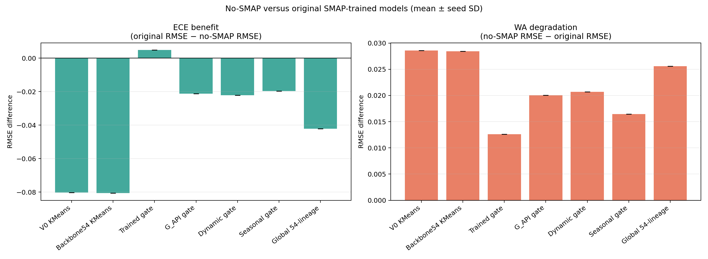

## No-SMAP invariance

Seed-42 predictions were checked after replacing all ECE SMAP columns with zero.

| model_id                         |   seed |   smap_columns_altered |   max_abs_prediction_difference |   changed_regime_labels |
|:---------------------------------|-------:|-----------------------:|--------------------------------:|------------------------:|
| Clustering_V0_Full_k2_no_smap    |     42 |                     85 |                  0.000000000000 |                       0 |
| Clustering_Backbone54_k2_no_smap |     42 |                     85 |                  0.000000000000 |                       0 |
| Trained_Gating_k2_no_smap        |     42 |                     85 |                  0.000000000000 |                       0 |
| Univariate_G_API_k2_no_smap      |     42 |                     85 |                  0.000000000000 |                       0 |
| Clustering_Dynamic_k2_no_smap    |     42 |                     85 |                  0.000000000000 |                       0 |
| Seasonal_Binary_k2_no_smap       |     42 |                     85 |                  0.000000000000 |                       0 |
| Global_Single_54_no_smap         |     42 |                     85 |                  0.000000000000 |                       0 |

## Figures

Each figure contains observed values plus four model lines, staying within the five-line limit.

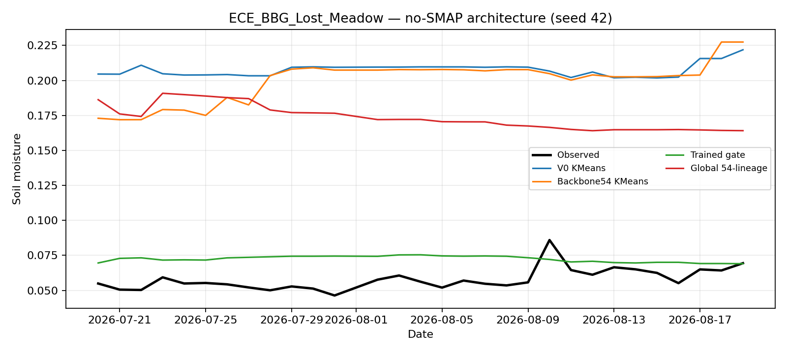

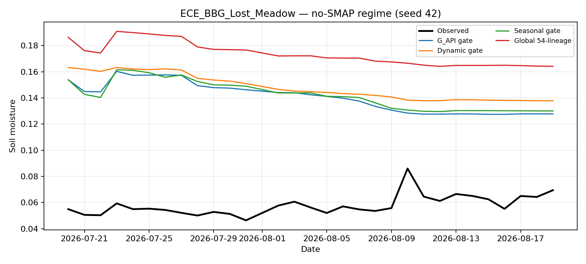

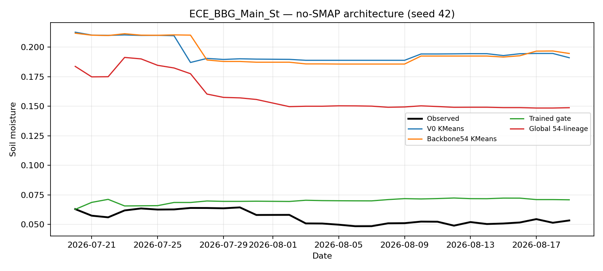

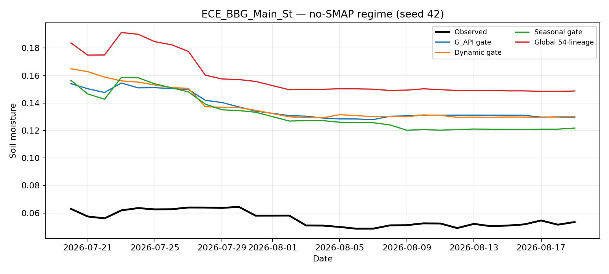

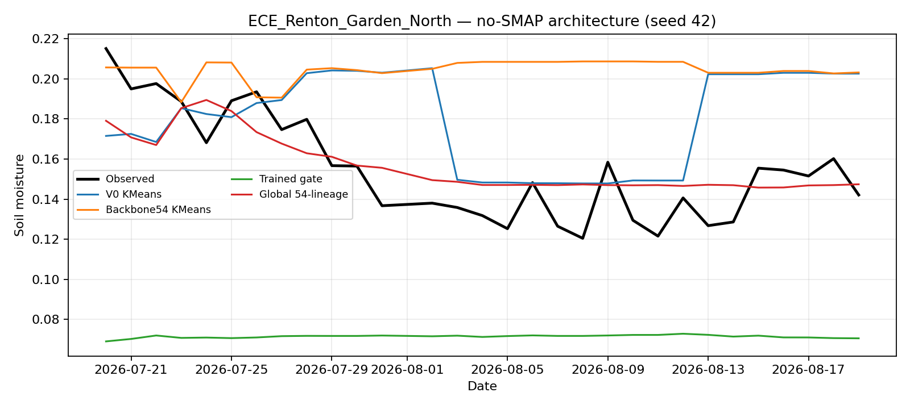

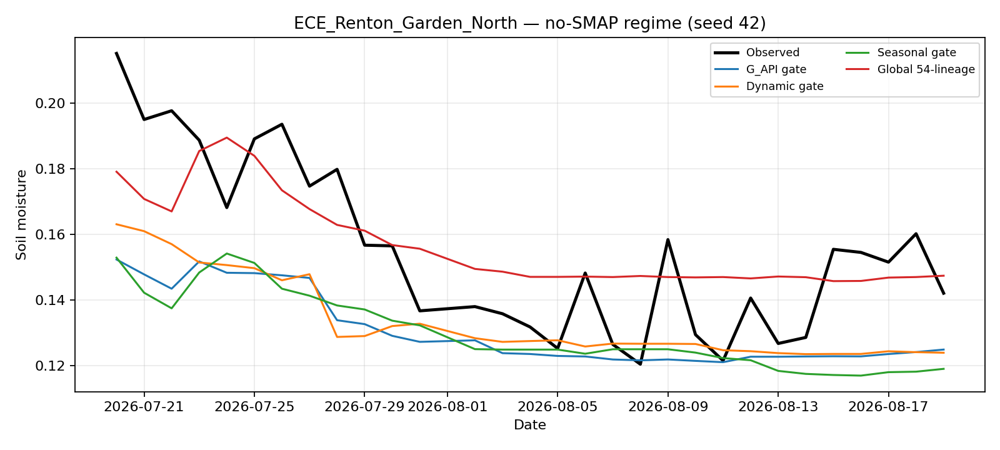

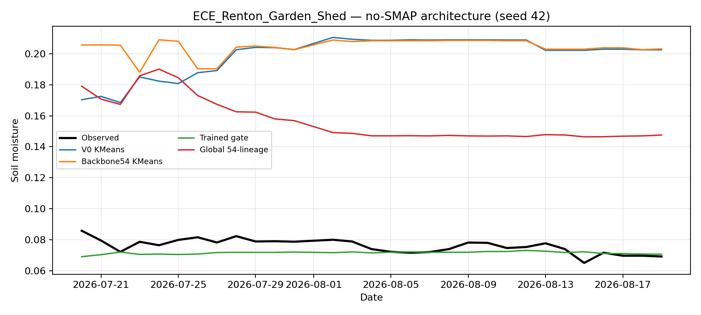

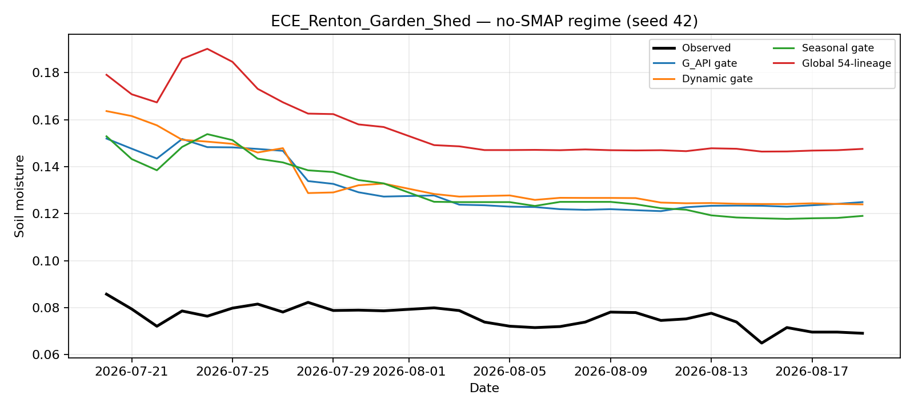

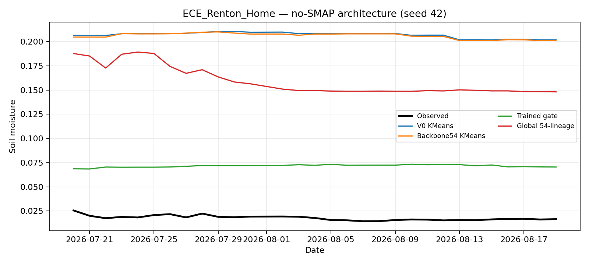

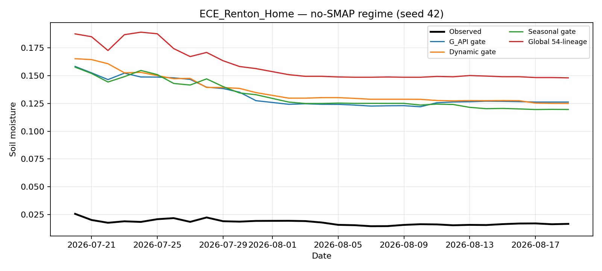

## Reproduction

```bash
cd notebooks
uv run --no-sync python experiment/derived_8.4-ece-model-salvage-1.0/run_model_salvage.py --smoke
sbatch experiment/derived_8.4-ece-model-salvage-1.0/run_slurm.sh
```

The Slurm job runs the full five-seed experiment, builds the notebook with `nb`, executes it with `nb execute --uv`, and regenerates this README from notebook stdout.
