# Experiment: `derived_8.4-ece-model-salvage-1.1`

## Objective

This descendant of 1.0 reruns the local MI → ElasticNet → stability → wrapper feature-selection pipeline after filtering every SMAP-derived feature. It produces nested 40/50/60/69 feature manifests: six routing families use 60 features and the global family is evaluated at all four sizes. There are no delta or specialist additions. Selector, router, and model fitting use WA trainval only; ECE targets are evaluation-only.

## Model families and seeds

The experiment covers V0 KMeans, backbone KMeans, supervised trained gating, G_API gating, dynamic gating, seasonal gating, and the single-regime global model. The six routing families use 60 features; the global model uses 40, 50, 60, and 69 feature variants. Every variant uses learner seeds `[42, 7, 13]`; router seed is fixed at 42.

## Feature-selection provenance

| status   |   selected_features |   smap_features |   candidate_pool | delta_additions   | selection_period   | fit_scope   |
|:---------|--------------------:|----------------:|-----------------:|:------------------|:-------------------|:------------|
| complete |                  40 |               0 |               69 | none              | WA 2023–2025       | WA only     |
| complete |                  50 |               0 |               69 | none              | WA 2023–2025       | WA only     |
| complete |                  60 |               0 |               69 | none              | WA 2023–2025       | WA only     |
| complete |                  69 |               0 |               69 | none              | WA 2023–2025       | WA only     |

### Selected feature manifest (40 features)

```text
longitude
precip_mm
s2_b4
s2_b8
elev
slope
DOY
D_sin_DOY
D_cos_DOY
E_SAR_ratio
G_API
G_DSLR
G_rain_sum_3d
G_rain_sum_7d
V_rollrng_G_API_kobs14
V_rollmax_G_API_kobs30
V_rollmin_F_NDMI_kobs30
V_rollmax_E_SAR_ratio_kobs30
V_rollmin_LST_modis_kobs30
V_rollmax_LST_modis_kobs30
V_ema_LST_modis_kobs30
C_lag_LST_modis_kobs30
V_rollmax_F_NDVI_kobs14
V_rollrng_F_NDVI_kobs30
V_rollmin_F_NDVI_kobs30
V_rollmax_F_NDVI_kobs30
V_ema_F_NDVI_kobs30
C_lag_F_NDVI_kobs30
V_rollmin_E_SAR_diff_kobs30
V_rollmin_s2_b11_kobs30
V_rollmin_s2_b12_kobs30
lia_mean_asc_deg
J_aspect_deg
J_bio_bio04
J_bio_bio06
J_bio_bio07
J_bio_bio13
J_bio_bio14
API_x_year
D_z_LST_modis
```

### Selected feature manifest (50 features)

```text
longitude
precip_mm
s2_b4
s2_b8
elev
slope
DOY
D_sin_DOY
D_cos_DOY
E_SAR_ratio
G_API
G_DSLR
G_rain_sum_3d
G_rain_sum_7d
V_rollrng_G_API_kobs14
V_rollmax_G_API_kobs30
V_rollmin_F_NDMI_kobs30
A_d_E_SAR_ratio_kobs30
V_rollmax_E_SAR_ratio_kobs7
V_rollmax_E_SAR_ratio_kobs30
V_rollmin_LST_modis_kobs30
V_rollmax_LST_modis_kobs30
V_ema_LST_modis_kobs30
C_lag_LST_modis_kobs30
V_rollmax_F_NDVI_kobs14
V_rollrng_F_NDVI_kobs30
V_rollmin_F_NDVI_kobs30
V_rollmax_F_NDVI_kobs30
V_ema_F_NDVI_kobs30
C_lag_F_NDVI_kobs30
A_d_E_SAR_diff_kobs30
V_rollmin_E_SAR_diff_kobs30
A_d_s2_b11_kobs30
V_rollmin_s2_b11_kobs30
A_grad_s2_b12_kobs7
V_rollmin_s2_b12_kobs30
lia_mean_asc_deg
J_aspect_deg
J_bio_bio02
J_bio_bio04
J_bio_bio06
J_bio_bio07
J_bio_bio13
J_bio_bio14
J_lc_code
J_soil_texture_usda_b0
sin_year
API_x_year
D_z_F_NDMI
D_z_LST_modis
```

### Selected feature manifest (60 features)

```text
longitude
precip_mm
s2_b4
s2_b8
elev
slope
DOY
D_sin_DOY
D_cos_DOY
F_MSI
E_SAR_ratio
G_API
G_DSLR
G_rain_sum_3d
G_rain_sum_7d
V_rollrng_G_API_kobs14
V_rollmin_G_API_kobs30
V_rollmax_G_API_kobs30
V_ema_G_API_kobs30
V_rollmean_F_NDMI_kobs30
V_rollmin_F_NDMI_kobs30
V_rollmax_F_NDMI_kobs30
C_lag_F_NDMI_kobs30
A_d_E_SAR_ratio_kobs30
V_rollmax_E_SAR_ratio_kobs7
V_rollmax_E_SAR_ratio_kobs30
C_lag_E_SAR_ratio_kobs30
V_rollmin_LST_modis_kobs30
V_rollmax_LST_modis_kobs30
V_ema_LST_modis_kobs30
C_lag_LST_modis_kobs30
V_rollmin_F_NDVI_kobs14
V_rollmax_F_NDVI_kobs14
V_rollrng_F_NDVI_kobs30
V_rollmin_F_NDVI_kobs30
V_rollmax_F_NDVI_kobs30
V_ema_F_NDVI_kobs30
C_lag_F_NDVI_kobs30
A_d_E_SAR_diff_kobs30
V_rollrng_E_SAR_diff_kobs30
V_rollmin_E_SAR_diff_kobs30
A_d_s2_b11_kobs30
V_rollmin_s2_b11_kobs30
A_grad_s2_b12_kobs7
V_rollmin_s2_b12_kobs30
lia_mean_asc_deg
J_aspect_deg
J_bio_bio02
J_bio_bio04
J_bio_bio06
J_bio_bio07
J_bio_bio13
J_bio_bio14
J_lc_code
J_soil_texture_usda_b0
sin_year
API_x_year
D_z_F_NDMI
D_z_LST_modis
D_fft_dom_LST_modis_kobs30
```

### Selected feature manifest (69 features)

```text
longitude
precip_mm
s2_b4
s2_b8
elev
slope
DOY
D_sin_DOY
D_cos_DOY
F_MSI
E_SAR_ratio
G_API
G_DSLR
G_rain_sum_3d
G_rain_sum_7d
V_rollmax_G_API_kobs7
V_rollrng_G_API_kobs14
V_rollmin_G_API_kobs14
V_rollmax_G_API_kobs14
V_ema_G_API_kobs14
V_rollmean_G_API_kobs30
V_rollmin_G_API_kobs30
V_rollmax_G_API_kobs30
V_ema_G_API_kobs30
V_rollmean_F_NDMI_kobs30
V_rollmin_F_NDMI_kobs30
V_rollmax_F_NDMI_kobs30
C_lag_F_NDMI_kobs30
A_d_E_SAR_ratio_kobs30
V_rollmax_E_SAR_ratio_kobs7
V_rollmax_E_SAR_ratio_kobs30
V_ema_E_SAR_ratio_kobs30
C_lag_E_SAR_ratio_kobs30
V_rollmin_LST_modis_kobs30
V_rollmax_LST_modis_kobs30
V_ema_LST_modis_kobs30
C_lag_LST_modis_kobs30
V_rollrng_F_NDVI_kobs14
V_rollmin_F_NDVI_kobs14
V_rollmax_F_NDVI_kobs14
V_rollrng_F_NDVI_kobs30
V_rollmin_F_NDVI_kobs30
V_rollmax_F_NDVI_kobs30
V_ema_F_NDVI_kobs30
C_lag_F_NDVI_kobs30
A_d_E_SAR_diff_kobs30
V_rollrng_E_SAR_diff_kobs30
V_rollmin_E_SAR_diff_kobs30
A_d_s2_b11_kobs30
V_rollmin_s2_b11_kobs30
A_grad_s2_b12_kobs7
V_rollmin_s2_b12_kobs30
lia_mean_asc_deg
J_aspect_deg
J_bio_bio02
J_bio_bio04
J_bio_bio06
J_bio_bio07
J_bio_bio13
J_bio_bio14
J_lc_code
J_soil_texture_usda_b0
sin_year
API_x_year
D_z_F_NDMI
D_z_E_SAR_ratio
D_sa_LST_modis
D_z_LST_modis
D_fft_dom_LST_modis_kobs30
```

## Input audit

```text
{
  "ece_date_max": "2026-08-19",
  "ece_date_min": "2026-07-20",
  "ece_rows": 150,
  "ece_stations": [
    "ECE_BBG_Lost_Meadow",
    "ECE_BBG_Main_St",
    "ECE_Renton_Garden_North",
    "ECE_Renton_Garden_Shed",
    "ECE_Renton_Home"
  ],
  "ece_target_used_for_fit": false,
  "train_rows": 9803,
  "trainval_rows": 14608,
  "val_rows": 4805,
  "wa_test_rows": 6620,
  "wa_train_stations": [
    "BeaverPass_WA_990",
    "CayusePass_WA",
    "Darrington",
    "Paradise_WA",
    "Quinault",
    "SourdoughGulch_WA_985",
    "Spokane"
  ]
}
```

## Feature audit

| component              | parent_count   |   dropped_smap |   effective_count | effective_features                                                                                                                                                                                                                                                                                                                                                                                                                                                                                                                                                                                                                                                                                                                                                                                                                                                                                                                                                                                                                                                                                                                                                                                                                                                                |
|:-----------------------|:---------------|---------------:|------------------:|:----------------------------------------------------------------------------------------------------------------------------------------------------------------------------------------------------------------------------------------------------------------------------------------------------------------------------------------------------------------------------------------------------------------------------------------------------------------------------------------------------------------------------------------------------------------------------------------------------------------------------------------------------------------------------------------------------------------------------------------------------------------------------------------------------------------------------------------------------------------------------------------------------------------------------------------------------------------------------------------------------------------------------------------------------------------------------------------------------------------------------------------------------------------------------------------------------------------------------------------------------------------------------------|
| dynamic_router         | 3              |              1 |                 2 | G_API;LST_modis                                                                                                                                                                                                                                                                                                                                                                                                                                                                                                                                                                                                                                                                                                                                                                                                                                                                                                                                                                                                                                                                                                                                                                                                                                                                   |
| legacy_backbone_parent | 54             |             22 |                60 | longitude;precip_mm;s2_b4;s2_b8;elev;slope;DOY;D_sin_DOY;D_cos_DOY;F_MSI;E_SAR_ratio;G_API;G_DSLR;G_rain_sum_3d;G_rain_sum_7d;V_rollrng_G_API_kobs14;V_rollmin_G_API_kobs30;V_rollmax_G_API_kobs30;V_ema_G_API_kobs30;V_rollmean_F_NDMI_kobs30;V_rollmin_F_NDMI_kobs30;V_rollmax_F_NDMI_kobs30;C_lag_F_NDMI_kobs30;A_d_E_SAR_ratio_kobs30;V_rollmax_E_SAR_ratio_kobs7;V_rollmax_E_SAR_ratio_kobs30;C_lag_E_SAR_ratio_kobs30;V_rollmin_LST_modis_kobs30;V_rollmax_LST_modis_kobs30;V_ema_LST_modis_kobs30;C_lag_LST_modis_kobs30;V_rollmin_F_NDVI_kobs14;V_rollmax_F_NDVI_kobs14;V_rollrng_F_NDVI_kobs30;V_rollmin_F_NDVI_kobs30;V_rollmax_F_NDVI_kobs30;V_ema_F_NDVI_kobs30;C_lag_F_NDVI_kobs30;A_d_E_SAR_diff_kobs30;V_rollrng_E_SAR_diff_kobs30;V_rollmin_E_SAR_diff_kobs30;A_d_s2_b11_kobs30;V_rollmin_s2_b11_kobs30;A_grad_s2_b12_kobs7;V_rollmin_s2_b12_kobs30;lia_mean_asc_deg;J_aspect_deg;J_bio_bio02;J_bio_bio04;J_bio_bio06;J_bio_bio07;J_bio_bio13;J_bio_bio14;J_lc_code;J_soil_texture_usda_b0;sin_year;API_x_year;D_z_F_NDMI;D_z_LST_modis;D_fft_dom_LST_modis_kobs30                                                                                                                                                                                                |
| selected_model_40      | selector       |              0 |                40 | longitude;precip_mm;s2_b4;s2_b8;elev;slope;DOY;D_sin_DOY;D_cos_DOY;E_SAR_ratio;G_API;G_DSLR;G_rain_sum_3d;G_rain_sum_7d;V_rollrng_G_API_kobs14;V_rollmax_G_API_kobs30;V_rollmin_F_NDMI_kobs30;V_rollmax_E_SAR_ratio_kobs30;V_rollmin_LST_modis_kobs30;V_rollmax_LST_modis_kobs30;V_ema_LST_modis_kobs30;C_lag_LST_modis_kobs30;V_rollmax_F_NDVI_kobs14;V_rollrng_F_NDVI_kobs30;V_rollmin_F_NDVI_kobs30;V_rollmax_F_NDVI_kobs30;V_ema_F_NDVI_kobs30;C_lag_F_NDVI_kobs30;V_rollmin_E_SAR_diff_kobs30;V_rollmin_s2_b11_kobs30;V_rollmin_s2_b12_kobs30;lia_mean_asc_deg;J_aspect_deg;J_bio_bio04;J_bio_bio06;J_bio_bio07;J_bio_bio13;J_bio_bio14;API_x_year;D_z_LST_modis                                                                                                                                                                                                                                                                                                                                                                                                                                                                                                                                                                                                             |
| selected_model_50      | selector       |              0 |                50 | longitude;precip_mm;s2_b4;s2_b8;elev;slope;DOY;D_sin_DOY;D_cos_DOY;E_SAR_ratio;G_API;G_DSLR;G_rain_sum_3d;G_rain_sum_7d;V_rollrng_G_API_kobs14;V_rollmax_G_API_kobs30;V_rollmin_F_NDMI_kobs30;A_d_E_SAR_ratio_kobs30;V_rollmax_E_SAR_ratio_kobs7;V_rollmax_E_SAR_ratio_kobs30;V_rollmin_LST_modis_kobs30;V_rollmax_LST_modis_kobs30;V_ema_LST_modis_kobs30;C_lag_LST_modis_kobs30;V_rollmax_F_NDVI_kobs14;V_rollrng_F_NDVI_kobs30;V_rollmin_F_NDVI_kobs30;V_rollmax_F_NDVI_kobs30;V_ema_F_NDVI_kobs30;C_lag_F_NDVI_kobs30;A_d_E_SAR_diff_kobs30;V_rollmin_E_SAR_diff_kobs30;A_d_s2_b11_kobs30;V_rollmin_s2_b11_kobs30;A_grad_s2_b12_kobs7;V_rollmin_s2_b12_kobs30;lia_mean_asc_deg;J_aspect_deg;J_bio_bio02;J_bio_bio04;J_bio_bio06;J_bio_bio07;J_bio_bio13;J_bio_bio14;J_lc_code;J_soil_texture_usda_b0;sin_year;API_x_year;D_z_F_NDMI;D_z_LST_modis                                                                                                                                                                                                                                                                                                                                                                                                                             |
| selected_model_60      | selector       |              0 |                60 | longitude;precip_mm;s2_b4;s2_b8;elev;slope;DOY;D_sin_DOY;D_cos_DOY;F_MSI;E_SAR_ratio;G_API;G_DSLR;G_rain_sum_3d;G_rain_sum_7d;V_rollrng_G_API_kobs14;V_rollmin_G_API_kobs30;V_rollmax_G_API_kobs30;V_ema_G_API_kobs30;V_rollmean_F_NDMI_kobs30;V_rollmin_F_NDMI_kobs30;V_rollmax_F_NDMI_kobs30;C_lag_F_NDMI_kobs30;A_d_E_SAR_ratio_kobs30;V_rollmax_E_SAR_ratio_kobs7;V_rollmax_E_SAR_ratio_kobs30;C_lag_E_SAR_ratio_kobs30;V_rollmin_LST_modis_kobs30;V_rollmax_LST_modis_kobs30;V_ema_LST_modis_kobs30;C_lag_LST_modis_kobs30;V_rollmin_F_NDVI_kobs14;V_rollmax_F_NDVI_kobs14;V_rollrng_F_NDVI_kobs30;V_rollmin_F_NDVI_kobs30;V_rollmax_F_NDVI_kobs30;V_ema_F_NDVI_kobs30;C_lag_F_NDVI_kobs30;A_d_E_SAR_diff_kobs30;V_rollrng_E_SAR_diff_kobs30;V_rollmin_E_SAR_diff_kobs30;A_d_s2_b11_kobs30;V_rollmin_s2_b11_kobs30;A_grad_s2_b12_kobs7;V_rollmin_s2_b12_kobs30;lia_mean_asc_deg;J_aspect_deg;J_bio_bio02;J_bio_bio04;J_bio_bio06;J_bio_bio07;J_bio_bio13;J_bio_bio14;J_lc_code;J_soil_texture_usda_b0;sin_year;API_x_year;D_z_F_NDMI;D_z_LST_modis;D_fft_dom_LST_modis_kobs30                                                                                                                                                                                                |
| selected_model_69      | selector       |              0 |                69 | longitude;precip_mm;s2_b4;s2_b8;elev;slope;DOY;D_sin_DOY;D_cos_DOY;F_MSI;E_SAR_ratio;G_API;G_DSLR;G_rain_sum_3d;G_rain_sum_7d;V_rollmax_G_API_kobs7;V_rollrng_G_API_kobs14;V_rollmin_G_API_kobs14;V_rollmax_G_API_kobs14;V_ema_G_API_kobs14;V_rollmean_G_API_kobs30;V_rollmin_G_API_kobs30;V_rollmax_G_API_kobs30;V_ema_G_API_kobs30;V_rollmean_F_NDMI_kobs30;V_rollmin_F_NDMI_kobs30;V_rollmax_F_NDMI_kobs30;C_lag_F_NDMI_kobs30;A_d_E_SAR_ratio_kobs30;V_rollmax_E_SAR_ratio_kobs7;V_rollmax_E_SAR_ratio_kobs30;V_ema_E_SAR_ratio_kobs30;C_lag_E_SAR_ratio_kobs30;V_rollmin_LST_modis_kobs30;V_rollmax_LST_modis_kobs30;V_ema_LST_modis_kobs30;C_lag_LST_modis_kobs30;V_rollrng_F_NDVI_kobs14;V_rollmin_F_NDVI_kobs14;V_rollmax_F_NDVI_kobs14;V_rollrng_F_NDVI_kobs30;V_rollmin_F_NDVI_kobs30;V_rollmax_F_NDVI_kobs30;V_ema_F_NDVI_kobs30;C_lag_F_NDVI_kobs30;A_d_E_SAR_diff_kobs30;V_rollrng_E_SAR_diff_kobs30;V_rollmin_E_SAR_diff_kobs30;A_d_s2_b11_kobs30;V_rollmin_s2_b11_kobs30;A_grad_s2_b12_kobs7;V_rollmin_s2_b12_kobs30;lia_mean_asc_deg;J_aspect_deg;J_bio_bio02;J_bio_bio04;J_bio_bio06;J_bio_bio07;J_bio_bio13;J_bio_bio14;J_lc_code;J_soil_texture_usda_b0;sin_year;API_x_year;D_z_F_NDMI;D_z_E_SAR_ratio;D_sa_LST_modis;D_z_LST_modis;D_fft_dom_LST_modis_kobs30 |
| v0_router              | 50             |              8 |                42 | A_d_E_SAR_diff_kobs30;A_d_LST_modis_kobs30;A_d_s2_b11_kobs30;A_grad_E_SAR_diff_kobs30;A_grad_LST_modis_kobs30;A_grad_s2_b11_kobs30;C_lag_F_NDVI_kobs30;D_sa_F_NDMI;D_sa_LST_modis;D_z_E_SAR_ratio;E_SAR_ratio;F_MSI;J_aspect_deg;J_bio_bio15;K_aspect_cos;K_aspect_sin;V_ema_F_NDVI_kobs30;V_ema_LST_modis_kobs30;V_rollmax_G_API_kobs7;V_rollmean_F_NDMI_kobs30;V_rollmin_s2_b12_kobs30;V_rollrng_F_NDVI_kobs30;aspect;latitude;lia_std_asc_deg;s2_b8;slope;A_grad_LST_modis_kobs14;V_rollmax_E_SAR_ratio_kobs7;A_d_LST_modis_kobs14;J_clay_wfrac_b100;V_ema_G_API_kobs30;V_rollmin_G_API_kobs14;V_rollrng_LST_modis_kobs30;V_rollrng_G_API_kobs30;C_lag_F_NDMI_kobs30;V_rollrng_E_SAR_ratio_kobs30;J_bio_bio02;V_rollmax_E_SAR_ratio_kobs30;V_rollmax_G_API_kobs30;s2_b11;V_rollrng_F_NDVI_kobs14                                                                                                                                                                                                                                                                                                                                                                                                                                                                               |

## Router audit

| model_id                            | router       | dataset     |   router_seed |     n |   regime_0_share |   regime_1_share |   router_feature_count | router_features                                                                                                                                                                                                                                                                                                                                                                                                                                                                                                                                                                                                                                                                                                                                                                                                                                                                                                                                                                                                                                                                    |
|:------------------------------------|:-------------|:------------|--------------:|------:|-----------------:|-----------------:|-----------------------:|:-----------------------------------------------------------------------------------------------------------------------------------------------------------------------------------------------------------------------------------------------------------------------------------------------------------------------------------------------------------------------------------------------------------------------------------------------------------------------------------------------------------------------------------------------------------------------------------------------------------------------------------------------------------------------------------------------------------------------------------------------------------------------------------------------------------------------------------------------------------------------------------------------------------------------------------------------------------------------------------------------------------------------------------------------------------------------------------|
| Clustering_V0_Full_k2_no_smap_fs60  | v0           | wa_trainval |            42 | 14608 |           0.2720 |           0.7280 |                     42 | A_d_E_SAR_diff_kobs30;A_d_LST_modis_kobs30;A_d_s2_b11_kobs30;A_grad_E_SAR_diff_kobs30;A_grad_LST_modis_kobs30;A_grad_s2_b11_kobs30;C_lag_F_NDVI_kobs30;D_sa_F_NDMI;D_sa_LST_modis;D_z_E_SAR_ratio;E_SAR_ratio;F_MSI;J_aspect_deg;J_bio_bio15;K_aspect_cos;K_aspect_sin;V_ema_F_NDVI_kobs30;V_ema_LST_modis_kobs30;V_rollmax_G_API_kobs7;V_rollmean_F_NDMI_kobs30;V_rollmin_s2_b12_kobs30;V_rollrng_F_NDVI_kobs30;aspect;latitude;lia_std_asc_deg;s2_b8;slope;A_grad_LST_modis_kobs14;V_rollmax_E_SAR_ratio_kobs7;A_d_LST_modis_kobs14;J_clay_wfrac_b100;V_ema_G_API_kobs30;V_rollmin_G_API_kobs14;V_rollrng_LST_modis_kobs30;V_rollrng_G_API_kobs30;C_lag_F_NDMI_kobs30;V_rollrng_E_SAR_ratio_kobs30;J_bio_bio02;V_rollmax_E_SAR_ratio_kobs30;V_rollmax_G_API_kobs30;s2_b11;V_rollrng_F_NDVI_kobs14                                                                                                                                                                                                                                                                                |
| Clustering_V0_Full_k2_no_smap_fs60  | v0           | wa_test     |            42 |  6620 |           0.2724 |           0.7276 |                     42 | A_d_E_SAR_diff_kobs30;A_d_LST_modis_kobs30;A_d_s2_b11_kobs30;A_grad_E_SAR_diff_kobs30;A_grad_LST_modis_kobs30;A_grad_s2_b11_kobs30;C_lag_F_NDVI_kobs30;D_sa_F_NDMI;D_sa_LST_modis;D_z_E_SAR_ratio;E_SAR_ratio;F_MSI;J_aspect_deg;J_bio_bio15;K_aspect_cos;K_aspect_sin;V_ema_F_NDVI_kobs30;V_ema_LST_modis_kobs30;V_rollmax_G_API_kobs7;V_rollmean_F_NDMI_kobs30;V_rollmin_s2_b12_kobs30;V_rollrng_F_NDVI_kobs30;aspect;latitude;lia_std_asc_deg;s2_b8;slope;A_grad_LST_modis_kobs14;V_rollmax_E_SAR_ratio_kobs7;A_d_LST_modis_kobs14;J_clay_wfrac_b100;V_ema_G_API_kobs30;V_rollmin_G_API_kobs14;V_rollrng_LST_modis_kobs30;V_rollrng_G_API_kobs30;C_lag_F_NDMI_kobs30;V_rollrng_E_SAR_ratio_kobs30;J_bio_bio02;V_rollmax_E_SAR_ratio_kobs30;V_rollmax_G_API_kobs30;s2_b11;V_rollrng_F_NDVI_kobs14                                                                                                                                                                                                                                                                                |
| Clustering_V0_Full_k2_no_smap_fs60  | v0           | ece_v3      |            42 |   150 |           0.8200 |           0.1800 |                     42 | A_d_E_SAR_diff_kobs30;A_d_LST_modis_kobs30;A_d_s2_b11_kobs30;A_grad_E_SAR_diff_kobs30;A_grad_LST_modis_kobs30;A_grad_s2_b11_kobs30;C_lag_F_NDVI_kobs30;D_sa_F_NDMI;D_sa_LST_modis;D_z_E_SAR_ratio;E_SAR_ratio;F_MSI;J_aspect_deg;J_bio_bio15;K_aspect_cos;K_aspect_sin;V_ema_F_NDVI_kobs30;V_ema_LST_modis_kobs30;V_rollmax_G_API_kobs7;V_rollmean_F_NDMI_kobs30;V_rollmin_s2_b12_kobs30;V_rollrng_F_NDVI_kobs30;aspect;latitude;lia_std_asc_deg;s2_b8;slope;A_grad_LST_modis_kobs14;V_rollmax_E_SAR_ratio_kobs7;A_d_LST_modis_kobs14;J_clay_wfrac_b100;V_ema_G_API_kobs30;V_rollmin_G_API_kobs14;V_rollrng_LST_modis_kobs30;V_rollrng_G_API_kobs30;C_lag_F_NDMI_kobs30;V_rollrng_E_SAR_ratio_kobs30;J_bio_bio02;V_rollmax_E_SAR_ratio_kobs30;V_rollmax_G_API_kobs30;s2_b11;V_rollrng_F_NDVI_kobs14                                                                                                                                                                                                                                                                                |
| Clustering_Backbone_k2_no_smap_fs60 | backbone54   | wa_trainval |            42 | 14608 |           0.2727 |           0.7273 |                     60 | longitude;precip_mm;s2_b4;s2_b8;elev;slope;DOY;D_sin_DOY;D_cos_DOY;F_MSI;E_SAR_ratio;G_API;G_DSLR;G_rain_sum_3d;G_rain_sum_7d;V_rollrng_G_API_kobs14;V_rollmin_G_API_kobs30;V_rollmax_G_API_kobs30;V_ema_G_API_kobs30;V_rollmean_F_NDMI_kobs30;V_rollmin_F_NDMI_kobs30;V_rollmax_F_NDMI_kobs30;C_lag_F_NDMI_kobs30;A_d_E_SAR_ratio_kobs30;V_rollmax_E_SAR_ratio_kobs7;V_rollmax_E_SAR_ratio_kobs30;C_lag_E_SAR_ratio_kobs30;V_rollmin_LST_modis_kobs30;V_rollmax_LST_modis_kobs30;V_ema_LST_modis_kobs30;C_lag_LST_modis_kobs30;V_rollmin_F_NDVI_kobs14;V_rollmax_F_NDVI_kobs14;V_rollrng_F_NDVI_kobs30;V_rollmin_F_NDVI_kobs30;V_rollmax_F_NDVI_kobs30;V_ema_F_NDVI_kobs30;C_lag_F_NDVI_kobs30;A_d_E_SAR_diff_kobs30;V_rollrng_E_SAR_diff_kobs30;V_rollmin_E_SAR_diff_kobs30;A_d_s2_b11_kobs30;V_rollmin_s2_b11_kobs30;A_grad_s2_b12_kobs7;V_rollmin_s2_b12_kobs30;lia_mean_asc_deg;J_aspect_deg;J_bio_bio02;J_bio_bio04;J_bio_bio06;J_bio_bio07;J_bio_bio13;J_bio_bio14;J_lc_code;J_soil_texture_usda_b0;sin_year;API_x_year;D_z_F_NDMI;D_z_LST_modis;D_fft_dom_LST_modis_kobs30 |
| Clustering_Backbone_k2_no_smap_fs60 | backbone54   | wa_test     |            42 |  6620 |           0.2724 |           0.7276 |                     60 | longitude;precip_mm;s2_b4;s2_b8;elev;slope;DOY;D_sin_DOY;D_cos_DOY;F_MSI;E_SAR_ratio;G_API;G_DSLR;G_rain_sum_3d;G_rain_sum_7d;V_rollrng_G_API_kobs14;V_rollmin_G_API_kobs30;V_rollmax_G_API_kobs30;V_ema_G_API_kobs30;V_rollmean_F_NDMI_kobs30;V_rollmin_F_NDMI_kobs30;V_rollmax_F_NDMI_kobs30;C_lag_F_NDMI_kobs30;A_d_E_SAR_ratio_kobs30;V_rollmax_E_SAR_ratio_kobs7;V_rollmax_E_SAR_ratio_kobs30;C_lag_E_SAR_ratio_kobs30;V_rollmin_LST_modis_kobs30;V_rollmax_LST_modis_kobs30;V_ema_LST_modis_kobs30;C_lag_LST_modis_kobs30;V_rollmin_F_NDVI_kobs14;V_rollmax_F_NDVI_kobs14;V_rollrng_F_NDVI_kobs30;V_rollmin_F_NDVI_kobs30;V_rollmax_F_NDVI_kobs30;V_ema_F_NDVI_kobs30;C_lag_F_NDVI_kobs30;A_d_E_SAR_diff_kobs30;V_rollrng_E_SAR_diff_kobs30;V_rollmin_E_SAR_diff_kobs30;A_d_s2_b11_kobs30;V_rollmin_s2_b11_kobs30;A_grad_s2_b12_kobs7;V_rollmin_s2_b12_kobs30;lia_mean_asc_deg;J_aspect_deg;J_bio_bio02;J_bio_bio04;J_bio_bio06;J_bio_bio07;J_bio_bio13;J_bio_bio14;J_lc_code;J_soil_texture_usda_b0;sin_year;API_x_year;D_z_F_NDMI;D_z_LST_modis;D_fft_dom_LST_modis_kobs30 |
| Clustering_Backbone_k2_no_smap_fs60 | backbone54   | ece_v3      |            42 |   150 |           0.4467 |           0.5533 |                     60 | longitude;precip_mm;s2_b4;s2_b8;elev;slope;DOY;D_sin_DOY;D_cos_DOY;F_MSI;E_SAR_ratio;G_API;G_DSLR;G_rain_sum_3d;G_rain_sum_7d;V_rollrng_G_API_kobs14;V_rollmin_G_API_kobs30;V_rollmax_G_API_kobs30;V_ema_G_API_kobs30;V_rollmean_F_NDMI_kobs30;V_rollmin_F_NDMI_kobs30;V_rollmax_F_NDMI_kobs30;C_lag_F_NDMI_kobs30;A_d_E_SAR_ratio_kobs30;V_rollmax_E_SAR_ratio_kobs7;V_rollmax_E_SAR_ratio_kobs30;C_lag_E_SAR_ratio_kobs30;V_rollmin_LST_modis_kobs30;V_rollmax_LST_modis_kobs30;V_ema_LST_modis_kobs30;C_lag_LST_modis_kobs30;V_rollmin_F_NDVI_kobs14;V_rollmax_F_NDVI_kobs14;V_rollrng_F_NDVI_kobs30;V_rollmin_F_NDVI_kobs30;V_rollmax_F_NDVI_kobs30;V_ema_F_NDVI_kobs30;C_lag_F_NDVI_kobs30;A_d_E_SAR_diff_kobs30;V_rollrng_E_SAR_diff_kobs30;V_rollmin_E_SAR_diff_kobs30;A_d_s2_b11_kobs30;V_rollmin_s2_b11_kobs30;A_grad_s2_b12_kobs7;V_rollmin_s2_b12_kobs30;lia_mean_asc_deg;J_aspect_deg;J_bio_bio02;J_bio_bio04;J_bio_bio06;J_bio_bio07;J_bio_bio13;J_bio_bio14;J_lc_code;J_soil_texture_usda_b0;sin_year;API_x_year;D_z_F_NDMI;D_z_LST_modis;D_fft_dom_LST_modis_kobs30 |
| Trained_Gating_k2_no_smap_fs60      | trained_gate | wa_trainval |            42 | 14608 |           0.2860 |           0.7140 |                     42 | A_d_E_SAR_diff_kobs30;A_d_LST_modis_kobs30;A_d_s2_b11_kobs30;A_grad_E_SAR_diff_kobs30;A_grad_LST_modis_kobs30;A_grad_s2_b11_kobs30;C_lag_F_NDVI_kobs30;D_sa_F_NDMI;D_sa_LST_modis;D_z_E_SAR_ratio;E_SAR_ratio;F_MSI;J_aspect_deg;J_bio_bio15;K_aspect_cos;K_aspect_sin;V_ema_F_NDVI_kobs30;V_ema_LST_modis_kobs30;V_rollmax_G_API_kobs7;V_rollmean_F_NDMI_kobs30;V_rollmin_s2_b12_kobs30;V_rollrng_F_NDVI_kobs30;aspect;latitude;lia_std_asc_deg;s2_b8;slope;A_grad_LST_modis_kobs14;V_rollmax_E_SAR_ratio_kobs7;A_d_LST_modis_kobs14;J_clay_wfrac_b100;V_ema_G_API_kobs30;V_rollmin_G_API_kobs14;V_rollrng_LST_modis_kobs30;V_rollrng_G_API_kobs30;C_lag_F_NDMI_kobs30;V_rollrng_E_SAR_ratio_kobs30;J_bio_bio02;V_rollmax_E_SAR_ratio_kobs30;V_rollmax_G_API_kobs30;s2_b11;V_rollrng_F_NDVI_kobs14                                                                                                                                                                                                                                                                                |
| Trained_Gating_k2_no_smap_fs60      | trained_gate | wa_test     |            42 |  6620 |           0.3068 |           0.6932 |                     42 | A_d_E_SAR_diff_kobs30;A_d_LST_modis_kobs30;A_d_s2_b11_kobs30;A_grad_E_SAR_diff_kobs30;A_grad_LST_modis_kobs30;A_grad_s2_b11_kobs30;C_lag_F_NDVI_kobs30;D_sa_F_NDMI;D_sa_LST_modis;D_z_E_SAR_ratio;E_SAR_ratio;F_MSI;J_aspect_deg;J_bio_bio15;K_aspect_cos;K_aspect_sin;V_ema_F_NDVI_kobs30;V_ema_LST_modis_kobs30;V_rollmax_G_API_kobs7;V_rollmean_F_NDMI_kobs30;V_rollmin_s2_b12_kobs30;V_rollrng_F_NDVI_kobs30;aspect;latitude;lia_std_asc_deg;s2_b8;slope;A_grad_LST_modis_kobs14;V_rollmax_E_SAR_ratio_kobs7;A_d_LST_modis_kobs14;J_clay_wfrac_b100;V_ema_G_API_kobs30;V_rollmin_G_API_kobs14;V_rollrng_LST_modis_kobs30;V_rollrng_G_API_kobs30;C_lag_F_NDMI_kobs30;V_rollrng_E_SAR_ratio_kobs30;J_bio_bio02;V_rollmax_E_SAR_ratio_kobs30;V_rollmax_G_API_kobs30;s2_b11;V_rollrng_F_NDVI_kobs14                                                                                                                                                                                                                                                                                |
| Trained_Gating_k2_no_smap_fs60      | trained_gate | ece_v3      |            42 |   150 |           1.0000 |           0.0000 |                     42 | A_d_E_SAR_diff_kobs30;A_d_LST_modis_kobs30;A_d_s2_b11_kobs30;A_grad_E_SAR_diff_kobs30;A_grad_LST_modis_kobs30;A_grad_s2_b11_kobs30;C_lag_F_NDVI_kobs30;D_sa_F_NDMI;D_sa_LST_modis;D_z_E_SAR_ratio;E_SAR_ratio;F_MSI;J_aspect_deg;J_bio_bio15;K_aspect_cos;K_aspect_sin;V_ema_F_NDVI_kobs30;V_ema_LST_modis_kobs30;V_rollmax_G_API_kobs7;V_rollmean_F_NDMI_kobs30;V_rollmin_s2_b12_kobs30;V_rollrng_F_NDVI_kobs30;aspect;latitude;lia_std_asc_deg;s2_b8;slope;A_grad_LST_modis_kobs14;V_rollmax_E_SAR_ratio_kobs7;A_d_LST_modis_kobs14;J_clay_wfrac_b100;V_ema_G_API_kobs30;V_rollmin_G_API_kobs14;V_rollrng_LST_modis_kobs30;V_rollrng_G_API_kobs30;C_lag_F_NDMI_kobs30;V_rollrng_E_SAR_ratio_kobs30;J_bio_bio02;V_rollmax_E_SAR_ratio_kobs30;V_rollmax_G_API_kobs30;s2_b11;V_rollrng_F_NDVI_kobs14                                                                                                                                                                                                                                                                                |
| Univariate_G_API_k2_no_smap_fs60    | gapi         | wa_trainval |            42 | 14608 |           0.5000 |           0.5000 |                      1 | G_API                                                                                                                                                                                                                                                                                                                                                                                                                                                                                                                                                                                                                                                                                                                                                                                                                                                                                                                                                                                                                                                                              |
| Univariate_G_API_k2_no_smap_fs60    | gapi         | wa_test     |            42 |  6620 |           0.5307 |           0.4693 |                      1 | G_API                                                                                                                                                                                                                                                                                                                                                                                                                                                                                                                                                                                                                                                                                                                                                                                                                                                                                                                                                                                                                                                                              |
| Univariate_G_API_k2_no_smap_fs60    | gapi         | ece_v3      |            42 |   150 |           1.0000 |           0.0000 |                      1 | G_API                                                                                                                                                                                                                                                                                                                                                                                                                                                                                                                                                                                                                                                                                                                                                                                                                                                                                                                                                                                                                                                                              |
| Clustering_Dynamic_k2_no_smap_fs60  | dynamic      | wa_trainval |            42 | 14608 |           0.5528 |           0.4472 |                      2 | G_API;LST_modis                                                                                                                                                                                                                                                                                                                                                                                                                                                                                                                                                                                                                                                                                                                                                                                                                                                                                                                                                                                                                                                                    |
| Clustering_Dynamic_k2_no_smap_fs60  | dynamic      | wa_test     |            42 |  6620 |           0.5693 |           0.4307 |                      2 | G_API;LST_modis                                                                                                                                                                                                                                                                                                                                                                                                                                                                                                                                                                                                                                                                                                                                                                                                                                                                                                                                                                                                                                                                    |
| Clustering_Dynamic_k2_no_smap_fs60  | dynamic      | ece_v3      |            42 |   150 |           1.0000 |           0.0000 |                      2 | G_API;LST_modis                                                                                                                                                                                                                                                                                                                                                                                                                                                                                                                                                                                                                                                                                                                                                                                                                                                                                                                                                                                                                                                                    |
| Seasonal_Binary_k2_no_smap_fs60     | seasonal     | wa_trainval |            42 | 14608 |           0.5175 |           0.4825 |                      1 | month                                                                                                                                                                                                                                                                                                                                                                                                                                                                                                                                                                                                                                                                                                                                                                                                                                                                                                                                                                                                                                                                              |
| Seasonal_Binary_k2_no_smap_fs60     | seasonal     | wa_test     |            42 |  6620 |           0.5159 |           0.4841 |                      1 | month                                                                                                                                                                                                                                                                                                                                                                                                                                                                                                                                                                                                                                                                                                                                                                                                                                                                                                                                                                                                                                                                              |
| Seasonal_Binary_k2_no_smap_fs60     | seasonal     | ece_v3      |            42 |   150 |           1.0000 |           0.0000 |                      1 | month                                                                                                                                                                                                                                                                                                                                                                                                                                                                                                                                                                                                                                                                                                                                                                                                                                                                                                                                                                                                                                                                              |
| Global_Single_40_no_smap_fs40       | global       | wa_trainval |            42 | 14608 |           1.0000 |           0.0000 |                      0 | nan                                                                                                                                                                                                                                                                                                                                                                                                                                                                                                                                                                                                                                                                                                                                                                                                                                                                                                                                                                                                                                                                                |
| Global_Single_40_no_smap_fs40       | global       | wa_test     |            42 |  6620 |           1.0000 |           0.0000 |                      0 | nan                                                                                                                                                                                                                                                                                                                                                                                                                                                                                                                                                                                                                                                                                                                                                                                                                                                                                                                                                                                                                                                                                |
| Global_Single_40_no_smap_fs40       | global       | ece_v3      |            42 |   150 |           1.0000 |           0.0000 |                      0 | nan                                                                                                                                                                                                                                                                                                                                                                                                                                                                                                                                                                                                                                                                                                                                                                                                                                                                                                                                                                                                                                                                                |
| Global_Single_50_no_smap_fs50       | global       | wa_trainval |            42 | 14608 |           1.0000 |           0.0000 |                      0 | nan                                                                                                                                                                                                                                                                                                                                                                                                                                                                                                                                                                                                                                                                                                                                                                                                                                                                                                                                                                                                                                                                                |
| Global_Single_50_no_smap_fs50       | global       | wa_test     |            42 |  6620 |           1.0000 |           0.0000 |                      0 | nan                                                                                                                                                                                                                                                                                                                                                                                                                                                                                                                                                                                                                                                                                                                                                                                                                                                                                                                                                                                                                                                                                |
| Global_Single_50_no_smap_fs50       | global       | ece_v3      |            42 |   150 |           1.0000 |           0.0000 |                      0 | nan                                                                                                                                                                                                                                                                                                                                                                                                                                                                                                                                                                                                                                                                                                                                                                                                                                                                                                                                                                                                                                                                                |
| Global_Single_60_no_smap_fs60       | global       | wa_trainval |            42 | 14608 |           1.0000 |           0.0000 |                      0 | nan                                                                                                                                                                                                                                                                                                                                                                                                                                                                                                                                                                                                                                                                                                                                                                                                                                                                                                                                                                                                                                                                                |
| Global_Single_60_no_smap_fs60       | global       | wa_test     |            42 |  6620 |           1.0000 |           0.0000 |                      0 | nan                                                                                                                                                                                                                                                                                                                                                                                                                                                                                                                                                                                                                                                                                                                                                                                                                                                                                                                                                                                                                                                                                |
| Global_Single_60_no_smap_fs60       | global       | ece_v3      |            42 |   150 |           1.0000 |           0.0000 |                      0 | nan                                                                                                                                                                                                                                                                                                                                                                                                                                                                                                                                                                                                                                                                                                                                                                                                                                                                                                                                                                                                                                                                                |
| Global_Single_69_no_smap_fs69       | global       | wa_trainval |            42 | 14608 |           1.0000 |           0.0000 |                      0 | nan                                                                                                                                                                                                                                                                                                                                                                                                                                                                                                                                                                                                                                                                                                                                                                                                                                                                                                                                                                                                                                                                                |
| Global_Single_69_no_smap_fs69       | global       | wa_test     |            42 |  6620 |           1.0000 |           0.0000 |                      0 | nan                                                                                                                                                                                                                                                                                                                                                                                                                                                                                                                                                                                                                                                                                                                                                                                                                                                                                                                                                                                                                                                                                |
| Global_Single_69_no_smap_fs69       | global       | ece_v3      |            42 |   150 |           1.0000 |           0.0000 |                      0 | nan                                                                                                                                                                                                                                                                                                                                                                                                                                                                                                                                                                                                                                                                                                                                                                                                                                                                                                                                                                                                                                                                                |

## Metrics

The temporal results include the complete 2023–2025 WA test period and the matched 2025-07-20 through 2025-08-19 summer window. Spatial results use the native-missing `derived_8.4_ece_v3` ECE test set. RMSE, MAE, bias, ubRMSE, R², Pearson, standard deviations, and first-difference Pearson are reported.

| model_id                            | dataset     | window               |   n_seeds |   rmse_mean |   rmse_std |   mae_mean |   bias_mean |   ubrmse_mean |   r2_mean |   pearson_mean |   target_std_mean |   prediction_std_mean |   diff_pearson_mean |
|:------------------------------------|:------------|:---------------------|----------:|------------:|-----------:|-----------:|------------:|--------------:|----------:|---------------:|------------------:|----------------------:|--------------------:|
| Global_Single_60_no_smap_fs60       | ece_spatial | spatial_ece_v3_full  |         3 |    0.050297 |   0.000506 |   0.042203 |    0.013950 |      0.048314 | -0.142906 |       0.008839 |          0.047049 |              0.011419 |           -0.014801 |
| Global_Single_69_no_smap_fs69       | ece_spatial | spatial_ece_v3_full  |         3 |    0.050380 |   0.000171 |   0.040536 |    0.008904 |      0.049554 | -0.146605 |      -0.137546 |          0.047049 |              0.010422 |            0.042764 |
| Global_Single_50_no_smap_fs50       | ece_spatial | spatial_ece_v3_full  |         3 |    0.050713 |   0.000454 |   0.043301 |    0.017961 |      0.047423 | -0.161892 |       0.072736 |          0.047049 |              0.010263 |           -0.035774 |
| Seasonal_Binary_k2_no_smap_fs60     | ece_spatial | spatial_ece_v3_full  |         3 |    0.050937 |   0.000115 |   0.041199 |    0.010206 |      0.049890 | -0.172101 |      -0.187587 |          0.047049 |              0.009964 |            0.061193 |
| Univariate_G_API_k2_no_smap_fs60    | ece_spatial | spatial_ece_v3_full  |         3 |    0.050964 |   0.000449 |   0.042622 |    0.015806 |      0.048440 | -0.173403 |       0.013578 |          0.047049 |              0.012177 |           -0.002081 |
| Global_Single_40_no_smap_fs40       | ece_spatial | spatial_ece_v3_full  |         3 |    0.051302 |   0.000333 |   0.043713 |    0.018453 |      0.047864 | -0.189000 |       0.046858 |          0.047049 |              0.011258 |           -0.070909 |
| Trained_Gating_k2_no_smap_fs60      | ece_spatial | spatial_ece_v3_full  |         3 |    0.051798 |   0.000437 |   0.041486 |    0.008701 |      0.051049 | -0.212122 |      -0.099119 |          0.047049 |              0.015681 |            0.048572 |
| Clustering_Dynamic_k2_no_smap_fs60  | ece_spatial | spatial_ece_v3_full  |         3 |    0.053308 |   0.000378 |   0.044497 |    0.015595 |      0.050972 | -0.283831 |      -0.132648 |          0.047049 |              0.014322 |            0.038250 |
| Clustering_Backbone_k2_no_smap_fs60 | ece_spatial | spatial_ece_v3_full  |         3 |    0.074408 |   0.000363 |   0.060706 |    0.029328 |      0.068384 | -1.501170 |      -0.299911 |          0.047049 |              0.037485 |           -0.016020 |
| Clustering_V0_Full_k2_no_smap_fs60  | ece_spatial | spatial_ece_v3_full  |         3 |    0.086613 |   0.000118 |   0.076569 |    0.050052 |      0.070686 | -2.388974 |      -0.306792 |          0.047049 |              0.040260 |           -0.041694 |
| Global_Single_50_no_smap_fs50       | wa_temporal | temporal_full        |         3 |    0.048722 |   0.000045 |   0.037169 |    0.009573 |      0.047772 |  0.771243 |       0.883610 |          0.101868 |              0.092685 |            0.344351 |
| Global_Single_40_no_smap_fs40       | wa_temporal | temporal_full        |         3 |    0.048867 |   0.000064 |   0.037218 |    0.009557 |      0.047923 |  0.769877 |       0.883036 |          0.101868 |              0.093283 |            0.349723 |
| Univariate_G_API_k2_no_smap_fs60    | wa_temporal | temporal_full        |         3 |    0.050930 |   0.000077 |   0.038728 |    0.009675 |      0.050002 |  0.750039 |       0.871827 |          0.101868 |              0.092065 |            0.329599 |
| Clustering_Dynamic_k2_no_smap_fs60  | wa_temporal | temporal_full        |         3 |    0.052043 |   0.000024 |   0.040164 |    0.011225 |      0.050818 |  0.738988 |       0.867334 |          0.101868 |              0.091785 |            0.332161 |
| Clustering_Backbone_k2_no_smap_fs60 | wa_temporal | temporal_full        |         3 |    0.052269 |   0.000246 |   0.039133 |    0.009100 |      0.051470 |  0.736721 |       0.863411 |          0.101868 |              0.090792 |            0.345462 |
| Clustering_V0_Full_k2_no_smap_fs60  | wa_temporal | temporal_full        |         3 |    0.052277 |   0.000232 |   0.039221 |    0.009116 |      0.051475 |  0.736641 |       0.863360 |          0.101868 |              0.090721 |            0.346829 |
| Global_Single_60_no_smap_fs60       | wa_temporal | temporal_full        |         3 |    0.053670 |   0.000192 |   0.040468 |    0.010179 |      0.052695 |  0.722416 |       0.856211 |          0.101868 |              0.089895 |            0.351980 |
| Trained_Gating_k2_no_smap_fs60      | wa_temporal | temporal_full        |         3 |    0.053778 |   0.000066 |   0.040606 |    0.012612 |      0.052277 |  0.721304 |       0.863088 |          0.101868 |              0.097193 |            0.262246 |
| Seasonal_Binary_k2_no_smap_fs60     | wa_temporal | temporal_full        |         3 |    0.053879 |   0.000184 |   0.039960 |    0.009906 |      0.052960 |  0.720249 |       0.854851 |          0.101868 |              0.090403 |            0.319250 |
| Global_Single_69_no_smap_fs69       | wa_temporal | temporal_full        |         3 |    0.054102 |   0.000055 |   0.040662 |    0.009682 |      0.053228 |  0.717934 |       0.853327 |          0.101868 |              0.090452 |            0.342514 |
| Clustering_Backbone_k2_no_smap_fs60 | wa_temporal | temporal_summer_2025 |         3 |    0.026966 |   0.000298 |   0.019601 |    0.008092 |      0.025721 |  0.724150 |       0.866862 |          0.051346 |              0.042033 |            0.553190 |
| Clustering_V0_Full_k2_no_smap_fs60  | wa_temporal | temporal_summer_2025 |         3 |    0.027145 |   0.000272 |   0.019918 |    0.008497 |      0.025778 |  0.720487 |       0.866844 |          0.051346 |              0.041479 |            0.544326 |
| Trained_Gating_k2_no_smap_fs60      | wa_temporal | temporal_summer_2025 |         3 |    0.029859 |   0.000259 |   0.022170 |    0.001346 |      0.029826 |  0.661800 |       0.814893 |          0.051346 |              0.043828 |            0.506733 |
| Clustering_Dynamic_k2_no_smap_fs60  | wa_temporal | temporal_summer_2025 |         3 |    0.030115 |   0.000390 |   0.023496 |    0.005976 |      0.029514 |  0.655970 |       0.822645 |          0.051346 |              0.037876 |            0.488707 |
| Seasonal_Binary_k2_no_smap_fs60     | wa_temporal | temporal_summer_2025 |         3 |    0.033108 |   0.000310 |   0.026299 |    0.007832 |      0.032168 |  0.584198 |       0.784784 |          0.051346 |              0.035660 |            0.595470 |
| Univariate_G_API_k2_no_smap_fs60    | wa_temporal | temporal_summer_2025 |         3 |    0.033453 |   0.000429 |   0.026288 |    0.013177 |      0.030746 |  0.575470 |       0.804925 |          0.051346 |              0.045457 |            0.571607 |
| Global_Single_69_no_smap_fs69       | wa_temporal | temporal_summer_2025 |         3 |    0.036219 |   0.000140 |   0.028403 |    0.009124 |      0.035051 |  0.502402 |       0.734105 |          0.051346 |              0.034092 |            0.473126 |
| Global_Single_60_no_smap_fs60       | wa_temporal | temporal_summer_2025 |         3 |    0.036470 |   0.000415 |   0.027064 |    0.006755 |      0.035839 |  0.495445 |       0.716058 |          0.051346 |              0.036800 |            0.377210 |
| Global_Single_40_no_smap_fs40       | wa_temporal | temporal_summer_2025 |         3 |    0.037593 |   0.000575 |   0.032828 |    0.024112 |      0.028841 |  0.463869 |       0.829624 |          0.051346 |              0.039440 |            0.628058 |
| Global_Single_50_no_smap_fs50       | wa_temporal | temporal_summer_2025 |         3 |    0.038877 |   0.001018 |   0.033904 |    0.025724 |      0.029148 |  0.426442 |       0.825243 |          0.051346 |              0.039394 |            0.636831 |

## Comparison with original SMAP-trained models

Original formal-evaluation runs remain reference-only and are not retrained or used by the selector or models.

| model_id                            | dataset     | window              |   n_seeds |   rmse_no_smap |   rmse_original |   rmse_delta_no_smap_minus_original |   pearson_no_smap |   pearson_original |
|:------------------------------------|:------------|:--------------------|----------:|---------------:|----------------:|------------------------------------:|------------------:|-------------------:|
| Clustering_Backbone_k2_no_smap_fs60 | ece_spatial | spatial_ece_v3_full |         3 |       0.074408 |        0.058476 |                            0.015931 |         -0.299911 |           0.108498 |
| Clustering_Dynamic_k2_no_smap_fs60  | ece_spatial | spatial_ece_v3_full |         3 |       0.053308 |        0.058957 |                           -0.005649 |         -0.132648 |          -0.135071 |
| Clustering_V0_Full_k2_no_smap_fs60  | ece_spatial | spatial_ece_v3_full |         3 |       0.086613 |        0.058476 |                            0.028137 |         -0.306792 |           0.108498 |
| Global_Single_40_no_smap_fs40       | ece_spatial | spatial_ece_v3_full |         3 |       0.051302 |        0.059287 |                           -0.007985 |          0.046858 |          -0.058501 |
| Global_Single_50_no_smap_fs50       | ece_spatial | spatial_ece_v3_full |         3 |       0.050713 |        0.059287 |                           -0.008574 |          0.072736 |          -0.058501 |
| Global_Single_60_no_smap_fs60       | ece_spatial | spatial_ece_v3_full |         3 |       0.050297 |        0.059287 |                           -0.008991 |          0.008839 |          -0.058501 |
| Global_Single_69_no_smap_fs69       | ece_spatial | spatial_ece_v3_full |         3 |       0.050380 |        0.059287 |                           -0.008908 |         -0.137546 |          -0.058501 |
| Seasonal_Binary_k2_no_smap_fs60     | ece_spatial | spatial_ece_v3_full |         3 |       0.050937 |        0.058758 |                           -0.007821 |         -0.187587 |          -0.051029 |
| Trained_Gating_k2_no_smap_fs60      | ece_spatial | spatial_ece_v3_full |         3 |       0.051798 |        0.052805 |                           -0.001007 |         -0.099119 |          -0.042262 |
| Univariate_G_API_k2_no_smap_fs60    | ece_spatial | spatial_ece_v3_full |         3 |       0.050964 |        0.058124 |                           -0.007160 |          0.013578 |          -0.080648 |
| Clustering_Backbone_k2_no_smap_fs60 | wa_temporal | temporal_full       |         3 |       0.052269 |        0.044094 |                            0.008174 |          0.863411 |           0.904151 |
| Clustering_Dynamic_k2_no_smap_fs60  | wa_temporal | temporal_full       |         3 |       0.052043 |        0.047116 |                            0.004927 |          0.867334 |           0.892040 |
| Clustering_V0_Full_k2_no_smap_fs60  | wa_temporal | temporal_full       |         3 |       0.052277 |        0.044081 |                            0.008195 |          0.863360 |           0.904198 |
| Global_Single_40_no_smap_fs40       | wa_temporal | temporal_full       |         3 |       0.048867 |        0.047851 |                            0.001016 |          0.883036 |           0.889138 |
| Global_Single_50_no_smap_fs50       | wa_temporal | temporal_full       |         3 |       0.048722 |        0.047851 |                            0.000871 |          0.883610 |           0.889138 |
| Global_Single_60_no_smap_fs60       | wa_temporal | temporal_full       |         3 |       0.053670 |        0.047851 |                            0.005819 |          0.856211 |           0.889138 |
| Global_Single_69_no_smap_fs69       | wa_temporal | temporal_full       |         3 |       0.054102 |        0.047851 |                            0.006251 |          0.853327 |           0.889138 |
| Seasonal_Binary_k2_no_smap_fs60     | wa_temporal | temporal_full       |         3 |       0.053879 |        0.048837 |                            0.005042 |          0.854851 |           0.884506 |
| Trained_Gating_k2_no_smap_fs60      | wa_temporal | temporal_full       |         3 |       0.053778 |        0.052467 |                            0.001310 |          0.863088 |           0.875066 |
| Univariate_G_API_k2_no_smap_fs60    | wa_temporal | temporal_full       |         3 |       0.050930 |        0.049021 |                            0.001909 |          0.871827 |           0.883506 |

## Comparison of 1.1 selected features with 1.0 no-SMAP models

This same-seed comparison isolates the feature-selection change from the original SMAP-removal change.

| model_id                            | old_model_id                     | dataset     | window              |   n_seeds |   change_rmse_mean |   change_mae_mean |   change_bias_mean |   change_pearson_mean |   change_diff_pearson_mean |
|:------------------------------------|:---------------------------------|:------------|:--------------------|----------:|-------------------:|------------------:|-------------------:|----------------------:|---------------------------:|
| Clustering_Backbone_k2_no_smap_fs60 | Clustering_Backbone54_k2_no_smap | ece_spatial | spatial_ece_v3_full |         3 |          -0.054169 |         -0.058383 |          -0.087876 |             -0.338503 |                   0.050146 |
| Clustering_V0_Full_k2_no_smap_fs60  | Clustering_V0_Full_k2_no_smap    | ece_spatial | spatial_ece_v3_full |         3 |          -0.046683 |         -0.048369 |          -0.055386 |              0.223366 |                   0.016765 |
| Global_Single_60_no_smap_fs60       | Global_Single_54_no_smap         | ece_spatial | spatial_ece_v3_full |         3 |          -0.006948 |         -0.004743 |           0.009295 |              0.039442 |                   0.031267 |
| Global_Single_69_no_smap_fs69       | Global_Single_54_no_smap         | ece_spatial | spatial_ece_v3_full |         3 |          -0.006866 |         -0.006409 |           0.004250 |             -0.106943 |                   0.088831 |
| Global_Single_50_no_smap_fs50       | Global_Single_54_no_smap         | ece_spatial | spatial_ece_v3_full |         3 |          -0.006532 |         -0.003644 |           0.013306 |              0.103339 |                   0.010294 |
| Global_Single_40_no_smap_fs40       | Global_Single_54_no_smap         | ece_spatial | spatial_ece_v3_full |         3 |          -0.005943 |         -0.003233 |           0.013798 |              0.077461 |                  -0.024842 |
| Seasonal_Binary_k2_no_smap_fs60     | Seasonal_Binary_k2_no_smap       | ece_spatial | spatial_ece_v3_full |         3 |          -0.005367 |         -0.004916 |           0.002258 |             -0.186143 |                   0.062032 |
| Univariate_G_API_k2_no_smap_fs60    | Univariate_G_API_k2_no_smap      | ece_spatial | spatial_ece_v3_full |         3 |          -0.005256 |         -0.004359 |           0.009692 |              0.052617 |                   0.003818 |
| Clustering_Dynamic_k2_no_smap_fs60  | Clustering_Dynamic_k2_no_smap    | ece_spatial | spatial_ece_v3_full |         3 |          -0.001652 |         -0.000319 |           0.010985 |             -0.090671 |                   0.148313 |
| Trained_Gating_k2_no_smap_fs60      | Trained_Gating_k2_no_smap        | ece_spatial | spatial_ece_v3_full |         3 |          -0.000147 |         -0.001677 |           0.002255 |             -0.122327 |                  -0.028900 |
| Global_Single_50_no_smap_fs50       | Global_Single_54_no_smap         | wa_temporal | temporal_full       |         3 |          -0.001869 |         -0.001572 |           0.005772 |              0.013570 |                  -0.028781 |
| Univariate_G_API_k2_no_smap_fs60    | Univariate_G_API_k2_no_smap      | wa_temporal | temporal_full       |         3 |          -0.001748 |         -0.001863 |           0.006440 |              0.013091 |                   0.016388 |
| Global_Single_40_no_smap_fs40       | Global_Single_54_no_smap         | wa_temporal | temporal_full       |         3 |          -0.001724 |         -0.001523 |           0.005756 |              0.012996 |                  -0.023409 |
| Trained_Gating_k2_no_smap_fs60      | Trained_Gating_k2_no_smap        | wa_temporal | temporal_full       |         3 |           0.000142 |          0.000654 |           0.006636 |              0.004939 |                  -0.008009 |
| Clustering_V0_Full_k2_no_smap_fs60  | Clustering_V0_Full_k2_no_smap    | wa_temporal | temporal_full       |         3 |           0.001850 |          0.000493 |           0.006892 |             -0.008039 |                  -0.013216 |
| Clustering_Backbone_k2_no_smap_fs60 | Clustering_Backbone54_k2_no_smap | wa_temporal | temporal_full       |         3 |           0.001855 |          0.000459 |           0.006982 |             -0.008091 |                  -0.009726 |
| Clustering_Dynamic_k2_no_smap_fs60  | Clustering_Dynamic_k2_no_smap    | wa_temporal | temporal_full       |         3 |           0.002004 |          0.001913 |           0.008067 |             -0.005591 |                  -0.014835 |
| Seasonal_Binary_k2_no_smap_fs60     | Seasonal_Binary_k2_no_smap       | wa_temporal | temporal_full       |         3 |           0.002461 |          0.000645 |           0.005890 |             -0.010824 |                  -0.032184 |
| Global_Single_60_no_smap_fs60       | Global_Single_54_no_smap         | wa_temporal | temporal_full       |         3 |           0.003079 |          0.001727 |           0.006378 |             -0.013829 |                  -0.021152 |
| Global_Single_69_no_smap_fs69       | Global_Single_54_no_smap         | wa_temporal | temporal_full       |         3 |           0.003511 |          0.001921 |           0.005881 |             -0.016712 |                  -0.030618 |

## Before vs after the new feature-selection round

This global-only comparison isolates the new nested selector from the 1.0 manually selected no-SMAP baseline. Positive ECE values are benefits; positive WA values are degradations. The trend columns are after-minus-before changes, so positive correlation changes indicate stronger agreement with the observed level or temporal direction.

|   features |   n_seeds |   ECE before RMSE |   ECE after RMSE |   ECE benefit |   ECE benefit % |   ECE ΔPearson |   ECE Δdiff Pearson |   WA before RMSE |   WA after RMSE |   WA degradation |   WA degradation % |   WA ΔPearson |   WA Δdiff Pearson |
|-----------:|----------:|------------------:|-----------------:|--------------:|----------------:|---------------:|--------------------:|-----------------:|----------------:|-----------------:|-------------------:|--------------:|-------------------:|
|  40.000000 |  3.000000 |          0.057245 |         0.051302 |      0.005943 |       10.370269 |       0.077461 |           -0.024842 |         0.050591 |        0.048867 |        -0.001724 |          -3.407353 |      0.012996 |          -0.023409 |
|  50.000000 |  3.000000 |          0.057245 |         0.050713 |      0.006532 |       11.398415 |       0.103339 |            0.010294 |         0.050591 |        0.048722 |        -0.001869 |          -3.694471 |      0.013570 |          -0.028781 |
|  60.000000 |  3.000000 |          0.057245 |         0.050297 |      0.006948 |       12.136213 |       0.039442 |            0.031267 |         0.050591 |        0.053670 |         0.003079 |           6.085946 |     -0.013829 |          -0.021152 |
|  69.000000 |  3.000000 |          0.057245 |         0.050380 |      0.006866 |       11.984321 |      -0.106943 |            0.088831 |         0.050591 |        0.054102 |         0.003511 |           6.939778 |     -0.016712 |          -0.030618 |
### Interpretation
- Best pooled ECE RMSE is the 60-feature model: 0.0503 after selection versus 0.0572 before, an ECE benefit of 0.0069 (12.14%).
- The feature-selection round means all four selected-size variants improve pooled ECE RMSE; ECE benefit spans 0.0059 to 0.0069 RMSE units.
- Pooled WA degradation ranges from -0.0019 (50 features) to 0.0035 (69 features); negative values indicate improvement and positive values indicate degradation.
- ECE Pearson changes range from -0.1069 to 0.1033; ECE first-difference Pearson changes range from -0.0248 to 0.0888; WA Pearson changes range from -0.0167 to 0.0136; WA first-difference Pearson changes range from -0.0306 to -0.0212.
- These are pooled comparisons across five ECE stations and seven WA stations, averaged over 3 common seeds; they describe association, not a causal effect of feature selection.


## Effect of Removing SMAP: ECE Benefit vs WA Degradation

The paired summary uses original RMSE − no-SMAP RMSE for ECE benefit and no-SMAP RMSE − original RMSE for WA degradation. Positive values have the stated interpretation. The effect chart uses a shared fixed y-axis of −0.04 to 0.04 RMSE.

| model_id                            | split       |   n_seeds |   rmse_original_mean |   rmse_no_smap_mean |   effect_rmse_mean |   effect_rmse_std |   effect_rmse_pct_mean |   improved_seeds |   worsened_seeds |   pearson_change_mean |   diff_pearson_change_mean |
|:------------------------------------|:------------|----------:|---------------------:|--------------------:|-------------------:|------------------:|-----------------------:|-----------------:|-----------------:|----------------------:|---------------------------:|
| Global_Single_60_no_smap_fs60       | ECE spatial |         3 |             0.059287 |            0.050297 |           0.008991 |          0.000449 |              15.162487 |                3 |                0 |              0.067340 |                        nan |
| Global_Single_69_no_smap_fs69       | ECE spatial |         3 |             0.059287 |            0.050380 |           0.008908 |          0.000763 |              15.016954 |                3 |                0 |             -0.079045 |                        nan |
| Global_Single_50_no_smap_fs50       | ECE spatial |         3 |             0.059287 |            0.050713 |           0.008574 |          0.001041 |              14.451179 |                3 |                0 |              0.131237 |                        nan |
| Global_Single_40_no_smap_fs40       | ECE spatial |         3 |             0.059287 |            0.051302 |           0.007985 |          0.000938 |              13.458987 |                3 |                0 |              0.105359 |                        nan |
| Seasonal_Binary_k2_no_smap_fs60     | ECE spatial |         3 |             0.058758 |            0.050937 |           0.007821 |          0.000502 |              13.306779 |                3 |                0 |             -0.136558 |                        nan |
| Univariate_G_API_k2_no_smap_fs60    | ECE spatial |         3 |             0.058124 |            0.050964 |           0.007160 |          0.001078 |              12.306647 |                3 |                0 |              0.094226 |                        nan |
| Clustering_Dynamic_k2_no_smap_fs60  | ECE spatial |         3 |             0.058957 |            0.053308 |           0.005649 |          0.001160 |               9.564605 |                3 |                0 |              0.002422 |                        nan |
| Trained_Gating_k2_no_smap_fs60      | ECE spatial |         3 |             0.052805 |            0.051798 |           0.001007 |          0.001092 |               1.888536 |                2 |                1 |             -0.056857 |                        nan |
| Clustering_Backbone_k2_no_smap_fs60 | ECE spatial |         3 |             0.058476 |            0.074408 |          -0.015931 |          0.001062 |             -27.271721 |                0 |                3 |             -0.408409 |                        nan |
| Clustering_V0_Full_k2_no_smap_fs60  | ECE spatial |         3 |             0.058476 |            0.086613 |          -0.028137 |          0.000970 |             -48.148134 |                0 |                3 |             -0.415291 |                        nan |
| Clustering_V0_Full_k2_no_smap_fs60  | WA temporal |         3 |             0.044081 |            0.052277 |           0.008195 |          0.000251 |              18.591834 |                0 |                3 |             -0.040838 |                        nan |
| Clustering_Backbone_k2_no_smap_fs60 | WA temporal |         3 |             0.044094 |            0.052269 |           0.008174 |          0.000401 |              18.540168 |                0 |                3 |             -0.040740 |                        nan |
| Global_Single_69_no_smap_fs69       | WA temporal |         3 |             0.047851 |            0.054102 |           0.006251 |          0.000176 |              13.064571 |                0 |                3 |             -0.035811 |                        nan |
| Global_Single_60_no_smap_fs60       | WA temporal |         3 |             0.047851 |            0.053670 |           0.005819 |          0.000324 |              12.162768 |                0 |                3 |             -0.032928 |                        nan |
| Seasonal_Binary_k2_no_smap_fs60     | WA temporal |         3 |             0.048837 |            0.053879 |           0.005042 |          0.000085 |              10.324648 |                0 |                3 |             -0.029655 |                        nan |
| Clustering_Dynamic_k2_no_smap_fs60  | WA temporal |         3 |             0.047116 |            0.052043 |           0.004927 |          0.000080 |              10.458362 |                0 |                3 |             -0.024706 |                        nan |
| Univariate_G_API_k2_no_smap_fs60    | WA temporal |         3 |             0.049021 |            0.050930 |           0.001909 |          0.000155 |               3.895140 |                0 |                3 |             -0.011679 |                        nan |
| Trained_Gating_k2_no_smap_fs60      | WA temporal |         3 |             0.052467 |            0.053778 |           0.001310 |          0.000150 |               2.497974 |                0 |                3 |             -0.011978 |                        nan |
| Global_Single_40_no_smap_fs40       | WA temporal |         3 |             0.047851 |            0.048867 |           0.001016 |          0.000203 |               2.124978 |                0 |                3 |             -0.006102 |                        nan |
| Global_Single_50_no_smap_fs50       | WA temporal |         3 |             0.047851 |            0.048722 |           0.000871 |          0.000181 |               1.821261 |                0 |                3 |             -0.005529 |                        nan |

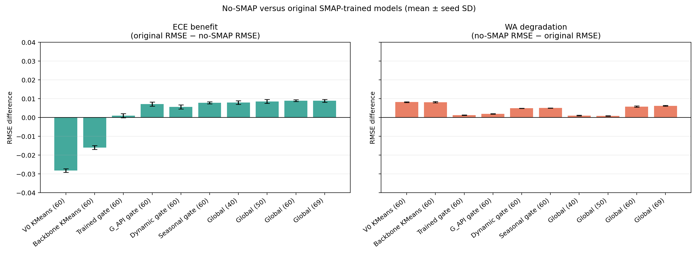

## No-SMAP invariance

Seed-42 predictions were checked after replacing all ECE SMAP columns with zero.

| model_id                            |   seed |   smap_columns_altered |   max_abs_prediction_difference |   changed_regime_labels |
|:------------------------------------|-------:|-----------------------:|--------------------------------:|------------------------:|
| Clustering_V0_Full_k2_no_smap_fs60  |     42 |                     85 |                  0.000000000000 |                       0 |
| Clustering_Backbone_k2_no_smap_fs60 |     42 |                     85 |                  0.000000000000 |                       0 |
| Trained_Gating_k2_no_smap_fs60      |     42 |                     85 |                  0.000000000000 |                       0 |
| Univariate_G_API_k2_no_smap_fs60    |     42 |                     85 |                  0.000000000000 |                       0 |
| Clustering_Dynamic_k2_no_smap_fs60  |     42 |                     85 |                  0.000000000000 |                       0 |
| Seasonal_Binary_k2_no_smap_fs60     |     42 |                     85 |                  0.000000000000 |                       0 |
| Global_Single_40_no_smap_fs40       |     42 |                     85 |                  0.000000000000 |                       0 |
| Global_Single_50_no_smap_fs50       |     42 |                     85 |                  0.000000000000 |                       0 |
| Global_Single_60_no_smap_fs60       |     42 |                     85 |                  0.000000000000 |                       0 |
| Global_Single_69_no_smap_fs69       |     42 |                     85 |                  0.000000000000 |                       0 |

## Global model version comparison

The following charts align station/date keys and average predictions over the common seeds `[42, 7, 13]`. Each chart has exactly seven lines: original `Global_Single_54`, 1.0 `Global_Single_54_no_smap`, 1.1 global models at 40/50/60/69 features, and ground truth. Every ECE line chart uses the same fixed y-axis of 0.00 to 0.25 soil-moisture units.

{
  "ece_dates_per_station": 30,
  "ece_rows": 150,
  "ece_stations": [
    "ECE_BBG_Lost_Meadow",
    "ECE_BBG_Main_St",
    "ECE_Renton_Garden_North",
    "ECE_Renton_Garden_Shed",
    "ECE_Renton_Home"
  ],
  "missing": [],
  "original_paths": [
    "/scratch/group/p.cis250607.000/MDR-Project/notebooks/experiment/derived_8.4-formal-eval-2.1-ece-v3/predictions_spatial/Global_Single_54__s42__ece_preds.npy",
    "/scratch/group/p.cis250607.000/MDR-Project/notebooks/experiment/derived_8.4-formal-eval-2.1-ece-v3/predictions_spatial/Global_Single_54__s7__ece_preds.npy",
    "/scratch/group/p.cis250607.000/MDR-Project/notebooks/experiment/derived_8.4-formal-eval-2.1-ece-v3/predictions_spatial/Global_Single_54__s13__ece_preds.npy"
  ],
  "ready": true,
  "salvage_1_0_paths": [
    "/scratch/group/p.cis250607.000/MDR-Project/notebooks/experiment/derived_8.4-ece-model-salvage-1.0/artifacts/predictions/Global_Single_54_no_smap__s42.csv",
    "/scratch/group/p.cis250607.000/MDR-Project/notebooks/experiment/derived_8.4-ece-model-salvage-1.0/artifacts/predictions/Global_Single_54_no_smap__s7.csv",
    "/scratch/group/p.cis250607.000/MDR-Project/notebooks/experiment/derived_8.4-ece-model-salvage-1.0/artifacts/predictions/Global_Single_54_no_smap__s13.csv"
  ],
  "salvage_1_1_paths": {
    "40": [
      "/scratch/group/p.cis250607.000/MDR-Project/notebooks/experiment/derived_8.4-ece-model-salvage-1.1/artifacts/predictions/Global_Single_40_no_smap_fs40__s42.csv",
      "/scratch/group/p.cis250607.000/MDR-Project/notebooks/experiment/derived_8.4-ece-model-salvage-1.1/artifacts/predictions/Global_Single_40_no_smap_fs40__s7.csv",
      "/scratch/group/p.cis250607.000/MDR-Project/notebooks/experiment/derived_8.4-ece-model-salvage-1.1/artifacts/predictions/Global_Single_40_no_smap_fs40__s13.csv"
    ],
    "50": [
      "/scratch/group/p.cis250607.000/MDR-Project/notebooks/experiment/derived_8.4-ece-model-salvage-1.1/artifacts/predictions/Global_Single_50_no_smap_fs50__s42.csv",
      "/scratch/group/p.cis250607.000/MDR-Project/notebooks/experiment/derived_8.4-ece-model-salvage-1.1/artifacts/predictions/Global_Single_50_no_smap_fs50__s7.csv",
      "/scratch/group/p.cis250607.000/MDR-Project/notebooks/experiment/derived_8.4-ece-model-salvage-1.1/artifacts/predictions/Global_Single_50_no_smap_fs50__s13.csv"
    ],
    "60": [
      "/scratch/group/p.cis250607.000/MDR-Project/notebooks/experiment/derived_8.4-ece-model-salvage-1.1/artifacts/predictions/Global_Single_60_no_smap_fs60__s42.csv",
      "/scratch/group/p.cis250607.000/MDR-Project/notebooks/experiment/derived_8.4-ece-model-salvage-1.1/artifacts/predictions/Global_Single_60_no_smap_fs60__s7.csv",
      "/scratch/group/p.cis250607.000/MDR-Project/notebooks/experiment/derived_8.4-ece-model-salvage-1.1/artifacts/predictions/Global_Single_60_no_smap_fs60__s13.csv"
    ],
    "69": [
      "/scratch/group/p.cis250607.000/MDR-Project/notebooks/experiment/derived_8.4-ece-model-salvage-1.1/artifacts/predictions/Global_Single_69_no_smap_fs69__s42.csv",
      "/scratch/group/p.cis250607.000/MDR-Project/notebooks/experiment/derived_8.4-ece-model-salvage-1.1/artifacts/predictions/Global_Single_69_no_smap_fs69__s7.csv",
      "/scratch/group/p.cis250607.000/MDR-Project/notebooks/experiment/derived_8.4-ece-model-salvage-1.1/artifacts/predictions/Global_Single_69_no_smap_fs69__s13.csv"
    ]
  },
  "seeds": [
    42,
    7,
    13
  ]
}

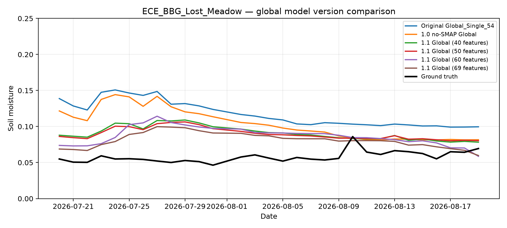

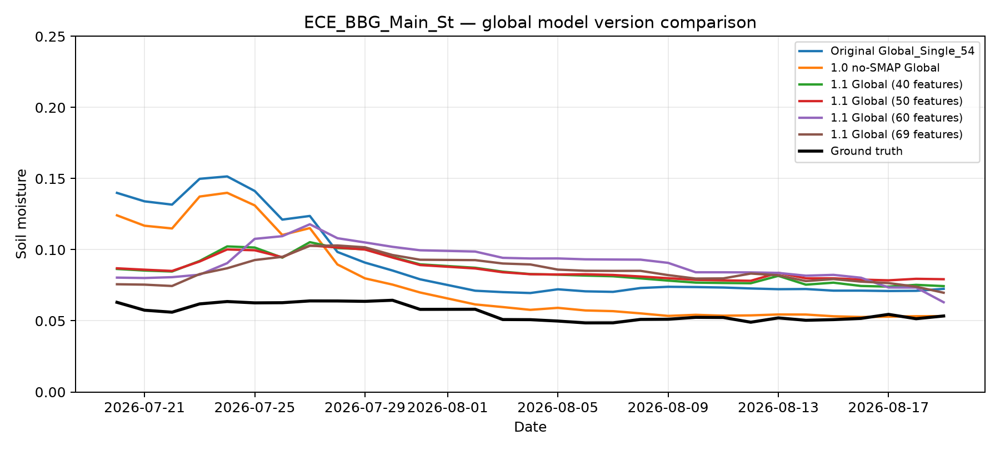

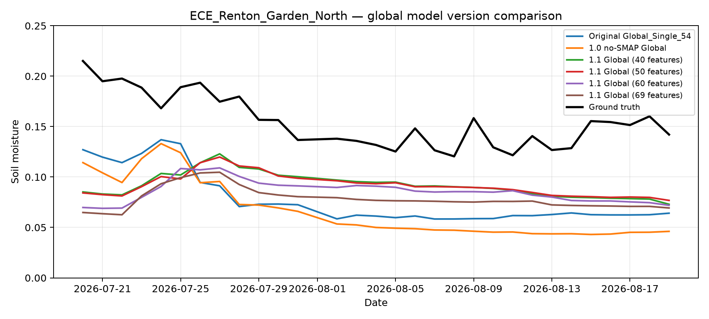

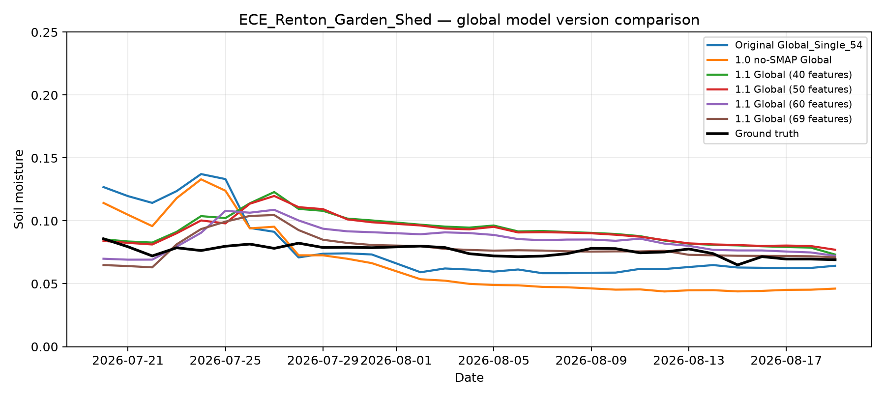

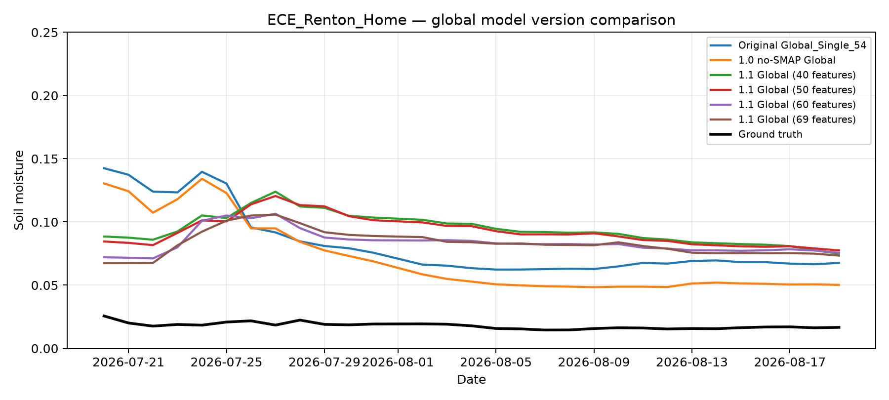

## Figures

All generated paths below use the notebook-relative `figures/<filename>` form. Trend charts contain no more than five lines and use the common fixed y-axis of 0.00 to 0.25 soil-moisture units.

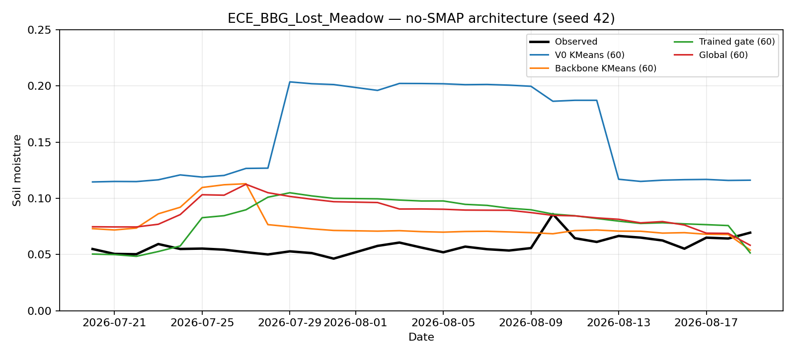

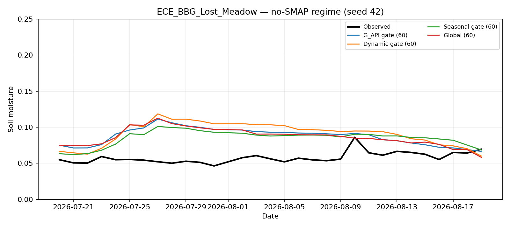

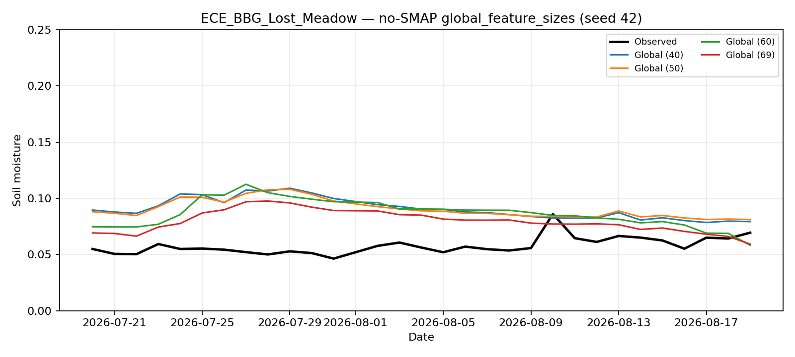

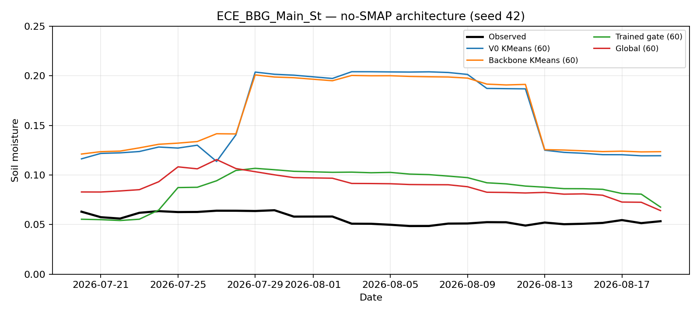

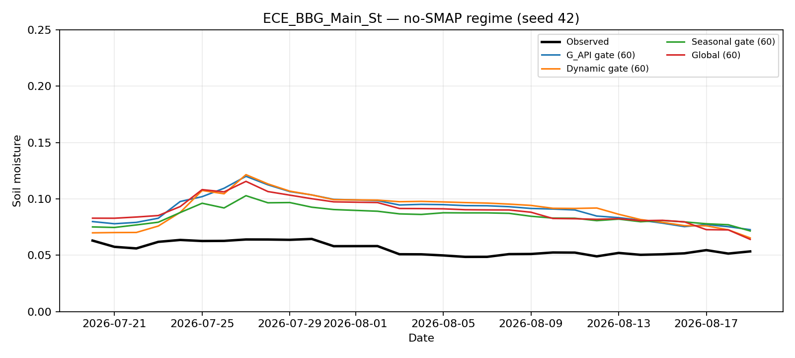

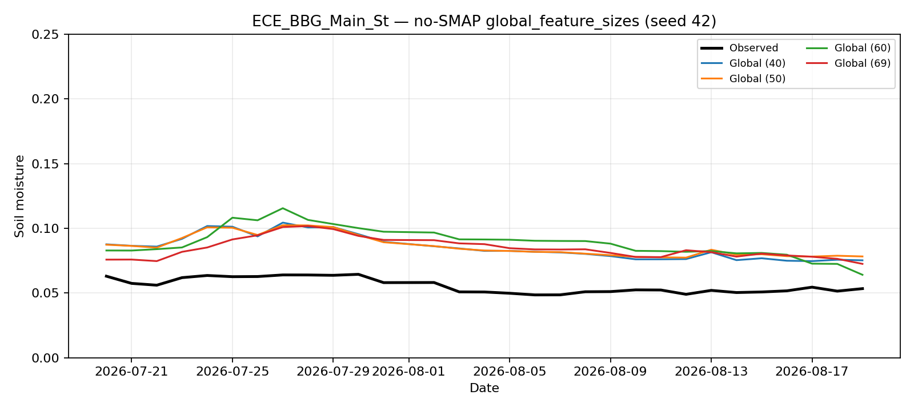

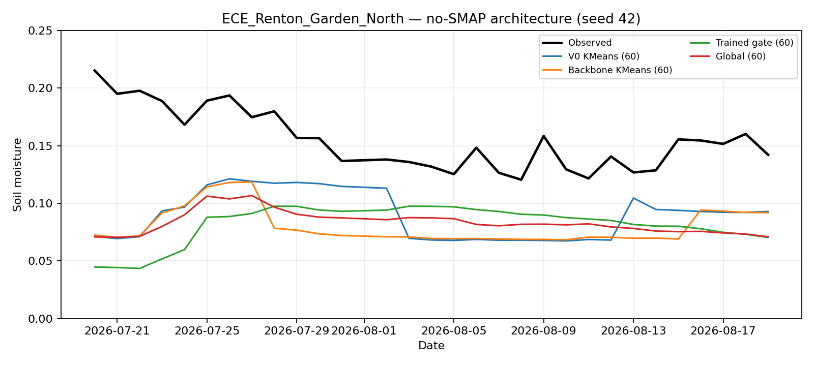

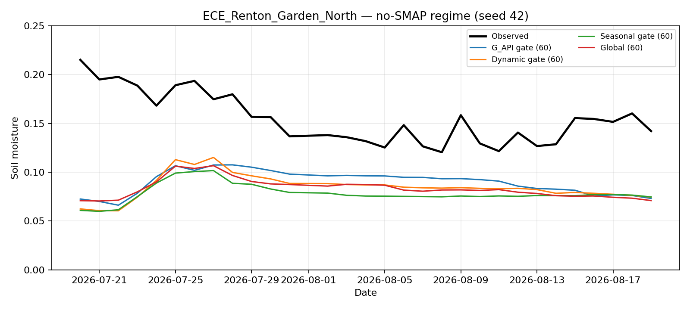

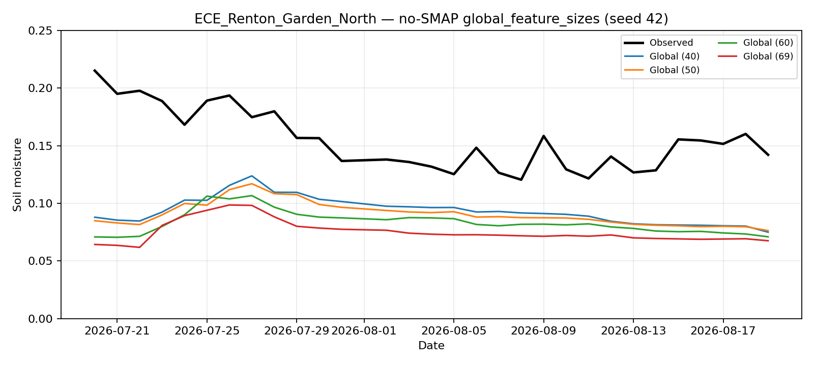

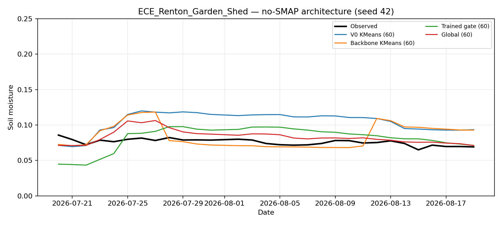

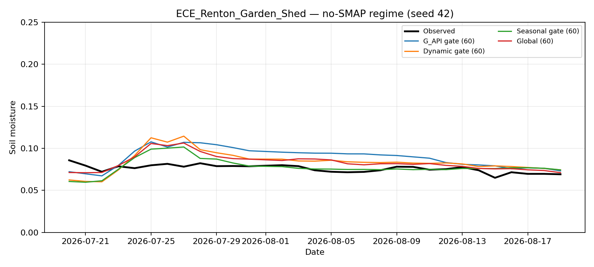

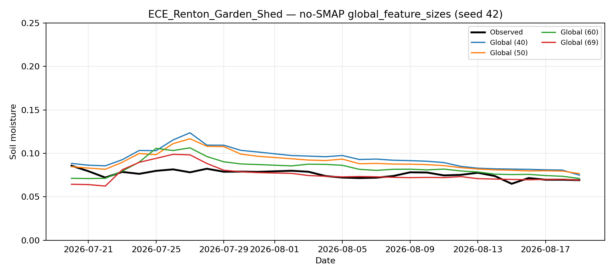

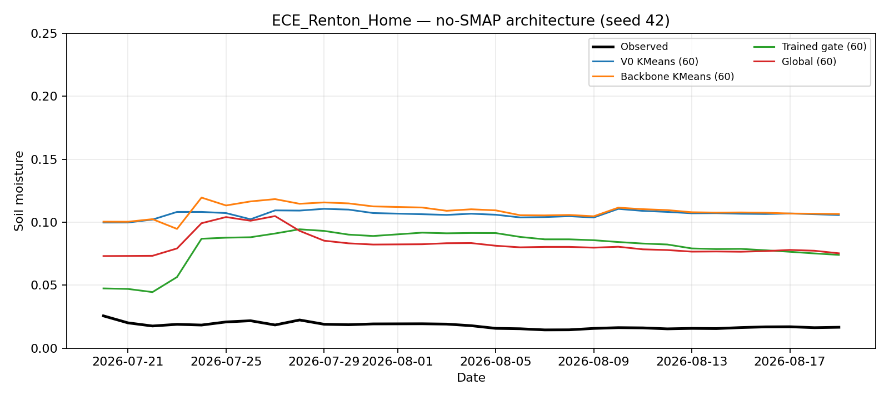

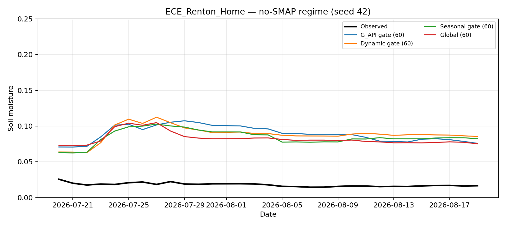

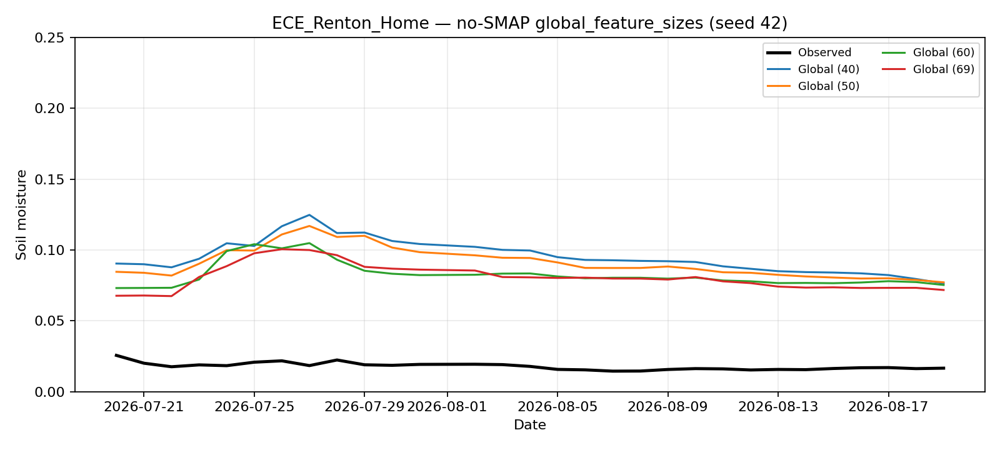

## Reproduction

```bash
cd notebooks/experiment/derived_8.4-ece-model-salvage-1.1
uv run --no-sync python run_feature_selection.py --stage all
uv run --no-sync python run_model_salvage.py
uv run --no-sync python build_notebook.py
nb execute derived_8.4-ece-model-salvage-1.1.ipynb --uv --timeout 1800
uv run --no-sync python update_readme.py
```

The Slurm workflow separates feature selection and model/report execution on `gpu_debug`, with the second stage dependent on successful selection.
