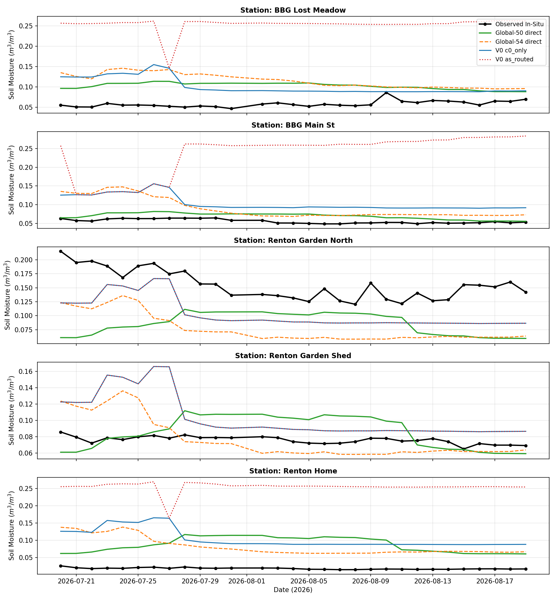

# Experiment: `derived_8.4-ece-router-salvage-1.1`

Router-only salvage for `Clustering_V0_Full_k2` and `Clustering_Backbone54_k2`
(`c0_0_c1_0`, 54 backbone features, no deltas) on the canonical
`derived_8.4_ece_v3` split, plus single-regime global baselines
(`Global_Single_54` on 54 backbone features, `Global_Single_50` on 50 V0
features, `policy=direct`). Experts and baselines are frozen (fit on WA
`trainval` only); routing policies are inference-time label overrides.
ECE targets are used for evaluation only; the margin threshold comes from
WA `trainval` only and falls back to the `Global_Single_54` expert.

WA margin thresholds: `{'v0': 1.9559823212899237, 'backbone': 1.5480887296641908}`.

## Datasets

Two versioned splits (see `config.yaml:9-11`):

1. Training — `data/splits/derived_8.4` (7 WA reference stations).
   `train.csv` + `val.csv` concatenated as `trainval` (14,608 rows,
   2017–2022). Routers, experts, AND baselines fit here only.
   The WA `test.csv` (2023–2025) is NOT used.
2. ECE eval — `data/splits/derived_8.4_ece_v3`, `test.csv` only
   (150 rows: 5 stations x 30 days, 2026-07-20–08-19; `train.csv` /
   `val.csv` are empty). 30-day warmup scaffold (Jun 20–Jul 19), strict
   native-NaN SMAP (82 value cols NaN, 3 masks 0, zero `0.0`s), MODIS
   NDVI 16-day fallback. Evaluation only — never used for fitting.

Every reported number is (2 families x 7 policies + 2 baselines) x 5 seeds
on the single `v3` input. `rmse_change_vs_as_routed` is NaN for baselines
(no `as_routed` exists) — compare them directly by `rmse_mean`.

## Routing policies

All regime policies reuse the SAME frozen experts; only the per-row expert
assignment changes. C0 is the dry specialist, C1 the wet-mountain specialist.

1. `as_routed` (baseline, no fix): the family's own static KMeans router.
2. `c0_only` (force dry): every v3 row goes to the dry expert.
3. `c1_only` (force wet, diagnostic): every row goes to the wet expert.
4. `gapi_transplant`: labels from the `G_API` router, predictions from
   the family's frozen experts.
5. `dynamic_transplant`: labels from the dynamic 3-feature KMeans router,
   predictions from the family's frozen experts.
6. `seasonal`: calendar router (May–Oct dry); the v3 window is all dry.
7. `margin_fallback`: confident rows keep the static decision, ambiguous
   rows (margin below WA 5th percentile) fall back to `Global_Single_54`.
8. `direct` (baselines only): single-regime prediction, no routing.

## Pooled summary (mean over seeds)

| family                   | ece_input   | policy             |   rmse_mean |    rmse_std |   mae_mean |   bias_mean |   ubrmse_mean |    r2_mean |   pearson_mean |   rmse_change_vs_as_routed |
|:-------------------------|:------------|:-------------------|------------:|------------:|-----------:|------------:|--------------:|-----------:|---------------:|---------------------------:|
| Clustering_V0_Full_k2    | v3          | as_routed          |   0.164867  | 0.00189575  |  0.138543  |   0.11808   |     0.11505   | -11.2804   |     -0.666047  |                  0         |
| Clustering_V0_Full_k2    | v3          | c0_only            |   0.0592863 | 0.000881522 |  0.051448  |   0.0309832 |     0.0505146 |  -0.588128 |      0.107078  |                 -0.105581  |
| Clustering_V0_Full_k2    | v3          | c1_only            |   0.191068  | 0.00269259  |  0.184136  |   0.184136  |     0.0509924 | -15.4947   |     -0.481025  |                  0.0262011 |
| Clustering_V0_Full_k2    | v3          | gapi_transplant    |   0.0592863 | 0.000881522 |  0.051448  |   0.0309832 |     0.0505146 |  -0.588128 |      0.107078  |                 -0.105581  |
| Clustering_V0_Full_k2    | v3          | dynamic_transplant |   0.0592863 | 0.000881522 |  0.051448  |   0.0309832 |     0.0505146 |  -0.588128 |      0.107078  |                 -0.105581  |
| Clustering_V0_Full_k2    | v3          | seasonal           |   0.0592863 | 0.000881522 |  0.051448  |   0.0309832 |     0.0505146 |  -0.588128 |      0.107078  |                 -0.105581  |
| Clustering_V0_Full_k2    | v3          | margin_fallback    |   0.0585219 | 0.000727693 |  0.0504859 |   0.0158456 |     0.0563049 |  -0.54736  |     -0.0595575 |                 -0.106345  |
| Clustering_Backbone54_k2 | v3          | as_routed          |   0.166341  | 0.00216953  |  0.146644  |   0.141742  |     0.0870517 | -11.5014   |     -0.133896  |                  0         |
| Clustering_Backbone54_k2 | v3          | c0_only            |   0.0592863 | 0.000881522 |  0.051448  |   0.0309832 |     0.0505146 |  -0.588128 |      0.107078  |                 -0.107055  |
| Clustering_Backbone54_k2 | v3          | c1_only            |   0.191068  | 0.00269259  |  0.184136  |   0.184136  |     0.0509924 | -15.4947   |     -0.481025  |                  0.0247271 |
| Clustering_Backbone54_k2 | v3          | gapi_transplant    |   0.0592863 | 0.000881522 |  0.051448  |   0.0309832 |     0.0505146 |  -0.588128 |      0.107078  |                 -0.107055  |
| Clustering_Backbone54_k2 | v3          | dynamic_transplant |   0.0592863 | 0.000881522 |  0.051448  |   0.0309832 |     0.0505146 |  -0.588128 |      0.107078  |                 -0.107055  |
| Clustering_Backbone54_k2 | v3          | seasonal           |   0.0592863 | 0.000881522 |  0.051448  |   0.0309832 |     0.0505146 |  -0.588128 |      0.107078  |                 -0.107055  |
| Clustering_Backbone54_k2 | v3          | margin_fallback    |   0.0585219 | 0.000727693 |  0.0504859 |   0.0158456 |     0.0563049 |  -0.54736  |     -0.0595575 |                 -0.107819  |
| Global_Single_54         | v3          | direct             |   0.0585219 | 0.000727693 |  0.0504859 |   0.0158456 |     0.0563049 |  -0.54736  |     -0.0595575 |                nan         |
| Global_Single_50         | v3          | direct             |   0.0533278 | 0.000487649 |  0.0427907 |   0.013452  |     0.051601  |  -0.284806 |     -0.0411139 |                nan         |

## Station RMSE (mean over seeds)

|                                                          |   ECE_BBG_Lost_Meadow |   ECE_BBG_Main_St |   ECE_Renton_Garden_North |   ECE_Renton_Garden_Shed |   ECE_Renton_Home |
|:---------------------------------------------------------|----------------------:|------------------:|--------------------------:|-------------------------:|------------------:|
| ('Clustering_V0_Full_k2', 'v3', 'as_routed')             |              0.197011 |          0.190052 |                  0.054649 |                 0.037124 |          0.237909 |
| ('Clustering_V0_Full_k2', 'v3', 'c0_only')               |              0.049764 |          0.050970 |                  0.054649 |                 0.037124 |          0.090141 |
| ('Clustering_V0_Full_k2', 'v3', 'c1_only')               |              0.199937 |          0.209479 |                  0.099716 |                 0.175402 |          0.240761 |
| ('Clustering_V0_Full_k2', 'v3', 'gapi_transplant')       |              0.049764 |          0.050970 |                  0.054649 |                 0.037124 |          0.090141 |
| ('Clustering_V0_Full_k2', 'v3', 'dynamic_transplant')    |              0.049764 |          0.050970 |                  0.054649 |                 0.037124 |          0.090141 |
| ('Clustering_V0_Full_k2', 'v3', 'seasonal')              |              0.049764 |          0.050970 |                  0.054649 |                 0.037124 |          0.090141 |
| ('Clustering_V0_Full_k2', 'v3', 'margin_fallback')       |              0.061444 |          0.041718 |                  0.079484 |                 0.023461 |          0.068748 |
| ('Clustering_Backbone54_k2', 'v3', 'as_routed')          |              0.049764 |          0.209479 |                  0.098727 |                 0.155792 |          0.240761 |
| ('Clustering_Backbone54_k2', 'v3', 'c0_only')            |              0.049764 |          0.050970 |                  0.054649 |                 0.037124 |          0.090141 |
| ('Clustering_Backbone54_k2', 'v3', 'c1_only')            |              0.199937 |          0.209479 |                  0.099716 |                 0.175402 |          0.240761 |
| ('Clustering_Backbone54_k2', 'v3', 'gapi_transplant')    |              0.049764 |          0.050970 |                  0.054649 |                 0.037124 |          0.090141 |
| ('Clustering_Backbone54_k2', 'v3', 'dynamic_transplant') |              0.049764 |          0.050970 |                  0.054649 |                 0.037124 |          0.090141 |
| ('Clustering_Backbone54_k2', 'v3', 'seasonal')           |              0.049764 |          0.050970 |                  0.054649 |                 0.037124 |          0.090141 |
| ('Clustering_Backbone54_k2', 'v3', 'margin_fallback')    |              0.061444 |          0.041718 |                  0.079484 |                 0.023461 |          0.068748 |
| ('Global_Single_54', 'v3', 'direct')                     |              0.061444 |          0.041718 |                  0.079484 |                 0.023461 |          0.068748 |
| ('Global_Single_50', 'v3', 'direct')                     |              0.046240 |          0.015271 |                  0.078798 |                 0.020977 |          0.072071 |

## Per-station prediction line charts

Seed-mean observed vs predicted trajectories (`predictions_v3.csv`).
Every panel shows at most 5 lines. Family panels pair each regime model
with its most relevant baseline (V0 with Global-50, Backbone with
Global-54, the `margin_fallback` target).



Per-station family panels:

- V0: `timeseries_v3_<STATION>_v0.png` (observed, V0 as_routed / c0_only /
  margin_fallback, Global-50 direct)
- Backbone: `timeseries_v3_<STATION>_backbone.png` (observed, Backbone
  as_routed / c0_only / margin_fallback, Global-54 direct)

with `<STATION>` in `ECE_BBG_Lost_Meadow`, `ECE_BBG_Main_St`,
`ECE_Renton_Garden_North`, `ECE_Renton_Garden_Shed`, `ECE_Renton_Home`.

## Reproduction

From `notebooks/`, run:

```powershell
nb execute experiment/derived_8.4-ece-router-salvage-1.1/derived_8.4-ece-router-salvage-1.1.ipynb --uv --timeout 3600
```

Or run the tracked script directly (same code the notebook imports):

```powershell
uv run --project . python notebooks/experiment/derived_8.4-ece-router-salvage-1.1/run_salvage.py
```

Tables above are transcribed from the executed notebook stdout / CSVs.
Versioned outputs are `summary.csv`, `seed_metrics.csv`,
`station_metrics.csv`, `predictions_v3.csv`, `routing_audit.json`,
and `figures/timeseries_v3_*.png` (11 line charts).
