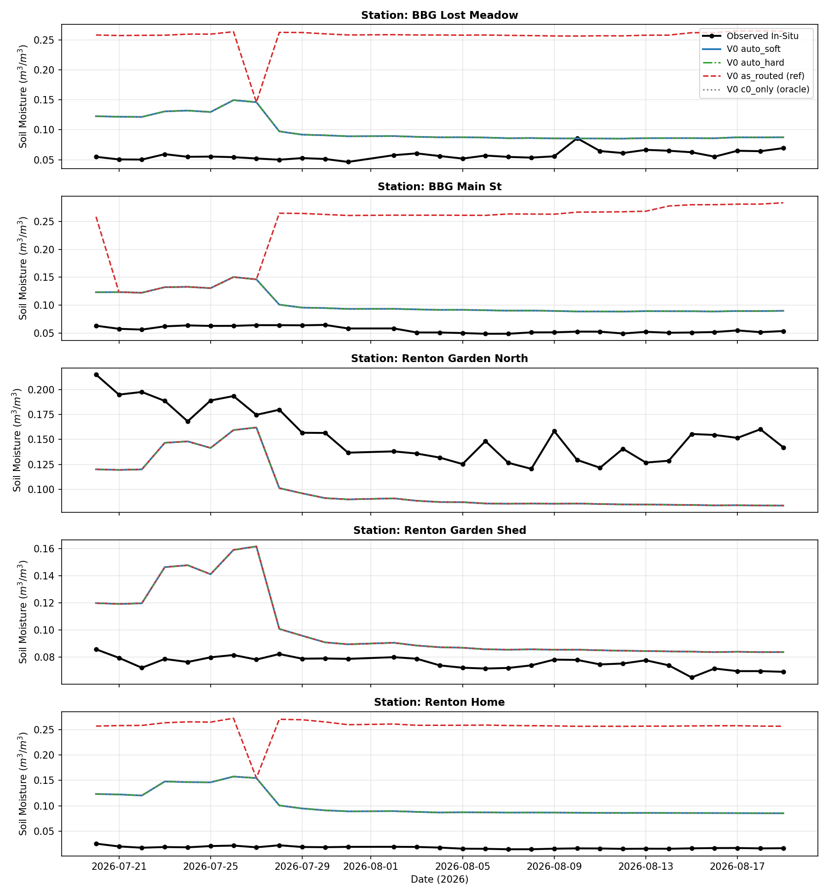

# Experiment: `derived_8.4-ece-router-salvage-2.0`

Automatic missingness-aware MoE routing bandaid for
`Clustering_V0_Full_k2` and `Clustering_Backbone54_k2`
(`c0_0_c1_0`, 54 backbone features, no deltas) on the canonical
`derived_8.4_ece_v3` split. No target is used at deploy time and no
prediction ever leaves the MoE: every row is a convex combo
`w0*E0 + w1*E1` of the SAME two frozen regime experts (hard routing
is the special case `w in {0, 1}`). `c0_only` is a MANUAL oracle
ceiling (`deployable=false`), kept only to quantify the remaining gap.

WA margin p5 thresholds: `{'v0': 1.9559823212899237, 'backbone': 1.5480887296641908}`.
WA margin medians: `{'v0': 3.576934535557384, 'backbone': 3.6499401378874268}`.
WA-tuned temperatures: `{'v0': 0.25, 'backbone': 0.25}` (grid-selected on WA
val only; ECE never touched).
Availability gate: full-SMAP-block-missing OR miss rate > `0.1`.

## Datasets

Two versioned splits (see `config.yaml`):

1. Training — `data/splits/derived_8.4` (7 WA reference stations).
   `train.csv` + `val.csv` concatenated as `trainval` (14,608 rows,
   2017–2022). Routers and experts fit here only. WA `train`/`val` are
   additionally used as a fit/score split for the WA-only temperature
   and gate calibration. The WA `test.csv` (2023–2025) is NOT used.
2. ECE eval — `data/splits/derived_8.4_ece_v3`, `test.csv` only
   (150 rows: 5 stations x 30 days, 2026-07-20–08-19; `train.csv` /
   `val.csv` are empty). 30-day warmup scaffold (Jun 20–Jul 19), strict
   native-NaN SMAP (82 value cols NaN, 3 masks 0, zero `0.0`s), MODIS
   NDVI 16-day fallback. Evaluation only — never used for fitting,
   thresholds, temperature, or gating decisions.

Every reported number is (2 families x 7 policies) x 5 seeds
on the single `v3` input. `deployable=false` marks the manual oracle.

## Routing policies (all reuse the SAME frozen experts)

C0 is the dry specialist, C1 the wet-mountain specialist.

1. `as_routed` (deployable reference, no fix): static KMeans hard label.
2. `soft_static` (deployable): always softmax-blend static KMeans
   distances with the WA-tuned temperature.
3. `auto_hard` (deployable bandaid): availability gate -> SMAP-free
   `G_API` auxiliary hard label; else static hard.
4. `auto_soft` (deployable bandaid): gate -> `G_API`-anchored softmax
   blend (aux label at distance 0, WA median margin for the other
   regime, same WA temperature); ungated but margin-ambiguous rows ->
   static softmax blend; else static hard.
5. `auto_soft_T2` (deployable diagnostic sensitivity, not WA-selected):
   same as `auto_soft` at the grid-max temperature (T=2.0). The
   WA-selected T=0.25 leaves the blend near-hard, so this row exercises
   the genuinely-soft path and shows what blending costs when the
   window is one-sided.
6. `auto_equal` (deployable comparison): gated or margin-ambiguous rows
   -> 0.5/0.5 blend of frozen experts; else static hard.
7. `c0_only` (MANUAL oracle, `deployable=false`): every row to dry
   expert. Ceiling reference only — not a deployable claim.

Gate-justification scope: the WA synthetic-SMAP-masking study supports
the gate for `Clustering_Backbone54_k2` (masked-val aux 0.0740 < static
0.0869) but is neutral for `Clustering_V0_Full_k2` (aux 0.0728 vs
static-masked 0.0681) — the V0 gate application extrapolates beyond its
own WA evidence. The gate decision itself uses inputs only (no target).
Routers are fixed at seed 42 by design (as in 1.1 / formal-eval, whose
delta additions are tied to seed-42 cluster labels); the 5-seed std
measures expert-fit variance only.

## WA-only calibration (no ECE target used)

Temperature grid-selected on WA val (calibration experts fit on WA
train only); gate regime verified with synthetic full-SMAP masking on
WA val (input masking only).

| family                   | setting         | policy             |      rmse |
|:-------------------------|:----------------|:-------------------|----------:|
| Clustering_V0_Full_k2    | clean_val       | soft_static_T0.25  | 0.0542408 |
| Clustering_V0_Full_k2    | clean_val       | soft_static_T0.5   | 0.0542857 |
| Clustering_V0_Full_k2    | clean_val       | soft_static_T1     | 0.0547938 |
| Clustering_V0_Full_k2    | clean_val       | soft_static_T2     | 0.0572751 |
| Clustering_V0_Full_k2    | smap_masked_val | static_hard_masked | 0.0680819 |
| Clustering_V0_Full_k2    | smap_masked_val | aux_hard_masked    | 0.0727572 |
| Clustering_V0_Full_k2    | clean_val       | static_hard_clean  | 0.0542406 |
| Clustering_V0_Full_k2    | clean_val       | aux_hard_clean     | 0.0737355 |
| Clustering_Backbone54_k2 | clean_val       | soft_static_T0.25  | 0.0542429 |
| Clustering_Backbone54_k2 | clean_val       | soft_static_T0.5   | 0.0543018 |
| Clustering_Backbone54_k2 | clean_val       | soft_static_T1     | 0.0549917 |
| Clustering_Backbone54_k2 | clean_val       | soft_static_T2     | 0.0573896 |
| Clustering_Backbone54_k2 | smap_masked_val | static_hard_masked | 0.0868705 |
| Clustering_Backbone54_k2 | smap_masked_val | aux_hard_masked    | 0.0739652 |
| Clustering_Backbone54_k2 | clean_val       | static_hard_clean  | 0.0542406 |
| Clustering_Backbone54_k2 | clean_val       | aux_hard_clean     | 0.0737355 |

## Pooled summary (mean over seeds)

| family                   | ece_input   | policy       | deployable   |   rmse_mean |    rmse_std |   mae_mean |   bias_mean |   ubrmse_mean |    r2_mean |   pearson_mean |   rmse_change_vs_as_routed |   rmse_gap_vs_oracle_c0 |
|:-------------------------|:------------|:-------------|:-------------|------------:|------------:|-----------:|------------:|--------------:|-----------:|---------------:|---------------------------:|------------------------:|
| Clustering_V0_Full_k2    | v3          | as_routed    | True         |   0.165908  | 0.00305071  |  0.139226  |   0.117727  |     0.116899  | -11.438    |     -0.669629  |                  0         |             0.10814     |
| Clustering_V0_Full_k2    | v3          | soft_static  | True         |   0.141739  | 0.00259468  |  0.123158  |   0.115581  |     0.0820383 |  -8.07809  |     -0.685431  |                 -0.024169  |             0.0839707   |
| Clustering_V0_Full_k2    | v3          | auto_hard    | True         |   0.0577681 | 0.000617298 |  0.0501669 |   0.0286544 |     0.0501576 |  -0.507705 |      0.103776  |                 -0.10814   |             0           |
| Clustering_V0_Full_k2    | v3          | auto_soft    | True         |   0.0577681 | 0.000617299 |  0.050167  |   0.0286545 |     0.0501576 |  -0.507707 |      0.103776  |                 -0.10814   |             4.49022e-08 |
| Clustering_V0_Full_k2    | v3          | auto_soft_T2 | True         |   0.0712125 | 0.000938661 |  0.0639953 |   0.0511458 |     0.0495479 |  -1.29125  |      0.077721  |                 -0.0946953 |             0.0134444   |
| Clustering_V0_Full_k2    | v3          | auto_equal   | True         |   0.117866  | 0.00212523  |  0.108001  |   0.107152  |     0.0490928 |  -5.27756  |     -0.0507691 |                 -0.0480418 |             0.0600979   |
| Clustering_V0_Full_k2    | v3          | c0_only      | False        |   0.0577681 | 0.000617298 |  0.0501669 |   0.0286544 |     0.0501576 |  -0.507705 |      0.103776  |                 -0.10814   |             0           |
| Clustering_Backbone54_k2 | v3          | as_routed    | True         |   0.167431  | 0.00340137  |  0.147346  |   0.141932  |     0.0888158 | -11.6682   |     -0.138493  |                  0         |             0.109663    |
| Clustering_Backbone54_k2 | v3          | soft_static  | True         |   0.151698  | 0.00290881  |  0.131875  |   0.127755  |     0.081795  |  -9.3989   |     -0.350365  |                 -0.0157333 |             0.0939298   |
| Clustering_Backbone54_k2 | v3          | auto_hard    | True         |   0.0577681 | 0.000617298 |  0.0501669 |   0.0286544 |     0.0501576 |  -0.507705 |      0.103776  |                 -0.109663  |             0           |
| Clustering_Backbone54_k2 | v3          | auto_soft    | True         |   0.0577681 | 0.000617299 |  0.0501669 |   0.0286545 |     0.0501576 |  -0.507707 |      0.103776  |                 -0.109663  |             3.35308e-08 |
| Clustering_Backbone54_k2 | v3          | auto_soft_T2 | True         |   0.0707262 | 0.000926717 |  0.0635665 |   0.0504515 |     0.0495632 |  -1.26006  |      0.0786598 |                 -0.096705  |             0.0129581   |
| Clustering_Backbone54_k2 | v3          | auto_equal   | True         |   0.117866  | 0.00212523  |  0.108001  |   0.107152  |     0.0490928 |  -5.27756  |     -0.0507691 |                 -0.0495652 |             0.0600979   |
| Clustering_Backbone54_k2 | v3          | c0_only      | False        |   0.0577681 | 0.000617298 |  0.0501669 |   0.0286544 |     0.0501576 |  -0.507705 |      0.103776  |                 -0.109663  |             0           |

## Station RMSE (mean over seeds)

|                                                    |   ECE_BBG_Lost_Meadow |   ECE_BBG_Main_St |   ECE_Renton_Garden_North |   ECE_Renton_Garden_Shed |   ECE_Renton_Home |
|:---------------------------------------------------|----------------------:|------------------:|--------------------------:|-------------------------:|------------------:|
| ('Clustering_V0_Full_k2', 'v3', 'as_routed')       |              0.198791 |          0.190692 |                  0.056877 |                 0.034239 |          0.239447 |
| ('Clustering_V0_Full_k2', 'v3', 'soft_static')     |              0.168947 |          0.161328 |                  0.027573 |                 0.069069 |          0.200862 |
| ('Clustering_V0_Full_k2', 'v3', 'auto_hard')       |              0.047951 |          0.049039 |                  0.056877 |                 0.034239 |          0.087015 |
| ('Clustering_V0_Full_k2', 'v3', 'auto_soft')       |              0.047951 |          0.049039 |                  0.056877 |                 0.034239 |          0.087015 |
| ('Clustering_V0_Full_k2', 'v3', 'auto_soft_T2')    |              0.067849 |          0.071043 |                  0.036798 |                 0.050789 |          0.108485 |
| ('Clustering_V0_Full_k2', 'v3', 'auto_equal')      |              0.122413 |          0.128514 |                  0.029596 |                 0.101451 |          0.163678 |
| ('Clustering_V0_Full_k2', 'v3', 'c0_only')         |              0.047951 |          0.049039 |                  0.056877 |                 0.034239 |          0.087015 |
| ('Clustering_Backbone54_k2', 'v3', 'as_routed')    |              0.047951 |          0.210548 |                  0.100945 |                 0.156601 |          0.242524 |
| ('Clustering_Backbone54_k2', 'v3', 'soft_static')  |              0.065053 |          0.203460 |                  0.053175 |                 0.117268 |          0.229894 |
| ('Clustering_Backbone54_k2', 'v3', 'auto_hard')    |              0.047951 |          0.049039 |                  0.056877 |                 0.034239 |          0.087015 |
| ('Clustering_Backbone54_k2', 'v3', 'auto_soft')    |              0.047951 |          0.049039 |                  0.056877 |                 0.034239 |          0.087015 |
| ('Clustering_Backbone54_k2', 'v3', 'auto_soft_T2') |              0.067204 |          0.070347 |                  0.037385 |                 0.050216 |          0.107813 |
| ('Clustering_Backbone54_k2', 'v3', 'auto_equal')   |              0.122413 |          0.128514 |                  0.029596 |                 0.101451 |          0.163678 |
| ('Clustering_Backbone54_k2', 'v3', 'c0_only')      |              0.047951 |          0.049039 |                  0.056877 |                 0.034239 |          0.087015 |

## Per-station prediction line charts

Seed-mean observed vs predicted trajectories (`predictions_v3.csv`).
Every panel shows at most 5 lines: observed + as_routed / auto_soft /
auto_hard + c0_only oracle ceiling.



Per-station family panels:

- V0: `timeseries_v3_<STATION>_v0.png`
- Backbone: `timeseries_v3_<STATION>_backbone.png`

with `<STATION>` in `ECE_BBG_Lost_Meadow`, `ECE_BBG_Main_St`,
`ECE_Renton_Garden_North`, `ECE_Renton_Garden_Shed`, `ECE_Renton_Home`.

## Reproduction

From `notebooks/` (the uv project lives here), run the notebook:

```powershell
nb execute experiment/derived_8.4-ece-router-salvage-2.0/derived_8.4-ece-router-salvage-2.0.ipynb --uv --timeout 3600
```

Or from the repo root, run the tracked script directly (same code the
notebook imports):

```powershell
uv run --project notebooks python notebooks/experiment/derived_8.4-ece-router-salvage-2.0/run_auto.py
```

Tables above are transcribed from the executed notebook stdout / CSVs.
Versioned outputs are `summary.csv`, `seed_metrics.csv`,
`station_metrics.csv`, `predictions_v3.csv`, `wa_calibration.csv`,
`routing_audit.json`, and `figures/timeseries_v3_*.png` (11 line charts).
