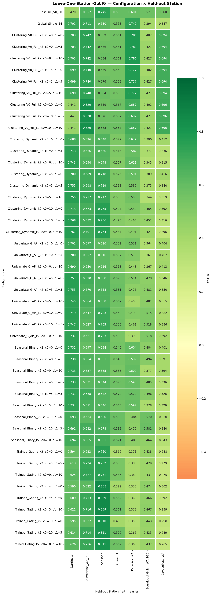
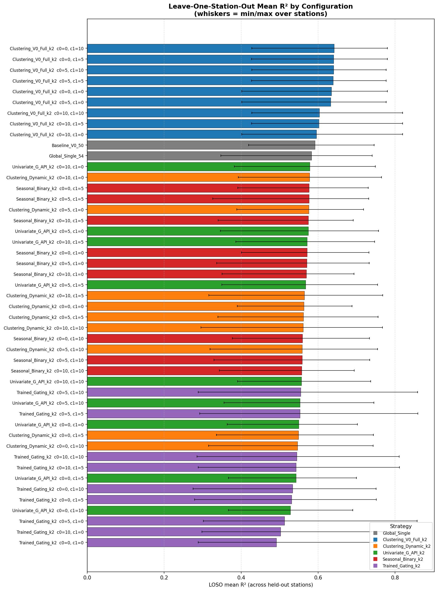
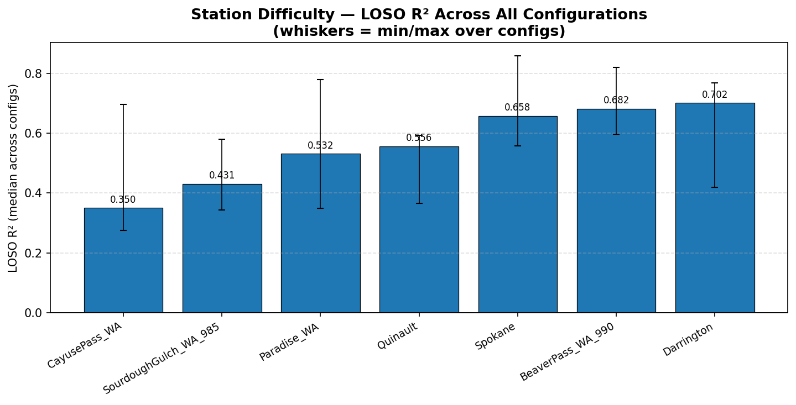
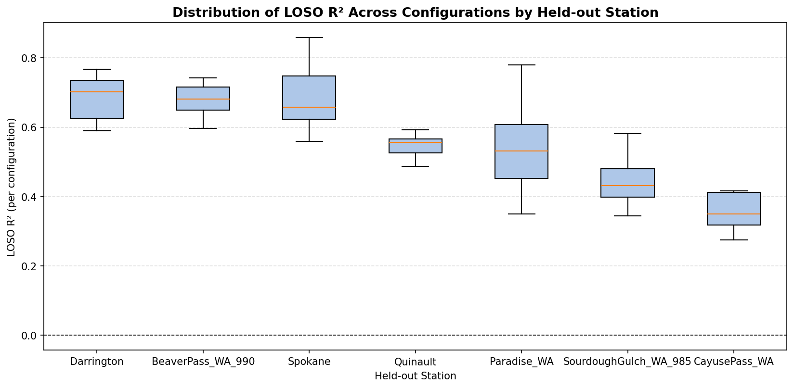
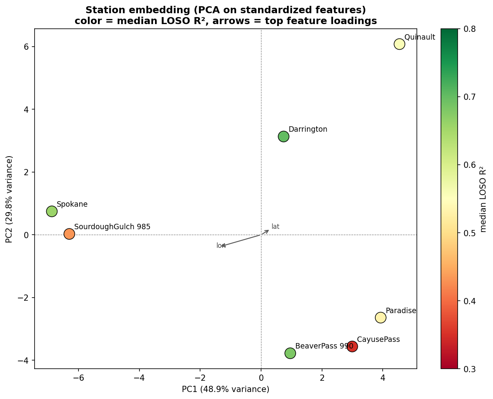
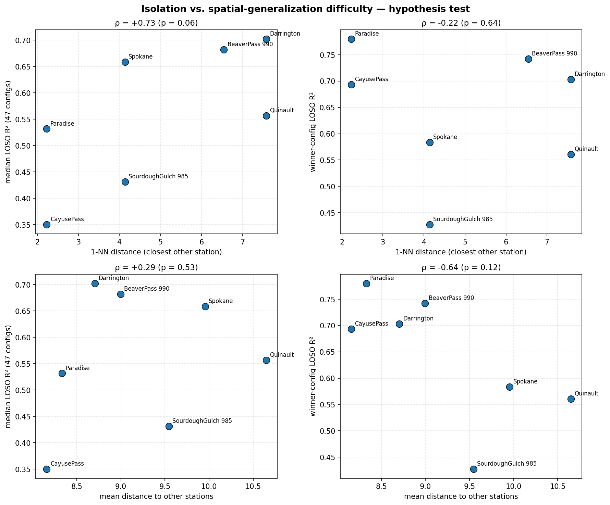
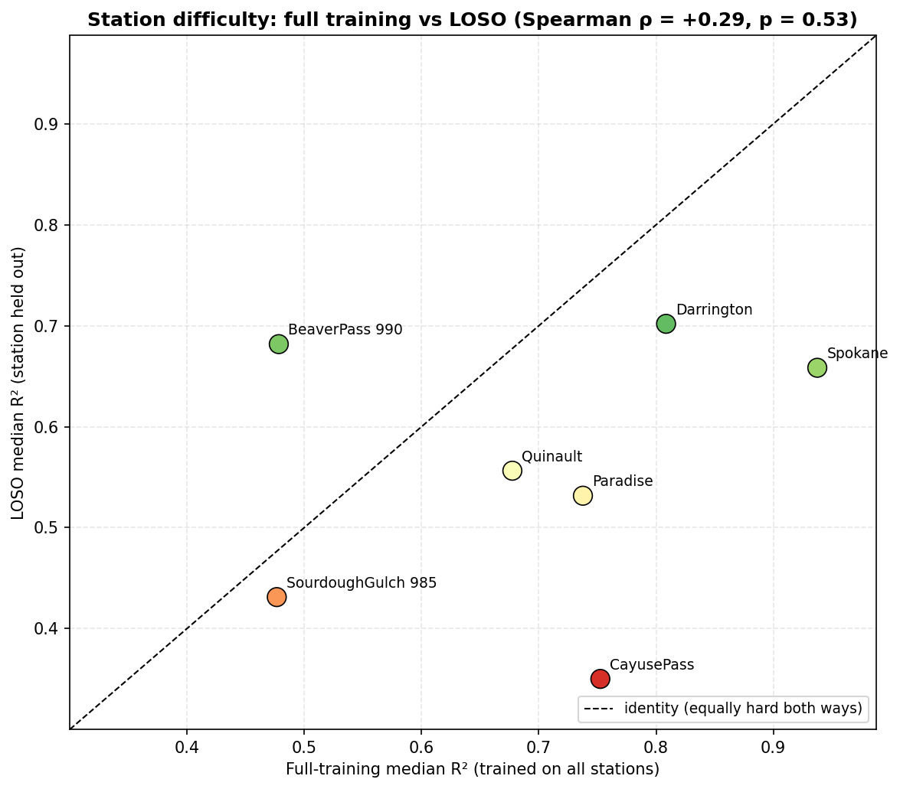
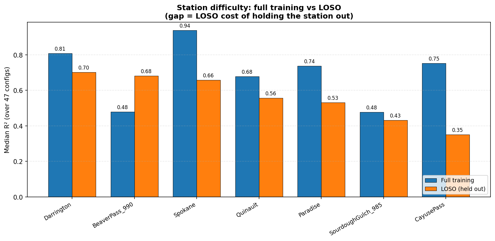
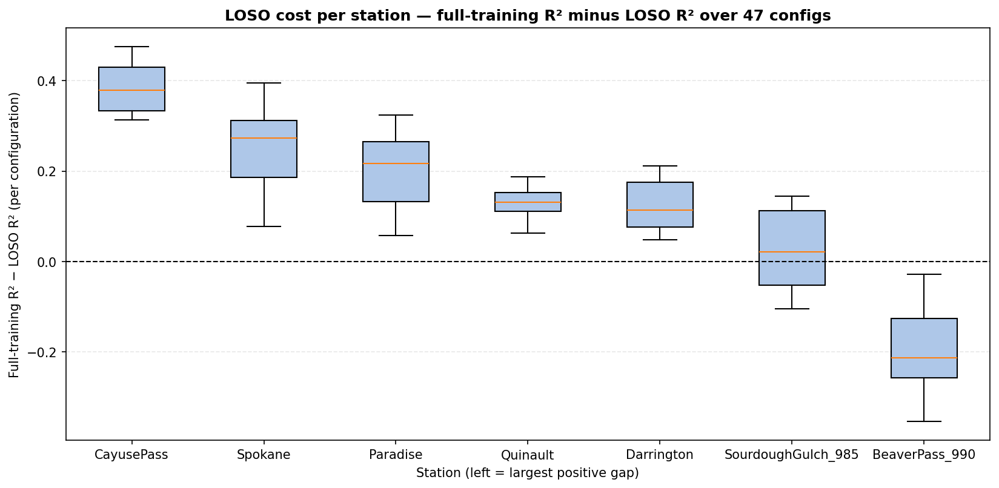

# Experiment: `derived_8.4-eval-1.2` — Leave-One-Station-Out (LOSO) Spatial Generalization

## Objective
Evaluate the **spatial generalization** of every model configuration from `derived_8.4-eval-1.1`
(2 baselines + 5 MoE routing strategies × 9 per-regime delta-grid points = **47 configurations**,
all sharing the same 54-feature backbone / V0-50 baseline / candidate pool / XGBoost
hyperparameters) under a **leave-one-station-out** (LOSO) protocol across the 7 Washington
stations of the `derived_8.4` split.

A per-configuration × per-station metric matrix is collected, so **station difficulty** is a
direct byproduct: aggregating LOSO $R^2$ over configurations reveals which stations are hardest
to generalize to.

In addition, the experiment **carries the full `derived_8.4-eval-1.1` evaluation as a baseline**
(LOSO is an addition, not a replacement): every configuration is also trained without LOSO on the
full trainval and evaluated per station on the test set, separating *intrinsic* station difficulty
(hard to fit even when trained on) from *generalization-limited* difficulty (see the
[Full-Training Baseline](#full-training-baseline--intrinsic-vs-generalization-difficulty) section).

## LOSO Protocol
For each of the 47 configurations and each held-out station $s$:

1. `fold_trainval` = trainval rows with `station_id != s` (train 2017–2020 + val 2021–2022, 6 stations).
2. `fold_test` = all test rows of station $s$ (2023–2025).
3. **Router refitted per fold** on `fold_trainval` only — the held-out station never influences
   routing (no leakage into the routing decision).
4. Experts trained per regime cluster on `fold_trainval` with the configuration's features
   (global + per-cluster delta additions), same hyperparameters as eval-1.1 (`device: cuda`, seed 42).
5. Metrics computed on `fold_test`: pooled / per-year / per-regime ($R^2$, RMSE, ubRMSE, bias, MAE, Pearson).

**Configurations are fixed from eval-1.1** — delta additions were selected using full test-set
knowledge, so LOSO measures generalization of model *fitting* given fixed features, not of
feature selection (see Caveats).

## Overall LOSO Leaderboard (mean R² over 7 held-out stations)

`loso_mean_r2` = average per-station $R^2$; `loso_pooled_r2` = sample-count-weighted $R^2$ over
the concatenated 6,620 held-out test samples (directly comparable to eval-1.1's pooled test $R^2$);
`eval11_test_r2` = the same configuration's temporal test $R^2$ from eval-1.1.

| config_label | strategy_name | loso_mean_r2 | loso_pooled_r2 | loso_min_r2 | loso_max_r2 | loso_mean_rmse | loso_mean_bias | eval11_test_r2 | loso_minus_test_r2 | is_winner |
|:---|:---|:---:|:---:|:---:|:---:|:---:|:---:|:---:|:---:|:---:|
| Clustering_V0_Full_k2  c0=0, c1=10 | Clustering_V0_Full_k2 | 0.6415 | 0.6885 | 0.4273 | 0.7799 | 0.0557 | 0.0156 | 0.8150 | -0.1734 | True |
| Clustering_V0_Full_k2  c0=0, c1=5 | Clustering_V0_Full_k2 | 0.6405 | 0.6873 | 0.4271 | 0.7799 | 0.0558 | 0.0153 | 0.8143 | -0.1738 | False |
| Clustering_V0_Full_k2  c0=5, c1=10 | Clustering_V0_Full_k2 | 0.6399 | 0.6873 | 0.4273 | 0.7769 | 0.0559 | 0.0157 | 0.8148 | -0.1748 | False |
| Clustering_V0_Full_k2  c0=5, c1=5 | Clustering_V0_Full_k2 | 0.6389 | 0.6861 | 0.4271 | 0.7769 | 0.0560 | 0.0153 | 0.8141 | -0.1752 | False |
| Clustering_V0_Full_k2  c0=0, c1=0 | Clustering_V0_Full_k2 | 0.6343 | 0.6821 | 0.4016 | 0.7799 | 0.0562 | 0.0154 | 0.8143 | -0.1800 | False |
| Clustering_V0_Full_k2  c0=5, c1=0 | Clustering_V0_Full_k2 | 0.6327 | 0.6809 | 0.4016 | 0.7769 | 0.0564 | 0.0154 | 0.8141 | -0.1814 | False |
| Clustering_V0_Full_k2  c0=10, c1=10 | Clustering_V0_Full_k2 | 0.6030 | 0.6481 | 0.4273 | 0.8196 | 0.0586 | 0.0177 | 0.7897 | -0.1867 | False |
| Clustering_V0_Full_k2  c0=10, c1=5 | Clustering_V0_Full_k2 | 0.6020 | 0.6468 | 0.4271 | 0.8196 | 0.0587 | 0.0173 | 0.7890 | -0.1871 | False |
| Clustering_V0_Full_k2  c0=10, c1=0 | Clustering_V0_Full_k2 | 0.5958 | 0.6416 | 0.4016 | 0.8196 | 0.0591 | 0.0174 | 0.7891 | -0.1933 | False |
| Baseline_V0_50 | Global_Single | 0.5916 | 0.6312 | 0.4196 | 0.7453 | 0.0602 | 0.0167 | 0.7604 | -0.1688 | False |
| Global_Single_54 | Global_Single | 0.5826 | 0.6070 | 0.3472 | 0.7403 | 0.0607 | 0.0226 | 0.7792 | -0.1966 | False |
| Univariate_G_API_k2  c0=10, c1=0 | Univariate_G_API_k2 | 0.5781 | 0.6023 | 0.3824 | 0.7488 | 0.0613 | 0.0218 | 0.7639 | -0.1857 | False |
| Clustering_Dynamic_k2  c0=10, c1=0 | Clustering_Dynamic_k2 | 0.5778 | 0.6097 | 0.3923 | 0.7645 | 0.0608 | 0.0220 | 0.7635 | -0.1856 | False |
| Seasonal_Binary_k2  c0=0, c1=5 | Seasonal_Binary_k2 | 0.5765 | 0.6015 | 0.3910 | 0.7304 | 0.0617 | 0.0210 | 0.7561 | -0.1796 | False |
| Seasonal_Binary_k2  c0=5, c1=5 | Seasonal_Binary_k2 | 0.5763 | 0.5920 | 0.3262 | 0.7312 | 0.0617 | 0.0216 | 0.7523 | -0.1760 | False |
| Clustering_Dynamic_k2  c0=5, c1=0 | Clustering_Dynamic_k2 | 0.5757 | 0.6109 | 0.3885 | 0.7179 | 0.0611 | 0.0212 | 0.7767 | -0.2011 | False |
| Seasonal_Binary_k2  c0=10, c1=5 | Seasonal_Binary_k2 | 0.5747 | 0.5871 | 0.3400 | 0.6911 | 0.0620 | 0.0224 | 0.7428 | -0.1681 | False |
| Univariate_G_API_k2  c0=5, c1=0 | Univariate_G_API_k2 | 0.5742 | 0.5917 | 0.3462 | 0.7570 | 0.0617 | 0.0228 | 0.7562 | -0.1819 | False |
| Univariate_G_API_k2  c0=10, c1=5 | Univariate_G_API_k2 | 0.5712 | 0.5963 | 0.3863 | 0.7466 | 0.0619 | 0.0222 | 0.7613 | -0.1901 | False |
| Seasonal_Binary_k2  c0=0, c1=0 | Seasonal_Binary_k2 | 0.5711 | 0.6014 | 0.4011 | 0.7322 | 0.0621 | 0.0211 | 0.7698 | -0.1987 | True |
| Seasonal_Binary_k2  c0=5, c1=0 | Seasonal_Binary_k2 | 0.5709 | 0.5919 | 0.3362 | 0.7331 | 0.0622 | 0.0217 | 0.7660 | -0.1951 | False |
| Seasonal_Binary_k2  c0=10, c1=0 | Seasonal_Binary_k2 | 0.5693 | 0.5870 | 0.3501 | 0.6929 | 0.0624 | 0.0225 | 0.7565 | -0.1872 | False |
| Univariate_G_API_k2  c0=5, c1=5 | Univariate_G_API_k2 | 0.5673 | 0.5857 | 0.3500 | 0.7548 | 0.0623 | 0.0232 | 0.7536 | -0.1863 | False |
| Clustering_Dynamic_k2  c0=10, c1=5 | Clustering_Dynamic_k2 | 0.5640 | 0.5892 | 0.3161 | 0.7678 | 0.0616 | 0.0218 | 0.7561 | -0.1922 | False |
| Clustering_Dynamic_k2  c0=0, c1=0 | Clustering_Dynamic_k2 | 0.5630 | 0.6005 | 0.3898 | 0.6883 | 0.0623 | 0.0219 | 0.7866 | -0.2237 | True |
| Clustering_Dynamic_k2  c0=5, c1=5 | Clustering_Dynamic_k2 | 0.5618 | 0.5905 | 0.3395 | 0.7555 | 0.0619 | 0.0209 | 0.7694 | -0.2076 | False |
| Clustering_Dynamic_k2  c0=10, c1=10 | Clustering_Dynamic_k2 | 0.5609 | 0.5858 | 0.2956 | 0.7670 | 0.0617 | 0.0232 | 0.7480 | -0.1870 | False |
| Seasonal_Binary_k2  c0=0, c1=10 | Seasonal_Binary_k2 | 0.5590 | 0.5931 | 0.3772 | 0.7332 | 0.0626 | 0.0203 | 0.7643 | -0.2053 | False |
| Clustering_Dynamic_k2  c0=5, c1=10 | Clustering_Dynamic_k2 | 0.5588 | 0.5871 | 0.3190 | 0.7547 | 0.0620 | 0.0223 | 0.7612 | -0.2024 | False |
| Seasonal_Binary_k2  c0=5, c1=10 | Seasonal_Binary_k2 | 0.5588 | 0.5836 | 0.3294 | 0.7341 | 0.0627 | 0.0209 | 0.7605 | -0.2017 | False |
| Seasonal_Binary_k2  c0=10, c1=10 | Seasonal_Binary_k2 | 0.5572 | 0.5788 | 0.3433 | 0.6939 | 0.0630 | 0.0217 | 0.7510 | -0.1938 | False |
| Univariate_G_API_k2  c0=10, c1=10 | Univariate_G_API_k2 | 0.5569 | 0.5837 | 0.3904 | 0.7366 | 0.0628 | 0.0233 | 0.7506 | -0.1937 | False |
| Trained_Gating_k2  c0=5, c1=10 | Trained_Gating_k2 | 0.5549 | 0.5746 | 0.2887 | 0.8587 | 0.0618 | 0.0192 | 0.7235 | -0.1686 | False |
| Univariate_G_API_k2  c0=5, c1=10 | Univariate_G_API_k2 | 0.5530 | 0.5731 | 0.3553 | 0.7448 | 0.0632 | 0.0242 | 0.7429 | -0.1899 | False |
| Trained_Gating_k2  c0=5, c1=5 | Trained_Gating_k2 | 0.5528 | 0.5732 | 0.2921 | 0.8593 | 0.0619 | 0.0191 | 0.7258 | -0.1730 | False |
| Univariate_G_API_k2  c0=0, c1=0 | Univariate_G_API_k2 | 0.5493 | 0.5819 | 0.3639 | 0.7019 | 0.0634 | 0.0215 | 0.7696 | -0.2203 | True |
| Clustering_Dynamic_k2  c0=0, c1=5 | Clustering_Dynamic_k2 | 0.5491 | 0.5801 | 0.3360 | 0.7435 | 0.0632 | 0.0216 | 0.7793 | -0.2302 | False |
| Clustering_Dynamic_k2  c0=0, c1=10 | Clustering_Dynamic_k2 | 0.5461 | 0.5767 | 0.3155 | 0.7427 | 0.0633 | 0.0230 | 0.7711 | -0.2250 | False |
| Trained_Gating_k2  c0=10, c1=10 | Trained_Gating_k2 | 0.5447 | 0.5637 | 0.2852 | 0.8107 | 0.0629 | 0.0213 | 0.7172 | -0.1725 | False |
| Trained_Gating_k2  c0=10, c1=5 | Trained_Gating_k2 | 0.5425 | 0.5623 | 0.2886 | 0.8113 | 0.0631 | 0.0212 | 0.7195 | -0.1770 | False |
| Univariate_G_API_k2  c0=0, c1=5 | Univariate_G_API_k2 | 0.5424 | 0.5760 | 0.3668 | 0.6998 | 0.0639 | 0.0219 | 0.7671 | -0.2247 | False |
| Trained_Gating_k2  c0=0, c1=10 | Trained_Gating_k2 | 0.5335 | 0.5521 | 0.2753 | 0.7510 | 0.0641 | 0.0224 | 0.7328 | -0.1993 | False |
| Trained_Gating_k2  c0=0, c1=5 | Trained_Gating_k2 | 0.5314 | 0.5507 | 0.2787 | 0.7515 | 0.0642 | 0.0223 | 0.7351 | -0.2037 | False |
| Univariate_G_API_k2  c0=0, c1=10 | Univariate_G_API_k2 | 0.5280 | 0.5634 | 0.3670 | 0.6897 | 0.0649 | 0.0229 | 0.7564 | -0.2283 | False |
| Trained_Gating_k2  c0=5, c1=0 | Trained_Gating_k2 | 0.5128 | 0.5516 | 0.3018 | 0.8576 | 0.0644 | 0.0267 | 0.7262 | -0.2135 | False |
| Trained_Gating_k2  c0=10, c1=0 | Trained_Gating_k2 | 0.5025 | 0.5407 | 0.2983 | 0.8096 | 0.0655 | 0.0288 | 0.7199 | -0.2174 | False |
| Trained_Gating_k2  c0=0, c1=0 | Trained_Gating_k2 | 0.4913 | 0.5291 | 0.2884 | 0.7498 | 0.0666 | 0.0299 | 0.7355 | -0.2441 | True |

## Station Difficulty (Byproduct)

Median LOSO $R^2$ across all 47 configurations per held-out station (sorted easiest → hardest).
`n_negative_r2` counts configurations with negative $R^2$ for that station (0 = all generalize
positively at every station).

| station | n_configs | total_test_n | median_r2 | mean_r2 | std_r2 | min_r2 | max_r2 | mean_rmse | mean_bias | n_negative_r2 |
|:---|:---:|:---:|:---:|:---:|:---:|:---:|:---:|:---:|:---:|:---:|
| Darrington | 47 | 46953 | 0.7019 | 0.6771 | 0.0897 | 0.4196 | 0.7678 | 0.0527 | 0.0222 | 0 |
| BeaverPass_WA_990 | 47 | 29422 | 0.6818 | 0.6869 | 0.0534 | 0.5968 | 0.8196 | 0.0508 | 0.0121 | 0 |
| Spokane | 47 | 42159 | 0.6584 | 0.6806 | 0.0843 | 0.5587 | 0.8593 | 0.0643 | 0.0382 | 0 |
| Quinault | 47 | 49068 | 0.5564 | 0.5381 | 0.0474 | 0.3663 | 0.5929 | 0.0471 | 0.0019 | 0 |
| Paradise_WA | 47 | 50149 | 0.5316 | 0.5460 | 0.1347 | 0.3496 | 0.7799 | 0.0655 | 0.0392 | 0 |
| SourdoughGulch_WA_985 | 47 | 42582 | 0.4312 | 0.4410 | 0.0579 | 0.3440 | 0.5808 | 0.0599 | -0.0184 | 0 |
| CayusePass_WA | 47 | 50807 | 0.3501 | 0.4158 | 0.1461 | 0.2753 | 0.6960 | 0.0904 | 0.0524 | 0 |

## Figures









## Station Similarity & Clustering — Spatial-Generalization Hypothesis

**Hypothesis.** A station generalizes well spatially when the LOSO training set contains another
station with *similar climate and geography* ("a twin"), and poorly when the station *stands out*
from the rest. Implementation in `eval12/station_sim.py`; all tables/figures below are produced by
the results notebook (`nb execute --uv` from `notebooks/`).

**Features** (z-scored across the 7 stations; 39 total): 6 geography (lat/lon, elevation, slope,
aspect sin/cos), 19 WorldClim BioClim (BIO1–19), 4 soil (surface/deep sand & clay mass fraction),
10 observed climatology (mean/std of precip, LST, NDVI, SMAP, soil moisture over train+val).
Distance = Euclidean; clustering = Ward linkage; difficulty = median LOSO R² over 47 configs
(`median_r2`) and the eval-1.1 winner's per-station R² (`winner_r2`, config
`Clustering_V0_Full_k2_c0_0_c1_10`).

### Station profiles (key descriptors; MAT = annual mean temp °C×10, MAP = annual precip mm)

| station_id | landcover | lat | lon | elev_m | slope | MAT | MAP | sand_b0 | clay_b0 | mean_precip | mean_LST | mean_NDVI | mean_sm | median_r2 |
|:---|:---|:---:|:---:|:---:|:---:|:---:|:---:|:---:|:---:|:---:|:---:|:---:|:---:|:---:|
| Spokane | Tree cover | 47.42 | -117.53 | 705 | 1 | 84 | 432 | 31 | 22 | 1.21 | 292.65 | 0.39 | 0.17 | 0.658 |
| Darrington | Tree cover | 48.54 | -121.45 | 166 | 23 | 98 | 2015 | 47 | 16 | 6.57 | 285.98 | 0.68 | 0.23 | 0.702 |
| Quinault | Tree cover | 47.51 | -123.81 | 88 | 1 | 94 | 3349 | 40 | 16 | 9.65 | 285.69 | 0.70 | 0.20 | 0.556 |
| SourdoughGulch_WA_985 | Grassland | 46.23 | -117.40 | 1164 | 17 | 74 | 569 | 35 | 21 | 2.28 | 289.15 | 0.26 | 0.24 | 0.431 |
| BeaverPass_WA_990 | Tree cover | 48.88 | -121.26 | 1125 | 10 | 43 | 1269 | 60 | 5 | 5.17 | 277.94 | 0.54 | 0.29 | 0.682 |
| CayusePass_WA | Tree cover | 46.87 | -121.53 | 1588 | 12 | 34 | 2435 | 53 | 7 | 4.70 | 278.58 | 0.21 | 0.20 | 0.350 |
| Paradise_WA | Tree cover | 46.78 | -121.75 | 1564 | 6 | 35 | 2728 | 51 | 8 | 7.39 | 281.06 | 0.26 | 0.19 | 0.532 |

### Pairwise Euclidean distance (standardized features)

| station_id | Spokane | Darrington | Quinault | SourdoughGulch | BeaverPass | CayusePass | Paradise |
|:---|:---:|:---:|:---:|:---:|:---:|:---:|:---:|
| Spokane | 0.00 | 9.57 | 12.85 | 4.14 | 10.56 | 11.06 | 11.56 |
| Darrington | 9.57 | 0.00 | 7.58 | 9.39 | 8.14 | 8.64 | 8.92 |
| Quinault | 12.85 | 7.58 | 0.00 | 12.64 | 11.59 | 10.17 | 9.05 |
| SourdoughGulch_WA_985 | 4.14 | 9.39 | 12.64 | 0.00 | 9.86 | 10.31 | 10.94 |
| BeaverPass_WA_990 | 10.56 | 8.14 | 11.59 | 9.86 | 0.00 | 6.55 | 7.29 |
| CayusePass_WA | 11.06 | 8.64 | 10.17 | 10.31 | 6.55 | 0.00 | 2.23 |
| Paradise_WA | 11.56 | 8.92 | 9.05 | 10.94 | 7.29 | 2.23 | 0.00 |

### Ward clusters and PCA

- k=2: {Spokane, SourdoughGulch} vs {Darrington, Quinault, BeaverPass, CayusePass, Paradise}.
- k=3: {Spokane, SourdoughGulch}, {Darrington, Quinault}, {BeaverPass, CayusePass, Paradise}.
- PCA explained variance: PC1 = 48.9%, PC2 = 29.8% (total 78.7%).

The dendrogram recovers three natural pairs — {CayusePass, Paradise} (high-elevation Cascade,
tightest at 2.23), {Spokane, SourdoughGulch} (dry east-side, 4.14), {Darrington, Quinault} (wet
west-side, 7.58) — with BeaverPass joining the high-elevation group.

### Isolation metrics vs LOSO difficulty

| station_id | nn_dist | mean_dist | centroid_dist | median_r2 | mean_r2 | winner_r2 |
|:---|:---:|:---:|:---:|:---:|:---:|:---:|
| Darrington | 7.580 | 8.705 | 5.134 | 0.702 | 0.677 | 0.703 |
| BeaverPass_WA_990 | 6.546 | 8.996 | 5.759 | 0.682 | 0.687 | 0.742 |
| Spokane | 4.138 | 9.956 | 7.254 | 0.658 | 0.681 | 0.584 |
| Quinault | 7.580 | 10.649 | 7.831 | 0.556 | 0.538 | 0.561 |
| Paradise_WA | 2.230 | 8.331 | 5.343 | 0.532 | 0.546 | 0.780 |
| SourdoughGulch_WA_985 | 4.138 | 9.546 | 6.710 | 0.431 | 0.441 | 0.427 |
| CayusePass_WA | 2.230 | 8.160 | 5.094 | 0.350 | 0.416 | 0.694 |

`nn_dist` = distance to the closest other station; `mean_dist` = mean distance to the other 6;
`centroid_dist` = distance to the 7-station centroid. Low `nn_dist` means the station has a
climate/geography "twin" in the dataset.

### Spearman rank correlation (isolation × difficulty)

| isolation_metric | difficulty_metric | spearman_rho | p_value | n |
|:---|:---|:---:|:---:|:---:|
| nn_dist | median_r2 | 0.734 | 0.060 | 7 |
| nn_dist | mean_r2 | 0.385 | 0.393 | 7 |
| nn_dist | winner_r2 | -0.220 | 0.635 | 7 |
| mean_dist | median_r2 | 0.286 | 0.535 | 7 |
| mean_dist | mean_r2 | 0.250 | 0.589 | 7 |
| mean_dist | winner_r2 | -0.643 | 0.119 | 7 |
| centroid_dist | median_r2 | 0.143 | 0.760 | 7 |
| centroid_dist | mean_r2 | 0.214 | 0.645 | 7 |
| centroid_dist | winner_r2 | -0.571 | 0.180 | 7 |

Sensitivity with **static features only** (geography + BioClim + soil, no target-derived
climatology) is nearly identical: nn_dist × median_r2 ρ = +0.771 (p = 0.042); mean_dist ×
winner_r2 ρ = −0.643 (p = 0.119).

### Findings (n = 7, descriptive)

1. **The simple "twin → easy" hypothesis is not supported by the aggregate difficulty.**
   1-NN distance correlates *positively* with median LOSO R² (ρ = +0.73): the closest twins
   (CayusePass ↔ Paradise, distance 2.23) are among the *hardest* stations on average.
2. **Under the best spatial generalizer the pattern flips toward the hypothesis.** Mean-distance
   isolation correlates *negatively* with winner-config R² (ρ = −0.64), and the only grassland
   station (SourdoughGulch, the most unique by land cover) is the hardest under both difficulty
   measures (median 0.43 / winner 0.43).
3. **Joint reading.** Having a static-feature twin does not rescue generalization when the twin
   pair is jointly *extreme* (CayusePass/Paradise: highest elevation, coldest, snow-dominated);
   per-station difficulty tracks how far a station sits from the training-regime core and its
   dynamic regime more than pairwise similarity alone.

### Figures







## Full-Training Baseline — Intrinsic vs. Generalization Difficulty

LOSO measures how well a model *generalizes* to a station it never saw. To separate **intrinsic**
difficulty (hard to fit even when the station's own rows are in training) from **generalization-
limited** difficulty (easy when trained on, degrades when held out), every configuration was also
trained **without LOSO** — router and experts fit on the full trainval (all 7 stations), exactly the
`derived_8.4-eval-1.1` protocol (`run_full_baseline.py`, same 47 pinned configs). LOSO is an
addition to the experiment, not a replacement.

**Replication check:** all 47 configurations reproduce eval-1.1's pooled test R² exactly —
`max |full_pooled_r2 − eval11_test_r2| = 0.000000` — so the baseline is a faithful replica of 1.1.

### Station difficulty under full training (intrinsic; median over 47 configs)

| station | n_configs | total_test_n | median_r2 | mean_r2 | std_r2 | min_r2 | max_r2 | mean_rmse | mean_bias | n_negative_r2 |
|:---|:---:|:---:|:---:|:---:|:---:|:---:|:---:|:---:|:---:|:---:|
| Spokane | 47 | 42159 | 0.9375 | 0.9378 | 0.0105 | 0.9154 | 0.9533 | 0.0286 | 0.0029 | 0 |
| Darrington | 47 | 46953 | 0.8085 | 0.8121 | 0.0124 | 0.7847 | 0.8344 | 0.0405 | 0.0230 | 0 |
| CayusePass_WA | 47 | 50807 | 0.7525 | 0.7558 | 0.0300 | 0.7040 | 0.8073 | 0.0589 | 0.0086 | 0 |
| Paradise_WA | 47 | 50149 | 0.7376 | 0.7409 | 0.0628 | 0.6247 | 0.8534 | 0.0497 | 0.0209 | 0 |
| Quinault | 47 | 49068 | 0.6775 | 0.6763 | 0.0157 | 0.6435 | 0.6974 | 0.0395 | -0.0215 | 0 |
| BeaverPass_WA_990 | 47 | 29422 | 0.4783 | 0.4814 | 0.0836 | 0.3603 | 0.6189 | 0.0654 | 0.0540 | 0 |
| SourdoughGulch_WA_985 | 47 | 42582 | 0.4766 | 0.4661 | 0.0569 | 0.3685 | 0.5542 | 0.0585 | 0.0046 | 0 |

### Per-station difficulty: full training vs LOSO (sorted by LOSO difficulty)

`gap_median` / `gap_mean` = `median_r2_full − median_r2_loso` / `mean_r2_full − mean_r2_loso` is the
LOSO cost: large positive = generalization-limited (fine when trained on, degrades when held out);
near zero = intrinsically hard; negative = better under LOSO than full training (anomaly).

| station | median_r2_full | median_r2_loso | gap_median | mean_r2_full | mean_r2_loso | gap_mean |
|:---|:---:|:---:|:---:|:---:|:---:|:---:|
| Darrington | 0.809 | 0.702 | +0.107 | 0.812 | 0.677 | +0.135 |
| BeaverPass_WA_990 | 0.478 | 0.682 | -0.203 | 0.481 | 0.687 | -0.206 |
| Spokane | 0.937 | 0.658 | +0.279 | 0.938 | 0.681 | +0.257 |
| Quinault | 0.677 | 0.556 | +0.121 | 0.676 | 0.538 | +0.138 |
| Paradise_WA | 0.738 | 0.532 | +0.206 | 0.741 | 0.546 | +0.195 |
| SourdoughGulch_WA_985 | 0.477 | 0.431 | +0.045 | 0.466 | 0.441 | +0.025 |
| CayusePass_WA | 0.752 | 0.350 | +0.402 | 0.756 | 0.416 | +0.340 |

**Spearman(full median R², LOSO median R²) = +0.286 (p = 0.535, n = 7)** — the station-difficulty
rank order changes substantially between protocols, so LOSO difficulty is mostly
*generalization-specific* rather than intrinsic.

### Findings (n = 7, descriptive)

1. **CayusePass is generalization-limited, not intrinsically hard.** Full-training median 0.752 vs
   LOSO 0.350 (gap +0.40): its snow-dominated high-elevation regime is fit well when its own rows
   are present, but the other stations cannot supply that regime when it is held out.
2. **SourdoughGulch is intrinsically hard.** 0.477 full vs 0.431 LOSO (gap +0.05): even with its
   own rows in training it stays the joint-hardest station (with BeaverPass), consistent with its
   uniqueness (the only grassland station).
3. **BeaverPass anomaly.** BeaverPass is *harder* under full training (0.478) than under LOSO
   (0.682), gap −0.20 — the only station that does better when held out. It has the fewest test
   rows (626) and its regime overlaps few training rows, so pooling it into full training appears
   to hurt rather than help.
4. **Bottom line.** LOSO difficulty measures *transfer*, full-training difficulty measures
   *fitability*; only SourdoughGulch is hard on both axes.

### Figures







## Key Takeaways

1. **The MoE paradigm generalizes spatially.** The eval-1.1 temporal winner `Clustering_V0_Full_k2`
   (c0=0, c1=10) is also the best spatial generalizer: LOSO mean $R^2 = 0.642$ (pooled 0.689),
   beating the 54-feature global single model ($0.583$ / $0.607$) by $+0.059$ / $+0.081$ and the
   V0 baseline ($0.592$ / $0.631$).
2. **Spatial generalization gap.** Every configuration drops roughly $\Delta R^2 \in [-0.17, -0.24]$
   from eval-1.1's temporal test $R^2$ to LOSO mean $R^2$. The smallest gaps belong to `Baseline_V0_50`
   ($-0.169$) and the `Clustering_V0_Full_k2` winner ($-0.173$); the largest to the `Trained_Gating_k2`
   winner ($-0.244$) and `Clustering_Dynamic_k2` ($-0.224$).
3. **Station difficulty.** Darrington (median 0.70), BeaverPass (0.68) and Spokane (0.66) are the
   easiest to generalize to; Quinault (0.56), Paradise (0.53), SourdoughGulch (0.43) and especially
   **CayusePass_WA (0.35)** are the hardest. No configuration produces negative per-station $R^2$.
4. **Trained gating transfers worst.** `Trained_Gating_k2` — the worst temporal model in eval-1.1 —
   is also the worst spatially (LOSO mean $R^2 \approx 0.49$ for its winning config). Its router
   (trained on the target) transfers poorly to unseen stations.
5. **Yearly pattern.** Spatial generalization is strong in 2023–2024 but collapses in 2025 for most
   configurations (mean held-out-station $R^2$ often $\ll 0$). 2025 test coverage is sparse/partial
   for several stations, so per-station-year $R^2$ is unstable on small samples; this is a data
   artifact worth investigating rather than a pure model failure.

## Reproducibility

```bash
cd notebooks/experiment/derived_8.4-eval-1.2
uv run python run_loso.py                 # full run: 47 configs x 7 stations (~1.5h on H100)
uv run python run_loso.py --max-configs 1 --max-stations 1 --skip-plots   # smoke test
uv run python run_full_baseline.py        # full-training baseline (replicates eval-1.1, ~15 min)
uv run python run_full_baseline.py --max-configs 2   # smoke test
```

- Configurations are pinned in `loso_configurations.json` (loaded from eval-1.1's
  `delta_grid_summary.csv` / `metrics_summary.csv`).
- Partial results are flushed to CSV after every configuration; re-running resumes completed
  (config, station) folds and recomputes summaries + figures.
- Full-training baseline: `full_*.csv` + `predictions_full/` (regenerated by
  `run_full_baseline.py`; pooled R² validated against eval-1.1 to 0.000000).
- Results notebook: `derived_8.4-eval-1.2.ipynb` (execute with `nb execute --uv` from `notebooks/`).
- Artifacts: `loso_config_summary.csv`, `loso_station_summary.csv`, `loso_per_config_station.csv`,
  `loso_per_regime_metrics.csv`, `loso_per_year_metrics.csv`, `full_*.csv`, figures, per-fold
  predictions (`predictions/`, `predictions_full/`) and model weights (`models/`, eval-1.1 JSON
  format — gitignored, ~23GB).

## Caveats
- Delta additions are fixed from eval-1.1 (selected with full test-set knowledge); LOSO therefore
  tests spatial generalization of training/fitting, not of feature selection.
- With only 7 stations, each fold trains on 6 — limited geographic diversity; per-station $R^2$
  for a single fold is noisy (see `loso_std_r2` / station spreads).
- Per-regime (cluster-level) $R^2$ on held-out stations is often strongly negative — target ranges
  within a single regime are narrow, so even small errors dominate $R^2$ (same phenomenon as in the
  temporal eval-1.1 per-regime table).
- 2025 test coverage is partial for several stations; year-2025 numbers should be read with caution.
- Per-fold weights are large (~40–50MB per booster JSON, ~23GB total) and gitignored, but fully
  regenerable from the pinned configs.
