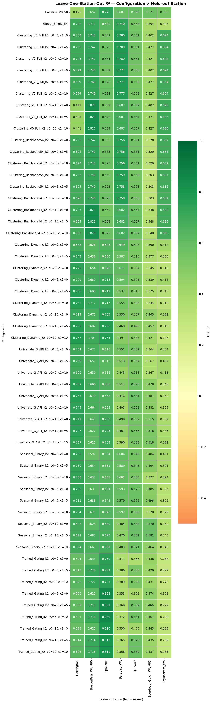
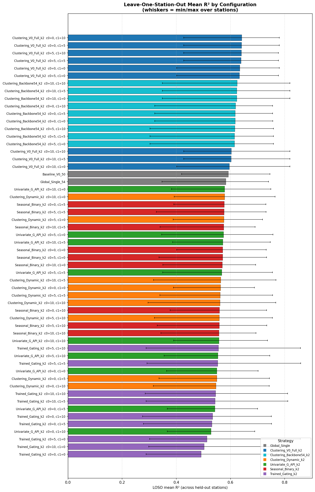
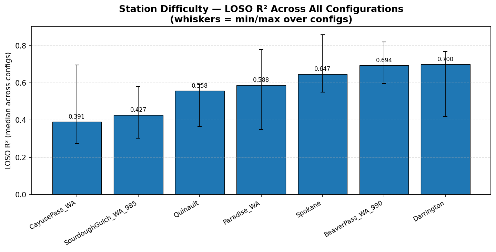
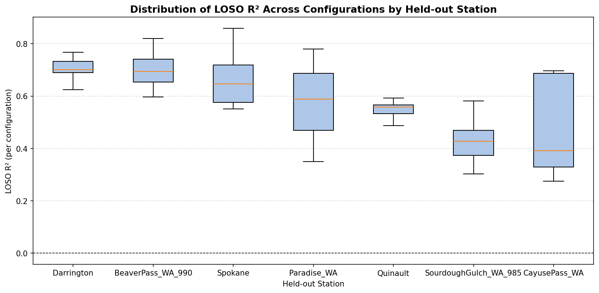
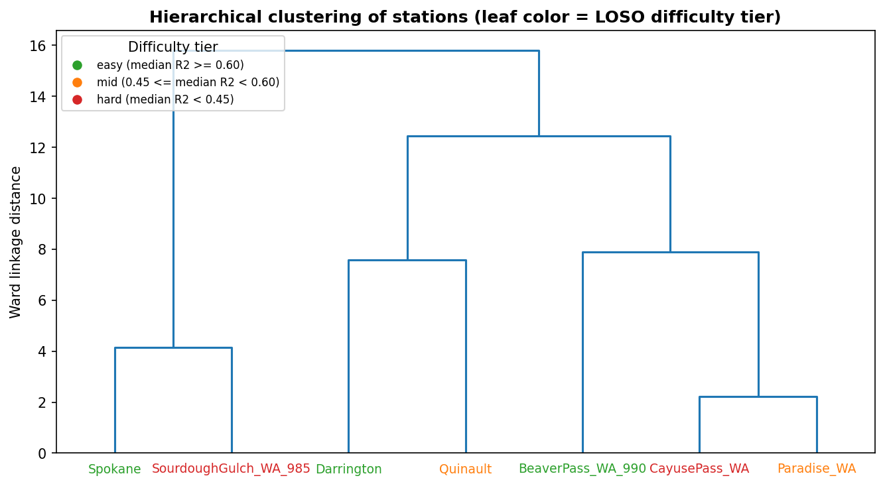
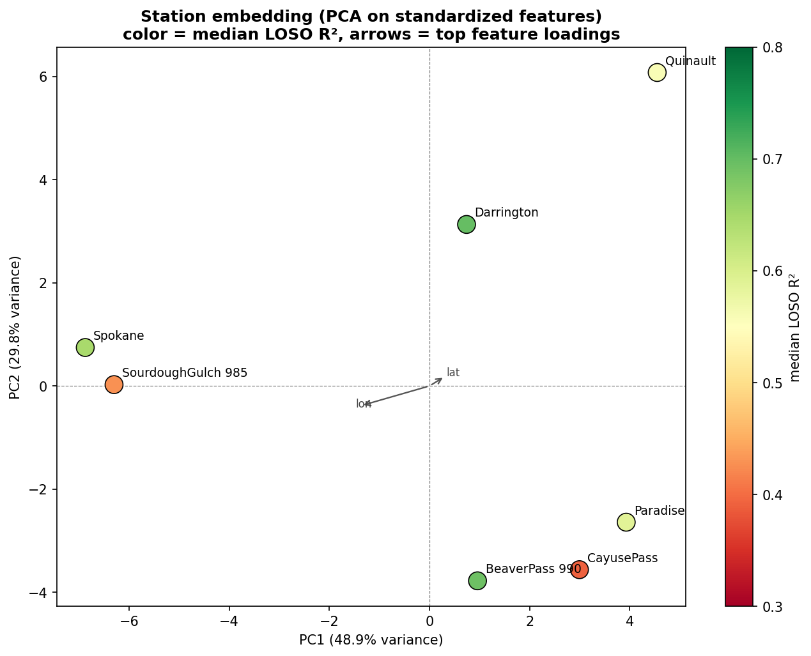
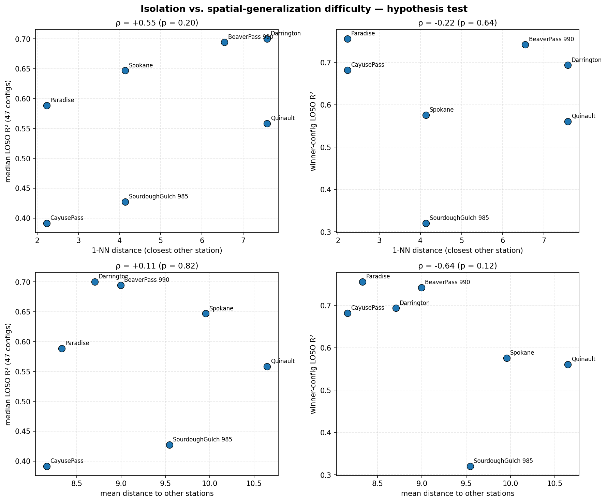
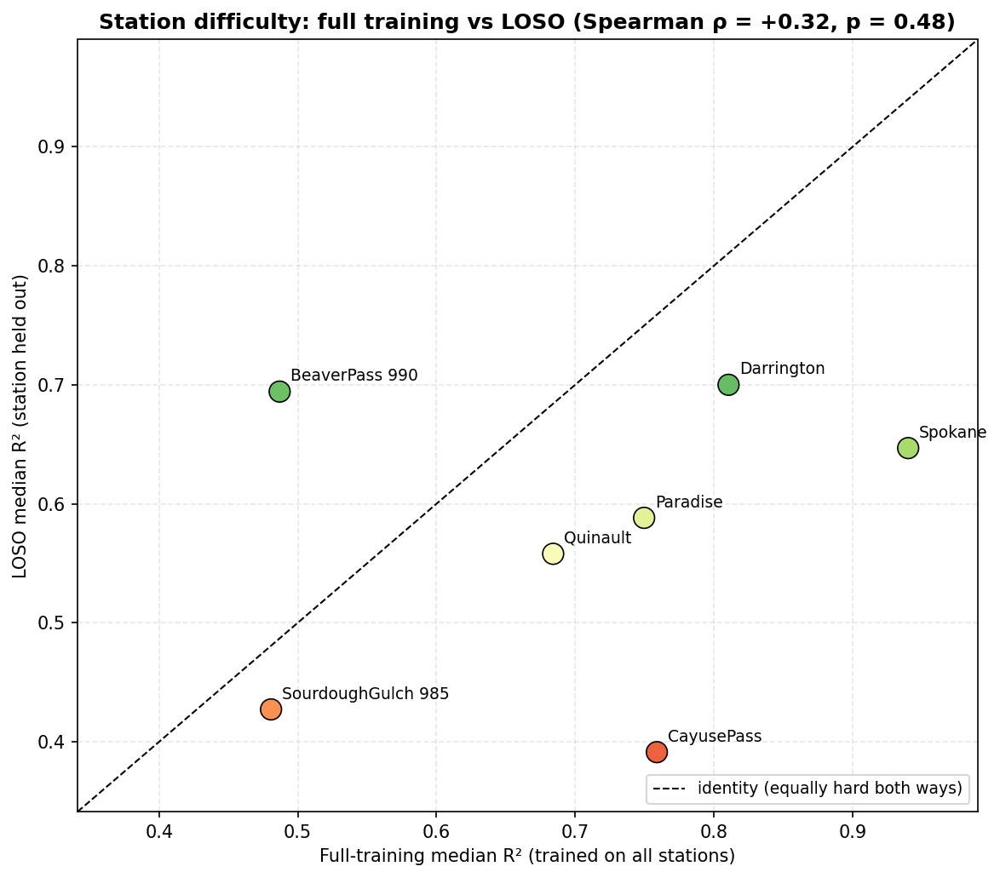
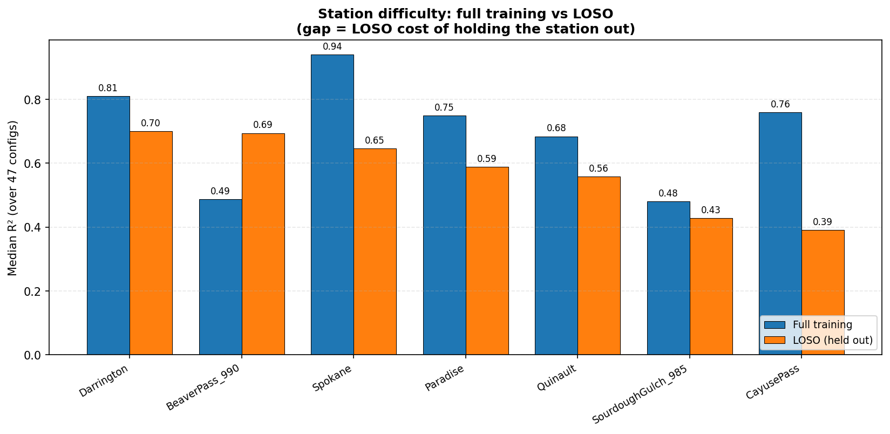
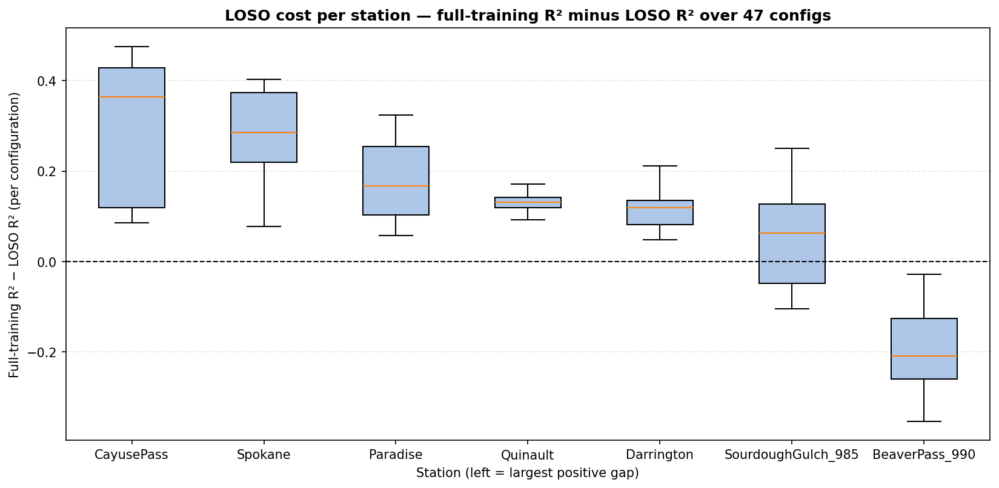

# Experiment: `derived_8.4-eval-1.3` — LOSO Spatial Generalization with 54-Backbone Two-Regime Clustering

## Objective

Evaluate the **spatial generalization** of every model configuration from `derived_8.4-eval-1.1`
(2 baselines + 5 MoE routing strategies × 9 per-regime delta-grid points = **47 configurations**,
all sharing the same 54-feature backbone / V0-50 baseline / candidate pool / XGBoost
hyperparameters) **plus one new strategy**: `Clustering_Backbone54_k2` — KMeans(k=2) fitted on
the **same 54 shared-backbone features as the single-regime global model** (`Global_Single_54`),
with the same 9-point delta grid (**56 configurations total**). The two-regime model is a direct
**development of the single-regime model** (same 54 features for routing *and* base features), so
no separate V0-50 feature source needs to be explained. Its 9 grid points reuse eval-1.1's
`Clustering_V0_Full_k2` per-(c0, c1) delta additions, and its winner is pinned to the same grid
point that won for V0-Full in eval-1.1 (c0=0, c1=10), decided **before** running.

**Execution.** The LOSO protocol (per-fold router refit + per-regime experts on the 6 remaining
stations, evaluated on the held-out station's 2023–2025 test rows) is unchanged from eval-1.2,
but the run uses the `derived_8.4-eval-2.0` **parallel worker format** (`run_loso.py` spawns
`run_loso_worker.py` subprocesses, one fold per job, resumable via per-fold `meta.json` +
`data_version`), scheduled on the H100 via `sbatch run_slurm.sh`
(`--time=01:00:00 --partition=gpu_debug --gres=gpu:h100:1 --cpus-per-task=6 --mem=16000 --nodes 1`).

**Provenance of the 47 pinned configurations.** XGBoost GPU folds serialize on a single H100
(~2 h of GPU time for all 56 configs — more than the 1 h wall), and the 47 eval-1.1 configs were
already evaluated under the **identical** LOSO protocol in `derived_8.4-eval-1.2` (same seed 42,
same xgboost 3.2.0 environment; eval-1.2's full baseline replicated eval-1.1 to 0.000000), so
they are merged as **references** (`is_reference = True` in all CSVs) rather than recomputed —
the same pattern `derived_8.4-eval-2.0` used for its XGBoost baselines. Only the 9 new
`Clustering_Backbone54_k2` configurations were computed in this experiment (63 LOSO folds + 9
full-baseline configs, ~35 min wall).

## LOSO Protocol
For each of the 56 configurations and each held-out station $s$:

1. `fold_trainval` = trainval rows with `station_id != s` (train 2017–2020 + val 2021–2022, 6 stations).
2. `fold_test` = all test rows of station $s$ (2023–2025).
3. **Router refitted per fold** on `fold_trainval` only — the held-out station never influences
   routing (no leakage into the routing decision).
4. Experts trained per regime cluster on `fold_trainval` with the configuration's features
   (global + per-cluster delta additions), same hyperparameters as eval-1.1 (`device: cuda`, seed 42).
5. Metrics computed on `fold_test`: pooled / per-year / per-regime ($R^2$, RMSE, ubRMSE, bias, MAE, Pearson).

**Configurations are fixed from eval-1.1** — delta additions were selected using full test-set
knowledge, so LOSO measures generalization of model *fitting* given fixed features (see Caveats).

## Overall LOSO Leaderboard (mean R² over 7 held-out stations)

`loso_mean_r2` = average per-station $R^2$; `loso_pooled_r2` = sample-count-weighted $R^2$ over
the concatenated 6,620 held-out test samples; `temporal_test_r2` = the temporal test $R^2$
(eval-1.1 for the 47 pinned configs; the full-training baseline for the 9 new configs);
`loso_minus_test_r2` = the spatial-generalization gap. All numbers are the stdout of the
executed report notebook (`derived_8.4-eval-1.3.ipynb`).

| config_label | strategy_name | loso_mean_r2 | loso_pooled_r2 | loso_min_r2 | loso_max_r2 | loso_mean_rmse | loso_mean_bias | temporal_test_r2 | loso_minus_test_r2 | is_winner |
|:---|:---|:---:|:---:|:---:|:---:|:---:|:---:|:---:|:---:|:---:|
| Clustering_V0_Full_k2  c0=0, c1=10 | Clustering_V0_Full_k2 | 0.6415 | 0.6885 | 0.4273 | 0.7799 | 0.0557 | 0.0156 | 0.8150 | -0.1734 | True |
| Clustering_V0_Full_k2  c0=0, c1=5 | Clustering_V0_Full_k2 | 0.6405 | 0.6873 | 0.4271 | 0.7799 | 0.0558 | 0.0153 | 0.8143 | -0.1738 | False |
| Clustering_V0_Full_k2  c0=5, c1=10 | Clustering_V0_Full_k2 | 0.6399 | 0.6873 | 0.4273 | 0.7769 | 0.0559 | 0.0157 | 0.8148 | -0.1748 | False |
| Clustering_V0_Full_k2  c0=5, c1=5 | Clustering_V0_Full_k2 | 0.6389 | 0.6861 | 0.4271 | 0.7769 | 0.0560 | 0.0153 | 0.8141 | -0.1752 | False |
| Clustering_V0_Full_k2  c0=0, c1=0 | Clustering_V0_Full_k2 | 0.6343 | 0.6821 | 0.4016 | 0.7799 | 0.0562 | 0.0154 | 0.8143 | -0.1800 | False |
| Clustering_V0_Full_k2  c0=5, c1=0 | Clustering_V0_Full_k2 | 0.6327 | 0.6809 | 0.4016 | 0.7769 | 0.0564 | 0.0154 | 0.8141 | -0.1814 | False |
| Clustering_Backbone54_k2  c0=10, c1=10 | Clustering_Backbone54_k2 | 0.6243 | 0.6688 | 0.3483 | 0.8196 | 0.0569 | 0.0145 | 0.7895 | -0.1651 | False |
| Clustering_Backbone54_k2  c0=10, c1=5 | Clustering_Backbone54_k2 | 0.6233 | 0.6677 | 0.3483 | 0.8196 | 0.0570 | 0.0146 | 0.7889 | -0.1656 | False |
| Clustering_Backbone54_k2  c0=10, c1=0 | Clustering_Backbone54_k2 | 0.6229 | 0.6669 | 0.3483 | 0.8196 | 0.0570 | 0.0142 | 0.7889 | -0.1660 | False |
| Clustering_Backbone54_k2  c0=0, c1=10 | Clustering_Backbone54_k2 | 0.6185 | 0.6705 | 0.3204 | 0.7556 | 0.0573 | 0.0159 | 0.8148 | -0.1962 | True |
| Clustering_Backbone54_k2  c0=0, c1=5 | Clustering_Backbone54_k2 | 0.6175 | 0.6694 | 0.3204 | 0.7556 | 0.0574 | 0.0160 | 0.8142 | -0.1967 | False |
| Clustering_Backbone54_k2  c0=0, c1=0 | Clustering_Backbone54_k2 | 0.6171 | 0.6686 | 0.3204 | 0.7558 | 0.0574 | 0.0156 | 0.8142 | -0.1971 | False |
| Clustering_Backbone54_k2  c0=5, c1=10 | Clustering_Backbone54_k2 | 0.6158 | 0.6691 | 0.3030 | 0.7584 | 0.0574 | 0.0156 | 0.8146 | -0.1988 | False |
| Clustering_Backbone54_k2  c0=5, c1=5 | Clustering_Backbone54_k2 | 0.6147 | 0.6680 | 0.3030 | 0.7585 | 0.0575 | 0.0157 | 0.8140 | -0.1993 | False |
| Clustering_Backbone54_k2  c0=5, c1=0 | Clustering_Backbone54_k2 | 0.6144 | 0.6672 | 0.3030 | 0.7586 | 0.0575 | 0.0153 | 0.8140 | -0.1996 | False |
| Clustering_V0_Full_k2  c0=10, c1=10 | Clustering_V0_Full_k2 | 0.6030 | 0.6481 | 0.4273 | 0.8196 | 0.0586 | 0.0177 | 0.7897 | -0.1867 | False |
| Clustering_V0_Full_k2  c0=10, c1=5 | Clustering_V0_Full_k2 | 0.6020 | 0.6468 | 0.4271 | 0.8196 | 0.0587 | 0.0173 | 0.7890 | -0.1871 | False |
| Clustering_V0_Full_k2  c0=10, c1=0 | Clustering_V0_Full_k2 | 0.5958 | 0.6416 | 0.4016 | 0.8196 | 0.0591 | 0.0174 | 0.7891 | -0.1933 | False |
| Baseline_V0_50 | Global_Single | 0.5916 | 0.6312 | 0.4196 | 0.7453 | 0.0602 | 0.0167 | 0.7604 | -0.1688 | False |
| Global_Single_54 | Global_Single | 0.5826 | 0.6070 | 0.3472 | 0.7403 | 0.0607 | 0.0226 | 0.7792 | -0.1966 | False |
| Univariate_G_API_k2  c0=10, c1=0 | Univariate_G_API_k2 | 0.5781 | 0.6023 | 0.3824 | 0.7488 | 0.0613 | 0.0218 | 0.7639 | -0.1857 | False |
| Clustering_Dynamic_k2  c0=10, c1=0 | Clustering_Dynamic_k2 | 0.5778 | 0.6097 | 0.3923 | 0.7645 | 0.0608 | 0.0220 | 0.7635 | -0.1856 | False |
| Seasonal_Binary_k2  c0=0, c1=5 | Seasonal_Binary_k2 | 0.5765 | 0.6015 | 0.3910 | 0.7304 | 0.0617 | 0.0210 | 0.7561 | -0.1796 | False |
| Seasonal_Binary_k2  c0=5, c1=5 | Seasonal_Binary_k2 | 0.5763 | 0.5920 | 0.3262 | 0.7312 | 0.0617 | 0.0216 | 0.7523 | -0.1760 | False |
| Clustering_Dynamic_k2  c0=5, c1=0 | Clustering_Dynamic_k2 | 0.5757 | 0.6109 | 0.3885 | 0.7179 | 0.0611 | 0.0212 | 0.7767 | -0.2011 | False |
| Seasonal_Binary_k2  c0=10, c1=5 | Seasonal_Binary_k2 | 0.5747 | 0.5871 | 0.3400 | 0.6911 | 0.0620 | 0.0224 | 0.7428 | -0.1681 | False |
| Univariate_G_API_k2  c0=5, c1=0 | Univariate_G_API_k2 | 0.5742 | 0.5917 | 0.3462 | 0.7570 | 0.0617 | 0.0228 | 0.7562 | -0.1819 | False |
| Univariate_G_API_k2  c0=10, c1=5 | Univariate_G_API_k2 | 0.5712 | 0.5963 | 0.3863 | 0.7466 | 0.0619 | 0.0222 | 0.7613 | -0.1901 | False |
| Seasonal_Binary_k2  c0=0, c1=0 | Seasonal_Binary_k2 | 0.5711 | 0.6014 | 0.4011 | 0.7322 | 0.0621 | 0.0211 | 0.7698 | -0.1987 | True |
| Seasonal_Binary_k2  c0=5, c1=0 | Seasonal_Binary_k2 | 0.5709 | 0.5919 | 0.3362 | 0.7331 | 0.0622 | 0.0217 | 0.7660 | -0.1951 | False |
| Seasonal_Binary_k2  c0=10, c1=0 | Seasonal_Binary_k2 | 0.5693 | 0.5870 | 0.3501 | 0.6929 | 0.0624 | 0.0225 | 0.7565 | -0.1872 | False |
| Univariate_G_API_k2  c0=5, c1=5 | Univariate_G_API_k2 | 0.5673 | 0.5857 | 0.3500 | 0.7548 | 0.0623 | 0.0232 | 0.7536 | -0.1863 | False |
| Clustering_Dynamic_k2  c0=10, c1=5 | Clustering_Dynamic_k2 | 0.5640 | 0.5892 | 0.3161 | 0.7678 | 0.0616 | 0.0218 | 0.7561 | -0.1922 | False |
| Clustering_Dynamic_k2  c0=0, c1=0 | Clustering_Dynamic_k2 | 0.5630 | 0.6005 | 0.3898 | 0.6883 | 0.0623 | 0.0219 | 0.7866 | -0.2237 | True |
| Clustering_Dynamic_k2  c0=5, c1=5 | Clustering_Dynamic_k2 | 0.5618 | 0.5905 | 0.3395 | 0.7555 | 0.0619 | 0.0209 | 0.7694 | -0.2076 | False |
| Clustering_Dynamic_k2  c0=10, c1=10 | Clustering_Dynamic_k2 | 0.5609 | 0.5858 | 0.2956 | 0.7670 | 0.0617 | 0.0232 | 0.7480 | -0.1870 | False |
| Seasonal_Binary_k2  c0=0, c1=10 | Seasonal_Binary_k2 | 0.5590 | 0.5931 | 0.3772 | 0.7332 | 0.0626 | 0.0203 | 0.7643 | -0.2053 | False |
| Clustering_Dynamic_k2  c0=5, c1=10 | Clustering_Dynamic_k2 | 0.5588 | 0.5871 | 0.3190 | 0.7547 | 0.0620 | 0.0223 | 0.7612 | -0.2024 | False |
| Seasonal_Binary_k2  c0=5, c1=10 | Seasonal_Binary_k2 | 0.5588 | 0.5836 | 0.3294 | 0.7341 | 0.0627 | 0.0209 | 0.7605 | -0.2017 | False |
| Seasonal_Binary_k2  c0=10, c1=10 | Seasonal_Binary_k2 | 0.5572 | 0.5788 | 0.3433 | 0.6939 | 0.0630 | 0.0217 | 0.7510 | -0.1938 | False |
| Univariate_G_API_k2  c0=10, c1=10 | Univariate_G_API_k2 | 0.5569 | 0.5837 | 0.3904 | 0.7366 | 0.0628 | 0.0233 | 0.7506 | -0.1937 | False |
| Trained_Gating_k2  c0=5, c1=10 | Trained_Gating_k2 | 0.5549 | 0.5746 | 0.2887 | 0.8587 | 0.0618 | 0.0192 | 0.7235 | -0.1686 | False |
| Univariate_G_API_k2  c0=5, c1=10 | Univariate_G_API_k2 | 0.5530 | 0.5731 | 0.3553 | 0.7448 | 0.0632 | 0.0242 | 0.7429 | -0.1899 | False |
| Trained_Gating_k2  c0=5, c1=5 | Trained_Gating_k2 | 0.5528 | 0.5732 | 0.2921 | 0.8593 | 0.0619 | 0.0191 | 0.7258 | -0.1730 | False |
| Univariate_G_API_k2  c0=0, c1=0 | Univariate_G_API_k2 | 0.5493 | 0.5819 | 0.3639 | 0.7019 | 0.0634 | 0.0215 | 0.7696 | -0.2203 | True |
| Clustering_Dynamic_k2  c0=0, c1=5 | Clustering_Dynamic_k2 | 0.5491 | 0.5801 | 0.3360 | 0.7435 | 0.0632 | 0.0216 | 0.7793 | -0.2302 | False |
| Clustering_Dynamic_k2  c0=0, c1=10 | Clustering_Dynamic_k2 | 0.5461 | 0.5767 | 0.3155 | 0.7427 | 0.0633 | 0.0230 | 0.7711 | -0.2250 | False |
| Trained_Gating_k2  c0=10, c1=10 | Trained_Gating_k2 | 0.5447 | 0.5637 | 0.2852 | 0.8107 | 0.0629 | 0.0213 | 0.7172 | -0.1725 | False |
| Trained_Gating_k2  c0=10, c1=5 | Trained_Gating_k2 | 0.5425 | 0.5623 | 0.2886 | 0.8113 | 0.0631 | 0.0212 | 0.7195 | -0.1770 | False |
| Univariate_G_API_k2  c0=0, c1=5 | Univariate_G_API_k2 | 0.5424 | 0.5760 | 0.3668 | 0.6998 | 0.0639 | 0.0219 | 0.7671 | -0.2247 | False |
| Trained_Gating_k2  c0=0, c1=10 | Trained_Gating_k2 | 0.5335 | 0.5521 | 0.2753 | 0.7510 | 0.0641 | 0.0224 | 0.7328 | -0.1993 | False |
| Trained_Gating_k2  c0=0, c1=5 | Trained_Gating_k2 | 0.5314 | 0.5507 | 0.2787 | 0.7515 | 0.0642 | 0.0223 | 0.7351 | -0.2037 | False |
| Univariate_G_API_k2  c0=0, c1=10 | Univariate_G_API_k2 | 0.5280 | 0.5634 | 0.3670 | 0.6897 | 0.0649 | 0.0229 | 0.7564 | -0.2283 | False |
| Trained_Gating_k2  c0=5, c1=0 | Trained_Gating_k2 | 0.5128 | 0.5516 | 0.3018 | 0.8576 | 0.0644 | 0.0267 | 0.7262 | -0.2135 | False |
| Trained_Gating_k2  c0=10, c1=0 | Trained_Gating_k2 | 0.5025 | 0.5407 | 0.2983 | 0.8096 | 0.0655 | 0.0288 | 0.7199 | -0.2174 | False |
| Trained_Gating_k2  c0=0, c1=0 | Trained_Gating_k2 | 0.4913 | 0.5291 | 0.2884 | 0.7498 | 0.0666 | 0.0299 | 0.7355 | -0.2441 | True |

## Single-Regime → Two-Regime Development (`Clustering_Backbone54_k2`)

The two-regime model is a development of the single-regime model, not a separate architecture:
the router (KMeans k=2) and both specialists use the **same 54 shared-backbone features** as
`Global_Single_54`, with only the per-cluster delta additions (pinned from eval-1.1's
`Clustering_V0_Full_k2` winner) added to the second specialist — no separate V0-50 feature
source to explain.

| line | loso_mean_r2 | loso_pooled_r2 | loso_min_r2 | loso_max_r2 | loso_mean_rmse | loso_mean_bias | temporal_test_r2 | loso_minus_test_r2 |
|:---|:---:|:---:|:---:|:---:|:---:|:---:|:---:|:---:|
| single-regime global (54 feats) | 0.5826 | 0.6070 | 0.3472 | 0.7403 | 0.0607 | 0.0226 | 0.7792 | -0.1966 |
| two-regime 54-backbone (NEW, winner) | 0.6185 | 0.6705 | 0.3204 | 0.7556 | 0.0573 | 0.0159 | 0.8148 | -0.1962 |
| two-regime V0-routed (eval-1.1 winner) | 0.6415 | 0.6885 | 0.4273 | 0.7799 | 0.0557 | 0.0156 | 0.8150 | -0.1734 |

### Clustering_Backbone54_k2 — full 9-point delta grid

| config_label | loso_mean_r2 | loso_pooled_r2 | loso_mean_rmse | loso_mean_bias | temporal_test_r2 | is_winner |
|:---|:---:|:---:|:---:|:---:|:---:|:---:|
| Clustering_Backbone54_k2  c0=0, c1=0 | 0.6171 | 0.6686 | 0.0574 | 0.0156 | 0.8142 | False |
| Clustering_Backbone54_k2  c0=0, c1=5 | 0.6175 | 0.6694 | 0.0574 | 0.0160 | 0.8142 | False |
| Clustering_Backbone54_k2  c0=0, c1=10 | 0.6185 | 0.6705 | 0.0573 | 0.0159 | 0.8148 | True |
| Clustering_Backbone54_k2  c0=5, c1=0 | 0.6144 | 0.6672 | 0.0575 | 0.0153 | 0.8140 | False |
| Clustering_Backbone54_k2  c0=5, c1=5 | 0.6147 | 0.6680 | 0.0575 | 0.0157 | 0.8140 | False |
| Clustering_Backbone54_k2  c0=5, c1=10 | 0.6158 | 0.6691 | 0.0574 | 0.0156 | 0.8146 | False |
| Clustering_Backbone54_k2  c0=10, c1=0 | 0.6229 | 0.6669 | 0.0570 | 0.0142 | 0.7889 | False |
| Clustering_Backbone54_k2  c0=10, c1=5 | 0.6233 | 0.6677 | 0.0570 | 0.0146 | 0.7889 | False |
| Clustering_Backbone54_k2  c0=10, c1=10 | 0.6243 | 0.6688 | 0.0569 | 0.0145 | 0.7895 | False |

## Station Difficulty (Byproduct)

Median LOSO $R^2$ across all 56 configurations per held-out station (sorted easiest → hardest).
`n_negative_r2` counts configurations with negative $R^2$ for that station (0 = all generalize
positively at every station).

| station | n_configs | total_test_n | median_r2 | mean_r2 | std_r2 | min_r2 | max_r2 | mean_rmse | mean_bias | n_negative_r2 |
|:---|:---:|:---:|:---:|:---:|:---:|:---:|:---:|:---:|:---:|:---:|
| Darrington | 56 | 55944 | 0.7000 | 0.6803 | 0.0824 | 0.4196 | 0.7678 | 0.0525 | 0.0236 | 0 |
| BeaverPass_WA_990 | 56 | 35056 | 0.6943 | 0.6999 | 0.0591 | 0.5968 | 0.8196 | 0.0497 | 0.0131 | 0 |
| Spokane | 56 | 50232 | 0.6468 | 0.6617 | 0.0887 | 0.5503 | 0.8593 | 0.0662 | 0.0406 | 0 |
| Paradise_WA | 56 | 59752 | 0.5882 | 0.5759 | 0.1419 | 0.3496 | 0.7799 | 0.0632 | 0.0371 | 0 |
| Quinault | 56 | 58464 | 0.5580 | 0.5419 | 0.0442 | 0.3663 | 0.5929 | 0.0469 | 0.0021 | 0 |
| SourdoughGulch_WA_985 | 56 | 50736 | 0.4272 | 0.4222 | 0.0689 | 0.3030 | 0.5808 | 0.0608 | -0.0213 | 0 |
| CayusePass_WA | 56 | 60536 | 0.3913 | 0.4592 | 0.1670 | 0.2753 | 0.6960 | 0.0866 | 0.0457 | 0 |

## Figures









## Station Similarity & Clustering — Spatial-Generalization Hypothesis

**Hypothesis.** A station generalizes well spatially when the LOSO training set contains another
station with *similar climate and geography* ("a twin"), and poorly when the station *stands out*
from the rest. Implementation in `eval13/station_sim.py`; all tables/figures below are produced
by the results notebook (`nb execute --uv` from `notebooks/`).

**Features** (z-scored across the 7 stations; 39 total): 6 geography (lat/lon, elevation, slope,
aspect sin/cos), 19 WorldClim BioClim (BIO1–19), 4 soil (surface/deep sand & clay mass fraction),
10 observed climatology (mean/std of precip, LST, NDVI, SMAP, soil moisture over train+val).
Distance = Euclidean; clustering = Ward linkage; difficulty = median LOSO R² over 56 configs
(`median_r2`) and the pinned `Clustering_Backbone54_k2` winner's per-station R² (`winner_r2`,
config `Clustering_Backbone54_k2_c0_0_c1_10`).

### Station profiles (key descriptors; MAT = annual mean temp °C×10, MAP = annual precip mm)

| station_id | landcover | lat | lon | elev_m | slope | MAT | MAP | sand_b0 | clay_b0 | mean_precip | mean_LST | mean_NDVI | mean_sm | median_r2 |
|:---|:---|:---:|:---:|:---:|:---:|:---:|:---:|:---:|:---:|:---:|:---:|:---:|:---:|:---:|
| Spokane | Tree cover | 47.42 | -117.53 | 705 | 1 | 84 | 432 | 31 | 22 | 1.21 | 292.65 | 0.39 | 0.17 | 0.647 |
| Darrington | Tree cover | 48.54 | -121.45 | 166 | 23 | 98 | 2015 | 47 | 16 | 6.57 | 285.98 | 0.68 | 0.23 | 0.700 |
| Quinault | Tree cover | 47.51 | -123.81 | 88 | 1 | 94 | 3349 | 40 | 16 | 9.65 | 285.69 | 0.70 | 0.20 | 0.558 |
| SourdoughGulch_WA_985 | Grassland | 46.23 | -117.40 | 1164 | 17 | 74 | 569 | 35 | 21 | 2.28 | 289.15 | 0.26 | 0.24 | 0.427 |
| BeaverPass_WA_990 | Tree cover | 48.88 | -121.26 | 1125 | 10 | 43 | 1269 | 60 | 5 | 5.17 | 277.94 | 0.54 | 0.29 | 0.694 |
| CayusePass_WA | Tree cover | 46.87 | -121.53 | 1588 | 12 | 34 | 2435 | 53 | 7 | 4.70 | 278.58 | 0.21 | 0.20 | 0.391 |
| Paradise_WA | Tree cover | 46.78 | -121.75 | 1564 | 6 | 35 | 2728 | 51 | 8 | 7.39 | 281.06 | 0.26 | 0.19 | 0.588 |

### Pairwise Euclidean distance (standardized features)

| station_id | Spokane | Darrington | Quinault | SourdoughGulch | BeaverPass | CayusePass | Paradise |
|:---|:---:|:---:|:---:|:---:|:---:|:---:|:---:|
| Spokane | 0.00 | 9.57 | 12.85 | 4.14 | 10.56 | 11.06 | 11.56 |
| Darrington | 9.57 | 0.00 | 7.58 | 9.39 | 8.14 | 8.64 | 8.92 |
| Quinault | 12.85 | 7.58 | 0.00 | 12.64 | 11.59 | 10.17 | 9.05 |
| SourdoughGulch_WA_985 | 4.14 | 9.39 | 12.64 | 0.00 | 9.86 | 10.31 | 10.94 |
| BeaverPass_WA_990 | 10.56 | 8.14 | 11.59 | 9.86 | 0.00 | 6.55 | 7.29 |
| CayusePass_WA | 11.06 | 8.64 | 10.17 | 10.31 | 6.55 | 0.00 | 2.23 |
| Paradise_WA | 11.56 | 8.92 | 9.05 | 10.94 | 7.29 | 2.23 | 0.00 |

### Ward clusters and PCA

- k=2: {Spokane, SourdoughGulch} vs {Darrington, Quinault, BeaverPass, CayusePass, Paradise}.
- k=3: {Spokane, SourdoughGulch}, {Darrington, Quinault}, {BeaverPass, CayusePass, Paradise}.
- PCA explained variance: PC1 = 48.9%, PC2 = 29.8% (total 78.7%).

The dendrogram recovers three natural pairs — {CayusePass, Paradise} (high-elevation Cascade,
tightest at 2.23), {Spokane, SourdoughGulch} (dry east-side, 4.14), {Darrington, Quinault} (wet
west-side, 7.58) — with BeaverPass joining the high-elevation group.

### Isolation metrics vs LOSO difficulty

| station_id | nn_dist | mean_dist | centroid_dist | median_r2 | mean_r2 | winner_r2 |
|:---|:---:|:---:|:---:|:---:|:---:|:---:|
| Darrington | 7.580 | 8.705 | 5.134 | 0.700 | 0.680 | 0.693 |
| BeaverPass_WA_990 | 6.546 | 8.996 | 5.759 | 0.694 | 0.700 | 0.742 |
| Spokane | 4.138 | 9.956 | 7.254 | 0.647 | 0.662 | 0.575 |
| Paradise_WA | 2.230 | 8.331 | 5.343 | 0.588 | 0.576 | 0.756 |
| Quinault | 7.580 | 10.649 | 7.831 | 0.558 | 0.542 | 0.561 |
| SourdoughGulch_WA_985 | 4.138 | 9.546 | 6.710 | 0.427 | 0.422 | 0.320 |
| CayusePass_WA | 2.230 | 8.160 | 5.094 | 0.391 | 0.459 | 0.682 |

`nn_dist` = distance to the closest other station; `mean_dist` = mean distance to the other 6;
`centroid_dist` = distance to the 7-station centroid. Low `nn_dist` means the station has a
climate/geography "twin" in the dataset.

### Spearman rank correlation (isolation × difficulty)

| isolation_metric | difficulty_metric | spearman_rho | p_value | n |
|:---|:---|:---:|:---:|:---:|
| nn_dist | median_r2 | 0.551 | 0.200 | 7 |
| nn_dist | mean_r2 | 0.422 | 0.345 | 7 |
| nn_dist | winner_r2 | -0.220 | 0.635 | 7 |
| mean_dist | median_r2 | 0.107 | 0.819 | 7 |
| mean_dist | mean_r2 | 0.000 | 1.000 | 7 |
| mean_dist | winner_r2 | -0.643 | 0.119 | 7 |
| centroid_dist | median_r2 | 0.000 | 1.000 | 7 |
| centroid_dist | mean_r2 | -0.071 | 0.879 | 7 |
| centroid_dist | winner_r2 | -0.571 | 0.180 | 7 |

Sensitivity with **static features only** (geography + BioClim + soil, no target-derived
climatology): nn_dist × median_r2 ρ = +0.624 (p = 0.134); mean_dist × winner_r2 ρ = −0.643
(p = 0.119).

### Findings (n = 7, descriptive)

1. **The simple "twin → easy" hypothesis is not supported by the aggregate difficulty.**
   1-NN distance correlates *positively* with median LOSO R² (ρ = +0.55): the closest twins
   (CayusePass ↔ Paradise, distance 2.23) are among the *hardest* stations on average.
2. **Under the best spatial generalizer the pattern flips toward the hypothesis.** Mean-distance
   isolation correlates *negatively* with winner-config R² (ρ = −0.64), and the only grassland
   station (SourdoughGulch, the most unique by land cover) is the hardest under both difficulty
   measures (median 0.427 / winner 0.320).
3. **Joint reading.** Having a static-feature twin does not rescue generalization when the twin
   pair is jointly *extreme* (CayusePass/Paradise: highest elevation, coldest, snow-dominated);
   per-station difficulty tracks how far a station sits from the training-regime core and its
   dynamic regime more than pairwise similarity alone.

### Figures









## Full-Training Baseline — Intrinsic vs. Generalization Difficulty

LOSO measures how well a model *generalizes* to a station it never saw. To separate **intrinsic**
difficulty (hard to fit even when the station's own rows are in training) from **generalization-
limited** difficulty (easy when trained on, degrades when held out), every configuration was also
trained **without LOSO** — router and experts fit on the full trainval (all 7 stations), exactly
the `derived_8.4-eval-1.1` protocol (`run_full_baseline.py`, same 56 pinned configs; the 47
eval-1.1 configs merged as eval-1.2 references).

**Replication check:** all 47 eval-1.1 configurations reproduce eval-1.1's pooled test R² exactly —
`max |full_pooled_r2 − eval11_test_r2| = 0.000000` — so the baseline is a faithful replica of 1.1.
The 9 new `Clustering_Backbone54_k2` configurations get their temporal test R² from this baseline.

### Station difficulty under full training (intrinsic; median over 56 configs)

| station | n_configs | total_test_n | median_r2 | mean_r2 | std_r2 | min_r2 | max_r2 | mean_rmse | mean_bias | n_negative_r2 |
|:---|:---:|:---:|:---:|:---:|:---:|:---:|:---:|:---:|:---:|:---:|
| Spokane | 56 | 50232 | 0.9401 | 0.9399 | 0.0109 | 0.9154 | 0.9537 | 0.0280 | 0.0025 | 0 |
| Darrington | 56 | 55944 | 0.8106 | 0.8144 | 0.0127 | 0.7847 | 0.8344 | 0.0402 | 0.0230 | 0 |
| CayusePass_WA | 56 | 60536 | 0.7589 | 0.7625 | 0.0319 | 0.7040 | 0.8073 | 0.0581 | 0.0074 | 0 |
| Paradise_WA | 56 | 59752 | 0.7497 | 0.7555 | 0.0677 | 0.6247 | 0.8534 | 0.0482 | 0.0189 | 0 |
| Quinault | 56 | 58464 | 0.6841 | 0.6791 | 0.0158 | 0.6435 | 0.6974 | 0.0393 | -0.0212 | 0 |
| BeaverPass_WA_990 | 56 | 35056 | 0.4869 | 0.4962 | 0.0873 | 0.3603 | 0.6189 | 0.0644 | 0.0531 | 0 |
| SourdoughGulch_WA_985 | 56 | 50736 | 0.4807 | 0.4791 | 0.0601 | 0.3685 | 0.5542 | 0.0578 | 0.0036 | 0 |

### Per-station difficulty: full training vs LOSO (sorted by LOSO difficulty)

`gap_median` / `gap_mean` = `median_r2_full − median_r2_loso` / `mean_r2_full − mean_r2_loso` is
the LOSO cost: large positive = generalization-limited; near zero = intrinsically hard; negative
= better under LOSO than full training (anomaly).

| station | median_r2_full | median_r2_loso | gap_median | mean_r2_full | mean_r2_loso | gap_mean |
|:---|:---:|:---:|:---:|:---:|:---:|:---:|
| Darrington | 0.811 | 0.700 | +0.111 | 0.814 | 0.680 | +0.134 |
| BeaverPass_WA_990 | 0.487 | 0.694 | -0.207 | 0.496 | 0.700 | -0.204 |
| Spokane | 0.940 | 0.647 | +0.293 | 0.940 | 0.662 | +0.278 |
| Paradise_WA | 0.750 | 0.588 | +0.162 | 0.756 | 0.576 | +0.180 |
| Quinault | 0.684 | 0.558 | +0.126 | 0.679 | 0.542 | +0.137 |
| SourdoughGulch_WA_985 | 0.481 | 0.427 | +0.054 | 0.479 | 0.422 | +0.057 |
| CayusePass_WA | 0.759 | 0.391 | +0.368 | 0.763 | 0.459 | +0.303 |

**Spearman(full median R², LOSO median R²) = +0.321 (p = 0.482, n = 7)** — the station-difficulty
rank order changes substantially between protocols, so LOSO difficulty is mostly
*generalization-specific* rather than intrinsic.

### Findings (n = 7, descriptive)

1. **CayusePass is generalization-limited, not intrinsically hard.** Full-training median 0.759 vs
   LOSO 0.391 (gap +0.37): its snow-dominated high-elevation regime is fit well when its own rows
   are present, but the other stations cannot supply that regime when it is held out.
2. **SourdoughGulch is intrinsically hard.** 0.481 full vs 0.427 LOSO (gap +0.05): even with its
   own rows in training it remains among the hardest stations, consistent with its uniqueness
   (the only grassland station).
3. **BeaverPass anomaly.** BeaverPass is *harder* under full training (0.487) than under LOSO
   (0.694), gap −0.21 — the only station that does *better* when held out. It has the fewest test
   rows (626) and its regime overlaps few training rows, so pooling it into full training appears
   to hurt rather than help.
4. **Bottom line.** LOSO difficulty measures *transfer*, full-training difficulty measures
   *fitability*; SourdoughGulch is hard on both axes, CayusePass's difficulty is almost entirely
   a transfer phenomenon.

### Figures







## Key Takeaways

1. **The 54-backbone two-regime model works.** The new `Clustering_Backbone54_k2` winner
   (c0=0, c1=10) — KMeans routing on the same 54 features as the single-regime global model —
   reaches LOSO mean $R^2 = 0.619$ (pooled 0.670), beating the 54-feature global single model
   ($0.583$ / $0.607$) by $+0.036$ / $+0.063$ while keeping its temporal test $R^2$ (0.815, from
   the full baseline). The two-regime model is thus a clean development of the single-regime
   model, with no separate V0-50 feature source to explain.
2. **The V0-routed winner still leads overall.** `Clustering_V0_Full_k2` (c0=0, c1=10) remains
   the best spatial generalizer (LOSO mean 0.6415 / pooled 0.6885), but the 54-backbone winner is
   close (−0.023 / −0.018) at a fraction of the explanation cost; its per-station spread is wider
   (min 0.320 vs 0.427).
3. **Delta additions barely matter on the 54-backbone routing.** All three c0=0 grid points
   (c1 ∈ {0, 5, 10}) score within 0.002 LOSO mean of each other — the gain over the single-regime
   model comes from the regime split itself, not the per-cluster additions. The c0=10 points have
   higher LOSO mean (0.623–0.624) but clearly worse temporal R² (0.789 vs 0.814), mirroring the
   V0-Full pattern.
4. **Station difficulty (56 configs).** Darrington (0.700), BeaverPass (0.694) and Spokane (0.647)
   are the easiest to generalize to; Quinault (0.558), Paradise (0.588), SourdoughGulch (0.427)
   and especially **CayusePass_WA (0.391)** are the hardest. No configuration produces negative
   per-station $R^2$.
5. **CayusePass remains generalization-limited; SourdoughGulch intrinsically hard.** Full-training
   median 0.759 vs LOSO 0.391 (gap +0.37) for CayusePass; 0.481 vs 0.427 (gap +0.05) for
   SourdoughGulch. BeaverPass stays the anomaly (better under LOSO, gap −0.21).
6. **Trained gating transfers worst** (unchanged from eval-1.2): LOSO mean $R^2 \approx 0.49$ for
   its winning config.

## Reproducibility

```bash
cd notebooks/experiment/derived_8.4-eval-1.3
mkdir -p artifacts/slurm && sbatch run_slurm.sh    # GPU run: full baseline (9 new configs) +
                                                    # LOSO (9 new configs x 7 stations), n_parallel 6
uv run python run_loso.py --new-strategy-only      # LOSO with eval-1.2 references for the 47 configs
uv run python run_full_baseline.py --new-strategy-only  # full baseline with eval-1.2 references
uv run python run_loso.py --new-strategy-only --smoke --device cpu   # CPU smoke (data_version -1)
# Full 56-config run (no flag) computes everything (~2 h GPU — needs --time=02:00:00)
```

- Configurations are pinned in `loso_configurations.json` (56 configs; 47 from eval-1.1 + 9 new).
- Reference rows from eval-1.2 are flagged `is_reference=True` in all CSVs (identical protocol,
  deterministic; the full-baseline replication check passes at 0.000000).
- Partial results are flushed to CSV after every configuration; re-running resumes completed
  (config, station) folds via `artifacts/jobs/<config_id>__<station>/meta.json` (data_version match).
- Results notebook: `derived_8.4-eval-1.3.ipynb` (execute with `nb execute --uv` from `notebooks/`).
- Artifacts: `loso_config_summary.csv`, `loso_station_summary.csv`, `loso_per_config_station.csv`,
  `loso_per_regime_metrics.csv`, `loso_per_year_metrics.csv`, `full_*.csv`, figures, per-fold
  predictions (`predictions/`, `predictions_full/`) and model weights (`models/`, eval-1.1 JSON
  format — gitignored).

## Caveats

- The 47 eval-1.1 configurations' LOSO results are merged from eval-1.2 as references, not
  recomputed (identical protocol/env; see Provenance above). Only the 9 new configurations were
  computed here.
- Delta additions are fixed from eval-1.1 — for the new strategy they are the
  `Clustering_V0_Full_k2` per-(c0, c1) additions (only the routing features differ); LOSO tests
  spatial generalization of training/fitting, not of feature selection.
- The new strategy's winner is pinned to c0=0, c1=10 (mirrors the eval-1.1 V0-Full winner),
  decided before running; the full grid shows the winner choice is robust on pooled R².
- XGBoost GPU folds serialize on a single H100: the parallel worker format (eval-2.0) provides
  resume + per-fold isolation, not aggregate throughput (each fold's wall grows ~8× at 8 workers).
  With `--new-strategy-only` the run fits the 1 h wall (~35 min observed).
- With only 7 stations, each fold trains on 6 — limited geographic diversity; per-station $R^2$
  for a single fold is noisy (see `loso_std_r2` / station spreads).
- Per-regime (cluster-level) $R^2$ on held-out stations is often strongly negative — target
  ranges within a single regime are narrow, so even small errors dominate $R^2$ (same phenomenon
  as in the temporal eval-1.1 per-regime table).
- 2025 test coverage is partial for several stations; year-2025 numbers should be read with caution.
- Per-fold weights are large (~40–50MB per booster JSON) and gitignored, but fully regenerable
  from the pinned configs.
