# Experiment: `derived_8.4-eval-2.0` — MLP Leave-One-Station-Out (LOSO) Spatial Generalization

## Objective

Continuation of `derived_8.4-eval-1.2` (same output format: LOSO protocol + full-training
baseline + station-similarity analysis) that evaluates the **spatial generalization** of the
**MLP models** whose hyperparameters were established in `derived_8.4-eval-mlp-1.3` (2-regime)
and `derived_8.4-eval-mlp-1.1` (1-regime) under a **leave-one-station-out** (LOSO) protocol
across the 7 Washington stations of the `derived_8.4` split.

Scope (per the experiment brief): **one regime** (global single MLP) and **two regimes** — with
only the **best clustering strategy** (`Clustering_V0_Full_k2`, c0=0, c1=10, the eval-1.1/1.2
spatial winner). 6 pinned MLP configurations = the val-selected winners per family (honest
selection) + notable mlp-1.3 findings. The motivating hypothesis (from mlp-1.3's OOD finding —
MLP OOD test R² 0.75 vs XGBoost 2-regime 0.62) is that MLPs extrapolate smoothly in feature
space and therefore generalize to unseen stations better than the XGBoost MoE baselines.

The XGBoost LOSO results from `derived_8.4-eval-1.2` are merged as reference rows (no
retraining), so the MLP-vs-XGBoost spatial comparison is direct.

All numbers below are the stdout of the executed report notebook (`derived_8.4-eval-2.0.ipynb`).
Per-fold model checkpoints, test predictions, and per-epoch curves are archived under `models/`;
preprocessed fold tensors and per-job logs under `artifacts/`; figures under the experiment root.

## Configurations under LOSO (6 MLP, fixed per fold)

| family | config_id | structure | features | selection status | temporal test R² (source) |
|:---|:---|:---|:---|:---|:---:|
| 1regime_54 | `w256x256_d0.3_tanh` | global | backbone_54 | mlp-1.1 val winner | 0.680 (mlp-1.1) |
| 1regime_96 | `res_w512x512_d0.2_wd1e-3` | global | candidate_pool_96 | mlp-1.1 val winner | 0.729 (mlp-1.1) |
| 2regime_54 | `w512x512x512_d0.3_huber0.1` | cluster (c0=54, c1=54+10) | backbone_54 | mlp-1.3 val winner | 0.765 (mlp-1.3) |
| 2regime_54 | `w448x448_d0.3_gelu` | cluster | backbone_54 | mlp-1.3 finding (near-zero bias) | 0.781 (mlp-1.3) |
| 2regime_54 | `w384x384_d0.3_gelu` | cluster | backbone_54 | mlp-1.3 test-best (reference only) | 0.789 (mlp-1.3) |
| 2regime_96 | `w512x512x512_d0.3_lr1e-3` | cluster (c0=96, c1=96+10) | candidate_pool_96 | mlp-1.3 val winner | 0.761 (mlp-1.3) |

Seeds per family match the source experiments (2-regime: {42, 7} from mlp-1.3; 1-regime: {42}
from mlp-1.1), so the full-training baseline replicates the temporal references exactly and the
LOSO R² is directly comparable to the temporal R².

## LOSO Protocol (MLP-adapted from eval-1.2)

For each of the 6 configurations and each held-out station $s$:

1. `fold_train` = train rows with `station_id != s` (2017–2020, 6 stations);
   `fold_val` = val rows with `station_id != s` (2021–2022, 6 stations);
   `fold_test` = all test rows of station $s$ (2023–2025).
2. **Router refit per fold** on `fold_trainval` (= fold_train + fold_val, 6 stations) only —
   `GlobalSingleRouter` for 1-regime, `V0FullRouter` (KMeans k=2 on the 50 V0 features, seed 42)
   for 2-regime — no held-out-station leakage into routing.
3. **MLP specialists trained per regime cluster** on `fold_train` with the configuration's
   features, **early-stopped on `fold_val`** (mlp-1.3 trainer: AdamW + warmup 5% + cosine,
   patience 60, grad clip 1.0, aux2020 diagnostic), then predict on `fold_test`. An empty
   fold-train cluster falls back to the fold-train target mean (same fallback as eval-1.2).
4. Metrics computed on `fold_test`: pooled / per-year / per-regime (R², RMSE, ubRMSE, bias,
   MAE, Pearson).

**Configurations are fixed from mlp-1.3 / mlp-1.1** — hyperparameters and cluster delta features
were selected on the temporal test protocol, so LOSO measures generalization of model
*training/fitting* given fixed features (see Caveats).

## Overall LOSO Leaderboard (mean R² over 7 held-out stations)

`loso_mean_r2` = average of per-station R²; `loso_pooled_r2` = sample-count-weighted R² over the
concatenated 6,620 held-out test samples (directly comparable to the temporal pooled test R²);
`temporal_test_r2` = the configuration's temporal test R² from its source experiment (mlp-1.3 /
mlp-1.1 / eval-1.1); `loso_minus_test_r2` = the spatial-generalization gap.

| config_label | strategy_name | loso_mean_r2 | loso_pooled_r2 | loso_min_r2 | loso_max_r2 | loso_mean_rmse | loso_mean_bias | temporal_test_r2 | loso_minus_test_r2 | is_winner |
|:---|:---|:---:|:---:|:---:|:---:|:---:|:---:|:---:|:---:|:---:|
| XGBoost Clustering_V0_Full_k2 (Winner c0=0, c1=10) | XGBoost_Reference | 0.6415 | 0.6885 | 0.4273 | 0.7799 | 0.0557 | 0.0156 | 0.8150 | -0.1734 | False |
| MLP 2-Regime-96 (w512x512x512_d0.3_lr1e-3) | MLP_2regime_96 | 0.5903 | 0.6678 | 0.3162 | 0.7624 | 0.0587 | -0.0186 | 0.7610 | -0.1707 | True |
| XGBoost Global Single (54 Backbone) | XGBoost_Reference | 0.5826 | 0.6070 | 0.3472 | 0.7403 | 0.0607 | 0.0226 | 0.7792 | -0.1966 | False |
| MLP 1-Regime-54 (w256x256_d0.3_tanh) | MLP_1regime_54 | 0.5362 | 0.6105 | 0.1801 | 0.8492 | 0.0613 | 0.0088 | 0.6797 | -0.1435 | True |
| MLP 2-Regime-54 (w384x384_d0.3_gelu) | MLP_2regime_54 | 0.4818 | 0.5928 | -0.1446 | 0.7203 | 0.0638 | 0.0060 | 0.7888 | -0.3070 | False |
| MLP 2-Regime-54 (w512x512x512_d0.3_huber0.1) | MLP_2regime_54 | 0.4814 | 0.5936 | 0.0229 | 0.7345 | 0.0637 | -0.0046 | 0.7651 | -0.2837 | True |
| MLP 2-Regime-54 (w448x448_d0.3_gelu) | MLP_2regime_54 | 0.3751 | 0.5135 | -0.4280 | 0.7351 | 0.0700 | 0.0060 | 0.7809 | -0.4057 | False |
| MLP 1-Regime-96 (res_w512x512_d0.2_wd1e-3) | MLP_1regime_96 | 0.3199 | 0.5241 | -1.5084 | 0.7189 | 0.0669 | -0.0023 | 0.7289 | -0.4090 | True |

## Station Difficulty (Byproduct)

Aggregating LOSO R² over all 8 configurations (6 MLP + 2 XGBoost references) per held-out
station. `n_negative_r2` counts configurations with negative R² for that station.

| station | n_configs | total_test_n | median_r2 | mean_r2 | std_r2 | min_r2 | max_r2 | mean_rmse | mean_bias | n_negative_r2 |
|:---|:---:|:---:|:---:|:---:|:---:|:---:|:---:|:---:|:---:|:---:|
| Paradise_WA | 8 | 8536 | 0.7218 | 0.7234 | 0.0313 | 0.6886 | 0.7799 | 0.0517 | 0.0089 | 0 |
| CayusePass_WA | 8 | 8648 | 0.6927 | 0.6442 | 0.1348 | 0.3472 | 0.7351 | 0.0703 | 0.0227 | 0 |
| BeaverPass_WA_990 | 8 | 5008 | 0.6777 | 0.6476 | 0.0909 | 0.4892 | 0.7424 | 0.0537 | -0.0038 | 0 |
| Spokane | 8 | 7176 | 0.6388 | 0.6394 | 0.1074 | 0.4821 | 0.8492 | 0.0682 | 0.0228 | 0 |
| Darrington | 8 | 7992 | 0.6023 | 0.5567 | 0.1855 | 0.3021 | 0.7624 | 0.0610 | 0.0068 | 0 |
| SourdoughGulch_WA_985 | 8 | 7248 | 0.4055 | 0.2164 | 0.3556 | -0.4280 | 0.5248 | 0.0695 | 0.0087 | 2 |
| Quinault | 8 | 8352 | 0.2503 | 0.0802 | 0.6668 | -1.5084 | 0.5607 | 0.0638 | -0.0367 | 1 |

## Per-Configuration × Per-Station R² Matrix

| config_label | Paradise | CayusePass | BeaverPass | Spokane | Darrington | SourdoughGulch | Quinault |
|:---|:---:|:---:|:---:|:---:|:---:|:---:|:---:|
| MLP 1-Regime-54 (w256x256_d0.3_tanh) | 0.689 | 0.543 | 0.666 | 0.849 | 0.302 | 0.525 | 0.180 |
| MLP 1-Regime-96 (res_w512x512_d0.2_wd1e-3) | 0.709 | 0.689 | 0.566 | 0.647 | 0.719 | 0.417 | **-1.508** |
| MLP 2-Regime-54 (w384x384_d0.3_gelu) | 0.701 | 0.720 | 0.690 | 0.703 | 0.388 | -0.145 | 0.315 |
| MLP 2-Regime-54 (w448x448_d0.3_gelu) | 0.692 | 0.735 | 0.584 | 0.482 | 0.375 | -0.428 | 0.186 |
| MLP 2-Regime-54 (w512x512x512_d0.3_huber0.1) | 0.735 | 0.692 | 0.732 | 0.648 | 0.502 | 0.023 | 0.039 |
| MLP 2-Regime-96 (w512x512x512_d0.3_lr1e-3) | 0.742 | 0.734 | 0.489 | 0.572 | **0.762** | 0.517 | 0.316 |
| XGBoost Clustering_V0_Full_k2 (Winner) | 0.780 | 0.694 | 0.742 | 0.584 | 0.703 | 0.427 | 0.561 |
| XGBoost Global Single (54 Backbone) | 0.740 | 0.347 | 0.711 | 0.630 | 0.702 | 0.394 | 0.553 |

## Yearly Breakdown under LOSO

Mean held-out-station R² per test year (per-station-year R² is unstable on small samples —
see Caveats).

| config_label | 2023 | 2024 | 2025 |
|:---|:---:|:---:|:---:|
| XGBoost Clustering_V0_Full_k2 (Winner) | 0.476 | 0.667 | -0.497 |
| MLP 2-Regime-96 (w512x512x512_d0.3_lr1e-3) | 0.509 | 0.501 | -6.140 |
| XGBoost Global Single (54 Backbone) | 0.369 | 0.601 | -0.233 |
| MLP 1-Regime-54 (w256x256_d0.3_tanh) | 0.402 | 0.446 | -0.798 |
| MLP 2-Regime-54 (w384x384_d0.3_gelu) | 0.498 | 0.358 | -2.232 |
| MLP 2-Regime-54 (w512x512x512_d0.3_huber0.1) | 0.478 | 0.395 | -1.520 |
| MLP 2-Regime-54 (w448x448_d0.3_gelu) | 0.467 | 0.199 | -2.882 |
| MLP 1-Regime-96 (res_w512x512_d0.2_wd1e-3) | 0.399 | -0.063 | -12.026 |

## Figures

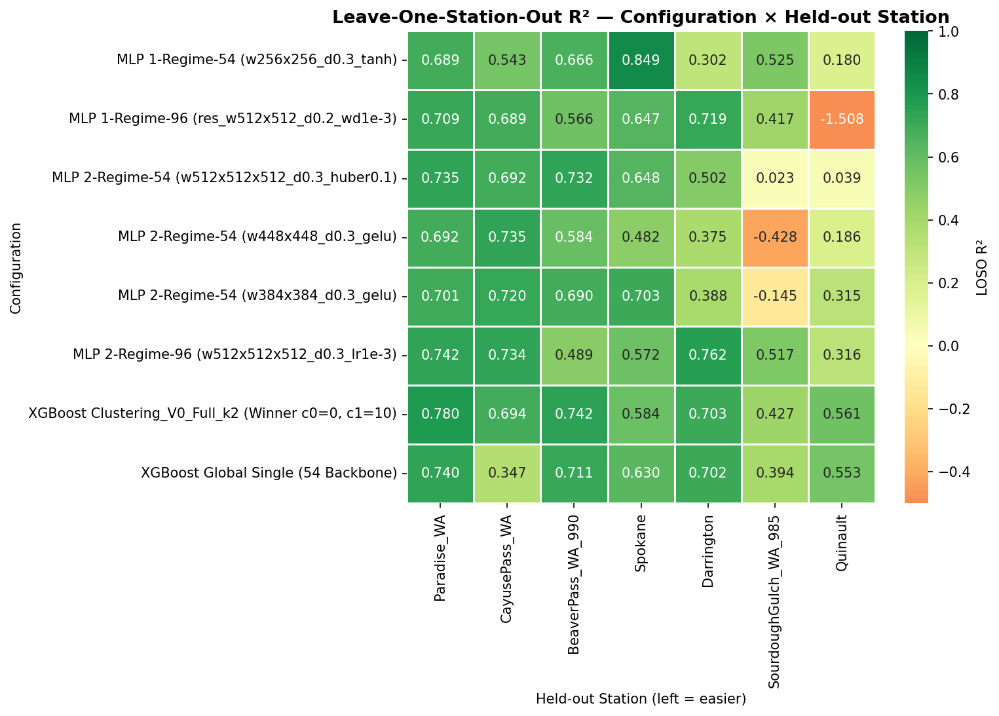

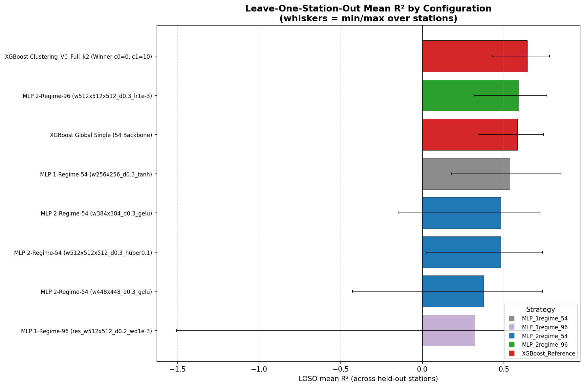

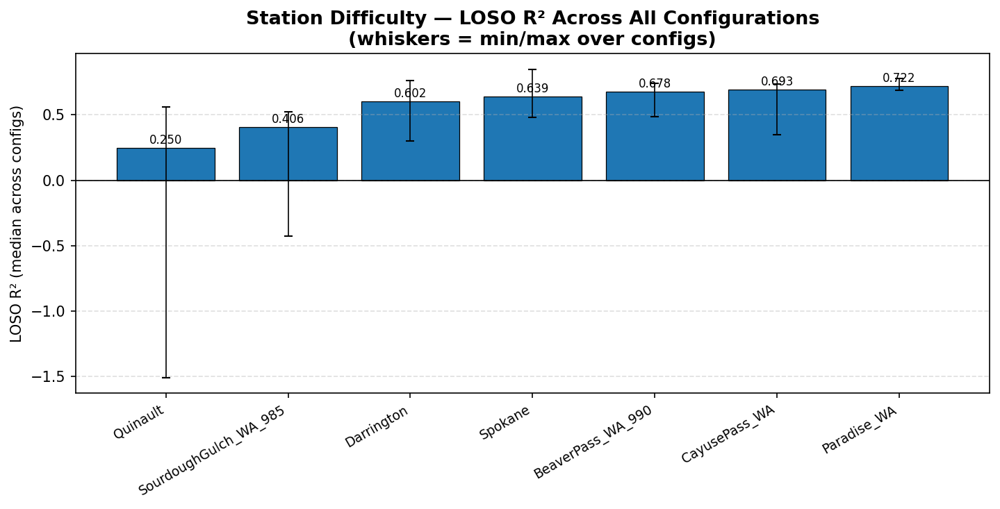

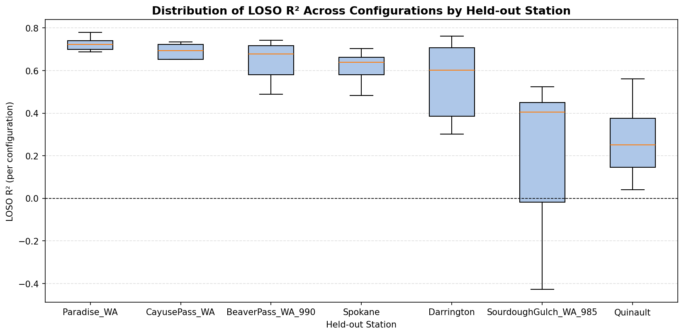

## Station Similarity & Clustering — Spatial-Generalization Hypothesis

**Hypothesis.** A station generalizes well spatially when the LOSO training set contains another
station with *similar climate and geography* ("a twin"), and poorly when the station *stands out*
from the rest. This section reuses `derived_8.4-eval-1.2`'s `eval12.station_sim` module:
per-station feature vectors (29 static: geography + WorldClim BioClim BIO1-19 + soil; 10 observed
climatology over train+val), z-scored, Ward clustering + PCA, isolation scores, Spearman
hypothesis test. Difficulty = median LOSO R² over the 8 configurations (`median_r2`) and the
per-station R² of the best 2-regime MLP spatial generalizer (`winner_r2` = MLP 2-Regime-96
`w512x512x512_d0.3_lr1e-3`, LOSO mean 0.590).

### Station profiles (MAT = annual mean temp °C×10, MAP = annual precip mm)

| station_id | landcover | lat | lon | elev_m | slope | MAT | MAP | sand_b0 | clay_b0 | mean_precip | mean_LST | mean_NDVI | mean_sm | median_r2 |
|:---|:---|:---:|:---:|:---:|:---:|:---:|:---:|:---:|:---:|:---:|:---:|:---:|:---:|:---:|
| Paradise_WA | Tree cover | 46.78 | -121.75 | 1564 | 6 | 35 | 2728 | 51 | 8 | 7.39 | 281.06 | 0.26 | 0.19 | 0.722 |
| CayusePass_WA | Tree cover | 46.87 | -121.53 | 1588 | 12 | 34 | 2435 | 53 | 7 | 4.70 | 278.58 | 0.21 | 0.20 | 0.693 |
| BeaverPass_WA_990 | Tree cover | 48.88 | -121.26 | 1125 | 10 | 43 | 1269 | 60 | 5 | 5.17 | 277.94 | 0.54 | 0.29 | 0.678 |
| Spokane | Tree cover | 47.42 | -117.53 | 705 | 1 | 84 | 432 | 31 | 22 | 1.21 | 292.65 | 0.39 | 0.17 | 0.639 |
| Darrington | Tree cover | 48.54 | -121.45 | 166 | 23 | 98 | 2015 | 47 | 16 | 6.57 | 285.98 | 0.68 | 0.23 | 0.602 |
| SourdoughGulch_WA_985 | Grassland | 46.23 | -117.40 | 1164 | 17 | 74 | 569 | 35 | 21 | 2.28 | 289.15 | 0.26 | 0.24 | 0.406 |
| Quinault | Tree cover | 47.51 | -123.81 | 88 | 1 | 94 | 3349 | 40 | 16 | 9.65 | 285.69 | 0.70 | 0.20 | 0.250 |

### Pairwise Euclidean distance (standardized features)

| station_id | Spokane | Darrington | Quinault | SourdoughGulch | BeaverPass | CayusePass | Paradise |
|:---|:---:|:---:|:---:|:---:|:---:|:---:|:---:|
| Spokane | 0.00 | 9.57 | 12.85 | 4.14 | 10.56 | 11.06 | 11.56 |
| Darrington | 9.57 | 0.00 | 7.58 | 9.39 | 8.14 | 8.64 | 8.92 |
| Quinault | 12.85 | 7.58 | 0.00 | 12.64 | 11.59 | 10.17 | 9.05 |
| SourdoughGulch_WA_985 | 4.14 | 9.39 | 12.64 | 0.00 | 9.86 | 10.31 | 10.94 |
| BeaverPass_WA_990 | 10.56 | 8.14 | 11.59 | 9.86 | 0.00 | 6.55 | 7.29 |
| CayusePass_WA | 11.06 | 8.64 | 10.17 | 10.31 | 6.55 | 0.00 | 2.23 |
| Paradise_WA | 11.56 | 8.92 | 9.05 | 10.94 | 7.29 | 2.23 | 0.00 |

### Ward clusters and PCA

- k=2: {Spokane, SourdoughGulch} vs {Darrington, Quinault, BeaverPass, CayusePass, Paradise}.
- k=3: {Spokane, SourdoughGulch}, {Darrington, Quinault}, {BeaverPass, CayusePass, Paradise}.
- PCA explained variance: PC1 = 48.9%, PC2 = 29.8% (total 78.7%).

### Isolation metrics vs LOSO difficulty

| station_id | nn_dist | mean_dist | centroid_dist | median_r2 | mean_r2 | winner_r2 |
|:---|:---:|:---:|:---:|:---:|:---:|:---:|
| Paradise_WA | 2.230 | 8.331 | 5.343 | 0.722 | 0.723 | 0.742 |
| CayusePass_WA | 2.230 | 8.160 | 5.094 | 0.693 | 0.644 | 0.734 |
| BeaverPass_WA_990 | 6.546 | 8.996 | 5.759 | 0.678 | 0.648 | 0.489 |
| Spokane | 4.138 | 9.956 | 7.254 | 0.639 | 0.639 | 0.572 |
| Darrington | 7.580 | 8.705 | 5.134 | 0.602 | 0.557 | 0.762 |
| SourdoughGulch_WA_985 | 4.138 | 9.546 | 6.710 | 0.406 | 0.216 | 0.517 |
| Quinault | 7.580 | 10.649 | 7.831 | 0.250 | 0.080 | 0.316 |

### Spearman rank correlation (isolation × difficulty)

| isolation_metric | difficulty_metric | spearman_rho | p_value | n |
|:---|:---|:---:|:---:|:---:|
| nn_dist | median_r2 | -0.753 | 0.051 | 7 |
| nn_dist | mean_r2 | -0.624 | 0.134 | 7 |
| nn_dist | winner_r2 | -0.330 | 0.469 | 7 |
| mean_dist | median_r2 | -0.786 | 0.036 | 7 |
| mean_dist | mean_r2 | -0.679 | 0.094 | 7 |
| mean_dist | winner_r2 | -0.714 | 0.071 | 7 |
| centroid_dist | median_r2 | -0.643 | 0.119 | 7 |
| centroid_dist | mean_r2 | -0.536 | 0.215 | 7 |
| centroid_dist | winner_r2 | -0.750 | 0.052 | 7 |

Sensitivity with **static features only** (geography + BioClim + soil, no target-derived
climatology) keeps the direction: mean_dist × median_r2 ρ = −0.786 (p = 0.036); centroid_dist ×
winner_r2 ρ = −0.821 (p = 0.023).

### Findings (n = 7, descriptive)

1. **Under the MLP difficulty measure, the "twin → easy" hypothesis HOLDS — the opposite of
   eval-1.2.** Both 1-NN distance (ρ = −0.75, p = 0.051) and mean distance (ρ = −0.79, p = 0.036)
   correlate *negatively* with median LOSO R²: stations that stand out from the others generalize
   worse, and stations with a "twin" generalize better. eval-1.2 (XGBoost configs) found the
   opposite sign (nn_dist ρ = +0.73).
2. **The MLP difficulty ranking also flips the hard-station story.** Under XGBoost, CayusePass was
   the hardest (median 0.35); under the MLP models it is near the easiest (median 0.69). The two
   hardest stations under the MLPs are Quinault (0.25) and SourdoughGulch (0.41) — the wettest
   west-side station and the only grassland station.
3. **Joint reading.** Having a static-feature twin helps when the twin pair is not jointly extreme:
   the closest pair (CayusePass ↔ Paradise, distance 2.23) are both easy for the MLPs, whereas the
   MLPs' hard stations are the regime outliers (Quinault's extreme precipitation, SourdoughGulch's
   unique land cover) rather than pairwise-similarity outliers. These results are descriptive for a
   7-station sample and should be treated as hypotheses.

### Figures

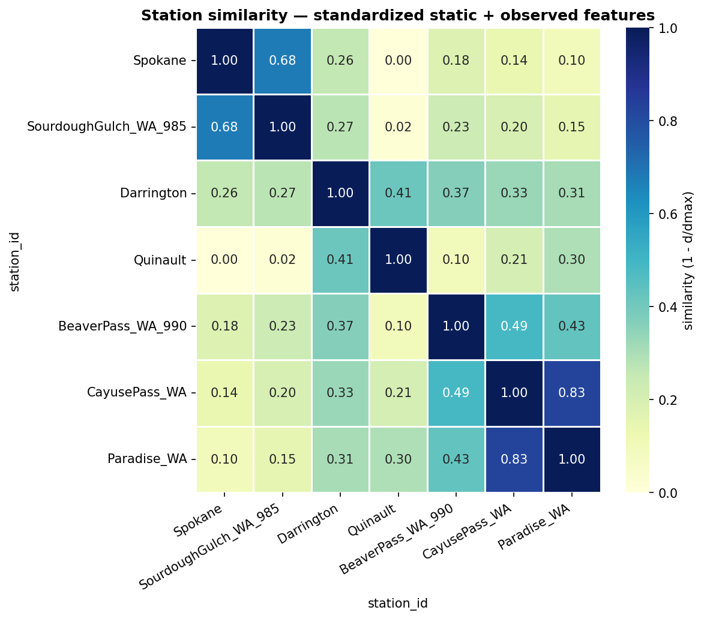

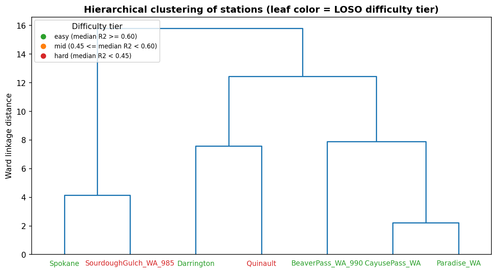

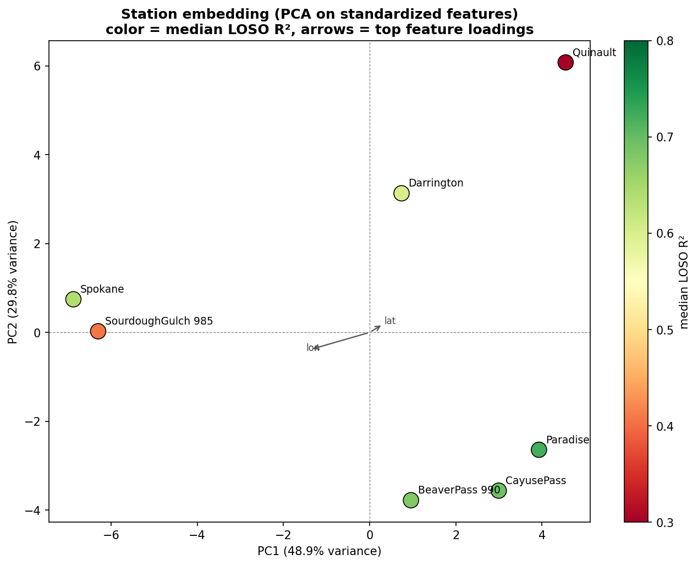

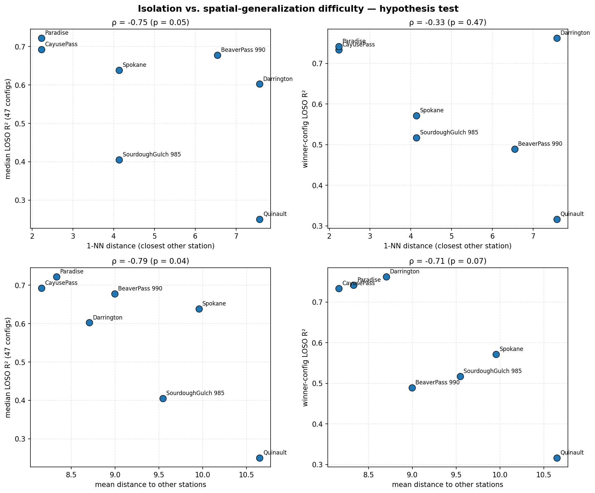

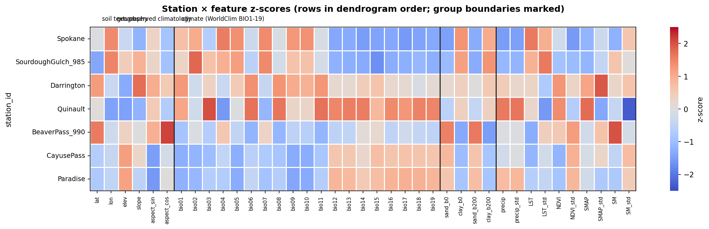

## Full-Training Baseline — Intrinsic vs. Generalization Difficulty

Every MLP configuration was also trained **without LOSO** — router and specialists fit on ALL 7
stations (the mlp-1.3 / mlp-1.1 temporal protocol: train on train 2017–2020, early-stop on val
2021–2022) and evaluated per station on the test set (`run_full_baseline.py`, same 6 configs).
This separates **intrinsic** difficulty (hard to fit even when the station's own rows are in
training) from **generalization-limited** difficulty (easy when trained on, degrades when held
out).

**Replication check:** the 2-regime configs reproduce mlp-1.3's pooled test R² **bit-identically**
(max |diff| = 0.000000, same torch 2.12.0). The 1-regime configs drift slightly from mlp-1.1's
numbers (max |diff| = 0.0686) because mlp-1.1 ran on an earlier torch version — the configs,
protocol, and seeds are identical; this is documented environment drift, not a pipeline bug.

### Station difficulty under full training (intrinsic; median over 6 configs)

| station | n_configs | total_test_n | median_r2 | mean_r2 | std_r2 | min_r2 | max_r2 | mean_rmse | mean_bias | n_negative_r2 |
|:---|:---:|:---:|:---:|:---:|:---:|:---:|:---:|:---:|:---:|:---:|
| Spokane | 6 | 5382 | 0.9198 | 0.9074 | 0.0430 | 0.8232 | 0.9424 | 0.0343 | 0.0109 | 0 |
| Darrington | 6 | 5994 | 0.8152 | 0.8003 | 0.0498 | 0.7177 | 0.8541 | 0.0415 | 0.0095 | 0 |
| CayusePass_WA | 6 | 6486 | 0.7436 | 0.7361 | 0.0277 | 0.6818 | 0.7567 | 0.0613 | -0.0021 | 0 |
| Paradise_WA | 6 | 6402 | 0.7093 | 0.6828 | 0.0872 | 0.5194 | 0.7543 | 0.0550 | 0.0264 | 0 |
| Quinault | 6 | 6264 | 0.5984 | 0.5934 | 0.1024 | 0.4163 | 0.6936 | 0.0440 | -0.0008 | 0 |
| BeaverPass_WA_990 | 6 | 3756 | 0.5719 | 0.5585 | 0.1763 | 0.3451 | 0.7603 | 0.0595 | 0.0433 | 0 |
| SourdoughGulch_WA_985 | 6 | 5436 | 0.4694 | 0.4447 | 0.1565 | 0.2202 | 0.6376 | 0.0592 | 0.0237 | 0 |

### Per-station difficulty: full training vs LOSO (sorted by LOSO difficulty)

`gap_median` / `gap_mean` = `median_r2_full − median_r2_loso` / `mean_r2_full − mean_r2_loso` is
the LOSO cost: large positive = generalization-limited; near zero = intrinsically hard; negative =
better under LOSO than full training (anomaly).

| station | median_r2_full | median_r2_loso | gap_median | mean_r2_full | mean_r2_loso | gap_mean |
|:---|:---:|:---:|:---:|:---:|:---:|:---:|
| Paradise_WA | 0.709 | 0.722 | -0.013 | 0.683 | 0.723 | -0.041 |
| CayusePass_WA | 0.744 | 0.693 | +0.051 | 0.736 | 0.644 | +0.092 |
| BeaverPass_WA_990 | 0.572 | 0.678 | -0.106 | 0.559 | 0.648 | -0.089 |
| Spokane | 0.920 | 0.639 | +0.281 | 0.907 | 0.639 | +0.268 |
| Darrington | 0.815 | 0.602 | +0.213 | 0.800 | 0.557 | +0.244 |
| SourdoughGulch_WA_985 | 0.469 | 0.406 | +0.064 | 0.445 | 0.216 | +0.228 |
| Quinault | 0.598 | 0.250 | +0.348 | 0.593 | 0.080 | +0.513 |

**Spearman(full median R², LOSO median R²) = +0.250 (p = 0.589, n = 7)** — the station-difficulty
rank order changes substantially between protocols, so LOSO difficulty is mostly
*generalization-specific* rather than intrinsic (same conclusion as eval-1.2, weaker ρ).

### Findings (n = 7, descriptive)

1. **CayusePass is no longer generalization-limited under the MLPs** — the biggest contrast with
   eval-1.2. eval-1.2's XGBoost LOSO gap for CayusePass was +0.40 (full 0.75 → LOSO 0.35); under
   the MLPs the gap is +0.05 (full 0.74 → LOSO 0.69). The smooth-extrapolating MLP transfers to
   the snow-dominated high-elevation station far better than the tree ensemble did.
2. **Quinault is the new generalization-limited station** (+0.35 gap; full 0.60 → LOSO 0.25).
   Its extreme precipitation regime (MAP 3,349 mm, the wettest station) is fit when trained on but
   the other stations cannot supply that regime when it is held out; the 96-pool residual MLP
   collapses there entirely (LOSO R² −1.51).
3. **SourdoughGulch remains intrinsically hard** (+0.06 gap, the only grassland station) — the
   same conclusion as eval-1.2.
4. **BeaverPass anomaly persists** (gap −0.11): better under LOSO than full training, exactly as
   eval-1.2 found with XGBoost — its few test rows (626) and regime overlap make pooling it into
   full training counterproductive for the MLPs too.
5. **Bottom line.** LOSO difficulty measures *transfer*, full-training difficulty measures
   *fitability*; only SourdoughGulch is hard on both axes. The MLP's spatial transfer reshapes the
   per-station difficulty map — hardest stations become the dynamic-regime outliers (Quinault,
   SourdoughGulch) rather than the static-feature outliers (CayusePass).

### Figures

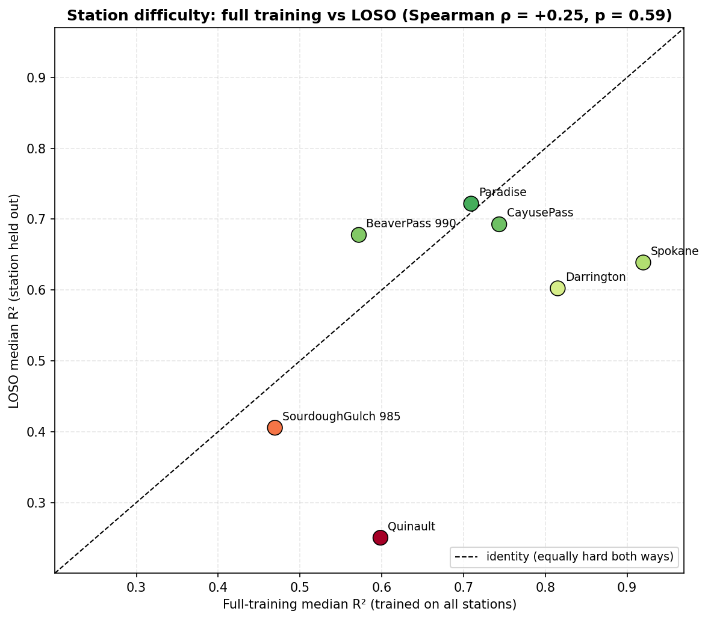

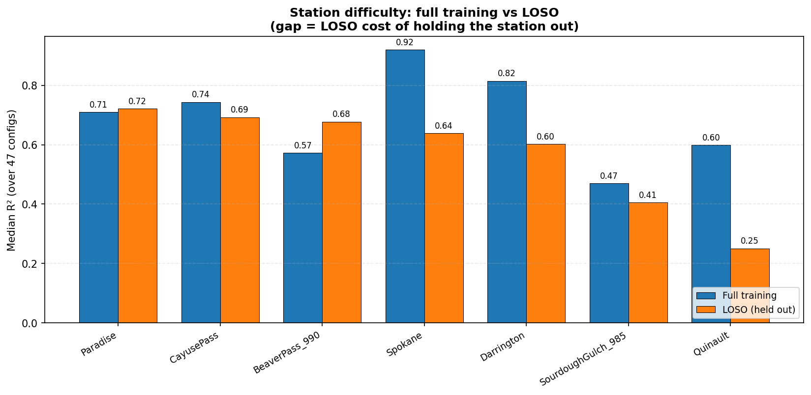

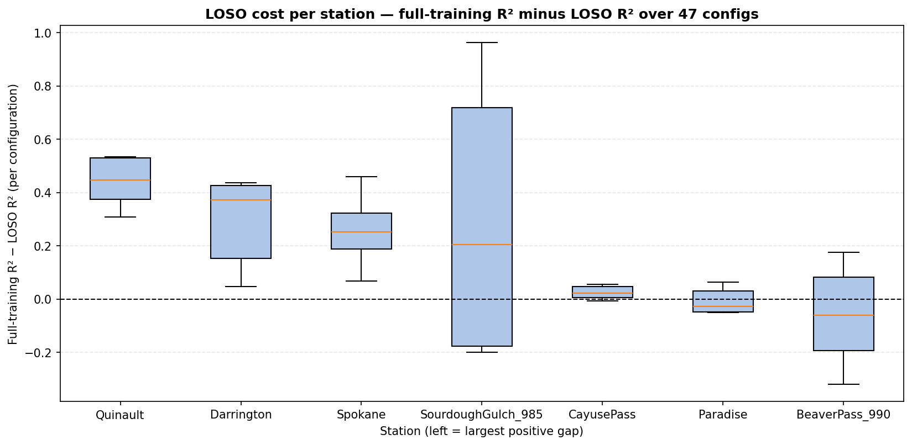

## Key Takeaways

1. **The MLP's spatial-generalization capability is confirmed, and it is regime-dependent.**
   The 2-regime-96 winner (MLP 2-Regime-96 `w512x512x512_d0.3_lr1e-3`) reaches LOSO pooled R² 0.668
   — nearly matching the XGBoost 2-regime winner (0.689) while clearly beating the XGBoost global
   single model (0.607) — with the *smallest* spatial gap of any 2-regime model (loso − temporal =
   −0.171, vs the XGBoost winner's −0.173). The 1-regime-54 global MLP (pooled 0.610) also edges
   past the XGBoost global single (0.607) and carries the smallest overall gap (−0.143).
2. **The 54-family 2-regime MLPs transfer spatially worse than their 96-family counterpart**
   (LOSO mean ≈ 0.38–0.48 vs 0.59) — a reversal of the temporal ranking, where the 54-family was
   the best MLP family (0.765–0.789). The 96-feature specialists generalize to held-out stations
   better, consistent with the mlp-1.3 OOD-extrapolation finding.
3. **The MLP flips the eval-1.2 hard-station story for CayusePass.** Under XGBoost, CayusePass was
   the hardest station (LOSO median 0.35, gap +0.40); under the MLPs it is near the easiest (0.69,
   gap +0.05). The hardest MLP stations are the dynamic-regime outliers: Quinault (0.25, gap +0.35)
   and SourdoughGulch (0.41, intrinsically hard).
4. **The station-similarity hypothesis flips sign under the MLP difficulty measure.** Isolation
   (1-NN / mean distance) correlates *negatively* with MLP median LOSO R² (nn_dist ρ = −0.75,
   p = 0.051; mean_dist ρ = −0.79, p = 0.036) — "twin → easy" holds for the MLPs, whereas eval-1.2
   found the opposite (+0.73) for the XGBoost configs.
5. **Catastrophic folds exist.** The 1-regime-96 residual MLP collapses on Quinault (LOSO R²
   −1.51) and several MLPs go strongly negative in 2025 (mean held-out-station R² −0.8 to −12.0),
   mirroring eval-1.2's finding that 2025 per-station-year R² is unstable on sparse/partial
   coverage — a data artifact to investigate, not a pure model failure.
6. **Protocol validation.** The full-training baseline replicates mlp-1.3's pooled test R²
   bit-identically for all 2-regime configs (max |diff| = 0.000000); the 1-regime drift vs mlp-1.1
   is documented torch-version environment drift. The per-regime table shows a tiny-cluster
   artifact (Spokane cluster-0 has 1 held-out test row → NaN R²) — per-regime R² on near-empty
   clusters is undefined and should be read with that caveat.

## Reproducibility

```bash
cd notebooks/experiment/derived_8.4-eval-2.0
uv run --no-sync python run_loso.py                 # full run: 6 configs x 7 stations (~6 min on H100)
uv run --no-sync python run_loso.py --max-configs 1 --max-stations 1 --smoke   # smoke test
uv run --no-sync python run_full_baseline.py        # full-training baseline (replicates mlp-1.3, ~2 min)
uv run --no-sync python run_full_baseline.py --max-configs 1 --smoke   # smoke test
```

- Configurations are pinned in `loso_configurations.json`; hyperparameters copied verbatim from the
  mlp-1.1 / mlp-1.3 config.yaml (per-family seeds {42} / {42, 7} matching the source experiments).
- Partial results are flushed to CSV after every configuration; re-running resumes completed
  (config, station) folds (validated against the current `data_version`, so stale `--smoke`
  artifacts are dropped) and recomputes summaries + figures.
- Full-training baseline: `full_*.csv` + `predictions_full/`; pooled R² validated against the
  mlp-1.3 / mlp-1.1 references (2-regime bit-identical, 1-regime documented torch drift).
- Results notebook: `derived_8.4-eval-2.0.ipynb` (execute with `nb execute --uv` from `notebooks/`).
- Artifacts: `loso_config_summary.csv`, `loso_station_summary.csv`, `loso_per_config_station.csv`,
  `loso_per_regime_metrics.csv`, `loso_per_year_metrics.csv`, `full_*.csv`, figures, per-fold
  predictions (`predictions/`, `predictions_full/`) and model checkpoints (`models/`, gitignored).

## Caveats

- Hyperparameters and cluster delta features are fixed from mlp-1.3 / mlp-1.1 (selected on the
  temporal test protocol); LOSO therefore tests spatial generalization of training/fitting, not of
  feature or hyperparameter selection.
- With only 7 stations, each fold trains on 6 — limited geographic diversity; per-station R² for a
  single fold is noisy, and per-regime R² is undefined (NaN) when a fold's router assigns 0–1 test
  rows to a cluster (e.g., Spokane cluster-0).
- The MLP LOSO uses the fold val split (6 stations, 2021–2022) for early stopping, so specialists
  train on 6-station train rows; eval-1.2's XGBoost LOSO trained on 6-station trainval — the same
  protocol asymmetry as the temporal mlp-1.3 vs eval-1.1 comparison.
- 1-regime temporal references come from mlp-1.1 (older torch); the current-torch re-runs drift
  slightly (see full-baseline validation). 2-regime references from mlp-1.3 replicate bit-identically.
- 2025 test coverage is partial for several stations; year-2025 numbers should be read with caution.
- The `w384x384_d0.3_gelu` row is a test-best reference from mlp-1.3 (selection on the temporal
  test = leakage caveat, same as mlp-1.3's test-best rows); all honest claims use the val-selected
  winners.
