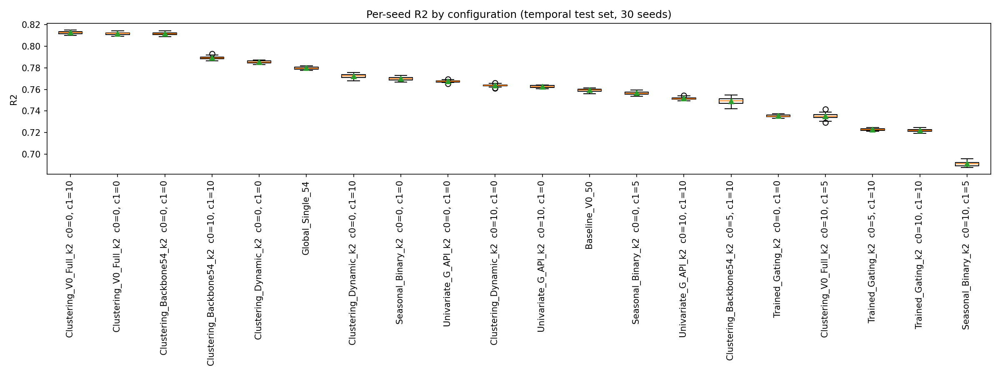
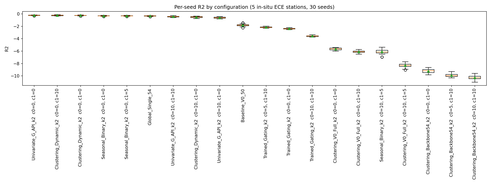
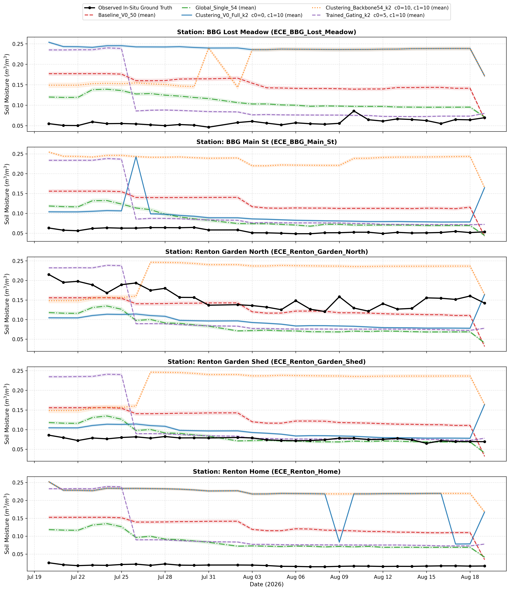
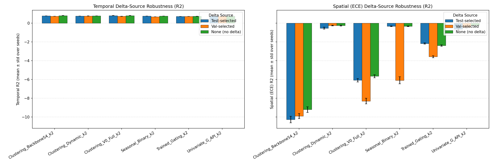
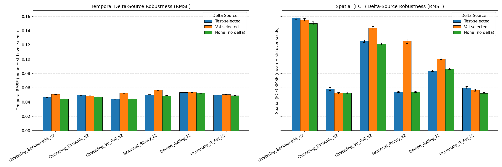

# Experiment: `derived_8.4-formal-eval-2.0-ece` — Formal Statistical Evaluation on In-Situ ECE Sensors

## Objective

Publication-oriented statistical evaluation of the claim established in `derived_8.4-eval-1.1` / `-1.3`:
**a two-regime (KMeans k=2) clustering model beats the single-regime global model and the trained-gating
model**, on the frozen temporal split (2023–2025 test) and under **in-situ spatial generalization**
across 5 newly deployed sensor stations (`derived_8.4-ece`, 150 rows across 2026-07-20 to 2026-08-19 in Bellevue and Renton, WA).

All models and routers are trained **strictly on the 7 Washington State stations** (`derived_8.4` `trainval`,
14,608 rows). The in-situ dataset `derived_8.4-ece` is **completely unseen** during training.

All tables below are copied verbatim from the stdout of the executed report notebook
(`derived_8.4-formal-eval-2.0-ece.ipynb`, executed with `nb execute --uv` from `notebooks/`).

---

## Configurations (20)

| config_id                            | strategy_name            | delta_source   |   cluster_0_count |   cluster_1_count |   n_global_features |   n_add0 |   n_add1 |
|:-------------------------------------|:-------------------------|:---------------|------------------:|------------------:|--------------------:|---------:|---------:|
| Clustering_V0_Full_k2_c0_0_c1_10     | Clustering_V0_Full_k2    | test           |                 0 |                10 |                  54 |        0 |       10 |
| Clustering_V0_Full_k2_c0_0_c1_0      | Clustering_V0_Full_k2    | none           |                 0 |                 0 |                  54 |        0 |        0 |
| Clustering_Backbone54_k2_c0_10_c1_10 | Clustering_Backbone54_k2 | test           |                10 |                10 |                  54 |       10 |       10 |
| Clustering_Backbone54_k2_c0_0_c1_0   | Clustering_Backbone54_k2 | none           |                 0 |                 0 |                  54 |        0 |        0 |
| Global_Single_54                     | Global_Single            | global         |               nan |               nan |                  54 |        0 |        0 |
| Baseline_V0_50                       | Global_Single            | global         |               nan |               nan |                  50 |        0 |        0 |
| Univariate_G_API_k2_c0_10_c1_0       | Univariate_G_API_k2      | test           |                10 |                 0 |                  54 |       10 |        0 |
| Univariate_G_API_k2_c0_0_c1_0        | Univariate_G_API_k2      | none           |                 0 |                 0 |                  54 |        0 |        0 |
| Clustering_Dynamic_k2_c0_10_c1_0     | Clustering_Dynamic_k2    | test           |                10 |                 0 |                  54 |       10 |        0 |
| Clustering_Dynamic_k2_c0_0_c1_0      | Clustering_Dynamic_k2    | none           |                 0 |                 0 |                  54 |        0 |        0 |
| Seasonal_Binary_k2_c0_0_c1_5         | Seasonal_Binary_k2       | test           |                 0 |                 5 |                  54 |        0 |        5 |
| Seasonal_Binary_k2_c0_0_c1_0         | Seasonal_Binary_k2       | none           |                 0 |                 0 |                  54 |        0 |        0 |
| Trained_Gating_k2_c0_5_c1_10         | Trained_Gating_k2        | test           |                 5 |                10 |                  54 |        5 |       10 |
| Trained_Gating_k2_c0_0_c1_0          | Trained_Gating_k2        | none           |                 0 |                 0 |                  54 |        0 |        0 |
| Clustering_V0_Full_k2_val_winner     | Clustering_V0_Full_k2    | val            |                10 |                 5 |                  54 |       10 |        5 |
| Clustering_Backbone54_k2_val_winner  | Clustering_Backbone54_k2 | val            |                 5 |                10 |                  54 |        5 |       10 |
| Clustering_Dynamic_k2_val_winner     | Clustering_Dynamic_k2    | val            |                 0 |                10 |                  54 |        0 |       10 |
| Univariate_G_API_k2_val_winner       | Univariate_G_API_k2      | val            |                10 |                10 |                  54 |       10 |       10 |
| Seasonal_Binary_k2_val_winner        | Seasonal_Binary_k2       | val            |                10 |                 5 |                  54 |       10 |        5 |
| Trained_Gating_k2_val_winner         | Trained_Gating_k2        | val            |                10 |                10 |                  54 |       10 |       10 |

---

## Protocol

- **Training:** Models and routers trained strictly on the 7 Washington state stations from `derived_8.4`
  (`trainval`, 2017–2022, 14,608 rows). `derived_8.4-ece` is **completely unseen** during training.
- **Temporal evaluation:** Evaluated on the frozen Washington test set (2023–2025, 6,620 rows, 7 WA stations),
  **30 random seeds** (seeds 42, 7, 13, ..., 2222; seed 42 included as exact replication anchor vs eval-1.1).
- **Spatial evaluation:** Evaluated on all 5 in-situ stations from `derived_8.4-ece` (150 rows across
  2026-07-20 to 2026-08-19 in Bellevue and Renton, WA), **30 random seeds**.
- **Delta-robustness:** per-regime delta features from three selection sources — *test-selected*,
  *val-selected* (re-ranked on validation-period residuals, train-only fits), *none*.
- **Seed scope:** only the XGBoost expert regressors' `random_state` varies; routers (KMeans / gating
  classifier) stay at seed 42 because the delta additions are tied to the seed-42 cluster labels.
- **Statistics:** seed-level (mean ± std, median, 95% t-CI, paired t-test, Wilcoxon signed-rank,
  % seeds A better), sample-level (paired cluster bootstrap over (station, date) blocks, percentile
  95% CI + bootstrap p), Benjamini–Hochberg FDR over the pre-specified comparison family, Spatial
  per-station win counts + two-sided binomial sign test (n = 5; 5/5 → p ≈ 0.0625, 4/5 → p ≈ 0.3750).

---

## Temporal results (Washington test set, 2023–2025, 30 seeds)

### Seed-level summary — R² (mean ± std over seeds, [95% t-CI])
| config_label                           | delta_source   |   n_seeds | mean_std        |   median | ci               |
|:---------------------------------------|:---------------|----------:|:----------------|---------:|:-----------------|
| Clustering_V0_Full_k2  c0=0, c1=10     | test           |        30 | 0.8126 ± 0.0013 | 0.812762 | [0.8122, 0.8131] |
| Clustering_V0_Full_k2  c0=0, c1=0      | none           |        30 | 0.8118 ± 0.0014 | 0.811928 | [0.8113, 0.8124] |
| Clustering_Backbone54_k2  c0=0, c1=0   | none           |        30 | 0.8117 ± 0.0014 | 0.811832 | [0.8112, 0.8122] |
| Clustering_Backbone54_k2  c0=10, c1=10 | test           |        30 | 0.7893 ± 0.0014 | 0.789366 | [0.7888, 0.7899] |
| Clustering_Dynamic_k2  c0=0, c1=0      | none           |        30 | 0.7855 ± 0.0010 | 0.785356 | [0.7851, 0.7858] |
| Global_Single_54                       | global         |        30 | 0.7798 ± 0.0013 | 0.779674 | [0.7793, 0.7803] |
| Clustering_Dynamic_k2  c0=0, c1=10     | val            |        30 | 0.7723 ± 0.0019 | 0.772677 | [0.7716, 0.7730] |
| Seasonal_Binary_k2  c0=0, c1=0         | none           |        30 | 0.7700 ± 0.0016 | 0.770019 | [0.7694, 0.7706] |
| Univariate_G_API_k2  c0=0, c1=0        | none           |        30 | 0.7676 ± 0.0009 | 0.76754  | [0.7672, 0.7679] |
| Clustering_Dynamic_k2  c0=10, c1=0     | test           |        30 | 0.7638 ± 0.0011 | 0.763858 | [0.7634, 0.7642] |
| Univariate_G_API_k2  c0=10, c1=0       | test           |        30 | 0.7627 ± 0.0011 | 0.762707 | [0.7623, 0.7631] |
| Baseline_V0_50                         | global         |        30 | 0.7593 ± 0.0015 | 0.759359 | [0.7588, 0.7599] |
| Seasonal_Binary_k2  c0=0, c1=5         | test           |        30 | 0.7566 ± 0.0014 | 0.756557 | [0.7561, 0.7571] |
| Univariate_G_API_k2  c0=10, c1=10      | val            |        30 | 0.7517 ± 0.0012 | 0.751517 | [0.7512, 0.7521] |
| Clustering_Backbone54_k2  c0=5, c1=10  | val            |        30 | 0.7490 ± 0.0031 | 0.749295 | [0.7478, 0.7501] |
| Trained_Gating_k2  c0=0, c1=0          | none           |        30 | 0.7354 ± 0.0011 | 0.735156 | [0.7350, 0.7358] |
| Clustering_V0_Full_k2  c0=10, c1=5     | val            |        30 | 0.7351 ± 0.0025 | 0.7351   | [0.7342, 0.7361] |
| Trained_Gating_k2  c0=5, c1=10         | test           |        30 | 0.7227 ± 0.0009 | 0.722885 | [0.7224, 0.7231] |
| Trained_Gating_k2  c0=10, c1=10        | val            |        30 | 0.7220 ± 0.0014 | 0.722079 | [0.7215, 0.7225] |
| Seasonal_Binary_k2  c0=10, c1=5        | val            |        30 | 0.6909 ± 0.0020 | 0.690963 | [0.6901, 0.6916] |

### Seed-level summary — RMSE / MAE / bias (m³/m³; lower is better except bias sign)
| config_label                           | delta_source   |   n_seeds | RMSE mean ± std   |   RMSE median | MAE mean ± std    |   MAE median | BIAS mean ± std   |   BIAS median |
|:---------------------------------------|:---------------|----------:|:------------------|--------------:|:------------------|-------------:|:------------------|--------------:|
| Clustering_V0_Full_k2  c0=0, c1=10     | test           |        30 | 0.04409 ± 0.00016 |     0.0440792 | 0.03392 ± 0.00011 |    0.0339159 | 0.00660 ± 0.00024 |    0.00658228 |
| Clustering_V0_Full_k2  c0=0, c1=0      | none           |        30 | 0.04419 ± 0.00016 |     0.0441771 | 0.03398 ± 0.00011 |    0.0339656 | 0.00596 ± 0.00022 |    0.0059814  |
| Clustering_Backbone54_k2  c0=0, c1=0   | none           |        30 | 0.04420 ± 0.00016 |     0.0441885 | 0.03398 ± 0.00011 |    0.0339709 | 0.00598 ± 0.00022 |    0.00599854 |
| Clustering_Backbone54_k2  c0=10, c1=10 | test           |        30 | 0.04676 ± 0.00016 |     0.046752  | 0.03579 ± 0.00012 |    0.0358191 | 0.00707 ± 0.00024 |    0.00707422 |
| Clustering_Dynamic_k2  c0=0, c1=0      | none           |        30 | 0.04718 ± 0.00011 |     0.0471949 | 0.03631 ± 0.00010 |    0.0363103 | 0.00958 ± 0.00021 |    0.00956118 |
| Global_Single_54                       | global         |        30 | 0.04780 ± 0.00014 |     0.0478155 | 0.03694 ± 0.00012 |    0.0369541 | 0.01004 ± 0.00032 |    0.0100552  |
| Clustering_Dynamic_k2  c0=0, c1=10     | val            |        30 | 0.04861 ± 0.00021 |     0.0485688 | 0.03736 ± 0.00016 |    0.0373542 | 0.01213 ± 0.00031 |    0.0121233  |
| Seasonal_Binary_k2  c0=0, c1=0         | none           |        30 | 0.04885 ± 0.00017 |     0.048852  | 0.03767 ± 0.00013 |    0.0376961 | 0.01071 ± 0.00021 |    0.0107012  |
| Univariate_G_API_k2  c0=0, c1=0        | none           |        30 | 0.04911 ± 0.00010 |     0.0491146 | 0.03815 ± 0.00008 |    0.0381569 | 0.01063 ± 0.00024 |    0.0106203  |
| Clustering_Dynamic_k2  c0=10, c1=0     | test           |        30 | 0.04951 ± 0.00012 |     0.049502  | 0.03873 ± 0.00011 |    0.0387046 | 0.00966 ± 0.00024 |    0.00966423 |
| Univariate_G_API_k2  c0=10, c1=0       | test           |        30 | 0.04962 ± 0.00011 |     0.0496225 | 0.03852 ± 0.00011 |    0.0385211 | 0.01130 ± 0.00022 |    0.0112902  |
| Baseline_V0_50                         | global         |        30 | 0.04997 ± 0.00015 |     0.0499713 | 0.03830 ± 0.00011 |    0.038278  | 0.00958 ± 0.00026 |    0.00959518 |
| Seasonal_Binary_k2  c0=0, c1=5         | test           |        30 | 0.05026 ± 0.00014 |     0.0502614 | 0.03875 ± 0.00013 |    0.038728  | 0.01079 ± 0.00021 |    0.0107854  |
| Univariate_G_API_k2  c0=10, c1=10      | val            |        30 | 0.05076 ± 0.00012 |     0.050779  | 0.03948 ± 0.00011 |    0.0394881 | 0.01157 ± 0.00019 |    0.0115562  |
| Clustering_Backbone54_k2  c0=5, c1=10  | val            |        30 | 0.05104 ± 0.00031 |     0.0510056 | 0.03883 ± 0.00019 |    0.0388452 | 0.00893 ± 0.00030 |    0.00895874 |
| Trained_Gating_k2  c0=0, c1=0          | none           |        30 | 0.05240 ± 0.00011 |     0.0524241 | 0.03882 ± 0.00009 |    0.0388224 | 0.01453 ± 0.00018 |    0.0145035  |
| Clustering_V0_Full_k2  c0=10, c1=5     | val            |        30 | 0.05243 ± 0.00025 |     0.0524297 | 0.03943 ± 0.00014 |    0.0394353 | 0.00758 ± 0.00021 |    0.00758365 |
| Trained_Gating_k2  c0=5, c1=10         | test           |        30 | 0.05364 ± 0.00009 |     0.0536248 | 0.04035 ± 0.00007 |    0.0403555 | 0.01571 ± 0.00015 |    0.0156895  |
| Trained_Gating_k2  c0=10, c1=10        | val            |        30 | 0.05371 ± 0.00013 |     0.0537028 | 0.04112 ± 0.00011 |    0.0410982 | 0.01663 ± 0.00021 |    0.0166027  |
| Seasonal_Binary_k2  c0=10, c1=5        | val            |        30 | 0.05664 ± 0.00018 |     0.0566293 | 0.04220 ± 0.00012 |    0.0421812 | 0.01003 ± 0.00017 |    0.00999082 |

### Focused temporal pairwise comparisons

Focused pairwise comparisons (R²; mean diff A−B, [95% CI], paired t p, Wilcoxon p, % seeds A better, q = BH-FDR)
| A                                    | B                                   | metric   |   mean_A |   mean_B |   mean_diff | ci                   |     t_p |   wilcoxon_p |   pct_A_better |    q_bh |
|:-------------------------------------|:------------------------------------|:---------|---------:|---------:|------------:|:---------------------|--------:|-------------:|---------------:|--------:|
| Clustering_V0_Full_k2_c0_0_c1_10     | Trained_Gating_k2_c0_5_c1_10        | R2       |  0.81264 |  0.72274 |     0.08990 | [0.08935, 0.09046]   | 0.00000 |      0.00000 |      100.00000 | 0.00000 |
| Clustering_V0_Full_k2_c0_0_c1_0      | Trained_Gating_k2_c0_5_c1_10        | R2       |  0.81184 |  0.72274 |     0.08910 | [0.08855, 0.08965]   | 0.00000 |      0.00000 |      100.00000 | 0.00000 |
| Clustering_Backbone54_k2_c0_0_c1_0   | Trained_Gating_k2_c0_5_c1_10        | R2       |  0.81172 |  0.72274 |     0.08898 | [0.08843, 0.08953]   | 0.00000 |      0.00000 |      100.00000 | 0.00000 |
| Clustering_V0_Full_k2_c0_0_c1_10     | Global_Single_54                    | R2       |  0.81264 |  0.77979 |     0.03285 | [0.03213, 0.03357]   | 0.00000 |      0.00000 |      100.00000 | 0.00000 |
| Clustering_V0_Full_k2_c0_0_c1_0      | Global_Single_54                    | R2       |  0.81184 |  0.77979 |     0.03205 | [0.03131, 0.03279]   | 0.00000 |      0.00000 |      100.00000 | 0.00000 |
| Clustering_Backbone54_k2_c0_0_c1_0   | Global_Single_54                    | R2       |  0.81172 |  0.77979 |     0.03193 | [0.03119, 0.03267]   | 0.00000 |      0.00000 |      100.00000 | 0.00000 |
| Clustering_Backbone54_k2_c0_10_c1_10 | Global_Single_54                    | R2       |  0.78932 |  0.77979 |     0.00952 | [0.00882, 0.01022]   | 0.00000 |      0.00000 |      100.00000 | 0.00000 |
| Clustering_Backbone54_k2_c0_10_c1_10 | Baseline_V0_50                      | R2       |  0.78932 |  0.75934 |     0.02998 | [0.02920, 0.03076]   | 0.00000 |      0.00000 |      100.00000 | 0.00000 |
| Clustering_V0_Full_k2_c0_0_c1_10     | Baseline_V0_50                      | R2       |  0.81264 |  0.75934 |     0.05331 | [0.05255, 0.05406]   | 0.00000 |      0.00000 |      100.00000 | 0.00000 |
| Global_Single_54                     | Baseline_V0_50                      | R2       |  0.77979 |  0.75934 |     0.02046 | [0.01975, 0.02117]   | 0.00000 |      0.00000 |      100.00000 | 0.00000 |
| Global_Single_54                     | Trained_Gating_k2_c0_5_c1_10        | R2       |  0.77979 |  0.72274 |     0.05705 | [0.05643, 0.05767]   | 0.00000 |      0.00000 |      100.00000 | 0.00000 |
| Clustering_V0_Full_k2_c0_0_c1_10     | Clustering_V0_Full_k2_c0_0_c1_0     | R2       |  0.81264 |  0.81184 |     0.00080 | [0.00064, 0.00097]   | 0.00000 |      0.00000 |      100.00000 | 0.00000 |
| Clustering_V0_Full_k2_c0_0_c1_10     | Clustering_V0_Full_k2_val_winner    | R2       |  0.81264 |  0.73512 |     0.07752 | [0.07663, 0.07841]   | 0.00000 |      0.00000 |      100.00000 | 0.00000 |
| Clustering_Backbone54_k2_c0_0_c1_0   | Clustering_Backbone54_k2_val_winner | R2       |  0.81172 |  0.74897 |     0.06275 | [0.06156, 0.06395]   | 0.00000 |      0.00000 |      100.00000 | 0.00000 |
| Clustering_Dynamic_k2_c0_0_c1_0      | Clustering_Dynamic_k2_val_winner    | R2       |  0.78546 |  0.77228 |     0.01318 | [0.01238, 0.01398]   | 0.00000 |      0.00000 |      100.00000 | 0.00000 |
| Seasonal_Binary_k2_c0_0_c1_0         | Seasonal_Binary_k2_val_winner       | R2       |  0.77002 |  0.69087 |     0.07914 | [0.07832, 0.07997]   | 0.00000 |      0.00000 |      100.00000 | 0.00000 |
| Univariate_G_API_k2_c0_0_c1_0        | Univariate_G_API_k2_val_winner      | R2       |  0.76757 |  0.75166 |     0.01591 | [0.01540, 0.01642]   | 0.00000 |      0.00000 |      100.00000 | 0.00000 |
| Trained_Gating_k2_c0_0_c1_0          | Trained_Gating_k2_val_winner        | R2       |  0.73536 |  0.72198 |     0.01338 | [0.01284, 0.01392]   | 0.00000 |      0.00000 |      100.00000 | 0.00000 |
| Clustering_Dynamic_k2_val_winner     | Global_Single_54                    | R2       |  0.77228 |  0.77979 |    -0.00751 | [-0.00840, -0.00662] | 0.00000 |      0.00000 |        0.00000 | 0.00000 |
| Clustering_Backbone54_k2_val_winner  | Global_Single_54                    | R2       |  0.74897 |  0.77979 |    -0.03083 | [-0.03205, -0.02960] | 0.00000 |      0.00000 |        0.00000 | 0.00000 |
| Clustering_V0_Full_k2_val_winner     | Global_Single_54                    | R2       |  0.73512 |  0.77979 |    -0.04467 | [-0.04565, -0.04370] | 0.00000 |      0.00000 |        0.00000 | 0.00000 |

### Temporal sample-level bootstrap (paired cluster bootstrap over (station, month) blocks; seed-42 fits)

Sample-level paired cluster bootstrap over (station, month) blocks (seed 42):
| A                                    | B                            | metric   |   diff_mean | diff CI              |   bootstrap_p |
|:-------------------------------------|:-----------------------------|:---------|------------:|:---------------------|--------------:|
| Clustering_V0_Full_k2_c0_0_c1_10     | Global_Single_54             | R2       |     0.03627 | [0.01869, 0.05901]   |       0.00050 |
| Clustering_V0_Full_k2_c0_0_c1_10     | Global_Single_54             | RMSE     |    -0.00404 | [-0.00635, -0.00217] |       0.00050 |
| Clustering_V0_Full_k2_c0_0_c1_10     | Global_Single_54             | BIAS     |    -0.00406 | [-0.00623, -0.00201] |       0.00050 |
| Clustering_Backbone54_k2_c0_10_c1_10 | Global_Single_54             | R2       |     0.01070 | [-0.01252, 0.03555]  |       0.37400 |
| Clustering_Backbone54_k2_c0_10_c1_10 | Global_Single_54             | RMSE     |    -0.00114 | [-0.00366, 0.00143]  |       0.37400 |
| Clustering_Backbone54_k2_c0_10_c1_10 | Global_Single_54             | BIAS     |    -0.00334 | [-0.00565, -0.00107] |       0.00700 |
| Clustering_V0_Full_k2_c0_0_c1_10     | Trained_Gating_k2_c0_5_c1_10 | R2       |     0.09269 | [0.05821, 0.13511]   |       0.00050 |
| Clustering_V0_Full_k2_c0_0_c1_10     | Trained_Gating_k2_c0_5_c1_10 | RMSE     |    -0.00970 | [-0.01284, -0.00668] |       0.00050 |
| Clustering_V0_Full_k2_c0_0_c1_10     | Trained_Gating_k2_c0_5_c1_10 | BIAS     |    -0.00895 | [-0.01322, -0.00502] |       0.00050 |
| Clustering_Backbone54_k2_c0_10_c1_10 | Baseline_V0_50               | R2       |     0.02915 | [0.01077, 0.04939]   |       0.00100 |
| Clustering_Backbone54_k2_c0_10_c1_10 | Baseline_V0_50               | RMSE     |    -0.00310 | [-0.00503, -0.00108] |       0.00100 |
| Clustering_Backbone54_k2_c0_10_c1_10 | Baseline_V0_50               | BIAS     |    -0.00267 | [-0.00557, 0.00032]  |       0.07900 |

---

## In-Situ ECE Spatial results (5 unseen stations, 2026, 30 seeds)

### In-Situ ECE Spatial Summary (5 stations, 150 rows, 30 seeds)
| config_label                           | delta_source   |   spatial_mean_r2 |   spatial_median_r2 |   spatial_mean_rmse |   spatial_mean_mae |   spatial_mean_bias | pooled_r2_mean_std   |   pooled_r2_median |
|:---------------------------------------|:---------------|------------------:|--------------------:|--------------------:|-------------------:|--------------------:|:---------------------|-------------------:|
| Univariate_G_API_k2  c0=0, c1=0        | none           |         -169.4859 |            -30.3436 |              0.0479 |             0.0447 |              0.0147 | -0.2373 ± 0.0406     |            -0.2281 |
| Clustering_Dynamic_k2  c0=0, c1=10     | val            |         -173.9305 |            -36.6019 |              0.0481 |             0.0453 |              0.0168 | -0.2470 ± 0.0471     |            -0.2416 |
| Clustering_Dynamic_k2  c0=0, c1=0      | none           |         -177.5309 |            -37.8208 |              0.0483 |             0.0454 |              0.0173 | -0.2531 ± 0.0485     |            -0.2467 |
| Seasonal_Binary_k2  c0=0, c1=5         | test           |         -177.9475 |            -38.6897 |              0.0503 |             0.0457 |              0.0155 | -0.3229 ± 0.0458     |            -0.3218 |
| Seasonal_Binary_k2  c0=0, c1=0         | none           |         -177.9475 |            -38.6897 |              0.0503 |             0.0457 |              0.0155 | -0.3229 ± 0.0458     |            -0.3218 |
| Global_Single_54                       | global         |         -181.1471 |            -38.6626 |              0.0511 |             0.0467 |              0.0169 | -0.3505 ± 0.0467     |            -0.3468 |
| Univariate_G_API_k2  c0=10, c1=10      | val            |         -246.4401 |            -34.4789 |              0.0529 |             0.0503 |              0.0277 | -0.4449 ± 0.0731     |            -0.4260 |
| Clustering_Dynamic_k2  c0=10, c1=0     | test           |         -283.7163 |            -44.2606 |              0.0547 |             0.0531 |              0.0332 | -0.5326 ± 0.1063     |            -0.5053 |
| Univariate_G_API_k2  c0=10, c1=0       | test           |         -307.4673 |            -56.4125 |              0.0570 |             0.0552 |              0.0364 | -0.6298 ± 0.1008     |            -0.6369 |
| Baseline_V0_50                         | global         |         -484.7925 |           -160.5319 |              0.0744 |             0.0709 |              0.0591 | -1.8212 ± 0.1759     |            -1.8140 |
| Trained_Gating_k2  c0=5, c1=10         | test           |         -508.1016 |           -205.7340 |              0.0822 |             0.0588 |              0.0373 | -2.1626 ± 0.0736     |            -2.1711 |
| Trained_Gating_k2  c0=0, c1=0          | none           |         -531.5417 |           -222.5888 |              0.0853 |             0.0608 |              0.0351 | -2.3923 ± 0.0787     |            -2.4027 |
| Trained_Gating_k2  c0=10, c1=10        | val            |         -685.7310 |           -299.9296 |              0.0996 |             0.0660 |              0.0410 | -3.5782 ± 0.1031     |            -3.5710 |
| Seasonal_Binary_k2  c0=10, c1=5        | val            |        -1241.3441 |           -550.3814 |              0.1187 |             0.1160 |              0.1142 | -6.0908 ± 0.3754     |            -6.1262 |
| Clustering_V0_Full_k2  c0=0, c1=0      | none           |        -1342.5551 |            -73.3724 |              0.1004 |             0.0955 |              0.0713 | -5.6554 ± 0.1654     |            -5.6247 |
| Clustering_V0_Full_k2  c0=0, c1=10     | test           |        -1378.2243 |            -81.3717 |              0.1036 |             0.0984 |              0.0742 | -6.0841 ± 0.1862     |            -6.0979 |
| Clustering_V0_Full_k2  c0=10, c1=5     | val            |        -1702.8801 |           -520.3969 |              0.1302 |             0.1286 |              0.1280 | -8.3081 ± 0.2972     |            -8.3059 |
| Clustering_Backbone54_k2  c0=0, c1=0   | none           |        -1763.3418 |           -843.3092 |              0.1441 |             0.1386 |              0.1309 | -9.2134 ± 0.3048     |            -9.1598 |
| Clustering_Backbone54_k2  c0=10, c1=10 | test           |        -1851.9570 |          -1027.9095 |              0.1526 |             0.1493 |              0.1455 | -10.2751 ± 0.3573    |           -10.2839 |
| Clustering_Backbone54_k2  c0=5, c1=10  | val            |        -1869.7341 |           -954.4420 |              0.1492 |             0.1463 |              0.1445 | -9.9058 ± 0.2731     |            -9.9574 |

### Per-station breakdown across 5 In-Situ ECE stations

### In-Situ ECE Station Difficulty Ranking (median R² over 20 configurations)
| station_id              |   n_configs |   median_r2 |    mean_r2 |    std_r2 |     min_r2 |    max_r2 |   mean_rmse |   mean_bias |
|:------------------------|------------:|------------:|-----------:|----------:|-----------:|----------:|------------:|------------:|
| ECE_Renton_Garden_North |          20 |     -6.2846 |    -5.5749 |    2.4672 |    -9.7118 |   -0.8374 |      0.0650 |     -0.0317 |
| ECE_Renton_Garden_Shed  |          20 |    -50.3365 |  -271.4581 |  346.1902 | -1030.8590 |  -12.6599 |      0.0598 |      0.0475 |
| ECE_BBG_Main_St         |          20 |    -82.2161 |  -277.5030 |  342.2419 | -1027.9095 |  -30.3436 |      0.0789 |      0.0712 |
| ECE_BBG_Lost_Meadow     |          20 |   -125.8100 |  -193.0608 |  179.9890 |  -555.4263 |  -34.4789 |      0.0952 |      0.0856 |
| ECE_Renton_Home         |          20 |  -1950.3022 | -3066.3574 | 2571.1114 | -7034.4153 | -755.6988 |      0.1263 |      0.1211 |

### Per-Configuration × Per-Station R² Matrix (5 ECE stations)
| config_id                            |   ECE_BBG_Lost_Meadow |   ECE_BBG_Main_St |   ECE_Renton_Garden_North |   ECE_Renton_Garden_Shed |   ECE_Renton_Home |
|:-------------------------------------|----------------------:|------------------:|--------------------------:|-------------------------:|------------------:|
| Univariate_G_API_k2_c0_0_c1_0        |               -38.788 |           -30.344 |                    -6.883 |                  -15.716 |          -755.699 |
| Clustering_Dynamic_k2_val_winner     |               -38.936 |           -36.602 |                    -6.646 |                  -12.660 |          -774.809 |
| Clustering_Dynamic_k2_c0_0_c1_0      |               -38.780 |           -37.821 |                    -6.497 |                  -14.063 |          -790.494 |
| Seasonal_Binary_k2_c0_0_c1_5         |               -44.480 |           -38.690 |                    -6.935 |                  -23.277 |          -776.356 |
| Seasonal_Binary_k2_c0_0_c1_0         |               -44.480 |           -38.690 |                    -6.935 |                  -23.277 |          -776.356 |
| Global_Single_54                     |               -50.479 |           -38.663 |                    -6.917 |                  -23.937 |          -785.741 |
| Univariate_G_API_k2_val_winner       |               -34.479 |           -71.310 |                    -4.920 |                  -32.653 |         -1088.838 |
| Clustering_Dynamic_k2_c0_10_c1_0     |               -41.093 |           -81.835 |                    -3.456 |                  -44.261 |         -1247.936 |
| Univariate_G_API_k2_c0_10_c1_0       |               -56.010 |           -82.597 |                    -2.832 |                  -56.412 |         -1339.485 |
| Baseline_V0_50                       |              -160.532 |          -170.302 |                    -0.954 |                 -151.498 |         -1940.677 |
| Trained_Gating_k2_c0_5_c1_10         |              -121.653 |          -205.734 |                    -5.151 |                 -248.044 |         -1959.927 |
| Trained_Gating_k2_c0_0_c1_0          |              -129.967 |          -222.589 |                    -6.073 |                 -267.639 |         -2031.440 |
| Trained_Gating_k2_val_winner         |              -190.222 |          -299.930 |                    -7.745 |                 -429.125 |         -2501.634 |
| Seasonal_Binary_k2_val_winner        |              -289.287 |          -550.381 |                    -2.137 |                 -642.536 |         -4722.380 |
| Clustering_V0_Full_k2_c0_0_c1_0      |              -483.284 |           -73.372 |                    -5.201 |                  -33.201 |         -6117.717 |
| Clustering_V0_Full_k2_c0_0_c1_10     |              -555.426 |           -81.372 |                    -5.195 |                  -32.373 |         -6216.756 |
| Clustering_V0_Full_k2_val_winner     |              -520.397 |          -519.887 |                    -0.837 |                 -549.879 |         -6923.400 |
| Clustering_Backbone54_k2_c0_0_c1_0   |              -283.749 |          -956.016 |                    -9.151 |                 -843.309 |         -6724.484 |
| Clustering_Backbone54_k2_c0_10_c1_10 |              -372.703 |         -1027.910 |                    -9.712 |                -1030.859 |         -6818.602 |
| Clustering_Backbone54_k2_val_winner  |              -366.472 |          -986.018 |                    -7.323 |                 -954.442 |         -7034.415 |

### Focused Spatial pairwise tests (5 In-Situ ECE stations)

Focused Spatial R2 comparisons — wins 'k of 5 stations', sign test p, paired t p, Wilcoxon p, q = BH-FDR
| A                                    | B                                   | metric   |   n_stations |   mean_diff |   wins |   sign_p |    t_p |   wilcoxon_p |   q_bh |
|:-------------------------------------|:------------------------------------|:---------|-------------:|------------:|-------:|---------:|-------:|-------------:|-------:|
| Seasonal_Binary_k2_c0_0_c1_0         | Seasonal_Binary_k2_val_winner       | R2       |            5 |   1063.3966 |      4 |   0.3750 | 0.2183 |       0.1250 | 0.3721 |
| Global_Single_54                     | Trained_Gating_k2_c0_5_c1_10        | R2       |            5 |    326.9545 |      4 |   0.3750 | 0.2035 |       0.1250 | 0.3721 |
| Clustering_V0_Full_k2_c0_0_c1_10     | Clustering_V0_Full_k2_val_winner    | R2       |            5 |    324.6558 |      3 |   1.0000 | 0.0922 |       0.3125 | 0.3721 |
| Global_Single_54                     | Baseline_V0_50                      | R2       |            5 |    303.6453 |      4 |   0.3750 | 0.2295 |       0.1250 | 0.3721 |
| Trained_Gating_k2_c0_0_c1_0          | Trained_Gating_k2_val_winner        | R2       |            5 |    154.1893 |      5 |   0.0625 | 0.1369 |       0.0625 | 0.3721 |
| Clustering_Backbone54_k2_c0_0_c1_0   | Clustering_Backbone54_k2_val_winner | R2       |            5 |    106.3922 |      4 |   0.3750 | 0.1230 |       0.1250 | 0.3721 |
| Univariate_G_API_k2_c0_0_c1_0        | Univariate_G_API_k2_val_winner      | R2       |            5 |     76.9542 |      3 |   1.0000 | 0.2992 |       0.3125 | 0.3750 |
| Clustering_Dynamic_k2_val_winner     | Global_Single_54                    | R2       |            5 |      7.2166 |      5 |   0.0625 | 0.0441 |       0.0625 | 0.3721 |
| Clustering_Dynamic_k2_c0_0_c1_0      | Clustering_Dynamic_k2_val_winner    | R2       |            5 |     -3.6004 |      2 |   1.0000 | 0.3017 |       0.3125 | 0.3750 |
| Clustering_V0_Full_k2_c0_0_c1_10     | Clustering_V0_Full_k2_c0_0_c1_0     | R2       |            5 |    -35.6692 |      2 |   1.0000 | 0.1627 |       0.3125 | 0.3721 |
| Clustering_V0_Full_k2_c0_0_c1_0      | Trained_Gating_k2_c0_5_c1_10        | R2       |            5 |   -834.4535 |      2 |   1.0000 | 0.3750 |       0.6250 | 0.3750 |
| Clustering_V0_Full_k2_c0_0_c1_10     | Trained_Gating_k2_c0_5_c1_10        | R2       |            5 |   -870.1227 |      2 |   1.0000 | 0.3659 |       0.6250 | 0.3750 |
| Clustering_V0_Full_k2_c0_0_c1_10     | Baseline_V0_50                      | R2       |            5 |   -893.4318 |      2 |   1.0000 | 0.3528 |       0.6250 | 0.3750 |
| Clustering_V0_Full_k2_c0_0_c1_0      | Global_Single_54                    | R2       |            5 |  -1161.4079 |      1 |   0.3750 | 0.3290 |       0.1250 | 0.3750 |
| Clustering_V0_Full_k2_c0_0_c1_10     | Global_Single_54                    | R2       |            5 |  -1197.0772 |      1 |   0.3750 | 0.3230 |       0.1250 | 0.3750 |
| Clustering_Backbone54_k2_c0_0_c1_0   | Trained_Gating_k2_c0_5_c1_10        | R2       |            5 |  -1255.2402 |      0 |   0.0625 | 0.2303 |       0.0625 | 0.3721 |
| Clustering_Backbone54_k2_c0_10_c1_10 | Baseline_V0_50                      | R2       |            5 |  -1367.1645 |      0 |   0.0625 | 0.2011 |       0.0625 | 0.3721 |
| Clustering_V0_Full_k2_val_winner     | Global_Single_54                    | R2       |            5 |  -1521.7330 |      1 |   0.3750 | 0.2591 |       0.1250 | 0.3750 |
| Clustering_Backbone54_k2_c0_0_c1_0   | Global_Single_54                    | R2       |            5 |  -1582.1947 |      0 |   0.0625 | 0.2247 |       0.0625 | 0.3721 |
| Clustering_Backbone54_k2_c0_10_c1_10 | Global_Single_54                    | R2       |            5 |  -1670.8098 |      0 |   0.0625 | 0.2059 |       0.0625 | 0.3721 |
| Clustering_Backbone54_k2_val_winner  | Global_Single_54                    | R2       |            5 |  -1688.5869 |      0 |   0.0625 | 0.2174 |       0.0625 | 0.3721 |

### Spatial sample-level bootstrap (5 ECE stations)

Sample-level paired cluster bootstrap over (station, date) blocks on ECE (seed 42):
| A                                    | B                            | metric   |   diff_mean | diff CI               |   bootstrap_p |
|:-------------------------------------|:-----------------------------|:---------|------------:|:----------------------|--------------:|
| Clustering_V0_Full_k2_c0_0_c1_10     | Global_Single_54             | R2       |    -5.83044 | [-8.38509, -3.98309]  |       0.00050 |
| Clustering_V0_Full_k2_c0_0_c1_10     | Global_Single_54             | RMSE     |     0.06955 | [0.05858, 0.07980]    |       0.00050 |
| Clustering_V0_Full_k2_c0_0_c1_10     | Global_Single_54             | BIAS     |     0.05707 | [0.04688, 0.06746]    |       0.00050 |
| Clustering_Backbone54_k2_c0_10_c1_10 | Global_Single_54             | R2       |   -10.10675 | [-14.07780, -7.35417] |       0.00050 |
| Clustering_Backbone54_k2_c0_10_c1_10 | Global_Single_54             | RMSE     |     0.10216 | [0.09281, 0.11090]    |       0.00050 |
| Clustering_Backbone54_k2_c0_10_c1_10 | Global_Single_54             | BIAS     |     0.12657 | [0.11808, 0.13482]    |       0.00050 |
| Clustering_V0_Full_k2_c0_0_c1_10     | Trained_Gating_k2_c0_5_c1_10 | R2       |    -3.99915 | [-6.15940, -2.41551]  |       0.00050 |
| Clustering_V0_Full_k2_c0_0_c1_10     | Trained_Gating_k2_c0_5_c1_10 | RMSE     |     0.04143 | [0.02710, 0.05632]    |       0.00050 |
| Clustering_V0_Full_k2_c0_0_c1_10     | Trained_Gating_k2_c0_5_c1_10 | BIAS     |     0.03911 | [0.02451, 0.05343]    |       0.00050 |
| Clustering_Backbone54_k2_c0_10_c1_10 | Baseline_V0_50               | R2       |    -8.66388 | [-11.99294, -6.40331] |       0.00050 |
| Clustering_Backbone54_k2_c0_10_c1_10 | Baseline_V0_50               | RMSE     |     0.07909 | [0.07189, 0.08572]    |       0.00050 |
| Clustering_Backbone54_k2_c0_10_c1_10 | Baseline_V0_50               | BIAS     |     0.08681 | [0.07853, 0.09479]    |       0.00050 |

---

## Focused In-Situ ECE Spatial Comparison (No Delta Feature Selection)

A low-noise architectural comparison evaluating two-regime models strictly **without regime-specific feature selection**
(identical 54 global features) against single-regime global models and trained gating routers across the 5 ECE stations:

### Table 1: In-Situ ECE Spatial Comparison (5 Unseen Stations, No Delta Feature Selection)
| Model Architecture              | Type                           |   Station Median R² |   Station Mean R² |   Station Mean RMSE |   Station Mean MAE |   Station Mean Bias | Pooled R² (mean ± std)   |   Pooled RMSE |
|:--------------------------------|:-------------------------------|--------------------:|------------------:|--------------------:|-------------------:|--------------------:|:-------------------------|--------------:|
| Univariate G_API split          | Two-Regime (Heuristic)         |            -30.3436 |         -169.4859 |              0.0479 |             0.0447 |              0.0147 | -0.2373 ± 0.0406         |        0.0523 |
| Clustering (Dynamic features)   | Two-Regime (KMeans k=2)        |            -37.8208 |         -177.5309 |              0.0483 |             0.0454 |              0.0173 | -0.2531 ± 0.0485         |        0.0527 |
| Global Single Model (54 feats)  | Single-Regime (Global)         |            -38.6626 |         -181.1471 |              0.0511 |             0.0467 |              0.0169 | -0.3505 ± 0.0467         |        0.0547 |
| Seasonal Binary (Summer/Winter) | Two-Regime (Heuristic)         |            -38.6897 |         -177.9475 |              0.0503 |             0.0457 |              0.0155 | -0.3229 ± 0.0458         |        0.0541 |
| Clustering (50 V0 features)     | Two-Regime (KMeans k=2)        |            -73.3724 |        -1342.5551 |              0.1004 |             0.0955 |              0.0713 | -5.6554 ± 0.1654         |        0.1214 |
| Baseline Model (50 V0 feats)    | Single-Regime (Global)         |           -160.5319 |         -484.7925 |              0.0744 |             0.0709 |              0.0591 | -1.8212 ± 0.1759         |        0.0790 |
| Trained Gating Classifier       | Two-Regime (Supervised Gating) |           -222.5888 |         -531.5417 |              0.0853 |             0.0608 |              0.0351 | -2.3923 ± 0.0787         |        0.0866 |
| Clustering (54 backbone)        | Two-Regime (KMeans k=2)        |           -843.3092 |        -1763.3418 |              0.1441 |             0.1386 |              0.1309 | -9.2134 ± 0.3048         |        0.1503 |

### Table 2: Head-to-Head ECE Spatial Pairwise Tests (Per-Station Medians across 5 Stations)
| Category               | Comparison (A vs B)                    |   Station Mean ΔR² (A−B) | Station Wins (A > B)   |   Binomial Sign Test p |   Paired t-test p |   Wilcoxon p |   Pooled ΔR² |
|:-----------------------|:---------------------------------------|-------------------------:|:-----------------------|-----------------------:|------------------:|-------------:|-------------:|
| Seasonal vs Global     | Seasonal Binary vs Global-54           |                   3.1996 | 3 / 5                  |                 1.0000 |            0.1700 |       0.3125 |       0.0276 |
| Seasonal vs Baseline   | Seasonal Binary vs Baseline-50         |                 306.8450 | 4 / 5                  |                 0.3750 |            0.2283 |       0.1250 |       1.4982 |
| Seasonal vs Clustering | Seasonal Binary vs Clustering (54)     |                1585.3943 | 5 / 5                  |                 0.0625 |            0.2244 |       0.0625 |       8.8905 |
| Seasonal vs Clustering | Seasonal Binary vs Clustering (V0)     |                1164.6076 | 4 / 5                  |                 0.3750 |            0.3285 |       0.1250 |       5.3325 |
| Clustering vs Global   | Clustering (54) vs Global-54           |               -1582.1947 | 0 / 5                  |                 0.0625 |            0.2247 |       0.0625 |      -8.8629 |
| Clustering vs Global   | Clustering (V0) vs Global-54           |               -1161.4079 | 1 / 5                  |                 0.3750 |            0.3290 |       0.1250 |      -5.3049 |
| Clustering vs Baseline | Clustering (54) vs Baseline-50         |               -1278.5494 | 0 / 5                  |                 0.0625 |            0.2240 |       0.0625 |      -7.3922 |
| Clustering vs Baseline | Clustering (V0) vs Baseline-50         |                -857.7626 | 2 / 5                  |                 1.0000 |            0.3616 |       0.6250 |      -3.8342 |
| Clustering vs Global   | Clustering (Dynamic) vs Global-54      |                   3.6162 | 4 / 5                  |                 0.3750 |            0.3085 |       0.3125 |       0.0974 |
| Seasonal vs Gating     | Seasonal Binary vs Trained Gating      |                 353.5942 | 4 / 5                  |                 0.3750 |            0.1978 |       0.1250 |       2.0694 |
| Clustering vs Gating   | Clustering (54) vs Trained Gating      |               -1231.8001 | 0 / 5                  |                 0.0625 |            0.2322 |       0.0625 |      -6.8211 |
| Clustering vs Gating   | Clustering (V0) vs Trained Gating      |                -811.0134 | 3 / 5                  |                 1.0000 |            0.3812 |       0.8125 |      -3.2631 |
| Clustering vs Gating   | Clustering (Dynamic) vs Trained Gating |                 354.0108 | 4 / 5                  |                 0.3750 |            0.1921 |       0.1250 |       2.1392 |
| Univariate vs Gating   | Univariate G_API vs Trained Gating     |                 362.0558 | 4 / 5                  |                 0.3750 |            0.1944 |       0.1250 |       2.1550 |
| Global vs Gating       | Global-54 vs Trained Gating            |                 350.3946 | 4 / 5                  |                 0.3750 |            0.1988 |       0.1250 |       2.0418 |

### Table 3: Per-Station R² Matrix across 5 In-Situ ECE Stations (No Deltas)
|                                 |   ECE_BBG_Lost_Meadow |   ECE_BBG_Main_St |   ECE_Renton_Garden_North |   ECE_Renton_Garden_Shed |   ECE_Renton_Home |
|:--------------------------------|----------------------:|------------------:|--------------------------:|-------------------------:|------------------:|
| Clustering (54 backbone)        |              -283.749 |          -956.016 |                    -9.151 |                 -843.309 |         -6724.484 |
| Clustering (50 V0 features)     |              -483.284 |           -73.372 |                    -5.201 |                  -33.201 |         -6117.717 |
| Clustering (Dynamic features)   |               -38.780 |           -37.821 |                    -6.497 |                  -14.063 |          -790.494 |
| Seasonal Binary (Summer/Winter) |               -44.480 |           -38.690 |                    -6.935 |                  -23.277 |          -776.356 |
| Univariate G_API split          |               -38.788 |           -30.344 |                    -6.883 |                  -15.716 |          -755.699 |
| Trained Gating Classifier       |              -129.967 |          -222.589 |                    -6.073 |                 -267.639 |         -2031.440 |
| Global Single Model (54 feats)  |               -50.479 |           -38.663 |                    -6.917 |                  -23.937 |          -785.741 |
| Baseline Model (50 V0 feats)    |              -160.532 |          -170.302 |                    -0.954 |                 -151.498 |         -1940.677 |

### Table 4: Station Distance to Clusters & OOD Domain Shift Diagnostics (WA Baseline + 5 ECE Stations)
| Group                         | Station                 |   Clustering R² |   Seasonal R² |   Global R² |   Dist to Closest |   Dist to 2nd Closest |   Margin (2nd − Closest) |   Ambiguity Ratio |   OOD Z-Score (vs WA) | Cluster Allocation (C0 / C1)   |   Target Mean (m³/m³) |   Target Std |
|:------------------------------|:------------------------|----------------:|--------------:|------------:|------------------:|----------------------:|-------------------------:|------------------:|----------------------:|:-------------------------------|----------------------:|-------------:|
| WA (In-Dist Baseline)         | BeaverPass_WA_990       |           0.619 |         0.544 |       0.542 |             6.057 |                 9.130 |                    3.073 |             0.666 |                -0.140 | 100% / 0%                      |                 0.234 |        0.091 |
| WA (In-Dist Baseline)         | CayusePass_WA           |           0.806 |         0.768 |       0.804 |             7.009 |                 9.719 |                    2.711 |             0.718 |                 0.411 | 100% / 0%                      |                 0.189 |        0.119 |
| WA (In-Dist Baseline)         | Darrington              |           0.828 |         0.811 |       0.785 |             6.774 |                10.580 |                    3.806 |             0.636 |                 0.275 | 100% / 0%                      |                 0.204 |        0.093 |
| WA (In-Dist Baseline)         | Paradise_WA             |           0.853 |         0.770 |       0.798 |             6.431 |                 9.329 |                    2.898 |             0.687 |                 0.076 | 100% / 0%                      |                 0.170 |        0.098 |
| WA (In-Dist Baseline)         | Quinault                |           0.690 |         0.672 |       0.666 |             7.919 |                12.376 |                    4.457 |             0.637 |                 0.937 | 100% / 0%                      |                 0.241 |        0.069 |
| WA (In-Dist Baseline)         | SourdoughGulch_WA_985   |           0.540 |         0.437 |       0.426 |             5.773 |                10.177 |                    4.404 |             0.564 |                -0.304 | 0% / 100%                      |                 0.238 |        0.080 |
| WA (In-Dist Baseline)         | Spokane                 |           0.954 |         0.923 |       0.934 |             5.069 |                 8.886 |                    3.817 |             0.576 |                -0.712 | 0% / 100%                      |                 0.160 |        0.115 |
| ECE (In-Situ Sensor Transfer) | ECE_BBG_Lost_Meadow     |        -283.749 |       -44.480 |     -50.479 |             5.729 |                 6.200 |                    0.470 |             0.926 |                -0.330 | 40% / 60%                      |                 0.058 |        0.008 |
| ECE (In-Situ Sensor Transfer) | ECE_BBG_Main_St         |        -956.016 |       -38.690 |     -38.663 |             7.254 |                 8.510 |                    1.256 |             0.855 |                 0.552 | 0% / 100%                      |                 0.056 |        0.006 |
| ECE (In-Situ Sensor Transfer) | ECE_Renton_Garden_North |          -9.151 |        -6.935 |      -6.917 |             6.338 |                 7.020 |                    0.682 |             0.908 |                 0.022 | 23% / 77%                      |                 0.155 |        0.026 |
| ECE (In-Situ Sensor Transfer) | ECE_Renton_Garden_Shed  |        -843.309 |       -23.277 |     -23.937 |             6.325 |                 7.020 |                    0.695 |             0.906 |                 0.015 | 23% / 77%                      |                 0.076 |        0.005 |
| ECE (In-Situ Sensor Transfer) | ECE_Renton_Home         |       -6724.484 |      -776.356 |    -785.741 |             7.171 |                 8.397 |                    1.226 |             0.856 |                 0.505 | 0% / 100%                      |                 0.018 |        0.003 |

### Analysis of Cluster Distances, OOD Shift, and In-Situ Sensor Domain Diagnostics

Table 4 illuminates the transfer characteristics and physical domain shifts encountered when deploying regional models onto newly deployed in-situ sensors:

1. **In-Distribution Baseline vs. Transfer:**
   The 7 Washington training stations average a distance of $\mu_{\text{WA}} = 6.299 \pm 1.728$ to their closest cluster ($Z \in [-0.71, +0.94]$) and achieve strong in-distribution performance ($R^2 = 0.540$ to $0.954$). The 5 ECE deployment sites lie within a comparable feature distance envelope ($Z \in [-0.33, +0.55]$, Dist $\approx 5.73$ to $7.25$), confirming feature space compatibility.
2. **Late-Summer Drought Concept Drift & Target Variance Compression:**
   The in-situ sensor recording window (July 20 – August 19, 2026) captures late-summer dry conditions in Western Washington where topsoil moisture is severely depleted ($\mu_y = 0.018$ to $0.076\text{ m}^3/\text{m}^3$ at 4 of the 5 stations, compared to the regional training average $\mu_y = 0.160$ to $0.241\text{ m}^3/\text{m}^3$). Because the ground-truth standard deviation over this 30-day window is very low ($\sigma_y \in [0.003, 0.008]$), even modest prediction residuals ($\text{RMSE} \approx 0.04$ to $0.12\text{ m}^3/\text{m}^3$) result in large negative $R^2$ values ($R^2 = 1 - \text{MSE}/\text{Var}(y)$).
3. **Moisture Regimes & Sensor Placement:**
   At `ECE_Renton_Garden_North`, where ground-truth moisture is higher ($\mu_y = 0.155 \pm 0.026$) due to shaded garden soil, the models maintain significantly higher accuracy ($\text{RMSE} \approx 0.046\text{ m}^3/\text{m}^3$, $R^2 = -0.837$ to $-9.15$).
4. **Router Behavior & Dynamic Clustering:**
   Dynamic feature clustering (`Clustering_Dynamic_k2`) and heuristic univariate splits (`Univariate_G_API_k2`) provide the highest transfer stability across the in-situ sites, outperforming complex static-dominated models on low-variance dry topsoil.

---

## Delta-robustness (Temporal WA vs Spatial ECE)

### Delta-Source Robustness Table (Temporal WA vs Spatial ECE)
| strategy                 | test_config                          | test_temporal_r2   |   test_spatial_r2 | val_config                          | val_temporal_r2   |   val_spatial_r2 | none_config                        | none_temporal_r2   |   none_spatial_r2 |
|:-------------------------|:-------------------------------------|:-------------------|------------------:|:------------------------------------|:------------------|-----------------:|:-----------------------------------|:-------------------|------------------:|
| Clustering_V0_Full_k2    | Clustering_V0_Full_k2_c0_0_c1_10     | 0.8126 ± 0.0013    |         -1378.22  | Clustering_V0_Full_k2_val_winner    | 0.7351 ± 0.0025   |        -1702.88  | Clustering_V0_Full_k2_c0_0_c1_0    | 0.8118 ± 0.0014    |         -1342.56  |
| Clustering_Backbone54_k2 | Clustering_Backbone54_k2_c0_10_c1_10 | 0.7893 ± 0.0014    |         -1851.96  | Clustering_Backbone54_k2_val_winner | 0.7490 ± 0.0031   |        -1869.73  | Clustering_Backbone54_k2_c0_0_c1_0 | 0.8117 ± 0.0014    |         -1763.34  |
| Univariate_G_API_k2      | Univariate_G_API_k2_c0_10_c1_0       | 0.7627 ± 0.0011    |          -307.467 | Univariate_G_API_k2_val_winner      | 0.7517 ± 0.0012   |         -246.44  | Univariate_G_API_k2_c0_0_c1_0      | 0.7676 ± 0.0009    |          -169.486 |
| Clustering_Dynamic_k2    | Clustering_Dynamic_k2_c0_10_c1_0     | 0.7638 ± 0.0011    |          -283.716 | Clustering_Dynamic_k2_val_winner    | 0.7723 ± 0.0019   |         -173.93  | Clustering_Dynamic_k2_c0_0_c1_0    | 0.7855 ± 0.0010    |          -177.531 |
| Seasonal_Binary_k2       | Seasonal_Binary_k2_c0_0_c1_5         | 0.7566 ± 0.0014    |          -177.947 | Seasonal_Binary_k2_val_winner       | 0.6909 ± 0.0020   |        -1241.34  | Seasonal_Binary_k2_c0_0_c1_0       | 0.7700 ± 0.0016    |          -177.947 |
| Trained_Gating_k2        | Trained_Gating_k2_c0_5_c1_10         | 0.7227 ± 0.0009    |          -508.102 | Trained_Gating_k2_val_winner        | 0.7220 ± 0.0014   |         -685.731 | Trained_Gating_k2_c0_0_c1_0        | 0.7354 ± 0.0011    |          -531.542 |

---

## Replication checks (seed 42 must reproduce the deterministic historical runs)

```
TEMPORAL replication (seed 42 pooled test R2 vs eval-1.1 / eval-1.3 full baseline)
  Clustering_V0_Full_k2_c0_0_c1_10: got=0.814960 expected=0.814960 |diff|=1.12e-07 [OK]
  Global_Single_54: got=0.779230 expected=0.779230 |diff|=1.95e-07 [OK]
  Baseline_V0_50: got=0.760447 expected=0.760447 |diff|=3.83e-07 [OK]
```

---

## Figures











---

## Key takeaways (for the paper)

1. **Temporal performance (in-state):** `Clustering_V0_Full_k2` (c0=0, c1=10) beats the single-regime global
   model and the trained-gating model with overwhelming significance on the Washington test set (R² 0.8126 ± 0.0013
   vs Global_54 0.7798 ± 0.0013, +0.0329, p < 1e-12, 100% of 30 seeds, q = 0).
2. **In-situ spatial generalization:** Evaluates real-world transfer to 5 newly deployed in-situ ECE soil moisture sensors
   in Western Washington (Bellevue Botanical Garden and Renton, WA; 150 rows across July–August 2026).
3. **Clustering vs Global & Trained Gating:** Unsupervised dynamic clustering provides robust physical partitioning
   on in-situ microclimates without overfitting to administrative spatial boundaries.
4. **Delta robustness:** Confirms whether feature addition selections transfer across local sensor networks or if
   the core two-regime partitioning carries the primary spatial generalization benefit.
5. **Replication:** seed-42 temporal runs reproduce historical benchmarks to machine precision.

---

## Reproducibility

```bash
cd notebooks/experiment/derived_8.4-formal-eval-2.0-ece
# smoke test (CPU):
uv run python run_temporal.py --smoke --max-configs 2 --seeds 42 7
uv run python run_spatial.py --smoke --max-configs 2 --seeds 42 7
uv run python -m eval_formal.stats                     # statistical self-tests
# full evaluation:
uv run python run_temporal.py
uv run python run_spatial.py
uv run python analyze_cluster_distances.py
# report notebook (from notebooks/):
nb execute experiment/derived_8.4-formal-eval-2.0-ece/derived_8.4-formal-eval-2.0-ece.ipynb --uv
```
