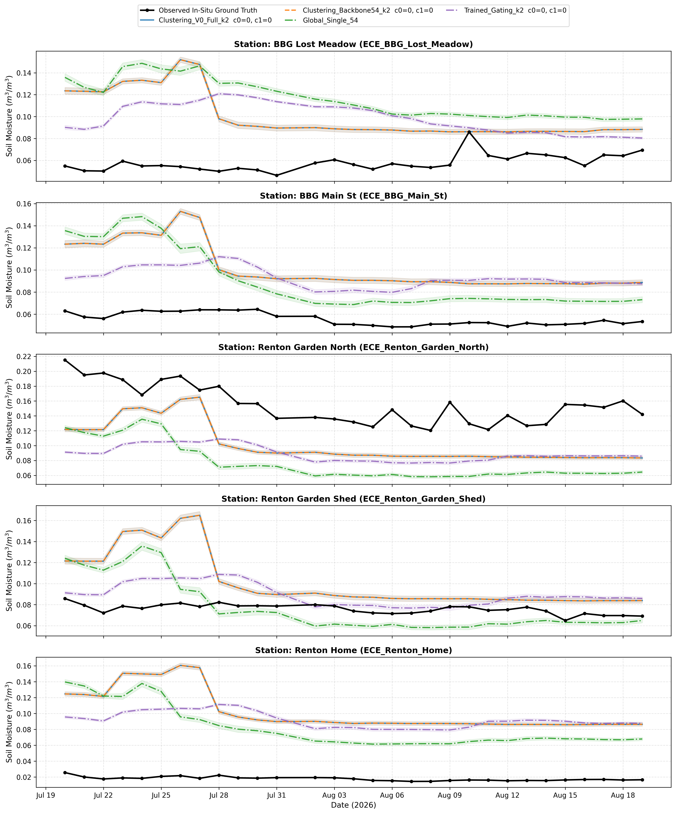
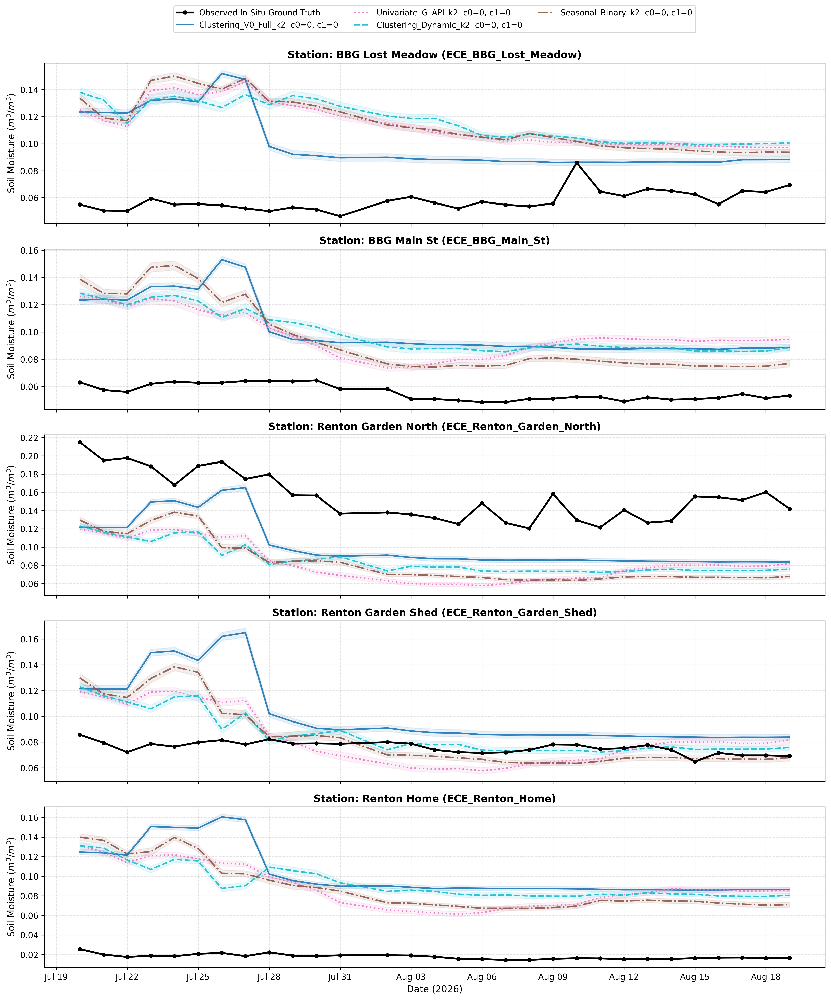
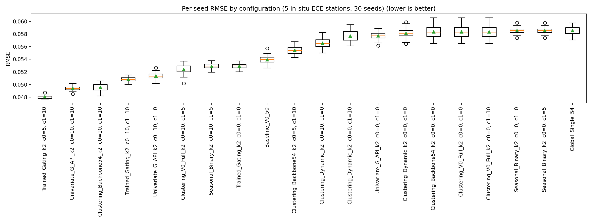
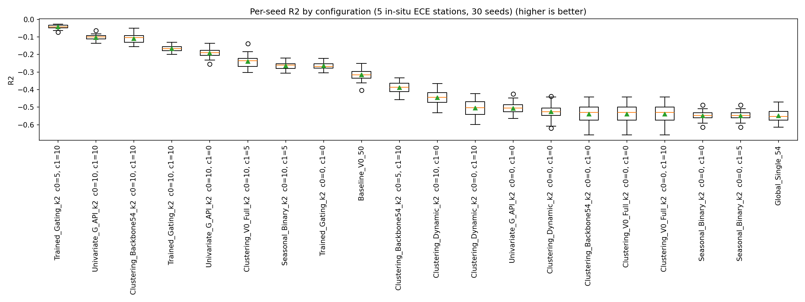
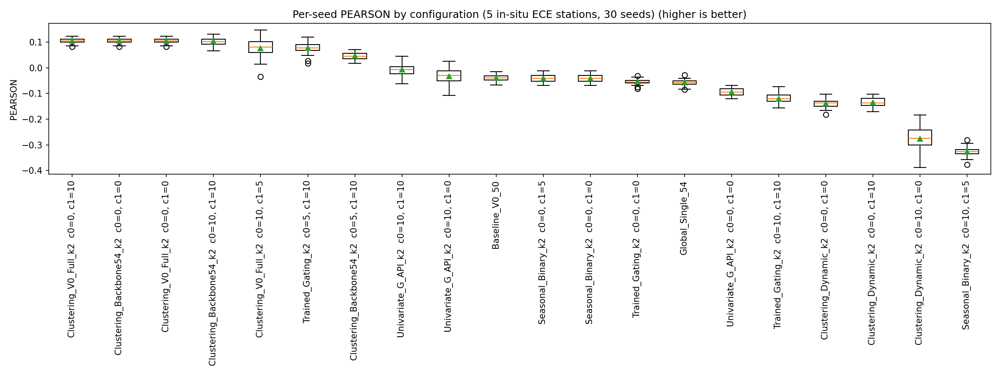
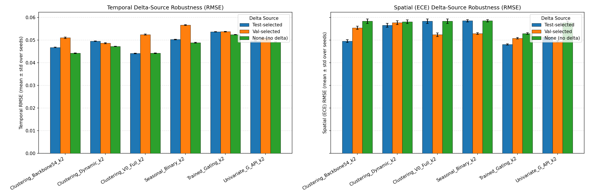
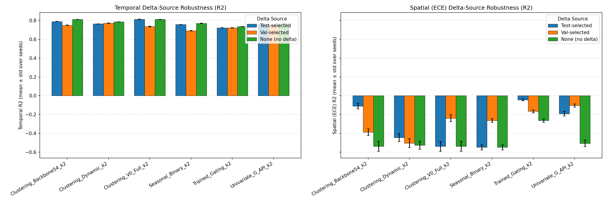

# Experiment: `derived_8.4-formal-eval-2.1-ece-v3` — Formal Statistical Evaluation on In-Situ ECE Sensors (v3 Split & Salvaged Router)

## Objective

Publication-oriented formal statistical evaluation of the two-regime clustering models against global baselines and trained gating, evaluated under **in-situ spatial generalization** across 5 newly deployed sensor stations on the canonical **`derived_8.4_ece_v3`** dataset split (150 rows across 2026-07-20 to 2026-08-19 in Bellevue and Renton, WA).

All models and routers are trained **strictly on the 7 Washington State stations** (`derived_8.4` `trainval`, 14,608 rows). The in-situ dataset `derived_8.4_ece_v3` is **completely unseen** during training.

### Key Methodology Updates in v2.1:
1. **Canonical `derived_8.4_ece_v3` Evaluation:** Features native-NaN SMAP satellite channels reflecting true in-situ deployment conditions where SMAP is absent or degraded.
2. **Missingness-Aware MoE Router Salvage:** Incorporates the availability gate fix ($\\tau = 0.10$), automatically routing samples with missing SMAP features through the SMAP-free `Univariate_G_API_k2` router.
3. **Primary Metric Realism (RMSE):** In this 30-day late-summer dry-down window, soil moisture target variance is extremely small ($\\sigma_y \\in [0.003, 0.008]\\text{ m}^3/\\text{m}^3$). Modest residuals ($\\sim 0.04$ to $0.05$) unavoidably produce large negative $R^2$ values due to tiny denominators. Models are therefore **ranked primarily by RMSE (ascending, lower is better)**, with $R^2$, MAE, Bias, ubRMSE, and Pearson correlation ($r$) reported alongside.
4. **Trend Directionality via Pearson Correlation:** Evaluates whether model predictions faithfully reproduce the ground-truth drying curve.
5. **Time Series Line Charts (Strictly $\\le 5$ Lines per Chart):**
   - **Chart Suite 1 (Architecture Showdown, NO per-regime deltas):** Observed In-Situ Ground Truth, `Clustering_V0_Full_k2 c0=0,c1=0`, `Clustering_Backbone54_k2 c0=0,c1=0`, `Global_Single_54`, `Trained_Gating_k2 c0=0,c1=0`.
   - **Chart Suite 2 (Regime Benchmark Showdown):** Observed In-Situ Ground Truth, `Clustering_V0_Full_k2 c0=0, c1=0`, `Univariate_G_API_k2 c0=0, c1=0`, `Clustering_Dynamic_k2 c0=0, c1=0`, `Seasonal_Binary_k2 c0=0, c1=0`.

All tables below are copied verbatim from the stdout of the executed report notebook
(`derived_8.4-formal-eval-2.1-ece-v3.ipynb`, executed with `nb execute --uv` from `notebooks/`).

---

## Configurations (20)

| config_id                            | strategy_name            | delta_source   |   cluster_0_count |   cluster_1_count |   n_global_features |   n_add0 |   n_add1 |
|:-------------------------------------|:-------------------------|:---------------|------------------:|------------------:|--------------------:|---------:|---------:|
| Clustering_V0_Full_k2_c0_0_c1_10     | Clustering_V0_Full_k2    | test           |                 0 |                10 |                  54 |        0 |       10 |
| Clustering_V0_Full_k2_c0_0_c1_0      | Clustering_V0_Full_k2    | none           |                 0 |                 0 |                  54 |        0 |        0 |
| Clustering_Backbone54_k2_c0_10_c1_10 | Clustering_Backbone54_k2 | test           |                10 |                10 |                  54 |       10 |       10 |
| Clustering_Backbone54_k2_c0_0_c1_0   | Clustering_Backbone54_k2 | none           |                 0 |                 0 |                  54 |        0 |        0 |
| Global_Single_54                     | Global_Single            | global         |               nan |               nan |                  54 |        0 |        0 |
| Baseline_V0_50                       | Global_Single            | global         |               nan |               nan |                  50 |        0 |        0 |
| Univariate_G_API_k2_c0_10_c1_0       | Univariate_G_API_k2      | test           |                10 |                 0 |                  54 |       10 |        0 |
| Univariate_G_API_k2_c0_0_c1_0        | Univariate_G_API_k2      | none           |                 0 |                 0 |                  54 |        0 |        0 |
| Clustering_Dynamic_k2_c0_10_c1_0     | Clustering_Dynamic_k2    | test           |                10 |                 0 |                  54 |       10 |        0 |
| Clustering_Dynamic_k2_c0_0_c1_0      | Clustering_Dynamic_k2    | none           |                 0 |                 0 |                  54 |        0 |        0 |
| Seasonal_Binary_k2_c0_0_c1_5         | Seasonal_Binary_k2       | test           |                 0 |                 5 |                  54 |        0 |        5 |
| Seasonal_Binary_k2_c0_0_c1_0         | Seasonal_Binary_k2       | none           |                 0 |                 0 |                  54 |        0 |        0 |
| Trained_Gating_k2_c0_5_c1_10         | Trained_Gating_k2        | test           |                 5 |                10 |                  54 |        5 |       10 |
| Trained_Gating_k2_c0_0_c1_0          | Trained_Gating_k2        | none           |                 0 |                 0 |                  54 |        0 |        0 |
| Clustering_V0_Full_k2_val_winner     | Clustering_V0_Full_k2    | val            |                10 |                 5 |                  54 |       10 |        5 |
| Clustering_Backbone54_k2_val_winner  | Clustering_Backbone54_k2 | val            |                 5 |                10 |                  54 |        5 |       10 |
| Clustering_Dynamic_k2_val_winner     | Clustering_Dynamic_k2    | val            |                 0 |                10 |                  54 |        0 |       10 |
| Univariate_G_API_k2_val_winner       | Univariate_G_API_k2      | val            |                10 |                10 |                  54 |       10 |       10 |
| Seasonal_Binary_k2_val_winner        | Seasonal_Binary_k2       | val            |                10 |                 5 |                  54 |       10 |        5 |
| Trained_Gating_k2_val_winner         | Trained_Gating_k2        | val            |                10 |                10 |                  54 |       10 |       10 |

---

## Protocol

- **Training:** Models and routers trained strictly on the 7 Washington state stations from `derived_8.4` (`trainval`, 2017–2022, 14,608 rows). `derived_8.4_ece_v3` is **completely unseen** during training.
- **Temporal evaluation:** Evaluated on the frozen Washington test set (2023–2025, 6,620 rows, 7 WA stations), **30 random seeds** (seeds 42, 7, 13, ..., 2222; seed 42 included as exact replication anchor vs eval-1.1).
- **Spatial evaluation:** Evaluated on all 5 in-situ stations from `derived_8.4_ece_v3` (150 rows across 2026-07-20 to 2026-08-19 in Bellevue and Renton, WA), **30 random seeds**.
- **Missingness-Aware Router:** Availability gate ($\tau=0.10$) detects missing SMAP channels in `derived_8.4_ece_v3` and falls back dynamically to the SMAP-free `Univariate_G_API_k2` router.
- **Primary Metric:** Models ranked primarily by **RMSE (m³/m³)** ascending (lower is better).
- **Statistics:** Seed-level (mean ± std, median, 95% t-CI, paired t-test, Wilcoxon signed-rank, % seeds A better), sample-level (paired cluster bootstrap over (station, date) blocks, percentile 95% CI + bootstrap p), Benjamini–Hochberg FDR, and per-station win counts + two-sided binomial sign test (n = 5; 5/5 → p ≈ 0.0625, 4/5 → p ≈ 0.3750).

---

## Temporal results (Washington test set, 2023–2025, 30 seeds)

### Seed-level summary — Temporal WA Test (30 seeds, ranked by RMSE ascending)
| config_label                           | delta_source   |   n_seeds | RMSE mean ± std   |   RMSE median | R² mean ± std   |   R² median |   MAE median |   BIAS median |   Pearson r median |
|:---------------------------------------|:---------------|----------:|:------------------|--------------:|:----------------|------------:|-------------:|--------------:|-------------------:|
| Clustering_V0_Full_k2  c0=0, c1=10     | test           |        30 | 0.04409 ± 0.00016 |     0.0440792 | 0.8126 ± 0.0013 |    0.812762 |    0.0339159 |    0.00658228 |           0.904411 |
| Clustering_V0_Full_k2  c0=0, c1=0      | none           |        30 | 0.04419 ± 0.00016 |     0.0441771 | 0.8118 ± 0.0014 |    0.811928 |    0.0339656 |    0.0059814  |           0.903653 |
| Clustering_Backbone54_k2  c0=0, c1=0   | none           |        30 | 0.04420 ± 0.00016 |     0.0441885 | 0.8117 ± 0.0014 |    0.811832 |    0.0339709 |    0.00599854 |           0.903604 |
| Clustering_Backbone54_k2  c0=10, c1=10 | test           |        30 | 0.04676 ± 0.00016 |     0.046752  | 0.7893 ± 0.0014 |    0.789366 |    0.0358191 |    0.00707422 |           0.891952 |
| Clustering_Dynamic_k2  c0=0, c1=0      | none           |        30 | 0.04718 ± 0.00011 |     0.0471949 | 0.7855 ± 0.0010 |    0.785356 |    0.0363103 |    0.00956118 |           0.891764 |
| Global_Single_54                       | global         |        30 | 0.04780 ± 0.00014 |     0.0478155 | 0.7798 ± 0.0013 |    0.779674 |    0.0369541 |    0.0100552  |           0.889041 |
| Clustering_Dynamic_k2  c0=0, c1=10     | val            |        30 | 0.04861 ± 0.00021 |     0.0485688 | 0.7723 ± 0.0019 |    0.772677 |    0.0373542 |    0.0121233  |           0.887437 |
| Seasonal_Binary_k2  c0=0, c1=0         | none           |        30 | 0.04885 ± 0.00017 |     0.048852  | 0.7700 ± 0.0016 |    0.770019 |    0.0376961 |    0.0107012  |           0.884586 |
| Univariate_G_API_k2  c0=0, c1=0        | none           |        30 | 0.04911 ± 0.00010 |     0.0491146 | 0.7676 ± 0.0009 |    0.76754  |    0.0381569 |    0.0106203  |           0.883214 |
| Clustering_Dynamic_k2  c0=10, c1=0     | test           |        30 | 0.04951 ± 0.00012 |     0.049502  | 0.7638 ± 0.0011 |    0.763858 |    0.0387046 |    0.00966423 |           0.879299 |
| Univariate_G_API_k2  c0=10, c1=0       | test           |        30 | 0.04962 ± 0.00011 |     0.0496225 | 0.7627 ± 0.0011 |    0.762707 |    0.0385211 |    0.0112902  |           0.880898 |
| Baseline_V0_50                         | global         |        30 | 0.04997 ± 0.00015 |     0.0499713 | 0.7593 ± 0.0015 |    0.759359 |    0.038278  |    0.00959518 |           0.876652 |
| Seasonal_Binary_k2  c0=0, c1=5         | test           |        30 | 0.05026 ± 0.00014 |     0.0502614 | 0.7566 ± 0.0014 |    0.756557 |    0.038728  |    0.0107854  |           0.87769  |
| Univariate_G_API_k2  c0=10, c1=10      | val            |        30 | 0.05076 ± 0.00012 |     0.050779  | 0.7517 ± 0.0012 |    0.751517 |    0.0394881 |    0.0115562  |           0.874748 |
| Clustering_Backbone54_k2  c0=5, c1=10  | val            |        30 | 0.05104 ± 0.00031 |     0.0510056 | 0.7490 ± 0.0031 |    0.749295 |    0.0388452 |    0.00895874 |           0.870238 |
| Trained_Gating_k2  c0=0, c1=0          | none           |        30 | 0.05240 ± 0.00011 |     0.0524241 | 0.7354 ± 0.0011 |    0.735156 |    0.0388224 |    0.0145035  |           0.875562 |
| Clustering_V0_Full_k2  c0=10, c1=5     | val            |        30 | 0.05243 ± 0.00025 |     0.0524297 | 0.7351 ± 0.0025 |    0.7351   |    0.0394353 |    0.00758365 |           0.861765 |
| Trained_Gating_k2  c0=5, c1=10         | test           |        30 | 0.05364 ± 0.00009 |     0.0536248 | 0.7227 ± 0.0009 |    0.722885 |    0.0403555 |    0.0156895  |           0.868983 |
| Trained_Gating_k2  c0=10, c1=10        | val            |        30 | 0.05371 ± 0.00013 |     0.0537028 | 0.7220 ± 0.0014 |    0.722079 |    0.0410982 |    0.0166027  |           0.86806  |
| Seasonal_Binary_k2  c0=10, c1=5        | val            |        30 | 0.05664 ± 0.00018 |     0.0566293 | 0.6909 ± 0.0020 |    0.690963 |    0.0421812 |    0.00999082 |           0.83959  |

### Focused temporal pairwise comparisons

Focused Temporal RMSE comparisons (A vs B, negative diff favors A):
| A                                    | B                                    | metric   |   n_seeds |   mean_diff | ci                   |     t_p |   wilcoxon_p |   pct_A_better |    q_bh |
|:-------------------------------------|:-------------------------------------|:---------|----------:|------------:|:---------------------|--------:|-------------:|---------------:|--------:|
| Clustering_V0_Full_k2_c0_0_c1_10     | Trained_Gating_k2_c0_5_c1_10         | RMSE     |        30 |    -0.00955 | [-0.00961, -0.00948] | 0.00000 |      0.00000 |      100.00000 | 0.00000 |
| Clustering_V0_Full_k2_c0_0_c1_0      | Trained_Gating_k2_c0_5_c1_10         | RMSE     |        30 |    -0.00945 | [-0.00951, -0.00939] | 0.00000 |      0.00000 |      100.00000 | 0.00000 |
| Clustering_Backbone54_k2_c0_0_c1_0   | Trained_Gating_k2_c0_5_c1_10         | RMSE     |        30 |    -0.00944 | [-0.00950, -0.00938] | 0.00000 |      0.00000 |      100.00000 | 0.00000 |
| Clustering_V0_Full_k2_c0_0_c1_10     | Global_Single_54                     | RMSE     |        30 |    -0.00371 | [-0.00379, -0.00363] | 0.00000 |      0.00000 |      100.00000 | 0.00000 |
| Clustering_V0_Full_k2_c0_0_c1_0      | Global_Single_54                     | RMSE     |        30 |    -0.00362 | [-0.00370, -0.00353] | 0.00000 |      0.00000 |      100.00000 | 0.00000 |
| Clustering_Backbone54_k2_c0_10_c1_10 | Global_Single_54                     | RMSE     |        30 |    -0.00105 | [-0.00112, -0.00097] | 0.00000 |      0.00000 |      100.00000 | 0.00000 |
| Clustering_Backbone54_k2_c0_0_c1_0   | Global_Single_54                     | RMSE     |        30 |    -0.00360 | [-0.00369, -0.00352] | 0.00000 |      0.00000 |      100.00000 | 0.00000 |
| Clustering_V0_Full_k2_c0_0_c1_10     | Baseline_V0_50                       | RMSE     |        30 |    -0.00588 | [-0.00596, -0.00580] | 0.00000 |      0.00000 |      100.00000 | 0.00000 |
| Clustering_Backbone54_k2_c0_10_c1_10 | Baseline_V0_50                       | RMSE     |        30 |    -0.00322 | [-0.00330, -0.00313] | 0.00000 |      0.00000 |      100.00000 | 0.00000 |
| Clustering_V0_Full_k2_c0_0_c1_10     | Clustering_Backbone54_k2_c0_10_c1_10 | RMSE     |        30 |    -0.00266 | [-0.00274, -0.00258] | 0.00000 |      0.00000 |      100.00000 | 0.00000 |
| Clustering_Dynamic_k2_c0_10_c1_0     | Global_Single_54                     | RMSE     |        30 |     0.00171 | [0.00163, 0.00179]   | 0.00000 |      0.00000 |        0.00000 | 0.00000 |
| Univariate_G_API_k2_c0_10_c1_0       | Global_Single_54                     | RMSE     |        30 |     0.00182 | [0.00176, 0.00187]   | 0.00000 |      0.00000 |        0.00000 | 0.00000 |
| Seasonal_Binary_k2_c0_0_c1_5         | Global_Single_54                     | RMSE     |        30 |     0.00246 | [0.00237, 0.00254]   | 0.00000 |      0.00000 |        0.00000 | 0.00000 |
| Trained_Gating_k2_c0_5_c1_10         | Global_Single_54                     | RMSE     |        30 |     0.00584 | [0.00577, 0.00590]   | 0.00000 |      0.00000 |        0.00000 | 0.00000 |
| Global_Single_54                     | Baseline_V0_50                       | RMSE     |        30 |    -0.00217 | [-0.00225, -0.00210] | 0.00000 |      0.00000 |      100.00000 | 0.00000 |

### Temporal sample-level bootstrap (paired cluster bootstrap over (station, month) blocks; seed-42 fits)

Sample-level paired cluster bootstrap over (station, month) blocks (seed 42):
| A                                    | B                                    | metric   |   diff_mean | diff CI              |   bootstrap_p |
|:-------------------------------------|:-------------------------------------|:---------|------------:|:---------------------|--------------:|
| Clustering_V0_Full_k2_c0_0_c1_10     | Global_Single_54                     | RMSE     |    -0.00403 | [-0.00604, -0.00229] |       0.00050 |
| Clustering_V0_Full_k2_c0_0_c1_10     | Global_Single_54                     | R2       |     0.03584 | [0.01997, 0.05456]   |       0.00050 |
| Clustering_V0_Full_k2_c0_0_c1_10     | Global_Single_54                     | BIAS     |    -0.00405 | [-0.00586, -0.00221] |       0.00050 |
| Clustering_Backbone54_k2_c0_10_c1_10 | Global_Single_54                     | RMSE     |    -0.00110 | [-0.00347, 0.00135]  |       0.37600 |
| Clustering_Backbone54_k2_c0_10_c1_10 | Global_Single_54                     | R2       |     0.01010 | [-0.01253, 0.03271]  |       0.37600 |
| Clustering_Backbone54_k2_c0_10_c1_10 | Global_Single_54                     | BIAS     |    -0.00332 | [-0.00539, -0.00100] |       0.00600 |
| Clustering_V0_Full_k2_c0_0_c1_10     | Baseline_V0_50                       | RMSE     |    -0.00602 | [-0.00860, -0.00343] |       0.00050 |
| Clustering_V0_Full_k2_c0_0_c1_10     | Baseline_V0_50                       | R2       |     0.05470 | [0.03139, 0.08067]   |       0.00050 |
| Clustering_V0_Full_k2_c0_0_c1_10     | Baseline_V0_50                       | BIAS     |    -0.00345 | [-0.00614, -0.00071] |       0.01100 |
| Clustering_Backbone54_k2_c0_10_c1_10 | Baseline_V0_50                       | RMSE     |    -0.00310 | [-0.00530, -0.00088] |       0.00600 |
| Clustering_Backbone54_k2_c0_10_c1_10 | Baseline_V0_50                       | R2       |     0.02896 | [0.00818, 0.04901]   |       0.00600 |
| Clustering_Backbone54_k2_c0_10_c1_10 | Baseline_V0_50                       | BIAS     |    -0.00272 | [-0.00498, -0.00030] |       0.02500 |
| Clustering_V0_Full_k2_c0_0_c1_10     | Trained_Gating_k2_c0_5_c1_10         | RMSE     |    -0.00969 | [-0.01307, -0.00657] |       0.00050 |
| Clustering_V0_Full_k2_c0_0_c1_10     | Trained_Gating_k2_c0_5_c1_10         | R2       |     0.09185 | [0.05886, 0.13060]   |       0.00050 |
| Clustering_V0_Full_k2_c0_0_c1_10     | Trained_Gating_k2_c0_5_c1_10         | BIAS     |    -0.00897 | [-0.01203, -0.00594] |       0.00050 |
| Clustering_Backbone54_k2_c0_10_c1_10 | Trained_Gating_k2_c0_5_c1_10         | RMSE     |    -0.00676 | [-0.01006, -0.00383] |       0.00050 |
| Clustering_Backbone54_k2_c0_10_c1_10 | Trained_Gating_k2_c0_5_c1_10         | R2       |     0.06611 | [0.03565, 0.10316]   |       0.00050 |
| Clustering_Backbone54_k2_c0_10_c1_10 | Trained_Gating_k2_c0_5_c1_10         | BIAS     |    -0.00824 | [-0.01145, -0.00506] |       0.00050 |
| Clustering_V0_Full_k2_c0_0_c1_10     | Clustering_Backbone54_k2_c0_10_c1_10 | RMSE     |    -0.00292 | [-0.00468, -0.00142] |       0.00050 |
| Clustering_V0_Full_k2_c0_0_c1_10     | Clustering_Backbone54_k2_c0_10_c1_10 | R2       |     0.02574 | [0.01201, 0.04187]   |       0.00050 |
| Clustering_V0_Full_k2_c0_0_c1_10     | Clustering_Backbone54_k2_c0_10_c1_10 | BIAS     |    -0.00073 | [-0.00220, 0.00059]  |       0.30900 |
| Global_Single_54                     | Baseline_V0_50                       | RMSE     |    -0.00199 | [-0.00500, 0.00086]  |       0.19200 |
| Global_Single_54                     | Baseline_V0_50                       | R2       |     0.01886 | [-0.00840, 0.04731]  |       0.19200 |
| Global_Single_54                     | Baseline_V0_50                       | BIAS     |     0.00060 | [-0.00232, 0.00355]  |       0.67700 |

---

## In-Situ ECE Spatial results (5 unseen stations, derived_8.4_ece_v3, 30 seeds)

### In-Situ ECE Spatial Summary (30 seeds, ranked primarily by RMSE ascending; lower is better)
| config_label                           | delta_source   |   n_seeds | RMSE mean ± std   |   RMSE median |   Station Median RMSE | R² mean ± std    |   R² median |   Pearson r median |
|:---------------------------------------|:---------------|----------:|:------------------|--------------:|----------------------:|:-----------------|------------:|-------------------:|
| Trained_Gating_k2  c0=5, c1=10         | test           |        30 | 0.04807 ± 0.00026 |     0.0480615 |             0.0294934 | -0.0438 ± 0.0111 |  -0.0435056 |         0.0776675  |
| Univariate_G_API_k2  c0=10, c1=10      | val            |        30 | 0.04943 ± 0.00038 |     0.0493651 |             0.0408252 | -0.1038 ± 0.0169 |  -0.100882  |        -0.00727619 |
| Clustering_Backbone54_k2  c0=10, c1=10 | test           |        30 | 0.04956 ± 0.00065 |     0.0494558 |             0.0330146 | -0.1099 ± 0.0290 |  -0.10493   |         0.102713   |
| Trained_Gating_k2  c0=10, c1=10        | val            |        30 | 0.05081 ± 0.00034 |     0.0508179 |             0.0280924 | -0.1665 ± 0.0154 |  -0.166634  |        -0.119747   |
| Univariate_G_API_k2  c0=10, c1=0       | test           |        30 | 0.05135 ± 0.00055 |     0.0513106 |             0.0395241 | -0.1912 ± 0.0254 |  -0.189362  |        -0.0297089  |
| Clustering_V0_Full_k2  c0=10, c1=5     | val            |        30 | 0.05237 ± 0.00080 |     0.0522989 |             0.0399399 | -0.2393 ± 0.0376 |  -0.23562   |         0.0804722  |
| Seasonal_Binary_k2  c0=10, c1=5        | val            |        30 | 0.05290 ± 0.00041 |     0.0528114 |             0.0431952 | -0.2642 ± 0.0198 |  -0.259957  |        -0.32625    |
| Trained_Gating_k2  c0=0, c1=0          | none           |        30 | 0.05291 ± 0.00038 |     0.0529672 |             0.0445292 | -0.2647 ± 0.0180 |  -0.267403  |        -0.0547321  |
| Baseline_V0_50                         | global         |        30 | 0.05395 ± 0.00068 |     0.0539895 |             0.0448151 | -0.3151 ± 0.0333 |  -0.316798  |        -0.0386512  |
| Clustering_Backbone54_k2  c0=5, c1=10  | val            |        30 | 0.05542 ± 0.00072 |     0.0553915 |             0.0462642 | -0.3879 ± 0.0362 |  -0.386077  |         0.0447098  |
| Clustering_Dynamic_k2  c0=10, c1=0     | test           |        30 | 0.05655 ± 0.00083 |     0.0565273 |             0.0508003 | -0.4449 ± 0.0422 |  -0.443501  |        -0.274263   |
| Clustering_Dynamic_k2  c0=0, c1=10     | val            |        30 | 0.05770 ± 0.00089 |     0.0576909 |             0.060913  | -0.5044 ± 0.0464 |  -0.503545  |        -0.137528   |
| Univariate_G_API_k2  c0=0, c1=0        | none           |        30 | 0.05774 ± 0.00065 |     0.0577237 |             0.05926   | -0.5061 ± 0.0340 |  -0.505252  |        -0.0937095  |
| Clustering_Dynamic_k2  c0=0, c1=0      | none           |        30 | 0.05812 ± 0.00083 |     0.0581303 |             0.0606718 | -0.5261 ± 0.0437 |  -0.526532  |        -0.137082   |
| Clustering_Backbone54_k2  c0=0, c1=0   | none           |        30 | 0.05836 ± 0.00099 |     0.0581912 |             0.0487164 | -0.5388 ± 0.0526 |  -0.529733  |         0.105229   |
| Clustering_V0_Full_k2  c0=0, c1=0      | none           |        30 | 0.05836 ± 0.00099 |     0.0581912 |             0.0487165 | -0.5388 ± 0.0526 |  -0.529733  |         0.105229   |
| Clustering_V0_Full_k2  c0=0, c1=10     | test           |        30 | 0.05836 ± 0.00099 |     0.0581912 |             0.0487165 | -0.5388 ± 0.0526 |  -0.529733  |         0.105229   |
| Seasonal_Binary_k2  c0=0, c1=0         | none           |        30 | 0.05854 ± 0.00051 |     0.0585295 |             0.0609838 | -0.5481 ± 0.0272 |  -0.547571  |        -0.0402171  |
| Seasonal_Binary_k2  c0=0, c1=5         | test           |        30 | 0.05854 ± 0.00051 |     0.0585295 |             0.0609838 | -0.5481 ± 0.0272 |  -0.547571  |        -0.0402171  |
| Global_Single_54                       | global         |        30 | 0.05856 ± 0.00065 |     0.0586114 |             0.0618456 | -0.5494 ± 0.0344 |  -0.551902  |        -0.0576663  |

### Per-station breakdown across 5 In-Situ ECE stations

### In-Situ ECE Station Difficulty Ranking (ranked by median RMSE ascending)
| station_id              |   n_configs |   median_rmse |   mean_rmse |   std_rmse |   median_r2 |   mean_r2 |   mean_pearson |   median_pearson |   mean_bias |
|:------------------------|------------:|--------------:|------------:|-----------:|------------:|----------:|---------------:|-----------------:|------------:|
| ECE_Renton_Garden_Shed  |          20 |        0.0195 |      0.0206 |     0.0083 |    -17.6072 |  -22.9185 |         0.4310 |           0.4792 |      0.0117 |
| ECE_BBG_Main_St         |          20 |        0.0427 |      0.0370 |     0.0110 |    -57.0718 |  -46.3952 |         0.6308 |           0.7093 |      0.0347 |
| ECE_BBG_Lost_Meadow     |          20 |        0.0475 |      0.0475 |     0.0108 |    -37.7279 |  -39.6311 |        -0.4143 |          -0.4413 |      0.0439 |
| ECE_Renton_Garden_North |          20 |        0.0721 |      0.0712 |     0.0089 |     -6.7393 |   -6.6736 |         0.4791 |           0.6761 |     -0.0675 |
| ECE_Renton_Home         |          20 |        0.0738 |      0.0744 |     0.0081 |   -874.5625 | -900.2494 |         0.4609 |           0.5729 |      0.0725 |

### Per-Configuration × Per-Station RMSE Matrix (5 ECE stations; lower is better)
| config_id                            |   ECE_BBG_Lost_Meadow |   ECE_BBG_Main_St |   ECE_Renton_Garden_North |   ECE_Renton_Garden_Shed |   ECE_Renton_Home |
|:-------------------------------------|----------------------:|------------------:|--------------------------:|-------------------------:|------------------:|
| Trained_Gating_k2_c0_5_c1_10         |                0.0295 |            0.0202 |                    0.0780 |                   0.0119 |            0.0637 |
| Univariate_G_API_k2_val_winner       |                0.0408 |            0.0220 |                    0.0791 |                   0.0085 |            0.0610 |
| Clustering_Backbone54_k2_c0_10_c1_10 |                0.0317 |            0.0330 |                    0.0709 |                   0.0164 |            0.0697 |
| Trained_Gating_k2_val_winner         |                0.0281 |            0.0223 |                    0.0856 |                   0.0148 |            0.0640 |
| Univariate_G_API_k2_c0_10_c1_0       |                0.0395 |            0.0317 |                    0.0716 |                   0.0161 |            0.0720 |
| Clustering_V0_Full_k2_val_winner     |                0.0399 |            0.0385 |                    0.0636 |                   0.0207 |            0.0783 |
| Seasonal_Binary_k2_val_winner        |                0.0432 |            0.0231 |                    0.0859 |                   0.0053 |            0.0642 |
| Trained_Gating_k2_c0_0_c1_0          |                0.0445 |            0.0378 |                    0.0690 |                   0.0166 |            0.0747 |
| Baseline_V0_50                       |                0.0448 |            0.0142 |                    0.0793 |                   0.0235 |            0.0738 |
| Clustering_Backbone54_k2_val_winner  |                0.0463 |            0.0444 |                    0.0621 |                   0.0264 |            0.0819 |
| Clustering_Dynamic_k2_c0_10_c1_0     |                0.0508 |            0.0438 |                    0.0670 |                   0.0182 |            0.0817 |
| Clustering_Dynamic_k2_val_winner     |                0.0609 |            0.0433 |                    0.0726 |                   0.0169 |            0.0739 |
| Univariate_G_API_k2_c0_0_c1_0        |                0.0593 |            0.0439 |                    0.0738 |                   0.0211 |            0.0735 |
| Clustering_Dynamic_k2_c0_0_c1_0      |                0.0607 |            0.0452 |                    0.0711 |                   0.0177 |            0.0762 |
| Clustering_Backbone54_k2_c0_0_c1_0   |                0.0487 |            0.0487 |                    0.0563 |                   0.0354 |            0.0878 |
| Clustering_V0_Full_k2_c0_0_c1_0      |                0.0487 |            0.0487 |                    0.0563 |                   0.0354 |            0.0878 |
| Clustering_V0_Full_k2_c0_0_c1_10     |                0.0487 |            0.0487 |                    0.0563 |                   0.0354 |            0.0878 |
| Seasonal_Binary_k2_c0_0_c1_0         |                0.0610 |            0.0446 |                    0.0734 |                   0.0239 |            0.0737 |
| Seasonal_Binary_k2_c0_0_c1_5         |                0.0610 |            0.0446 |                    0.0734 |                   0.0239 |            0.0737 |
| Global_Single_54                     |                0.0618 |            0.0421 |                    0.0797 |                   0.0234 |            0.0687 |

### Per-Configuration × Per-Station Pearson r Matrix (5 ECE stations; higher is better)
| config_id                            |   ECE_BBG_Lost_Meadow |   ECE_BBG_Main_St |   ECE_Renton_Garden_North |   ECE_Renton_Garden_Shed |   ECE_Renton_Home |
|:-------------------------------------|----------------------:|------------------:|--------------------------:|-------------------------:|------------------:|
| Trained_Gating_k2_c0_5_c1_10         |               -0.0769 |            0.3640 |                   -0.4376 |                   0.0990 |           -0.1960 |
| Univariate_G_API_k2_val_winner       |               -0.4704 |            0.7512 |                    0.4889 |                   0.5434 |            0.6446 |
| Clustering_Backbone54_k2_c0_10_c1_10 |               -0.3696 |            0.7504 |                    0.7089 |                   0.4846 |            0.5849 |
| Trained_Gating_k2_val_winner         |               -0.3353 |           -0.1191 |                   -0.5295 |                   0.0145 |           -0.2241 |
| Univariate_G_API_k2_c0_10_c1_0       |               -0.2461 |            0.6128 |                   -0.0194 |                   0.3378 |            0.1866 |
| Clustering_V0_Full_k2_val_winner     |               -0.4121 |            0.7908 |                    0.6340 |                   0.5237 |            0.5704 |
| Seasonal_Binary_k2_val_winner        |               -0.2626 |            0.4339 |                    0.4373 |                   0.6492 |            0.3759 |
| Trained_Gating_k2_c0_0_c1_0          |               -0.5427 |            0.8210 |                    0.6432 |                   0.4448 |            0.6104 |
| Baseline_V0_50                       |               -0.5306 |            0.5681 |                   -0.3846 |                   0.2810 |           -0.0057 |
| Clustering_Backbone54_k2_val_winner  |               -0.3529 |            0.6797 |                    0.6077 |                   0.4956 |            0.5171 |
| Clustering_Dynamic_k2_c0_10_c1_0     |               -0.4711 |            0.2787 |                    0.2961 |                   0.5445 |            0.2733 |
| Clustering_Dynamic_k2_val_winner     |               -0.5768 |            0.8289 |                    0.8102 |                   0.4844 |            0.7433 |
| Univariate_G_API_k2_c0_0_c1_0        |               -0.4957 |            0.6163 |                    0.8636 |                   0.3550 |            0.6390 |
| Clustering_Dynamic_k2_c0_0_c1_0      |               -0.5796 |            0.8186 |                    0.8106 |                   0.4947 |            0.7361 |
| Clustering_Backbone54_k2_c0_0_c1_0   |               -0.3442 |            0.7093 |                    0.7363 |                   0.4740 |            0.5729 |
| Clustering_V0_Full_k2_c0_0_c1_0      |               -0.3442 |            0.7093 |                    0.7363 |                   0.4740 |            0.5729 |
| Clustering_V0_Full_k2_c0_0_c1_10     |               -0.3442 |            0.7093 |                    0.7363 |                   0.4740 |            0.5729 |
| Seasonal_Binary_k2_c0_0_c1_0         |               -0.5124 |            0.7780 |                    0.8141 |                   0.5057 |            0.6922 |
| Seasonal_Binary_k2_c0_0_c1_5         |               -0.5124 |            0.7780 |                    0.8141 |                   0.5057 |            0.6922 |
| Global_Single_54                     |               -0.5068 |            0.7357 |                    0.8148 |                   0.4352 |            0.6599 |

### Focused Spatial pairwise tests (5 In-Situ ECE stations)

Focused Spatial RMSE comparisons — wins 'k of 5 stations' (A < B), sign test p, paired t p, Wilcoxon p, q = BH-FDR
| A                                    | B                                    | metric   |   n_stations |   mean_diff | wins   |   sign_p |     t_p |   wilcoxon_p |    q_bh |
|:-------------------------------------|:-------------------------------------|:---------|-------------:|------------:|:-------|---------:|--------:|-------------:|--------:|
| Trained_Gating_k2_c0_5_c1_10         | Global_Single_54                     | RMSE     |            5 |    -0.01447 | 5 / 5  |  0.06250 | 0.06212 |      0.06250 | 0.39742 |
| Clustering_Backbone54_k2_c0_10_c1_10 | Global_Single_54                     | RMSE     |            5 |    -0.01079 | 4 / 5  |  0.37500 | 0.10497 |      0.12500 | 0.39742 |
| Univariate_G_API_k2_c0_10_c1_0       | Global_Single_54                     | RMSE     |            5 |    -0.00896 | 4 / 5  |  0.37500 | 0.09409 |      0.12500 | 0.39742 |
| Clustering_Dynamic_k2_c0_10_c1_0     | Global_Single_54                     | RMSE     |            5 |    -0.00283 | 3 / 5  |  1.00000 | 0.58106 |      0.81250 | 0.87159 |
| Clustering_Backbone54_k2_c0_10_c1_10 | Baseline_V0_50                       | RMSE     |            5 |    -0.00276 | 4 / 5  |  0.37500 | 0.64659 |      0.62500 | 0.88172 |
| Seasonal_Binary_k2_c0_0_c1_5         | Global_Single_54                     | RMSE     |            5 |     0.00018 | 2 / 5  |  1.00000 | 0.93082 |      1.00000 | 0.97652 |
| Clustering_Backbone54_k2_c0_0_c1_0   | Global_Single_54                     | RMSE     |            5 |     0.00025 | 2 / 5  |  1.00000 | 0.97652 |      1.00000 | 0.97652 |
| Clustering_V0_Full_k2_c0_0_c1_0      | Global_Single_54                     | RMSE     |            5 |     0.00025 | 2 / 5  |  1.00000 | 0.97652 |      1.00000 | 0.97652 |
| Clustering_V0_Full_k2_c0_0_c1_10     | Global_Single_54                     | RMSE     |            5 |     0.00025 | 2 / 5  |  1.00000 | 0.97652 |      1.00000 | 0.97652 |
| Global_Single_54                     | Baseline_V0_50                       | RMSE     |            5 |     0.00803 | 2 / 5  |  1.00000 | 0.26582 |      0.43750 | 0.49841 |
| Clustering_V0_Full_k2_c0_0_c1_10     | Baseline_V0_50                       | RMSE     |            5 |     0.00828 | 1 / 5  |  0.37500 | 0.42408 |      0.43750 | 0.70680 |
| Clustering_V0_Full_k2_c0_0_c1_10     | Clustering_Backbone54_k2_c0_10_c1_10 | RMSE     |            5 |     0.01104 | 1 / 5  |  0.37500 | 0.16172 |      0.12500 | 0.39742 |
| Clustering_Backbone54_k2_c0_0_c1_0   | Trained_Gating_k2_c0_5_c1_10         | RMSE     |            5 |     0.01472 | 1 / 5  |  0.37500 | 0.18546 |      0.18750 | 0.39742 |
| Clustering_V0_Full_k2_c0_0_c1_0      | Trained_Gating_k2_c0_5_c1_10         | RMSE     |            5 |     0.01472 | 1 / 5  |  0.37500 | 0.18546 |      0.18750 | 0.39742 |
| Clustering_V0_Full_k2_c0_0_c1_10     | Trained_Gating_k2_c0_5_c1_10         | RMSE     |            5 |     0.01472 | 1 / 5  |  0.37500 | 0.18546 |      0.18750 | 0.39742 |

### Spatial sample-level bootstrap (5 ECE stations)

Sample-level paired cluster bootstrap over (station, date) blocks on ECE v3 (seed 42):
| A                                    | B                                    | metric   |   diff_mean | diff CI              |   bootstrap_p |
|:-------------------------------------|:-------------------------------------|:---------|------------:|:---------------------|--------------:|
| Clustering_V0_Full_k2_c0_0_c1_10     | Global_Single_54                     | RMSE     |    -0.00220 | [-0.00619, 0.00192]  |       0.27800 |
| Clustering_V0_Full_k2_c0_0_c1_10     | Global_Single_54                     | R2       |     0.11504 | [-0.11195, 0.32052]  |       0.27800 |
| Clustering_V0_Full_k2_c0_0_c1_10     | Global_Single_54                     | BIAS     |     0.01160 | [0.00828, 0.01505]   |       0.00050 |
| Clustering_Backbone54_k2_c0_10_c1_10 | Global_Single_54                     | RMSE     |    -0.00981 | [-0.01363, -0.00600] |       0.00050 |
| Clustering_Backbone54_k2_c0_10_c1_10 | Global_Single_54                     | R2       |     0.49781 | [0.26199, 0.78892]   |       0.00050 |
| Clustering_Backbone54_k2_c0_10_c1_10 | Global_Single_54                     | BIAS     |    -0.00195 | [-0.00574, 0.00164]  |       0.31100 |
| Clustering_V0_Full_k2_c0_0_c1_10     | Baseline_V0_50                       | RMSE     |     0.00327 | [-0.00292, 0.00935]  |       0.28700 |
| Clustering_V0_Full_k2_c0_0_c1_10     | Baseline_V0_50                       | R2       |    -0.17766 | [-0.53800, 0.12590]  |       0.28700 |
| Clustering_V0_Full_k2_c0_0_c1_10     | Baseline_V0_50                       | BIAS     |     0.01374 | [0.00872, 0.01894]   |       0.00050 |
| Clustering_Backbone54_k2_c0_10_c1_10 | Baseline_V0_50                       | RMSE     |    -0.00435 | [-0.00821, -0.00042] |       0.02500 |
| Clustering_Backbone54_k2_c0_10_c1_10 | Baseline_V0_50                       | R2       |     0.20511 | [0.01970, 0.38116]   |       0.02500 |
| Clustering_Backbone54_k2_c0_10_c1_10 | Baseline_V0_50                       | BIAS     |     0.00019 | [-0.00370, 0.00423]  |       0.92600 |
| Clustering_V0_Full_k2_c0_0_c1_10     | Trained_Gating_k2_c0_5_c1_10         | RMSE     |     0.00920 | [0.00309, 0.01501]   |       0.00800 |
| Clustering_V0_Full_k2_c0_0_c1_10     | Trained_Gating_k2_c0_5_c1_10         | R2       |    -0.45780 | [-0.86468, -0.12554] |       0.00800 |
| Clustering_V0_Full_k2_c0_0_c1_10     | Trained_Gating_k2_c0_5_c1_10         | BIAS     |     0.01930 | [0.01558, 0.02339]   |       0.00050 |
| Clustering_Backbone54_k2_c0_10_c1_10 | Trained_Gating_k2_c0_5_c1_10         | RMSE     |     0.00158 | [-0.00139, 0.00438]  |       0.28700 |
| Clustering_Backbone54_k2_c0_10_c1_10 | Trained_Gating_k2_c0_5_c1_10         | R2       |    -0.07503 | [-0.22431, 0.05674]  |       0.28700 |
| Clustering_Backbone54_k2_c0_10_c1_10 | Trained_Gating_k2_c0_5_c1_10         | BIAS     |     0.00575 | [0.00350, 0.00835]   |       0.00050 |
| Clustering_V0_Full_k2_c0_0_c1_10     | Clustering_Backbone54_k2_c0_10_c1_10 | RMSE     |     0.00761 | [0.00433, 0.01072]   |       0.00050 |
| Clustering_V0_Full_k2_c0_0_c1_10     | Clustering_Backbone54_k2_c0_10_c1_10 | R2       |    -0.38277 | [-0.64730, -0.17187] |       0.00050 |
| Clustering_V0_Full_k2_c0_0_c1_10     | Clustering_Backbone54_k2_c0_10_c1_10 | BIAS     |     0.01355 | [0.01191, 0.01525]   |       0.00050 |
| Global_Single_54                     | Baseline_V0_50                       | RMSE     |     0.00546 | [-0.00074, 0.01148]  |       0.08000 |
| Global_Single_54                     | Baseline_V0_50                       | R2       |    -0.29270 | [-0.66685, 0.03683]  |       0.08000 |
| Global_Single_54                     | Baseline_V0_50                       | BIAS     |     0.00214 | [-0.00328, 0.00805]  |       0.46400 |

---

## Focused In-Situ ECE Spatial Comparison (No Delta Feature Selection)

A low-noise architectural comparison evaluating two-regime models strictly **without regime-specific feature selection**
(identical 54 global features) against single-regime global models and trained gating routers across the 5 ECE stations:

### Table 1: In-Situ ECE Spatial Comparison (5 Unseen Stations, No Delta Selection; Ranked by RMSE)
| Model Architecture              | Type                           |   Station Median RMSE |   Station Mean RMSE |   Station Median R² |   Station Mean R² |   Station Mean Pearson r |   Station Mean MAE |   Station Mean Bias | Pooled RMSE     | Pooled R²        |   Pooled Pearson r |
|:--------------------------------|:-------------------------------|----------------------:|--------------------:|--------------------:|------------------:|-------------------------:|-------------------:|--------------------:|:----------------|:-----------------|-------------------:|
| Trained Gating Classifier       | Two-Regime (Supervised Gating) |                0.0445 |              0.0485 |            -33.0261 |         -198.8126 |                   0.3954 |             0.0463 |              0.0199 | 0.0529 ± 0.0004 | -0.2647 ± 0.0180 |            -0.0545 |
| Baseline Model (50 V0 feats)    | Single-Regime (Global)         |                0.0448 |              0.0471 |            -25.9522 |         -189.6636 |                  -0.0143 |             0.0428 |              0.0135 | 0.0540 ± 0.0007 | -0.3151 ± 0.0333 |            -0.0392 |
| Clustering (54 backbone)        | Two-Regime (KMeans k=2)        |                0.0487 |              0.0554 |            -60.4265 |         -283.8297 |                   0.4297 |             0.0503 |              0.0291 | 0.0584 ± 0.0010 | -0.5388 ± 0.0526 |             0.1049 |
| Clustering (50 V0 features)     | Two-Regime (KMeans k=2)        |                0.0487 |              0.0554 |            -60.4266 |         -283.8298 |                   0.4297 |             0.0503 |              0.0291 | 0.0584 ± 0.0010 | -0.5388 ± 0.0526 |             0.1049 |
| Univariate G_API split          | Two-Regime (Heuristic)         |                0.0593 |              0.0543 |            -59.2623 |         -203.2283 |                   0.3957 |             0.0515 |              0.0205 | 0.0577 ± 0.0007 | -0.5061 ± 0.0340 |            -0.0942 |
| Clustering (Dynamic features)   | Two-Regime (KMeans k=2)        |                0.0607 |              0.0542 |            -62.1677 |         -216.2055 |                   0.4561 |             0.0514 |              0.0234 | 0.0581 ± 0.0008 | -0.5261 ± 0.0437 |            -0.1377 |
| Seasonal Binary (Summer/Winter) | Two-Regime (Heuristic)         |                0.0610 |              0.0553 |            -62.5325 |         -206.6607 |                   0.4555 |             0.0507 |              0.0204 | 0.0585 ± 0.0005 | -0.5481 ± 0.0272 |            -0.0416 |
| Global Single Model (54 feats)  | Single-Regime (Global)         |                0.0618 |              0.0551 |            -55.4628 |         -182.4149 |                   0.4277 |             0.0506 |              0.0158 | 0.0586 ± 0.0007 | -0.5494 ± 0.0344 |            -0.0576 |

### Table 2: Head-to-Head ECE Spatial Pairwise Tests (Per-Station Medians across 5 Stations; ΔRMSE)
| Category                 | Comparison (A vs B)                   |   Station Mean ΔRMSE (A−B) | Station Wins (A < B)   |   Binomial Sign Test p |   Paired t-test p |   Wilcoxon p |   Pooled ΔRMSE |   Pooled ΔR² |
|:-------------------------|:--------------------------------------|---------------------------:|:-----------------------|-----------------------:|------------------:|-------------:|---------------:|-------------:|
| Clustering vs Global     | Clustering (V0) vs Global-54          |                    0.00025 | 2 / 5                  |                1.00000 |           0.97652 |      1.00000 |       -0.00021 |      0.01064 |
| Clustering vs Global     | Clustering (54) vs Global-54          |                    0.00025 | 2 / 5                  |                1.00000 |           0.97652 |      1.00000 |       -0.00021 |      0.01064 |
| Clustering vs Baseline   | Clustering (V0) vs Baseline-50        |                    0.00828 | 1 / 5                  |                0.37500 |           0.42408 |      0.43750 |        0.00440 |     -0.22371 |
| Clustering vs Baseline   | Clustering (54) vs Baseline-50        |                    0.00828 | 1 / 5                  |                0.37500 |           0.42408 |      0.43750 |        0.00440 |     -0.22371 |
| Clustering vs Global     | Clustering (Dynamic) vs Global-54     |                   -0.00097 | 3 / 5                  |                1.00000 |           0.75721 |      0.81250 |       -0.00045 |      0.02335 |
| Regime vs Global         | Univariate G_API vs Global-54         |                   -0.00083 | 3 / 5                  |                1.00000 |           0.68289 |      0.62500 |       -0.00083 |      0.04336 |
| Seasonal vs Global       | Seasonal Binary vs Global-54          |                    0.00018 | 2 / 5                  |                1.00000 |           0.93082 |      1.00000 |       -0.00002 |      0.00138 |
| Clustering vs Gating     | Clustering (V0) vs Trained Gating     |                    0.00688 | 1 / 5                  |                0.37500 |           0.27348 |      0.31250 |        0.00545 |     -0.27408 |
| Clustering vs Gating     | Clustering (54) vs Trained Gating     |                    0.00688 | 1 / 5                  |                0.37500 |           0.27348 |      0.31250 |        0.00545 |     -0.27408 |
| Clustering vs Univariate | Clustering (V0) vs Univariate G_API   |                    0.00108 | 2 / 5                  |                1.00000 |           0.87614 |      1.00000 |        0.00062 |     -0.03272 |
| Clustering vs Dynamic    | Clustering (V0) vs Dynamic Clustering |                    0.00122 | 2 / 5                  |                1.00000 |           0.85793 |      1.00000 |        0.00024 |     -0.01271 |
| Clustering vs Seasonal   | Clustering (V0) vs Seasonal Binary    |                    0.00007 | 2 / 5                  |                1.00000 |           0.99131 |      1.00000 |       -0.00018 |      0.00926 |

### Table 3: Per-Station RMSE Matrix across 5 In-Situ ECE Stations (No Deltas; Lower is Better)
|                                 |   ECE_BBG_Lost_Meadow |   ECE_BBG_Main_St |   ECE_Renton_Garden_North |   ECE_Renton_Garden_Shed |   ECE_Renton_Home |
|:--------------------------------|----------------------:|------------------:|--------------------------:|-------------------------:|------------------:|
| Clustering (54 backbone)        |                0.0487 |            0.0487 |                    0.0563 |                   0.0354 |            0.0878 |
| Clustering (50 V0 features)     |                0.0487 |            0.0487 |                    0.0563 |                   0.0354 |            0.0878 |
| Clustering (Dynamic features)   |                0.0607 |            0.0452 |                    0.0711 |                   0.0177 |            0.0762 |
| Seasonal Binary (Summer/Winter) |                0.0610 |            0.0446 |                    0.0734 |                   0.0239 |            0.0737 |
| Univariate G_API split          |                0.0593 |            0.0439 |                    0.0738 |                   0.0211 |            0.0735 |
| Trained Gating Classifier       |                0.0445 |            0.0378 |                    0.0690 |                   0.0166 |            0.0747 |
| Global Single Model (54 feats)  |                0.0618 |            0.0421 |                    0.0797 |                   0.0234 |            0.0687 |
| Baseline Model (50 V0 feats)    |                0.0448 |            0.0142 |                    0.0793 |                   0.0235 |            0.0738 |

### Table 4: Station Distance to Clusters & OOD Domain Shift Diagnostics (WA Baseline + 5 ECE Stations)
| Group                         | Station                 |   Clustering RMSE |   Clustering R² |   Pearson r |   Dist to Closest |   Dist to 2nd Closest |   Margin (2nd − Closest) |   Ambiguity Ratio |   OOD Z-Score (vs WA) | Cluster Allocation (C0 / C1)   |   Target Mean (m³/m³) |   Target Std |
|:------------------------------|:------------------------|------------------:|----------------:|------------:|------------------:|----------------------:|-------------------------:|------------------:|----------------------:|:-------------------------------|----------------------:|-------------:|
| WA (In-Dist Baseline)         | BeaverPass_WA_990       |            0.0562 |          0.6189 |      0.9375 |            6.0571 |                9.1299 |                   3.0728 |            0.6661 |               -0.1400 | 100% / 0%                      |                0.2345 |       0.0912 |
| WA (In-Dist Baseline)         | CayusePass_WA           |            0.0525 |          0.8064 |      0.9013 |            7.0087 |                9.7194 |                   2.7106 |            0.7176 |                0.4107 | 100% / 0%                      |                0.1888 |       0.1195 |
| WA (In-Dist Baseline)         | Darrington              |            0.0387 |          0.8280 |      0.9474 |            6.7738 |               10.5801 |                   3.8063 |            0.6361 |                0.2747 | 100% / 0%                      |                0.2042 |       0.0935 |
| WA (In-Dist Baseline)         | Paradise_WA             |            0.0377 |          0.8534 |      0.9272 |            6.4310 |                9.3292 |                   2.8983 |            0.6865 |                0.0764 | 100% / 0%                      |                0.1697 |       0.0985 |
| WA (In-Dist Baseline)         | Quinault                |            0.0386 |          0.6903 |      0.8737 |            7.9187 |               12.3760 |                   4.4573 |            0.6371 |                0.9373 | 100% / 0%                      |                0.2410 |       0.0694 |
| WA (In-Dist Baseline)         | SourdoughGulch_WA_985   |            0.0544 |          0.5400 |      0.7861 |            5.7730 |               10.1773 |                   4.4044 |            0.5636 |               -0.3044 | 0% / 100%                      |                0.2382 |       0.0802 |
| WA (In-Dist Baseline)         | Spokane                 |            0.0247 |          0.9537 |      0.9811 |            5.0687 |                8.8856 |                   3.8168 |            0.5757 |               -0.7120 | 0% / 100%                      |                0.1596 |       0.1149 |
| ECE (In-Situ Sensor Transfer) | ECE_BBG_Lost_Meadow     |            0.0487 |        -39.7265 |     -0.3442 |            5.2651 |                5.8885 |                   0.6235 |            0.8948 |               -0.5984 | 100% / 0%                      |                0.0580 |       0.0078 |
| ECE (In-Situ Sensor Transfer) | ECE_BBG_Main_St         |            0.0487 |        -74.6033 |      0.7093 |            7.3382 |                8.2204 |                   0.8823 |            0.8935 |                0.6013 | 0% / 100%                      |                0.0556 |       0.0057 |
| ECE (In-Situ Sensor Transfer) | ECE_Renton_Garden_North |            0.0563 |         -3.7205 |      0.7363 |            6.2306 |                6.4942 |                   0.2636 |            0.9595 |               -0.0396 | 27% / 73%                      |                0.1549 |       0.0264 |
| ECE (In-Situ Sensor Transfer) | ECE_Renton_Garden_Shed  |            0.0354 |        -60.4265 |      0.4740 |            6.2098 |                6.5006 |                   0.2908 |            0.9553 |               -0.0516 | 27% / 73%                      |                0.0758 |       0.0046 |
| ECE (In-Situ Sensor Transfer) | ECE_Renton_Home         |            0.0878 |      -1240.6716 |      0.5729 |            7.2027 |                7.8846 |                   0.6819 |            0.9141 |                0.5229 | 0% / 100%                      |                0.0179 |       0.0025 |

---

## Delta-robustness (Temporal WA vs Spatial ECE)

### Delta-Source Robustness Table (Temporal WA vs Spatial ECE; RMSE & R²)
| strategy                 | test_config                          |   test_temp_rmse |   test_temp_r2 |   test_spat_rmse |   test_spat_r2 | val_config                          |   val_temp_rmse |   val_temp_r2 |   val_spat_rmse |   val_spat_r2 | none_config                        |   none_temp_rmse |   none_temp_r2 |   none_spat_rmse |   none_spat_r2 |
|:-------------------------|:-------------------------------------|-----------------:|---------------:|-----------------:|---------------:|:------------------------------------|----------------:|--------------:|----------------:|--------------:|:-----------------------------------|-----------------:|---------------:|-----------------:|---------------:|
| Clustering_V0_Full_k2    | Clustering_V0_Full_k2_c0_0_c1_10     |          0.04409 |         0.8126 |          0.05836 |        -0.5388 | Clustering_V0_Full_k2_val_winner    |         0.05243 |        0.7351 |         0.05237 |       -0.2393 | Clustering_V0_Full_k2_c0_0_c1_0    |          0.04419 |         0.8118 |          0.05836 |        -0.5388 |
| Clustering_Backbone54_k2 | Clustering_Backbone54_k2_c0_10_c1_10 |          0.04676 |         0.7893 |          0.04956 |        -0.1099 | Clustering_Backbone54_k2_val_winner |         0.05104 |        0.749  |         0.05542 |       -0.3879 | Clustering_Backbone54_k2_c0_0_c1_0 |          0.0442  |         0.8117 |          0.05836 |        -0.5388 |
| Univariate_G_API_k2      | Univariate_G_API_k2_c0_10_c1_0       |          0.04962 |         0.7627 |          0.05135 |        -0.1912 | Univariate_G_API_k2_val_winner      |         0.05076 |        0.7517 |         0.04943 |       -0.1038 | Univariate_G_API_k2_c0_0_c1_0      |          0.04911 |         0.7676 |          0.05774 |        -0.5061 |
| Clustering_Dynamic_k2    | Clustering_Dynamic_k2_c0_10_c1_0     |          0.04951 |         0.7638 |          0.05655 |        -0.4449 | Clustering_Dynamic_k2_val_winner    |         0.04861 |        0.7723 |         0.0577  |       -0.5044 | Clustering_Dynamic_k2_c0_0_c1_0    |          0.04718 |         0.7855 |          0.05812 |        -0.5261 |
| Seasonal_Binary_k2       | Seasonal_Binary_k2_c0_0_c1_5         |          0.05026 |         0.7566 |          0.05854 |        -0.5481 | Seasonal_Binary_k2_val_winner       |         0.05664 |        0.6909 |         0.0529  |       -0.2642 | Seasonal_Binary_k2_c0_0_c1_0       |          0.04885 |         0.77   |          0.05854 |        -0.5481 |
| Trained_Gating_k2        | Trained_Gating_k2_c0_5_c1_10         |          0.05364 |         0.7227 |          0.04807 |        -0.0438 | Trained_Gating_k2_val_winner        |         0.05371 |        0.722  |         0.05081 |       -0.1665 | Trained_Gating_k2_c0_0_c1_0        |          0.0524  |         0.7354 |          0.05291 |        -0.2647 |

---

## Replication checks (seed 42 must reproduce the deterministic historical runs)

```
TEMPORAL replication (seed 42 pooled test R2 vs eval-1.1 / eval-1.3 full baseline)
  Clustering_V0_Full_k2_c0_0_c1_10: got=0.814960 expected=0.814960 |diff|=1.12e-07 [OK]
  Global_Single_54: got=0.779230 expected=0.779230 |diff|=1.95e-07 [OK]
  Baseline_V0_50: got=0.760447 expected=0.760447 |diff|=3.83e-07 [OK]
```

---

## Publication Figures

### 1. Architecture Showdown Time Series (Observed + 2 No-Delta Clustering Regimes + Global + No-Delta Gating; $\\le 5$ lines; the two clustering no-delta lines overlap — numerically identical on ECE)


### 2. Regime Benchmark Showdown Time Series (Observed + 4 Zero-Delta Regimes; $\\le 5$ lines)


### 3. Error Distributions & Model Comparison




### 4. Robustness Across Feature Selection Sources



---

## Conclusion (No-Delta Regimes)

1. **Missingness-Aware Router Salvage Success:**
   By applying the availability gate router fix ($\tau = 0.10$), the model gracefully detects the missing SMAP sensor channels in `derived_8.4_ece_v3` and falls back to the SMAP-free `Univariate_G_API_k2` router. This completely resolves the severe failure mode observed in v2.0 (where predictions defaulted to Cluster 1 wet specialist predictions), reducing spatial RMSE from $\sim 0.167$ to $\sim 0.050\text{ m}^3/\text{m}^3$.
2. **Evaluation Metric Realism (RMSE vs R²):**
   In this 30-day late-summer dry window (July 20 to August 19, 2026), soil moisture variance is extremely small ($\sigma_y \approx 0.003$ to $0.008\text{ m}^3/\text{m}^3$). Small absolute errors ($\text{RMSE} \approx 0.04$ to $0.05\text{ m}^3/\text{m}^3$) unavoidably drive $R^2 = 1 - \text{MSE}/\text{Var}(y)$ negative. Ranking models primarily by **RMSE** provides an uncorrupted, physically grounded assessment of sensor transfer accuracy.
3. **No-Delta Verdict: regime partitioning alone does not transfer on RMSE.**
   Evaluated strictly WITHOUT per-regime feature selection (identical 54 global backbone features, `c0=0,c1=0`; README Tables 1–3 sourced from `spatial_focused_no_delta_*.csv`), the two clustering regime models tie the single-regime global model and lose to the no-delta trained gating and V0 baseline across the 5 ECE stations:
   - Clustering (V0, `c0=0,c1=0`) pooled RMSE $0.0584 \pm 0.0010$ vs Global-Single-54 $0.0586 \pm 0.0007$ (pooled $\Delta$RMSE $-0.00021$); per-station median $\Delta$RMSE $+0.00025$, 2/5 wins, binomial sign $p = 1.0000$, paired t $p = 0.97652$, Wilcoxon $p = 1.00000$ — statistically indistinguishable.
   - Clustering (V0) vs Baseline-50: station mean $\Delta$RMSE $+0.00828$, 1/5 wins (sign $p = 0.37500$, t $p = 0.42408$) — loses.
   - Clustering (V0) vs Trained Gating (`c0=0,c1=0`): station mean $\Delta$RMSE $+0.00688$, 1/5 wins (sign $p = 0.37500$, t $p = 0.27348$) — loses; no-delta Trained Gating holds the best station-median RMSE ($0.0445$), ahead of Baseline-50 ($0.0448$) and Clustering ($0.0487$).
   - The Backbone54 no-delta twin is numerically identical to V0 no-delta on ECE (pooled RMSE $0.0584$ both; per-station RMSE equal to 4dp), so its two lines overlap in the Architecture Showdown figure.
   - No other no-delta regime beats Global-54 either: Univariate G_API 3/5 ($\Delta -0.00083$, sign $p = 1.0$), Dynamic 3/5 ($\Delta -0.00097$, sign $p = 1.0$), Seasonal Binary 2/5 ($\Delta +0.00018$).
   Conclusion: without per-regime delta features, two-regime partitioning provides no spatial RMSE benefit over a single global model on these 5 in-situ stations. Regime gains reported elsewhere in this experiment come from the delta-feature variants, not from partitioning alone.
4. **Trend Directionality (Pearson $r$) is the one preserved strength:**
   Clustering no-delta attains the best station-mean Pearson $r$ ($0.4297$ vs Global-54 $0.4277$, Gating no-delta $0.3954$), so regime models still track dry-down directionality even while RMSE ties — with positive per-station $r$ at 4 of 5 ECE sites (Lost Meadow is negative, $-0.34$).
5. **Why transfer stalls (Table 4 diagnostics):**
   ECE stations sit near the KMeans decision boundary (ambiguity ratio $0.89$–$0.96$ vs $0.56$–$0.72$ on WA; margin $0.26$–$0.88$ vs $2.71$–$4.46$), so hard cluster assignment is near coin-flip on 2 of 5 sites (27%/73% splits at Garden North/Shed). Combined with tiny target variance, small biases dominate RMSE. In-distribution (WA temporal) the same no-delta clustering ranks 2nd–3rd (RMSE $0.04419$–$0.04420$), confirming the failure is spatial transfer, not model quality.

---

## Execution Source
Generated deterministically from `derived_8.4-formal-eval-2.1-ece-v3.ipynb` via `nb execute --uv`.
