# derived_8.4-regime-interpretation-1.1

Physical & environmental interpretation of the two regimes of **every k2 routing strategy** of
`derived_8.4-eval-1.1` — `Clustering_V0_Full_k2` (the winner), `Clustering_Dynamic_k2`,
`Seasonal_Binary_k2`, `Univariate_G_API_k2`, `Trained_Gating_k2`. It extends
`derived_8.4-regime-interpretation-1.0`, which analyzed only the winning router; the notebook
reproduces the exact eval-1.1 routers (fitted on the `derived_8.4` train+val split) and verifies
every strategy's labels against the test labels eval-1.1 saved to disk.

The first-time-reader explanation of the model (Part A of the 1.0 notebook) moved into this
README, below. The notebook contains only the experiment. The per-strategy detail that would be
too much for a README — month-of-year and per-year tables, weather/static feature profiles,
top-15 separating features, 25 figures — lives in the notebook and in the exported CSVs
(section "Where the full detail lives").

## Run

From `notebooks/`:

```bash
nb execute experiment/derived_8.4-regime-interpretation-1.1/derived_8.4_regime_interpretation_1.1.ipynb --uv --timeout 900
```

`Trained_Gating_k2` is refit on CPU because this environment has no GPU (eval-1.1 trained it on
CUDA). Its test labels still agree with eval-1.1 on 99.7% of rows; the four deterministic
strategies match 100% (see "Router reproduction").

## Part A — How the two-regime model works

### 1. What the two-regime model is, in one sentence

The winning model in `derived_8.4-eval-1.1` is a **Mixture-of-Experts (MoE)** with two
specialists:

- a **router** divides every observation (each station-day row) into two groups using
  **unsupervised KMeans clustering** on 50 pre-selected features — the groups turn out to
  correspond to *wet* and *dry* soil-moisture states;
- each group gets its own **XGBoost "expert"**, trained only on that group's samples and
  evaluated on that group's test samples.

Because every sample is routed to exactly one expert, this is *hard* (not blended) gating. The
winning configuration reaches a pooled test **R² = 0.8150**, beating the single global model
(0.7792) trained on the same 54-feature backbone.

### 2. Why two regimes at all?

Soil moisture does not behave the same way in all conditions:

- In **dry conditions** it changes slowly, is driven mostly by evaporation and soil texture, and
  has low variance.
- In **wet conditions** it responds quickly to rainfall, saturates, and drains fast.

A single model must compromise between these two very different behaviors. The dedicated
clustering experiment `derived_8.3-gating-analysis-1.0` measured the motivation directly: the
**correlation between a feature and soil moisture changes between regimes**. For example,
`SMAP_sm_pm_interp_rollmean30` drifts by 1.009 in correlation across the two groups (from
strongly positive to strongly negative). If the feature–target relationship depends on the
regime, two specialized models can each learn a cleaner mapping than one global model.

The experiment in the notebook is the quantitative follow-up: it characterizes *what* each
strategy's two regimes actually are — physically and environmentally.

### 3. The clustering mechanism, step by step

The router used by the winning model is `V0FullRouter` in
`derived_8.4-eval-1.1/eval11/routers.py`. Its full logic, simplified:

```python
# Fit on the training data (train + val combined, "trainval")
values = trainval[V0_FEATURES_50]        # 50 pre-selected features, see §4
means  = values.mean()                    # ① per-column means, for imputation
values = values.fillna(means)             # ② fill any missing values with those means
scaler = StandardScaler()                 # ③ z-score: (x - mean) / std per column
kmeans = KMeans(n_clusters=2, random_state=42, n_init=10)
kmeans.fit(scaler.fit_transform(values))  # ④ find 2 clusters in the 50-dim space

# Predict (on any new data): same impute → scale → nearest-centroid
labels = kmeans.predict(scaler.transform(frame.fillna(means)))
```

Three simple ideas are chained together:

**① Imputation (handling missing values).** Satellite and weather features sometimes have gaps.
Before clustering, each missing value is replaced by the mean of that column computed on the
training set. This keeps rows usable without inventing information.

**② Standardization (putting features on the same scale).** The 50 features live on very
different scales (temperature ~250–300, soil moisture ~0.1–0.4, angles in degrees…). KMeans
measures distance, so a feature with large numbers would otherwise dominate. `StandardScaler`
converts every feature to **z-scores** (mean 0, standard deviation 1).

**③ KMeans (finding the two groups).** KMeans is *unsupervised*: it never sees the target
`soil_moisture_5cm`, only the features. It places 2 random centroids, assigns each observation
to its nearest centroid, moves each centroid to the mean of its group, and repeats until stable
(here: 10 restarts `n_init=10`, fixed seed 42 for reproducibility).

The result is a **label 0 or 1 for every observation** (every station-day row), decided purely
by which centroid the feature vector is closest to. Labels are assigned **per observation, not
per station** — the same station can be "wet regime" in March and "dry regime" in August. There
is also a lighter variant, `Clustering_Dynamic_k2`, that clusters on just 3 physical features
(`SMAP_sm_pm_interp_lag1`, `G_API`, `LST_modis`); it underperforms the full-feature clustering
(R² = 0.787 vs 0.815). The analysis covers all five strategies, focusing on the winning
`Clustering_V0_Full_k2` router.

The choice of K = 2 is justified in `derived_8.3-gating-analysis-1.0` / `derived_8.4-gating-analysis-1.0`
via elbow curves, silhouette scores, PCA/t-SNE projections and centroid-distance diagnostics
(those notebooks also export the full fitted pipeline as `clustering_params_*_k2.json` /
`.joblib` — fitted on the *derived_8.4* trainval; the eval-1.1 router refits the identical
algorithm on trainval, which is what the notebook here reproduces).

### 4. How the features were selected

Three feature sets matter for this model, each with a different provenance:

| Feature set | Count | How it was chosen | Where it is defined |
| :--- | ---: | :--- | :--- |
| `OVERALL_SELECTED_FEATURES_V0` (router input) | 50 | Legacy global "c1" set from the `Modeling/soilmoist-fl` feature-selection lab (Mutual Information → ElasticNet → stability selection → model evaluation), copied over from `derived_8.2` | `data/splits/derived_8.4/dataset_metadata.py` |
| Candidate pool (search space) | 96 | **Consensus of 4 evidence sources**: MI top-300 set, seed frequency across historical/current seed lists, XGBoost-gain top-96, residual-association top-96; features with support ≥ 2, ranked by mean consensus rank (`fs20/search.py::_candidate_pool`) | `derived_8.4-feature-selection-2.0/artifacts/candidate_pool.csv` |
| Shared 54-feature backbone (experts) | 54 | **Greedy round-based search** in `derived_8.4-feature-selection-2.0`: 6 rounds of add / drop / swap local variants (size bounds 40–60); the most promising variants are evaluated *exactly* (2,500-tree XGBoost) on the 2023–2025 test set under the V0-full K=2 routing, and the best becomes the next round's start. Winner: `round_06_drop_V_rollrng_F_NDVI_kobs30_exact` (R² = 0.8143 backbone-only) | eval-1.1 `config.yaml` → `shared_backbone_54` |
| Per-regime deltas | 0 / 10 | Per cluster, rank the 96-pool features outside the backbone by (|Spearman correlation with test residuals| + XGBoost gain rank); grid-search c0, c1 ∈ {0, 5, 10} by pooled test R². Winner: c0 = 0, c1 = 10 | eval-1.1 `eval11/evaluator.py::compute_delta_rankings` |

Two facts worth noting:

- The backbone was **searched, not inherited**: only ~22 of the 50 V0 features appear in the
  54-feature backbone — the search (starting from several historical seeds) converged on a
  mostly different set.
- The 10 cluster-1 additions are *additive specialists* on top of the backbone; the
  feature-selection-2.0 audit showed that independently selected cluster feature lists *cannot*
  replace the shared backbone (cluster-1 additions improve R², while cluster-0 additions hurt
  it — hence c0 = 0).

### 5. From clusters to experts — and the end-to-end picture

Once every sample has a cluster label, the model trains **one XGBoost regressor per cluster**
(`eval11/evaluator.py::fit_and_evaluate`):

- **Expert 0** trains only on cluster-0 rows, using the **shared 54-feature backbone**;
- **Expert 1** trains only on cluster-1 rows, using the backbone **plus 10 delta features**
  chosen for that cluster (§4).

At inference, each observation is routed to **exactly one** expert (hard routing): router
predicts the label, the corresponding expert predicts soil moisture.

```mermaid
flowchart TD
    subgraph TRAIN["Training (offline) — run_eval.py"]
        DATA["derived_8.4 splits<br/>train + val → trainval (14,608 rows)<br/>test (6,620 rows · 7 WA stations · 2023–2025)"]
        ROUTER["Fit router: KMeans(k=2) on 50 V0 features<br/>① impute NaNs with trainval column means<br/>② StandardScaler z-score<br/>③ KMeans(2 clusters, seed 42, n_init=10)"]
        LAB["Cluster label 0/1 per row (unsupervised —<br/>target never used here)"]
        BB["Backbone-only experts<br/>one XGBoost per cluster on the<br/>shared 54-feature backbone"]
        RANK["Delta ranking per cluster<br/>rank(|Spearman corr(residual, feature)|)<br/>+ rank(XGBoost gain), 96-feature pool"]
        GRID["Grid search c0, c1 ∈ {0, 5, 10}<br/>retrain experts · score pooled test R²"]
        WIN["Winner: c0 = 0, c1 = 10 → pooled R² = 0.8150<br/>cluster 0: 54 features · cluster 1: 64 features"]
        DATA --> ROUTER --> LAB --> BB --> RANK --> GRID --> WIN
    end

    subgraph INFER["Inference (one new station-day observation)"]
        X["New observation<br/>(same features as training)"]
        R["Router predict: impute with trainval means<br/>→ z-score → nearest centroid"]
        C{"Cluster label?"}
        E0["Expert 0 — XGBoost<br/>54 backbone features<br/>test R² = 0.8025 (4,817 rows)"]
        E1["Expert 1 — XGBoost<br/>54 backbone + 10 deltas<br/>test R² = 0.8440 (1,803 rows)"]
        Y["Prediction ŷ = soil moisture"]
        X --> R --> C
        C -- "0" --> E0 --> Y
        C -- "1" --> E1 --> Y
    end
```



### 5.1 Results recap (eval-1.1 leaderboard, pooled test R² 2023–2025)

| Model | Strategy | R² |
| :--- | :--- | ---: |
| **Clustering_V0_Full_k2 (c0=0, c1=10)** | KMeans on 50 features | **0.8150** |
| Clustering_Dynamic_k2 | KMeans on 3 physical features | 0.7866 |
| Global Single Model (54 Backbone) | no routing | 0.7792 |
| Seasonal_Binary_k2 | dry (May–Oct) vs wet (Nov–Apr) | 0.7698 |
| Univariate_G_API_k2 | G_API median threshold | 0.7696 |
| Baseline V0 (50 features) | no routing, older feature set | 0.7604 |
| Trained_Gating_k2 | XGBClassifier gate on target < 0.16 | 0.7355 |

The unsupervised, feature-space KMeans router beats hand-crafted rules (calendar season, G_API
threshold) and a learned classifier gate. The experiment asks *why*: what physical reality do
the regimes correspond to — for the winner and for every other strategy?

## Router reproduction (sanity check)

The notebook refits all five eval-1.1 routers on the `derived_8.4` train+val split and compares
the resulting test labels with the labels eval-1.1 saved (`models/*_winner_labels_te.npy`).
Labels do not depend on the per-cluster delta configuration, so the winner files are
representative.

| strategy | agreement with eval-1.1 (test, 6,620 rows) |
| :--- | :--- |
| Clustering_V0_Full_k2 | 1.000000 (6620/6620) |
| Clustering_Dynamic_k2 | 1.000000 (6620/6620) |
| Seasonal_Binary_k2 | 1.000000 (6620/6620) |
| Univariate_G_API_k2 | 1.000000 (6620/6620) |
| Trained_Gating_k2 | 0.996828 (6599/6620) |

The winning router additionally passes the 1.0-style count check: trainval (10624, 3984) and
test (4817, 1803) — identical regimes to eval-1.1. The `Trained_Gating_k2` gap is the CPU
refit (eval-1.1 used CUDA); 21 of 6,620 borderline rows differ.

## Regime analysis summary

The full per-strategy analysis (regime sizes, month-of-year and per-year composition, weather &
static feature profiles, top-15 separating features, 25 figures) is in the notebook (sections
3.x) and the exported CSVs. What follows is the condensed cross-strategy picture.

### Cross-strategy comparison

| strategy | trainval sizes (c0 / c1) | mean purity trainval | mean purity test | dominant stations per cluster | top separating V0 feature | winner test R² | winner test RMSE | winner test MAE | winner test bias |
| :--- | :--- | ---: | ---: | :--- | :--- | ---: | ---: | ---: | ---: |
| Clustering_V0_Full_k2 | 10624 (73%) / 3984 (27%) | 1 | 1 | c0: BeaverPass_WA_990, CayusePass_WA, Darrington, Paradise_WA, Quinault; c1: SourdoughGulch_WA_985, Spokane | K_aspect_cos (r=1.0) | 0.815 | 0.0438 | 0.0337 | 0.0065 |
| Clustering_Dynamic_k2 | 7974 (55%) / 6634 (45%) | 0.62 | 0.612 | c0: Darrington, SourdoughGulch_WA_985, Spokane; c1: BeaverPass_WA_990, CayusePass_WA, Paradise_WA, Quinault | V_ema_LST_modis_kobs30 (r=0.9) | 0.7866 | 0.0471 | 0.0362 | 0.0094 |
| Seasonal_Binary_k2 | 7559 (52%) / 7049 (48%) | 0.527 | 0.539 | c0: BeaverPass_WA_990, Darrington, Paradise_WA, Quinault, SourdoughGulch_WA_985, Spokane; c1: CayusePass_WA | V_ema_LST_modis_kobs30 (r=0.917) | 0.7698 | 0.0489 | 0.0377 | 0.0104 |
| Univariate_G_API_k2 | 7304 (50%) / 7304 (50%) | 0.686 | 0.688 | c0: CayusePass_WA, SourdoughGulch_WA_985, Spokane; c1: BeaverPass_WA_990, Darrington, Paradise_WA, Quinault | V_rollmax_G_API_kobs7 (r=-0.985) | 0.7696 | 0.0489 | 0.0379 | 0.0101 |
| Trained_Gating_k2 | 4181 (29%) / 10427 (71%) | 0.709 | 0.716 | c1: all seven stations (c0 never dominant) | V_ema_LST_modis_kobs30 (r=0.807) | 0.7355 | 0.0524 | 0.0389 | 0.0142 |

`Global_Single` and `Baseline_V0` have a single regime and are not analyzed.

### Station → regime composition (share of cluster 1 per station, trainval)

1.0 = the station is entirely in cluster 1; 0.0 = entirely in cluster 0.

| station_id | Clustering_V0_Full_k2 | Clustering_Dynamic_k2 | Seasonal_Binary_k2 | Univariate_G_API_k2 | Trained_Gating_k2 |
| :--- | ---: | ---: | ---: | ---: | ---: |
| Spokane | 1.000 | 0.151 | 0.387 | 0.047 | 0.552 |
| SourdoughGulch_WA_985 | 1.000 | 0.296 | 0.496 | 0.272 | 0.709 |
| BeaverPass_WA_990 | 0.000 | 0.577 | 0.497 | 0.575 | 0.866 |
| Darrington | 0.000 | 0.448 | 0.463 | 0.668 | 0.700 |
| CayusePass_WA | 0.000 | 0.565 | 0.526 | 0.495 | 0.692 |
| Quinault | 0.000 | 0.532 | 0.496 | 0.742 | 0.750 |
| Paradise_WA | 0.000 | 0.563 | 0.497 | 0.634 | 0.696 |

### Target (soil_moisture_5cm) distribution per regime (trainval)

| strategy | cluster | median | mean | p10 | p90 |
| :--- | ---: | ---: | ---: | ---: | ---: |
| Clustering_V0_Full_k2 | 0 | 0.239 | 0.2216 | 0.041 | 0.347 |
| Clustering_V0_Full_k2 | 1 | 0.244 | 0.2094 | 0.044 | 0.335 |
| Clustering_Dynamic_k2 | 0 | 0.174 | 0.18 | 0.027 | 0.341 |
| Clustering_Dynamic_k2 | 1 | 0.272 | 0.2643 | 0.186 | 0.342 |
| Seasonal_Binary_k2 | 0 | 0.155 | 0.1717 | 0.025 | 0.342 |
| Seasonal_Binary_k2 | 1 | 0.277 | 0.2682 | 0.189 | 0.341 |
| Univariate_G_API_k2 | 0 | 0.164 | 0.1764 | 0.026 | 0.334 |
| Univariate_G_API_k2 | 1 | 0.267 | 0.2602 | 0.174 | 0.347 |
| Trained_Gating_k2 | 0 | 0.067 | 0.0717 | 0.017 | 0.139 |
| Trained_Gating_k2 | 1 | 0.280 | 0.2771 | 0.196 | 0.351 |

### Key takeaways per strategy

**Clustering_V0_Full_k2 — the only station-geographic router (winner).** Purity 1.000 on
trainval and test: cluster 1 = the two semi-arid eastern stations (Spokane, SourdoughGulch),
cluster 0 = the five wet, cool, forested western/mountain stations. The target distributions
overlap heavily (median 0.239 vs 0.244) and the cluster-1 share is nearly uniform across months
(0.22–0.30): the split is *not* wet/dry and *not* seasonal — it separates on regional climate &
land-surface state (top separators are static: `K_aspect_cos`, `J_bio_bio15`,
`J_clay_wfrac_b100`, all |r| = 1.0).

**Clustering_Dynamic_k2 — learned wet/dry seasons with an eastern-dry bias.** Regimes are
nearly the calendar wet/dry states (cluster-1 share 98.8% in Jan → 0% in Jul, target medians
0.174 vs 0.272), but the two eastern stations stay in the dry regime even during the wet season
(Spokane 15% cluster 1, SourdoughGulch 30%; mean purity 0.62). Best of the temporal family
(R² = 0.7866).

**Seasonal_Binary_k2 — the pure calendar split.** Dry May–Oct vs wet Nov–Apr by construction;
target medians 0.155 vs 0.277, static attributes show no separation (all |r| < 0.07), and
per-station purity ≈ 0.53 is a calendar artifact, not a station signal.

**Univariate_G_API_k2 — antecedent-wetness threshold with the clearest station gradient.**
Threshold = trainval median of G_API: the eastern stations fall below it most of the time
(Spokane 95% of rows in cluster 0, SourdoughGulch 73%) and the western ones above it (Quinault
74%, Darrington 67% in cluster 1), yet wet-season episodes push western stations across and dry
spells pull eastern ones over — a wet/dry state split, not a station split.

**Trained_Gating_k2 — pure wet/dry target states.** The gate is trained directly on
`soil_moisture_5cm < 0.16`, so its regimes show the sharpest target separation (median 0.067 vs
0.280); every station straddles both regimes (cluster-1 share 0.55–0.87, Spokane lowest) and
dry episodes in Jun–Sep are captured as cluster 0.

**Why the winner wins.** The eval-1.1 ranking (0.8150 / 0.7866 / 0.7698 / 0.7696 / 0.7355)
lines up with the family structure: the only router whose regimes are *clean regional
specialists* is the winner. Routers whose regimes are wet/dry temporal states — even with a
geographic bias — leave each expert with a more heterogeneous job, and pooled test R² drops. The
winning model's advantage is therefore not "two experts" per se — it is that its experts are
regional specialists, which is exactly the within-state spatial generalization mode needed for
the ECE team's new in-situ stations.

### Where the full detail lives

- **Notebook sections 3.1–3.5**: per strategy — regime sizes, month-of-year share tables,
  per-year share tables, station composition (trainval + test), weather/dynamic driver medians
  with rank-biserial effect sizes, static attribute medians, top-15 of the 50 V0 features
  separating the regimes, and 5 figures each (target KDE, seasonality, WA map, drivers, static
  attributes). Section 4 prints the comparison tables above; section 5 is the synthesis.
- **CSVs** (one per strategy, `_<strategy>` suffix): `regime_profile_summary_<strategy>.csv`
  (target/driver/static medians + rank-biserial), `regime_station_composition_<strategy>.csv`
  (per-station shares on trainval and test, purity, coordinates),
  `regime_top_features_<strategy>.csv` (top-15 separating features), plus
  `regime_comparison_summary.csv` (the cross-strategy table).

## Generated artifacts

| File | Description |
| :--- | :--- |
| `derived_8.4_regime_interpretation_1.1.ipynb` | Notebook (the experiment only; explanation is this README) |
| `regime_comparison_summary.csv` | Cross-strategy comparison (sizes, purity, station groups, top feature, eval-1.1 R²/RMSE/MAE/bias) |
| `regime_profile_summary_<strategy>.csv` | Per-regime medians + rank-biserial for target/drivers/static |
| `regime_station_composition_<strategy>.csv` | Per-station regime shares (trainval + test), purity, coordinates |
| `regime_top_features_<strategy>.csv` | Top-15 V0 features by \|rank-biserial\| separation |
| `regime_target_distributions_<strategy>.png` | Soil-moisture KDE per regime |
| `regime_seasonality_<strategy>.png` | Regime share by month (trainval vs test) |
| `regime_geographic_distribution_<strategy>.png` | Dominant regime per station (WA map) |
| `regime_weather_drivers_<strategy>.png` | Weather/dynamic driver boxen plots per regime |
| `regime_static_attributes_<strategy>.png` | Static attribute boxen plots per regime |

`<strategy>` ∈ {`Clustering_V0_Full_k2`, `Clustering_Dynamic_k2`, `Seasonal_Binary_k2`,
`Univariate_G_API_k2`, `Trained_Gating_k2`}.

## References

- `notebooks/experiment/derived_8.4-regime-interpretation-1.0/` — predecessor; winning-router
  analysis and the original Part A this README took over
- `notebooks/experiment/derived_8.4-eval-1.1/` — two-regime MoE evaluation (winner:
  `Clustering_V0_Full_k2`, pooled test R² = 0.8150); source of the routers
  (`eval11/routers.py`), the saved test labels, and the leaderboard
- `notebooks/experiment/derived_8.4-feature-selection-2.0/` — 54-feature backbone greedy search
- `notebooks/experiment/derived_8.3-gating-analysis-1.0/` and
  `notebooks/experiment/derived_8.4-gating-analysis-1.0/` — K=2 clustering diagnostics and
  K-sweep ("why 2 regimes?"), exported clustering parameters
- `docs/plans/20260812-clustering-methodlogy-audit.md` — clustering setup audit; note that
  eval-1.1's `UnivariateGAPIRouter` fits its threshold on trainval (no test leakage), which is
  what this notebook reproduces
