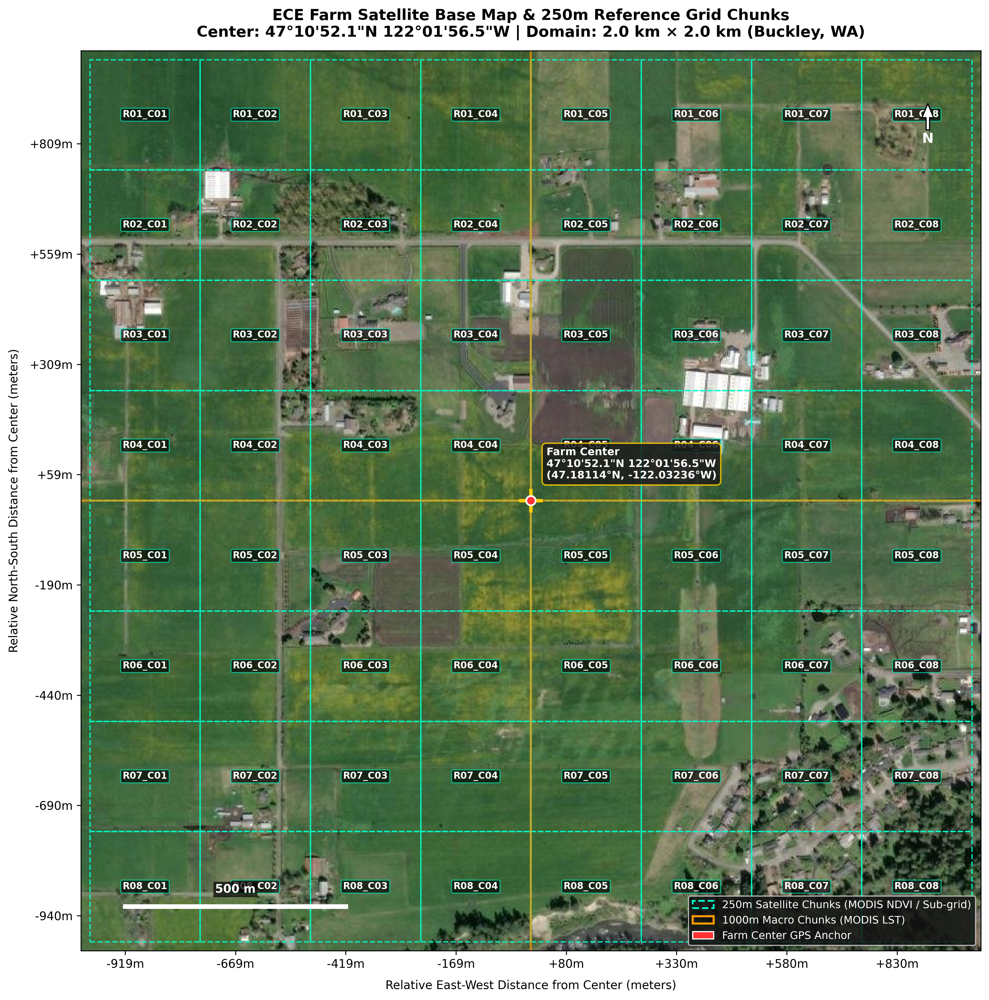
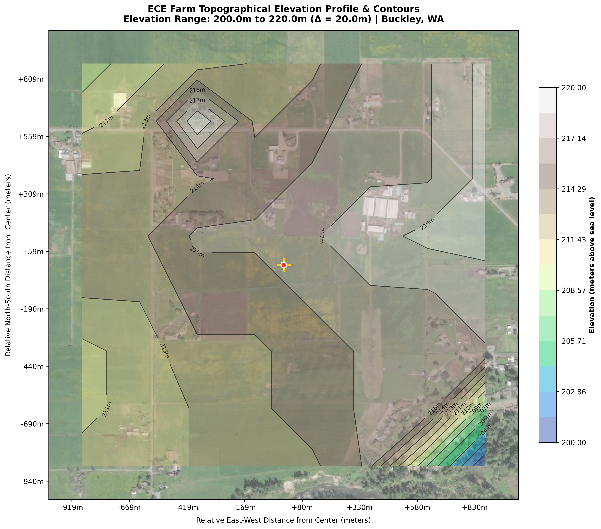

# ECE Farm Satellite Base Map & Grid Chunk Validation

## 1. Executive Summary

This experiment creates high-resolution satellite basemaps with dynamic satellite and static soil grid overlays for the new ECE soil moisture sensor deployment near Buckley / Enumclaw, Pierce County, Washington.

- **Farm Center Coordinates**: $47^\circ 10' 52.1''\text{ N}, 122^\circ 01' 56.5''\text{ W}$ ($47.181139^\circ\text{ N}, -122.032361^\circ\text{ W}$)
- **Spatial Extent**: $2.0\text{ km} \times 2.0\text{ km}$ square bounding box ($\pm 1.0\text{ km}$ East-West and North-South from center)
- **Bounding Box (WGS-84)**: $[47.1750^\circ\text{ N}, 47.1872^\circ\text{ N}]$, $[-122.0413^\circ\text{ W}, -122.0234^\circ\text{ W}]$
- **Grid Partitions**: $8 \times 8 = 64$ chunks ($250\text{ m} \times 250\text{ m}$ per chunk)

### Motivation & Problem Addressed
In previous sensor deployments (e.g. Bellevue Botanical Garden, Renton garden), sensor nodes placed in close proximity ($\sim 50\text{ m}$ apart) fell into identical satellite pixel footprints and buffer extraction zones. As a result, the spatial machine learning models predicted identical soil moisture values despite ground-truth variations.

Because this farm is large enough to span multiple satellite and soil chunks, this tool provides visual field reference maps and statistically proves that deploying sensors across different grid chunks supplies distinct satellite and soil feature vectors to the model.

---

## 2. Satellite Base Map & Dynamic Satellite Grid Overlay

The base map uses high-resolution **Esri World Imagery** overlaid with $250\text{ m} \times 250\text{ m}$ operational satellite chunks (`R01_C01` to `R08_C08`) and $1000\text{ m}$ macro quadrants (MODIS LST scale). The exact farm center GPS reference is marked with a crosshair and coordinate callout.

---

## 3. Static Soil Features & Texture Grid Overlay

Soil properties are critical static predictors in MDR soil moisture models. We integrate **USDA NRCS SSURGO** soil survey map units and **ISRIC SoilGrids 250m** texture profiles:
- **Buckley series** (`mukey: 300971`): Buckley gravelly loam, 0 to 3% slopes, poorly drained, high organic matter ($10.0\%$), bulk density $1.05\text{ g/cm}^3$.
- **Wilkeson series** (`mukey: 300985`): Wilkeson silt loam, 0 to 6% slopes, moderately well drained, $58.0\%$ silt, $7.5\%$ OM, bulk density $1.15\text{ g/cm}^3$.
- **Kapowsin series** (`mukey: 300962`): Kapowsin gravelly loam, 0 to 6% slopes, upland glacial till, bulk density $1.25\text{ g/cm}^3$.

---

## 4. Topographical Elevation & Slope Profile

Across the $2.0\text{ km} \times 2.0\text{ km}$ territory, high-resolution topography (USGS 3DEP / Open-Meteo) reveals a $20+\text{ m}$ elevation gradient ($200.0\text{ m}$ in the lowland alluvial drainage channels to $220.0\text{ m}$ on the higher glaciated terraces).

---

## 5. Statistical Feature Validation & Inter-Chunk Separability

All dynamic satellite, static soil, and topographical features were extracted across all 64 grid chunks. Inter-chunk variance ($\sigma > 0$) and coefficient of variation ($CV$) were computed to verify feature differentiation:

| Feature | Mean | Std | Min | Max | CV (%) | Distinct Values Confirmed |
| :--- | :--- | :--- | :--- | :--- | :--- | :--- |
| `elevation_m` | 214.44 | 3.31 | 200.00 | 220.00 | 1.54% | **True** |
| `slope_deg` | 0.49 | 0.59 | 0.11 | 3.01 | 120.42% | **True** |
| `sand_pct` | 31.82 | 8.74 | 27.60 | 56.50 | 27.45% | **True** |
| `clay_pct` | 13.31 | 0.62 | 11.30 | 13.90 | 4.67% | **True** |
| `silt_pct` | 54.87 | 8.21 | 32.00 | 59.30 | 14.96% | **True** |
| `organic_matter_pct` | 7.78 | 0.79 | 7.30 | 10.00 | 10.18% | **True** |
| `bulk_density_g_cm3` | 1.18 | 0.04 | 1.05 | 1.21 | 3.48% | **True** |
| `sand_clay_ratio` | 2.43 | 0.84 | 2.01 | 5.00 | 34.57% | **True** |
| `opt_red_mean` | 82.53 | 12.55 | 49.60 | 116.00 | 15.21% | **True** |
| `opt_green_mean` | 106.71 | 7.47 | 81.30 | 128.90 | 7.00% | **True** |
| `opt_blue_mean` | 70.11 | 10.87 | 51.80 | 106.30 | 15.50% | **True** |
| `opt_grvi` | 0.15 | 0.05 | 0.04 | 0.29 | 37.38% | **True** |
| `opt_vari` | 0.23 | 0.09 | 0.07 | 0.47 | 37.83% | **True** |

---

## 6. Field Deployment Reference Coordinates

Representative sampling of chunk coordinates across the farm sectors (full database available in `farm_grid_chunks.csv`):

| Chunk ID | Row | Col | Center Lat (°N) | Center Lon (°W) | Elevation (m) | Soil Series | Sand (%) | Clay (%) | OM (%) | Greenness (GRVI) |
| :--- | :--- | :--- | :--- | :--- | :--- | :--- | :--- | :--- | :--- | :--- |
| `R08_C01` | 8 | 1 | 47.17580 | -122.04022 | 213.0 | Wilkeson | 27.6 | 13.3 | 7.5 | 0.045 |
| `R08_C05` | 8 | 5 | 47.17580 | -122.03124 | 215.0 | Wilkeson | 28.7 | 13.3 | 7.5 | 0.198 |
| `R07_C01` | 7 | 1 | 47.17743 | -122.04022 | 200.0 | Buckley | 53.8 | 12.2 | 10.0 | 0.142 |
| `R07_C05` | 7 | 5 | 47.17743 | -122.03124 | 215.0 | Wilkeson | 28.7 | 13.4 | 7.5 | 0.125 |
| `R06_C01` | 6 | 1 | 47.17906 | -122.04022 | 200.0 | Buckley | 53.8 | 12.4 | 10.0 | 0.187 |
| `R06_C05` | 6 | 5 | 47.17906 | -122.03124 | 215.0 | Wilkeson | 28.7 | 13.6 | 7.5 | 0.163 |
| `R05_C01` | 5 | 1 | 47.18070 | -122.04022 | 216.0 | Wilkeson | 27.6 | 13.9 | 7.5 | 0.144 |
| `R05_C05` | 5 | 5 | 47.18070 | -122.03124 | 215.0 | Wilkeson | 28.7 | 13.9 | 7.5 | 0.155 |
| `R04_C01` | 4 | 1 | 47.18233 | -122.04022 | 216.0 | Wilkeson | 27.6 | 14.1 | 7.5 | 0.160 |
| `R04_C05` | 4 | 5 | 47.18233 | -122.03124 | 216.0 | Wilkeson | 28.7 | 14.1 | 7.5 | 0.188 |
| `R03_C01` | 3 | 1 | 47.18397 | -122.04022 | 216.0 | Wilkeson | 27.6 | 14.3 | 7.5 | 0.112 |
| `R03_C05` | 3 | 5 | 47.18397 | -122.03124 | 217.0 | Wilkeson | 28.7 | 14.3 | 7.5 | 0.152 |
| `R02_C01` | 2 | 1 | 47.18560 | -122.04022 | 211.0 | Buckley | 53.8 | 12.4 | 9.9 | 0.089 |
| `R02_C05` | 2 | 5 | 47.18560 | -122.03124 | 217.0 | Wilkeson | 28.7 | 14.4 | 7.5 | 0.176 |
| `R01_C01` | 1 | 1 | 47.18724 | -122.04022 | 211.0 | Buckley | 53.8 | 12.6 | 9.9 | 0.201 |
| `R01_C05` | 1 | 5 | 47.18724 | -122.03124 | 217.0 | Wilkeson | 28.7 | 14.6 | 7.5 | 0.149 |

---

## 7. Field Placement Guidelines for ECE Team

1. **Inter-Chunk Spacing**: Avoid placing multiple sensor nodes inside the same $250\text{ m} \times 250\text{ m}$ chunk unless testing local micro-variance. Placing nodes at least $1$ chunk apart ($> 250\text{ m}$) ensures independent satellite feature sampling.
2. **Soil Series Diversity**: Prioritize placing at least one sensor node in a **Buckley gravelly loam** chunk (e.g. `R07_C01`, `R06_C01`) and at least one node in a **Wilkeson silt loam** chunk (e.g. `R05_C05`, `R04_C05`) to capture contrasting soil texture and drainage behavior.
3. **Topographical Distribution**: Place sensors across the elevation gradient ($200\text{m}$ lowland vs $217\text{m}$ upland) to validate how the model handles topographic drainage regimes.
